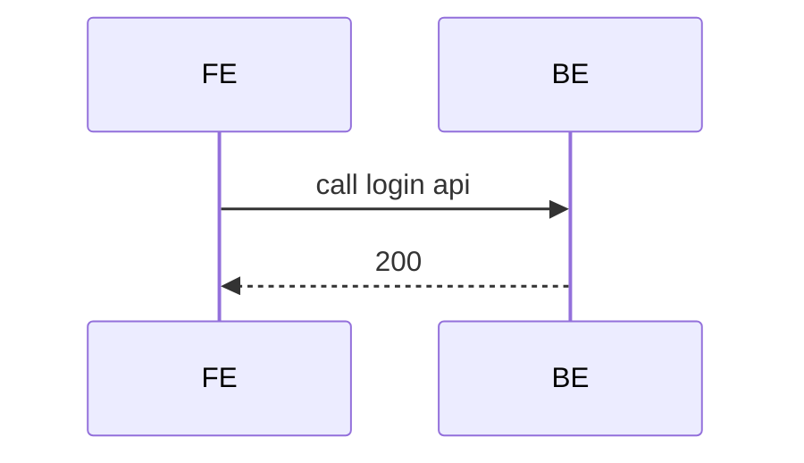
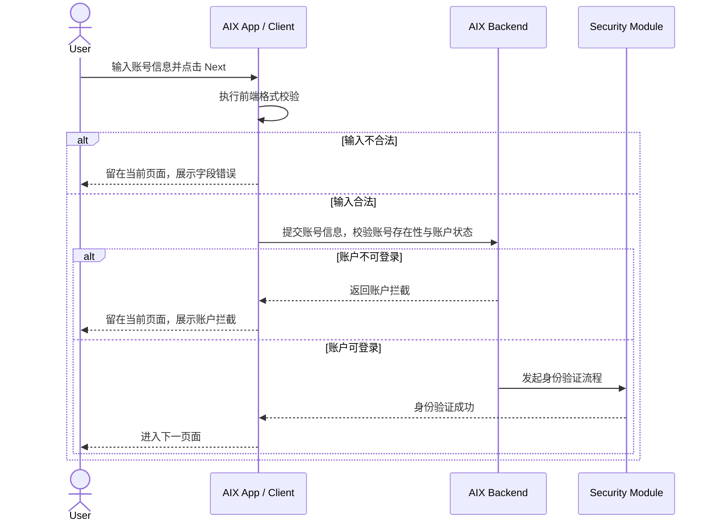

# prd-for-ai 实施计划

版本：v1.2  
状态：执行中  
适用仓库：`prd-for-ai`
更新时间：2026-05-01

## 1. 文档定位

本文件是 `prd-for-ai` 仓库的长期实施主控文件。

本项目会跨多个对话、多个时间段持续推进。后续每次开始执行前，必须先读取本文件，确认当前阶段、当前模块、待办任务和验收标准，再继续执行。

本文件优先级高于临时对话结论。若临时任务与本实施计划冲突，必须先更新本实施计划，再执行具体任务。

---

## 2. 项目目标

建设 AIX 的 AI-readable PRD 知识库，使其成为后续编写 PRD、评审需求、生成 UI、辅助开发和测试的事实来源。

核心目标：

1. 将历史 PRD 统一归档，作为不可随意修改的原始事实源。
2. 将 DTC、AAI、WalletConnect、OBOSS 等外部系统能力沉淀为独立事实层。
3. 将历史 PRD 与接口文档转译为结构化 Markdown，形成 AI 可读、可检索、可复用的知识库。
4. 将状态、字段、错误码、国家线、限额、合规边界沉淀为全局规则。
5. 支撑后续 AI 辅助编写新 PRD 时，能准确复用既有业务规则、接口、状态机、异常处理和验收标准。
6. 保证所有知识均可追溯到原始 PRD、接口文档或已确认的项目结论，禁止无来源推测。

---

## 3. 仓库分层原则

`历史prd/`、`DTC接口文档/`、其他外部系统文档均属于原始事实源，不直接修改。

```text
┌────────────────────────────┐
│ 原始事实源                   │
│ - 历史prd/                   │
│ - DTC接口文档/               │
│ - 外部系统/接口/评审结论      │
└──────────────┬─────────────┘
               │ 提取 / 映射 / 转译
               ▼
┌────────────────────────────┐
│ knowledge-base/             │
│ AI-readable 事实知识库        │
│ 规则 / 流程 / 状态 / 字段      │
└──────────────┬─────────────┘
               │ 复用
               ▼
┌────────────────────────────┐
│ prd-template/               │
│ 后续新 PRD 写作模板           │
└────────────────────────────┘
```

### 3.1 原始事实源规则

- 原始 PRD、接口文档、截图、评审结论仅作为事实来源保留。
- 不直接修改原始文件内容。
- 不在原始目录内做结构化加工。
- 若原始事实源之间存在冲突，必须记录到 `knowledge-base/changelog/knowledge-gaps.md` 或相关冲突记录，不得自行拍板。

### 3.2 Knowledge Base 规则

目录：

```text
knowledge-base/
```

规则：

- 作为 AI、产品、UI、开发、测试、业务的主要读取对象。
- 只写可验证、可追溯的业务事实。
- 每个规则必须尽量关联来源文档、章节或接口文档。
- 不写推测，不写未确认方案。
- 功能正文不写评审型内容；不确定点集中进入 `knowledge-base/changelog/knowledge-gaps.md`。

### 3.3 PRD Template 规则

目录：

```text
prd-template/
```

用途：

- 沉淀新 PRD 的标准章节。
- 统一需求描述、状态机、字段、异常、验收、风控、合规边界写法。
- 未来写新 PRD 时，优先引用 `knowledge-base/` 中的既有事实。

---

## 4. 推荐目录结构

最终建议结构如下：

```text
knowledge-base/
├── _meta/                       # 全局事实与写作规范
│   ├── glossary.md
│   ├── countries-and-regions.md
│   ├── status-dictionary.md
│   ├── field-dictionary.md
│   ├── error-code-dictionary.md
│   ├── limits-and-rules.md
│   ├── compliance-boundaries.md
│   ├── source-policy.md
│   ├── writing-standard.md
│   ├── module-template.md
│   └── feature-template.md
│
├── integrations/                # 外部系统事实源
│   ├── _index.md
│   ├── dtc/
│   ├── aai/
│   ├── walletconnect/
│   └── oboss/
│
├── common/                      # APP 通用能力
│   ├── _index.md
│   ├── common-error-pages.md
│   ├── common-popups.md
│   ├── faq.md
│   └── notification-content.md
│
├── account/                     # 注册、登录、忘记密码
├── security/                    # OTP、Email OTP、Passcode、Bio、Face、IVS
├── wallet/                      # KYC、资产、充值、转账、兑换
├── card/                        # 申卡、激活、PIN、卡管、敏感信息
├── transaction/                 # 全量交易、卡交易、钱包交易、状态类型
├── growth/                      # MGM、Push、Message Center、Banner、Popup、Waitlist
├── website/                     # 官网一期、官网二期、外部投放
├── platform/                    # OBOSS、多语言、系统邮件等平台能力
├── assets/                      # 图片资源
└── changelog/                   # 实施日志、知识缺口、冲突记录
```

### 4.1 app-common 迁移口径

原 `knowledge-base/README.md` 中的 `app-common` 后续统一迁移为 `common`。

后续不再新增 `app-common` 目录。FAQ、通用错误页、通用弹窗、通知内容等统一归入 `common/`。

---

## 5. 模块拆分规则

采用“模块目录 + 功能文件”的结构。

原则：

- 一个业务模块一个目录。
- 一个核心能力一个 Markdown 文件。
- 复杂模块可拆出状态、字段、接口文件。
- 不按原始 PRD 文件机械拆分。
- 不拆成页面级小文件，避免维护成本过高。
- 资金、交易、KYC、卡、钱包相关模块必须单独沉淀状态机与字段规则。
- 公共规则不在各功能文件中重复维护，应沉淀到 `_meta/` 或对应公共模块。

推荐粒度示例：

```text
wallet/
├── _index.md
├── kyc.md
├── deposit-gtr.md
├── deposit-walletconnect.md
├── send.md
├── swap.md
├── receive.md
└── wallet-status-and-fields.md
```

```text
card/
├── _index.md
├── application.md
├── activation.md
├── card-management.md
├── pin.md
├── sensitive-info.md
└── card-status-and-fields.md
```

```text
transaction/
├── _index.md
├── transaction-history.md
├── card-transaction.md
├── crypto-transaction.md
├── otc-transaction.md
└── transaction-status-and-type.md
```

---

## 6. 单个功能文件标准结构

每个核心功能文件应使用统一结构。

```markdown
---
module:
feature:
version:
status:
source_doc:
source_section:
last_updated:
owner:
depends_on:
---

# 功能名称

## 1. 功能定位
说明该功能解决什么问题，只写事实，不写愿景。

## 2. 适用范围
说明适用国家、用户状态、账户状态、卡状态、钱包状态等。

## 3. 前置条件
说明用户必须满足什么条件。

## 4. 业务流程
包含主链路、Mermaid sequenceDiagram、业务逻辑矩阵。

## 5. 页面关系总览
使用 Mermaid flowchart 表达页面地图。只表达页面节点和跳转关系，不展开业务校验。

## 6. 页面卡片与交互规则
说明页面、按钮、输入框、校验、跳转、截图引用。

## 7. 字段与接口依赖
说明接口、字段、读写关系、系统动作、异步回调。

## 8. 异常与失败处理
说明失败场景、错误提示、重试、兜底动作、最终状态。

## 9. 风控 / 合规边界
涉及账户、资金、卡、交易、KYC 时必须说明。

## 10. 来源引用
列出原始 PRD、接口文档、章节、版本。
```

禁止在功能正文中固定保留：

- `readers` frontmatter。
- 多角色阅读视角。
- 待确认事项章节。
- 试验版 / 方案 A/B/C 等过程性内容。

不确定点统一记录到：

```text
knowledge-base/changelog/knowledge-gaps.md
```

---

## 7. 流程图与页面地图规则

### 7.1 业务流程与系统交互

核心业务流程统一使用 Mermaid `sequenceDiagram`。

定位：

- 表达产品业务流程和系统交互。
- 不替代页面概览图。
- 写法使用“时序图形式 + 职能泳道图表达 + 业务规则语言”。

写法要求：

- 参与方按职责分层，例如 User、Client / AIX App、Backend / AIX Backend、Security Module、Device OS、DTC / AAI / Third Party。
- 文案写业务动作，不写纯技术调用。
- 异常分支必须写清失败原因、系统动作、用户/状态落点。
- 使用 `alt / else / end` 表达分支。
- 复杂流程可按子链路拆分，但仍放在同一功能文件内。

不推荐：



推荐：



### 7.2 页面关系总览

页面关系总览统一使用 Mermaid `flowchart` 表达页面地图。

定位：

- 只表达当前功能涉及的页面节点和页面跳转关系。
- 不表达业务流程、系统交互、字段规则、后端校验、风控判断、异常处理细节。

要求：

- 必须完整覆盖当前功能相关的页面、弹窗页、认证页、结果页、异常承接页。
- 不得为了追求简洁而删除页面节点。
- 不限制节点数量；复杂功能应通过 `subgraph` 分组控制可读性。
- 连线文案只写短动作或短入口，例如 Next、Submit、Confirm、Back、Close、Enable now。
- 复杂业务条件放在第 4 章业务流程或业务逻辑矩阵中。
- 实线表示正常页面跳转，虚线表示异常 / 拦截 / 失败承接。

推荐分组：

```text
入口层
主页面层
分支页面 / 能力页
结果页 / 异常承接
```

---

## 8. 图片与截图规则

图片继续保留，但不作为唯一事实表达。

规则：

1. 原 PRD 截图保留在 `knowledge-base/assets/`。
2. 页面截图可作为证据引用，但规则必须写成文字。
3. 原始 PRD 页面概览截图可以保留，但只能作为追溯证据，不作为主要规则表达。
4. 如果截图与文字规则冲突，以文字规则为准，并标记冲突点。
5. 不删除历史截图，除非确认重复或错误。

表达优先级：

```text
结构化 Markdown 规则 > Mermaid 图 > 页面截图
```

---

## 9. 来源与引用规则

所有知识必须有来源。

来源优先级：

1. `历史prd/` 原始 PRD
2. `DTC接口文档/` 接口文档
3. 已确认的项目规则 / 评审结论
4. 外部公开资料，仅用于行业、政策、竞品，不作为 AIX 内部规则来源

禁止：

- 无来源推测。
- 把未确认事项写成已确认规则。
- 私自补全接口字段。
- 私自改变状态机。
- 私自改变资金路径。
- 私自改变风控 / 合规边界。

如发现冲突，必须标记：

```markdown
## 冲突 / 待确认

- 冲突点：
- 涉及文件：
- 影响范围：
- 建议确认人：
- 当前处理：
```

---

## 10. 后续实施路线表

| 顺序 | 阶段 | 目标 | 主要动作 | 产出 | 状态 |
|---|---|---|---|---|---|
| 1 | 样板收口 | 固化 Login 样板 | 检查 Login 是否符合新规范：时序图、页面地图、知识缺口集中管理 | `knowledge-base/account/login.md` | 进行中 |
| 2 | 规范同步 | 更新主实施计划 | 将最新规范写入本文件，删除旧口径 | `IMPLEMENTATION_PLAN.md v1.2` | 进行中 |
| 3 | Account 完成 | 补齐账号模块 | 按 Login 样板整理 Registration / Forgot Password / Account Index | `knowledge-base/account/*.md` | 待执行 |
| 4 | Security 对齐 | 建公共认证事实源 | 统一 OTP / Email OTP / Passcode / BIO / IVS 规则 | `knowledge-base/security/*.md` | 待执行 |
| 5 | 全局规则抽取 | 避免规则重复 | 抽账户状态、认证规则、BIO规则、设备规则、字段字典 | `_meta/*` + `security/*` | 待执行 |
| 6 | Login 回扫 | 去重复、强引用 | Login 中公共规则改为引用全局规则，不重复写多遍 | `login.md` 精修版 | 待执行 |
| 7 | Card 模块 | 转译卡核心流程 | Application / Manage / Transaction / 状态字段 | `knowledge-base/card/*.md` | 待执行 |
| 8 | Wallet 模块 | 转译钱包核心流程 | KYC / Deposit / Receive / Send / Swap / GTR / WalletConnect | `knowledge-base/wallet/*.md` | 待执行 |
| 9 | Transaction 模块 | 建交易事实层 | 交易类型、交易状态、历史记录、卡交易、钱包交易 | `knowledge-base/transaction/*.md` | 待执行 |
| 10 | Integrations | 外部系统事实源 | DTC / AAI / WalletConnect / OBOSS 能力、字段、状态 | `knowledge-base/integrations/*` | 待执行 |
| 11 | Common / Platform | 通用能力 | 通用弹窗、错误页、FAQ、通知、多语言、系统邮件 | `common/*` / `platform/*` | 待执行 |
| 12 | PRD Template | 新 PRD 写作模板 | 基于知识库规则生成新 PRD 模板 | `prd-template/*` | 待执行 |
| 13 | 验收机制 | 长期维护 | 模块验收清单、冲突处理、知识缺口、版本管理 | `changelog/*` + checklist | 待执行 |

---

## 11. 第一阶段完成标准

当前第一阶段指：样板收口 + 规范同步。

完成标准：

- `IMPLEMENTATION_PLAN.md` 已更新到 v1.2。
- `knowledge-base/_meta/writing-standard.md` 已包含流程图与页面地图规范。
- `knowledge-base/account/login.md` 已作为 Login 样板，包含：
  - 标准 frontmatter。
  - 1–10 标准章节。
  - Mermaid `sequenceDiagram` 业务流程与系统交互图。
  - Mermaid `flowchart` 页面地图。
  - 页面截图与页面卡片。
  - 字段与接口依赖。
  - 异常与失败处理。
  - 风控 / 合规边界。
  - 来源引用。
- `knowledge-base/changelog/knowledge-gaps.md` 已集中承接 Login 知识缺口。
- PR #5 可作为后续 Account / Security 模块样板。

---

## 12. 模块验收标准

每个模块必须满足：

- 有 `_index.md`。
- 有功能清单。
- 有适用范围。
- 有核心流程。
- 有状态机，或说明不适用。
- 有字段与接口依赖。
- 有异常处理。
- 有风控 / 合规边界。
- 有来源引用。
- 有知识缺口记录或明确无缺口。
- 有 Mermaid `sequenceDiagram` 表达业务流程与系统交互。
- 有 Mermaid `flowchart` 表达页面关系总览。
- 不把推测写成事实。

---

## 13. 单个功能验收标准

每个功能文件必须能回答：

1. 这个功能是什么？
2. 谁可以用？
3. 前置条件是什么？
4. 业务流程怎么走？
5. 系统交互怎么发生？
6. 页面关系是什么？
7. 失败怎么办？
8. 依赖哪些状态？
9. 依赖哪些接口和字段？
10. 涉及哪些风控 / 合规边界？
11. UI 能否据此画页面？
12. 开发能否据此理解接口与状态？
13. 测试能否据此写测试用例？
14. 业务能否据此判断支持 / 不支持范围？
15. AI 能否据此复用到新 PRD？
16. 来源文档是什么？
17. 还有哪些缺口或冲突？

---

## 14. 跨对话执行规则

由于本项目会跨多个对话、多个时间段执行，后续每次开始任务前必须先读取：

1. `IMPLEMENTATION_PLAN.md`
2. `knowledge-base/_meta/writing-standard.md`
3. 当前目标模块的 `_index.md`
4. 相关功能文件
5. `knowledge-base/changelog/knowledge-gaps.md`
6. 相关原始 PRD 或接口文档

每次执行必须遵守：

- 先确认当前阶段。
- 再确认当前模块。
- 再确认待办任务。
- 不直接跨阶段批量重构，除非用户明确开启代理模式并限定范围。
- 每次修改必须能回溯来源。
- 发现冲突必须先记录冲突，不得自行拍板。
- 当前阶段完成前，不启动下一阶段代理执行。

---

## 15. 当前状态

| 模块 | 状态 | 说明 |
|---|---|---|
| IMPLEMENTATION_PLAN | 进行中 | v1.2 正在更新 |
| writing-standard | 已更新 | 已包含时序图与页面地图规范 |
| Account / Login | 进行中 | 已完成样板结构，需最终 review |
| Account / Registration | 待执行 | 下一阶段按 Login 样板重构 |
| Account / Forgot Password | 待执行 | 下一阶段按 Login 样板重构 |
| Security | 待执行 | 需统一公共认证事实源 |
| Wallet | 待转译 | 原始 PRD 已归档 |
| Card | 待转译 | 原始 PRD 已归档 |
| Transaction | 待转译 | 原始 PRD 已归档 |
| Growth | 待转译 | 原始 PRD 已归档 |
| Website | 待转译 | 原始 PRD 已归档 |
| Platform | 待转译 | 原始 PRD 已归档 |
| Common | 待建设 | FAQ、通用错误页、通用弹窗、通知内容待结构化 |
| Integrations | 待建设 | DTC、AAI、WalletConnect、OBOSS 外部事实层待结构化 |
| prd-template | 待建设 | 新 PRD 写作模板待建设 |

---

## 16. 下一步

当前第一阶段剩余任务：

1. Review `IMPLEMENTATION_PLAN.md v1.2` 是否与最新规范一致。
2. Review `knowledge-base/account/login.md` 是否满足第一阶段样板要求。
3. 如无问题，关闭或废弃旧 PR #4，保留 PR #5 作为 clean PR。
4. 第一阶段完成后，再进入 Account 完整化阶段。

第二阶段建议任务：

1. 按 Login 样板重构 `registration.md`。
2. 按 Login 样板重构 `forgot-password.md`。
3. 更新 `account/_index.md`。
4. 统一 Account 模块内的来源引用和知识缺口记录。
