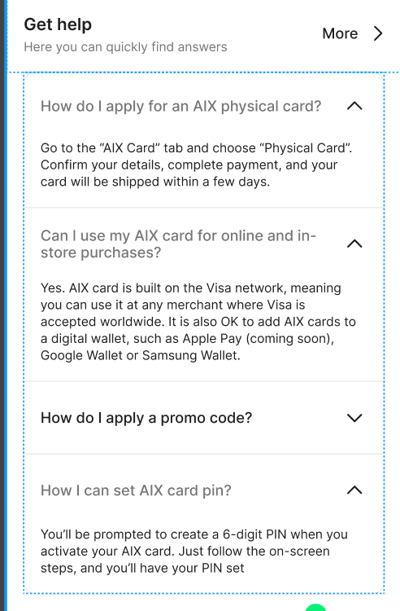
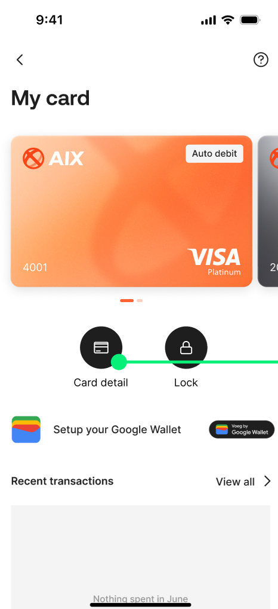
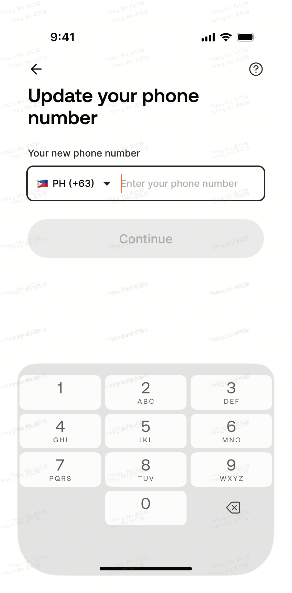
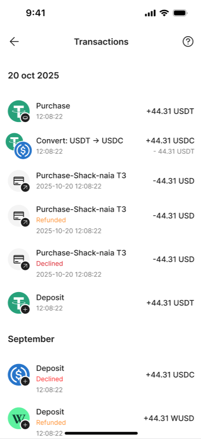
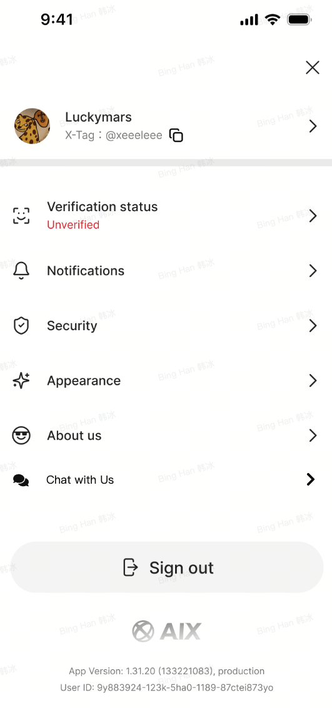
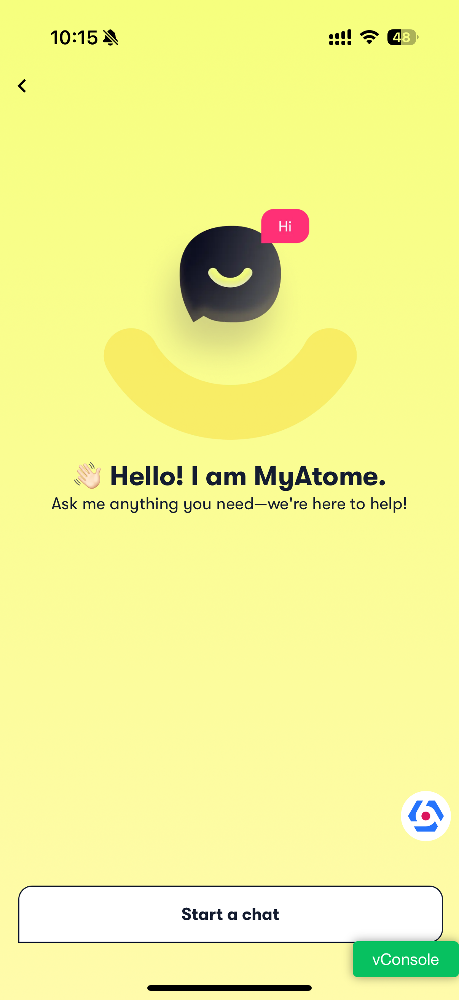
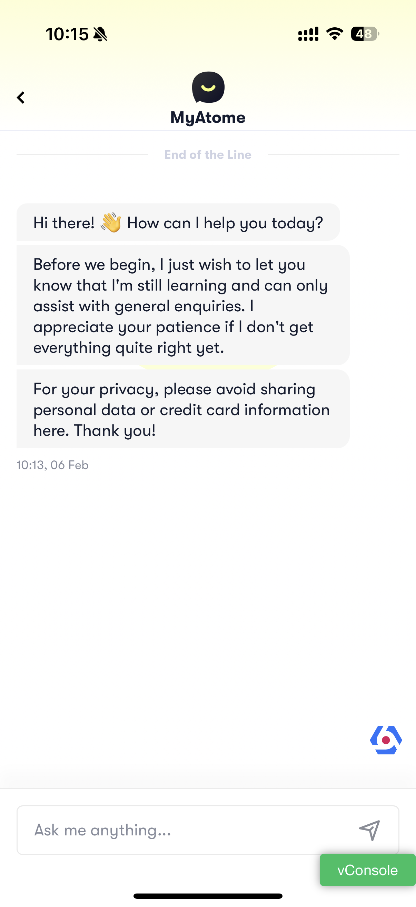

# AIX APP V1.0 【FAQ】

# 1. 引言

1.1 **需求索引**

**\[同步块-无权限下载此内容\]**

# 2. 全局说明

2.1 **FAQ全局问题库说明**

<table style="width:88%;">
<colgroup>
<col style="width: 88%" />
</colgroup>
<tbody>
<tr>
<td>
当前FAQ会展示在不同功能页面，有些是入口，有些是最近问题，有些是问题页面；

<del>由于没有做Oboss可视化编辑，故要结合场景及类型定义FAQ并预设到后端；</del>
</td>
</tr>
</tbody>
</table>

# 3. 功能需求

3.1 **~~当前操作页面~~**

~~不显示FAQ的，仅有问题入口；~~

~~显示FAQ的，根据**关键场景、类型**筛选最近3条FAQ展示给用户；~~

~~FAQ默认只显示问题折叠答案，点击任意一个问题只显示当前这条的答案；~~

3.2 **FAQ页面**

~~FAQ暂未做OBoss可视化编辑Dashboard，先预设到数据库（**问题 ID、标题、描述、关联场景、类型、超链接、创建时间**）；~~

~~根据关键场景、类型区分不同页面的FAQ，并按创建时间降序排列展示对应FAQ给用户，滑动加载更多，不翻页；~~

~~FAQ默认只显示问题折叠答案，点击任意一个问题只显示当前这条的答案~~

<table style="width:90%;">
<colgroup>
<col style="width: 3%" />
<col style="width: 4%" />
<col style="width: 5%" />
<col style="width: 7%" />
<col style="width: 26%" />
<col style="width: 9%" />
<col style="width: 5%" />
<col style="width: 4%" />
<col style="width: 3%" />
<col style="width: 3%" />
<col style="width: 3%" />
<col style="width: 4%" />
<col style="width: 3%" />
<col style="width: 3%" />
</colgroup>
<tbody>
<tr>
<td rowspan="2" style="text-align: center;"><strong>功能模块</strong></td>
<td rowspan="2" style="text-align: center;"><strong>操作步骤</strong></td>
<td rowspan="2" style="text-align: center;"><strong>操作页面</strong></td>
<td rowspan="2" style="text-align: left;"><strong>FAQ内容</strong></td>
<td rowspan="2" style="text-align: center;"><strong>具体内容</strong></td>
<td rowspan="2" style="text-align: center;"><strong>更多入口</strong></td>
<td rowspan="2" style="text-align: left;"><strong>备注</strong></td>
<td style="text-align: center;"><strong><del>FAQ存数据库并支持可配置</del></strong></td>
<td style="text-align: center;"></td>
<td style="text-align: center;"></td>
<td style="text-align: center;"></td>
<td style="text-align: center;"></td>
<td style="text-align: left;"></td>
<td style="text-align: center;"></td>
</tr>
<tr>
<td style="text-align: center;"><strong><del>问题 ID</del></strong></td>
<td style="text-align: center;"><strong><del>标题</del></strong></td>
<td style="text-align: center;"><strong><del>描述</del></strong></td>
<td style="text-align: center;"><strong><del>关联场景</del></strong></td>
<td style="text-align: center;"><strong><del>类型</del></strong></td>
<td style="text-align: center;">
<strong><del>超链接</del></strong>

<del>（预留字段）</del>
</td>
<td style="text-align: center;"><strong><del>创建时间</del></strong></td>
</tr>
<tr>
<td style="text-align: left;">首页</td>
<td style="text-align: left;">AIX首页</td>
<td style="text-align: left;">
最近3条

</td>
<td style="text-align: center;"></td>
<td style="text-align: left;">
展示三个，服务端配置文件。

Q：

What types of cards does AIX Pay offer?

A：

AIX Pay offers two card types: a Physical Card for everyday in-store use and a Virtual Card for online and digital payments. Each card has its own unique number and works just like a debit card, letting you spend directly from your stablecoin balance.

Getting started is simple, just apply for an AIX Pay card, deposit your preferred stablecoin into your AIX Pay account, and you're ready to spend.

For added convenience, you can easily add your card to Google Pay or Apple Pay and enjoy seamless tap-to-pay transactions wherever you go.

Q：

Who is eligible to open an AIX Pay account?

A：

You're eligible as long as you can provide a valid passport and a proof of address document that matches your country of residence.

Q：

How do I apply for a AIX Pay card? 
A：

Applying for your AIX Pay card is simple! Just follow these steps based on either a virtual card (for instant online usage) or a physical card (for in-store and ATM withdrawals).

Virtual Card

Download the AIX Pay app and create your account.

Head to the "AIX Pay Card" tab and tap "Get Card".

Select Virtual Card and choose your favorite design.

Link your preferred stablecoin and tap "Apply Card".

Review your account details, tap "Checkout" and pay the USD $5 application fee.

You're all set! Your virtual card will be ready to use in just a few minutes.

Physical Card

Download the AIX Pay app and create your account

Head to the "AIX Pay Card" tab and tap "Get Card".

Select Physical Card and choose your favorite design.

Link your preferred stablecoin and tap "Apply Card".

Review your mailing address, tap "Checkout", and pay the USD $10 application fee.

You're all set! You can expect your physical within a few days.

Tips:

- You can add your virtual and physical cards to digital wallets like Google Pay, Apple Pay, or Samsung Pay for seamless tap-to-pay purchases.

- Make sure you have enough balance in card’s default currency.
</td>
<td style="text-align: left;">
@Bing Han 韩冰提供链接，链接配置到服务端。没有链接，则不显示【more】入口。

Zendesk Sections

<strong>AIX Account Opening &amp; Cards Application</strong>

Link：<a href="https://aixpay.zendesk.com/hc/en-gb/sections/15087268806159">https://help.aixpay.co/hc/en-gb/sections/15087268806159</a>
</td>
<td style="text-align: left;"></td>
<td style="text-align: left;"></td>
<td style="text-align: left;"></td>
<td style="text-align: left;"></td>
<td style="text-align: left;"><strong><del>Home</del></strong></td>
<td style="text-align: left;"><strong><del>Get Help</del></strong></td>
<td style="text-align: left;"></td>
<td style="text-align: left;"></td>
</tr>
<tr>
<td rowspan="3" style="text-align: left;"><strong>申卡</strong></td>
<td style="text-align: left;"><strong>选择卡类型-虚拟卡</strong></td>
<td style="text-align: left;">
最近3条

</td>
<td style="text-align: left;"></td>
<td style="text-align: left;">
展示三个，服务端配置文件。

Q: Is there a fee to apply for the card? 
A:

Yes, there's a small application fee of USD $5 to apply for a virtual card.

Good news – we occasionally run promotional offers on card fees, so keep an eye out for special deals!

Q: How do I activate my card once I receive it?

A:

Your virtual card doesn't need activation! Once your application is approved, it's automatically active and ready to use right away.

Tip: You can add your virtual cards to digital wallets like Google Pay, Apple Pay, or Samsung Pay for seamless tap-to-pay purchases.

Q: Why can't I pay the card fee even though I have enough balance? 
A:

Your card fee can only be paid using the stablecoin that matches your card’s default currency. At this time, payments with other stablecoins aren’t supported.

What you can do:

- Top up the stablecoin that matches your card’s default currency, or

- Update your card’s default currency to match the stablecoin balance you’d like to use
</td>
<td style="text-align: left;">
@Bing Han 韩冰提供链接，链接配置到服务端。没有链接，则不显示【more】入口。

Zendesk Sections

<strong>Card Delivery &amp; Activation</strong>

https://help.aixpay.co/hc/en-gb/sections/15087280899855
</td>
<td style="text-align: left;"></td>
<td style="text-align: left;"></td>
<td style="text-align: left;"></td>
<td style="text-align: left;"></td>
<td style="text-align: left;"><strong><del>Apply Card</del></strong></td>
<td style="text-align: left;"><strong><del>Virtual Card</del></strong></td>
<td style="text-align: left;"></td>
<td style="text-align: left;"></td>
</tr>
<tr>
<td style="text-align: left;"><strong>选择卡类型-实体卡</strong></td>
<td style="text-align: left;">
最近3条

</td>
<td style="text-align: left;"></td>
<td style="text-align: left;">
展示三个，服务端配置文件。

Q：

Is there a fee to apply for the card?

A：

Yes, there's a small application fee of USD $10 to apply for a physical card.

Good news – we occasionally run promotional offers on card fees, so keep an eye out for special deals!

Q：

When can I expect my card to arrive? 
 
A:

Delivery time is 3-15 business days

Once your card arrives, you can activate it and start using it right away. Please note that delivery might sometimes take longer due to customs, courier delays, or unforeseen circumstances.

Q：

Can I change the card delivery address once the card has been approved? 
A：

Once your card is approved, the delivery address can’t be changed. Make sure your details are correct when applying to avoid any issues. The courier will attempt delivery three times. If all attempts fail, the card will be destroyed, and you’ll need to order a new one.
</td>
<td style="text-align: left;">
@Bing Han 韩冰提供链接，链接配置到服务端。没有链接，则不显示【more】入口。

Zendesk Sections

<strong>Card Delivery &amp; Activation</strong>

https://help.aixpay.co/hc/en-gb/sections/15087280899855
</td>
<td style="text-align: left;"></td>
<td style="text-align: left;"></td>
<td style="text-align: left;"></td>
<td style="text-align: left;"></td>
<td style="text-align: left;"><strong><del>Apply Card</del></strong></td>
<td style="text-align: left;"><strong><del>Physical Card</del></strong></td>
<td style="text-align: left;"></td>
<td style="text-align: left;"></td>
</tr>
<tr>
<td style="text-align: left;"><strong>选择币种</strong></td>
<td style="text-align: left;">
仅有入口

</td>
<td style="text-align: left;">
当前类型的，按时间排序，滑动不翻页

</td>
<td style="text-align: left;"></td>
<td style="text-align: left;">
@Bing Han 韩冰提供链接，链接配置到服务端。没有链接，则不显示入口。

Zendesk Sections

<strong>Card Delivery &amp; Activation</strong>

https://help.aixpay.co/hc/en-gb/sections/15087280899855
</td>
<td style="text-align: left;"></td>
<td style="text-align: left;"></td>
<td style="text-align: left;"></td>
<td style="text-align: left;"></td>
<td style="text-align: left;"><strong><del>Apply Card</del></strong></td>
<td style="text-align: left;"><strong><del>Select Crypto</del></strong></td>
<td style="text-align: left;"></td>
<td style="text-align: left;"></td>
</tr>
<tr>
<td style="text-align: left;">卡管</td>
<td style="text-align: left;">卡首页</td>
<td style="text-align: left;">
仅有入口

</td>
<td style="text-align: center;"></td>
<td style="text-align: left;"></td>
<td style="text-align: left;">
@Bing Han 韩冰提供链接，链接配置到服务端。没有链接，则不显示入口。

Zendesk Sections

<strong>Card Features &amp; Management</strong>

<a href="https://aixpay.zendesk.com/hc/en-gb/sections/15087293091215">https://help.aixpay.co/hc/en-gb/sections/15087293091215</a>
</td>
<td style="text-align: left;"></td>
<td style="text-align: left;"></td>
<td style="text-align: left;"></td>
<td style="text-align: left;"></td>
<td style="text-align: left;"><strong><del>Card manage</del></strong></td>
<td style="text-align: left;"><strong><del>Card home</del></strong></td>
<td style="text-align: left;"></td>
<td style="text-align: left;"></td>
</tr>
<tr>
<td style="text-align: left;">卡管</td>
<td style="text-align: left;">绑谷歌钱包</td>
<td style="text-align: left;">
仅有入口

</td>
<td style="text-align: center;"></td>
<td style="text-align: left;"></td>
<td style="text-align: left;">
@Bing Han 韩冰提供链接，链接配置到服务端。没有链接，则不显示入口。

Zendesk Sections

<strong>Card Features &amp; Management</strong>

<a href="https://aixpay.zendesk.com/hc/en-gb/sections/15087293091215">https://help.aixpay.co/hc/en-gb/sections/15087293091215</a>
</td>
<td style="text-align: left;"></td>
<td style="text-align: left;"></td>
<td style="text-align: left;"></td>
<td style="text-align: left;"></td>
<td style="text-align: left;"><strong><del>Card manage</del></strong></td>
<td style="text-align: left;"><strong><del>Bind Google Wallet</del></strong></td>
<td style="text-align: left;"></td>
<td style="text-align: left;"></td>
</tr>
<tr>
<td style="text-align: left;">绑定手机号</td>
<td style="text-align: left;">
首次绑定手机

/更绑手机号
</td>
<td style="text-align: left;">
仅有入口

</td>
<td style="text-align: center;"></td>
<td style="text-align: left;"></td>
<td style="text-align: left;">
@Bing Han 韩冰提供链接，链接配置到服务端。没有链接，则不显示入口。

Zendesk Sections

<strong>Security &amp; Support</strong>

<a href="https://aixpay.zendesk.com/hc/en-gb/sections/15087277600911">https://help.aixpay.co/hc/en-gb/sections/15087277600911</a>
</td>
<td style="text-align: left;"></td>
<td style="text-align: left;"></td>
<td style="text-align: left;"></td>
<td style="text-align: left;"></td>
<td style="text-align: left;"><strong><del>Update Phone</del></strong></td>
<td style="text-align: left;"><strong><del>Update Phone</del></strong></td>
<td style="text-align: left;"></td>
<td style="text-align: left;"></td>
</tr>
<tr>
<td style="text-align: left;">交易</td>
<td style="text-align: left;">全量交易</td>
<td style="text-align: center;"></td>
<td style="text-align: center;"></td>
<td style="text-align: left;"></td>
<td style="text-align: left;">
@Bing Han 韩冰提供链接，链接配置到服务端。没有链接，则不显示入口。

Zendesk Sections

<strong>Account &amp; Balance</strong>

<a href="https://aixpay.zendesk.com/hc/en-gb/sections/15087278683663">https://help.aixpay.co/hc/en-gb/sections/15087278683663</a>
</td>
<td style="text-align: left;"></td>
<td style="text-align: left;"></td>
<td style="text-align: left;"></td>
<td style="text-align: left;"></td>
<td style="text-align: left;"><strong><del>Transactions</del></strong></td>
<td style="text-align: left;"><strong><del>All Transactions</del></strong></td>
<td style="text-align: left;"></td>
<td style="text-align: left;"></td>
</tr>
<tr>
<td style="text-align: left;">交易</td>
<td style="text-align: left;">交易详情</td>
<td style="text-align: center;"></td>
<td style="text-align: center;"></td>
<td style="text-align: left;"></td>
<td style="text-align: left;">
@Bing Han 韩冰提供链接，链接配置到服务端。没有链接，则不显示入口。

Zendesk Sections

<strong>Account &amp; Balance</strong>

<a href="https://aixpay.zendesk.com/hc/en-gb/sections/15087278683663">https://help.aixpay.co/hc/en-gb/sections/15087278683663</a>
</td>
<td style="text-align: left;"></td>
<td style="text-align: left;"></td>
<td style="text-align: left;"></td>
<td style="text-align: left;"></td>
<td style="text-align: left;"><strong><del>Transactions</del></strong></td>
<td style="text-align: left;"><strong><del>Transaction Details</del></strong></td>
<td style="text-align: left;"></td>
<td style="text-align: left;"></td>
</tr>
<tr>
<td style="text-align: left;">交易</td>
<td style="text-align: left;">转账</td>
<td style="text-align: center;"></td>
<td style="text-align: center;"></td>
<td style="text-align: left;"></td>
<td style="text-align: left;">
@Bing Han 韩冰提供链接，链接配置到服务端。没有链接，则不显示入口。

Zendesk Sections

<strong>Account &amp; Balance</strong>

<a href="https://aixpay.zendesk.com/hc/en-gb/sections/15087278683663">https://help.aixpay.co/hc/en-gb/sections/15087278683663</a>
</td>
<td style="text-align: left;"></td>
<td style="text-align: left;"></td>
<td style="text-align: left;"></td>
<td style="text-align: left;"></td>
<td style="text-align: left;"><strong><del>Transactions</del></strong></td>
<td style="text-align: left;"><strong><del>Crypto Send</del></strong></td>
<td style="text-align: left;"></td>
<td style="text-align: left;"></td>
</tr>
<tr>
<td style="text-align: left;">交易</td>
<td style="text-align: left;">兑换</td>
<td style="text-align: center;"></td>
<td style="text-align: center;"></td>
<td style="text-align: left;"></td>
<td style="text-align: left;">
@Bing Han 韩冰提供链接，链接配置到服务端。没有链接，则不显示入口。

Zendesk Sections

<strong>Account &amp; Balance</strong>

<a href="https://aixpay.zendesk.com/hc/en-gb/sections/15087278683663">https://help.aixpay.co/hc/en-gb/sections/15087278683663</a>
</td>
<td style="text-align: left;"></td>
<td style="text-align: left;"></td>
<td style="text-align: left;"></td>
<td style="text-align: left;"></td>
<td style="text-align: left;"><strong><del>Transactions</del></strong></td>
<td style="text-align: left;"><strong><del>Crypto Swap</del></strong></td>
<td style="text-align: left;"></td>
<td style="text-align: left;"></td>
</tr>
<tr>
<td style="text-align: left;">交易</td>
<td style="text-align: left;">充值</td>
<td style="text-align: center;"></td>
<td style="text-align: center;"></td>
<td style="text-align: left;"></td>
<td style="text-align: left;">
@Bing Han 韩冰提供链接，链接配置到服务端。没有链接，则不显示入口。

Zendesk Sections

<strong>Account &amp; Balance</strong>

<a href="https://aixpay.zendesk.com/hc/en-gb/sections/15087278683663">https://help.aixpay.co/hc/en-gb/sections/15087278683663</a>
</td>
<td style="text-align: left;"></td>
<td style="text-align: left;"></td>
<td style="text-align: left;"></td>
<td style="text-align: left;"></td>
<td style="text-align: left;"><strong><del>Deposit</del></strong></td>
<td style="text-align: left;"><strong><del>Deposit method</del></strong></td>
<td style="text-align: left;"></td>
<td style="text-align: left;"></td>
</tr>
<tr>
<td style="text-align: left;">充值</td>
<td style="text-align: left;">GTR充值</td>
<td style="text-align: left;">
仅有入口

</td>
<td style="text-align: center;"></td>
<td style="text-align: left;"></td>
<td style="text-align: left;">
@Bing Han 韩冰提供链接，链接配置到服务端。没有链接，则不显示入口。

Zendesk Sections

<strong>Account &amp; Balance</strong>

<a href="https://aixpay.zendesk.com/hc/en-gb/sections/15087278683663">https://help.aixpay.co/hc/en-gb/sections/15087278683663</a>
</td>
<td style="text-align: left;"></td>
<td style="text-align: left;"></td>
<td style="text-align: left;"></td>
<td style="text-align: left;"></td>
<td style="text-align: left;"><strong><del>Deposit</del></strong></td>
<td style="text-align: left;"><strong><del>Receive Crypto</del></strong></td>
<td style="text-align: left;"></td>
<td style="text-align: left;"></td>
</tr>
<tr>
<td style="text-align: left;">充值</td>
<td style="text-align: left;">WC充值</td>
<td style="text-align: center;"></td>
<td style="text-align: left;"></td>
<td style="text-align: left;"></td>
<td style="text-align: left;">
@Bing Han 韩冰提供链接，链接配置到服务端。没有链接，则不显示入口。

Zendesk Sections

<strong>Account &amp; Balance</strong>

<a href="https://aixpay.zendesk.com/hc/en-gb/sections/15087278683663">https://help.aixpay.co/hc/en-gb/sections/15087278683663</a>
</td>
<td style="text-align: left;"></td>
<td style="text-align: left;"></td>
<td style="text-align: left;"></td>
<td style="text-align: left;"></td>
<td style="text-align: left;"><strong><del>Deposit</del></strong></td>
<td style="text-align: left;"><strong><del>Deposit Crypto</del></strong></td>
<td style="text-align: left;"></td>
<td style="text-align: left;"></td>
</tr>
</tbody>
</table>

# 4. ~~Chat with us~~

<table style="width:89%;">
<colgroup>
<col style="width: 40%" />
<col style="width: 47%" />
</colgroup>
<tbody>
<tr>
<td style="text-align: left;"><del>页面</del></td>
<td style="text-align: left;"><del>实现逻辑</del></td>
</tr>
<tr>
<td style="text-align: center;"></td>
<td style="text-align: left;">
<del>PlanA: 接入zendesk</del>

<del>Plan B: Product + Advance X + CX( atome）</del>

<del>待明确方案</del>
</td>
</tr>
<tr>
<td style="text-align: center;"></td>
<td style="text-align: left;"></td>
</tr>
<tr>
<td style="text-align: center;"></td>
<td style="text-align: left;"></td>
</tr>
</tbody>
</table>

# 5. 非功能需求

# 6. 附录

6.1 **参考文档**

[AIX Phase 1 FAQ](https://advancegroup.sg.larksuite.com/sheets/PSJvsqPZOh9nTAtIueql2s94g8b)

6.2 **需求评审**

https://advancegroup.sg.larksuite.com/minutes/obsgh7271uikrh7hg3p435ix

**6.3 DTC terms**

https://dtcpay.com/terms-of-business
