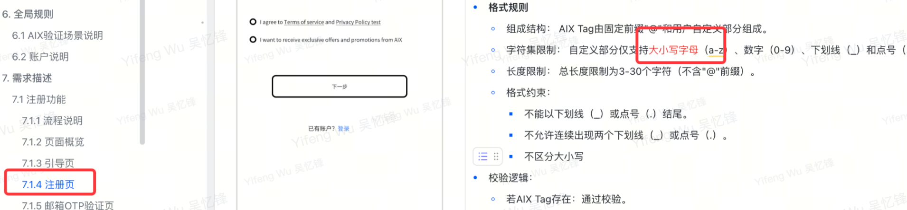
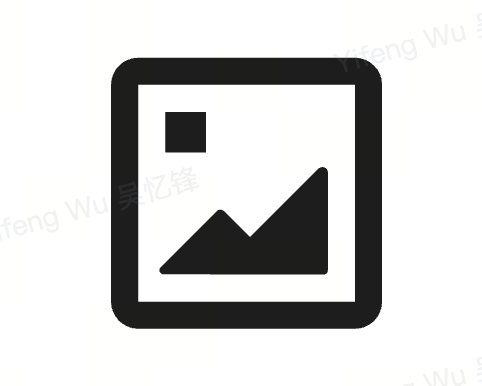

# AIX Card 注册登录需求V1.0

# 1. 需求变更日志

<table style="width:89%;">
<colgroup>
<col style="width: 10%" />
<col style="width: 10%" />
<col style="width: 45%" />
<col style="width: 22%" />
</colgroup>
<tbody>
<tr>
<td style="text-align: left;">变更时间</td>
<td style="text-align: left;">变更人</td>
<td style="text-align: left;">变更内容</td>
<td style="text-align: left;">备注</td>
</tr>
<tr>
<td style="text-align: left;">2025-10-21</td>
<td style="text-align: left;">@Yifeng Wu 吴忆锋</td>
<td style="text-align: left;">初稿</td>
<td style="text-align: left;"></td>
</tr>
<tr>
<td style="text-align: left;">2025-10-28</td>
<td style="text-align: left;">@Yifeng Wu 吴忆锋</td>
<td style="text-align: left;">
更正错误描述

@Dongjie Tan 谭东杰@Bowen Li (Eli)
</td>
<td style="text-align: left;"></td>
</tr>
<tr>
<td style="text-align: left;">2025-10-29</td>
<td style="text-align: left;">@Yifeng Wu 吴忆锋</td>
<td style="text-align: left;">
登录密码调整：

旧规则：登录密码为6位数字；

新规则：登录密码为英文字母+数字+符号

@Dongjie Tan 谭东杰@Bowen Li (Eli)@Wei Sun 孙伟@XingBo Jie 揭兴波@Xin Wang 王鑫@Wei Li 李伟
</td>
<td style="text-align: left;"></td>
</tr>
<tr>
<td style="text-align: left;">2025-10-29</td>
<td style="text-align: left;">@Yifeng Wu 吴忆锋</td>
<td style="text-align: left;">
@Dongjie Tan 谭东杰@Xin Wang 王鑫@Wei Li 李伟

目录调整（无功能调整）

注册流程和登录流程，原先放在统一规则下。

调整为分拆到注册功能和登录功能目录下
</td>
<td style="text-align: left;"></td>
</tr>
<tr>
<td style="text-align: left;">2025-10-29</td>
<td style="text-align: left;">@Yifeng Wu 吴忆锋</td>
<td style="text-align: left;">
补充5分钟有效期描述

@Xin Wang 王鑫
</td>
<td style="text-align: left;"></td>
</tr>
<tr>
<td style="text-align: left;">2025-10-31</td>
<td style="text-align: left;">@Yifeng Wu 吴忆锋</td>
<td style="text-align: left;">
【注册页】支持大小写字母

@Yu Zhang 张豫

【设置AIX Tag页】补充无网络描述

@Yu Zhang 张豫@Dongjie Tan 谭东杰

【邮箱OTP页】

@Liang Wu 吴亮

【邮箱OTP页】移至【身份认证模块】统一管理

<a href="https://advancegroup.sg.larksuite.com/wiki/HdI2wMXXviIOOwkVJNjlWY35gSh#share-Rew8dANwFoaWYAxxL8NlWEr5gNb">AIX Security 身份认证需求V1.0</a>

@Liang Wu 吴亮@Xin Wang 王鑫
</td>
<td style="text-align: left;"></td>
</tr>
<tr>
<td style="text-align: left;">2025-11-11</td>
<td style="text-align: left;">@Yifeng Wu 吴忆锋</td>
<td style="text-align: left;">
【忘记密码流程页面】-【功能说明】

补充忘记密码后，需要自动关闭bio

@Yu Zhang 张豫
</td>
<td style="text-align: left;"></td>
</tr>
<tr>
<td style="text-align: left;">2025-11-18</td>
<td style="text-align: left;">@Yifeng Wu 吴忆锋</td>
<td style="text-align: left;">
以下本次需求变更，均用红色字体标记

<strong>AIX Tag 设置流程调整</strong>

原规则：注册过程中必须完成 Tag 设置，方可注册成功。

新规则：用户创建密码即视为注册成功，后续通过引导页可选设置 Tag；用户可跳过，不影响账户使用。

影响范围：

7.1.1 流程说明 → 调整注册主流程

7.1.2 页面概览 → 调整注册主流程

7.1.6 设置密码页 → 调整“创建密码 后即 注册成功”

7.1.7 设置 AIX Tag 页 → 改为可选引导页

7.1.8 设置 AIX Tag 成功页 → 移除该页面

<strong>推荐码生成逻辑变更</strong>

原规则：推荐码与用户设置的 AIX Tag 一致。

新规则：推荐码由系统独立生成，与 Tag 解耦（具体规则见 MGM 需求文档）。

影响范围：

7.1.4 注册页 → 调整推荐码的输入框校验规则。

<strong>登录后 BIO 引导策略更新</strong>

原规则：登录后自动启用 BIO（若设备支持）。

新规则：登录成功后，仅当用户未设置 BIO 时，展示引导页供其选择是否开启。

影响范围：

7.2.7 新增 Enable BIO Page（引导式非强制）。

<strong>手机号国家/地区选择扩展</strong>

原规则：仅支持 AU、PH、VN 三个国家/地区的区号。

新规则：支持全球国家/地区手机号选择。

影响范围：

7.2.4.1 国家/地区页面 → 更新区号列表为全量国际选项。
</td>
<td style="text-align: left;"></td>
</tr>
<tr>
<td style="text-align: left;">2025-11-24</td>
<td style="text-align: left;">@Yifeng Wu 吴忆锋</td>
<td style="text-align: left;">
登录后，设置Bio需进行身份认证：

@Dongjie Tan 谭东杰@Lei Zhang 张雷@Wei Sun 孙伟@Xin Wang 王鑫
</td>
<td style="text-align: left;"></td>
</tr>
<tr>
<td style="text-align: left;">2025-12-23</td>
<td style="text-align: left;">@Yifeng Wu 吴忆锋</td>
<td style="text-align: center;">

@Dongjie Tan 谭东杰@Lei Zhang 张雷@Wei Sun 孙伟@Xin Wang 王鑫
</td>
<td style="text-align: left;">因为DTC短信服务商不支持</td>
</tr>
<tr>
<td style="text-align: left;">2025-12-25</td>
<td style="text-align: left;">@Yifeng Wu 吴忆锋</td>
<td style="text-align: center;"></td>
<td style="text-align: left;">补充当前事实逻辑</td>
</tr>
<tr>
<td style="text-align: left;">2025-12-26</td>
<td style="text-align: left;">@Yifeng Wu 吴忆锋</td>
<td style="text-align: left;">
@yurong liu 刘玉荣@Lei Zhang 张雷

补充逻辑：切换时保留填写内容不清空

Set Tag Page

旧规则：点击关闭按钮需弹窗挽留，且点击确认直接提交；

新规则：点击关闭直接进入首页，且点击确认，需用户再次确认；
</td>
<td style="text-align: left;"></td>
</tr>
</tbody>
</table>

# 2. 引用资料

|  |  |
|:---|:---|
| **类型** | 链接 |
| PM | @Yifeng Wu 吴忆锋 |
| Figma | https://www.figma.com/design/iDt3nk3jeLm8iGg91uvfVU/%E2%86%AA-AIX-Dev-Handoff-2025-Q4?node-id=520-3281&t=dxVmtqdcRlhesw35-1 |
| 翻译文案 | [AIX 翻译文案管理-多维表](https://advancegroup.sg.larksuite.com/wiki/Ah4UwdvDMiY19lkuMkwlHzWPgLd?from=from_copylink) |
| BRD | N/A |
| 技术方案 | [AIX System Design v0.1(Draft)](https://advancegroup.sg.larksuite.com/wiki/DHvYw3fRkiFYkRkiHK9lwSG4gnh) |

# 3. 需求索引

**\[同步块-无权限下载此内容\]**

# 2. 项目概述

2.1 **项目背景**

|  |
|:---|
| 为满足全球用户对一体化、便捷安全数字金融服务的需求，本项目旨在开发一款创新的移动应用。该应用将整合先进的支付与账户管理技术，致力于为用户提供全新的移动端金融管理体验。 |

2.2 **项目目的**

<table style="width:88%;">
<colgroup>
<col style="width: 88%" />
</colgroup>
<tbody>
<tr>
<td>
构建基础​：建立安全、便捷的用户注册登录与账户体系。

核心功能​：实现充值、提现、转账、消费等关键支付功能。

安全保障​：通过多层验证与风控策略，确保用户资产与信息安全。

体验优化​：提供流畅直观的操作流程，提升用户留存。
</td>
</tr>
</tbody>
</table>

2.3 **名词解释**

<table style="width:88%;">
<colgroup>
<col style="width: 88%" />
</colgroup>
<tbody>
<tr>
<td><table style="width:86%;">
<colgroup>
<col style="width: 16%" />
<col style="width: 69%" />
</colgroup>
<tbody>
<tr>
<td style="text-align: left;"><strong>名词/缩写</strong></td>
<td style="text-align: left;"><strong>说明</strong></td>
</tr>
<tr>
<td style="text-align: left;">DeviceID</td>
<td style="text-align: left;">用于唯一识别用户客户端的设备编号。用于实现设备绑定、可信设备判断及风险控制等。</td>
</tr>
<tr>
<td style="text-align: left;">IVS</td>
<td style="text-align: left;">
Identity Verification Service，身份验证服务。

通常指用于进行高强度实名验证的服务（如证件识别、人脸比对等），在注册或敏感操作流程中可能被调用。
</td>
</tr>
<tr>
<td style="text-align: left;">Biometric</td>
<td style="text-align: left;">通过用户的生物特征（如指纹、面部信息）进行身份验证的技术。支持iOS Face ID/Android指纹/人脸</td>
</tr>
<tr>
<td style="text-align: left;">AIX Tag</td>
<td style="text-align: left;">用户在AIX平台上的身份标识符。用于在转账、社交等场景中代替复杂的钱包地址，使用户能够被轻松找到和支付。此标识一旦设置，通常不可更改。</td>
</tr>
<tr>
<td style="text-align: left;">DTC</td>
<td style="text-align: left;">AIX项目的合作伙伴，提供加密钱包、卡片发行和KYC服务的后端平台，支持OpenAPI接口，用于处理交易、认证和账户管理。</td>
</tr>
<tr>
<td style="text-align: left;">AAI</td>
<td style="text-align: left;">第三方身份验证服务提供商，用于KYC流程中的护照上传、活体检测和人脸比对。支持Webhook回调和URL生成。</td>
</tr>
<tr>
<td style="text-align: left;">Master Account</td>
<td style="text-align: left;">DTC侧的账户概念，主账户，可申请API Key管理多个Sub Account。敏感操作需Sub Account授权。</td>
</tr>
<tr>
<td style="text-align: left;">Sub Account</td>
<td style="text-align: left;">DTC侧的账户概念，子账户，由Master创建，用于分离用户资产。KYC需独立完成。</td>
</tr>
<tr>
<td style="text-align: left;">WalletConnect</td>
<td style="text-align: left;">通过Deeplink/QR链接外部钱包充值。自动加白名单、交易报备，直接到账。</td>
</tr>
<tr>
<td style="text-align: left;">PIN</td>
<td style="text-align: left;">Personal Identification Number，卡片PIN码，用于线下交易。4位数字，支持Set/Change/Reset。</td>
</tr>
<tr>
<td style="text-align: left;">稳定币类型</td>
<td style="text-align: left;">稳定币类型USDC, USDT, FDUSD, WUSD，支持在BASE/BSC/ETHEREUM/SOLANA网络充值/转账/兑换。</td>
</tr>
<tr>
<td style="text-align: left;">区块链网络</td>
<td style="text-align: left;">支持的区块链网络，各网络币种不同（e.g., BASE: USDC）。包括：BASE, BSC, ETHEREUM, SOLANA</td>
</tr>
<tr>
<td style="text-align: left;">Global Travel Rule</td>
<td style="text-align: left;">全球旅行规则，合规要求，仅支持如Binance的白名单钱包充值。自动报备，无需声明。</td>
</tr>
</tbody>
</table></td>
</tr>
</tbody>
</table>

# 3. 项目计划

[AIX项目管理表](https://advancegroup.sg.larksuite.com/sheets/RFR2sp4VGhbXVDtlnjTlwVsYgAb?from=from_copylink&sheet=z4hjo9)

# 4. 功能结构

# 5. 国家线

|        |        |        |
|:------:|:------:|:------:|
| **VN** | **PH** | **AU** |
|   ✅   |   ✅   |   ✅   |

# 6. 全局规则

6.1 **AIX验证场景说明**

[AIX验证场景维护](https://advancegroup.sg.larksuite.com/sheets/TuOisdYqgh2cfvtmbLalhQlpgxe?from=from_copylink)

6.2 **账户说明**

<table style="width:89%;">
<colgroup>
<col style="width: 10%" />
<col style="width: 78%" />
</colgroup>
<tbody>
<tr>
<td style="text-align: left;">规则说明</td>
<td style="text-align: left;">
1. <strong>uid生成方式</strong>

服务端在用户注册成功后生成 UID。

<table style="width:76%;">
<colgroup>
<col style="width: 75%" />
</colgroup>
<tbody>
<tr>
<td style="text-align: left;">UID的生成规则由开发侧定义。产品侧的核心诉求是确保其具备良好的业务可用性。该UID将频繁用于客服（CS）、会员推荐（MGM）等需要人工记录与核对的场景，因此要求ID本身易于识别、记忆和沟通。--营销侧有ID概念</td>
</tr>
</tbody>
</table>

2. <strong>账户状态</strong>

共有3种状态【Active、Banned、Closed、<del>Locked</del>】

Active：

定义：账户正常使用中；

触发条件：注册成功后；

Banned：

定义：账户被限制使用；可恢复；

触发条件：风控触发对应规则，一期不支持；

限制：不可登录

解除方式：联系客服处理；

Closed

定义：账户被注销；不可恢复；

触发条件：风控触发对应规则/客服手动操作，一期不支持；

限制：不可登录，所有功能不可用；

解除方式：无法解除

<del>Locked：</del>

<del>定义：因安全原因临时锁定；</del>

<del>触发条件：登录失败超过N次；</del>

<del>限制：不可登录</del>

<del>解除方式：</del>

<del><strong>自动解除</strong>：锁定时长到期后自动变为 Active。</del>

<del><strong>自助解除</strong>：用户通过“忘记密码”重置密码后立即解除。</del>

3. <strong>登录失败锁定说明</strong>

4. <strong>昵称规则</strong>

注册成功后昵称自动生成，生成规则：随机4位英文+随机6位数字。

需要用户手动设置，见需求<a href="https://advancegroup.sg.larksuite.com/wiki/PxXnwhWp6iWr7RkEYnwl0I6sgzc#share-HgbedqiQyobfikxEfD4luD2bgZg">AIX Card ME模块需求V1.0</a>

5. <strong>手机号/邮箱唯一性规则</strong>

邮箱：全局唯一，不允许重复注册或绑定。

手机号：全局唯一，不允许重复注册或绑定。

6. <strong>设备绑定策略</strong>

自动绑定：用户成功注册/登录后，系统自动将当前 Device ID 与账户绑定。

绑定数量限制：单个账户最多绑定 1 个deviceid。

最多允许 1 个设备同时在线。

仅当设备已绑定，登录时方可启用 Biometric 功能
</td>
</tr>
</tbody>
</table>

# 7. 需求描述

7.1 **注册功能**

7.1.1 **流程说明**

7.1.2 **页面概览**

7.1.3 **Navigation Page**

<table style="width:89%;">
<colgroup>
<col style="width: 30%" />
<col style="width: 58%" />
</colgroup>
<tbody>
<tr>
<td style="text-align: left;">UX</td>
<td style="text-align: left;">Description</td>
</tr>
<tr>
<td rowspan="4" style="text-align: center;"></td>
<td rowspan="4" style="text-align: left;">
1. <strong>推广引导区</strong>

一期写死，后续需在OBOSS配置实现

2. <strong>注册按钮</strong>

点击Creat account按钮，跳转至<a href="https://advancegroup.sg.larksuite.com/wiki/NerUwjf1kiLTOkk9uJClnSYZgCc#share-NbztdHKCvozvpmx16jIl5pISgYd">邮箱注册页</a>；

点击I already have an account按钮，跳转至<a href="https://advancegroup.sg.larksuite.com/wiki/NerUwjf1kiLTOkk9uJClnSYZgCc#share-NbztdHKCvozvpmx16jIl5pISgYd">邮箱/手机登录页</a>；
</td>
</tr>
<tr>
</tr>
<tr>
</tr>
<tr>
</tr>
</tbody>
</table>

7.1.4 **Registration Page**

<table style="width:89%;">
<colgroup>
<col style="width: 30%" />
<col style="width: 58%" />
</colgroup>
<tbody>
<tr>
<td style="text-align: left;">UX</td>
<td style="text-align: left;">Description</td>
</tr>
<tr>
<td rowspan="4" style="text-align: center;"></td>
<td rowspan="4" style="text-align: left;">
1. <strong>Email输入框</strong>

输入规则：

最长限制为103个字符，超出不可输入；

实时格式校验：

当格式不符合邮箱规范（如：缺少@符号、域名不完整）时，应提示：Email format is invalid

当输入框为空时，应提示：Email should not be empty

2. <strong>Referral code输入框</strong>

<strong>格式规则</strong>

长度限制：​ 总长度限制为3-30个字符，提示：Please enter 3–30 letters or digits.

类型限制，只能输入英文（区分大小写）+数字，提示：Please enter 3–30 letters or digits.

3. <strong>协议说明</strong>

默认为不勾选状态

协议内容展示

内容来源：​ Terms of service与 Privacy Policy test的协议全文内容需从中台管理系统读取。

展示方式：​ 用户点击Terms of service或Privacy Policy test超链接文本时，系统需在页面内展示完整的协议内容。

协议链接：<a href="https://advancegroup.sg.larksuite.com/drive/folder/KcRtfsWfvl3BoMd48W1lbgcugcc">https://advancegroup.sg.larksuite.com/drive/folder/KcRtfsWfvl3BoMd48W1lbgcugcc</a>

快照保存：​ 当用户本次注册成功后，系统必须将用户所同意的 Terms of service &amp; Privacy Policy test 的协议版本内容生成不可更改的快照​，并与用户账户绑定存储。

若后端报错，无法获取协议则toast提示：Something went wrong. Please try again later

4. <strong>下一步按钮</strong>

按钮变为可点击状态，必须同时满足以下两个条件：

邮箱格式有效​：邮箱输入框内容非空，且通过系统格式校验，无异常错误提示。

协议已同意​：所有必选的用户协议复选框均已被用户勾选。

正常流程​：用户点击后，系统执行注册流程，进入下一步流程邮箱OTP页。

异常处理：

若推荐码不存在​：提示：Referral code does not exist

若系统检测到所填邮箱已被注册，提示：This email has been used

频控：

同一个设备指纹总次数限制：5次 / 10分钟，超过后锁定 10分钟。toast提示：The system is busy, please try again later。

同一个IP单位时间内总次数限制：100次 / 10分钟，超过后锁定 10分钟。toast提示：The system is busy, please try again later。

接口总限流（研发定义）超过后，toast提示：The system is busy, please try again later。

5. <strong>登录按钮</strong>

点击登录跳转到<a href="https://advancegroup.sg.larksuite.com/wiki/NerUwjf1kiLTOkk9uJClnSYZgCc#share-OMAIdTi8ko4LjVxr54elMWwFgfd">邮箱/手机登录页</a>
</td>
</tr>
<tr>
</tr>
<tr>
</tr>
<tr>
</tr>
</tbody>
</table>

7.1.5 **邮箱OTP验证页**

见[AIX Security 身份认证需求V1.0](https://advancegroup.sg.larksuite.com/wiki/HdI2wMXXviIOOwkVJNjlWY35gSh#share-Rew8dANwFoaWYAxxL8NlWEr5gNb)

7.1.6 **Set Password Page**

<table style="width:89%;">
<colgroup>
<col style="width: 30%" />
<col style="width: 58%" />
</colgroup>
<tbody>
<tr>
<td style="text-align: left;">UX</td>
<td style="text-align: left;">Description</td>
</tr>
<tr>
<td rowspan="4" style="text-align: center;"></td>
<td rowspan="4" style="text-align: left;">
1. <strong>返回按钮</strong>

点击弹出挽留弹窗

Title：Confirm Exit?

Content: Are you sure you want to leave before verification is complete?

Button:

Stay and continue: 点击后关闭弹窗，停留在当前页；

Leave: 点击后关闭弹窗，返回到入口页；

2. <strong>标题</strong>

固定文案：设置密码

3. <strong>密码输入框</strong>

3.1 <strong>输入规则</strong>

长度限制​：最长输入32个字符。当用户输入超过32个字符时，前端应禁止其继续输入，并可在界面toast提示（如Toast提示“密码最长32个字符”）。

支持的字符类型​：

小写字母​：a - z

大写字母​：A - Z

数字​：0 - 9

符号/特殊字符​：常见的标点符号和特殊字符，例如：! @ # $ % ^ &amp; * ( ) _ + - = { } [ ] | \ : " ; ' &lt; &gt; ? , . /等。

显示控制：

默认状态​：输入框内所有字符以密文（圆点•或星号*）形式显示。

显示/隐藏切换​：输入框右侧必须提供“眼睛”图标。

图标为“闭眼”状态时，显示密文。

用户点击后，图标切换为“睁眼”状态，密码以明文显示。再次点击，恢复密文显示。

输入框失焦后校验

密码长度不足8位或超过32位。红字提示：Password must be between 8-32 characters

密码长度符合，但不包含任何小写字母 (a-z)。提示：Password must include a lowercase letter

密码长度符合，但不包含任何大写字母 (A-Z)。提示：Password must include an uppercase letter

密码长度符合，但不包含任何数字 (0-9)。提示：Password must include a number

密码长度符合，但不包含任何符号（如!@#$等）。提示：Password must include a supported symbol

4. <strong>Next按钮</strong>

只有当错误提示信息消失（即所有校验均通过）时，“下一步”按钮才变为可点击状态

点击按钮，进入Re-set Password Page
</td>
</tr>
<tr>
</tr>
<tr>
</tr>
<tr>
</tr>
</tbody>
</table>

7.1.7 **Re-enter Password Page**

<table style="width:89%;">
<colgroup>
<col style="width: 30%" />
<col style="width: 58%" />
</colgroup>
<tbody>
<tr>
<td style="text-align: left;">UX</td>
<td style="text-align: left;">Description</td>
</tr>
<tr>
<td rowspan="4" style="text-align: center;"></td>
<td rowspan="4" style="text-align: left;">
1. <strong>返回按钮</strong>

点击弹出挽留弹窗

Title：Confirm Exit?

Content: Are you sure you want to leave before verification is complete?

Button:

Stay and continue: 点击后关闭弹窗，停留在当前页；

Leave: 点击后关闭弹窗，返回到入口页；

2. <strong>标题</strong>

固定文案：设置密码

3. <strong>密码输入框</strong>

3.1 <strong>输入规则</strong>

长度限制​：最长输入32个字符。当用户输入超过32个字符时，前端应禁止其继续输入，并可在界面toast提示（如Toast提示“密码最长32个字符”）。

支持的字符类型​：

小写字母​：a - z

大写字母​：A - Z

数字​：0 - 9

符号/特殊字符​：常见的标点符号和特殊字符，例如：! @ # $ % ^ &amp; * ( ) _ + - = { } [ ] | \ : " ; ' &lt; &gt; ? , . /等。

显示控制：

默认状态​：输入框内所有字符以密文（圆点•或星号*）形式显示。

显示/隐藏切换​：输入框右侧必须提供“眼睛”图标。

图标为“闭眼”状态时，显示密文。

用户点击后，图标切换为“睁眼”状态，密码以明文显示。再次点击，恢复密文显示。

实时动态校验

密码长度不足8位或超过32位。提示：Password must be between 8-32 characters

密码长度符合，但不包含任何小写字母 (a-z)。提示：Password must include a lowercase letter

密码长度符合，但不包含任何大写字母 (A-Z)。提示：Password must include an uppercase letter

密码长度符合，但不包含任何数字 (0-9)。提示：Password must include a number

密码长度符合，但不包含任何符号（如!@#$等）。提示：Password must include a symbol

4. <strong>Next按钮</strong>

只有当错误提示信息消失（即所有校验均通过）时，“下一步”按钮才变为可点击状态

点击按钮，系统完成密码设置，逻辑处理

两次密码不一致，提示：Passwords do not match. Please try again.

创建失败：​ 后端返回服务器错误，系统弹出错误提示弹窗：

<table style="width:46%;">
<colgroup>
<col style="width: 45%" />
</colgroup>
<tbody>
<tr>
<td style="text-align: left;">
<strong>Title：</strong> 
Submission failed

<strong>Content：</strong> 
Something went wrong. Please try again. 
<strong>Try again Button</strong>

点击后：重新提交。

<strong>Leave Button：</strong>

点击后：关闭弹窗，退出当前流程，返回业务流程入口页面。
</td>
</tr>
</tbody>
</table>

创建成功：​ 系统完成账户注册流程，用户自动登录，并跳转至设置AIX Tag页。
</td>
</tr>
<tr>
</tr>
<tr>
</tr>
<tr>
</tr>
</tbody>
</table>

7.1.8 **Set Tag Page**

<table style="width:89%;">
<colgroup>
<col style="width: 30%" />
<col style="width: 58%" />
</colgroup>
<tbody>
<tr>
<td style="text-align: left;">UX</td>
<td style="text-align: left;">Description</td>
</tr>
<tr>
<td rowspan="4" style="text-align: center;"></td>
<td rowspan="4" style="text-align: left;">
1. <strong>主标题&amp;副标题</strong>

title：Create your X-Tag

subtitle：Create a unique ID so others can easily send you funds. This can't be changed later.

2. <strong>AIX Tag格式规则</strong>

<strong>格式规则</strong>

组成结构：​ AIX Tag由固定前缀"@"和用户自定义部分组成。

字符集限制：​ 自定义部分仅支持大小写字母（a-z）、数字（0-9）、下划线（_）和点号（.）。

长度限制：​ 总长度限制为3-30个字符（不含"@"前缀）。

格式约束：​

不能以下划线（_）或点号（.）结尾。

不允许连续出现两个下划线（_）或 连续两个点号（.）。

区分大小写

<em>保留字限制：​ 禁止使用系统保留关键词：admin、support、api、null，此处不区分大小写；</em>

<strong>唯一性校验机制</strong>

<em>当用户输入内容后发起格式检查。若错误提示：</em>

<blockquote>

Requirements:

- Between 3-30 characters

- Use letters, numbers, underscores (_), or periods (.)

- No double underscores or periods

- Can't end with _ or .

- Reserved words (admin, support, api, null) aren't allowed

</blockquote>

<strong>校验结果处理：​​</strong>

若Tag已被占用，系统返回"不可用"状态。

若Tag可用，系统返回"可用"状态。

若无网络：Toast提示：Please check your internet connection and try again.

3. <strong>右上角关闭按钮</strong>

点击关闭，进入app首页；

4. <strong>确认-按钮</strong>

初始状态为禁用（灰色）。仅当用户输入的字符符合格式要求，且Tag返回可用，则可点击；

点击后弹窗确认：

<blockquote>

title：Confirm your X-Tag

subtitle：Once confirmed, it cannot be changed.
 Please make sure it’s exactly what you want.

button：Confirm and Cancel

</blockquote>

点击取消按钮，取消弹窗，停留在当前页面

点击confirm按钮，业务逻辑处理

用户点击可用状态的确认按钮后，系统提交AIX Tag创建请求。

唯一性校验：若该tag已存在，则提示：This tag is already taken. Try another one.

创建成功：​ 跳转至设置APP首页。

创建失败：​ 后端返回服务器错误，提示：Something went wrong. Please try again later.
</td>
</tr>
<tr>
</tr>
<tr>
</tr>
<tr>
</tr>
</tbody>
</table>

7.2 **登录功能**

7.2.1 **流程说明**

7.2.2 **页面概览**

7.2.3 **Natigation page**

复用[注册功能-Natigation Page](https://advancegroup.sg.larksuite.com/wiki/NerUwjf1kiLTOkk9uJClnSYZgCc#share-CR79djZSFoOPiqxyd0PlogdNg8c)

7.2.4 **Login Page**

<table style="width:89%;">
<colgroup>
<col style="width: 30%" />
<col style="width: 58%" />
</colgroup>
<tbody>
<tr>
<td style="text-align: left;">UX</td>
<td style="text-align: left;">Description</td>
</tr>
<tr>
<td rowspan="4" style="text-align: center;"></td>
<td rowspan="4" style="text-align: left;"><table style="width:55%;">
<colgroup>
<col style="width: 55%" />
</colgroup>
<tbody>
<tr>
<td style="text-align: left;">
1. <strong><del>输入切换</del></strong>

<del>页面提供 ​“邮箱”​ 和 ​“手机号”​ 两种登录方式的切换能力。切换时能保留原填写内容；</del>

<del>默认选中 ​“邮箱”​ 方式。</del>

2. <strong><del>邮箱输入框</del></strong>

<del>输入规则：​</del>

<del>输入内容最长限制为 254个字符。</del>

<del>校验规则：​</del>

<del>系统需对输入内容进行邮箱格式校验。</del>

<del>输入内容不能为空。</del>

<del>错误提示：​</del>

<del>若格式错误，提示：Email format is invalid。</del>

<del>若内容为空，提示：Email should not be empty。</del>

3. <strong><del>手机号输入框（按国家/地区规则）​​</del></strong>

<del>当用户选择“手机号”登录方式时，需显示国家/地区代码选择器及手机号输入框。</del>

<strong><del>选择国际区号</del></strong>

<del>点击国际区号，进入Select Country Page</del>

<strong><del>手机号输入</del></strong>

<del>输入限制：</del>

<del>仅允许输入数字；</del>

<del>长度限制：限制最长输入20位；</del>
</td>
</tr>
</tbody>
</table>

4. <strong>下一步按钮</strong>

初始状态为禁用。仅当输入框内容不为空，且输入格式校验通过，变为可用；

点击按钮处理逻辑：

账号不存在或未注册：提示文案​：您输入的账号信息有误，请检查或注册新账号。

手机号少于6位：提示：Phone number must be at least 6 digits

账号被Banned：提示文案​：Account locked. Please contact customer support.

正常流程：自动跳转至 身份<a href="https://advancegroup.sg.larksuite.com/wiki/NerUwjf1kiLTOkk9uJClnSYZgCc#share-DW1ydjiosoeIhKx7KqblPKc8g9b">验证流程页</a>；

5. <strong>Quick Login按钮</strong>

显示条件：​

仅当App本地检测到存在可用的生物识别（Biometric）密钥信息时，才向用户展示此按钮。

功能逻辑：​

点击后触发生物识别登录流程，具体逻辑见独立的“<a href="https://advancegroup.sg.larksuite.com/wiki/NerUwjf1kiLTOkk9uJClnSYZgCc#share-BXoXdolJgouIdixDGMPlXI8ug0a">Biometric登录</a>”章节。
</td>
</tr>
<tr>
</tr>
<tr>
</tr>
<tr>
</tr>
</tbody>
</table>

7.2.4.1 **Select Country Page**

<table style="width:89%;">
<colgroup>
<col style="width: 29%" />
<col style="width: 59%" />
</colgroup>
<tbody>
<tr>
<td style="text-align: left;">UX</td>
<td style="text-align: left;">Description</td>
</tr>
<tr>
<td rowspan="4" style="text-align: center;"></td>
<td rowspan="4" style="text-align: left;">
1. <strong>页面规则 
</strong>

点击打开国家列表，展示全部国家。

展示完整国家list参考，见<a href="https://advancegroup.sg.larksuite.com/wiki/IeKMw357ziJVjFkGTullgz1UgLe?from=from_copylink">国家和地区list</a>；

国家list，后端需要隐藏中国和中国台湾选项；

列表排序规则

实现方式：采用组件new Intl.Collator('vi-VN').compare

<table style="width:52%;">
<colgroup>
<col style="width: 51%" />
</colgroup>
<tbody>
<tr>
<td style="text-align: left;">
JavaScript：new Intl.Collator('vi-VN').compare排序规则解释

排序遵循越南语字母顺序

越南语有 29 个基础字母，顺序为：（<strong>按照基本字母来分组</strong>） 
A, Ă, Â, B, C, D, Đ, E, Ê, G, H, I, K, L, M, N, O, Ô, Ơ, P, Q, R, S, T, U, Ư, V, X, Y

注：Đ 是独立字母，排在 D 之后；Ă、Â、Ê、Ô、Ơ、Ư 都是独立字母，不等同于 A 或 E。

相同词根的国家名连续排列

例如：如果存在 ba、bà、bá 等（仅声调不同），它们应紧挨着排在一起，不能被其他词（如 ban）插在中间。

禁止逐字完全比较（如先比第一个字的所有属性）

必须采用 “整串先比基础字母 → 再比声调” 的方式，这是国际标准（Unicode 排序算法）。
</td>
</tr>
</tbody>
</table>

2. <strong>常用地区</strong>

显示常用国家地区，固定为：澳大利亚、新加坡、菲律宾、越南
</td>
</tr>
<tr>
</tr>
<tr>
</tr>
<tr>
</tr>
</tbody>
</table>

7.2.5 **Biometric登录**

<table style="width:89%;">
<colgroup>
<col style="width: 6%" />
<col style="width: 20%" />
<col style="width: 61%" />
</colgroup>
<tbody>
<tr>
<td style="text-align: left;"><strong>模块</strong></td>
<td style="text-align: left;"><strong>UXUI</strong></td>
<td style="text-align: left;"><strong>需求说明</strong></td>
</tr>
<tr>
<td style="text-align: left;"><strong>iOS人脸</strong></td>
<td style="text-align: center;"></td>
<td style="text-align: left;">
点击「Quick Login」，拉起设备人脸验证

判断是否验证通过：

设备端验证通过，则进行后端验证

后端验证成功，进入下一步流程，并使用biometric签名请求身份认证；

后端验证失败，则弹窗提示错误信息引导跳转至输入手机号页面（见左图），同时清除本地Bio信息，后端关闭该账户Bio开关（引导用户重新设置Bio）

设备端验证失败，则弹窗提示

失败单数次的弹窗为系统弹窗，按钮展示为「Try FaceID Again」和「Cancel」；

点击「Try FaceID Again」，重新拉起Bio验证；

点击「Cancel」，关闭弹窗回到邮箱/手机登录页；

失败双数次的弹窗按钮展示为「Cancel」和「Use Other Methods」

点击「Cancel」，关闭弹窗回到邮箱/手机登录页；

点击「Use Other Methods」，跳转至邮箱/手机登录页；
</td>
</tr>
<tr>
<td style="text-align: left;"><strong>iOS指纹</strong></td>
<td style="text-align: center;"></td>
<td style="text-align: left;">
点击「Quick Login」，拉起设备指纹验证

判断是否验证通过：

设备端验证通过，则进行后端验证

后端验证成功，进入下一步流程，并使用biometric签名请求身份认证；

后端验证失败，则弹窗提示错误信息引导跳转至输入手机号页面（见左图），同时清除本地Bio信息，后端关闭该账户Bio开关（引导用户重新设置Bio）

设备端验证失败，则弹窗提示

失败1次（每轮）的弹窗为系统弹窗，按钮展示为「Cancel」；

点击「Cancel」，关闭弹窗回到邮箱/手机登录页；

失败2次（每轮）的弹窗按钮展示为「Cancel」和「Use another method」

点击「Cancel」，关闭弹窗回到邮箱/手机登录页；

点击「Use another method」，跳转至邮箱/手机登录页；

失败5次（第3轮第一次）时，系统提示指纹被锁，引导用户使用其他方式。

</td>
</tr>
<tr>
<td style="text-align: left;"><strong>Android人脸</strong></td>
<td style="text-align: center;"></td>
<td style="text-align: left;">
点击「Quick Login」，拉起设备人脸验证

判断是否验证通过：

设备端验证通过，则进行后端验证

后端验证成功，进入下一步流程，并使用biometric签名请求身份认证；

后端验证失败，则弹窗提示错误信息引导跳转至输入手机号页面（见左图），同时清除本地Bio信息，后端关闭该账户Bio开关（引导用户重新设置Bio）

设备端验证失败，则弹窗提示

安卓失败弹窗为系统弹窗，以各机型实际展示为准；

不限制失败次数，以各机型实际限制为准；

若失败次数大于设备限制次数，则弹窗提示错误信息，点击「Use another method」跳转至输入手机号页面，同时前端清除本地Bio信息并隐藏「Quick Login」按钮。
</td>
</tr>
<tr>
<td style="text-align: left;"><strong>Android指纹</strong></td>
<td style="text-align: center;"></td>
<td style="text-align: left;">
点击「Quick Login」，<del>若协议已全部勾选，则</del>拉起设备人脸验证

判断是否验证通过：

设备端验证通过，则进行后端验证

后端验证成功，进入下一步流程，并使用biometric签名请求身份认证；

后端验证失败，则弹窗提示错误信息引导跳转至输入手机号页面（见左图），同时清除本地Bio信息，后端关闭该账户Bio开关（引导用户重新设置Bio）

设备端验证失败，则弹窗提示

安卓失败弹窗为系统弹窗，以各机型实际展示为准；

不限制失败次数，以各机型实际限制为准；

若失败次数大于设备限制次数，则弹窗提示错误信息，点击「Use another method」跳转至输入手机号页面，同时前端清除本地Bio信息并隐藏「Quick Login」按钮。
</td>
</tr>
</tbody>
</table>

7.2.6 **身份验证流程页面**

见[AIX Security 身份认证需求V1.0](https://advancegroup.sg.larksuite.com/wiki/HdI2wMXXviIOOwkVJNjlWY35gSh#share-Rew8dANwFoaWYAxxL8NlWEr5gNb)

7.2.7 **Enable BIO page**

<table style="width:89%;">
<colgroup>
<col style="width: 30%" />
<col style="width: 58%" />
</colgroup>
<tbody>
<tr>
<td style="text-align: left;">UX</td>
<td style="text-align: left;">Description</td>
</tr>
<tr>
<td rowspan="4" style="text-align: center;"></td>
<td rowspan="4" style="text-align: left;">
1. <strong>页面规则</strong>

用户登录成功后，系统将检测其生物识别（BIO）状态：

若未启用BIO：则引导用户进入此功能启用页面。

若已启用BIO：则跳过此页面，直接进入APP首页。

若用户未在手机系统中开启人脸或指纹识别功能，则登录成功后 不弹出生物识别引导页，直接进入首页

2. <strong>关闭按钮</strong>

点击关闭按钮，直接进入APP首页<del>，并toast提示：Login success</del>

3. <strong>图片&amp;标题&amp;副标题</strong>

固定文案

4. <strong>Enable now按钮</strong>

点击按钮，检测设备生物识别权限状态

<table style="width:51%;">
<colgroup>
<col style="width: 50%" />
</colgroup>
<tbody>
<tr>
<td style="text-align: left;">知识点：是否需授权由设备校验，ios需授权，安卓不需要授权</td>
</tr>
</tbody>
</table>

已授权：直接调起生物认证流程

未授权：弹窗引导至系统权限设置

特殊处理：

需调用身份认证接口

用户在完成手动登录后的5分钟内，无需再次进行身份验证

用户在完成手动登录后的5分钟后，需要进行身份验证后再继续设置
</td>
</tr>
<tr>
</tr>
<tr>
</tr>
<tr>
</tr>
</tbody>
</table>

7.3 **~~忘记密码流程页面~~**

7.3.1 **~~功能说明~~**

~~当用户重置密码后，需要清除BIO信息，已开启的BIO需要自动关闭。~~

7.3.2 **~~页面概览~~**

7.3.3 **~~Reset Password Page 重置密码页~~**

<table style="width:89%;">
<colgroup>
<col style="width: 30%" />
<col style="width: 58%" />
</colgroup>
<tbody>
<tr>
<td style="text-align: left;"><del>UX</del></td>
<td style="text-align: left;"><del>Description</del></td>
</tr>
<tr>
<td rowspan="4" style="text-align: center;"></td>
<td rowspan="4" style="text-align: left;">
1. <strong><del>返回按钮</del></strong>

<del>点击返回上一级页面</del>

<table style="width:55%;">
<colgroup>
<col style="width: 55%" />
</colgroup>
<tbody>
<tr>
<td style="text-align: left;">
1. <strong><del>输入切换</del></strong>

<del>页面提供 ​“邮箱”​ 和 ​“手机号”​ 两种登录方式的切换能力。切换时能保留原填写内容；</del>

<del>默认选中 ​“邮箱”​ 方式。</del>

2. <strong><del>邮箱输入框</del></strong>

<del>输入规则：​</del>

<del>输入内容最长限制为 254个字符。</del>

<del>校验规则：​</del>

<del>系统需对输入内容进行邮箱格式校验。</del>

<del>输入内容不能为空。</del>

<del>错误提示：​</del>

<del>若格式错误，提示：Email format is invalid。</del>

<del>若内容为空，提示：Email should not be empty。</del>

3. <strong><del>手机号输入框（按国家/地区规则）​​</del></strong>

<del>当用户选择“手机号”登录方式时，需显示国家/地区代码选择器及手机号输入框。</del>

<strong><del>选择国际区号</del></strong>

<del>点击国际区号，进入Select Country Page</del>

<strong><del>手机号输入</del></strong>

<del>输入限制：</del>

<del>仅允许输入数字；</del>

<del>长度限制：限制最长输入20位；</del>

同步自文档: <a href="https://advancegroup.sg.larksuite.com/docx/Sy4TdCxUFoCEWbxdcoQlBgzhgfh#YcAHdATXJszfE4b7oBtlyplGg3g">https://advancegroup.sg.larksuite.com/docx/Sy4TdCxUFoCEWbxdcoQlBgzhgfh#YcAHdATXJszfE4b7oBtlyplGg3g</a>
</td>
</tr>
</tbody>
</table>

2. <strong><del>下一步按钮</del></strong>

<del>初始为灰色不可点击；当输入合法且非空时高亮可点击。</del>

<del>点击进入身份验证流程页面</del>
</td>
</tr>
<tr>
</tr>
<tr>
</tr>
<tr>
</tr>
</tbody>
</table>

7.3.4 **~~身份验证流程页面~~**

~~见[AIX Security 身份认证需求V1.0](https://advancegroup.sg.larksuite.com/wiki/HdI2wMXXviIOOwkVJNjlWY35gSh#share-Rew8dANwFoaWYAxxL8NlWEr5gNb)~~

7.3.5 **~~设置密码页~~**

**~~功能说明：~~**

~~复用[设置密码页](https://advancegroup.sg.larksuite.com/wiki/NerUwjf1kiLTOkk9uJClnSYZgCc#share-PbGmdh1tooTDcFxFSc1lTbU1ggh)模块~~

**~~安全规则：~~**

~~密码重置成功后，系统将强制登出当前账户，用户需使用新密码重新登录。~~

# 8. 待定事项

~~手机国际区号调整~~

~~设备采集--mvp不做~~

~~邀请码需要单独自动生成code~~

~~登录时，如果手机号或邮箱不存在，需要提示~~
