# AIX APP V1.0【Transaction & History】

# 1. 引言

figma：

https://www.figma.com/design/LxHqrwdNow4AnEZG3Sj9bF/%E2%86%92-AIX-Dev-Handoff-2026-Q1?node-id=0-1&p=f&t=lPv2ECMofzK9itYd-0

1.1 **需求索引**

**\[同步块-无权限下载此内容\]**

1.2 **修订记录**

<table style="width:89%;">
<colgroup>
<col style="width: 9%" />
<col style="width: 9%" />
<col style="width: 37%" />
<col style="width: 9%" />
<col style="width: 22%" />
</colgroup>
<tbody>
<tr>
<td style="text-align: left;">日期</td>
<td style="text-align: left;">版本</td>
<td style="text-align: left;">说明</td>
<td style="text-align: left;">页面</td>
<td style="text-align: left;">作者</td>
</tr>
<tr>
<td style="text-align: left;">Jan 27</td>
<td style="text-align: left;">V1.1</td>
<td style="text-align: left;">全量交易及卡交易去掉搜索，后续再迭代</td>
<td style="text-align: left;"></td>
<td style="text-align: left;">@Xuemin Zhu 朱学敏</td>
</tr>
<tr>
<td style="text-align: left;">Nov 28</td>
<td style="text-align: left;">V1.1</td>
<td style="text-align: left;">
因钱包和卡交易做成全量交易，在原有加密币交易记录的基础上，整合卡交易和Swap交易-Magic

交易记录调整为仅可查最近1年-同Atome
</td>
<td style="text-align: left;"></td>
<td style="text-align: left;">@Xuemin Zhu 朱学敏</td>
</tr>
<tr>
<td style="text-align: left;">April 2</td>
<td style="text-align: left;">v2.1</td>
<td style="text-align: left;">卡交易列表的名称规范</td>
<td style="text-align: left;"></td>
<td style="text-align: left;">@Bing Han 韩冰</td>
</tr>
<tr>
<td style="text-align: left;">April 2</td>
<td style="text-align: left;">v2.1</td>
<td style="text-align: left;">
Exchange rate 规范，显示小数点后6位，向上取整。

详情页收起exchange rate
</td>
<td style="text-align: left;">交易详情页</td>
<td style="text-align: left;">@Bing Han 韩冰</td>
</tr>
<tr>
<td style="text-align: left;"></td>
<td style="text-align: left;">v2.2</td>
<td style="text-align: left;">-4月14日更新：DTC反馈有部分退款会使用【REVERSAL】，因此卡交易需展示该类型=19的单子。前端与【REFUND】一样均显示{refund-商户名称}。</td>
<td style="text-align: left;">全量交易列表及详情页</td>
<td style="text-align: left;">@Bing Han 韩冰</td>
</tr>
<tr>
<td style="text-align: left;"></td>
<td style="text-align: left;">v2.2</td>
<td style="text-align: left;">-4月14日更新：DTC反馈有部分退款会使用【REVERSAL】，因此卡交易需展示该类型=19的单子。前端与【REFUND】一样均显示{refund-商户名称}。</td>
<td style="text-align: left;">卡交易列表及详情页</td>
<td style="text-align: left;">@Bing Han 韩冰</td>
</tr>
<tr>
<td style="text-align: left;"></td>
<td style="text-align: left;">v2.2</td>
<td style="text-align: left;">4月14日更正：针对deposit的交易详情页，隐藏Gas fee 这一个item</td>
<td style="text-align: left;">交易详情页</td>
<td style="text-align: left;">@Bing Han 韩冰</td>
</tr>
</tbody>
</table>

# 2. 全局说明

2.1 **接口范围**

<table style="width:89%;">
<colgroup>
<col style="width: 9%" />
<col style="width: 16%" />
<col style="width: 16%" />
<col style="width: 28%" />
<col style="width: 16%" />
</colgroup>
<tbody>
<tr>
<td style="text-align: left;"></td>
<td style="text-align: left;"><strong>接口</strong></td>
<td style="text-align: left;">接口名称</td>
<td style="text-align: left;"><strong>接口地址</strong></td>
<td style="text-align: left;"><strong>接口说明</strong></td>
</tr>
<tr>
<td rowspan="2" style="text-align: left;"><strong>卡交易</strong></td>
<td style="text-align: left;">查询卡交易列表</td>
<td style="text-align: left;">Transaction History of Card</td>
<td style="text-align: left;">[POST] /openapi/v1/card/inquiry-card-transaction</td>
<td style="text-align: left;"></td>
</tr>
<tr>
<td style="text-align: left;">查询卡交易详情</td>
<td style="text-align: left;">Card Transaction Detail Inquiry</td>
<td style="text-align: left;">[POST]/open api/v1/card/inquiry card transaction detail</td>
<td style="text-align: left;"></td>
</tr>
<tr>
<td rowspan="2" style="text-align: left;"><strong>钱包加密币交易</strong></td>
<td style="text-align: left;">获取加密货币交易历史（全量）</td>
<td style="text-align: left;">Get Crypto Transaction History</td>
<td style="text-align: left;">[POST] /openapi/v1/crypto-txn/search</td>
<td style="text-align: left;"></td>
</tr>
<tr>
<td style="text-align: left;">交易ID查询单笔交易详情</td>
<td style="text-align: left;">Get Crypto Transaction</td>
<td style="text-align: left;">[GET] /openapi/v1/crypto-txn/{txnId}</td>
<td style="text-align: left;"></td>
</tr>
<tr>
<td rowspan="2" style="text-align: left;"><strong>钱包兑换交易</strong></td>
<td style="text-align: left;">查询兑换记录</td>
<td style="text-align: left;">Get OTC History</td>
<td style="text-align: left;">[POST] /openapi/v1/otc/search</td>
<td style="text-align: left;"></td>
</tr>
<tr>
<td style="text-align: left;">查询兑换详情</td>
<td style="text-align: left;">Get OTC Info</td>
<td style="text-align: left;">[GET] /openapi/v1/otc/{otc_id}</td>
<td style="text-align: left;"></td>
</tr>
</tbody>
</table>

2.2 **接口字段处理显示**

[AIX Card - Wallet & Card字段处理](https://advancegroup.sg.larksuite.com/sheets/KvtPs3xv5hfS5wt3Q6xlPC2IgHO?sheet=euIB3i)

2.3 **功能结构**

|  |
|:--:|
|  |

# 3. 状态及类型处理

完整了解DTC的交易状态及类型，请参考：[【内部】DTC状态梳理及AIX逻辑处理-朱学敏](https://advancegroup.sg.larksuite.com/docx/RsRFdjY1Wo2np3xNHtOl5Nqmg6f)

3.1 **Type全量交易类型映射**

**点击图片可查看完整电子表格**

3.2 **Status全量交易状态映射**

**点击图片可查看完整电子表格**

3.3 **DTC卡交易状态变化**

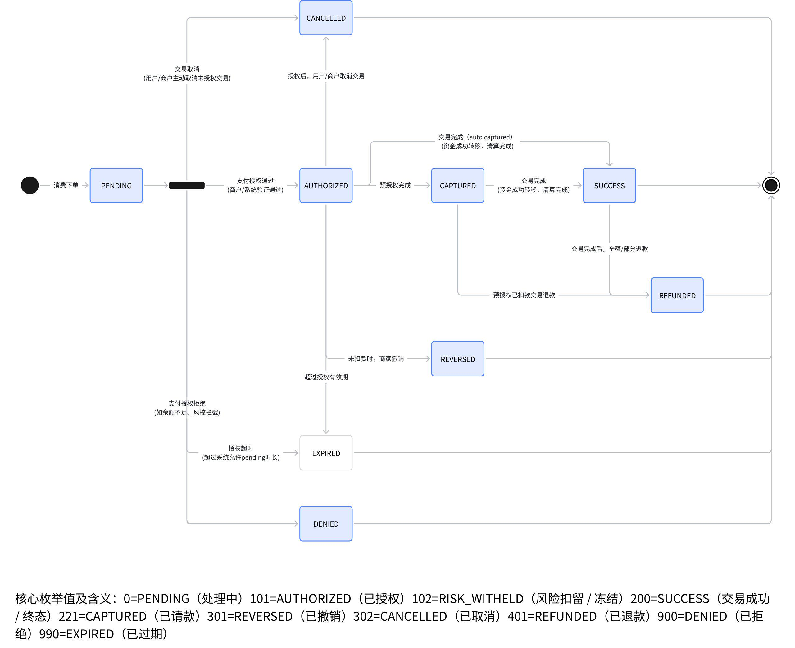

# 4. 数据字典

4.1 **Wallet数据字典**

4.1.1 **Available Currency可用币种**

<table style="width:88%;">
<colgroup>
<col style="width: 88%" />
</colgroup>
<tbody>
<tr>
<td><table style="width:86%;">
<colgroup>
<col style="width: 14%" />
<col style="width: 34%" />
<col style="width: 36%" />
</colgroup>
<tbody>
<tr>
<td style="text-align: left;"><strong>Currency</strong></td>
<td style="text-align: left;"><strong>Descriptor</strong></td>
<td style="text-align: left;"><strong>Remark</strong></td>
</tr>
<tr>
<td style="text-align: left;">SGD</td>
<td style="text-align: left;">Singapore Dollar</td>
<td style="text-align: left;">新加坡元</td>
</tr>
<tr>
<td style="text-align: left;">USD</td>
<td style="text-align: left;">United States Dollar</td>
<td style="text-align: left;">美元</td>
</tr>
<tr>
<td style="text-align: left;">ETH</td>
<td style="text-align: left;">Ether (Ethereum), will be deprecated on 01 Dec 2024</td>
<td style="text-align: left;">以太坊于2024年12月1日弃用</td>
</tr>
<tr>
<td style="text-align: left;">BTC</td>
<td style="text-align: left;">Bitcoin, will be deprecated on 01 Dec 2024</td>
<td style="text-align: left;">比特币于2024年12月1日弃用</td>
</tr>
<tr>
<td style="text-align: left;">USDT</td>
<td style="text-align: left;">USD Tether</td>
<td style="text-align: left;">泰达币</td>
</tr>
<tr>
<td style="text-align: left;">USDC</td>
<td style="text-align: left;">USD Coin</td>
<td style="text-align: left;">美元币</td>
</tr>
<tr>
<td style="text-align: left;">FPS</td>
<td style="text-align: left;">Faster Payment System</td>
<td style="text-align: left;"></td>
</tr>
</tbody>
</table></td>
</tr>
</tbody>
</table>

4.1.2 **CryptoTransactionType加密币交易类型**

**点击图片可查看完整电子表格**

4.1.3 **CryptoTransactionState加密币交易状态**

**点击图片可查看完整电子表格**

4.1.4 **MainNet主网络**

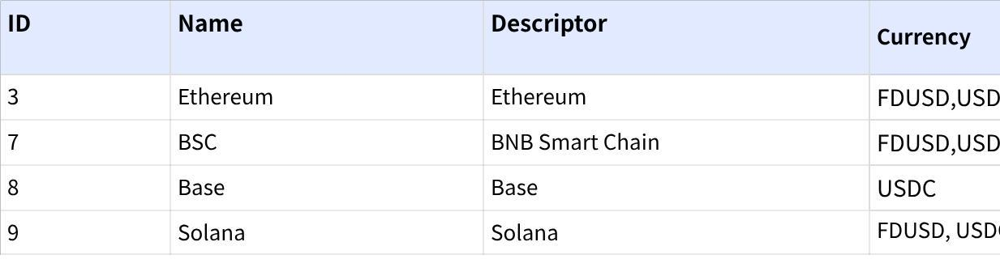

**点击图片可查看完整电子表格**

4.1.5 **OtcStatus场外交易状态**

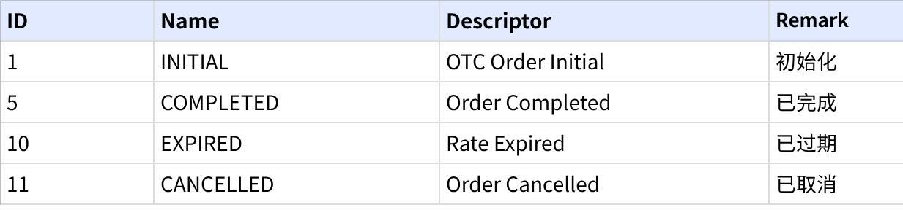

**点击图片可查看完整电子表格**

4.2 **Card数据字典**

4.2.1 **Transaction Status卡交易状态**

**点击图片可查看完整电子表格**

4.2.2 **Transaction Type卡交易类型**

**点击图片可查看完整电子表格**

# 5. 映射关系（交易记录）

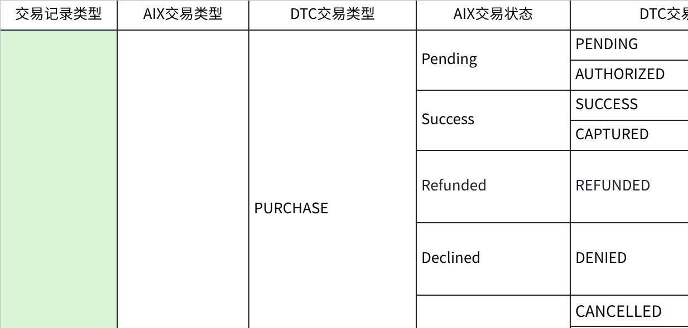

**点击图片可查看完整电子表格**

# 6. 时区显示

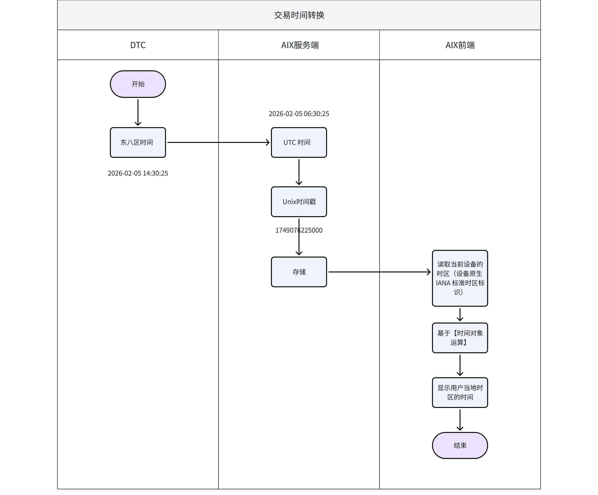

# 7. AIX前端功能需求

7.1 **全量交易记录Transaction**

7.1.1 **需求背景**

<table style="width:88%;">
<colgroup>
<col style="width: 88%" />
</colgroup>
<tbody>
<tr>
<td style="text-align: left;">
将<strong>卡交易、加密币交易、兑换记录</strong>整合成一个全量交易，并通过多维度筛选（类型、币种与时间）帮助用户清晰查看并追踪每笔交易状态与详情；

用户可以查看最<strong>近1年</strong>（可配置）内的交易数据；
</td>
</tr>
</tbody>
</table>

7.1.2 **业务流程**

7.1.3 **页面交互**

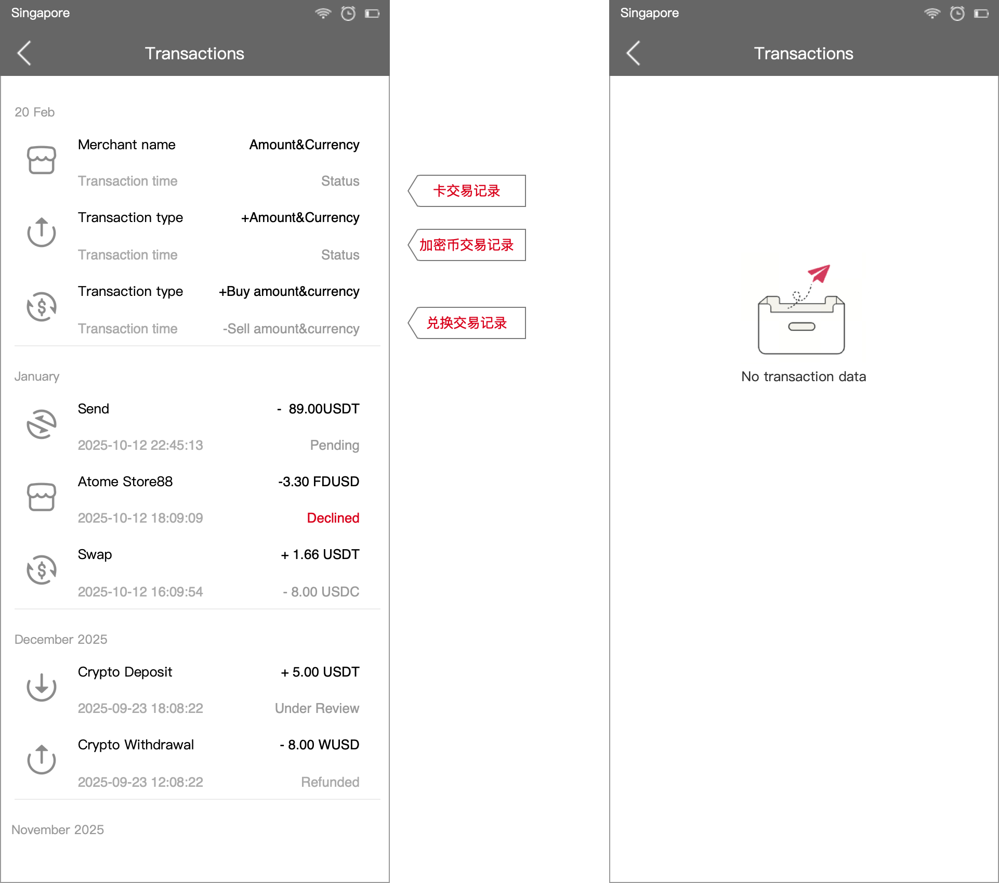

7.1.4 **功能需求**

<table style="width:89%;">
<colgroup>
<col style="width: 9%" />
<col style="width: 18%" />
<col style="width: 46%" />
<col style="width: 14%" />
</colgroup>
<tbody>
<tr>
<td style="text-align: center;"><strong>需求</strong></td>
<td style="text-align: left;"><strong>UI或UE</strong></td>
<td style="text-align: center;"><strong>需求描述</strong></td>
<td style="text-align: center;"><strong>备注</strong></td>
</tr>
<tr>
<td style="text-align: left;">全量交易入口</td>
<td style="text-align: center;">
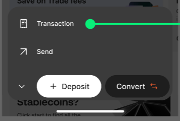

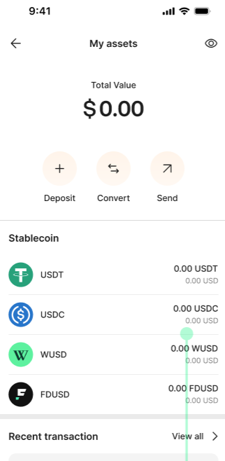
</td>
<td style="text-align: center;">
<strong>全量交易入口：</strong>

AIX 首页点击Transaction；

Wallet首页点击View all；
</td>
<td style="text-align: left;"></td>
</tr>
<tr>
<td style="text-align: left;">全量交易记录</td>
<td style="text-align: center;">
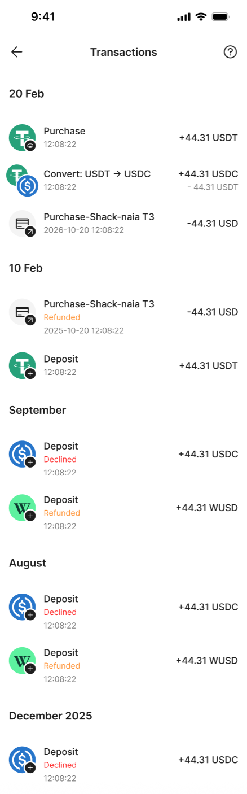

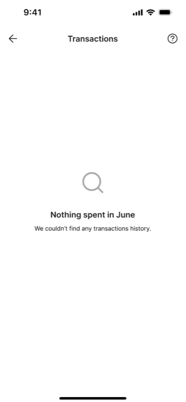
</td>
<td style="text-align: center;">
查询交易记录，会根据用户选择类型、币种做不同数据过滤；

<strong>顶部导航栏：</strong>

标题：“Transactions”

返回：点击 “←”，可回到上一级页面；

说明：点击“？”跳转到问题库页面Frequently asked questions；详见：<a href="https://advancegroup.sg.larksuite.com/wiki/RN10whwf3iVjrWkaunGlJTeOgvd">AIX APP V1.0 【FAQ】</a>

<del>FAQ暂未做OBoss可视化编辑Dashboard，先预设到数据库（<strong>问题 ID、标题、描述、关联场景、类型、超链接、创建时间</strong>）；</del>

<del>根据关键场景“Transactions”、类型“All Transactions”筛选FAQ并按创建时间降序排列展示对应FAQ给用户，滑动加载更多，不翻页；</del>

<del>FAQ默认只显示问题折叠答案，点击任意一个问题只显示当前这条的答案；</del>

<strong>交易列表区</strong>

当前全量交易是聚合（<strong>钱包加密币交易、兑换记录、卡交易记录</strong>）三大交易记录，后端调用加密币交易接口【/openapi/v1/crypto-txn/search】、OTC兑换记录接口【/openapi/v1/otc/search】、卡交易接口【/openapi/v1/card/inquiry-card-transaction】查询交易记录（多张卡就查多次，针对已激活和已冻结的），并按交易类型进行数据过滤后展示给用户；

① 加密币交易仅展示原始交易类型为【DEPOSIT】【TRANSFER_IN】【TRANSFER_OUT】【CARD_FEE_DEBIT】【CARD_FEE_REFUND】的记录给用户；

② 加密币兑换的展示全部记录给用户；

③ 卡交易仅展示原始交易类型为【PURCHASE】【CASH_WITHDRAWAL】【REFUND】【INCREMENTAL_AUTH】的记录给用户；

-4月14日更新：DTC反馈有部分退款会使用【REVERSAL】，因此卡交易需展示该类型=19的单子。前端与【REFUND】一样均显示{refund-商户名称}。

静默刷新：用户进入该页面时，静默刷新获取最新交易数据；

默认从近1年的时间范围查询交易数据，并按排序规则展示给用户，滑动页面加载更多数据（MVP不做分页，后续迭代）；可配置

交易记录分区排序规则：

当年当月的交易记录，按日&amp;简写月显示（如：20 Feb），每组内按交易按时间降序排列；å

当年历史月的交易记录，按具体月显示（如：January），每组内按交易按时间降序排列；

历史年的交易记录，按具体月&amp;具体年显示（如：December 2025），每组内按交易按时间降序排列；

交易时间显示格式：月份缩写-日期-年份（eg：Feb-25-2026 10:23:30）

点击单条记录根据<strong>交易ID和交易类型（用户区分调哪个详情接口）</strong>并跳转到指定交易详情页Transaction Details；

Type：<strong>全量交易类型</strong>及对应图标可配置

Payment消费（卡）

Cash Withdrawal提取现金（卡）

Crypto Deposit加密币充值

Receive转入

Send转出

Swap兑换（兑换）

Refund退款（卡）

Card Application 申卡扣费

Card Cancel申卡退费

Status：<strong>全量交易状态</strong>可配置

Pending待处理

Success成功

Refunded已退款

Declined拒绝

Under Review待审核

Cancelled取消

<strong>单笔加密币交易展示逻辑：</strong>

Type：交易类型（对客显示为交易名称）

Crypto Deposit

Receive

Send

Card Application

Card Cancel

Indicator：交易方向：入金+、出金-：

Crypto Deposit存款【+】

Receive转入【+】

Send转出【-】

Card Application 【-】

Card Cancel【+】

Amount&amp;Currency：交易金额及币种

Transaction time：交易时间

Status：加密币交易状态

Pending

Success

Refunded

Declined

Under Review

Cancelled

<strong>单笔兑换交易展示逻辑：（不显示交易状态）</strong>

Type：交易类型（对客显示为交易名称）

Swap兑换

Indicator：交易方向：入金+、出金-：

Buy currency兑换买入【+】

Sell currency兑换卖出【-】

Buy amount&amp;currency：买入金额及币种

Sell amount&amp;currency：卖出金额及币种

Transaction time：交易时间

<strong>单笔卡交易展示逻辑：（不显示交易类型，但要返给前端）</strong>

Merchant name：商户名称（对客显示为交易名称）

Indicator<strong>：</strong>交易方向：Credit、Debit：

Credit卡借记【+】

Debit卡贷记【-】

requestAmount&amp;requestCurrency：交易金额（法币）

Transaction time：交易时间

State：交易状态

Pending

Success

Refunded

Declined

Cancelled

DTC异常逻辑：

加密币交易接口【/openapi/v1/crypto-txn/search】Error Response：

Scenario：Query stablecoin transaction failed

Code： 11999

Message：Query stablecoin transaction failed

OTC兑换记录接口【/openapi/v1/otc/search】Error Response：

Code： 11999

Message：Invalid OTC Id

卡交易接口【/openapi/v1/card/inquiry-card-transaction】Error Response：

Code：00006、31005、31006

Message：Access denied、Card information is invalid、Parameters entered is invalid

AIX异常逻辑：

若DTC接口异常、服务端接口异常，则前端显示缺省页面，统一提示用户：数据异常（Data error. Please refresh and try again.）。服务端区分不同的code来帮助进一步排查问题。

若网络异常，则则前端显示缺省页面，统一提示用户：网络异常（No internet connection. Please retry）。

【3/31】卡交易item显示规则：

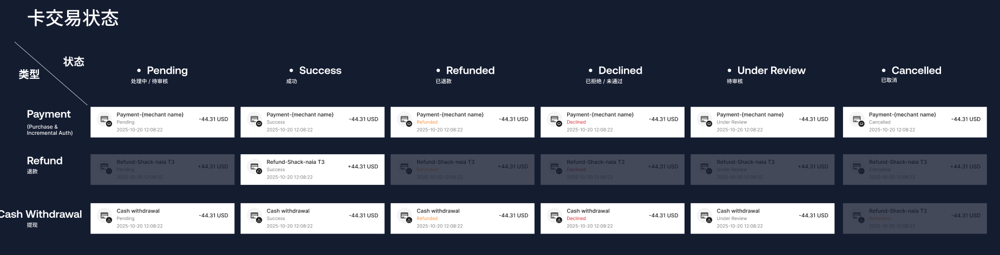

Refund包括：refund、reversed
</td>
<td style="text-align: left;"></td>
</tr>
</tbody>
</table>

7.1.5 **交易列表整合（供开发参考，绿色对客）**

[AIX Card - Wallet & Card字段处理](https://advancegroup.sg.larksuite.com/sheets/KvtPs3xv5hfS5wt3Q6xlPC2IgHO?sheet=euIB3i)

7.2 **卡交易列表Card History**

7.2.1 **需求背景**

<table style="width:88%;">
<colgroup>
<col style="width: 88%" />
</colgroup>
<tbody>
<tr>
<td style="text-align: left;">
用户在使用加密货币卡（如 AIX卡-USDT）进行交易后，可清晰查看每笔交易的全维度信息（金额、状态、币种、商户等）

用户可以查看最近1年内的卡交易数据，但单次最多查询最多6个月；

注：卡冻结时候也是可以获取交易记录；
</td>
</tr>
</tbody>
</table>

7.2.2 **业务流程**

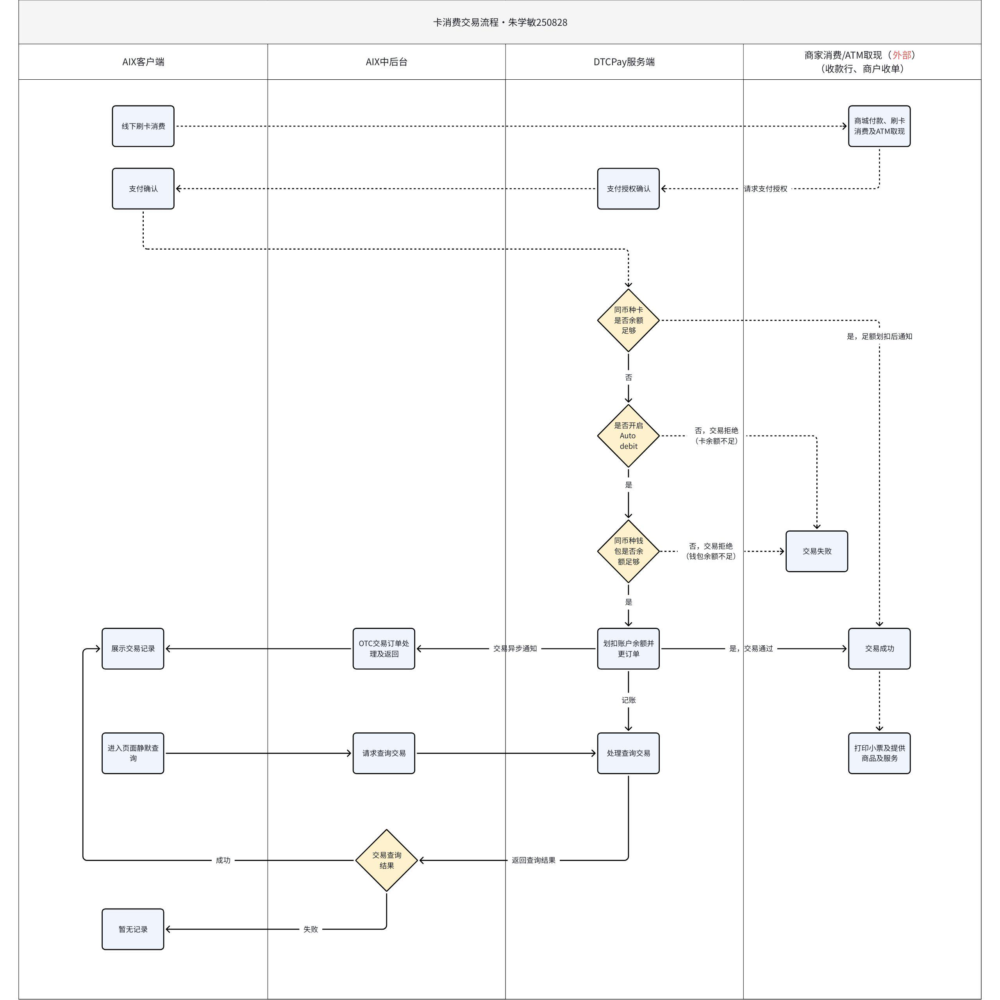

7.2.3 **页面交互**

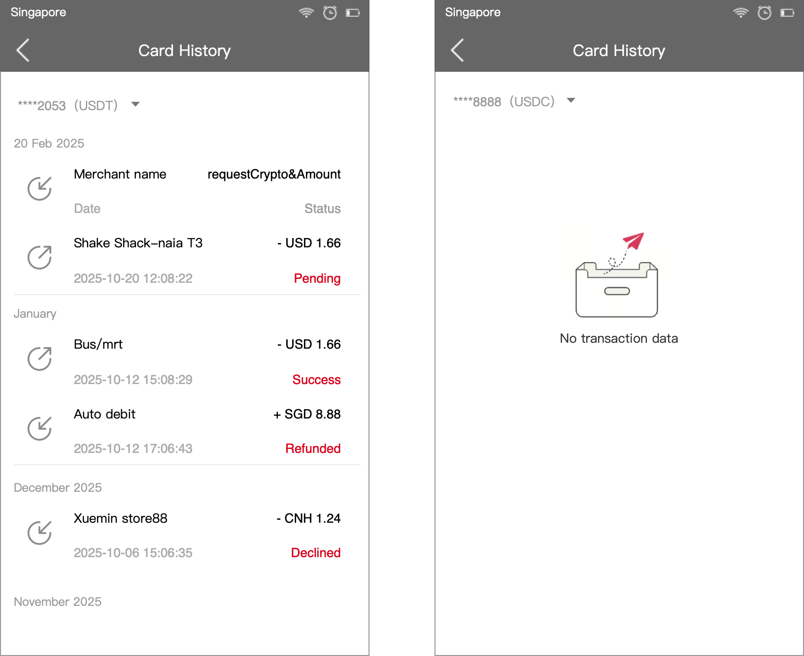

7.2.4 **功能需求**

<table style="width:89%;">
<colgroup>
<col style="width: 8%" />
<col style="width: 18%" />
<col style="width: 43%" />
<col style="width: 18%" />
</colgroup>
<tbody>
<tr>
<td style="text-align: center;"><strong>需求</strong></td>
<td style="text-align: left;"><strong>UI或UX</strong></td>
<td style="text-align: center;"><strong>需求描述</strong></td>
<td style="text-align: center;"><strong>备注</strong></td>
</tr>
<tr>
<td style="text-align: left;">卡交易入口</td>
<td style="text-align: center;">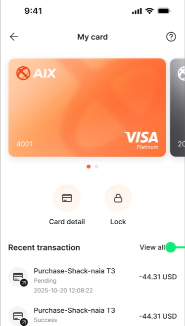</td>
<td style="text-align: center;">
<strong>卡交易入口</strong>

Card卡首页点击“View all”
</td>
<td style="text-align: left;"></td>
</tr>
<tr>
<td style="text-align: left;">Card History</td>
<td style="text-align: center;">
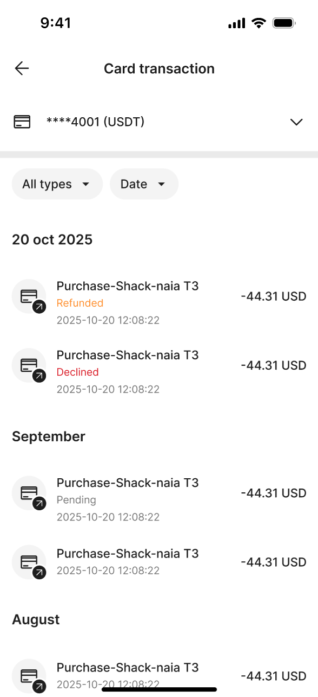

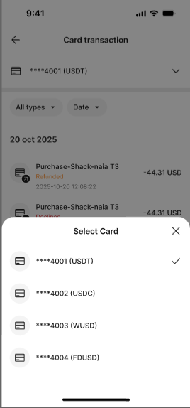

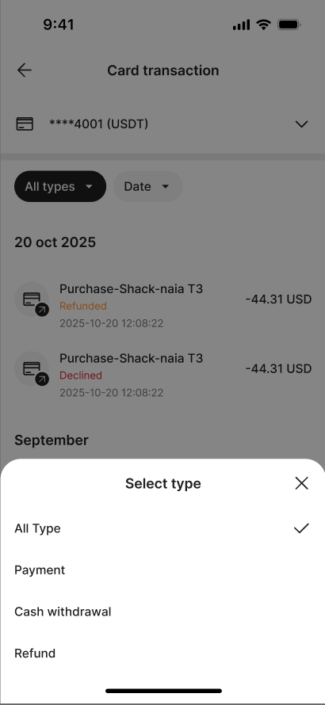

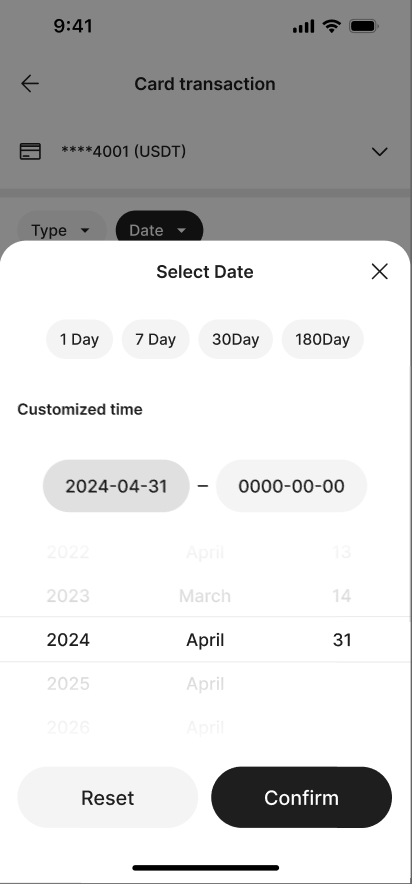
</td>
<td style="text-align: center;">
<strong>顶部导航栏：</strong>

标题：“Card History”

返回：点击 “←”，可回到上一级页面

<strong>卡片选择区：</strong>

Card：显示当前用户所有卡状态为“Active、Suspended”的<strong>脱敏卡号与币种</strong>，示例“****2053 (USDT)”

若用户持有多张卡，按申请时间降序排列，点击下拉箭头“V”支持切换不同卡片，选择后列表同步加载该卡片的交易记录；

<strong>交易列表区：</strong>

用户进入该页面时，后端调用接口【/openapi/v1/card/ inquiry-card-transaction】查询交易记录并按以下交易类型进行数据过滤后展示给用户；

① 卡交易仅展示原始交易类型为【PURCHASE】【CASH_WITHDRAWAL】【REFUND】【INCREMENTAL_AUTH】的记录给用户；

-4月14日更新：DTC反馈有部分退款会使用【REVERSAL】，因此卡交易需展示该类型=19的单子。前端与【REFUND】一样均显示{refund-商户名称}。

<strong>静默刷新</strong>：用户进入该页面时，静默刷新获取<strong>近1年</strong>交易数据；

数据展示：

如果有数据，就滑动加载更多，MVP不做分页；

如果没有数据就占位符显示“No transaction data”

交易记录排序规则：

当年当月的交易记录，按日&amp;简写月显示（如：20 Feb），每组内按交易按时间降序排列；

当年历史月的交易记录，按具体月显示（如：January），每组内按交易按时间降序排列；

历史年的交易记录，按具体月&amp;具体年显示（如：December 2025），每组内按交易按时间降序排列；

点击任意一条交易记录，会跳转到卡交易详情页面“Transaction Details”；

<strong>单笔卡交易展示逻辑：</strong>

Merchant name：商户名称（对客显示为交易名称）

Indicator<strong>：</strong>交易方向：Credit、Debit：

Credit卡借记【+】

Debit卡贷记【-】

requestAmount&amp;requestCurrency：交易金额（法币）

Transaction time：交易时间

State：交易状态可配置

Pending

Success

Refunded

Declined

Cancelled
</td>
<td style="text-align: left;"></td>
</tr>
</tbody>
</table>

7.3 **卡交易详情Card Transaction Details**

7.3.1 **需求背景**

|                                                                   |
|:------------------------------------------------------------------|
| 用户在使用加密货币卡（如 AIX卡-USDT）进行交易后，可单笔交易详情； |

7.3.2 **业务流程**

7.3.3 **页面交互**

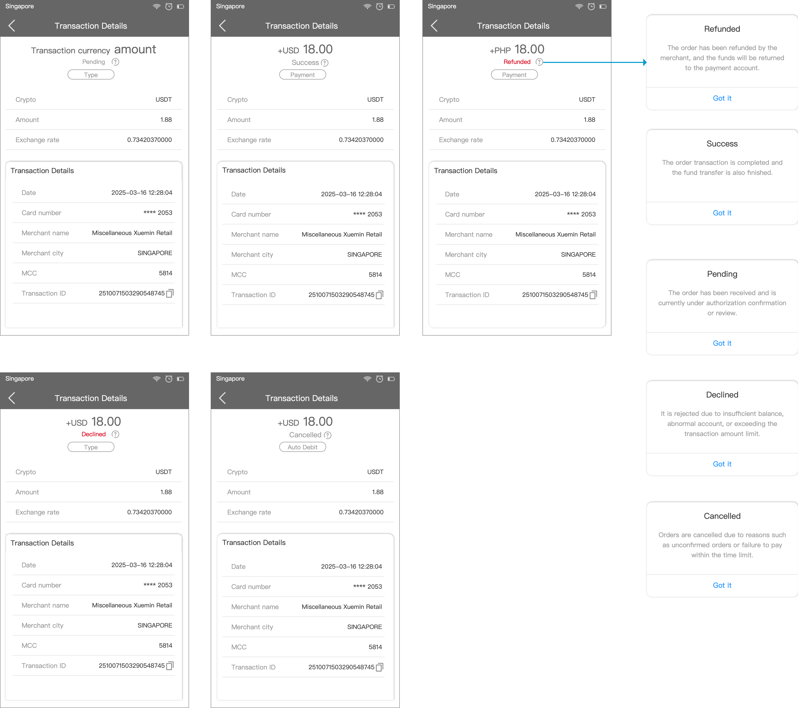

7.3.4 **功能需求**

<table style="width:89%;">
<colgroup>
<col style="width: 9%" />
<col style="width: 18%" />
<col style="width: 47%" />
<col style="width: 13%" />
</colgroup>
<tbody>
<tr>
<td style="text-align: center;"><strong>需求</strong></td>
<td style="text-align: left;"><strong>UI或UX</strong></td>
<td style="text-align: center;"><strong>需求描述</strong></td>
<td style="text-align: center;"><strong>备注</strong></td>
</tr>
<tr>
<td style="text-align: left;">Transaction Details</td>
<td style="text-align: center;">
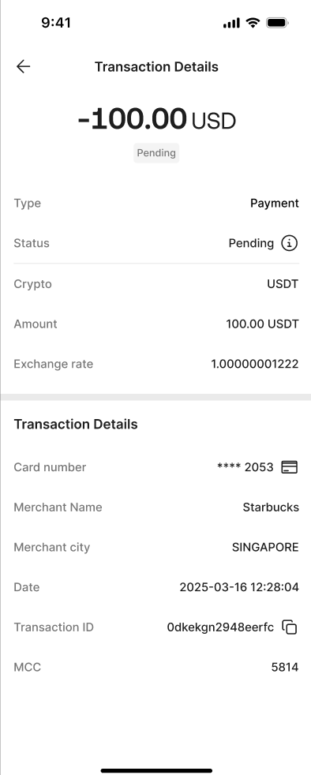

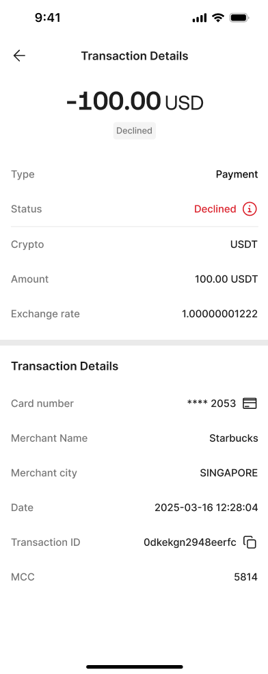

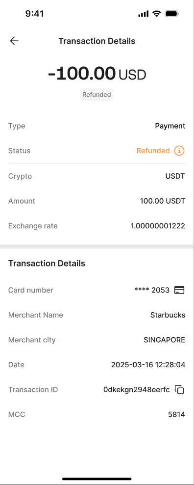

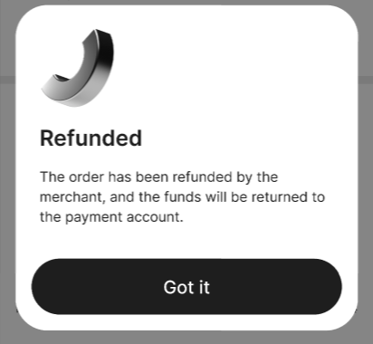
</td>
<td style="text-align: center;">
<strong>卡交易详情入口</strong>

Card卡首页的交易区域点击任意一条记录；

Card History卡交易记录点击任意一条记录；

<strong>顶部导航栏：</strong>

标题：“Transaction Details”

返回：点击“←”，可回到上一级页面；

说明：点击“？跳转到问题库页面Frequently asked questions；详见：<a href="https://advancegroup.sg.larksuite.com/wiki/RN10whwf3iVjrWkaunGlJTeOgvd">AIX APP V1.0 【FAQ】</a>

<del>FAQ暂未做OBoss可视化编辑Dashboard，先预设到数据库（<strong>问题 ID、标题、描述、关联场景、类型、超链接、创建时间</strong>）；</del>

<del>根据关键场景“Transactions”、类型“Transactions Details”筛选FAQ并按创建时间降序排列展示对应FAQ给用户，滑动加载更多，不翻页；</del>

<del>FAQ默认只显示问题折叠答案，点击任意一个问题只显示当前这条的答案；</del>

<strong>交易概览区：</strong>

用户进入该页面时，调用接口【[POST]/open api/v1/card/inquiry card transaction detail】，并上送Transaction ID获取最新交易记录展示给用户；

requestAmount&amp;requestCurrency：交易金额（法币）

Indicator<strong>：</strong>交易方向：Credit、Debit：

Credit卡借记【+】

Debit卡贷记【-】

Type：交易类型：可配置

Payment消费

Cash withdrawal现金取款

Refund退款

Status：交易状态：可配置

Pending处理中

Success交易成功

Cancelled已取消

Refunded已退款

Denied已拒绝

状态说明：点击“？”弹窗显示卡交易的不同状态说明可配置

<strong>Pending</strong>：显示“The order has been received and is currently under authorization confirmation or review.”；

<strong>Success</strong>：显示“The order transaction is completed and the fund transfer is also finished.”

<strong>Refunded</strong>：显示“The order has been refunded by the merchant, and the funds will be returned to the payment account.”

<strong>Declined</strong>：显示“It is rejected due to insufficient balance, abnormal account, or exceeding the transaction amount limit.”

<strong>Cancelled</strong>：显示“Orders are cancelled due to reasons such as unconfirmed orders or failure to pay within the time limit.”

点击“Got it”关闭弹窗返回当前页面；

Crypto：加密币：

USDT

USDC

WUSD

FDUSD

Amount：加密币金额

Exchange rate：汇率

<strong>交易详情区：</strong>

Date：创建时间

Card number：截断卡号（脱敏）

Merchant name：商户名称

Merchant city：商户城市【非必填项】，如果没有则不显示该item

MCC：商户类别码【非必填项】，如果没有则不显示该item

Transaction ID：交易单号，点击“<strong>❐</strong>”可以复制Transaction ID，并提示“The information has been copied.”；
</td>
<td style="text-align: left;"></td>
</tr>
<tr>
<td style="text-align: left;"></td>
<td style="text-align: center;">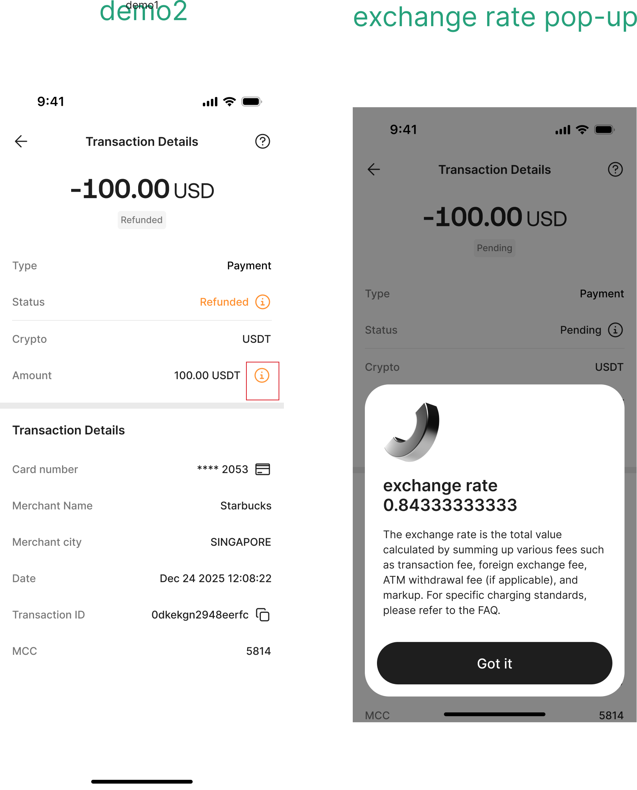</td>
<td style="text-align: left;">
3/31需求

Exchange rate：改成半弹层。

Exchange rate：显示小数点后6位，向上取整。
</td>
<td style="text-align: left;"></td>
</tr>
</tbody>
</table>

7.4 **加密币交易详情Crypto Transaction Details**

7.4.1 **需求背景**

|                                                  |
|:-------------------------------------------------|
| 对于钱包有出入金的用户，可以查看每笔交易的明细。 |

7.4.2 **业务流程**

7.4.3 **页面交互**

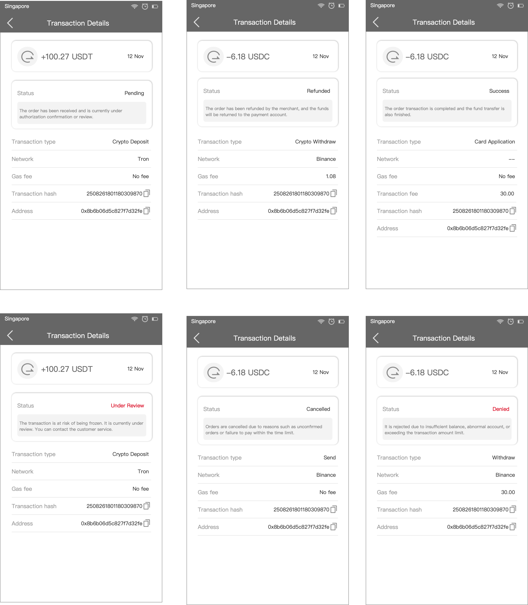

7.4.4 **功能需求**

<table style="width:89%;">
<colgroup>
<col style="width: 6%" />
<col style="width: 14%" />
<col style="width: 43%" />
<col style="width: 23%" />
</colgroup>
<tbody>
<tr>
<td style="text-align: center;"><strong>需求</strong></td>
<td style="text-align: left;"><strong>UI或UX</strong></td>
<td style="text-align: center;"><strong>需求描述</strong></td>
<td style="text-align: center;"><strong>备注</strong></td>
</tr>
<tr>
<td style="text-align: left;">加密交易记录</td>
<td style="text-align: center;">
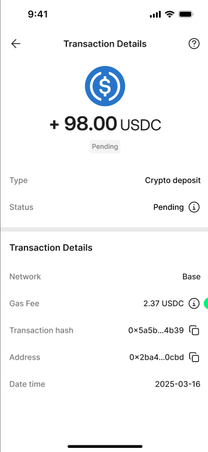

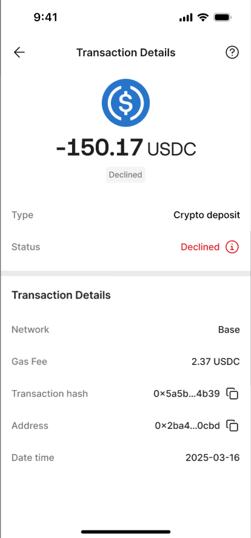

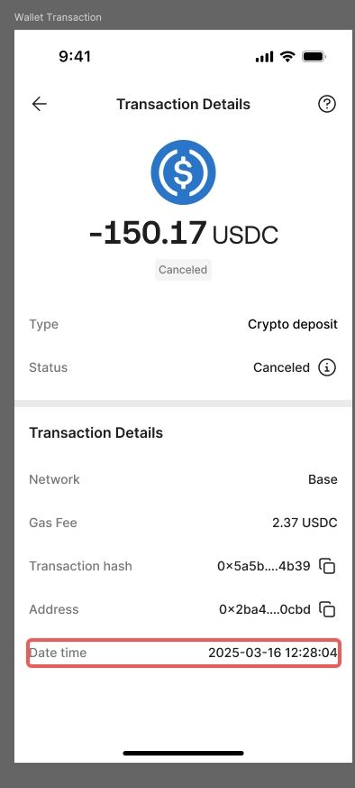

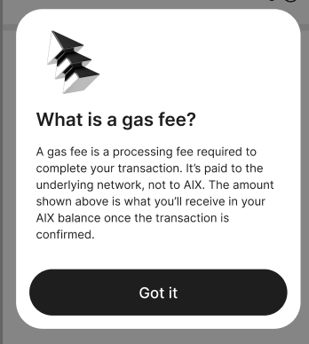
</td>
<td style="text-align: center;">
<strong>加密交易详情入口：</strong>

钱包资产点击任意加密币交易记录；

单币种首页点击任意加密币交易记录；

全量交易记录点击任意加密币交易记录；

<strong>顶部导航栏：</strong>

标题：“Transaction Details”

返回：点击“←”，可回到上一级页面；

说明：点击“？”跳转到问题库页面Frequently asked questions；

FAQ暂未做OBoss可视化编辑Dashboard，先预设到数据库（<strong>问题 ID、标题、描述、关联场景、类型、超链接、创建时间</strong>）；

根据关键场景“Transactions”、类型“Transactions Details”筛选FAQ并按创建时间降序排列展示对应FAQ给用户，滑动加载更多，不翻页；

FAQ默认只显示问题折叠答案，点击任意一个问题只显示当前这条的答案；

<strong>交易概览区：</strong>

进入交易详情页后根据交易单号txnId调用接口【/openapi/v1/crypto-txn/{txnId}】查询单笔交易详情并展示给用户；

Currency&amp;Amount：交易金额&amp;币种，如“+5.00 USD”：

Deposit存款【入金+】

Withdraw提现【出金-】

Transfer In转入【入金+】

Transfer Out转出【出金-】

Transaction type：交易类型可配置

Deposit存款

Withdraw提现

Transfer In转入

Transfer Out转出

Card Application 申卡扣费

Card Cancel申卡退费

Transaction state：交易状态：可配置

Pending待处理

Success成功

Refunded已退款

Declined拒绝

Under Review待审核

Cancelled取消

状态说明：显示加密币交易的不同状态说明可配置

<strong>Pending</strong>：显示“The order has been received and is currently under authorization confirmation or review.”；

<strong>Success</strong>：显示“The order transaction is completed and the fund transfer is also finished.”

<strong>Refunded</strong>：显示“The order has been refunded by the merchant, and the funds will be returned to the payment account.”

<strong>Declined</strong>：显示“It is rejected due to insufficient balance, abnormal account, or exceeding the transaction amount limit.”

<strong>Under Review</strong>：显示“The transaction is at risk of being frozen. It is currently under review. You can contact the customer service.”

<strong>Cancelled</strong>：显示“Orders are cancelled due to reasons such as unconfirmed orders or failure to pay within the time limit.”

点击“Got it”关闭弹窗返回当前页面；

<strong>详情卡片区：</strong>

Network：网络，如果没有则不显示该item

Gas fee：网络服务费：

金额为0时，显示“No fee”；并有Gas fee说明“What is a gas fee?” “A gas fee is a processing fee required to complete your transaction. It’s paid to the underlying network, not to AIX. The amount shown above is what you’ll receive in your AIX balance once the transaction is confirmed.”；

金额不为0时，显示具体金额，并有Gas fee说明“What is a gas fee?” “A gas fee is a processing fee required to complete your transaction. It’s paid to the underlying network, not to AIX. The amount shown above is what you’ll receive in your AIX balance once the transaction is confirmed.”；

【非必填项】，如果没有则不显示该item

--4月14日更正：隐藏Gas fee 这一个item

Transaction hash：交易哈希值

点击“❐”，可将 Transaction hash复制到剪贴板，并提示“The information has been copied.”；

脱敏规则：前6后4，中间用“...”表示

【非必填项】，如果没有则不显示该item

recipientAddress：接收人地址

点击“❐”，可将Address复制到剪贴板，并提示“The information has been copied.”；

脱敏规则：前6后4，中间用“...”表示

【非必填项】，如果没有则不显示该item

SenderAddress：转账方地址

点击“❐”，可将Address复制到剪贴板，并提示“The information has been copied.”；

脱敏规则：前6后4，中间用“...”表示

【非必填项】，如果没有则不显示该item

Transaction time：月份缩写-日期-年份（eg：Feb-25-2026 10:23:30）
</td>
<td style="text-align: left;"></td>
</tr>
</tbody>
</table>

7.5 **钱包兑换详情Swap Details**

7.5.1 **需求背景**

|                                              |
|:---------------------------------------------|
| 展示用户加密货币兑换（Swap）的交易详情页面。 |

7.5.2 **业务流程**

7.5.3 **页面交互**

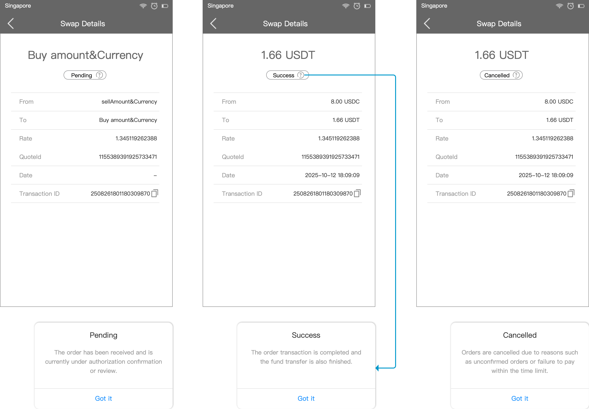

7.5.4 **功能需求**

<table style="width:89%;">
<colgroup>
<col style="width: 9%" />
<col style="width: 15%" />
<col style="width: 46%" />
<col style="width: 17%" />
</colgroup>
<tbody>
<tr>
<td style="text-align: center;"><strong>需求</strong></td>
<td style="text-align: left;"><strong>UI或UX</strong></td>
<td style="text-align: center;"><strong>需求描述</strong></td>
<td style="text-align: center;"><strong>备注</strong></td>
</tr>
<tr>
<td style="text-align: left;">兑换详情</td>
<td style="text-align: center;">
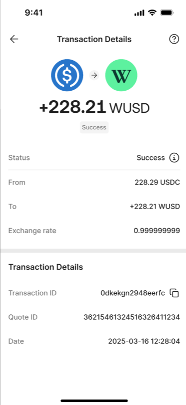

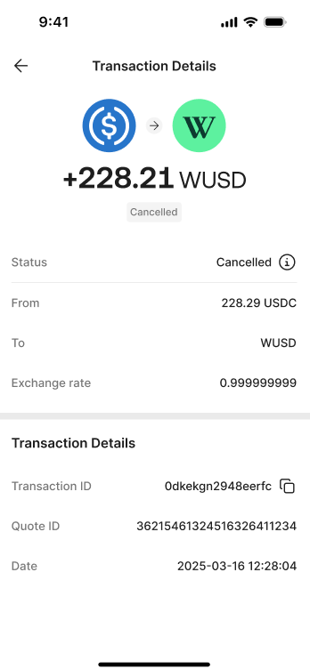

</td>
<td style="text-align: center;">
<strong>顶部导航栏：</strong>

标题：“Swap Details”

返回：点击“←”，可回到上一级页面；

说明：点击“？”跳转到问题库页面Frequently asked questions；

FAQ暂未做OBoss可视化编辑Dashboard，先预设到数据库（<strong>问题 ID、标题、描述、关联场景、类型、超链接、创建时间</strong>）；

根据关键场景“Transactions”、类型“Transactions Details”筛选FAQ并按创建时间降序排列展示对应FAQ给用户，滑动加载更多，不翻页；

FAQ默认只显示问题折叠答案，点击任意一个问题只显示当前这条的答案；

<strong>交易概览区：</strong>

用户进入该页面时，调用接口【[GET] /openapi/v1/otc/{otc_id}】获取最新交易记录展示给用户；

BuyCurrency&amp;Amout：买入金额&amp;币种”；

Status：兑换交易状态：可配置

Pending待处理

Success成功

Cancelled取消

状态说明：点击“？”弹窗显示兑换交易的不同状态说明可配置

<strong>Pending</strong>：显示“The order has been received and is currently under authorization confirmation or review.”；

<strong>Success</strong>：显示“The order transaction is completed and the fund transfer is also finished.”

<strong>Cancelled</strong>：显示“Orders are cancelled due to reasons such as unconfirmed orders or failure to pay within the time limit.”

点击“Got it”关闭弹窗返回当前页面；

From：sellAmount&amp;Currency卖出金额及币种【-】；

To：Buy amount&amp;Currency买入金额及币种【+】

Exchange rate：汇率（注：不做位数处理，后端给啥显示啥）

<strong>交易详情区：</strong>

QuoteId：报价 ID

Date：交易日期

Transaction ID：交易 ID：

点击“ ❐”可以复制Transaction ID ，并提示“The information has been copied.”；
</td>
<td style="text-align: left;"></td>
</tr>
</tbody>
</table>

# 8. DTC渠道接口需求

8.1 **获取卡交易列表 Transaction History of Card**

8.1.1 **接口说明**

此接口用于从 dtcpay 中获取交易列表，还可进行诸如日期范围、交易状态和卡 ID 等可选筛选操作，并向持卡人展示指定卡交易历史记录。

8.1.2 **接口地址：**

\[POST\] /openapi/v1/card/ inquiry-card-transaction

8.1.3 **接口时序**

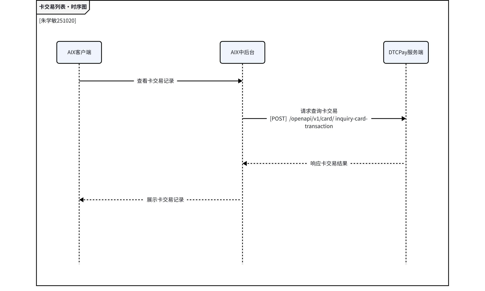

8.1.4 **接口请求**

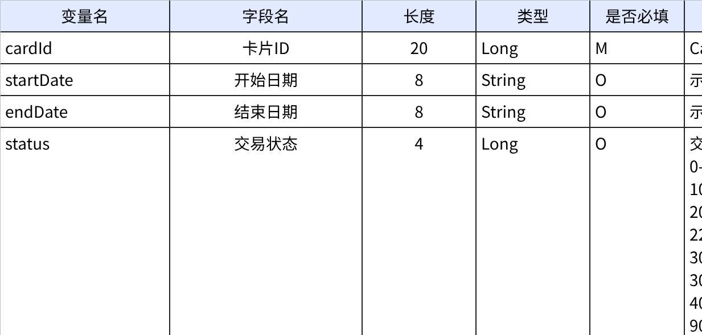

**点击图片可查看完整电子表格**

8.1.5 **接口响应**

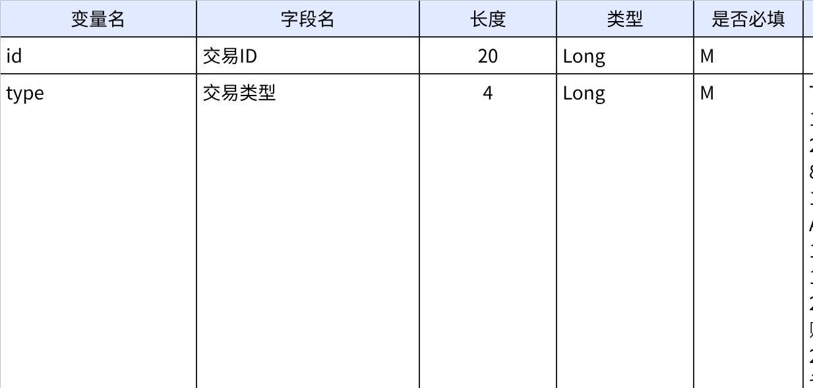

**点击图片可查看完整电子表格**

8.1.6 **错误码**

注：如果DTCPay接口返回当前错误码之外的其他错误，直接lark报警通知，以便产品和渠道确定后续的错误处理。

**点击图片可查看完整电子表格**

8.2 **获取卡交易详情Card Transaction Detail Inquiry**

8.2.1 **接口说明**

此接口用于特定卡交易的详细信息。

8.2.2 **接口地址：**

\[POST\]/open api/v1/card/inquiry card transaction detail

8.2.3 **接口时序**

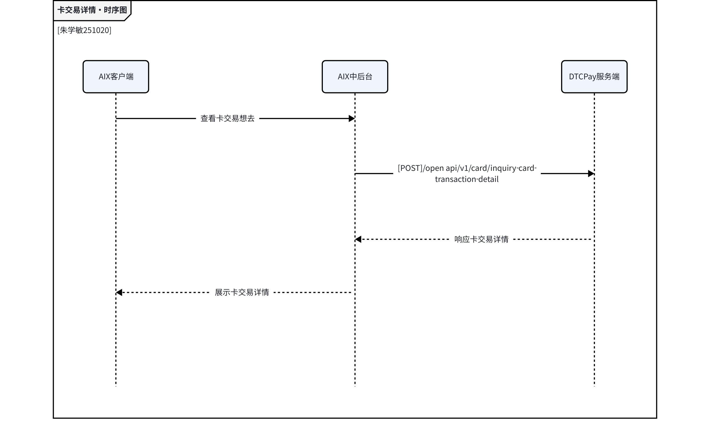

8.2.4 **接口请求**

**点击图片可查看完整电子表格**

8.2.5 **接口响应**

**点击图片可查看完整电子表格**

8.2.6 **错误码**

注：如果DTCPay接口返回当前错误码之外的其他错误，直接lark报警通知，以便产品和渠道确定后续的错误处理。

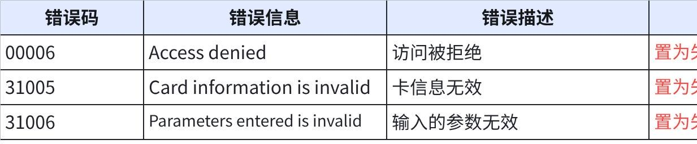

**点击图片可查看完整电子表格**

8.3 **Card Transaction Notify卡交易通知**

8.3.1 **接口说明**

此接口用于接收DTC的Webhook异步通知卡交易记录。

8.3.2 **接口响应**

**点击图片可查看完整电子表格**

8.4 **获取加密币交易列表Get Crypto Transaction History**

8.4.1 **接口说明**

此接口可获取客户的分页交易记录，支持按时间范围、交易状态、交易类型、地址 ID、主网和货币进行筛选。交易列表按 ID 降序排列，因此最新的交易会排在最前面。

8.4.2 **接口地址**

\[POST\] /openapi/v1/crypto-txn/search

8.4.3 **接口时序**

8.4.4 **接口请求**

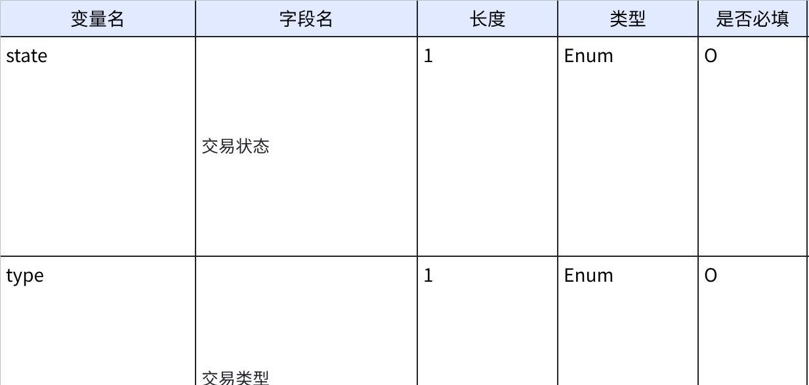

**点击图片可查看完整电子表格**

8.4.5 **接口响应**

**点击图片可查看完整电子表格**

8.4.6 **错误码**

注：如果DTCPay接口返回当前错误码之外的其他错误，直接lark报警通知，以便产品后续做错误处理和错误转义通知。

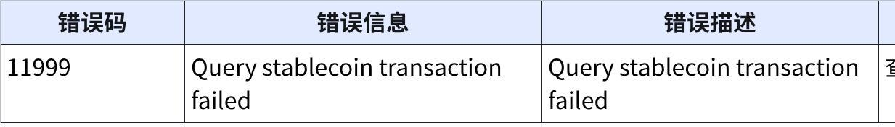

**点击图片可查看完整电子表格**

8.5 **查询单笔交易详情Get Crypto Transaction**

8.5.1 **接口说明**

此接口可根据交易ID获取单笔加密交易详细

8.5.2 **接口地址**

\[GET\] /openapi/v1/crypto-txn/{txnId}

8.5.3 **接口时序**

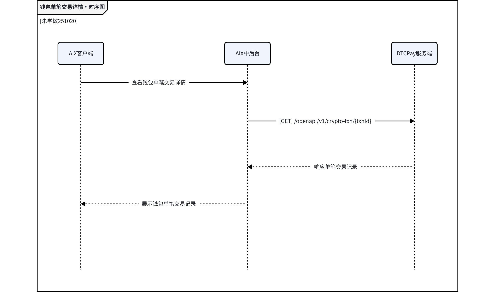

8.5.4 **接口请求**

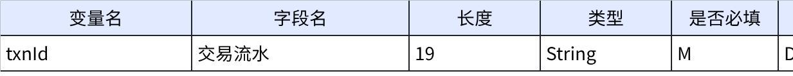

**点击图片可查看完整电子表格**

8.5.5 **接口响应**

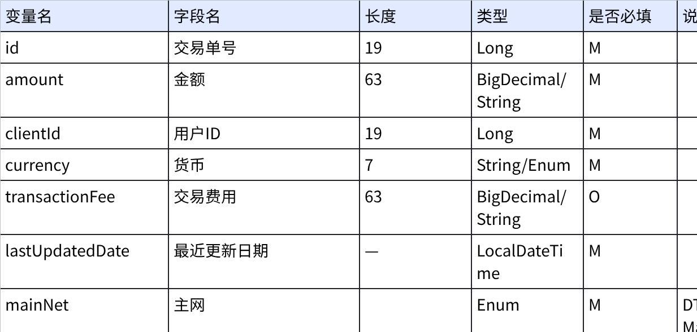

**点击图片可查看完整电子表格**

8.5.6 **错误码**

注：如果DTCPay接口返回当前错误码之外的其他错误，直接lark报警通知，以便产品和渠道确定后续的错误处理。

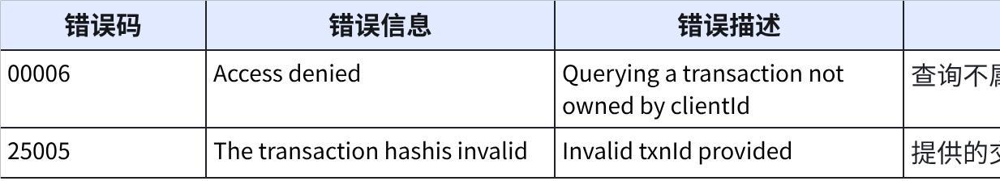

**点击图片可查看完整电子表格**

8.6 **获取场外交易历史Get OTC History**

8.6.1 **接口说明**

此接口用于查询OTC交易全量历史记录。

8.6.2 **接口地址**

\[POST\] /openapi/v1/otc/search

8.6.3 **接口时序**

8.6.4 **接口请求**

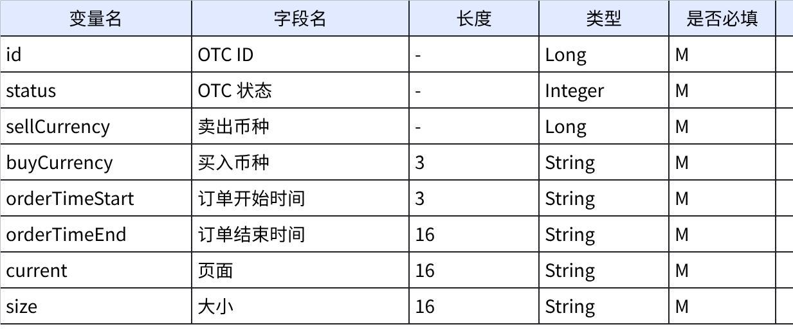

**点击图片可查看完整电子表格**

8.6.5 **接口响应**

**点击图片可查看完整电子表格**

8.6.6 **错误码**

注：如果DTCPay接口返回当前错误码之外的其他错误，直接lark报警通知，以便产品后续做错误处理和错误转义通知。

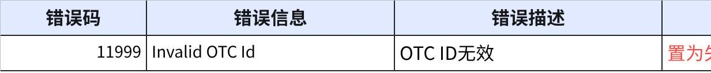

**点击图片可查看完整电子表格**

8.7 **查询OTC交易详情Get OTC Info**

8.7.1 **接口说明**

此接口通过otc_id查询场外交易详情；

8.7.2 **接口地址**

\[GET\] /openapi/v1/otc/{otc_id}

8.7.3 **接口时序**

8.7.4 **接口请求**

**点击图片可查看完整电子表格**

8.7.5 **接口响应**

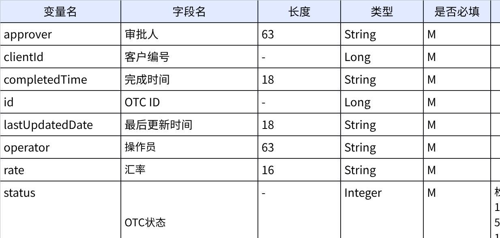

**点击图片可查看完整电子表格**

8.7.6 **错误码**

注：如果DTCPay接口返回当前错误码之外的其他错误，直接lark报警通知，以便产品和渠道确定后续的错误处理。

**点击图片可查看完整电子表格**

# 9. 附录

9.1 **相关文档**

<https://advancegroup.sg.larksuite.com/drive/folder/Q0dHfSY5ulRFR2dtJ7ullLpgg5g>

[AIX Card - Wallet & Card字段处理](https://advancegroup.sg.larksuite.com/sheets/KvtPs3xv5hfS5wt3Q6xlPC2IgHO?sheet=6b2169)

9.2 **需求评审**

https://advancegroup.sg.larksuite.com/minutes/obsgiyshndbtad6jlq2m6ku3
