# AIX Card V1.0【Application】

# 1. 引言

|  |  |
|:---|:---|
| **类型** | 链接 |
| PM |  |
| Figma | https://www.figma.com/design/iDt3nk3jeLm8iGg91uvfVU/%E2%86%92-AIX-Dev-Handoff-2025-Q4?node-id=0-1&p=f&t=bgAzx92hm9QrrgBq-0 |
| 翻译文案 |  |

1.1 **需求索引**

**\[同步块-无权限下载此内容\]**

1.2 **修订记录**

|  |  |  |  |  |
|:---|:---|:---|:---|:---|
| 日期 | 版本 | 说明 | 备注 | 作者 |
| Jan 28 | V1.0 | 申请实体卡的打印姓名增加阶段规则-DTC业务调整导致的变更 |  | @Xuemin Zhu 朱学敏 |
| Dec 24 | V1.0 | 申卡付费放开多币种支付-hanjie | 同hanjie、magic确认 | @Xuemin Zhu 朱学敏 |

# 2. 全局说明

2.1 **申卡说明**

<table style="width:88%;">
<colgroup>
<col style="width: 88%" />
</colgroup>
<tbody>
<tr>
<td>
仅完成钱包开通（DTC渠道开户和KYC验证通过）、刷卡Token有效、申卡5张以内的用户才能申请卡；

申卡有制卡费，如果做了全额减免直接调开卡接口，否则会在收银台页面根据当前所选择的币种获取实时汇率、试算应付款金额，并去扣所选择币种对应钱包的余额；

一个币种可以开多张同币种的卡；

一个用户可申请多张卡（<strong>5张，可配置</strong>），但仅可一张在途（处理中，DTC可配置是否限制）

开卡支持选择的币种：USDT、USDC、WUSD、FDUSD（后续可能会增加，需做成可配置）；

开卡支持的地区：一期支持：Philippines、Vietnam、Australia（二期会增加，需做成可配置）；
</td>
</tr>
</tbody>
</table>

2.2 **接口范围**

<table style="width:89%;">
<colgroup>
<col style="width: 12%" />
<col style="width: 19%" />
<col style="width: 32%" />
<col style="width: 24%" />
</colgroup>
<tbody>
<tr>
<td style="text-align: left;"><strong>接口</strong></td>
<td style="text-align: left;">接口名称</td>
<td style="text-align: left;"><strong>接口地址</strong></td>
<td style="text-align: left;"><strong>接口说明</strong></td>
</tr>
<tr>
<td style="text-align: left;"><strong>卡申请</strong></td>
<td style="text-align: left;">Card Application</td>
<td style="text-align: left;">[POST] /openapi/v1/card/request-card</td>
<td style="text-align: left;">
需完成刷脸Token验证

申请卡支持选择实体卡或虚拟卡

实体卡需单独激活
</td>
</tr>
<tr>
<td style="text-align: left;"><strong>查看全量币种余额</strong></td>
<td style="text-align: left;">Get Wallet Account Balance</td>
<td style="text-align: left;">[GET] /openapi/v1/wallet/balances</td>
<td style="text-align: left;">查询全量钱包余额，如果申卡开启了钱包不能为0的校验就要调用该接口，只要任一币种余额大于0即可</td>
</tr>
<tr>
<td style="text-align: left;"><strong>查询汇率</strong></td>
<td style="text-align: left;">Get OTC Rate</td>
<td style="text-align: left;">[POST] /openapi/v1/otc/get-otc-rate</td>
<td style="text-align: left;"></td>
</tr>
<tr>
<td style="text-align: left;"><strong>查询申卡接口</strong></td>
<td style="text-align: left;">Inquiry Card Basic Info with Reference No</td>
<td style="text-align: left;">[GET] /openapi/v1/card/inquiry-card-info/{referenceNo}</td>
<td style="text-align: left;">网络或响应异常时通过业务ID查询卡信息</td>
</tr>
<tr>
<td style="text-align: left;"><strong>查看卡基本信息</strong></td>
<td style="text-align: left;">Get Card Basic Info</td>
<td style="text-align: left;">[POST] /openapi/v1/card/inquiry-card-info</td>
<td style="text-align: left;">脱敏卡片详情（卡号后四位）、卡余额、追踪号码等</td>
</tr>
<tr>
<td style="text-align: left;"><strong>查看卡敏感信息</strong></td>
<td style="text-align: left;">Get Card Sensitive Info</td>
<td style="text-align: left;">[POST] /openapi/v1/card/inquiry-card-sensitive-info</td>
<td style="text-align: left;">
需完成刷脸Token验证

获取卡片完整卡号（PAN）、验证码（CVC）及有效期
</td>
</tr>
<tr>
<td style="text-align: left;"><strong>卡状态变更通知</strong></td>
<td style="text-align: left;">Card Status Change Notification</td>
<td style="text-align: left;"></td>
<td style="text-align: left;"></td>
</tr>
<tr>
<td style="text-align: left;"><strong>卡邮寄通知</strong></td>
<td style="text-align: left;">Card Delivery Notification</td>
<td style="text-align: left;"></td>
<td style="text-align: left;"></td>
</tr>
</tbody>
</table>

2.3 **接口字段**

[AIX Card - 全局参数&字段处理](https://advancegroup.sg.larksuite.com/sheets/KvtPs3xv5hfS5wt3Q6xlPC2IgHO?sheet=6b2169)

2.4 **FAQ汇总**

[AIX APP V1.0 【FAQ】](https://advancegroup.sg.larksuite.com/docx/OlWEdynrboay1QxcpfhlYbJtgZg)

2.5 **功能结构**

**\[同步块-无权限下载此内容\]**

# 3. Card状态处理

3.1 **卡状态映射**

**\[同步块-无权限下载此内容\]**

3.2 **虚拟卡状态机**

**\[同步块-无权限下载此内容\]**

3.3 **实体卡状态机**

**\[同步块-无权限下载此内容\]**

# 4. Card申请单状态

# 5. Card数据字典

5.1 **brand品牌**

|        |          |                |                         |
|:-------|:---------|:---------------|:------------------------|
| **ID** | **Name** | **Descriptor** | **Remark**              |
| 1      | VISA     | Visa           | 注：AIX Card对应的Brand |
| 2      | MASTER   | MasterCard     |                         |

5.2 **cardMaterial卡类型**

5.3 **cardStatus卡状态**

5.4 **feeType卡费用类型**

|        |                 |                |            |
|:-------|:----------------|:---------------|:-----------|
| **ID** | **Name**        | **Descriptor** | **Remark** |
| 1      | application fee | 申请费         | 默认1      |
| 2      | delivery fee    | 邮寄费         |            |

5.5 **autoDebitEnabled自动扣款**

|        |          |                |                                              |
|:-------|:---------|:---------------|:---------------------------------------------|
| **ID** | **Name** | **Descriptor** | **Remark**                                   |
| 0      | OFF      | 关闭自动扣款   |                                              |
| 2      | ON       | 开启自动扣款   | 默认开启，开启后卡消费时，会从同币种钱包扣款 |

# 6. AIX前端功能需求

6.1 **申请开卡（新用户）**

6.1.1 **需求背景**

|  |
|:---|
| 对于有使用稳定币进行实体和线上消费的用户，可以根据需求开通AIX Card实体卡和虚拟卡。 |

6.1.2 **业务流程**

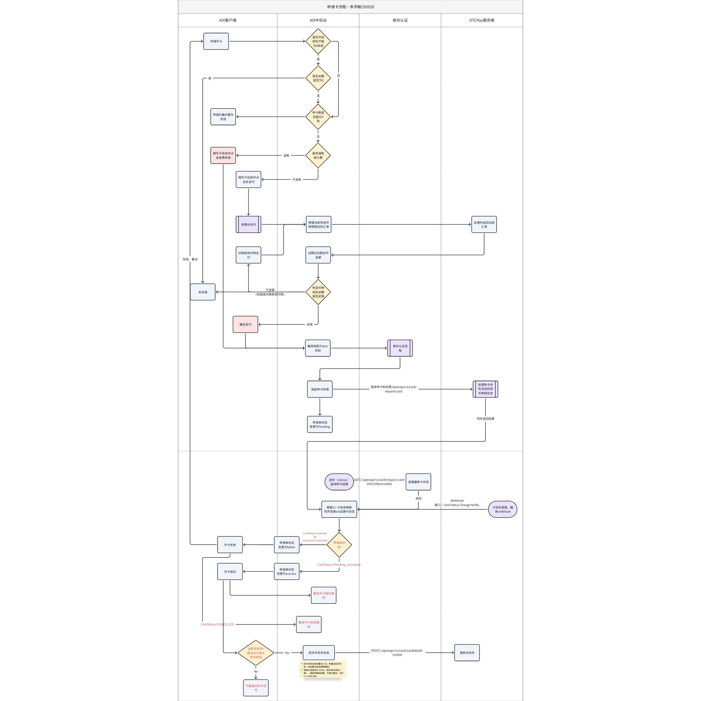

6.1.3 **页面交互**

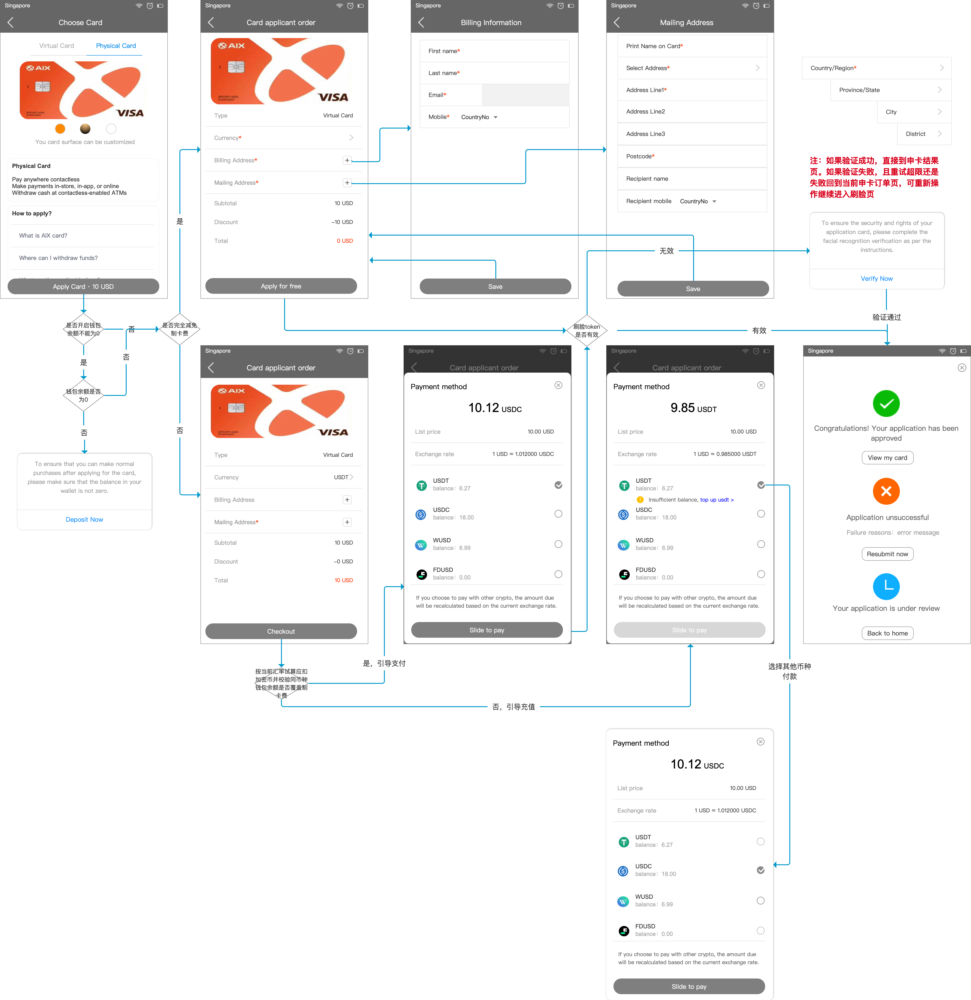

6.1.4 **AIX首页-申卡入口展示逻辑**

**\[同步块-无权限下载此内容\]**

6.1.5 **功能需求**

<table style="width:89%;">
<colgroup>
<col style="width: 8%" />
<col style="width: 17%" />
<col style="width: 46%" />
<col style="width: 16%" />
</colgroup>
<tbody>
<tr>
<td style="text-align: center;"><strong>需求</strong></td>
<td style="text-align: left;"><strong>UI或UX</strong></td>
<td style="text-align: center;"><strong>需求描述</strong></td>
<td style="text-align: center;"><strong>备注</strong></td>
</tr>
<tr>
<td style="text-align: center;"><strong>AIX首页-申卡入口</strong></td>
<td style="text-align: center;">

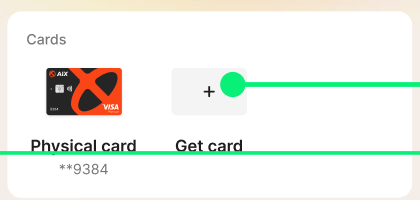

无申卡入口（申卡5张或有审核中）

</td>
<td style="text-align: left;">
<strong>一、前置条件：</strong>

用户申卡张数限制5张（待激活、已激活、审核中、已冻结之和）可配置

当前用户所有已激活、已冻结、待激活、审核中的卡之和≥5时，不显示申卡入口；

当前用户所有已激活、已冻结、待激活、审核中的卡之和＜5时，且<strong>有审核中</strong>的卡，申卡入口置灰不可点击；

当前用户所有已激活、已冻结、待激活、审核中的卡之和＜5时，且<strong>无审核中</strong>的卡，申卡入口高亮可点击；

<strong>二、Banner申卡入口</strong>：

当前用户所有卡状态：待激活、已激活、审核中、已冻结之和X＜5张且无审核中的卡，会显示Banner入口：

Banner由运营自行配置（如图1）；

点击“Apply Now”校验用户是否首次申卡：

如果是，跳转到新用户选择卡片页面Select plan；

否则，跳转到老用户选择卡片页面Pick your card；

<strong>三、卡片申卡入口</strong>：

当前用户所有卡状态：待激活、已激活、审核中、已冻结之和X=0张，会显示卡片入口（如图2）；

点击“Apply Now”，校验用户是否首次申卡：

如果是，跳转到新用户选择卡片页面Select plan；

否则，跳转到老用户选择卡片页面Pick your card；

<strong>四、常驻申卡入口</strong>：

当前用户所有卡状态：待激活、已激活、审核中、已冻结之和1 ≤ X &lt; 5张且无审核中的卡，会显示常驻入口（如图3）；

点击“⊕”，校验用户是否首次申卡：

如果是，跳转到新用户选择卡片页面Select plan；

否则，跳转到老用户选择卡片页面Pick your card；
</td>
<td style="text-align: left;">这块供开发了解申卡的整体逻辑，后面会在<a href="https://advancegroup.sg.larksuite.com/docx/Tf1ydauugoKzzQx3PkUlG8t7g6f">AIX APP V1.0【Home】</a>进行需求评审</td>
</tr>
<tr>
<td style="text-align: left;"><strong>选择卡片</strong></td>
<td style="text-align: left;">
<strong>首次申卡：</strong>

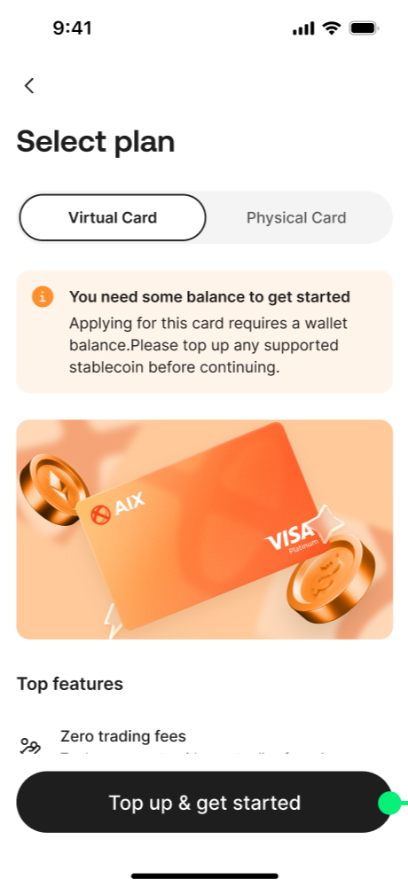

<strong>非首次卡：</strong>

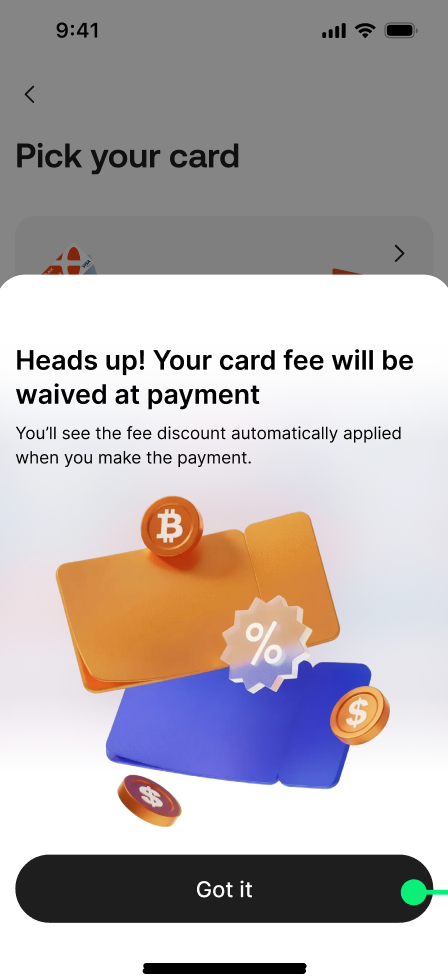

</td>
<td style="text-align: left;">
<strong>一、选择卡类型（首次）：</strong>

<strong>前置条件</strong>：

未申请过卡（即无申请记录）的用户定义为首次；

<strong>导航栏：</strong>

标题：“Select plan”

返回：点击 “←”，可回到上一级页面；

<strong>优惠弹窗：</strong>

如果当前用户有可减免的制卡费，进入选择卡类型页面Select plan时，会显示该弹窗；

文案：Attention! Your credit card will enjoy a discount when making the payment.

点击 “Got it”，关闭弹窗返回到当前选择卡类型页面Select plan；

<strong>卡类型：</strong>

卡类型：Virtual Card、Physical Card ，支持切换Tab

点击“Virtual Card”或“Physical Card”，可以切换展示对应的虚拟卡或实体卡的介绍页；

<strong>卡特点描述</strong>（Virtual Card）

特点1：<strong>Pay anywhere contactless</strong>

补充描述：Allows users to make payments effortlessly without physical contact, regardless of their location.

特点2：<strong>Make payments in-store, in-app, or online</strong>

补充描述：Whether it's at a physical store, within a mobile app, or on an online platform, seamless transactions are ensured.

特点3：<strong>Withdraw cash at contactless-enabled ATMs</strong>

补充描述：Enables users to withdraw cash easily from ATMs with contactless, withdrawal process for quick access to funds.

<strong>卡问题说明</strong>（Virtual Card）可配置

标题：Frequently asked question

FAQ暂未做OBoss可视化编辑Dashboard，先预设到数据库（<strong>问题 ID、标题、描述、关联场景、类型、超链接、创建时间</strong>）；

展示最新5条，根据关键场景“Apply Card”、类型“Virtual Card”和最近时间筛选FAQ并展示给用户；

FAQ默认只显示问题折叠答案，点击任意一个问题只显示当前这条的答案；

<strong>卡特点描述</strong>（Physical Card）

特点1：<strong>Pay anywhere contactless</strong>

补充描述：Allows users to make payments effortlessly without physical contact, regardless of their location.

特点2：<strong>Make payments in-store, in-app, or online</strong>

补充描述：Whether it's at a physical store, within a mobile app, or on an online platform, seamless transactions are ensured.

特点3：<strong>Withdraw cash at contactless-enabled ATMs</strong>

补充描述：Enables users to withdraw cash easily from ATMs with contactless, withdrawal process for quick access to funds.

<strong>卡问题说明</strong>（Physical Card）可配置

标题：Frequently asked question

FAQ暂未做OBoss可视化编辑Dashboard，先预设到数据库（<strong>问题 ID、标题、描述、关联场景、类型、超链接、创建时间</strong>）；

展示最新3条，根据关键场景“Apply Card”、类型“Physical Card”和最近时间筛选FAQ并展示给用户；

FAQ默认只显示问题折叠答案，点击任意一个问题只显示当前这条的答案；

<strong>功能操作区</strong>：

如果开启了钱包余额不能为0的校验，调用接口【 [GET] /openapi/v1/wallet/balances】获取全量加密币种余额：可配置

如果任一加密币账户余额大于0，显示按钮“Get started”，点击“Get started”跳转到选择卡颜色Pick your card

如果任一加密币账户余额都为0，显示按钮“Top up &amp; Get started”，点击“Top up &amp; Get started”跳转到充值页面Deposit；

<strong>二、选择卡类型（非首次）</strong>

<strong>前置条件</strong>：

申请过卡（即有申请记录）的用户定义为非首次；；

<strong>导航栏：</strong>

标题：“Pick your card”

返回：点击 “←”，可回到上一级页面；

<strong>优惠弹窗：</strong>

如果当前用户有可减免的制卡费，进入选择卡类型页面Select plan时，会显示该弹窗；

文案：Attention! Your credit card will enjoy a discount when making the payment.

点击 “Got it”，关闭弹窗返回到当前选择卡类型页面Select plan；

<strong>选择卡片：</strong>

优先展示虚拟卡，再显示实体卡；

虚拟卡描述：

标题：Virtual Card

文案：Pick your favorite design and have it delivered right to your doorstep.

实体卡描述：

标题：Physical Card

文案：Get issued instantly and start using it right away.

点击“&gt;”跳转到选择卡颜色页面Pick your card
</td>
<td style="text-align: left;">
FAQ配置逻辑：<a href="https://advancegroup.sg.larksuite.com/docx/OlWEdynrboay1QxcpfhlYbJtgZg">AIX APP V1.0 【FAQ】</a>

FAQ内容参考 <a href="https://advancegroup.sg.larksuite.com/sheets/PSJvsqPZOh9nTAtIueql2s94g8b?preview_comment_id=7577601505826524896">AIX Phase 1 FAQ</a>待Biz完善
</td>
</tr>
<tr>
<td style="text-align: center;"><strong>选择卡面</strong></td>
<td style="text-align: center;">

</td>
<td style="text-align: left;">
<strong>一、选择卡面（虚拟卡）：</strong>

<strong>导航栏：</strong>

标题：“Pick your card”

返回：点击 “←”，可回到上一级页面；

<strong>卡面：</strong>可配置

Card Color：Coral Orange珊瑚橙、Obsidian Black黑曜石、Clear blue sky纯白

Card face：用户选择对应颜色后，会切换显示对应的卡面示例图（<strong>仅正面合计3个</strong>）；

<strong>导航栏：</strong>

下一步：点击“Next“跳转到选择币种页面Pick your card”

<strong>二、选择卡面（实体卡）：</strong>

<strong>导航栏：</strong>

标题：“Pick your card”

返回：点击 “←”，可回到上一级页面；

<strong>选择卡面：</strong>可配置

Card color：Coral Orange珊瑚橙、Obsidian Black黑曜石、Clear blue sky纯白

Card face：用户选择对应颜色后，会切换显示对应的卡面示例图（<strong>正反面合计6个</strong>）。

点击实体卡的卡面会正、反面可以正常翻转显示；

仅实体卡会有针对卡颜色进行材料和质感的描述，为空时不显示：

Coral Orange珊瑚橙：High-quality, scratch-resistant plastic with a smooth, velvety soft - touch and glossy sheen.

Obsidian Black黑曜石：Durable composite plastic with a sleek, matte, sophisticated feel.

Clear blue sky纯白：Specialized clear-colored plastic, translucent, smooth, with a gentle curve.

<strong>导航栏：</strong>

下一步：点击“Next“跳转到选择币种页面Pick your card”
</td>
<td style="text-align: left;"></td>
</tr>
<tr>
<td style="text-align: left;"><strong>选择币种</strong></td>
<td style="text-align: center;">
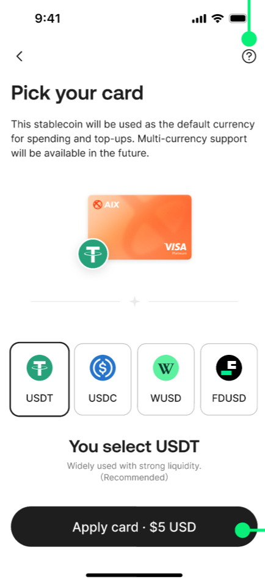

</td>
<td style="text-align: center;">
<strong>导航栏：</strong>

标题：“Pick your card”

描述：“This stablecoin will be used as the default currency for spending and top-ups. Multi-currency support will be available in the future.”

返回：点击 “←”，可回到上一级页面；

说明：点击“？”跳转到问题库页面Frequently asked questions；

FAQ暂未做OBoss可视化编辑Dashboard，先预设到数据库（<strong>问题 ID、标题、描述、关联场景、类型、超链接、创建时间</strong>）；

根据关键场景“Apply Card”、类型“Select Crypto”筛选FAQ并按创建时间降序排列展示对应FAQ给用户，滑动加载更多，不翻页；

FAQ默认只显示问题折叠答案，点击任意一个问题只显示当前这条的答案；

<strong>选择币种：</strong>可配置

Crypto：币种，默认为USDT，用户选择后会在卡面显示对应的币种必选

USDC

USDT

FDUSD

WUSD

文案描述“You select <strong>Crypto</strong>”会显示币种名称；

每个币种都会有对应的推荐文案，为空时不显示：

USDC文案：Regulated digital USD by Circle, fully backed by cash &amp; short - term US Treasuries. Used for payments, savings, transfers.（Recommended）

USDT文案：Widely adopted digital USD by Tether. Used for global transfers, trading, daily crypto transactions.

FDUSD文案：Digital USD by First Digital. Used for secure payments &amp; on-chain transfers.

WUSD文案：Digital USD for daily use, enabling seamless spending, transfers &amp; card payments.

<strong>点击申请：</strong>

Apply Card · X USDButton

X：制卡费后台配置，根据用户选择的虚拟卡或实体卡展示对应的金额（当前虚拟卡5USD，实体卡10USD）可配置

如果X为0，只显示按钮“Apply Card”；

否则显示具体的金额，示例虚拟卡“Apply Card · 5 USD”、实体卡“Apply Card · 10 USD”

点击“Apply Card ”或“Apply Card · X USD”跳转到<strong>申卡</strong>订单页Review your order；
</td>
<td style="text-align: left;"></td>
</tr>
<tr>
<td style="text-align: left;"><strong>确定订单</strong></td>
<td style="text-align: center;">
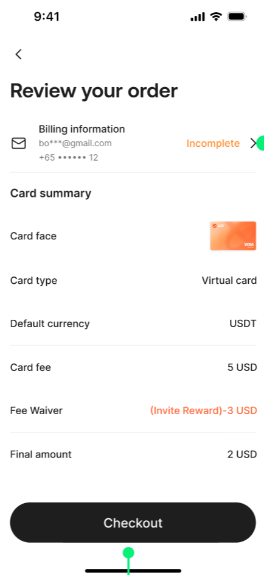

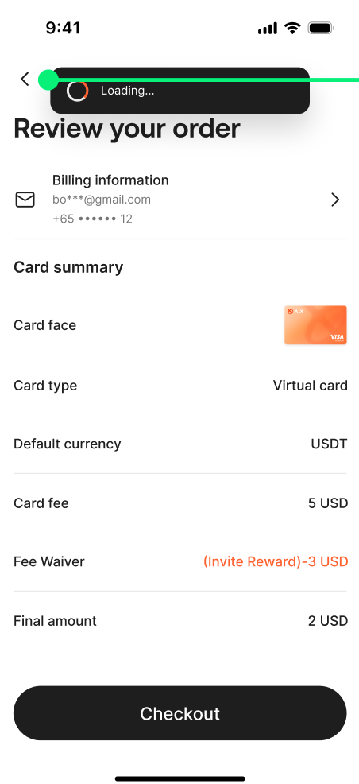

</td>
<td style="text-align: center;">
<strong>顶部导航栏</strong>

标题：“Review your order”；

返回箭头：“<strong>←</strong>”；

<strong>账单信息区</strong>

Billing information：账单信息 必填

点击“&gt;”后跳转到账单信息填写页面

邮箱：@的前3位脱敏，仅有值时会显示；

手机号：除区号外，手机号的前3位脱敏，仅有值时会显示；

未完成标签：账单信息未填写时候（针对首次申请用户）会显示标签“Incomplete”，填写过的用户都不会显示；

<strong>邮寄地址区</strong>（仅实体卡有）

Mailing Address：邮寄地址，仅申请实体卡的用户会展示且要填写必填

点击“&gt;”后跳转到邮寄地址填写页面

持卡人姓名：后3位脱敏，仅有值时会显示；

邮寄地址：显示内容“地址第 1 行，地址第 2 行，地址第 3 行，地区，城市，州、省，国家 / 地区”，除地址第 1 行和国家/地区外，其余脱敏，示例“123 Main St, ***, USA”，仅有值时会显示；

未完成标签：账单信息未填写时候（针对首次申请用户）会显示标签“Incomplete”，填写过的用户都不会显示；

<strong>卡片信息区</strong>

Card face：卡面，根据用户选择展示对应的AIX Card示例图；

Card type：根据用户选择的卡类型显示：

Virtual Card

Physical Card

Default currency：根据用户选择的币种显示：

USDT

USDC

WUSD

FDUSD

<strong>制卡费区</strong>

Card fee：总价（制卡费）：可配置

按USD计价，实体卡10USD，虚拟卡5USD；

整数时不显示小数点，否则保留2位小数；

Fee waiver：折扣（减免费）：

从MGM读取减免费和优惠标签（@Bing Han 韩冰提供减免费传参）后显示具体值；

Fee waiver为0时，显示“--”，如果大于0显示具体金额并按USD计价；

优惠标签：“Invite Reward”，仅金额大于0时显示；

整数时不显示小数点，否则保留2位小数；

Payable card fee：应付卡费，Payable card fee =Card fee- Fee waiver 按USD计价；

<strong>功能操作区</strong>

Apply for free <strong>：</strong>Total为0时显示，即免制卡费Button

点击“Apply for free”调用身份认证模块校验刷脸token是否有效：

未操作刷脸或刷脸token失效提示：“To ensure the security and rights of your application card, please complete the facial recognition verification as per the instructions.”，点击“Verify Now”跳转到身份认证模块的刷脸页（注：如果刷脸验证通过，前端跳转到申卡结果页，后端请求申卡。如果刷脸失败，重试失败且超限，当天无法提交申卡）；

刷脸Token有效，前端跳转到申卡结果页，后台校验申卡信息并调用渠道接口【 /openapi/v1/card/request-card】请求开卡；

Checkout：Total不为0时显示，即需支付制卡费Button

点击“Checkout”后，进入支付收银台页面；
</td>
<td style="text-align: left;"></td>
</tr>
<tr>
<td style="text-align: center;"><strong>账单信息</strong></td>
<td style="text-align: center;">
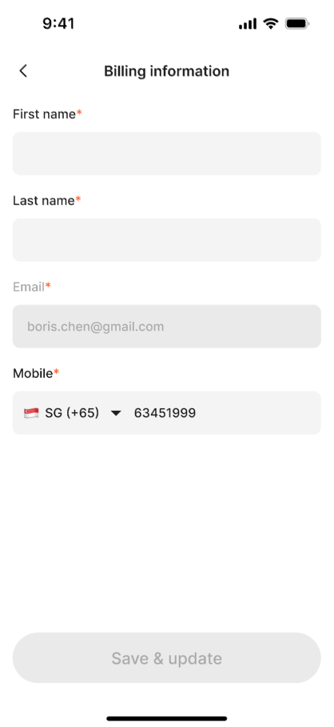

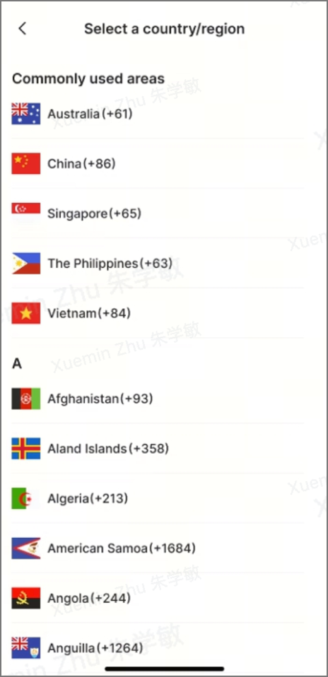
</td>
<td style="text-align: center;">
<strong>顶部导航栏：</strong>

标题：“Billing information”

返回：点击 “←”，可回到上一级 页面；

<strong>表单提交区：</strong>

若用户有提交过账单地址，进入该页面时自动反显最近一次提交的缓存数据且支持用户修改；

First name：名字 必填

输入框提示“Enter your first name and middle name (if any) .”

字符串格式，长度25字节

文本输入框只能输入英文字母及空格，不允许输入特殊字符；

校验不通过提示“Text format error. ”，校验通过无提示；

Last name：姓氏 必填

输入框提示“Enter your last name .”

字符串格式，长度25字节

文本输入框只能输入英文字母及空格，不允许输入特殊字符；

校验不通过提示“Text format error. ”，校验通过无提示；

Email：邮箱地址 必填

自动反显注册AIX填写的完整邮箱，不可修改；

Mobile：手机号必填

纯数字输入，区号长度4字节（至少填1位），手机号长度12字节（至少填4位）

CountryNo：进入默认返显已绑定的手机号；显示全部国家及地区的电话区号，选择之后显示国家及地区logo及区号：

<blockquote>

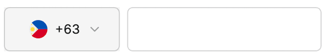

</blockquote>

Save Button

点击“Save” 时，用Last+First或First+Last，拼接为一个参数去和KYC的Full name比对是否一致，符合其一就通过校验；（注：比对时，不校验大小写）

如果不一致，提示“Please fill in your name correctly.”

如果一致，保存账单信息并返回“Card applicant order”页面

注：前端做设备缓存，缓存最近一次点击Save后用户填写的数据（注：Email还是进入页面时实时读取），且不做有效期限制，如果删除应用，缓存会丢失；
</td>
<td style="text-align: left;"></td>
</tr>
<tr>
<td style="text-align: left;"><strong>邮寄地址</strong></td>
<td style="text-align: center;">

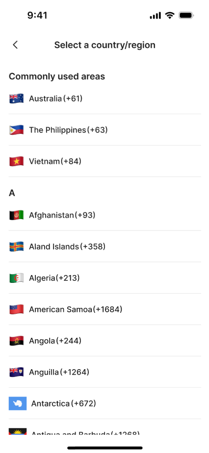

有地址库：

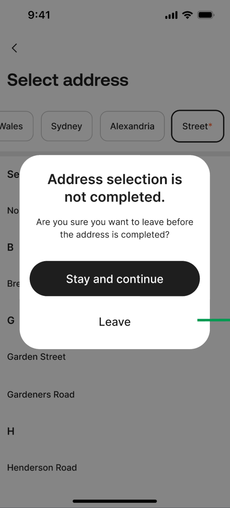

无地址库：

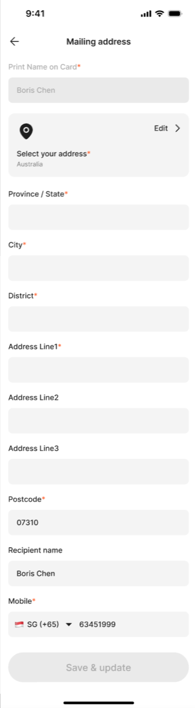
</td>
<td style="text-align: center;">
<strong>顶部导航栏：</strong>

标题：“Mailing address”

返回：点击 “←”，可回到上一级页面；

<strong>表单提交区：</strong>

若用户有提交过邮寄地址，进入该页面时自动反显最近一次提交的缓存数据且支持用户修改；

Print Name on Card：打印姓名 必填

自动反显KYC提交的fullname，不可修改；

字符串格式，长度25字节

打印姓名截断规则：

如果打印姓名小于等于25字节（含）时，显示完整姓名；

如果打印姓名超过25字节（不含），按照从左往右进行截断【1~25位直接显示，26位之后的系统截断】

示例：比如用户“Alexander William Thompson III” 截断后的姓名显示为 “Alexander William Thompso” ，让用户了解信息未完整展示。

Select Address：（四级联动以UX呈现为准）

Country/Region：国家/地区，3字节（code）必选，四级联动：DTC支持国家或地区可配置

常用国家：<del>Australia</del>、Philippines（未填写时，默认项）、Vietnam

支持国家：Phase列的phase 1 <a href="https://advancegroup.sg.larksuite.com/wiki/IeKMw357ziJVjFkGTullgz1UgLe?from=from_copylink">Countries and Regions list</a>

<strong>【Province/State、City、District】规则</strong>

<strong>支持地址库联动的国家</strong>

<blockquote>

当Region选择Australia、Philippines、Vietnam时，规则为：

</blockquote>

Province/State：州/省，40字节四级联动

City：城市，40字节四级联动

District：地区，40字节联动

首次进入时引导按照先Country/Region、其次Province/State，然后City，最后District进行选择；

对于选择后再次进入的用户，自动反显之前选择的，用户可以再次修改；

<strong>不支持地址库联动的国家</strong>

<blockquote>

当 <strong>Region</strong> 选择 除 Australia、Philippines、Vietnam 以外的国家 时，由于系统未维护对应国家的地址库，地址字段需由用户 <strong>手动填写</strong>。

</blockquote>

Province / State：州 / 省，40 字节，用户手动输入，文本输入框做正则表达式校验^[#.0-9a-zA-Z\\s,\\/\\-_:+?')(@#!&amp;]+$，校验不通过提示“Text format error. ”，校验通过无提示；

City / Municipality：城市，40 字节，用户手动输入，文本输入框做正则表达式校验^[#.0-9a-zA-Z\\s,\\/\\-_:+?')(@#!&amp;]+$，校验不通过提示“Text format error. ”，校验通过无提示；

District：地区，40 字节，用户手动输入，文本输入框做正则表达式校验^[#.0-9a-zA-Z\\s,\\/\\-_:+?')(@#!&amp;]+$，校验不通过提示“Text format error. ”，校验通过无提示；

对于填写保存后再次进入的用户，自动反显之前填写的，用户可以再次修改；

如果地址未选择完成就点击“←”，会提示“Address selection isnot completed.”，点击“Stay and continue”关闭弹窗，点击“Leave”返回上一级页面；

<blockquote>

</blockquote>

Address Line1：地址第1行必填

字符串格式，长度40字节

文本输入框做正则表达式校验^[#.0-9a-zA-Z\\s,\\/\\-_:+?')(@#!&amp;]+$

校验不通过提示“Text format error. ”，校验通过无提示；

Address Line2：地址第2行

字符串格式，长度40字节

文本输入框做正则表达式校验^[#.0-9a-zA-Z\\s,\\/\\-_:+?')(@#!&amp;]+$

校验不通过提示“Text format error. ”，校验通过无提示；

Address Line3：地址第3行

字符串格式，长度40字节

文本输入框做正则表达式校验^[#.0-9a-zA-Z\\s,\\/\\-_:+?')(@#!&amp;]+$

校验不通过提示“Text format error. ”，校验通过无提示；

Postcode：邮编必填

字符串格式，长度10字节

文本输入框做正则表达式校验^[#.0-9a-zA-Z\\s,\\/\\-_:+?')(@#!&amp;]+$

校验不通过提示“Text format error. ”，校验通过无提示；

Recipient name：收件人姓名

字符串格式，长度60字节

默认读取Billing information中拼接后的“First name”“Last name” ，姓名中间用英文空格，支持修改

Recipient mobile：收件人手机必填

默认读取绑定的手机号的“Mobile”，支持修改

纯数字输入，区号长度4字节（至少填1位），手机号长度12字节（至少填4位）

CountryNo：显示全部国家及地区的电话区号，选择之后反显国家及地区logo及区号：

<blockquote>

</blockquote>

Save Button

点击“Save” 保存邮寄地址信息并返回申卡订单页Card applicant order；

注：前端做设备缓存，缓存最近一次点击Save后用户填写的数据（注：Print Name on Card还是进入页面时实时读取），且不做有效期限制，如果删除应用，缓存会丢失；
</td>
<td style="text-align: left;">地址信息参考：<a href="https://advancegroup.sg.larksuite.com/sheets/DocQsEDQChDdeFtEamelSgd2gUc?sheet=Qmclo7">AU&amp;PH&amp;VN地址</a></td>
</tr>
<tr>
<td style="text-align: center;"><strong>支付收银台</strong></td>
<td style="text-align: center;">

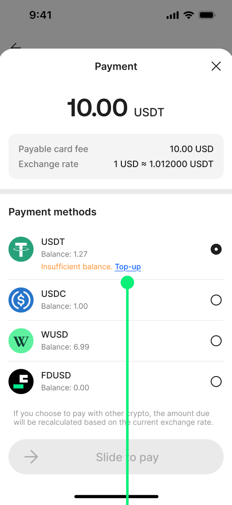

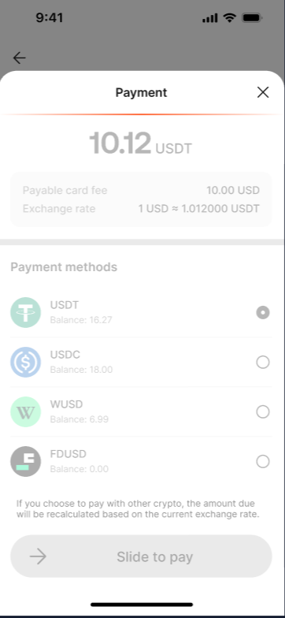

</td>
<td style="text-align: center;">
<strong>弹窗标题栏：</strong>

Payment ：支付

X：关闭，点击“X”关闭弹窗返回申卡订单确认页

<strong>金额与汇率展示：</strong>

Card applicantion fee：应付金额（加密币）

Card Application Fee= Payable card fee × Exchange rate [币种]；

应付金额保留2位小数；

用户可点击任一币种区域切换支付方式，系统立即重算应付金额（注：会根据当前所选择币种对应的汇率实时变动）；

Payable card fee：应付卡费（法币）：

即优惠减免后的制卡费Payable card fee =Card fee- Fee waiver ；

金额单位固定为USD，如10.00 USD；

Exchange rate：实时汇率

显示当前所选币种与USD的实时汇率，格式：1 USD ≈ [汇率] [币种]；

汇率保留6位小数；

在收银台页面，根据当前所选择的币种，并调用渠道接口【 /openapi/v1/otc/get-otc-rate】获取实时汇率；

如果用户选择了其他币种进行支付，需重新调用渠道接口【 /openapi/v1/otc/get-otc-rate】获取实时汇率；

如果汇率获取失败，提示“The exchange rate has not been updated in real time. Please try again.”，并切回之前选中币种；

<strong>币种选择区域：</strong>

Payment method：支付方式

Crypto：币种名称及图标

可选择的付款币种支持可配置，只做通用付款币种配置，不做特定某个币种支持哪几个币种的配置可配置

Balance: 可用余额

在收银台页面，调用渠道接口【 /openapi/v1/wallet/balances】获取全量币种余额，并筛选支持付款的稳定币余额展示给用户；

币种排序：优先展示当前申卡所选择的币种，其他币种按余额从高到低排序；

币种选择：默认选中当前申卡所选择的币种，每次切换币种时（要有加载loading），检查该币种余额（balance）是否 ≥ 应付金额（Card Application Fee）

若余额不足：

显示“Insufficient balance”

显示“top up [Crypto] &gt;”，其中Crypto为当前所选币种，点击链接跳转至充值页面Select a deposit method（注：用户选择充值方式进入Select Asset to Receive时，默认选中当前指定币种，逻辑类似单币种首页操作指定币的Deposit）；

“Slide to pay”按钮置灰或禁止滑动

若余额充足：

不显示提示

“Slide to pay”按钮可操作

<strong>收银台提示</strong>

描述：“If you choose to pay with other crypto, the amount due will be recalculated based on the current exchange rate.”；

<strong>滑动支付按钮</strong>

当前币种余额足够时，点击“Slide to pay”再次校验余额是否足够（防刷）

若余额不足：

提示“Insufficient balance, Please select another currency for payment.”；

后端调用渠道接口【 /openapi/v1/wallet/balances】获取全量币种余额，并筛选稳定币的最新余额展示给用户；

若余额充足：

调用身份认证的刷脸接口进行校验：

未操作刷脸或刷脸token失效提示：“To ensure the security and rights of your application card, please complete the facial recognition verification as per the instructions.”，点击“Verify Now”跳转到身份认证模块的刷脸页（注：如果刷脸验证通过，前端跳转到申卡结果页，后端请求申卡。如果刷脸失败，重试失败且超限，当天无法提交申卡）；

刷脸Token有效，前端跳转到申卡结果页，后台校验申卡信息并调用渠道接口【 /openapi/v1/card/request-card】请求开卡；

注：扣制卡费不用单独调接口，仅需上送费用字段，申请响应成功时，DTC会实时扣，如果审核失败会发起退款，联调测试时留意一下当前用户钱包的扣费情况；

注：申卡响应成功要存申请记录的关键字段信息：比如Apply Order、Create time、Type、Status、Card fee、Waived fee、Final amount、Rate、Card applicantion fee（稳定币）等；
</td>
<td style="text-align: left;">
Payable card fee（法币）=Card fee- Fee waiver

Card Application Fee（加密币）= Payable card fee × Exchange rate
</td>
</tr>
<tr>
<td style="text-align: left;"><strong>申请结果</strong></td>
<td style="text-align: center;">
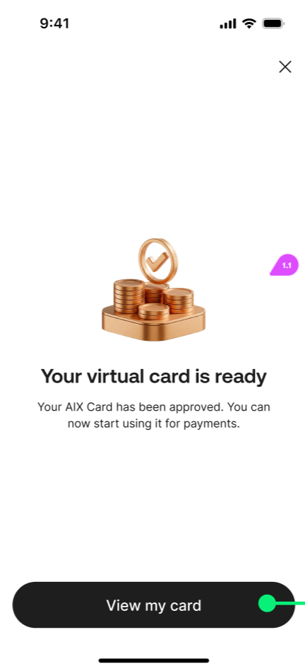

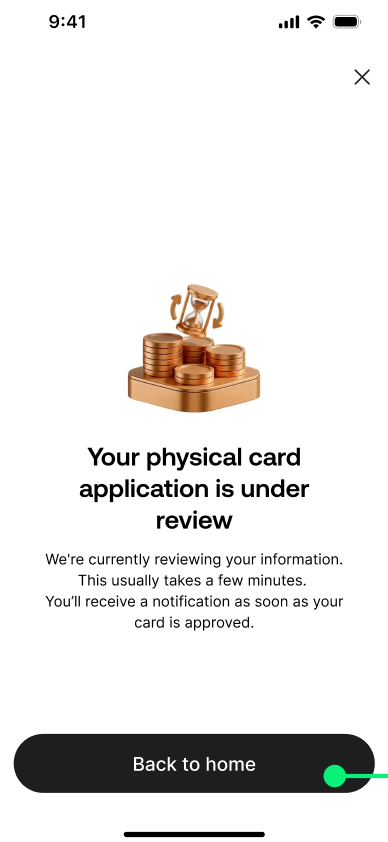

</td>
<td style="text-align: center;">
<strong>顶部导航栏：</strong>

关闭：点击 “<strong>⊗</strong>”，结束申请流程并返回到AIX主页；

<strong>成功状态页</strong>（如果提交申卡响应成功（"success": true）且返回了卡状态“Pending activation”或“Active”页面显示开卡成功：）

标题：“Congratulations! Your application has been approved.”

描述：“Your AlX Card has been approved. You can now start using it for payments.”

点击“View my card”返回到卡首页Card；Button

<strong>审核中状态页</strong>（如果提交卡响应成功（"success": true）且返回了状态“Processing”页面显示开卡审核中）；

文案：Your application is under review

描述：“We're currently reviewing your information.This usually takes a few minutes.You'll receive a notification as soon as your card is approved.”

点击“Back to Home”返回AIX首页Button

<strong>失败状态页</strong>（如果提交卡响应失败（"success": false），页面显示开卡失败）

文案：Application unsuccessful

描述：“We're unable to approve your AlX Card at this time.”

Failure reasons：读取DTCPay返回的错误信息Error message并展示给用户，示例“Parameters is invalid”

点击“Back to Home”返回AIX首页Button

<strong>制卡费核销：</strong>（和MGM 侧@Bing Han 韩冰交互逻辑）

如果响应失败，不做减免费通知；

如果响应成功且审核中（卡状态是“Pending”），通知MGM进行减免费冻结；

如果响应成功且审核通过（卡状态是“Active”或“Pending activation”），通知MGM进行减免费核销；

如果响应成功且审核失败（卡状态是“Terminated”或“Cancelled”），通知MGM进行减免费解冻；
</td>
<td style="text-align: left;"></td>
</tr>
</tbody>
</table>

6.2 **卡片首页（已申卡）**

6.2.1 **需求背景**

<table style="width:88%;">
<colgroup>
<col style="width: 88%" />
</colgroup>
<tbody>
<tr>
<td style="text-align: left;">
对于申卡成功的用户，持卡人可以查看卡信息（如卡面、类型等）、资产状态（如卡号、有效期、CVV、余额等），并执行常用卡操作（查看详情、支付、交易记录、卡管）等。

注：对于有开卡成功或在途的用户，页面展示所有已激活、已冻结、待激活、审核中的卡片。对于无开卡成功或在途的用户，即未申请、申请失败展示默认申卡卡片。
</td>
</tr>
</tbody>
</table>

6.2.2 **业务流程**

N/A

6.2.3 **页面交互**

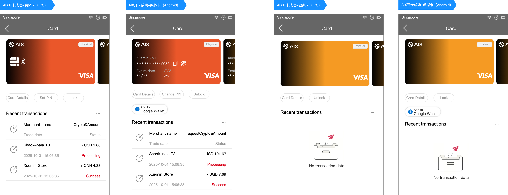

6.2.4 **展示逻辑**

6.2.4.1 **AIX首页-当前卡片展示逻辑及操作权限**

**\[同步块-无权限下载此内容\]**

6.2.4.2 **Card首页-当前卡片展示逻辑及操作权限**

<table style="width:89%;">
<colgroup>
<col style="width: 8%" />
<col style="width: 6%" />
<col style="width: 6%" />
<col style="width: 6%" />
<col style="width: 6%" />
<col style="width: 5%" />
<col style="width: 6%" />
<col style="width: 6%" />
<col style="width: 6%" />
<col style="width: 6%" />
<col style="width: 8%" />
<col style="width: 6%" />
<col style="width: 6%" />
</colgroup>
<tbody>
<tr>
<td style="text-align: center;">卡片状态</td>
<td style="text-align: center;">是否展示卡片</td>
<td style="text-align: center;">查看物流信息</td>
<td style="text-align: center;">查看卡基本信息</td>
<td style="text-align: center;">查看敏感信息</td>
<td style="text-align: center;">卡激活</td>
<td style="text-align: center;">Set PIN</td>
<td style="text-align: center;">Change PIN</td>
<td style="text-align: center;">Lock Card</td>
<td style="text-align: center;">Unlock Card</td>
<td style="text-align: center;">Add to Google Pay</td>
<td style="text-align: left;">展示交易记录</td>
<td style="text-align: center;">刷卡消费</td>
</tr>
<tr>
<td style="text-align: center;">PENDING_ACTIVATION</td>
<td style="text-align: center;">✅</td>
<td style="text-align: center;">
✅

仅限实体卡
</td>
<td style="text-align: center;">❌</td>
<td style="text-align: center;">❌</td>
<td style="text-align: center;">✅</td>
<td style="text-align: center;">❌</td>
<td style="text-align: center;">❌</td>
<td style="text-align: center;">❌</td>
<td style="text-align: center;">❌</td>
<td style="text-align: center;">❌</td>
<td style="text-align: left;">❌</td>
<td style="text-align: center;">❌</td>
</tr>
<tr>
<td style="text-align: center;">ACTIVE</td>
<td style="text-align: center;">✅</td>
<td style="text-align: center;">❌</td>
<td style="text-align: center;">✅</td>
<td style="text-align: center;">✅</td>
<td style="text-align: center;">❌</td>
<td style="text-align: center;">
✅

未设置PIN
</td>
<td style="text-align: center;">
✅

已设置PIN
</td>
<td style="text-align: center;">✅</td>
<td style="text-align: center;">❌</td>
<td style="text-align: center;">
✅

仅限安卓设备
</td>
<td style="text-align: left;">✅</td>
<td style="text-align: center;">✅</td>
</tr>
<tr>
<td style="text-align: center;">SUSPENDED</td>
<td style="text-align: center;">✅</td>
<td style="text-align: center;">❌</td>
<td style="text-align: center;">✅</td>
<td style="text-align: center;">✅</td>
<td style="text-align: center;">❌</td>
<td style="text-align: center;">❌</td>
<td style="text-align: center;">❌</td>
<td style="text-align: center;">❌</td>
<td style="text-align: center;">✅</td>
<td style="text-align: center;">❌</td>
<td style="text-align: left;">✅</td>
<td style="text-align: center;">❌</td>
</tr>
<tr>
<td style="text-align: center;">PENDING</td>
<td style="text-align: center;">✅</td>
<td style="text-align: center;">❌</td>
<td style="text-align: center;">❌</td>
<td style="text-align: center;">❌</td>
<td style="text-align: center;">❌</td>
<td style="text-align: center;">❌</td>
<td style="text-align: center;">❌</td>
<td style="text-align: center;">❌</td>
<td style="text-align: center;">❌</td>
<td style="text-align: center;">❌</td>
<td style="text-align: left;">❌</td>
<td style="text-align: center;">❌</td>
</tr>
<tr>
<td style="text-align: center;">CANCELLED</td>
<td style="text-align: center;">过滤状态为取消的卡记录</td>
<td style="text-align: center;"></td>
<td style="text-align: center;"></td>
<td style="text-align: center;"></td>
<td style="text-align: center;"></td>
<td style="text-align: center;"></td>
<td style="text-align: center;"></td>
<td style="text-align: center;"></td>
<td style="text-align: center;"></td>
<td style="text-align: center;"></td>
<td style="text-align: left;"></td>
<td style="text-align: center;"></td>
</tr>
<tr>
<td style="text-align: center;">BLOCKED</td>
<td style="text-align: center;">过滤状态为注销的卡记录</td>
<td style="text-align: center;"></td>
<td style="text-align: center;"></td>
<td style="text-align: center;"></td>
<td style="text-align: center;"></td>
<td style="text-align: center;"></td>
<td style="text-align: center;"></td>
<td style="text-align: center;"></td>
<td style="text-align: center;"></td>
<td style="text-align: center;"></td>
<td style="text-align: left;"></td>
<td style="text-align: center;"></td>
</tr>
</tbody>
</table>

6.2.5 **功能需求**

<table style="width:89%;">
<colgroup>
<col style="width: 9%" />
<col style="width: 17%" />
<col style="width: 46%" />
<col style="width: 15%" />
</colgroup>
<tbody>
<tr>
<td style="text-align: center;"><strong>需求</strong></td>
<td style="text-align: left;">UI或UX</td>
<td style="text-align: center;"><strong>需求描述</strong></td>
<td style="text-align: center;"><strong>备注</strong></td>
</tr>
<tr>
<td style="text-align: left;"><strong>AIX首页-卡管入口</strong></td>
<td style="text-align: left;">
审核中

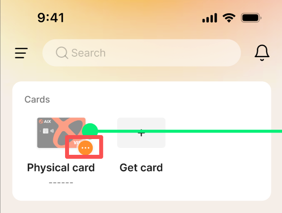

待激活

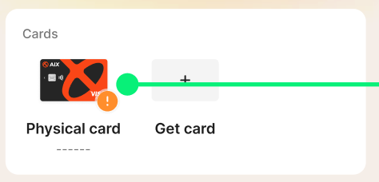

已激活未设置PIN

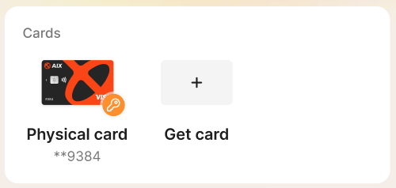

已激活已设置PIN

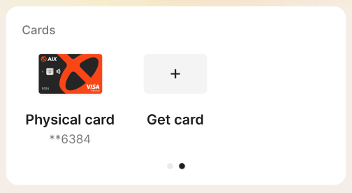

已冻结

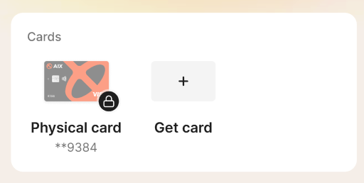
</td>
<td style="text-align: left;">
<strong>当前卡片展示逻辑：（无修改PIN）</strong>

如果当前卡状态是“审核中”，即卡状态为Processing时，会显示该卡片：

点击后跳转到当前卡片首页Card（审核中）

如果当前卡状态是“待激活”，即卡状态为Pending activation时，会显示该卡片

点击后跳转到激活卡页面Activate Card

如果当前卡状态是“已激活”即卡状态为Active且未设置PIN时，会显示该卡片；

点击后跳转到设置PIN页面Set PIN；

如果当前卡状态是“已激活”即卡状态为Active且已设置PIN时，会显示该卡片；

点击后跳转到当前卡片首页Card（已激活）；

如果当前卡状态是“已冻结”即卡状态为Frozen时，会显示该卡片；

点击后跳转到触发解冻卡的身份认证页面；

<strong>多张卡片展示逻辑：</strong>

如果当前用户申请了多张卡，且申卡张数＜5张（待激活、已激活、审核中、已冻结之和），按照申请时间降序展示所有卡片，最右边显示申卡入口“+”

如果当前用户申请了多张卡，且申卡张数＝5张（待激活、已激活、审核中、已冻结之和），按照申请时间降序展示所有卡片，屏蔽申卡入口“+”
</td>
<td style="text-align: left;">这块供开发了解卡管的整体逻辑，后面会在<a href="https://advancegroup.sg.larksuite.com/docx/Tf1ydauugoKzzQx3PkUlG8t7g6f">AIX APP V1.0【Home】</a>进行需求评审</td>
</tr>
<tr>
<td style="text-align: left;"><strong>查看卡片（已开卡已激活或已冻结）</strong></td>
<td style="text-align: left;">
<strong>虚拟卡：</strong>

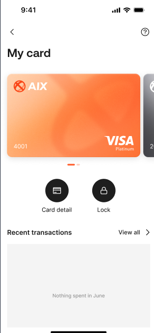

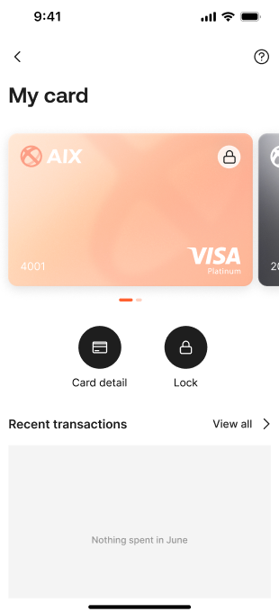

<strong>实体卡：</strong>

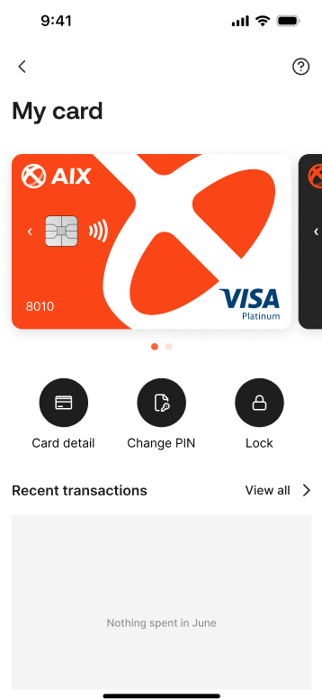
</td>
<td style="text-align: center;">
<strong>展示逻辑：</strong>

对于开卡成功且已激活或卡已冻结的用户，即开卡状态为Active或Suspended时，会显示该卡片；

如果用户有其他开卡成功或在途的记录，页面展示所有已激活、已冻结、待激活、审核中的卡片，按照申请时间降序排列展示卡片；

当进入该页面：

若本页面无缓存数据，且出现网络异常 或 服务器报错，那么进入Network Error Page 或 Server Error Page

若本页面有缓存数据，且出现网络异常 或 服务器报错，那么展示缓存数据的页面：

若网络异常，toast提示：Please check your internet connection and try again.

若后端服务器错误，toast提示：Something went wrong. Please try again later

<strong>顶部导航栏</strong>

标题：“Card”

返回：点击 “←”，可回到上一级页面；

说明：点击“？”跳转到问题库页面Frequently asked questions；

FAQ暂未做OBoss可视化编辑Dashboard，先预设到数据库（<strong>问题 ID、标题、描述、关联场景、类型、超链接、创建时间</strong>）；

根据关键场景“Card manage”、类型“Card home”筛选FAQ并按创建时间降序排列展示对应FAQ给用户，滑动加载更多，不翻页；

FAQ默认只显示问题折叠答案，点击任意一个问题只显示当前这条的答案；

<strong>卡片展示区</strong>

卡面：根据用户申请所选择的卡面，展示对应的AIX Card示例图可配置

Type：卡类型：Virtual Card、Physical CardTag

Lock：仅卡被锁定时会显示该图标，点击lock图标会显示弹窗内容“This card is locked.”；Tag

滑动卡片会切换显示不同卡面、操作按钮、交易记录；

<strong>功能操作区（虚拟卡）</strong>

Card detail：查看卡详情Button

对于卡状态为Active或Suspended的用户，都会显示“Card detail”：

点击“Card detail”跳转到卡详情页面；

Lock：冻结卡

如果卡状态为Active，显示“Lock”

点击“Lock”跳转锁定卡页面；Button

Unlock：解冻卡

如果卡状态为Suspended，显示“Unlock”

点击“Unlock”跳转解冻卡页面；Button

Add to Google Wallet：绑卡到谷歌钱包

是否开启“Add to Google Wallet”入口做成可配置

如果开启了，卡状态为Active且当前申请设备为安卓时，才会显示“Add to Google Wallet”按钮；

点击“Add to Google Wallet”后先统一跳转到FAQ页面，

注：后续DTC的API支持自动唤起Google Wallet并完成一键绑卡再迭代该需求；

<strong>功能操作区（实体卡）</strong>

Card detail：查看卡详情Button

Set PIN：设置卡PIN

<strong>仅实体卡有</strong>，卡状态为已激活Active且未设置PIN才显示“Set PIN”

未设置PIN时，访问当前卡页面小红点显示

点击“Set PIN”跳转设置PIN页面；Button

Change PIN：修改卡PIN

<strong>仅实体卡有</strong>，卡状态为已激活Active且已设置PIN才显示“Change PIN”

已设置PIN时，访问当前卡页面小红点消失

点击“Change PIN”跳转重置PIN页面；Button

Lock：冻结卡

如果卡状态为Active，显示“Lock”：

点击“Lock”跳转锁定卡页面；Button

Unlock：解冻卡

如果卡状态为Suspended，显示“Unlock”

点击“Unlock”跳转解冻卡页面；Button

Add to Google Wallet：绑卡到谷歌钱包

是否开启“Add to Google Wallet”入口做成可配置

如果开启了，卡状态为Active且当前申请设备为安卓时，才会显示“Add to Google Wallet”按钮；

点击“Add to Google Wallet”后先统一跳转到FAQ页面（场景“Card manage”、类型“Bind Google Wallet ”）

注：后续DTC的API支持自动唤起Google Wallet并完成一键绑卡再迭代该需求；

<strong>交易记录区</strong>

用户进入该页面时，调用接口【 /openapi/v1/card/ inquiry-card-transaction】获取最新交易记录，并按交易类型进行数据过滤后展示给用户：

卡交易仅展示原始交易类型为【PURCHASE】【CASH_WITHDRAWAL】【REFUND】【INCREMENTAL_AUTH】的记录给用户；

展示当前用户<strong>近1年</strong>卡交易的最近6条记录给用户：

如果条数X为0就占位符显示“No transaction data”

如果条数1≤X＜6，就显示对应条数，页面自适应长度；

Title<strong>：</strong>Recent Transactions

点击“View all”跳转到<strong>当前卡</strong>交易记录页面“Card History”

<strong>单笔卡交易展示逻辑：</strong>

Merchant name：商户名称（对客显示为交易名称）

Indicator<strong>：</strong>交易方向：Credit、Debit：

Credit卡借记【+】

Debit卡贷记【-】

requestAmount&amp;requestCurrency：交易金额（法币）

Transaction time：交易时间

State：交易状态

Pending

Success

Refunded

Declined

Cancelled
</td>
<td style="text-align: left;">快速理解请看上一小节【 Card首页-当前卡片展示逻辑及操作权限】</td>
</tr>
<tr>
<td style="text-align: left;"><strong>查看卡片（已开实体卡未激活）</strong></td>
<td style="text-align: center;">
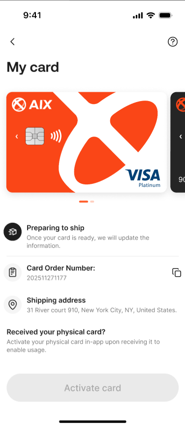

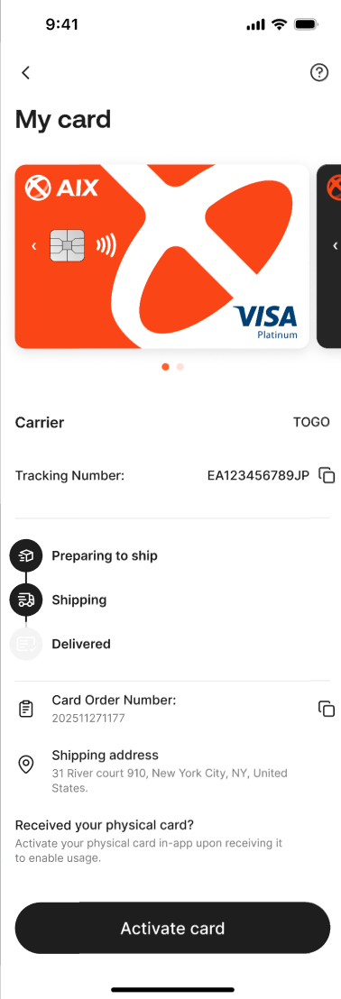
</td>
<td style="text-align: center;">
<strong>展示逻辑：</strong>

对于开实体卡成功且未激活的用户，即开卡状态为Inactive时，会显示该卡片；

如果用户有其他开卡成功或在途的记录，页面展示所有已激活、已冻结、待激活、审核中的卡片，按照申请时间降序排列展示卡片；

<strong>卡片展示区</strong>

卡面：根据用户申请所选择的卡面，展示对应的AIX Card示例图可配置

Type：卡类型：Virtual Card、Physical CardTag

滑动卡片会切换显示不同卡面、操作按钮、交易记录；

<strong>物流进度区</strong>

Progress bar：邮寄进度条：

Preparing

Shipping

Delivered

当前DTC不支持查看卡邮寄地址，根据卡状态及物流单进行映射：

卡状态为“Pending activation”时，且Tracking no为空，物流进度显示"Preparing"

卡状态为“Pending activation”时，且Tracking no不为空，物流进度显示"Shipping"

卡状态为“Active”时，物流进度显示"Delivered"（注：实际看不到这个进度，激活后会显示完整卡已开通已激活页面）

Carrier：快递公司，默认不显示，仅Tracking no有值时显示，如果邮寄地址国家是菲律宾显示“TOGO ”，对于其他国家默认SINGPOST：

菲律宾： TOGO

其他国家 ： SINGPOST

Tracking no：物流单号，默认不显示，仅Tracking no有值时显示；当DTC通过接口【Card Delivery Notification】异步通知返回物流单号时，展示Tracking no给用户

Card Order Number：申请单号，点击“<strong>❐</strong>”可以复制申请单号，并提示“The information has been copied.”；

Mailing address：显示申请实体卡提交的地址，直接拼接参数“addressLine1, addressLine2, addressLine3, district, city, stateProvince, countryRegion”，示例：“123 Main Street, Apt. 456, ABC Company, Downtown, Los Angeles, CA, United States”；

待激活描述：

标题：Received your physical card?

描述：Activate your physical card in-app upon receiving it to enable usage.

Activate card：激活卡Button

点击“Activate card”后跳转到激活卡页面
</td>
<td style="text-align: left;"></td>
</tr>
<tr>
<td style="text-align: left;"><strong>查看卡片（审核中）</strong></td>
<td style="text-align: center;"></td>
<td style="text-align: center;">
<strong>展示逻辑：</strong>

对于开卡审核中的用户，即开卡状态为Pending时，会显示该卡片；

如果用户有其他开卡成功或在途的记录，页面展示所有已激活、已冻结、待激活、审核中的卡片，按照申请时间降序排列展示卡片；

<strong>卡片展示区（仅实体卡有）</strong>

卡面：根据用户申请所选择的卡面，展示对应的AIX Card示例图可配置

Type：卡类型：Physical CardTag

滑动卡片会切换显示不同卡面、操作按钮、交易记录；

<strong>功能操作区</strong>

审核中描述：

标题：Your card application is under review

内容：.We will notify you when there is a status update..

Card Order Number：申请单号，点击“<strong>❐</strong>”可以复制申请单号，并提示“The information has been copied.”；
</td>
<td style="text-align: left;"></td>
</tr>
</tbody>
</table>

# 7. DTC渠道接口需求

7.1 **申请开卡Card Application**

7.1.1 **接口说明**

此接口描述新持卡人通过AIX平台申请新的实体卡或虚拟卡。

7.1.2 **接口地址**

\[POST\] /openapi/v1/card/request-card

7.1.3 **接口时序**

7.1.4 **接口请求**

7.1.5 **接口响应**

7.1.6 **错误码**

注：如果DTCPay接口返回当前错误码之外的其他错误，直接lark报警通知，以便产品和渠道确定后续的错误处理。

7.2 **卡ID获取卡基本信息Retrieve Basic Card Info**

7.2.1 **接口说明**

此接口用于获取并向持卡人展示：脱敏卡片详情（卡号后四位）、卡余额、追踪号码等；

7.2.2 **接口地址**

\[POST\] /openapi/v1/card/inquiry-card-info

7.2.3 **接口时序**

7.2.4 **接口请求**

7.2.5 **接口响应**

7.2.6 **错误码**

注：如果DTCPay接口返回当前错误码之外的其他错误，直接lark报警通知，以便产品和渠道确定后续的错误处理。

7.3 **业务ID获取卡基本信息 Inquiry Card Basic Info with Reference No**

7.3.1 **接口说明**

此接口用于通过referenceNo获取并向持卡人展示：脱敏卡片详情（卡号后四位）、卡余额、追踪号码等；

7.3.2 **接口地址**

\[GET\] /openapi/v1/card/inquiry-card-info/{referenceNo}

7.3.3 **接口时序**

7.3.4 **接口请求**

7.3.5 **接口响应**

7.3.6 **错误码**

注：如果DTCPay接口返回当前错误码之外的其他错误，直接lark报警通知，以便产品和渠道确定后续的错误处理。

7.4 **获取卡敏感信息Retrieve Sensitive Card Info**

7.4.1 **接口说明**

此接口用于获取并向持卡人展示：卡片完整卡号（PAN）、验证码（CVC）及有效期等。

7.4.2 **接口地址**

\[POST\] /openapi/v1/card/inquiry-card-sensitive-info

7.4.3 **接口时序**

7.4.4 **接口请求**

7.4.5 **接口响应**

7.4.6 **错误码**

注：如果DTCPay接口返回当前错误码之外的其他错误，直接lark报警通知，以便产品和渠道确定后续的错误处理。

7.5 **获取全量币种钱包余额Get Wallet Account Balance**

申卡时开启了钱包余额不能为0的校验，就要调用该接口查询任一币种钱包余额大于0即可。

7.5.1 **接口说明**

此接口用于查询经过身份验证的客户所有货币的所有钱包账户余额。

7.5.2 **接口地址**

\[GET\] /openapi/v1/wallet/balances

7.5.3 **接口时序**

7.5.4 **接口请求**

注：请求参数包含在请求头会提交MasterAccount或SubAccount，无其他请求字段。

7.5.5 **接口响应**

7.5.6 **错误码**

注：如果DTCPay接口返回当前错误码之外的其他错误，直接lark报警通知，以便产品和渠道确定后续的错误处理。

7.6 **获取指定币种钱包余额Get Balance**

7.6.1 **接口说明**

此接口用于获取特定货币钱包的余额和场外交易限额。

7.6.2 **接口地址**

\[GET\] /openapi/v1/wallet/balance/{currency}

7.6.3 **接口时序**

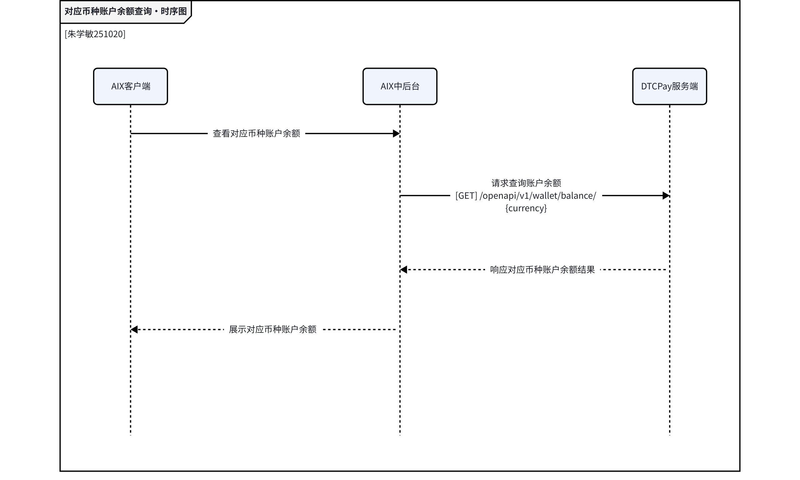

7.6.4 **接口请求**

7.6.5 **接口响应**

7.6.6 **错误码**

注：如果DTCPay接口返回当前错误码之外的其他错误，直接lark报警通知，以便产品和渠道确定后续的错误处理。

7.7 **获取OTC汇率 Get OTC Rate**

7.7.1 **接口说明**

此接口用于获取获取场外交易汇率。

7.7.2 **接口地址**

\[POST\] /openapi/v1/otc/get-otc-rate

7.7.3 **接口时序**

7.7.4 **接口请求**

7.7.5 **接口响应**

7.7.6 **错误码**

注：如果DTCPay接口返回当前错误码之外的其他错误，直接lark报警通知，以便产品和渠道确定后续的错误处理。

7.8 **卡状态变更通知Card Status Change Notification**

7.8.1 **接口说明**

此接口用于接收DTC的Webhook异步通知卡状态变更。

7.8.2 **接口响应**

7.9 **卡邮寄通知Card Delivery Notification**

7.9.1 **接口说明**

此接口用于接收DTC的Webhook异步通知卡邮寄物流单号。

7.9.2 **接口响应**

# 8. 附录

8.1 **相关文档**

[AIX Card - 全局参数&字段处理](https://advancegroup.sg.larksuite.com/sheets/KvtPs3xv5hfS5wt3Q6xlPC2IgHO?sheet=6b2169)

8.2 **需求评审**

https://advancegroup.sg.larksuite.com/minutes/obsguni421gh2nmo2ub85tm7
