# AIX Card 【manage】模块需求V1.0

# 1. 需求变更日志

<table style="width:89%;">
<colgroup>
<col style="width: 10%" />
<col style="width: 10%" />
<col style="width: 45%" />
<col style="width: 22%" />
</colgroup>
<tbody>
<tr>
<td style="text-align: left;">变更时间</td>
<td style="text-align: left;">变更人</td>
<td style="text-align: left;">变更内容</td>
<td style="text-align: left;">备注</td>
</tr>
<tr>
<td style="text-align: left;">2025-10-21</td>
<td style="text-align: left;">@Yifeng Wu 吴忆锋</td>
<td style="text-align: left;">初稿</td>
<td style="text-align: left;"></td>
</tr>
<tr>
<td style="text-align: left;">2025-11-06</td>
<td style="text-align: left;">@Yifeng Wu 吴忆锋</td>
<td style="text-align: left;">
【Card Manage Page】

跟随xuemin的aix主页设计，调整需求

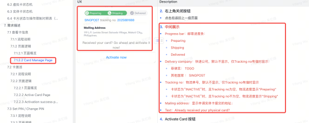

@Lei Zhang 张雷
</td>
<td style="text-align: left;"></td>
</tr>
<tr>
<td style="text-align: left;">2025-11-06</td>
<td style="text-align: left;">@Yifeng Wu 吴忆锋</td>
<td style="text-align: left;">
<strong>1、app全局通用组件</strong>

根据最新交互规范调整，网络异常和服务器异常，抽象出来作为通用组件，在业务场景进行调用，见6.5 app全局通用组件

<strong>2、卡激活流程</strong>

按照最新ux流程调整，见7.2 卡激活

<strong>3、set pin流程</strong>

按照最新ux流程调整，见7.3 Set PIN / Change PIN

@Pengfei Li (Richard)@Wei Sun 孙伟@Lei Zhang 张雷
</td>
<td style="text-align: left;"></td>
</tr>
<tr>
<td style="text-align: left;">2016-01-09</td>
<td style="text-align: left;">@Yifeng Wu 吴忆锋</td>
<td style="text-align: left;">
卡激活

已调整：获取公钥调整为激活成功后才获取；

@Liang Wu 吴亮@Lei Zhang 张雷
</td>
<td style="text-align: left;"></td>
</tr>
<tr>
<td style="text-align: left;">2016-01-15</td>
<td style="text-align: left;">@Yifeng Wu 吴忆锋</td>
<td style="text-align: left;">
Server error page调整交互

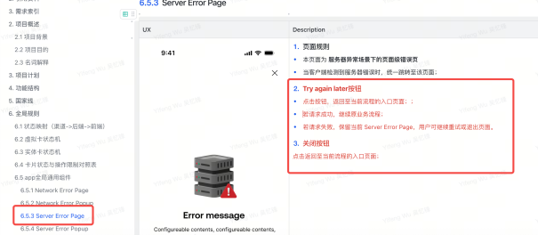

@Liang Wu 吴亮@Lei Zhang 张雷
</td>
<td style="text-align: left;"></td>
</tr>
</tbody>
</table>

# 2. 引用资料

|  |  |
|:---|:---|
| **类型** | 链接 |
| PM | @Yifeng Wu 吴忆锋 |
| Figma | https://www.figma.com/design/iDt3nk3jeLm8iGg91uvfVU/%E2%86%AA-AIX-Dev-Handoff-2025-Q4?node-id=0-1&p=f&t=szkdqtiP5St7jpMb-0 |
| 翻译文案 | [AIX 翻译文案管理-多维表](https://advancegroup.sg.larksuite.com/wiki/Ah4UwdvDMiY19lkuMkwlHzWPgLd?from=from_copylink) |
| BRD | N/A |
| 技术方案 |  |

# 3. 需求索引

**\[同步块-无权限下载此内容\]**

# 2. 项目概述

2.1 **项目背景**

|  |
|:---|
| 为满足全球用户对一体化、便捷安全数字金融服务的需求，本项目旨在开发一款创新的移动应用。该应用将整合先进的支付与账户管理技术，致力于为用户提供全新的移动端金融管理体验。 |

2.2 **项目目的**

<table style="width:88%;">
<colgroup>
<col style="width: 88%" />
</colgroup>
<tbody>
<tr>
<td><ol type="1">
<li>
构建基础​：建立安全、便捷的用户注册登录与账户体系。
</li>
</ol>
<ol start="2" type="1">
<li>
核心功能​：实现充值、提现、转账、消费等关键支付功能。
</li>
</ol>
<ol start="3" type="1">
<li>
安全保障​：通过多层验证与风控策略，确保用户资产与信息安全。
</li>
</ol>
<ol start="4" type="1">
<li>
体验优化​：提供流畅直观的操作流程，提升用户留存。
</li>
</ol></td>
</tr>
</tbody>
</table>

2.3 **名词解释**

<table style="width:88%;">
<colgroup>
<col style="width: 88%" />
</colgroup>
<tbody>
<tr>
<td><table style="width:86%;">
<colgroup>
<col style="width: 16%" />
<col style="width: 69%" />
</colgroup>
<tbody>
<tr>
<td style="text-align: left;"><strong>名词/缩写</strong></td>
<td style="text-align: left;"><strong>说明</strong></td>
</tr>
<tr>
<td style="text-align: left;">DeviceID</td>
<td style="text-align: left;">用于唯一识别用户客户端的设备编号。用于实现设备绑定、可信设备判断及风险控制等。</td>
</tr>
<tr>
<td style="text-align: left;">IVS</td>
<td style="text-align: left;">
Identity Verification Service，身份验证服务。

通常指用于进行高强度实名验证的服务（如证件识别、人脸比对等），在注册或敏感操作流程中可能被调用。
</td>
</tr>
<tr>
<td style="text-align: left;">Biometric</td>
<td style="text-align: left;">通过用户的生物特征（如指纹、面部信息）进行身份验证的技术。支持iOS Face ID/Android指纹/人脸</td>
</tr>
<tr>
<td style="text-align: left;">AIX Tag</td>
<td style="text-align: left;">用户在AIX平台上的身份标识符。用于在转账、社交等场景中代替复杂的钱包地址，使用户能够被轻松找到和支付。此标识一旦设置，通常不可更改。</td>
</tr>
<tr>
<td style="text-align: left;">DTC</td>
<td style="text-align: left;">AIX项目的合作伙伴，提供加密钱包、卡片发行和KYC服务的后端平台，支持OpenAPI接口，用于处理交易、认证和账户管理。</td>
</tr>
<tr>
<td style="text-align: left;">AAI</td>
<td style="text-align: left;">第三方身份验证服务提供商，用于KYC流程中的护照上传、活体检测和人脸比对。支持Webhook回调和URL生成。</td>
</tr>
<tr>
<td style="text-align: left;">Master Account</td>
<td style="text-align: left;">DTC侧的账户概念，主账户，可申请API Key管理多个Sub Account。敏感操作需Sub Account授权。</td>
</tr>
<tr>
<td style="text-align: left;">Sub Account</td>
<td style="text-align: left;">DTC侧的账户概念，子账户，由Master创建，用于分离用户资产。KYC需独立完成。</td>
</tr>
<tr>
<td style="text-align: left;">WalletConnect</td>
<td style="text-align: left;">通过Deeplink/QR链接外部钱包充值。自动加白名单、交易报备，直接到账。</td>
</tr>
<tr>
<td style="text-align: left;">PIN</td>
<td style="text-align: left;">Personal Identification Number，卡片PIN码，用于线下交易。4位数字，支持Set/Change/Reset。</td>
</tr>
<tr>
<td style="text-align: left;">稳定币类型</td>
<td style="text-align: left;">稳定币类型USDC, USDT, FDUSD, WUSD，支持在BASE/BSC/ETHEREUM/SOLANA网络充值/转账/兑换。</td>
</tr>
<tr>
<td style="text-align: left;">区块链网络</td>
<td style="text-align: left;">支持的区块链网络，各网络币种不同（e.g., BASE: USDC）。包括：BASE, BSC, ETHEREUM, SOLANA</td>
</tr>
<tr>
<td style="text-align: left;">Global Travel Rule</td>
<td style="text-align: left;">全球旅行规则，合规要求，仅支持如Binance的白名单钱包充值。自动报备，无需声明。</td>
</tr>
</tbody>
</table>

同步自文档: <a href="https://advancegroup.sg.larksuite.com/docx/Sy4TdCxUFoCEWbxdcoQlBgzhgfh#WEeGd3rFjsp8Kjb59vLlbcdog1n">https://advancegroup.sg.larksuite.com/docx/Sy4TdCxUFoCEWbxdcoQlBgzhgfh#WEeGd3rFjsp8Kjb59vLlbcdog1n</a>
</td>
</tr>
</tbody>
</table>

# 3. 项目计划

[AIX项目管理表](https://advancegroup.sg.larksuite.com/sheets/RFR2sp4VGhbXVDtlnjTlwVsYgAb?from=from_copylink&sheet=z4hjo9)

# 4. 功能结构

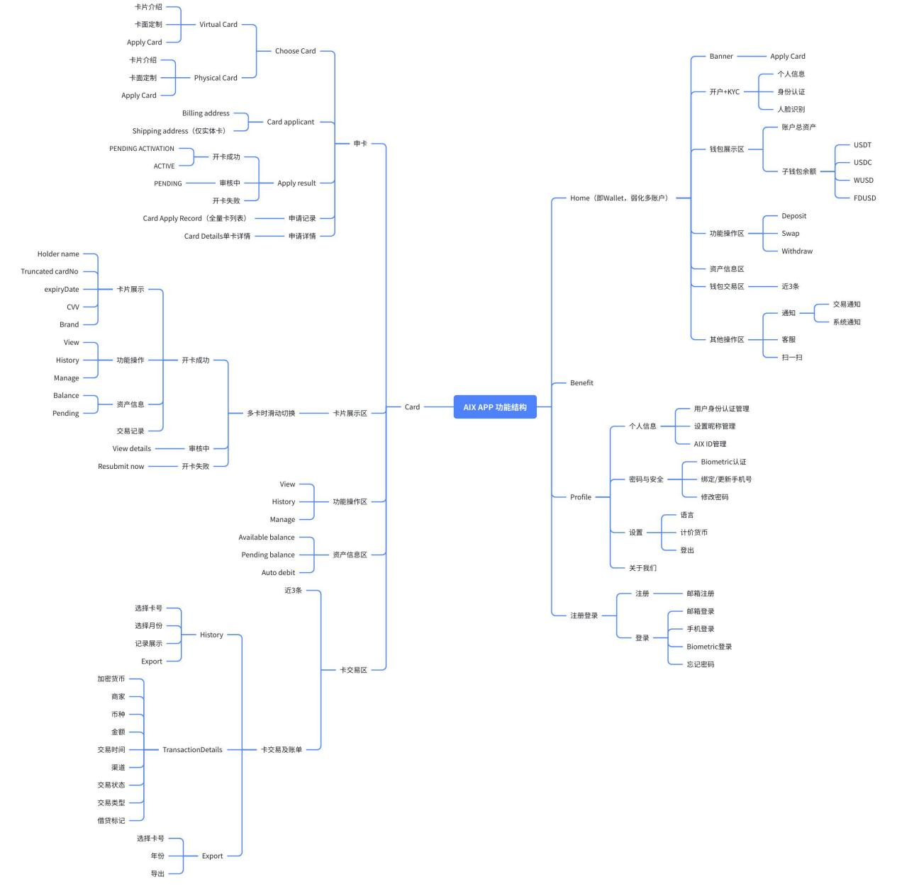

# 5. 国家线

|        |        |        |
|:------:|:------:|:------:|
| **VN** | **PH** | **AU** |
|   ✅   |   ✅   |   ✅   |

# 6. 全局规则

6.1 **状态映射（渠道-\>后端-\>前端）**

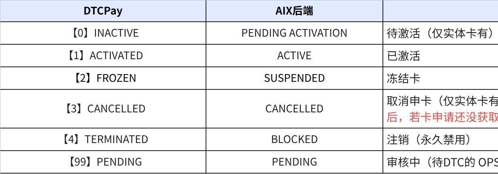

**点击图片可查看完整电子表格**

6.2 **虚拟卡状态机**

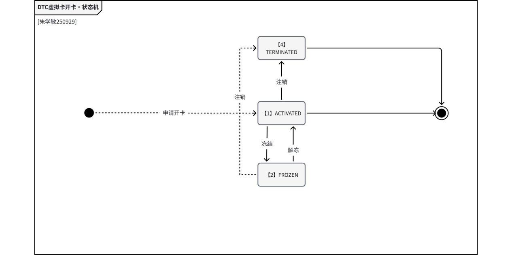

6.3 **实体卡状态机**

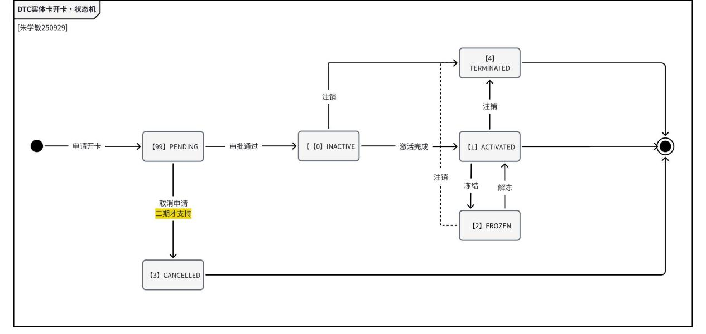

6.4 **卡片状态与操作限制对照表**

<table style="width:88%;">
<colgroup>
<col style="width: 88%" />
</colgroup>
<tbody>
<tr>
<td><table style="width:87%;">
<colgroup>
<col style="width: 10%" />
<col style="width: 8%" />
<col style="width: 9%" />
<col style="width: 8%" />
<col style="width: 8%" />
<col style="width: 8%" />
<col style="width: 8%" />
<col style="width: 8%" />
<col style="width: 8%" />
<col style="width: 8%" />
</colgroup>
<tbody>
<tr>
<td style="text-align: left;">卡片状态</td>
<td style="text-align: left;">查看卡信息</td>
<td style="text-align: left;">查看敏感信息</td>
<td style="text-align: left;">卡激活</td>
<td style="text-align: left;">Set PIN</td>
<td style="text-align: left;">Change PIN</td>
<td style="text-align: left;">Lock Card</td>
<td style="text-align: left;">Unlock Card</td>
<td style="text-align: left;">注销卡</td>
<td style="text-align: left;">交易功能</td>
</tr>
<tr>
<td style="text-align: left;">待激活</td>
<td style="text-align: left;">❌</td>
<td style="text-align: left;">❌</td>
<td style="text-align: left;">✅</td>
<td style="text-align: left;">❌</td>
<td style="text-align: left;">❌</td>
<td style="text-align: left;">❌</td>
<td style="text-align: left;">❌</td>
<td style="text-align: left;">❌</td>
<td style="text-align: left;">❌</td>
</tr>
<tr>
<td style="text-align: left;">ACTIVE 
(已激活)</td>
<td style="text-align: left;">✅</td>
<td style="text-align: left;">✅</td>
<td style="text-align: left;">❌</td>
<td style="text-align: left;">
✅

仅限首次
</td>
<td style="text-align: left;">✅</td>
<td style="text-align: left;">✅</td>
<td style="text-align: left;">❌</td>
<td style="text-align: left;">✅</td>
<td style="text-align: left;">✅</td>
</tr>
<tr>
<td style="text-align: left;">SUSPENDED 
(冻结)</td>
<td style="text-align: left;">❌</td>
<td style="text-align: left;">❌</td>
<td style="text-align: left;">❌</td>
<td style="text-align: left;">❌</td>
<td style="text-align: left;">❌</td>
<td style="text-align: left;">❌</td>
<td style="text-align: left;">✅</td>
<td style="text-align: left;">✅</td>
<td style="text-align: left;">❌</td>
</tr>
<tr>
<td style="text-align: left;">CANCELLED 
(取消申卡)</td>
<td style="text-align: left;">❌</td>
<td style="text-align: left;">❌</td>
<td style="text-align: left;">❌</td>
<td style="text-align: left;">❌</td>
<td style="text-align: left;">❌</td>
<td style="text-align: left;">❌</td>
<td style="text-align: left;">❌</td>
<td style="text-align: left;">❌</td>
<td style="text-align: left;">❌</td>
</tr>
<tr>
<td style="text-align: left;">BLOCKED 
(注销)</td>
<td style="text-align: left;">✅</td>
<td style="text-align: left;">❌</td>
<td style="text-align: left;">❌</td>
<td style="text-align: left;">❌</td>
<td style="text-align: left;">❌</td>
<td style="text-align: left;">❌</td>
<td style="text-align: left;">❌</td>
<td style="text-align: left;">❌</td>
<td style="text-align: left;">❌</td>
</tr>
<tr>
<td style="text-align: left;">PENDING 
(审核中)</td>
<td style="text-align: left;">❌</td>
<td style="text-align: left;">❌</td>
<td style="text-align: left;">❌</td>
<td style="text-align: left;">❌</td>
<td style="text-align: left;">❌</td>
<td style="text-align: left;">❌</td>
<td style="text-align: left;">❌</td>
<td style="text-align: left;">❌</td>
<td style="text-align: left;">❌</td>
</tr>
</tbody>
</table></td>
</tr>
</tbody>
</table>

6.5 **app全局通用组件**

6.5.1 **Network Error Page**

<table style="width:89%;">
<colgroup>
<col style="width: 30%" />
<col style="width: 58%" />
</colgroup>
<tbody>
<tr>
<td style="text-align: left;">UX</td>
<td style="text-align: left;">Description</td>
</tr>
<tr>
<td style="text-align: center;">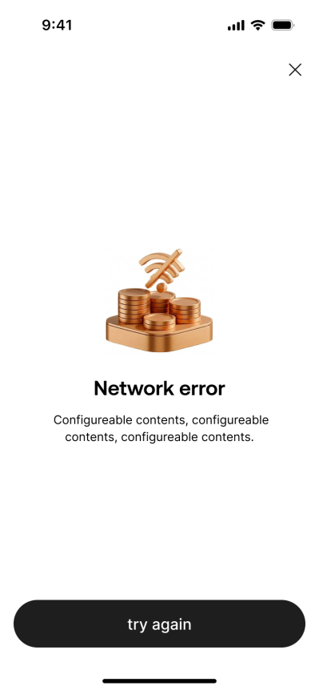</td>
<td style="text-align: left;">
1. <strong>页面规则</strong>

<ul>
<li>
本页面为 <strong>网络异常场景下的页面级错误页</strong>
</li>
</ul>
<ul>
<li>
当客户端检测到无网络、网络中断或请求无法发出时，统一跳转至该页面；
</li>
</ul>

2. <strong>Try again按钮</strong>

<ul>
<li>
点击后重新发起当前页面的网络请求；
</li>
</ul>
<ul>
<li>
若网络已恢复，则返回至异常发生前的业务页面并继续流程；
</li>
</ul>
<ul>
<li>
若网络仍不可用，则继续停留在 Network Error Page。
</li>
</ul>

3. <strong>关闭按钮</strong>

点击弹出挽留弹窗

<ul>
<li>
Title：Confirm Exit?
</li>
</ul>
<ul>
<li>
Content: Are you sure you want to leave? Your current progress will be lost.
</li>
</ul>
<ul>
<li>
Button:
</li>
</ul>
<ul>
<li>
Stay and continue: 点击后关闭弹窗，停留在当前页；
</li>
</ul>
<ul>
<li>
Leave: 点击后关闭弹窗，返回至当前流程的入口页面；
</li>
</ul></td>
</tr>
</tbody>
</table>

6.5.2 **Network Error Popup**

<table style="width:89%;">
<colgroup>
<col style="width: 30%" />
<col style="width: 58%" />
</colgroup>
<tbody>
<tr>
<td style="text-align: left;">UX</td>
<td style="text-align: left;">Description</td>
</tr>
<tr>
<td style="text-align: center;"></td>
<td style="text-align: left;">
1. <strong>Popup规则</strong>

<ul>
<li>
本Popup为 <strong>网络异常场景下的弹窗级错误</strong>
</li>
</ul>
<ul>
<li>
当用户在当前页面提交操作时检测到网络异常，但无需中断整体流程时，弹出该 Popup；
</li>
</ul>

2. <strong>Popup内容</strong>

弹窗提示：

<ul>
<li>
标题：Oops！Connection Lost
</li>
</ul>
<ul>
<li>
正文：Please check your network and try again.
</li>
</ul>
<ul>
<li>
按钮：
</li>
</ul>
<ul>
<li>
Try again：关闭弹窗并重新发起当前页面的网络请求；
</li>
</ul>
<ul>
<li>
Cancel：关闭弹窗，返回当前页面；
</li>
</ul></td>
</tr>
</tbody>
</table>

6.5.3 **Server Error Page**

<table style="width:89%;">
<colgroup>
<col style="width: 30%" />
<col style="width: 58%" />
</colgroup>
<tbody>
<tr>
<td style="text-align: left;">UX</td>
<td style="text-align: left;">Description</td>
</tr>
<tr>
<td style="text-align: center;"></td>
<td style="text-align: left;">
1. <strong>页面规则</strong>

<ul>
<li>
本页面为 <strong>服务器异常场景下的页面级错误页</strong>
</li>
</ul>
<ul>
<li>
当客户端检测到服务器错误时，统一跳转至该页面；
</li>
</ul>

2. <strong>Try again later按钮</strong>

<ul>
<li>
点击按钮，返回至当前流程的入口页面；；
</li>
</ul>
<ul>
<li>
若请求成功，继续原业务流程；
</li>
</ul>
<ul>
<li>
若请求失败，保留当前 Server Error Page，用户可继续重试或退出页面。
</li>
</ul>

3. <strong>关闭按钮</strong>

点击返回至当前流程的入口页面；
</td>
</tr>
</tbody>
</table>

6.5.4 **Server Error Popup**

<table style="width:89%;">
<colgroup>
<col style="width: 30%" />
<col style="width: 58%" />
</colgroup>
<tbody>
<tr>
<td style="text-align: left;">UX</td>
<td style="text-align: left;">Description</td>
</tr>
<tr>
<td style="text-align: center;">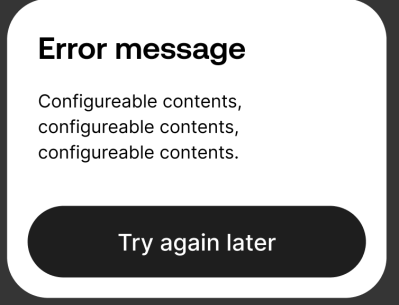</td>
<td style="text-align: left;">
1. <strong>Popup规则</strong>

<ul>
<li>
本Popup为 <strong>服务器异常场景下的弹窗级错误</strong>
</li>
</ul>
<ul>
<li>
当用户在当前页面提交操作时检测到服务器异常，但无需中断整体流程时，弹出该 Popup；
</li>
</ul>

2. <strong>Popup内容</strong>

弹窗提示：

<ul>
<li>
标题：Service temporarily unavailable
</li>
</ul>
<ul>
<li>
正文：We're currently experiencing some issues. Please try again later.
</li>
</ul>
<ul>
<li>
按钮：
</li>
</ul>
<ul>
<li>
Try again later：返回至业务发起页；
</li>
</ul></td>
</tr>
</tbody>
</table>

# 7. 需求描述

<table style="width:88%;">
<colgroup>
<col style="width: 88%" />
</colgroup>
<tbody>
<tr>
<td><ul>
<li>
卡号
</li>
</ul>
<ul>
<li>
虚拟卡与实体卡使用独立的卡号（PAN），二者互不相同；
</li>
</ul>
<ul>
<li>
激活
</li>
</ul>
<ul>
<li>
虚拟卡：申请成功后系统自动激活，无需用户操作；
</li>
</ul>
<ul>
<li>
实体卡：需用户通过 App 手动完成激活流程，激活成功后方可使用；
</li>
</ul>
<ul>
<li>
激活流程包括身份验证、设置 PIN（可选）及状态确认等步骤。
</li>
</ul></td>
</tr>
</tbody>
</table>

7.1 **查看卡信息**

7.1.1 **业务流程**

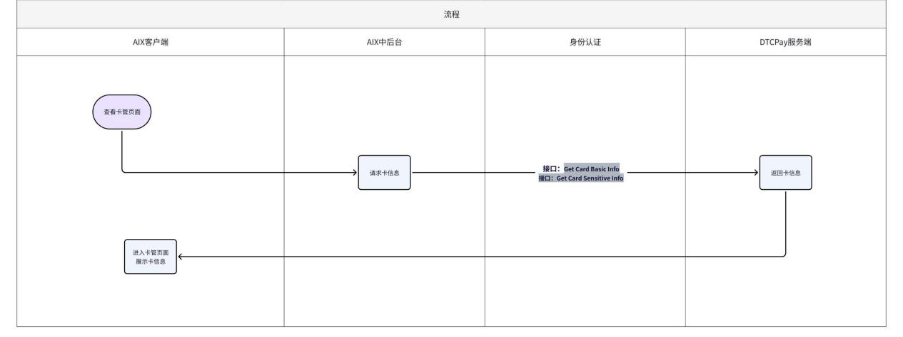

7.1.2 **页面逻辑**

7.1.2.1 **页面概览**

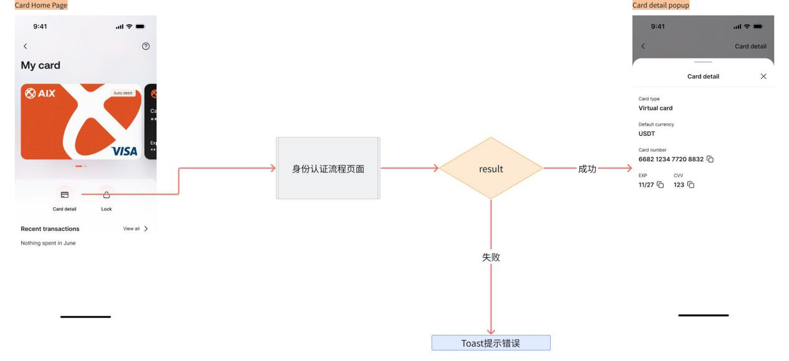

7.1.2.2 **Card home page**

<table style="width:89%;">
<colgroup>
<col style="width: 30%" />
<col style="width: 58%" />
</colgroup>
<tbody>
<tr>
<td style="text-align: left;">UX</td>
<td style="text-align: left;">Description</td>
</tr>
<tr>
<td style="text-align: center;"></td>
<td style="text-align: left;">
1. <strong>页面规则</strong>

点击Card detail，若<strong>接口：Get Card Basic Info/Get Card Sensitive Info</strong>返回失败，那么前端写死toast提示：Failed to get card info. Please try again later
</td>
</tr>
</tbody>
</table>

7.1.2.3 **Card detail popup**

<table style="width:89%;">
<colgroup>
<col style="width: 30%" />
<col style="width: 58%" />
</colgroup>
<tbody>
<tr>
<td style="text-align: left;">UX</td>
<td style="text-align: left;">Description</td>
</tr>
<tr>
<td style="text-align: center;"></td>
<td style="text-align: left;">
1. <strong>右上角关闭按钮</strong>

点击关闭popup

2. <strong>Card detail</strong>

<ul>
<li>
Card type
</li>
</ul>

显示卡类型，数据来源于AIX申卡时储存

<ul>
<li>
Default currency
</li>
</ul>

读取Get Card Basic Info接口，字段currency。

<ul>
<li>
<em>Name on card</em>
</li>
</ul>

<em>当无论物理卡还是虚拟卡，都展示该字段；</em>

<em>点击复制，复制完整信息，Toast提示“The information has been copied.”</em>

<em>读取Get Card Basic Info接口，字段cardHolderName。</em>

<ul>
<li>
Card number
</li>
</ul>

点击复制，复制完整信息，Toast提示“The information has been copied.”

读取Get Card Sensitive Info接口，字段cardNumber。

<ul>
<li>
EXP
</li>
</ul>

点击复制，复制完整信息，Toast提示“The information has been copied.”

读取Get Card Sensitive Info接口，字段expiryDate。

<ul>
<li>
CVV
</li>
</ul>

点击复制，复制完整信息，Toast提示“The information has been copied.”

读取Get Card Sensitive Info接口，字段cvc。
</td>
</tr>
</tbody>
</table>

7.2 **卡激活**

<table style="width:88%;">
<colgroup>
<col style="width: 88%" />
</colgroup>
<tbody>
<tr>
<td style="text-align: left;">
知识点

<ul>
<li>
在调用 Card Activation 接口时，入参：autoDebit；当该参数值为 ON 时，系统将在卡片激活的同时 开启自动扣款功能；
</li>
</ul>
<ul>
<li>
开启后，用户使用该卡进行消费时，系统将 自动从其关联的钱包账户中扣
</li>
<li>
虚拟卡无需激活，也无需设置PIN
</li>
</ul></td>
</tr>
</tbody>
</table>

7.2.1 **业务流程**

7.2.2 **页面逻辑**

7.2.2.1 **页面概览**

7.2.2.2 **Active Card Page**

<table style="width:89%;">
<colgroup>
<col style="width: 30%" />
<col style="width: 58%" />
</colgroup>
<tbody>
<tr>
<td style="text-align: left;">UX</td>
<td style="text-align: left;">Description</td>
</tr>
<tr>
<td rowspan="4" style="text-align: center;">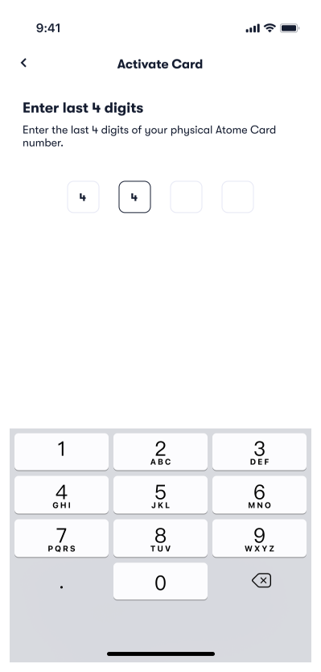</td>
<td rowspan="4" style="text-align: left;">
1. <strong>返回按钮</strong>

<ul>
<li>
点击页面顶部导航栏的返回按钮时，系统将弹出一个挽留弹窗。
</li>
</ul>
<ul>
<li>
Title：Confirm Exit?
</li>
</ul>
<ul>
<li>
Content：Are you sure you want to leave before completing this step?
</li>
</ul>
<ul>
<li>
按钮：
</li>
</ul>
<ul>
<li>
Stay And Continue：点击弹窗关闭，用户停留在当前页面；
</li>
</ul>
<ul>
<li>
Leave：点击弹窗关闭，用户返回到入口页面；
</li>
</ul>

2. <strong>主标题&amp;副标题</strong>

<ul>
<li>
Title：Enter last 4 digits
</li>
</ul>
<ul>
<li>
Subtitle：Enter the last 4-digit of your physical AIX Card number
</li>
</ul>

3. <strong>提交逻辑</strong>

当用户完整输入 4 位卡号后四位数字后，系统自动调用 <em>Inquiry Card Basic Info</em> 接口进行验证：

<ul>
<li>
<strong>提交中：</strong>
</li>
</ul>
<ul>
<li>
页面显示 <em>Loading...</em>，禁止重复输入或返回操作；
</li>
</ul>
<ul>
<li>
<strong>卡号验证失败：</strong>
</li>
</ul>
<ul>
<li>
若接口返回的 <em>truncatedCardNumber</em> 与用户输入不一致，则在输入框下方显示红色错误提示：<em>The last 4 digits entered are invalid</em>；
</li>
</ul>
<ul>
<li>
用户可修改输入，系统在补全 4 位后再次自动提交；
</li>
</ul>
<ul>
<li>
<strong>卡号验证通过：</strong>
</li>
</ul>
<ul>
<li>
若接口返回的 <em>truncatedCardNumber</em> 与用户输入一致，则自动进入下一流程，<a href="https://advancegroup.sg.larksuite.com/wiki/Uwyfwkc2jixSBukf2YJllpjsgRd#share-NAq4dZzgdoRPpOxMZ2IlA8G7gic">7.3 Set PIN / Change PIN</a>；
</li>
</ul>
<ul>
<li>
<strong>网络异常：</strong>
</li>
</ul>
<ul>
<li>
弹出 <em>Network Error Popup</em>；
</li>
</ul>
<ul>
<li>
用户关闭弹窗返回本页面后，自动清空输入框；
</li>
</ul>
<ul>
<li>
<strong>服务器异常：</strong>
</li>
</ul>
<ul>
<li>
弹出 <em>Server Error Popup</em>；
</li>
</ul>
<ul>
<li>
用户关闭弹窗返回本页面后，自动清空输入框。
</li>
</ul></td>
</tr>
<tr>
</tr>
<tr>
</tr>
<tr>
</tr>
</tbody>
</table>

7.2.2.3 **Set Pin 流程页面**

复用[7.3 Set PIN / Change PIN](https://advancegroup.sg.larksuite.com/wiki/Uwyfwkc2jixSBukf2YJllpjsgRd#share-NAq4dZzgdoRPpOxMZ2IlA8G7gic)，完成后跳转身份认证模块

7.2.2.4 **身份认证模块**

<table style="width:89%;">
<colgroup>
<col style="width: 30%" />
<col style="width: 58%" />
</colgroup>
<tbody>
<tr>
<td style="text-align: left;">UX</td>
<td style="text-align: left;">Description</td>
</tr>
<tr>
<td rowspan="4" style="text-align: center;"></td>
<td rowspan="4" style="text-align: left;">
1. <strong>页面规则</strong>

调用 AAI（人脸活体识别）页面，具体交互逻辑详见《身份认证需求文档》；

2. <strong>验证流程说明</strong>

活体验证通过后，系统自动调用 Card Activation 接口

<ul>
<li>
若网络异常，那么进入Network Error Page
</li>
</ul>
<ul>
<li>
若系统异常，那么进入Server Error Page
</li>
</ul>
<ul>
<li>
若激活成功，那么进入Card Home page，并toast提示：Your card has been activated
</li>
</ul>
<ul>
<li>
若激活失败，那么进入Active fail Page
</li>
</ul>
<ul>
<li>
若激活成功，Set pin失败，那么进入Set fail page
</li>
</ul></td>
</tr>
<tr>
</tr>
<tr>
</tr>
<tr>
</tr>
</tbody>
</table>

7.2.2.5 **Active Fail Page**

<table style="width:89%;">
<colgroup>
<col style="width: 30%" />
<col style="width: 58%" />
</colgroup>
<tbody>
<tr>
<td style="text-align: left;">UX</td>
<td style="text-align: left;">Description</td>
</tr>
<tr>
<td rowspan="4" style="text-align: center;"></td>
<td rowspan="4" style="text-align: left;">
1. <strong>右上角X</strong>

点击关闭按钮返回卡管首页；

2. <strong>文案说明</strong>

前端写死文案Title：Card activation failed

前端写死文案Subtitle：Your card details were verified, but the issuer couldn’t complete the activation at this time. Please try again later or contact support for assistance.

3. <strong>按钮</strong>

点击try again按钮，进入Card Home Page
</td>
</tr>
<tr>
</tr>
<tr>
</tr>
<tr>
</tr>
</tbody>
</table>

7.2.2.6 **Set Fail Page**

<table style="width:89%;">
<colgroup>
<col style="width: 30%" />
<col style="width: 58%" />
</colgroup>
<tbody>
<tr>
<td style="text-align: left;">UX</td>
<td style="text-align: left;">Description</td>
</tr>
<tr>
<td rowspan="4" style="text-align: center;">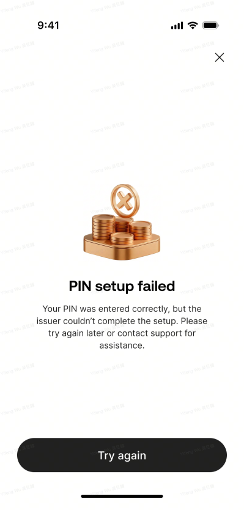</td>
<td rowspan="4" style="text-align: left;">
1. <strong>右上角X</strong>

点击关闭按钮返回卡管首页；

2. <strong>文案说明</strong>

前端写死文案Title：Card activation failed

前端写死文案Subtitle：Your card details were verified, but the issuer couldn’t complete the activation at this time. Please try again later or contact support for assistance.

3. <strong>按钮</strong>

点击try again按钮，进入Card Home Page
</td>
</tr>
<tr>
</tr>
<tr>
</tr>
<tr>
</tr>
</tbody>
</table>

7.3 **Set PIN / Change PIN**

7.3.1 **业务流程**

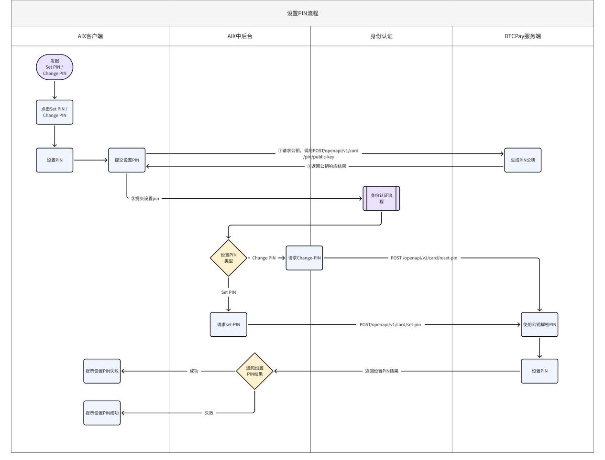

7.3.2 **页面逻辑**

7.3.2.1 **页面概览**

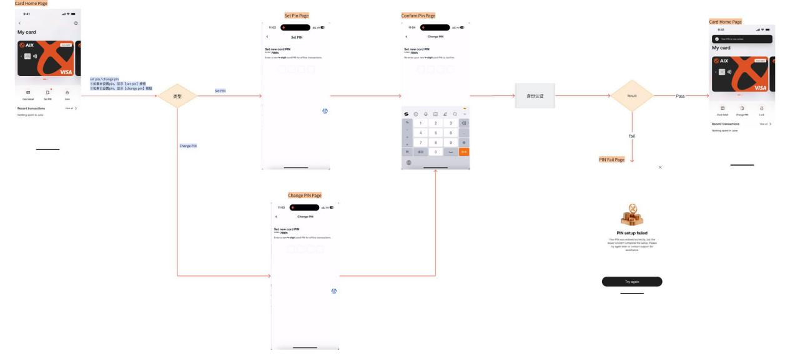

7.3.2.2 ***Set PIN Page***

<table style="width:89%;">
<colgroup>
<col style="width: 30%" />
<col style="width: 58%" />
</colgroup>
<tbody>
<tr>
<td style="text-align: left;">UX</td>
<td style="text-align: left;">Description</td>
</tr>
<tr>
<td rowspan="4" style="text-align: center;">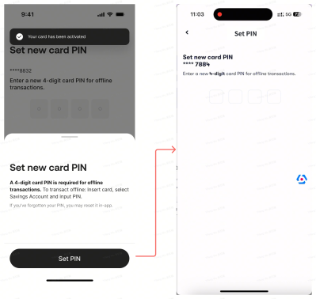</td>
<td rowspan="4" style="text-align: left;">
1. <strong>返回按钮</strong>

<ul>
<li>
点击“返回”按钮时，弹出挽留弹窗
</li>
</ul>

点击弹出挽留弹窗

<ul>
<li>
Title：Confirm Exit?
</li>
</ul>
<ul>
<li>
Content: Are you sure you want to leave before completing this step?
</li>
</ul>
<ul>
<li>
Button:
</li>
</ul>
<ul>
<li>
Stay and continue: 点击后关闭弹窗，停留在当前页；
</li>
</ul>
<ul>
<li>
<em>Leave: 点击后关闭弹窗，返回到业务流程入口页；</em>
</li>
</ul>

2. <strong>标题&amp;副标题</strong>

<ul>
<li>
Title：Set new card PIN
</li>
</ul>

**** 4444

<ul>
<li>
Subtitle：Enter a new 6-digit card PIN for offline transaction.
</li>
</ul>

3. <strong>提交机制</strong>

<ul>
<li>
当4位数字均输入完毕后，进入confirm pin page
</li>
</ul>

4. <strong>特殊处理： PIN 弹窗引导</strong>

<table style="width:55%;">
<colgroup>
<col style="width: 55%" />
</colgroup>
<tbody>
<tr>
<td style="text-align: left;">背景说明： 
设置 PIN 是用户使用物理卡进行离线交易的关键步骤，需通过明确引导提升用户认知与操作信心。因此，在进入“Set PIN”页面时，若为首次设置，需弹出一个引导式弹窗，解释 PIN 的用途及后续使用方式。</td>
</tr>
</tbody>
</table>

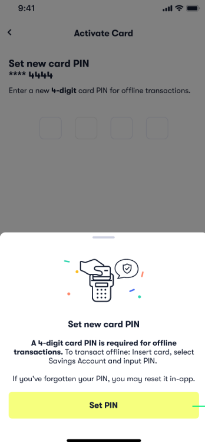

<ul>
<li>
触发条件
</li>
</ul>
<ul>
<li>
用户从卡激活流程，进入Set PIN Page；正常设置PIN不触发；
</li>
</ul>
<ul>
<li>
弹窗内容
</li>
</ul>
<ul>
<li>
标题：Set new card PIN
</li>
</ul>
<ul>
<li>
内容：
</li>
</ul>
<ul>
<li>
A 6-digit card PIN is required for offline transactions. To transact offline: Insert card, select Savings Account and input PIN.
</li>
</ul>
<ul>
<li>
If you've forgotten your PIN, you may reset it in-app.
</li>
</ul>
<ul>
<li>
按钮：
</li>
</ul>
<ul>
<li>
Set PIN：点击后：关闭弹窗，继续进入 PIN 输入流程
</li>
</ul></td>
</tr>
<tr>
</tr>
<tr>
</tr>
<tr>
</tr>
</tbody>
</table>

7.3.2.3 **Change PIN Page**

<table style="width:89%;">
<colgroup>
<col style="width: 30%" />
<col style="width: 58%" />
</colgroup>
<tbody>
<tr>
<td style="text-align: left;">UX</td>
<td style="text-align: left;">Description</td>
</tr>
<tr>
<td rowspan="4" style="text-align: center;">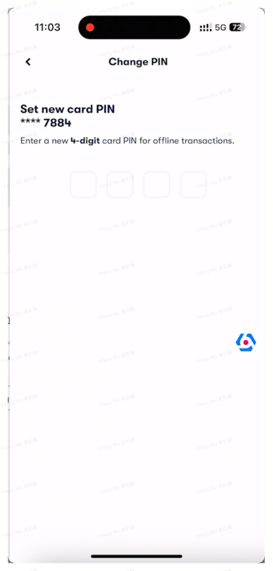</td>
<td rowspan="4" style="text-align: left;">
1. <strong>页面规则</strong>

页面规则基本与Set PIN一致，主要区别为：

<ul>
<li>
Page title为：Change PIN
</li>
</ul></td>
</tr>
<tr>
</tr>
<tr>
</tr>
<tr>
</tr>
</tbody>
</table>

7.3.2.4 **Confirm PIN Page**

<table style="width:89%;">
<colgroup>
<col style="width: 30%" />
<col style="width: 58%" />
</colgroup>
<tbody>
<tr>
<td style="text-align: left;">UX</td>
<td style="text-align: left;">Description</td>
</tr>
<tr>
<td rowspan="4" style="text-align: center;">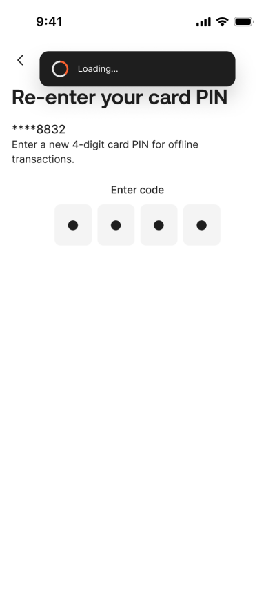</td>
<td rowspan="4" style="text-align: left;">
1. <strong>页面标题</strong>

根据进入路径展示对应标题：

<ul>
<li>
<strong>Set PIN 流程</strong>：Set PIN
</li>
</ul>
<ul>
<li>
<strong>Change PIN 流程</strong>：Change PIN
</li>
</ul>

2. <strong>返回操作</strong>

<ul>
<li>
点击返回，返回至上一页面
</li>
</ul>

3. <strong>标题&amp;副标题</strong>

<ul>
<li>
Title：Re-enter your card PIN
</li>
</ul>
<ul>
<li>
Subtitle：**** 4444
</li>
</ul>

Re-enter your new 4-digit card PIN to confirm.

4. <strong>提交逻辑</strong>

当用户输入 6 <strong>位数字 PIN</strong> 后，系统自动触发提交，无需额外点击确认按钮；

提交状态与异常处理如下：

<ul>
<li>
<strong>提交中</strong>：
</li>
</ul>
<ul>
<li>
页面显示 Loading...，禁止重复输入或返回操作；
</li>
</ul>
<ul>
<li>
<strong>两次 PIN 不一致</strong>：
</li>
</ul>
<ul>
<li>
系统自动返回至上一级页面；
</li>
</ul>
<ul>
<li>
Toast 提示：Please re-entered the same PIN.
</li>
</ul>
<ul>
<li>
<strong>两次 PIN 一致</strong>：
</li>
</ul>
<ul>
<li>
进入下一流程，调用 <strong>身份认证模块</strong>；
</li>
</ul>
<ul>
<li>
<strong>网络异常</strong>：
</li>
</ul>
<ul>
<li>
弹出 Network Error Popup；
</li>
</ul>
<ul>
<li>
用户关闭弹窗返回本页面后，清空 PIN 输入框；
</li>
</ul>
<ul>
<li>
<strong>服务器异常</strong>：
</li>
</ul>
<ul>
<li>
弹出 Server Error Popup；
</li>
</ul>
<ul>
<li>
用户关闭弹窗返回本页面后，清空 PIN 输入框。
</li>
</ul></td>
</tr>
<tr>
</tr>
<tr>
</tr>
<tr>
</tr>
</tbody>
</table>

7.3.2.5 **身份认证模块**

<table style="width:89%;">
<colgroup>
<col style="width: 30%" />
<col style="width: 58%" />
</colgroup>
<tbody>
<tr>
<td style="text-align: left;">UX</td>
<td style="text-align: left;">Description</td>
</tr>
<tr>
<td rowspan="4" style="text-align: center;"></td>
<td rowspan="4" style="text-align: left;">
1. <strong>页面规则</strong>

<ul>
<li>
本步骤调用 <strong>AAI 身份认证页面（活体认证）</strong>；
</li>
</ul>
<ul>
<li>
认证流程及页面样式由 AAI SDK 提供，具体规则详见《身份认证需求描述》；
</li>
</ul>

2. <strong>验证流程说明</strong>

2.1 <strong>活体认证通过后：</strong>

根据当前流程类型调用对应接口：

<ul>
<li>
<strong>Set PIN 流程</strong>：调用 Set Card PIN 接口；
</li>
</ul>
<ul>
<li>
<strong>Change PIN 流程</strong>：调用 Reset Card PIN 接口；
</li>
</ul>

2.2 <strong>接口调用结果处理：</strong>

<ul>
<li>
<strong>请求成功（PIN 设置 / 重置成功）</strong>：
</li>
</ul>
<ul>
<li>
进入 PIN 设置成功流程，进入Card Home page；
</li>
</ul>
<ul>
<li>
<strong>接口返回失败</strong>：
</li>
</ul>
<ul>
<li>
进入 PIN Fail Page；
</li>
</ul>
<ul>
<li>
<strong>网络异常</strong>：
</li>
</ul>
<ul>
<li>
进入 Network Error Page；
</li>
</ul>
<ul>
<li>
<strong>服务器异常</strong>：
</li>
</ul>
<ul>
<li>
进入 Server Error Page。
</li>
</ul></td>
</tr>
<tr>
</tr>
<tr>
</tr>
<tr>
</tr>
</tbody>
</table>

7.3.2.6 **PIN Fail Page**

<table style="width:88%;">
<colgroup>
<col style="width: 88%" />
</colgroup>
<tbody>
<tr>
<td style="text-align: left;">
DTC知识点：<strong>PIN简单规则检验</strong>

| 格式 | 必须正好是 6 位数字 (^\d{6}$) |

| 连续性 | 拒绝连续数字模式 |，如：❌ "123456" → 每个数字相差 1 → 连续

| 拒绝 | 任何数字出现超过 3 次 的 PIN，如：❌ "111213" → '1' 出现 4 次 (&gt; 3) → 重复过多
</td>
</tr>
</tbody>
</table>

<table style="width:89%;">
<colgroup>
<col style="width: 30%" />
<col style="width: 58%" />
</colgroup>
<tbody>
<tr>
<td style="text-align: left;">UX</td>
<td style="text-align: left;">Description</td>
</tr>
<tr>
<td rowspan="4" style="text-align: center;"></td>
<td rowspan="4" style="text-align: left;">
1. <strong>右上角X</strong>

点击关闭按钮返回卡管首页；

2. <strong>文案说明</strong>

<ul>
<li>
<strong>Title：</strong> 
PIN setup failed
</li>
</ul>
<ul>
<li>
<strong>Content（默认通用文案）：</strong> 
We couldn't complete your PIN setup right now. Please try again later.
</li>
</ul>
<ul>
<li>
<strong>Content（特殊错误码覆盖）：</strong>
</li>
</ul>
<ul>
<li>
当接口返回 error_code = 31031 时，后端返回文案：
</li>
</ul>
<table style="width:51%;">
<colgroup>
<col style="width: 50%" />
</colgroup>
<tbody>
<tr>
<td><ul>
<li>
The password is too simple. Please reset it.
</li>
</ul></td>
</tr>
</tbody>
</table>

3. <strong>按钮</strong>

点击try again按钮，进入Card Home Page
</td>
</tr>
<tr>
</tr>
<tr>
</tr>
<tr>
</tr>
</tbody>
</table>

7.4 **Lock Card**

7.4.1 **业务流程**

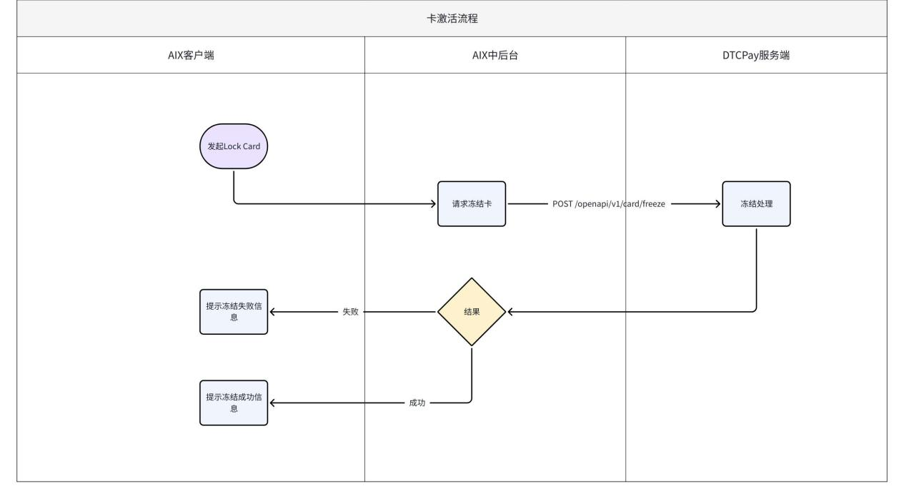

7.4.2 **页面逻辑**

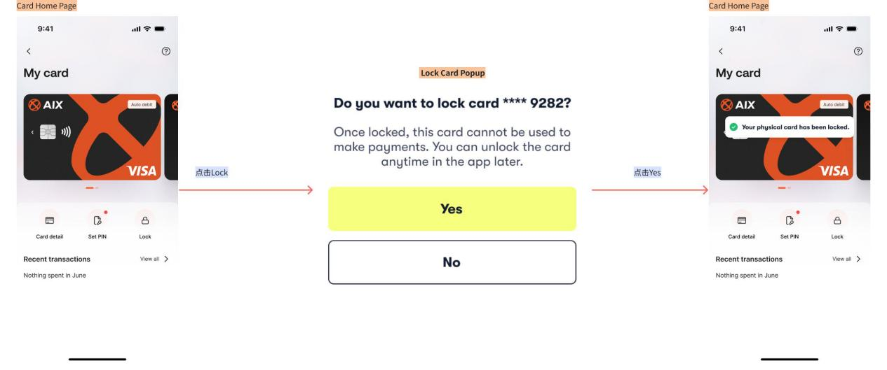

7.4.2.1 **Lock Card Popup**

<table style="width:89%;">
<colgroup>
<col style="width: 30%" />
<col style="width: 58%" />
</colgroup>
<tbody>
<tr>
<td style="text-align: left;">UX</td>
<td style="text-align: left;">Description</td>
</tr>
<tr>
<td rowspan="4" style="text-align: center;"></td>
<td rowspan="4" style="text-align: left;">
1. <strong>Lock Card Popup</strong>

<ul>
<li>
触发条件：
</li>
</ul>
<ul>
<li>
当用户在“Card Home Page”点击“Lock Card”按钮后，系统弹出确认对话框，用于二次确认锁定操作，防止误触。
</li>
</ul>
<ul>
<li>
标题：Do you want to lock card **** 9282?
</li>
</ul>
<ul>
<li>
文案：Once locked, this card cannot be used to make payments. You can unlock the card anytime in the app later.
</li>
</ul>
<ul>
<li>
按钮：
</li>
</ul>
<ul>
<li>
NO：点击后关闭弹窗，返回原页面，不执行任何操作。
</li>
</ul>
<ul>
<li>
YES：点击后触发卡片锁定流程，<strong>调用Freeze Card接口；</strong>
</li>
</ul>
<ul>
<li>
请求成功后，关闭弹窗，Toast提示：Your physical card has been locked.
</li>
</ul>
<ul>
<li>
若超时/无网络，提示：No internet connection, please check the connection or try again later.
</li>
</ul>
<ul>
<li>
若其他后端错误，则Toast提示后端返回错误文案；提示：Freeze failed
</li>
</ul></td>
</tr>
<tr>
</tr>
<tr>
</tr>
<tr>
</tr>
</tbody>
</table>

7.5 **Unlock Card**

7.5.1 **业务流程**

7.5.2 **页面逻辑**

7.5.2.1 **Unlock**

<table style="width:89%;">
<colgroup>
<col style="width: 24%" />
<col style="width: 64%" />
</colgroup>
<tbody>
<tr>
<td style="text-align: left;">UX</td>
<td style="text-align: left;">Description</td>
</tr>
<tr>
<td rowspan="4" style="text-align: left;">N/A</td>
<td rowspan="4" style="text-align: left;">
1. <strong>提交机制</strong>

当用户通过身份验证（如指纹、面部识别或设备密码）后，系统自动发起卡片解锁请求。

<ul>
<li>
<strong>调用 Unfreeze Card 接口</strong>，提交卡片unlock申请。
</li>
</ul>
<ul>
<li>
请求发送后，按钮显示“Loading...”状态，禁止重复提交。
</li>
</ul>
<ul>
<li>
若提交成功，卡片状态更新为“Activate”，并显示 Toast 提示：“Your physical card has been unlocked.”；
</li>
</ul>
<ul>
<li>
若超时/无网络，提示：No internet connection, please check the connection or try again later.”，保留当前“Locked”状态，允许用户重试。
</li>
</ul>
<ul>
<li>
若其他后端错误，则Toast提示后端返回错误文案；提示：Unfreeze failed
</li>
</ul></td>
</tr>
<tr>
</tr>
<tr>
</tr>
<tr>
</tr>
</tbody>
</table>

# 8. 外部接口依赖

8.1 **外部接口清单**

<table style="width:89%;">
<colgroup>
<col style="width: 20%" />
<col style="width: 26%" />
<col style="width: 13%" />
<col style="width: 28%" />
</colgroup>
<tbody>
<tr>
<td style="text-align: left;">接口名称</td>
<td style="text-align: left;"><strong>接口地址</strong></td>
<td style="text-align: left;">涉及功能模块</td>
<td style="text-align: left;"><strong>接口说明</strong></td>
</tr>
<tr>
<td style="text-align: left;">Get Card Basic Info</td>
<td style="text-align: left;">GET /openapi/v1/card/basic-info</td>
<td style="text-align: left;">查看卡信息</td>
<td style="text-align: left;">查询卡片状态、余额、卡号后四位等非敏感信息。用于卡管理页面展示。</td>
</tr>
<tr>
<td style="text-align: left;">Get Card Sensitive Info</td>
<td style="text-align: left;">GET /openapi/v1/card/sensitive-info</td>
<td style="text-align: left;">查看卡信息</td>
<td style="text-align: left;">查询完整卡号（PAN）、CVC、有效期等敏感信息。</td>
</tr>
<tr>
<td style="text-align: left;">Card Activation</td>
<td style="text-align: left;">POST /openapi/v1/card/activate</td>
<td style="text-align: left;">卡激活</td>
<td style="text-align: left;">提交用户输入的卡号后四位及收到的OTP，完成实体卡激活。</td>
</tr>
<tr>
<td style="text-align: left;">Generate Public Pin Key</td>
<td style="text-align: left;">POST /openapi/v1/card/pin/public-key</td>
<td style="text-align: left;"><ul>
<li>
卡激活
</li>
</ul>
<ul>
<li>
设置卡 PIN
</li>
</ul></td>
<td style="text-align: left;">获取用于加密PIN的RSA公钥，确保PIN在传输过程中的安全性。</td>
</tr>
<tr>
<td style="text-align: left;">Set Card PIN</td>
<td style="text-align: left;">POST /openapi/v1/card/pin/set</td>
<td style="text-align: left;">设置卡 PIN</td>
<td style="text-align: left;">完成首次PIN设置或激活流程中的PIN设定。</td>
</tr>
<tr>
<td style="text-align: left;">OTP For Reset PIN</td>
<td style="text-align: left;">POST /openapi/v1/card/otp/reset-pin</td>
<td style="text-align: left;">设置卡 PIN</td>
<td style="text-align: left;">向DTC请求发送用于重置PIN的验证码（OTP）</td>
</tr>
<tr>
<td style="text-align: left;">Reset Card PIN</td>
<td style="text-align: left;">POST /openapi/v1/card/pin/reset</td>
<td style="text-align: left;">重置卡 PIN</td>
<td style="text-align: left;">完成PIN的重置操作。</td>
</tr>
<tr>
<td style="text-align: left;">Freeze Card</td>
<td style="text-align: left;">POST /openapi/v1/card/freeze</td>
<td style="text-align: left;">冻结卡片</td>
<td style="text-align: left;">临时锁定卡片，防止交易。</td>
</tr>
<tr>
<td style="text-align: left;">Unfreeze Card</td>
<td style="text-align: left;">POST /openapi/v1/card/unfreeze</td>
<td style="text-align: left;">解冻卡片</td>
<td style="text-align: left;">解除卡片冻结状态，恢复卡片使用。</td>
</tr>
</tbody>
</table>

# 9. 待确认事项

- ~~激活时，新增入参Autedebit，入参送进为 ON 时，就会开启自动扣款；~~

<!-- -->

- ~~Confirm PIN Page，如果是toast提示，那么用户如何重新触发？已经ux的提交失败的场景是什么？~~

<!-- -->

- 卡激活ux评审后需要调整

<!-- -->

- 可能需要新增googlepay手工添加卡的功能
