# AIX Card ME模块需求V1.0

# 1. 需求变更日志

<table style="width:89%;">
<colgroup>
<col style="width: 10%" />
<col style="width: 10%" />
<col style="width: 45%" />
<col style="width: 22%" />
</colgroup>
<tbody>
<tr>
<td style="text-align: left;">变更时间</td>
<td style="text-align: left;">变更人</td>
<td style="text-align: left;">变更内容</td>
<td style="text-align: left;">备注</td>
</tr>
<tr>
<td style="text-align: left;">2025-10-21</td>
<td style="text-align: left;">@Yifeng Wu 吴忆锋</td>
<td style="text-align: left;">初稿</td>
<td style="text-align: left;"></td>
</tr>
<tr>
<td style="text-align: left;">2025-10-31</td>
<td style="text-align: left;">@Yifeng Wu 吴忆锋</td>
<td style="text-align: left;">
【Mobile OTP Verification Page】移至【身份认证模块】管理<a href="https://advancegroup.sg.larksuite.com/wiki/HdI2wMXXviIOOwkVJNjlWY35gSh#share-L9xfdzbItoAwH1x7aQ0lSH1jgWf">AIX Security 身份认证需求V1.0</a>

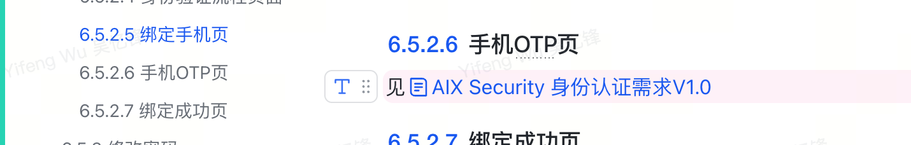

@Yu Zhang 张豫@Xin Wang 王鑫
</td>
<td style="text-align: left;"></td>
</tr>
<tr>
<td style="text-align: left;">2025-11-05</td>
<td style="text-align: left;">@Yifeng Wu 吴忆锋</td>
<td style="text-align: left;">
<strong>【绑定手机流程】</strong>

<strong>旧流程：</strong>无论首次绑定，还是换绑手机号，都需要过【身份认证流程】

<strong>问题：</strong>首次绑定策略定的是otp，会走不通，跟策略商定，首次绑定风险不大，可以不走身份认证。

<strong>新流程：</strong>首次绑定不走身份认证，换绑才走身份认证

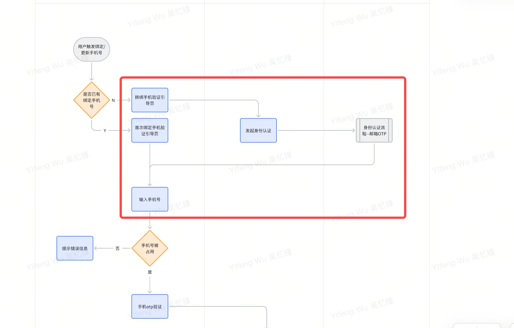
</td>
<td style="text-align: left;"></td>
</tr>
</tbody>
</table>

# 2. 引用资料

|  |  |
|:---|:---|
| **类型** | 链接 |
| PM | @Yifeng Wu 吴忆锋 |
| Figma | https://www.figma.com/design/LxHqrwdNow4AnEZG3Sj9bF/%E2%86%92-AIX-Dev-Handoff-2026-Q1?node-id=0-1&p=f&t=G3igC1OWQjFFJoQ1-0 |
| BRD | N/A |
| 技术方案 | [AIX System Design v0.1(Draft)](https://advancegroup.sg.larksuite.com/wiki/DHvYw3fRkiFYkRkiHK9lwSG4gnh) |

# 3. 需求索引

**\[同步块-无权限下载此内容\]**

# 2. 项目概述

2.1 **项目背景**

|  |
|:---|
| 为满足全球用户对一体化、便捷安全数字金融服务的需求，本项目旨在开发一款创新的移动应用。该应用将整合先进的支付与账户管理技术，致力于为用户提供全新的移动端金融管理体验。 |

2.2 **项目目的**

<table style="width:88%;">
<colgroup>
<col style="width: 88%" />
</colgroup>
<tbody>
<tr>
<td>
构建基础​：建立安全、便捷的用户注册登录与账户体系。

核心功能​：实现充值、提现、转账、消费等关键支付功能。

安全保障​：通过多层验证与风控策略，确保用户资产与信息安全。

体验优化​：提供流畅直观的操作流程，提升用户留存。
</td>
</tr>
</tbody>
</table>

2.3 **名词解释**

<table style="width:88%;">
<colgroup>
<col style="width: 88%" />
</colgroup>
<tbody>
<tr>
<td><table style="width:86%;">
<colgroup>
<col style="width: 16%" />
<col style="width: 69%" />
</colgroup>
<tbody>
<tr>
<td style="text-align: left;"><strong>名词/缩写</strong></td>
<td style="text-align: left;"><strong>说明</strong></td>
</tr>
<tr>
<td style="text-align: left;">DeviceID</td>
<td style="text-align: left;">用于唯一识别用户客户端的设备编号。用于实现设备绑定、可信设备判断及风险控制等。</td>
</tr>
<tr>
<td style="text-align: left;">IVS</td>
<td style="text-align: left;">
Identity Verification Service，身份验证服务。

通常指用于进行高强度实名验证的服务（如证件识别、人脸比对等），在注册或敏感操作流程中可能被调用。
</td>
</tr>
<tr>
<td style="text-align: left;">Biometric</td>
<td style="text-align: left;">通过用户的生物特征（如指纹、面部信息）进行身份验证的技术。支持iOS Face ID/Android指纹/人脸</td>
</tr>
<tr>
<td style="text-align: left;">AIX Tag</td>
<td style="text-align: left;">用户在AIX平台上的身份标识符。用于在转账、社交等场景中代替复杂的钱包地址，使用户能够被轻松找到和支付。此标识一旦设置，通常不可更改。</td>
</tr>
<tr>
<td style="text-align: left;">DTC</td>
<td style="text-align: left;">AIX项目的合作伙伴，提供加密钱包、卡片发行和KYC服务的后端平台，支持OpenAPI接口，用于处理交易、认证和账户管理。</td>
</tr>
<tr>
<td style="text-align: left;">AAI</td>
<td style="text-align: left;">第三方身份验证服务提供商，用于KYC流程中的护照上传、活体检测和人脸比对。支持Webhook回调和URL生成。</td>
</tr>
<tr>
<td style="text-align: left;">Master Account</td>
<td style="text-align: left;">DTC侧的账户概念，主账户，可申请API Key管理多个Sub Account。敏感操作需Sub Account授权。</td>
</tr>
<tr>
<td style="text-align: left;">Sub Account</td>
<td style="text-align: left;">DTC侧的账户概念，子账户，由Master创建，用于分离用户资产。KYC需独立完成。</td>
</tr>
<tr>
<td style="text-align: left;">WalletConnect</td>
<td style="text-align: left;">通过Deeplink/QR链接外部钱包充值。自动加白名单、交易报备，直接到账。</td>
</tr>
<tr>
<td style="text-align: left;">PIN</td>
<td style="text-align: left;">Personal Identification Number，卡片PIN码，用于线下交易。4位数字，支持Set/Change/Reset。</td>
</tr>
<tr>
<td style="text-align: left;">稳定币类型</td>
<td style="text-align: left;">稳定币类型USDC, USDT, FDUSD, WUSD，支持在BASE/BSC/ETHEREUM/SOLANA网络充值/转账/兑换。</td>
</tr>
<tr>
<td style="text-align: left;">区块链网络</td>
<td style="text-align: left;">支持的区块链网络，各网络币种不同（e.g., BASE: USDC）。包括：BASE, BSC, ETHEREUM, SOLANA</td>
</tr>
<tr>
<td style="text-align: left;">Global Travel Rule</td>
<td style="text-align: left;">全球旅行规则，合规要求，仅支持如Binance的白名单钱包充值。自动报备，无需声明。</td>
</tr>
</tbody>
</table>

同步自文档: <a href="https://advancegroup.sg.larksuite.com/docx/Sy4TdCxUFoCEWbxdcoQlBgzhgfh#WEeGd3rFjsp8Kjb59vLlbcdog1n">https://advancegroup.sg.larksuite.com/docx/Sy4TdCxUFoCEWbxdcoQlBgzhgfh#WEeGd3rFjsp8Kjb59vLlbcdog1n</a>
</td>
</tr>
</tbody>
</table>

# 3. 项目计划

[AIX项目管理表](https://advancegroup.sg.larksuite.com/sheets/RFR2sp4VGhbXVDtlnjTlwVsYgAb?from=from_copylink&sheet=z4hjo9)

# 4. 功能结构

# 5. 国家线

|        |        |        |
|:------:|:------:|:------:|
| **VN** | **PH** | **AU** |
|   ✅   |   ✅   |   ✅   |

# 6. 需求描述

6.1 **ME Page**

<table style="width:89%;">
<colgroup>
<col style="width: 30%" />
<col style="width: 58%" />
</colgroup>
<tbody>
<tr>
<td style="text-align: left;">UX</td>
<td style="text-align: left;">Description</td>
</tr>
<tr>
<td rowspan="4" style="text-align: center;">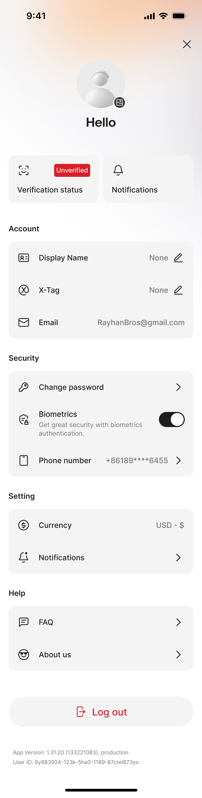</td>
<td rowspan="4" style="text-align: left;">
1. <strong>页面规则</strong>

从home page左上角点击进入

2. <strong>关闭按钮</strong>

点击右上角关闭按钮，返回上一级页面；

3. <strong>Verification status</strong>

当该uid在waitlist时（仅限来源渠道为APP），此时不可点击；

当kyc状态=pending时，且至少passport/face/poa<strong>没有一项</strong>是认证中或认证成功，此时点击进入kyc流程页，副标题显示：Unverified

当kyc状态=pending时，且至少passport/face/poa<strong>有一项</strong>是认证中或认证成功，此时点击进入kyc流程页，副标题显示：Incomplete

当kyc状态=approved时，此时不可点击，副标题显示：Verified

当kyc状态=Failed时，此时点击进入kyc流程页，副标题显示：Failed

当kyc状态=Rejected时，此时不可点击，副标题显示：Rejected

当kyc状态=Under Review时，此时不可点击，副标题显示：Under Review

4. <strong>Notifications</strong>

见<a href="https://advancegroup.sg.larksuite.com/wiki/M2PAw01mFiUnf1kD8gnlqSq9gAc">[2025-11-25] AIX+Notification（push及站内信）</a>

5. <strong>Account</strong>

见<a href="https://advancegroup.sg.larksuite.com/wiki/PxXnwhWp6iWr7RkEYnwl0I6sgzc#share-IrEBd65JCoriMmxPPxNlOtTggmg">Account</a>

6. <strong>Security</strong>

见<a href="https://advancegroup.sg.larksuite.com/wiki/PxXnwhWp6iWr7RkEYnwl0I6sgzc#share-BahuduZqtoHw5VxjS9ilaCJRgFf">密码与安全</a>

7. <strong>Setting</strong>

见Setting

8. <strong>Help</strong>

当未设置Tag时，展示如下：

<blockquote>

</blockquote>

点击列表进入Personal info page；

若未设置tag，则显示红点，若已设置则红点消失；

当已设置Tag，展示如下：

<blockquote>

</blockquote>

点击列表进入Personal info page

点击复制按钮，复制Tag，toast提示：The information has been copied.

9. <strong>Verification status选项</strong>

当该uid在waitlist时（仅限来源渠道为APP），此时不可点击，副标题显示：Verification service is not available yet

当kyc状态=pending时，且至少passport/face/poa<strong>没有一项</strong>是认证中或认证成功，此时点击进入kyc流程页，副标题显示：Unverified

当kyc状态=pending时，且至少passport/face/poa<strong>有一项</strong>是认证中或认证成功，此时点击进入kyc流程页，副标题显示：Incomplete

当kyc状态=approved时，此时不可点击，副标题显示：Verified

当kyc状态=Failed时，此时点击进入kyc流程页，副标题显示：Failed

当kyc状态=Rejected时，此时不可点击，副标题显示：Rejected

当kyc状态=Under Review时，此时不可点击，副标题显示：Under Review

10. <strong>Notification选项</strong>

点击进入Notification Page

11. <strong>Security选项</strong>

点击进入Security Page

12. <strong>Appearance选项</strong>

点击进入Appearance Page

13. <strong>About us选项</strong>

点击进入About us Page
</td>
</tr>
<tr>
</tr>
<tr>
</tr>
<tr>
</tr>
</tbody>
</table>

6.2 **Account**

6.2.1 **Personal info page**

<table style="width:89%;">
<colgroup>
<col style="width: 30%" />
<col style="width: 58%" />
</colgroup>
<tbody>
<tr>
<td style="text-align: left;">UX</td>
<td style="text-align: left;">Description</td>
</tr>
<tr>
<td rowspan="4" style="text-align: center;">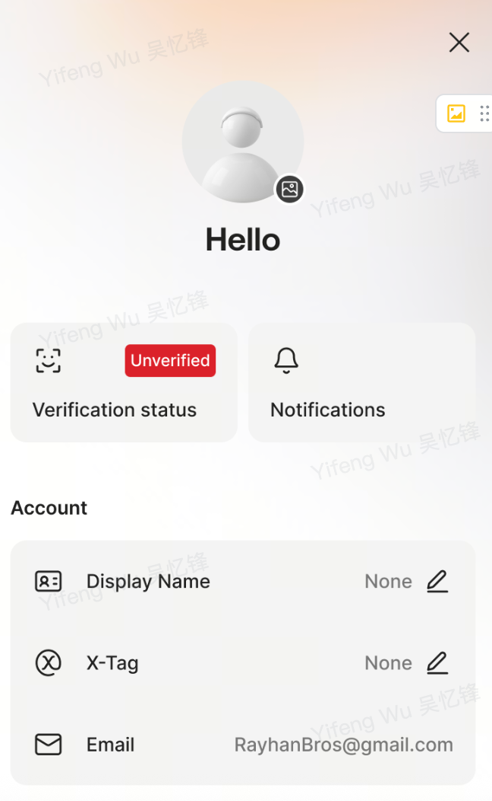</td>
<td rowspan="4" style="text-align: left;">
1. <strong>返回按钮</strong>

点击返回，返回上一级页面

2. <strong>上传头像</strong>

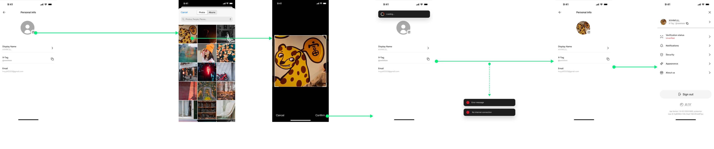

注册成功后，头像默认为空；限制jpg + png，10mb以下；

用户可在 <strong>Personal info</strong> 页面点击头像入口，上传并更新个人头像。

头像上传过程中，toast显示： Loading...

上传中，若网络异常，toast提示：Please check your internet connection and try again.

上传中，若后端服务器错误，toast提示：Something went wrong. Please try again later

上传成功后，系统更新头像并返回 Personal info 页面，立即展示最新头像。

3. <strong>Display name选项</strong>

注册成功后，系统自动生成Display Name，生成规则为：AIX_ + 6位随机大写字母

点击进入Display name page

4. <strong>X-Tag选项</strong>

若未设置Tag，显示incomplate，点击列表进入<a href="https://advancegroup.sg.larksuite.com/wiki/NerUwjf1kiLTOkk9uJClnSYZgCc#share-IdXGdAQlIo3QT4xtOKqlcFXtgyg">Set Tag Page</a>。设置完成后回到本页面，并toast提示：X-Tag has been created.

若已设置Tag，显示复制按钮，单击可复制，并toast提示：The information has been copied.

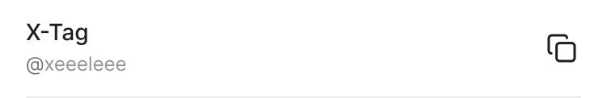

5. <strong>Email选项</strong>

显示当前email地址，需脱敏处理：保留首尾字符，中间字符统一替换为 ***，域名部分（@符号后）明文展示
</td>
</tr>
<tr>
</tr>
<tr>
</tr>
<tr>
</tr>
</tbody>
</table>

6.2.1.1 **Display name page**

<table style="width:89%;">
<colgroup>
<col style="width: 30%" />
<col style="width: 58%" />
</colgroup>
<tbody>
<tr>
<td style="text-align: left;">UX</td>
<td style="text-align: left;">Description</td>
</tr>
<tr>
<td rowspan="4" style="text-align: center;">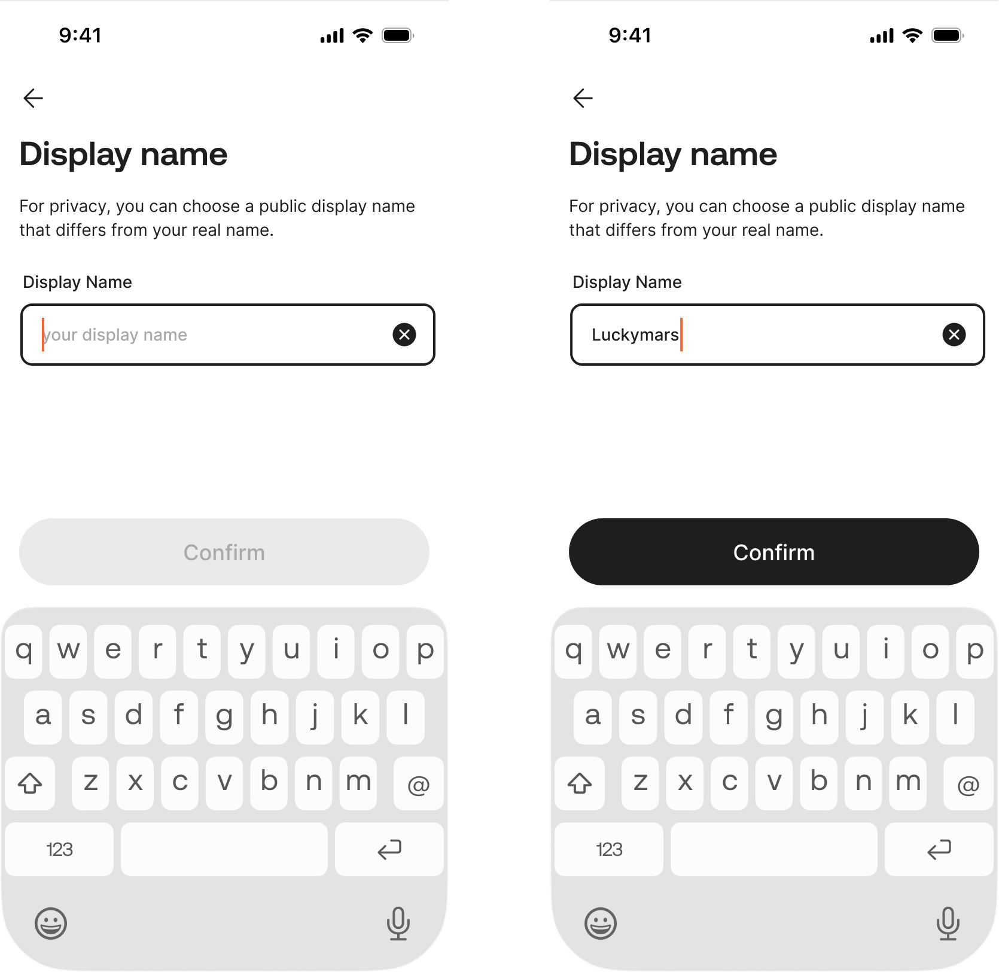</td>
<td rowspan="4" style="text-align: left;">
1. <strong>返回按钮</strong>

点击返回上一级页面

2. <strong>Display name输入框</strong>

默认显示当前display name

修改规则：​

用户必须能够自由修改其昵称。

昵称允许输入的字符类型为：中文、英文、数字、_。

昵称长度限制最多为 20个字符。

昵称无需具备平台唯一性​，允许重名。

生效规则：​ 昵称修改成功后，新昵称立即生效。

3. <strong>Confirm按钮</strong>

当 Display Name 输入内容不为空时，才可点击；

点击按钮：

提交中时，toast显示：loading...

提交中，若网络异常，toast提示：Please check your internet connection and try again.

提交中，若后端服务器错误，toast提示：Something went wrong. Please try again later

提交成功，系统更新display name并返回 Personal info 页面，toast提示：Display name has been created
</td>
</tr>
<tr>
</tr>
<tr>
</tr>
<tr>
</tr>
</tbody>
</table>

6.3 **Security**

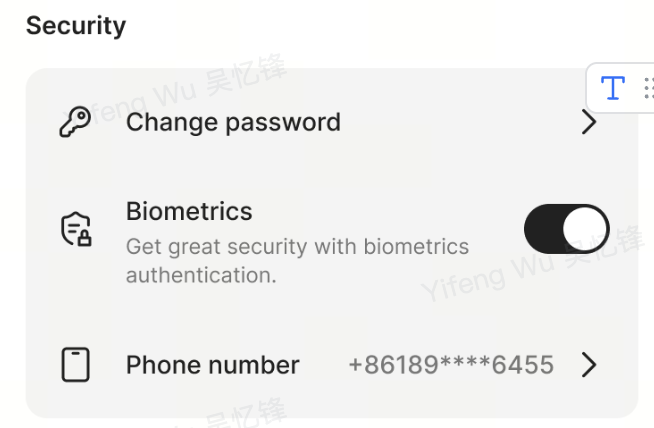

6.3.1 **Change password**

6.3.1.1 **页面概览**

6.3.1.2 **Identity Verification**

见[AIX Security 身份认证需求V1.0](https://advancegroup.sg.larksuite.com/wiki/HdI2wMXXviIOOwkVJNjlWY35gSh#share-Rew8dANwFoaWYAxxL8NlWEr5gNb)

6.3.1.3 **Set Password Page**

<table style="width:89%;">
<colgroup>
<col style="width: 30%" />
<col style="width: 58%" />
</colgroup>
<tbody>
<tr>
<td style="text-align: left;">UX</td>
<td style="text-align: left;">Description</td>
</tr>
<tr>
<td rowspan="4" style="text-align: center;">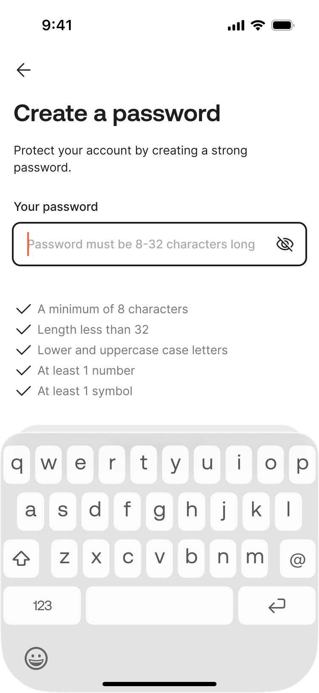</td>
<td rowspan="4" style="text-align: left;">页面规则见<a href="https://advancegroup.sg.larksuite.com/wiki/NerUwjf1kiLTOkk9uJClnSYZgCc#share-PbGmdh1tooTDcFxFSc1lTbU1ggh">Set Password Page</a>页面</td>
</tr>
<tr>
</tr>
<tr>
</tr>
<tr>
</tr>
</tbody>
</table>

6.3.1.4 **Re-enter Password Page**

<table style="width:89%;">
<colgroup>
<col style="width: 30%" />
<col style="width: 58%" />
</colgroup>
<tbody>
<tr>
<td style="text-align: left;">UX</td>
<td style="text-align: left;">Description</td>
</tr>
<tr>
<td rowspan="4" style="text-align: center;"></td>
<td rowspan="4" style="text-align: left;">页面规则见<a href="https://advancegroup.sg.larksuite.com/wiki/NerUwjf1kiLTOkk9uJClnSYZgCc#share-V7xzdxpK1oN7ygx0vR9l2xBTgec">Re-enter Password Page</a>页面</td>
</tr>
<tr>
</tr>
<tr>
</tr>
<tr>
</tr>
</tbody>
</table>

6.3.2 **Biometrics**

<table style="width:89%;">
<colgroup>
<col style="width: 8%" />
<col style="width: 79%" />
</colgroup>
<tbody>
<tr>
<td style="text-align: left;">需求描述</td>
<td style="text-align: left;">
1. <strong>开启Biometrics</strong>

当Biometrics关闭状态时，点击先调用身份认证验证，验证通过后，拉起设备验证，验证通过后则开启成功Biometric；

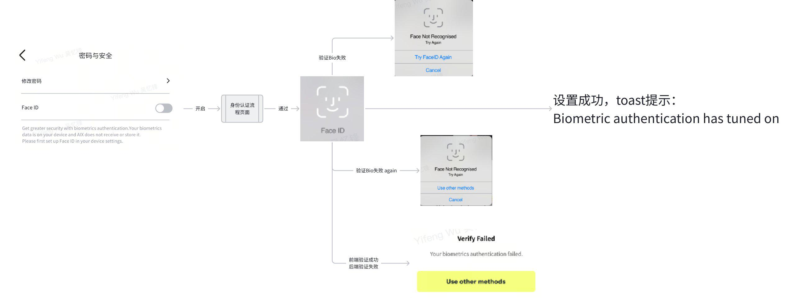

2. <strong>关闭Biometrics</strong>

当Biometrics开启状态时，点击可直接关闭，toast提示：Biometrics has tuned off

自动关闭机制：当系统检测到设备端的生物识别凭证失效时，Biometrics功能将自动关闭。 功能关闭后，用户如需重新启用Face ID，必须重新完成完整的开启流程。

iOS 多次失败超次数会展示系统弹窗，点击弹窗 button，系统返回Bio 不可用则隐藏开关，锁屏开屏刷新 me 页面，Bio 开关会重新展示

iOS 权限被拒会展示自定义弹窗引导用户去 setting 开启权限

Android 多次失败超次数会展示自定义弹窗，系统返回Bio 不可用则隐藏开关

系统其他错误 toast 提示： Unable to turn on Face ID / Unable to turn on Touch ID
</td>
</tr>
</tbody>
</table>

6.3.3 **绑定手机流程**

6.3.3.1 **业务流程**

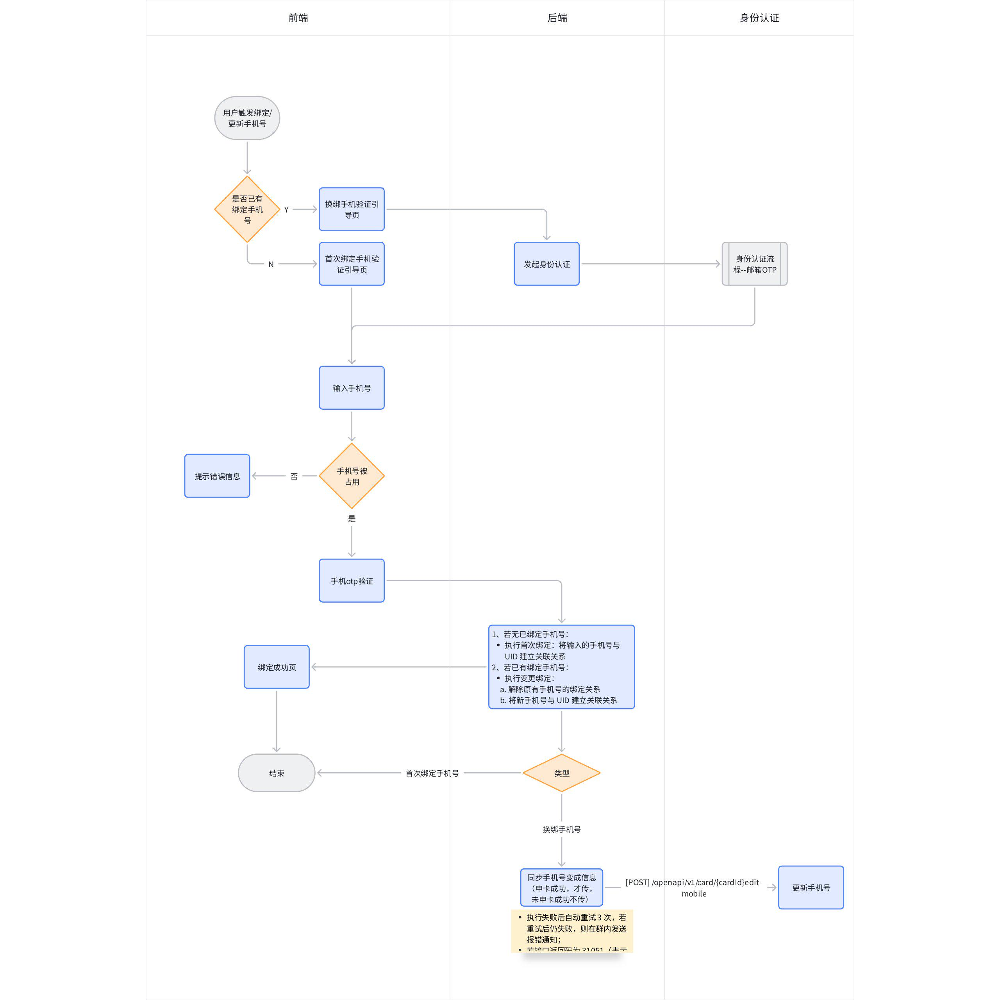

6.3.3.2 **页面概览**

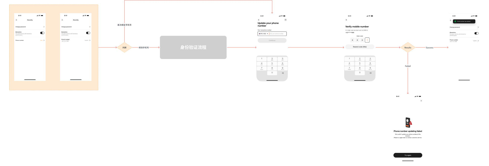

6.3.3.3 **Identity Verification**

见[AIX Security 身份认证需求V1.0](https://advancegroup.sg.larksuite.com/wiki/HdI2wMXXviIOOwkVJNjlWY35gSh#share-Rew8dANwFoaWYAxxL8NlWEr5gNb)

6.3.3.4 **Update Phone Page**

<table style="width:89%;">
<colgroup>
<col style="width: 30%" />
<col style="width: 58%" />
</colgroup>
<tbody>
<tr>
<td style="text-align: left;">UX</td>
<td style="text-align: left;">Description</td>
</tr>
<tr>
<td rowspan="4" style="text-align: center;">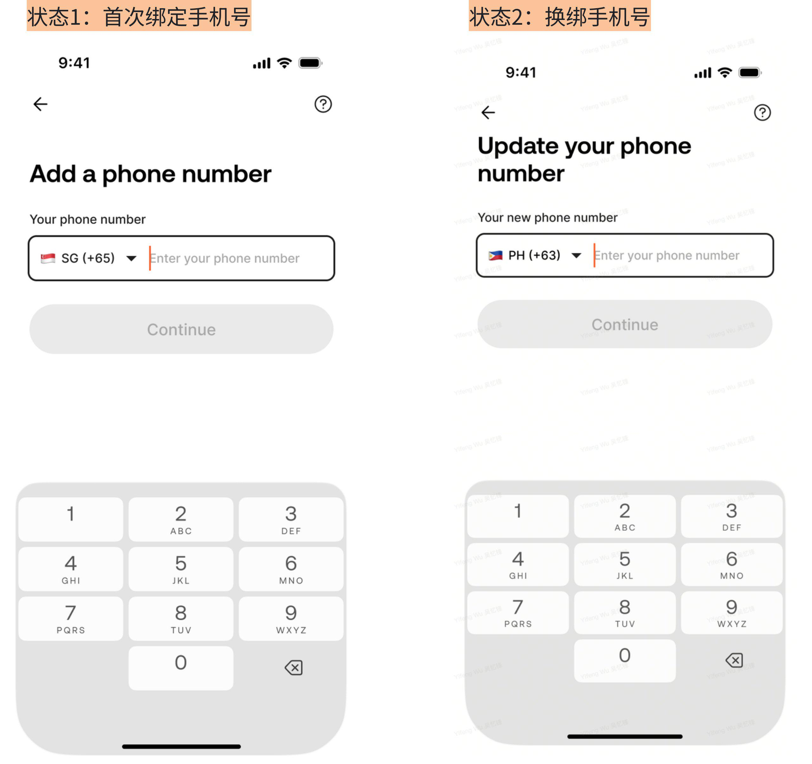</td>
<td rowspan="4" style="text-align: left;">
1. <strong>页面规则</strong>

若用户首次绑定手机号场景，展示状态1

若用户更绑手机号场景，展示状态2

2. <strong>返回按钮</strong>

返回上一级页面

3. <strong>帮助按钮</strong>

点击“？”跳转到问题库页面<a href="https://advancegroup.sg.larksuite.com/docx/OlWEdynrboay1QxcpfhlYbJtgZg?from=from_copylink">Frequently asked questions</a>；

FAQ暂未做OBoss可视化编辑Dashboard，先预设到数据库（<strong>问题 ID、标题、描述、关联场景、类型、超链接、创建时间</strong>）；

根据关键场景“Me 模块”、类型“Update Phone Page”筛选FAQ并按创建时间降序排列展示对应FAQ给用户，滑动加载更多，不翻页；

FAQ默认只显示问题折叠答案，点击任意一个问题只显示当前这条的答案；

4. <strong>标题文案</strong>

状态1（首次绑定）展示：Add a phone number

状态2（更绑手机）展示：Update your phone number

5. <strong>国家/地区代码选择</strong>

点击进入<a href="https://advancegroup.sg.larksuite.com/wiki/NerUwjf1kiLTOkk9uJClnSYZgCc#share-L0gAdmH5yokNbdxLnhulTuqdgIC">Select Country Page</a>。

6. <strong>手机号码输入</strong>

输入限制：

仅允许输入数字；

长度限制：限制最长输入20位；

7. <strong>下一步按钮</strong>

初始状态为禁用。仅当输入框内容不为空，且输入格式校验通过，变为可用；

点击逻辑：​

提交中时，toast显示：loading...

若网络异常，toast提示：Please check your internet connection and try again.

若后端服务器错误，toast提示：Something went wrong. Please try again later

后端返回手机号已被占用：​ 红字提示用户“This phone number is already in use”。

后端进行短信服务的频控检查：

同一个设备指纹，接口发起总次数限制10分钟内发起5次，超出则锁定；

同一个IP，单位时间内接口发起总次数限制10分钟内发起100次，超出则锁定；

接口总限流（研发定义）超过后。

命中以上频控，前端均toast提示：The system is busy, please try again later

后端返回成功：​ 跳转至手机验证码验证页面。
</td>
</tr>
<tr>
</tr>
<tr>
</tr>
<tr>
</tr>
</tbody>
</table>

6.3.3.5 **Mobile OTP Verification Page**

见[AIX Security 身份认证需求V1.0](https://advancegroup.sg.larksuite.com/wiki/HdI2wMXXviIOOwkVJNjlWY35gSh#share-L9xfdzbItoAwH1x7aQ0lSH1jgWf)

6.3.3.6 **Binding failed page**

<table style="width:89%;">
<colgroup>
<col style="width: 30%" />
<col style="width: 58%" />
</colgroup>
<tbody>
<tr>
<td style="text-align: left;">UX</td>
<td style="text-align: left;">Description</td>
</tr>
<tr>
<td rowspan="4" style="text-align: center;">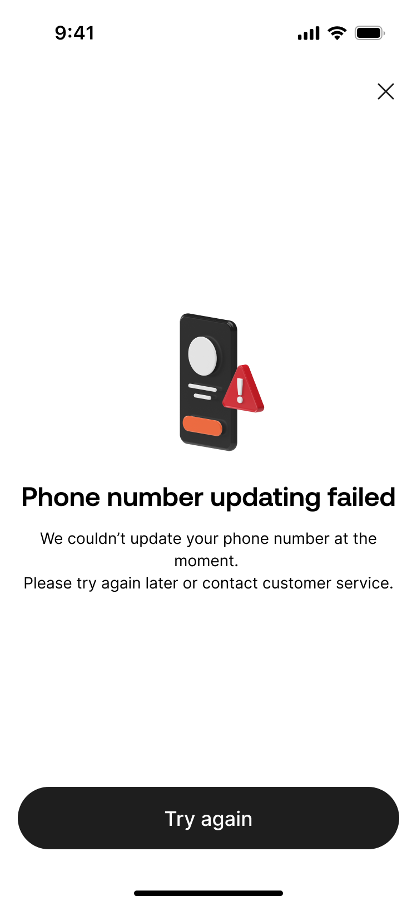</td>
<td rowspan="4" style="text-align: left;">
1. <strong>关闭按钮</strong>

点击返回到业务流程入口页；

2. <strong>Try again按钮</strong>

点击返回到业务流程入口页；
</td>
</tr>
<tr>
</tr>
<tr>
</tr>
<tr>
</tr>
</tbody>
</table>

6.4 **Setting**

<table style="width:89%;">
<colgroup>
<col style="width: 30%" />
<col style="width: 58%" />
</colgroup>
<tbody>
<tr>
<td style="text-align: left;">UX</td>
<td style="text-align: left;">Description</td>
</tr>
<tr>
<td rowspan="4" style="text-align: center;">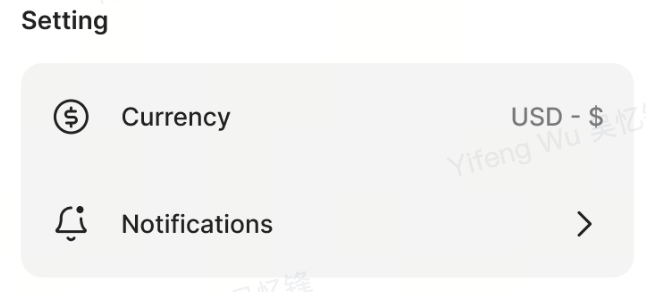</td>
<td rowspan="4" style="text-align: left;">
1. <strong>Currency</strong>

默认USD，不可选择
</td>
</tr>
<tr>
</tr>
<tr>
</tr>
<tr>
</tr>
</tbody>
</table>

6.5 **Help**

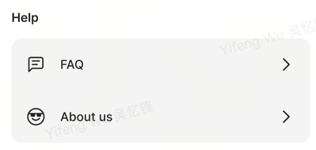

6.5.1 **About US**

<table style="width:89%;">
<colgroup>
<col style="width: 30%" />
<col style="width: 58%" />
</colgroup>
<tbody>
<tr>
<td style="text-align: left;">UX</td>
<td style="text-align: left;">Description</td>
</tr>
<tr>
<td rowspan="4" style="text-align: center;">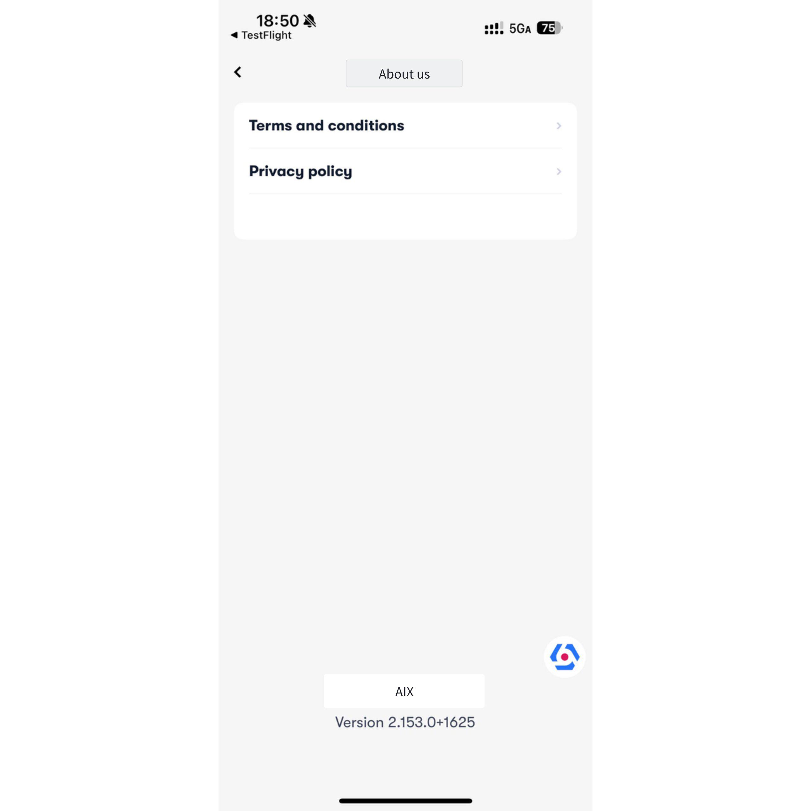</td>
<td rowspan="4" style="text-align: left;">
1. <strong>页面规则</strong>

点击terms and conditions，可查看协议，同Registration Page

点击Privacy policy，可查看协议，同Registration Page

底部显示AIX的版本号
</td>
</tr>
<tr>
</tr>
<tr>
</tr>
<tr>
</tr>
</tbody>
</table>

6.6 **Sign out**

<table style="width:89%;">
<colgroup>
<col style="width: 30%" />
<col style="width: 58%" />
</colgroup>
<tbody>
<tr>
<td style="text-align: left;">UX</td>
<td style="text-align: left;">Description</td>
</tr>
<tr>
<td rowspan="4" style="text-align: center;">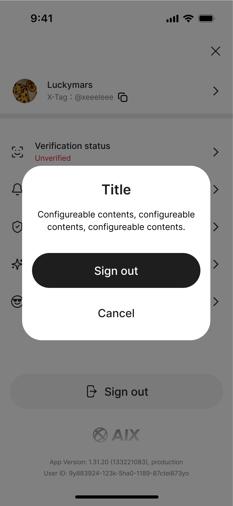</td>
<td rowspan="4" style="text-align: left;">
1. <strong>登出</strong>

自动登出（超时机制）：​​

规则：​ 用户持续在线时间超过 30天​，系统将自动登出该用户账户。

行为：​ 自动登出后，用户再次使用应用时需重新登录。

弹窗提示：

<table style="width:51%;">
<colgroup>
<col style="width: 50%" />
</colgroup>
<tbody>
<tr>
<td style="text-align: left;">
<strong>Title：</strong>

Please log in again

<strong>Content：</strong>

For security reasons, you’ve been logged out.Please log in to continue.

<strong>Button：</strong>Log in（点击后跳转至登录页面）
</td>
</tr>
</tbody>
</table>

被动登出（单点登录机制）：

规则：同一账号仅允许一个设备保持登录状态。当用户在<strong>其他设备成功登录</strong>后，当前设备的登录状态将被置为失效。

行为：用户在当前设备进行任意业务操作，前端请求后端发现登录状态已失效。系统弹出<strong>dialog阻断弹窗</strong>，告知用户当前账号已在其他设备登录；

<table style="width:55%;">
<colgroup>
<col style="width: 55%" />
</colgroup>
<tbody>
<tr>
<td style="text-align: left;">
<strong>Title：</strong>

Signed in on another device

<strong>Content：</strong>

Your account has been signed in on another device.

For security reasons, you’ve been logged out on this device.

<strong>Button：</strong>OK（点击后跳转至登录页面）
</td>
</tr>
</tbody>
</table>

手动登出：​

提供“登出”按钮入口。

用户点击后，系统必须弹出二次确认窗口，用户确认后立即清除登录态并退出至引导页。

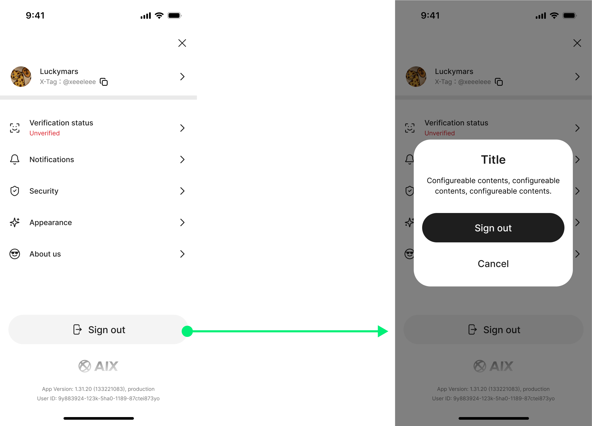
</td>
</tr>
<tr>
</tr>
<tr>
</tr>
<tr>
</tr>
</tbody>
</table>

6.7 **Language**

<table style="width:89%;">
<colgroup>
<col style="width: 30%" />
<col style="width: 58%" />
</colgroup>
<tbody>
<tr>
<td style="text-align: left;">UX</td>
<td style="text-align: left;">Description</td>
</tr>
<tr>
<td rowspan="4" style="text-align: left;">无</td>
<td rowspan="4" style="text-align: left;">
1. <strong>支持语言与默认值</strong>

<strong>支持语言：</strong>

English

Turkish

Spanish

Portuguese

Vietnamese

默认语言

默认语言为 <strong>English</strong>。

2. <strong>生效与切换规则</strong>

语言在启动App时，跟随系统语言自动切换。

用户杀进程后重新打开 App

用户首次安装后首次打开 App

非冷启动（如 App 从后台回到前台）不自动切换语言。

本期不提供 App 内语言选择入口（完全跟随系统语言）。

当系统语言不在支持列表：默认选择 English。

app将按系统语言的列表顺序依次进行语言匹配，若所有语言均未匹配成功，则默认使用“en”。

3. <strong>同步语言到后端</strong>

当 App 检测到语言发生变化时，应将最新语言同步至后端；若语言未发生变化，则无需同步。

若因网络异常等原因未能成功同步，则在下次 App 启动或网络恢复后再次尝试同步。
</td>
</tr>
<tr>
</tr>
<tr>
</tr>
<tr>
</tr>
</tbody>
</table>
