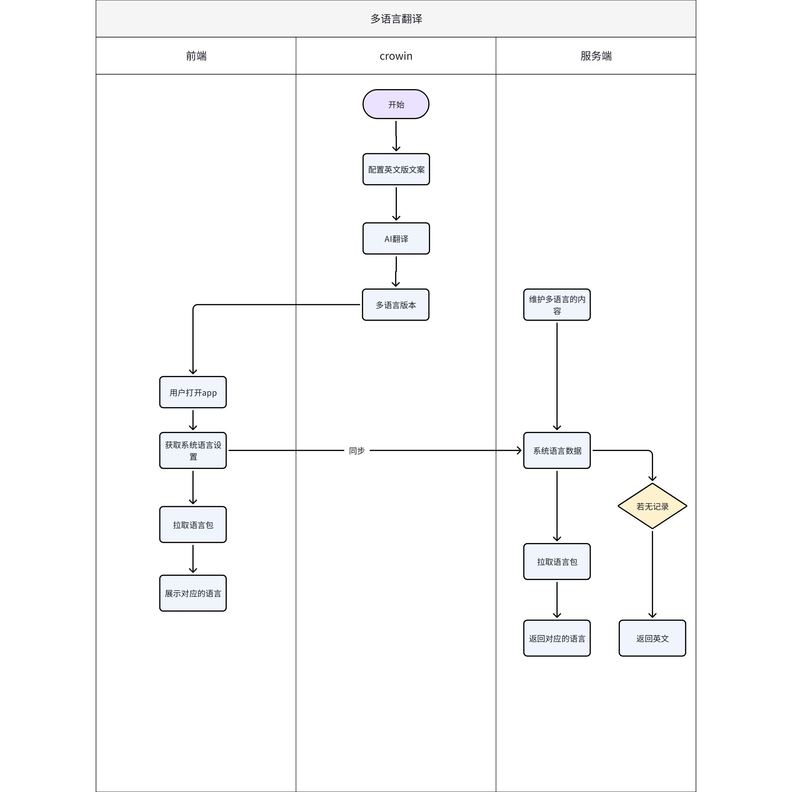
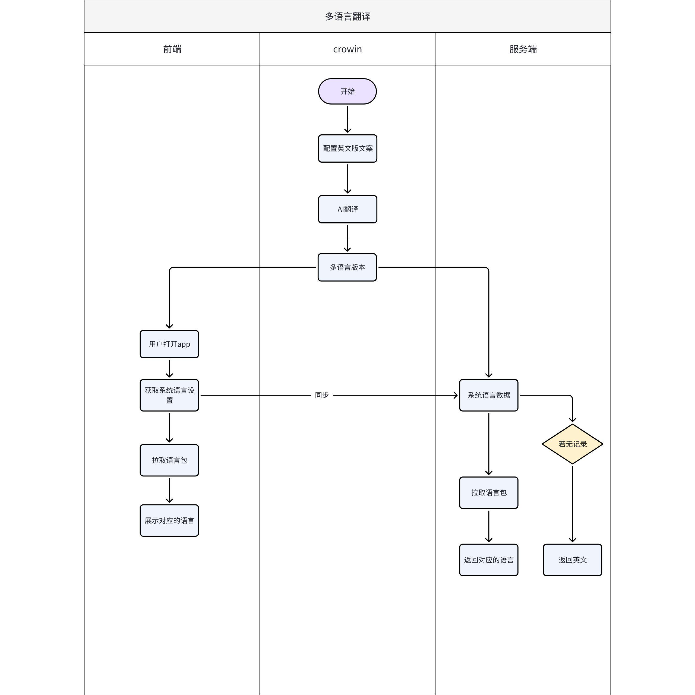

# \[2026-03-09\]AIX+多语言翻译逻辑

**目录**

**\[同步块-无权限下载此内容\]**

# 1. 需求背景

支持aix项目的多语言能力

# 2. 需求概况

|              |                |
|:-------------|:---------------|
| **类型**     | 明细           |
| PM           | @Bing Han 韩冰 |
| 需求方       |                |
| UI/UX        |                |
| 前端         |                |
| 服务端       |                |
| 测试         |                |
| Figma        |                |
| BRD          |                |
| 期望上线时间 |                |
| Meggle       |                |
| 关联域PRD    |                |
| 历史需求PRD  |                |
| 技术方案     |                |
| 支持语言     |                |
| 设备适配     |                |
| 链接         |                |
| 文案review   |                |
| Others       |                |

# 3. 系统交互

第一阶段：服务端不接入crowdin

第二阶段：服务端接入crowdin

# 4. 数据埋点

待定

# 5. 数据分析需求（待定）

# 6. 参考资料
