# AIX WALLET 钱包开户KYC需求V1.0

# 1. 需求变更日志

<table style="width:89%;">
<colgroup>
<col style="width: 10%" />
<col style="width: 10%" />
<col style="width: 45%" />
<col style="width: 22%" />
</colgroup>
<tbody>
<tr>
<td style="text-align: left;">变更时间</td>
<td style="text-align: left;">变更人</td>
<td style="text-align: left;">变更内容</td>
<td style="text-align: left;">备注</td>
</tr>
<tr>
<td style="text-align: left;">2025-11-13</td>
<td style="text-align: left;">@Yifeng Wu 吴忆锋</td>
<td style="text-align: left;">初稿</td>
<td style="text-align: left;"></td>
</tr>
<tr>
<td style="text-align: left;">2026-1-15</td>
<td style="text-align: left;"></td>
<td style="text-align: left;">
主要变更点：

<strong>开户流程（Client Status 判断）</strong>

<strong>调整说明：</strong>

原流程在进入开户时判断 clientStatus = reject 并跳转至「审核失败页」。

由于当前 UX 已在首页对该状态进行拦截，用户无法进入开户流程，因此该状态在开户流程中不再存在。

<strong>Waitlist 处理方式</strong>

<strong>调整说明：</strong>

Waitlist 场景由 <strong>弹窗提示</strong> 调整为 <strong>页面级拦截</strong>；

用户在被识别为 Waitlist 状态时，直接停留在 Waitlist 页面，不允许继续后续流程。

<strong>Identity &amp; POA 授权交互</strong>

<strong>调整说明：</strong>

在进入 Identity / POA 流程前，新增授权弹窗；

用户需明确确认授权后，方可继续对应认证流程。

<strong>Face Loading Page 超时处理</strong>

<strong>调整说明：</strong>

在 Face Loading Page 中，若等待时间超过 <strong>30 秒</strong>仍未收到检测结果；

系统自动跳转至 <strong>Face Loading Failed Page</strong>，并提示用户重新尝试。
</td>
<td style="text-align: left;"></td>
</tr>
<tr>
<td style="text-align: left;">2026-1-20</td>
<td style="text-align: left;"></td>
<td style="text-align: left;">
1、KYC loading page和KYC start page增加弹出挽留弹窗

2、KYC start page去掉绑定手机成功toast提示

@Bowen Li (Eli)@Wei Sun 孙伟@Weiwei Xia 夏威威@Chen Zhao 赵晨
</td>
<td style="text-align: left;"></td>
</tr>
</tbody>
</table>

# 2. 引用资料

|  |  |
|:---|:---|
| **类型** | 链接 |
| PM | @Yifeng Wu 吴忆锋 |
| Figma | https://www.figma.com/design/LxHqrwdNow4AnEZG3Sj9bF/%E2%86%92-AIX-Dev-Handoff-2026-Q1?node-id=7004-13147&t=rPGFbGKF1TjPYkil-0 |
| 翻译文案 | [AIX 翻译文案管理-多维表](https://advancegroup.sg.larksuite.com/wiki/Ah4UwdvDMiY19lkuMkwlHzWPgLd?from=from_copylink) |
| BRD | N/A |
| 技术方案 |  |

# 3. 需求索引

**\[同步块-无权限下载此内容\]**

# 2. 项目概述

2.1 **项目背景**

|  |
|:---|
| 为满足全球用户对一体化、便捷安全数字金融服务的需求，本项目旨在开发一款创新的移动应用。该应用将整合先进的支付与账户管理技术，致力于为用户提供全新的移动端金融管理体验。 |

2.2 **项目目的**

<table style="width:88%;">
<colgroup>
<col style="width: 88%" />
</colgroup>
<tbody>
<tr>
<td>
构建基础​：建立安全、便捷的用户注册登录与账户体系。

核心功能​：实现充值、提现、转账、消费等关键支付功能。

安全保障​：通过多层验证与风控策略，确保用户资产与信息安全。

体验优化​：提供流畅直观的操作流程，提升用户留存。
</td>
</tr>
</tbody>
</table>

2.3 **名词解释**

<table style="width:88%;">
<colgroup>
<col style="width: 88%" />
</colgroup>
<tbody>
<tr>
<td><table style="width:86%;">
<colgroup>
<col style="width: 16%" />
<col style="width: 69%" />
</colgroup>
<tbody>
<tr>
<td style="text-align: left;"><strong>名词/缩写</strong></td>
<td style="text-align: left;"><strong>说明</strong></td>
</tr>
<tr>
<td style="text-align: left;">DeviceID</td>
<td style="text-align: left;">用于唯一识别用户客户端的设备编号。用于实现设备绑定、可信设备判断及风险控制等。</td>
</tr>
<tr>
<td style="text-align: left;">IVS</td>
<td style="text-align: left;">
Identity Verification Service，身份验证服务。

通常指用于进行高强度实名验证的服务（如证件识别、人脸比对等），在注册或敏感操作流程中可能被调用。
</td>
</tr>
<tr>
<td style="text-align: left;">Biometric</td>
<td style="text-align: left;">通过用户的生物特征（如指纹、面部信息）进行身份验证的技术。支持iOS Face ID/Android指纹/人脸</td>
</tr>
<tr>
<td style="text-align: left;">AIX Tag</td>
<td style="text-align: left;">用户在AIX平台上的身份标识符。用于在转账、社交等场景中代替复杂的钱包地址，使用户能够被轻松找到和支付。此标识一旦设置，通常不可更改。</td>
</tr>
<tr>
<td style="text-align: left;">DTC</td>
<td style="text-align: left;">AIX项目的合作伙伴，提供加密钱包、卡片发行和KYC服务的后端平台，支持OpenAPI接口，用于处理交易、认证和账户管理。</td>
</tr>
<tr>
<td style="text-align: left;">AAI</td>
<td style="text-align: left;">第三方身份验证服务提供商，用于KYC流程中的护照上传、活体检测和人脸比对。支持Webhook回调和URL生成。</td>
</tr>
<tr>
<td style="text-align: left;">Master Account</td>
<td style="text-align: left;">DTC侧的账户概念，主账户，可申请API Key管理多个Sub Account。敏感操作需Sub Account授权。</td>
</tr>
<tr>
<td style="text-align: left;">Sub Account</td>
<td style="text-align: left;">DTC侧的账户概念，子账户，由Master创建，用于分离用户资产。KYC需独立完成。</td>
</tr>
<tr>
<td style="text-align: left;">WalletConnect</td>
<td style="text-align: left;">通过Deeplink/QR链接外部钱包充值。自动加白名单、交易报备，直接到账。</td>
</tr>
<tr>
<td style="text-align: left;">PIN</td>
<td style="text-align: left;">Personal Identification Number，卡片PIN码，用于线下交易。4位数字，支持Set/Change/Reset。</td>
</tr>
<tr>
<td style="text-align: left;">稳定币类型</td>
<td style="text-align: left;">稳定币类型USDC, USDT, FDUSD, WUSD，支持在BASE/BSC/ETHEREUM/SOLANA网络充值/转账/兑换。</td>
</tr>
<tr>
<td style="text-align: left;">区块链网络</td>
<td style="text-align: left;">支持的区块链网络，各网络币种不同（e.g., BASE: USDC）。包括：BASE, BSC, ETHEREUM, SOLANA</td>
</tr>
<tr>
<td style="text-align: left;">Global Travel Rule</td>
<td style="text-align: left;">全球旅行规则，合规要求，仅支持如Binance的白名单钱包充值。自动报备，无需声明。</td>
</tr>
</tbody>
</table>

同步自文档: <a href="https://advancegroup.sg.larksuite.com/docx/Sy4TdCxUFoCEWbxdcoQlBgzhgfh#WEeGd3rFjsp8Kjb59vLlbcdog1n">https://advancegroup.sg.larksuite.com/docx/Sy4TdCxUFoCEWbxdcoQlBgzhgfh#WEeGd3rFjsp8Kjb59vLlbcdog1n</a>
</td>
</tr>
</tbody>
</table>

# 3. 项目计划

[AIX项目管理表](https://advancegroup.sg.larksuite.com/sheets/RFR2sp4VGhbXVDtlnjTlwVsYgAb?from=from_copylink&sheet=z4hjo9)

# 4. 功能结构

# 5. 国家线

|        |        |        |
|:------:|:------:|:------:|
| **VN** | **PH** | **AU** |
|   ✅   |   ✅   |   ✅   |

# 6. 统一规则

6.1 **账户结构说明**

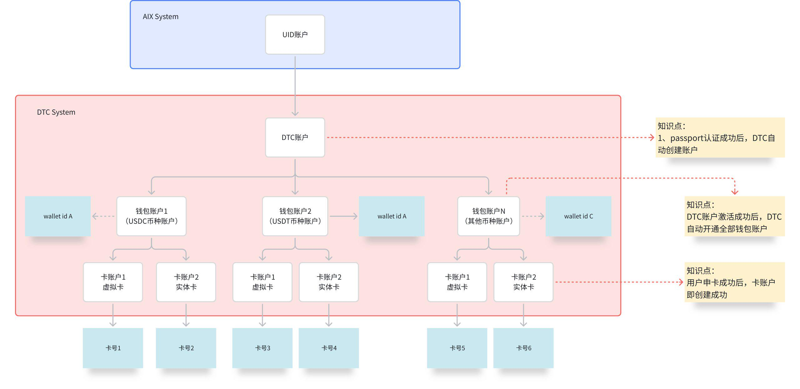

6.2 **KYC状态机**

**注：申请单自创建后即长期有效。**一旦用户的OCR、Face等核心认证成功通过，其在DTC侧认证结果将永久有效，不会因时间推移而失效。

# 7. 需求描述

<table style="width:88%;">
<colgroup>
<col style="width: 88%" />
</colgroup>
<tbody>
<tr>
<td style="text-align: left;">
知识点

<strong>1、AAI接口耗时参考：</strong>

Document Verification：异步接口，整个流程耗时（包含AAI 前端拍照，OCR和假证）p90=20-25s; p95=25-35s; p99=35-40s；

Face Comparison：同步结果，接口耗时226ms~348ms

POA：异步接口，接口耗时数分钟

<strong>2、passport、face、poa状态说明</strong>

只要passport、face认证通过，不会再变为失败状态。

kyc人工审核如果ocr的name等有问题，人工审核直接改了，不会影响状态；但如果是id有问题，直接kyc reject。passport、face认证状态也不会变。
</td>
</tr>
</tbody>
</table>

7.1 **开户业务流程**

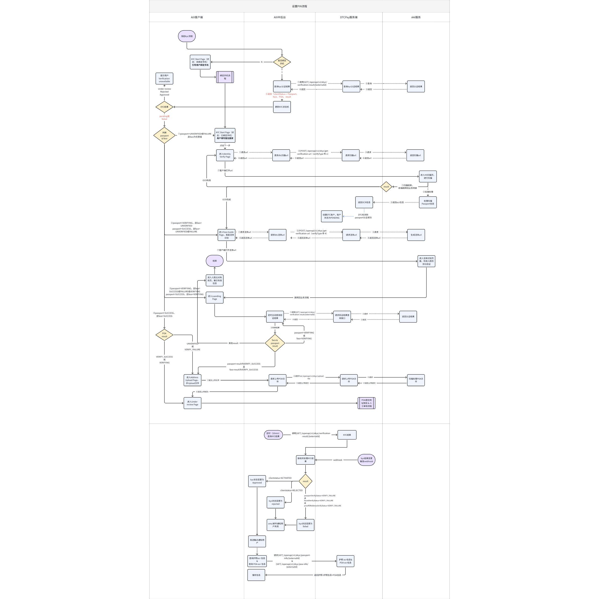

7.2 **开户页面逻辑**

7.2.1 **页面概览**

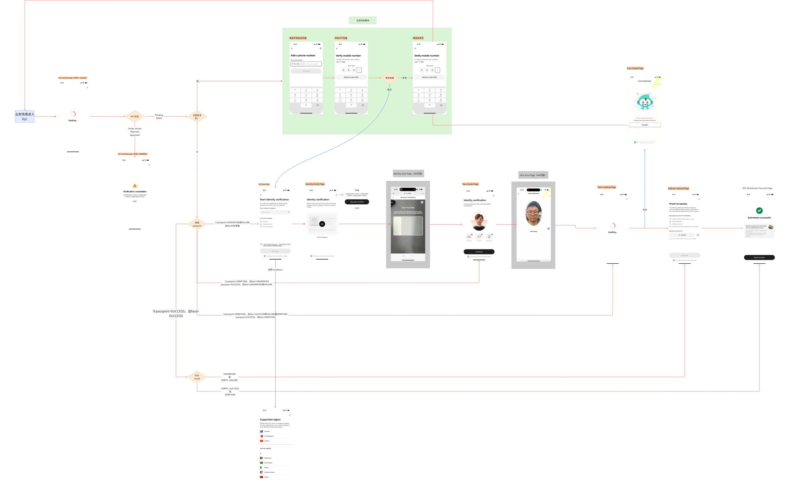

7.2.2 **KYC Loading Page**

<table style="width:89%;">
<colgroup>
<col style="width: 30%" />
<col style="width: 58%" />
</colgroup>
<tbody>
<tr>
<td style="text-align: left;">UX</td>
<td style="text-align: left;">Description</td>
</tr>
<tr>
<td rowspan="4" style="text-align: center;"></td>
<td rowspan="4" style="text-align: left;">
1. <strong>页面规则</strong>

状态1：用户进入默认为loading状态；

状态2：当后端返回kyc状态机为【Under review / Rejected / Approved】或用户在waitlist中（仅限来源渠道是APP），那么展示状态2内容

2. <strong>关闭按钮</strong>

点击弹出挽留弹窗

Title：Confirm Exit?

Content: Are you sure you want to leave before verification is complete?

Button:

Stay and continue: 点击后关闭弹窗，停留在当前页；

Leave: 点击后关闭弹窗，返回到业务流程入口页；

3. <strong>状态说明</strong>

3.1 <strong>状态1</strong>

固定页面文案：loading...

3.2 <strong>状态2</strong>

<strong>titile：</strong>Verification unavailable

<strong>sutitle：</strong>We’re having trouble loading your verification status right now.Please go back and refresh to see the latest update.

Back按钮：点击返回业务流程发起页面

4. <strong>页面流转</strong>

若网络异常，那么进入<a href="https://advancegroup.sg.larksuite.com/wiki/Uwyfwkc2jixSBukf2YJllpjsgRd#share-BTWAdOz3MosdsnxkZkElb5Sogig">Network Error Page</a>

若系统异常，那么进入<a href="https://advancegroup.sg.larksuite.com/wiki/Uwyfwkc2jixSBukf2YJllpjsgRd#share-Tqwmdp5pdoc6M8xDFs3lVRkWgQd">Server Error Page</a>

网络超时/异常： 若等待超过30秒仍未收到结果，那么进入<a href="https://advancegroup.sg.larksuite.com/wiki/ISjLwCKi5itjNXkpCLllQD5Qgle#share-IU9ed4cUmoIlmzxHjr6l9sK8gdg">Loading Failed Page</a>

若后端返回kyc状态机为【Under review / Rejected / Approved】，那么KYC Loading Page展示状态2内容；

若后端返回kyc状态机为【Pending / failed】那么根据流程判断进入kyc流程页面；
</td>
</tr>
<tr>
</tr>
<tr>
</tr>
<tr>
</tr>
</tbody>
</table>

7.2.3 **KYC Start Page**

<table style="width:89%;">
<colgroup>
<col style="width: 30%" />
<col style="width: 58%" />
</colgroup>
<tbody>
<tr>
<td style="text-align: left;">UX</td>
<td style="text-align: left;">Description</td>
</tr>
<tr>
<td rowspan="4" style="text-align: center;">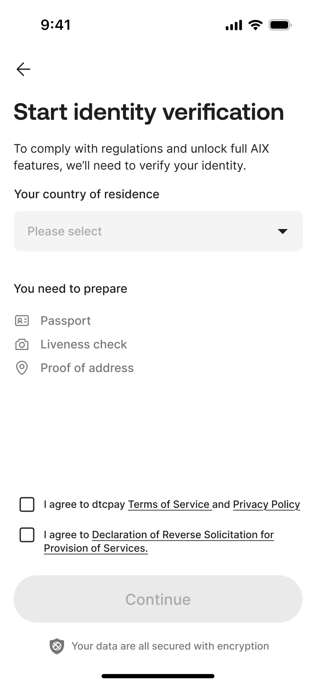</td>
<td rowspan="4" style="text-align: left;">
1. <strong>页面规则</strong>

用户发起 KYC 流程时，若系统检测到手机号已绑定，则直接进入 <strong>KYC Start Page</strong>，不展示额外提示。

2. <strong>返回按钮</strong>

点击弹出挽留弹窗

Title：Confirm Exit?

Content: Are you sure you want to leave before verification is complete?

Button:

Stay and continue: 点击后关闭弹窗，停留在当前页；

Leave: 点击后关闭弹窗，返回到业务流程入口页；

3. <strong>标题&amp;副标题</strong>

title：Start identity verification

subtitle：To comply with regulations and unlock full AIX features, we’ll need to verify your identity.

4. <strong>居住国家、地区</strong>

点击进入<a href="https://advancegroup.sg.larksuite.com/wiki/ISjLwCKi5itjNXkpCLllQD5Qgle#share-FDshde5broos87xsay8ldHkYgbb">Select Residence Country Page</a>，选择国家后返回当前页面；

默认为当前IP检测国家，若检测不到，默认为SG。

5. <strong>协议</strong>

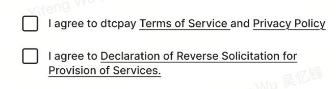

默认都不勾选；

快照保存：​ 当用户本次提交成功后，系统生成不可更改的快照​，并与用户账户绑定存储。

Terms of service and Privacy Policy：因为无协议内容，只需要保存用户同意并提交的时间即可；

Declaration of reverse....：需要保存协议内容，以及用户同意并提交的时间；

协议Terms of service and Privacy Policy：单击可勾选，无需强制阅读；

点击Terms of service：进入第三方链接https://dtcpay.com/terms-of-business 
点击Privacy Policy：进入第三方链接https://dtcpay.com/privacy-policy

协议内容仅需英文，无需多语言；

协议Declaration of reverse....：单击后需强制阅读，同意后才能勾选；

<blockquote>

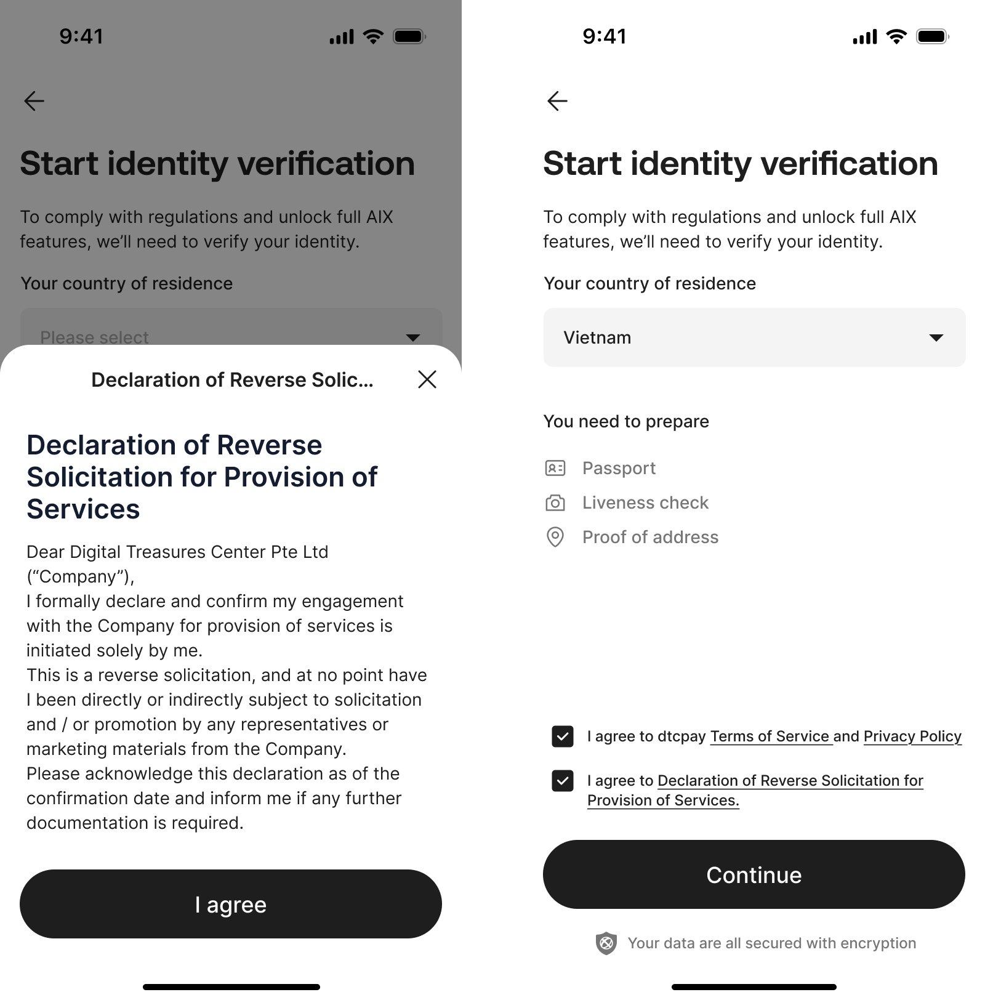

</blockquote>

点击I agree，即可勾选同意，点击关闭，即不同意，无需勾选；（只要弹窗就可以点击a agree）

协议内容仅需英文，无需多语言；

协议链接：<a href="https://advancegroup.sg.larksuite.com/drive/folder/KcRtfsWfvl3BoMd48W1lbgcugcc">https://advancegroup.sg.larksuite.com/drive/folder/KcRtfsWfvl3BoMd48W1lbgcugcc</a>

Title: <strong>Declaration of Reverse Solicitation for Provision of Services and Terms of Service</strong>

<blockquote>

Body:

Dear Digital Treasures Center Pte Ltd (“Company”),

I formally declare and confirm my engagement with the Company for provision of services is initiated solely by me.

This is a reverse solicitation, and at no point have I been directly or indirectly subject to solicitation and / or promotion by any representatives or marketing materials from the Company.

Please acknowledge this declaration as of the confirmation date and inform me if any further documentation is required.

</blockquote>

若后端报错，无法获取协议则toast提示：Something went wrong. Please try again later

6. <strong>立即认证按钮</strong>

协议未勾选时，按钮灰色不可点击。协议勾选后，按钮高亮可点击。

点击后，后端判断若属于支持国家（见<a href="https://advancegroup.sg.larksuite.com/wiki/IeKMw357ziJVjFkGTullgz1UgLe?from=from_copylink">Countries and Regions list</a>），则进入下一级页面Identity Verify Page

位置：Type列表为Phase 1；

特殊说明：330版本支持国家为ph+sg

点击后，后端判断若不属于支持国家，则弹窗拦截：

位置：Type列表为phase 2 -waitlist；

点击Join waitlist，进入Waitlist Page

点击Select other country，进入Select Residence Country Page
</td>
</tr>
<tr>
</tr>
<tr>
</tr>
<tr>
</tr>
</tbody>
</table>

7.2.3.1 **Select Residence Country Page**

<table style="width:89%;">
<colgroup>
<col style="width: 30%" />
<col style="width: 58%" />
</colgroup>
<tbody>
<tr>
<td style="text-align: left;">UX</td>
<td style="text-align: left;">Description</td>
</tr>
<tr>
<td rowspan="4" style="text-align: center;">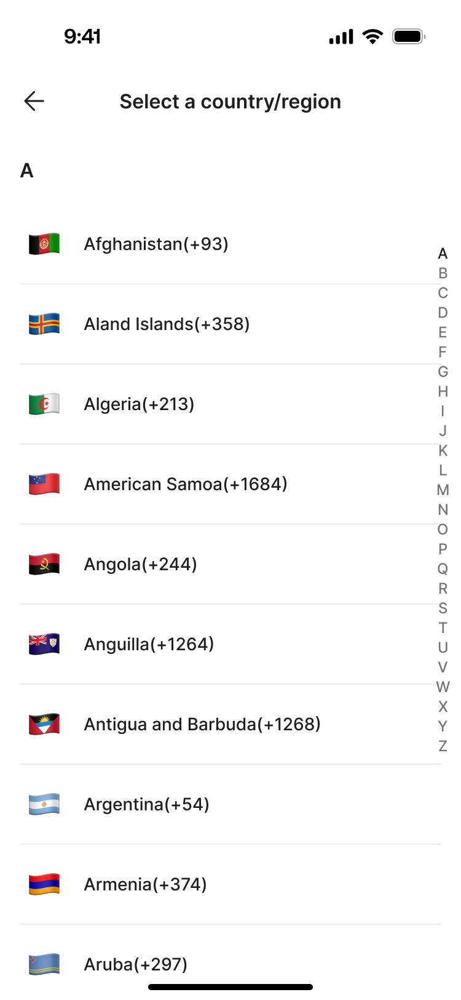</td>
<td rowspan="4" style="text-align: left;">
1. <strong>页面规则</strong>

显示为下拉菜单或选择器，默认为当前IP检测国家，若检测不到，默认为SG，支持搜索和列表显示。

点击打开国家列表，展示全部国家。

用户可以选择任意一国家，选择后自动返回上一级页面；

列表排序：所有国家/地区名称按照首字母进行排序。

展示支持国家+不可支持国家，禁止国家则隐藏；见【<a href="https://advancegroup.sg.larksuite.com/wiki/IeKMw357ziJVjFkGTullgz1UgLe?from=from_copylink">Countries and Regions list</a>】

<strong>特殊处理：为了支持3.6内测版本生产验证，Phase 1 国家全部临时处理为phase 2-waitlist，除了PH、AU、VN、SG保持Phase 1</strong>

<blockquote>

</blockquote>

Type列表为Phase 1：表示支持国家

Type列表为phase 2 -waitlist：表示不可支持国家

Type列表为Forbiden：表示禁止国家

2. <strong>关闭按钮</strong>

点击关闭，返回上一级页面
</td>
</tr>
<tr>
</tr>
<tr>
</tr>
<tr>
</tr>
</tbody>
</table>

7.2.3.2 **Waitlist Page**

<table style="width:89%;">
<colgroup>
<col style="width: 30%" />
<col style="width: 58%" />
</colgroup>
<tbody>
<tr>
<td style="text-align: left;">UX</td>
<td style="text-align: left;">Description</td>
</tr>
<tr>
<td rowspan="4" style="text-align: center;"></td>
<td rowspan="4" style="text-align: left;">
1. <strong>关闭按钮</strong>

点击关闭按钮，返回上一级页面

2. <strong>email输入框</strong>

输入规则：

最长限制为103个字符，超出不可输入；

实时格式校验：

当格式不符合邮箱规范（如：缺少@符号、域名不完整）时，应提示：Email format is invalid

当输入框为空时，应提示：Email should not be empty

3. <strong>Join waitlist按钮</strong>

email输入框时，按钮灰色不可点击。输入后，按钮高亮可点击。

若网络异常，点击后，toast提示：Please check your internet connection and try again.

若后端服务器错误，点击后，toast提示：Something went wrong. Please try again later

无异常，点击后：

前端返回到流程入口页，且用户无法申请kyc；

后端处理：

userid维度加入到waitlist；

数据落库：用户对应的邮箱、国家、来源（外部投放、APP）、提交时间、设备指纹ID等信息需要落库落表存储，并推送至数仓。以便运营同学分析。
</td>
</tr>
<tr>
</tr>
<tr>
</tr>
<tr>
</tr>
</tbody>
</table>

7.2.4 **Identity Verify Page**

<table style="width:89%;">
<colgroup>
<col style="width: 30%" />
<col style="width: 58%" />
</colgroup>
<tbody>
<tr>
<td style="text-align: left;">UX</td>
<td style="text-align: left;">Description</td>
</tr>
<tr>
<td rowspan="4" style="text-align: center;">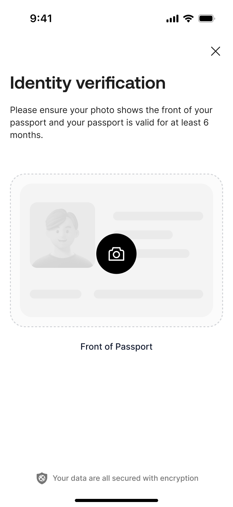</td>
<td rowspan="4" style="text-align: left;">
1. <strong>关闭按钮</strong>

点击弹出挽留弹窗

Title：Confirm Exit?

Content: Are you sure you want to leave before verification is complete?

Button:

Stay and continue: 点击后关闭弹窗，停留在当前页；

Leave: 点击后关闭弹窗，返回到业务流程入口页；

2. <strong>标题与副标题</strong>

固定文案

3. <strong>上传按钮</strong>

点击相机，判断是否已进行相机授权：

若是，则进入AAI的H5页面进行扫描护照，见 Identity Scan Page（AAI页面）

若dtc返回01009错误，则toast提示：Mobile number already exists.

若dtc返回01005错误，则toast提示：The email address is in use.

若否，则弹窗要求授权

<blockquote>

</blockquote>

点击not now，关闭弹窗，停留在当前页面；

点击Allow access，判断：

若是未授权/已拒绝，那么弹出系统弹窗，询问授权，授权后，则进入AAI的H5页面进行扫描护照，见 Identity Scan Page（AAI页面）

若是永久拒绝，则APP弹窗，要求授权，点击open settings，跳转系统设置权限页面；
</td>
</tr>
<tr>
</tr>
<tr>
</tr>
<tr>
</tr>
</tbody>
</table>

7.2.5 **Identity Scan Page（AAI页面）**

<table style="width:89%;">
<colgroup>
<col style="width: 30%" />
<col style="width: 58%" />
</colgroup>
<tbody>
<tr>
<td style="text-align: left;">UX</td>
<td style="text-align: left;">Description</td>
</tr>
<tr>
<td rowspan="4" style="text-align: center;"></td>
<td rowspan="4" style="text-align: left;">
此页面调用外部H5页进行护照扫描：

扫描成功：跳转至Face Guide Page

扫描失败：跳转至Identity Verify Page
</td>
</tr>
<tr>
</tr>
<tr>
</tr>
<tr>
</tr>
</tbody>
</table>

7.2.6 **Face Guide Page**

<table style="width:89%;">
<colgroup>
<col style="width: 30%" />
<col style="width: 58%" />
</colgroup>
<tbody>
<tr>
<td style="text-align: left;">UX</td>
<td style="text-align: left;">Description</td>
</tr>
<tr>
<td rowspan="4" style="text-align: center;"></td>
<td rowspan="4" style="text-align: left;">
1. <strong>页面规则</strong>

本页面需集成人脸验证的失败次数限制规则。当用户累计失败次数触发系统锁定条件时，本页面将拦截用户发起新的验证流程。具体锁定规则见 Face Failed Page 的说明。

2. <strong>关闭按钮</strong>

点击弹出挽留弹窗

Title：Confirm Exit?

Content: Are you sure you want to leave before verification is complete?

Button:

Stay and continue: 点击后关闭弹窗，停留在当前页；

Leave: 点击后关闭弹窗，返回到业务流程入口页；

3. <strong>安全限制规则</strong>

<blockquote>

系统需基于用户账户维度，需执行以下限制：

</blockquote>

规则一：24小时内累计失败 5次，该面部验证功能将被系统锁定 20分钟。

规则二：24小时内累计失败 10次，该面部验证功能将被系统锁定 24小时。

规则三：24小时内，接口层面连续发起20次则锁20min，验证成功后清零重新计算。

<strong>计数与清零：</strong>

规则一和规则二的累计失败判断：DTC返回face result=fail才算失败，其他结果不算失败（其他结果不计费）

清零规则：人脸验证通过后则清零。

4. <strong>Continue按钮</strong>

未锁定状态：用户点击后：

AIX后端 调用 passport get result 接口，获取 <strong>country</strong>（passport 国籍）

country 参数处理规则：

若 passport get result的参数country 存在值 → 直接使用该值；

若 passport get result的参数country 为空 → 使用默认值 sg。

aix后端传给前端调参数country，前端调用 AAI 活体 H5 页面，并在请求中传入参数<strong>country</strong>：

若网络异常，点击后，前端toast提示：Please check your internet connection and try again.

若后端服务器错误，点击后，前端toast提示：Something went wrong. Please try again later

锁定状态：用户失败次数过多，后端返回被锁定，点击按钮弹窗拦截：

<blockquote>

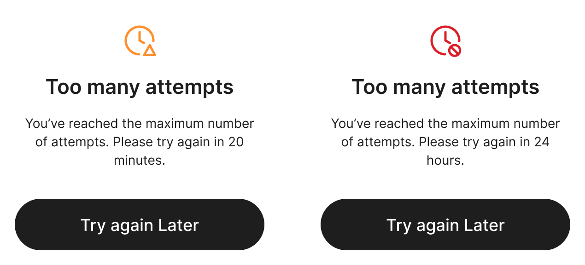

</blockquote>

Title：Too many attempts

Content：You've reached the maximum attempts.Please try again in [time].

{time}：显示剩余时间；若大于1小时，则以小时为单位，若小于1小时，则以分钟为单位；

Try again Later按钮：点击按钮，返回业务流程入口页
</td>
</tr>
<tr>
</tr>
<tr>
</tr>
<tr>
</tr>
</tbody>
</table>

7.2.7 **Face Scan Page（AAI页面）**

<table style="width:88%;">
<colgroup>
<col style="width: 88%" />
</colgroup>
<tbody>
<tr>
<td style="text-align: left;">
知识点：

AAI的重试限制：AAI侧同一个signatureId 最多重试3次，3次后会终止采集。会给调用方返回最新采集到的图片。调用方 在需要重来的时候， 发起generate-url 重新生成一个signatureId 即可
</td>
</tr>
</tbody>
</table>

<table style="width:89%;">
<colgroup>
<col style="width: 30%" />
<col style="width: 58%" />
</colgroup>
<tbody>
<tr>
<td style="text-align: left;">UX</td>
<td style="text-align: left;">Description</td>
</tr>
<tr>
<td rowspan="4" style="text-align: center;"></td>
<td rowspan="4" style="text-align: left;">
此页面调用外部H5页进行活体采集：

采集结束直接跳转至Face Loading Page
</td>
</tr>
<tr>
</tr>
<tr>
</tr>
<tr>
</tr>
</tbody>
</table>

7.2.8 **Face Loading Page**

<table style="width:89%;">
<colgroup>
<col style="width: 30%" />
<col style="width: 58%" />
</colgroup>
<tbody>
<tr>
<td style="text-align: left;">UX</td>
<td style="text-align: left;">Description</td>
</tr>
<tr>
<td rowspan="4" style="text-align: center;"></td>
<td rowspan="4" style="text-align: left;">
1. <strong>页面规则</strong>

当AAI完成活体采集后，人脸比对中时，即跳转到该页面；

状态1：用户进入默认为loading状态；

状态2：当后端返回kyc状态机为【Under review / Rejected / Approved】，那么展示状态2内容

2. <strong>返回按钮</strong>

点击弹出挽留弹窗

Title：Confirm Exit?

Content: Are you sure you want to leave before verification is complete?

Button:

Stay and continue: 点击后关闭弹窗，停留在当前页；

Leave: 点击后关闭弹窗，返回到业务流程入口页；

3. <strong>页面流转</strong>

系统在后台持续轮询等待后端验证服务返回最终结果，并根据结果自动导航至相应页面：

验证成功： 自动跳转至 Address Upload Page。

后端返回验证失败： 自动跳转至 Face Failed Page。

若网络异常，那么进入<a href="https://advancegroup.sg.larksuite.com/wiki/Uwyfwkc2jixSBukf2YJllpjsgRd#share-BTWAdOz3MosdsnxkZkElb5Sogig">Network Error Page</a>

若系统异常，那么进入<a href="https://advancegroup.sg.larksuite.com/wiki/Uwyfwkc2jixSBukf2YJllpjsgRd#share-Tqwmdp5pdoc6M8xDFs3lVRkWgQd">Server Error Page</a>

若等待超过30秒仍未收到结果，进入<a href="https://advancegroup.sg.larksuite.com/wiki/ISjLwCKi5itjNXkpCLllQD5Qgle#share-IU9ed4cUmoIlmzxHjr6l9sK8gdg">Loading Failed Page</a>
</td>
</tr>
<tr>
</tr>
<tr>
</tr>
<tr>
</tr>
</tbody>
</table>

7.2.9 **Loading Failed Page**

<table style="width:89%;">
<colgroup>
<col style="width: 30%" />
<col style="width: 58%" />
</colgroup>
<tbody>
<tr>
<td style="text-align: left;">UX</td>
<td style="text-align: left;">Description</td>
</tr>
<tr>
<td rowspan="4" style="text-align: center;">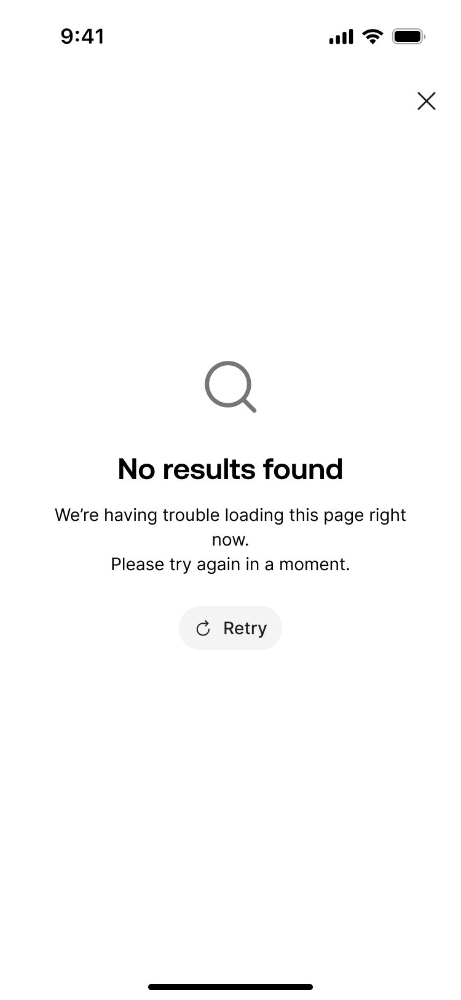</td>
<td rowspan="4" style="text-align: left;">
1. <strong>页面规则</strong>

Face Loading Page若等待超过30秒仍未收到结果，进入本页面。

2. <strong>返回按钮</strong>

点击弹出挽留弹窗

Title：Confirm Exit?

Content: Are you sure you want to leave before verification is complete?

Button:

Stay and continue: 点击后关闭弹窗，停留在当前页；

Leave: 点击后关闭弹窗，返回到业务流程入口页；

3. <strong>Retry按钮</strong>

点击Retry按钮，点击后，进入Face Loading Page，重新提交。
</td>
</tr>
<tr>
</tr>
<tr>
</tr>
<tr>
</tr>
</tbody>
</table>

7.2.10 **Face Failed Page**

<table style="width:89%;">
<colgroup>
<col style="width: 30%" />
<col style="width: 58%" />
</colgroup>
<tbody>
<tr>
<td style="text-align: left;">UX</td>
<td style="text-align: left;">Description</td>
</tr>
<tr>
<td rowspan="4" style="text-align: center;">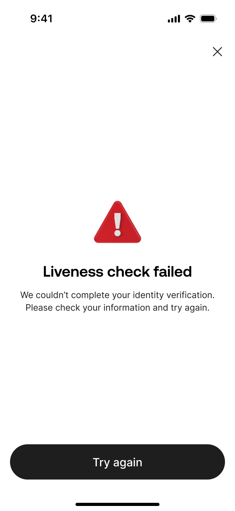</td>
<td rowspan="4" style="text-align: left;">
1. <strong>页面规则</strong>

当AAI完成活体采集后，人脸比对失败，即跳转到该页面；

2. <strong>关闭按钮</strong>

点击按钮，返回业务流程入口页

3. <strong>页面文案</strong>

固定主文案： 固定显示 “Verification failed.”。

动态原因文案：

<del>后端返回face result为空值，那么固定展示文案：Liveness check failed. Please try again.</del>

后端返回passport失败：那么展示<a href="https://advancegroup.sg.larksuite.com/wiki/ISjLwCKi5itjNXkpCLllQD5Qgle#share-HXrzdfM6aoOOnsxJdUils4XWgMe">Document Verification错误码</a>映射中的映射前端提示文案

后端返回face result为FAIL / EXPIRED / incomplete：那么展示<a href="https://advancegroup.sg.larksuite.com/wiki/ISjLwCKi5itjNXkpCLllQD5Qgle#share-P57KdHhAaoIkqqxiTr6lHCFhgPh">Face Comparison API错误码</a>映射中的映射前端提示文案

两者均失败，优先展示passport失败原因

后端返回POA失败：那么展示<a href="https://advancegroup.sg.larksuite.com/wiki/ISjLwCKi5itjNXkpCLllQD5Qgle#share-KgNydZw2zohnDLxTnCMl1MDrgPg">POA error code</a>映射中的映射前端提示文案

兜底文案：The verification was not successful. Please review your information and try again.

4. <strong>Try again按钮</strong>

正常状态：点击该按钮将重新触发KYC流程。系统会根据用户当前最新的认证结果状态，自动判断并跳转至相应的流程起始页。

<del>锁定状态：当账户触发安全锁时，点击按钮弹窗提示：</del>

<del>文案：For your account security, facial verification is temporarily unavailable. Please try again after [解锁时间]。</del>

<del>确认按钮：点击直接返回至流程入口页。</del>
</td>
</tr>
<tr>
</tr>
<tr>
</tr>
<tr>
</tr>
</tbody>
</table>

7.2.11 **Address Upload Page**

<table style="width:88%;">
<colgroup>
<col style="width: 88%" />
</colgroup>
<tbody>
<tr>
<td style="text-align: left;">
AAI：只有机审，负责提取 POA 资料内容。1. 验证文档的真实性，以确保提交的文档为原件。 这里包括验证是否存在篡改。2. 验证文档的真实性，系统默认验证文档的有效期（仅接受过去三个月内签发的文档）

DTC：采用机审+人审；

机审环节：利用 OCR 提取 POA 国家信息，自动核验其与用户填报的居住国是否匹配。并且验证验证申请国家是否属于白名单内；

人审环节：负责姓名一致性核对、文件真伪鉴别及其他复杂场景的综合研判。
</td>
</tr>
</tbody>
</table>

<table style="width:89%;">
<colgroup>
<col style="width: 30%" />
<col style="width: 58%" />
</colgroup>
<tbody>
<tr>
<td style="text-align: left;">UX</td>
<td style="text-align: left;">Description</td>
</tr>
<tr>
<td rowspan="4" style="text-align: center;">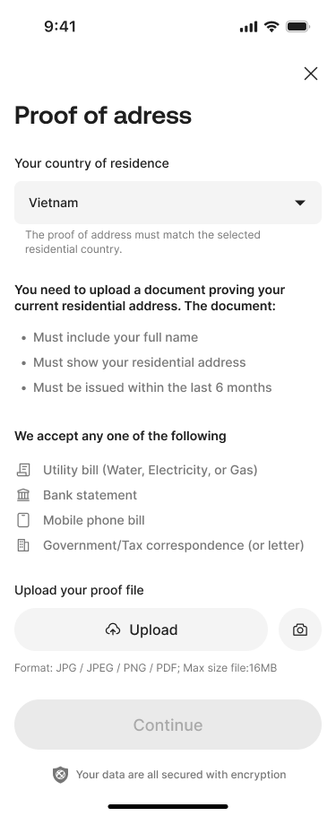</td>
<td rowspan="4" style="text-align: left;">
1. <strong>关闭按钮</strong>

点击弹出挽留弹窗

Title：Confirm Exit?

Content: Are you sure you want to leave before verification is complete?

Button:

Stay and continue: 点击后关闭弹窗，停留在当前页；

Leave: 点击后关闭弹窗，返回到业务流程入口页；

2. <strong>标题&amp;副标题</strong>

固定文案

3. <strong>Residence居住国家</strong>

回填kyc流程中已选择的居住国家，点击进入<a href="https://advancegroup.sg.larksuite.com/wiki/ISjLwCKi5itjNXkpCLllQD5Qgle#share-FDshde5broos87xsay8ldHkYgbb">Select Residence Country Page</a>，选择国家后返回当前页面；

4. <strong>Upload your proof file</strong>

4.1 <strong>状态1：未上传</strong>

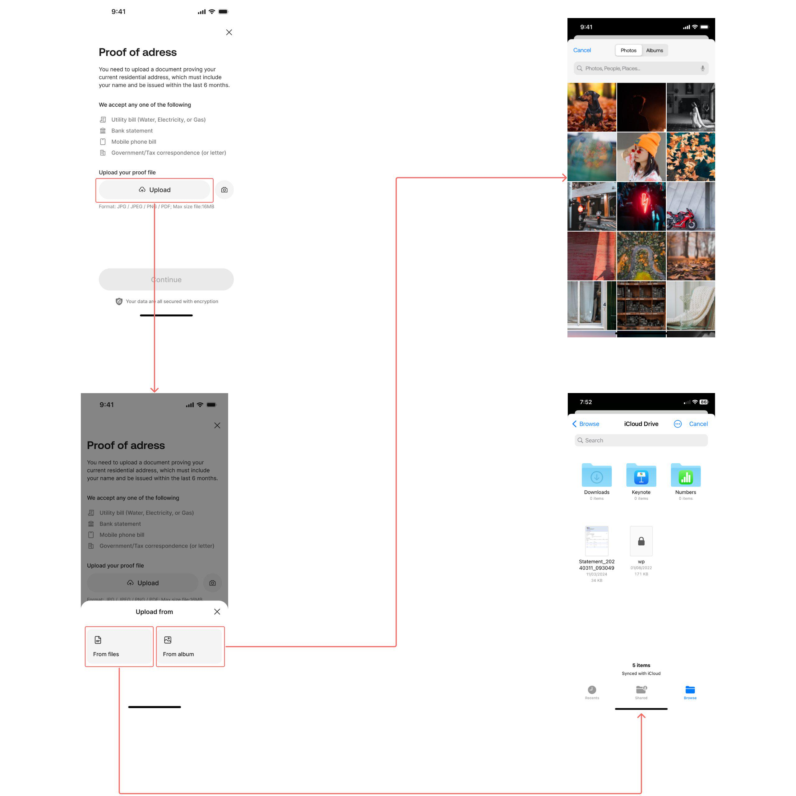

限制：

可接受格式: JPG, JPEG, PNG, PDF。

单个文件大小上限: 16 MB。

只能上传一份文件。

异常校验：

上传格式不符合，Toast提示： Unsupported file type. Please upload a JPG, JPEG, PNG, or PDF file.

上传大小超出：Toast提示：File size exceeds the 16MB limit. Please choose a smaller file.

上传服务器报错，Toast提示：Server busy. Upload failed. Please try again.

4.2 <strong>状态2：上传中</strong>

<blockquote>

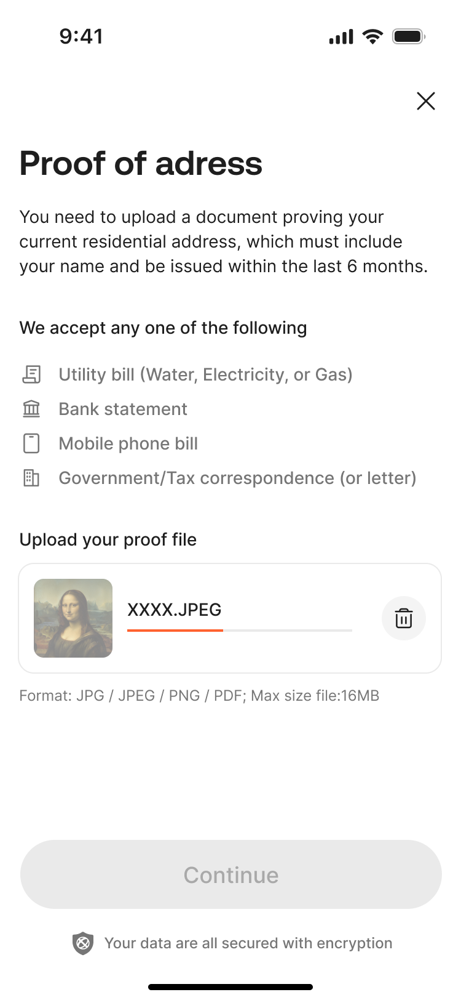

</blockquote>

显示上传中进度；

点击删除按钮取消上传；

4.3 <strong>状态3：已上传</strong>

<blockquote>

</blockquote>

点击删除按钮，删除已上传的文件；

点击文件，可打开预览图片或pdf；

5. <strong>continue按钮</strong>

初始状态为禁用。仅当用户成功上传文件后，按钮变为可点击状态

点击后，系统将文件提交至后端接口进行处理。

点击后，后端判断若属于支持国家（见<a href="https://advancegroup.sg.larksuite.com/wiki/IeKMw357ziJVjFkGTullgz1UgLe?from=from_copylink">Countries and Regions list</a>），则进入下一级页面Identity Verify Page

位置：Type列表为Phase 1；（<strong>特殊处理：为了支持3.6内测版本生产验证，Phase 1 国家全部临时处理为phase 2-waitlist，除了PH、AU、VN、SG保持Phase 1</strong>）

点击后，后端判断若不属于支持国家，则弹窗拦截：

位置：Type列表为phase 2 -waitlist；

<blockquote>

</blockquote>

点击Join waitlist，进入Waitlist Page

点击Select other country，进入Select Residence Country Page

后端返回提交成功，前端跳转至 KYC Submission Success Page

若无网络/超时，Toast提示：Please check your internet connection and try again.

若服务器错误，Toast提示：Something went wrong. Please try again later.
</td>
</tr>
<tr>
</tr>
<tr>
</tr>
<tr>
</tr>
</tbody>
</table>

7.2.12 **KYC Submission Success Page**

<table style="width:89%;">
<colgroup>
<col style="width: 30%" />
<col style="width: 58%" />
</colgroup>
<tbody>
<tr>
<td style="text-align: left;">UX</td>
<td style="text-align: left;">Description</td>
</tr>
<tr>
<td rowspan="4" style="text-align: center;"></td>
<td rowspan="4" style="text-align: left;">
1. <strong>页面内容</strong>

固定文案

2. <strong>返回首页按钮</strong>

用户点击后，关闭当前KYC流程，并返回业务流程入口页
</td>
</tr>
<tr>
</tr>
<tr>
</tr>
<tr>
</tr>
</tbody>
</table>

# 8. 外部接口依赖

[Master sub account 设计方案](https://dtcpayoa.sg.larksuite.com/docx/TIp8dkHUgoIeQ3xRSMcl1aIQgce)

8.1 **查询KYC结果的接口**

8.1.1 **接口响应**

<table style="width:89%;">
<colgroup>
<col style="width: 30%" />
<col style="width: 22%" />
<col style="width: 35%" />
</colgroup>
<tbody>
<tr>
<td style="text-align: center;">变量名</td>
<td style="text-align: center;">字段名</td>
<td style="text-align: center;">说明</td>
</tr>
<tr>
<td style="text-align: left;">externalId</td>
<td style="text-align: center;">外部ID</td>
<td style="text-align: left;"></td>
</tr>
<tr>
<td style="text-align: left;">dtcId</td>
<td style="text-align: center;">dtcId</td>
<td style="text-align: left;"></td>
</tr>
<tr>
<td style="text-align: left;">clientStatus</td>
<td style="text-align: center;">账户状态</td>
<td style="text-align: left;">即钱包账户状态</td>
</tr>
<tr>
<td style="text-align: left;">passportVerifyStatus</td>
<td style="text-align: center;">passport审核状态</td>
<td style="text-align: left;">
枚举值：

UNVERIFIED

VERIFYING

VERIFY_SUCCESS

VERIFY_FAILURE
</td>
</tr>
<tr>
<td style="text-align: left;">faceIdVerifyStatus</td>
<td style="text-align: center;">人脸验证状态</td>
<td style="text-align: left;">
枚举值：

UNVERIFIED

VERIFYING

VERIFY_SUCCESS

VERIFY_FAILURE
</td>
</tr>
<tr>
<td style="text-align: left;">proofOfAddressVerifyStatus</td>
<td style="text-align: center;">POA审核状态</td>
<td style="text-align: left;">
枚举值：

UNVERIFIED

VERIFYING

VERIFY_SUCCESS

VERIFY_FAILURE
</td>
</tr>
</tbody>
</table>

8.2 **KYC webhook接口**

8.2.1 **接口响应**

<table style="width:89%;">
<colgroup>
<col style="width: 30%" />
<col style="width: 22%" />
<col style="width: 35%" />
</colgroup>
<tbody>
<tr>
<td style="text-align: center;">变量名</td>
<td style="text-align: center;">字段名</td>
<td style="text-align: center;">说明</td>
</tr>
<tr>
<td style="text-align: left;">clientid</td>
<td style="text-align: left;">（DTC）客户ID</td>
<td style="text-align: left;"></td>
</tr>
<tr>
<td style="text-align: left;">externalId</td>
<td style="text-align: center;">外部ID</td>
<td style="text-align: left;"></td>
</tr>
<tr>
<td style="text-align: left;">clientStatus</td>
<td style="text-align: center;">账户状态</td>
<td style="text-align: left;">即钱包账户状态</td>
</tr>
<tr>
<td style="text-align: left;">nationality</td>
<td style="text-align: center;">国籍</td>
<td style="text-align: left;"></td>
</tr>
<tr>
<td style="text-align: left;">countryOfResidence</td>
<td style="text-align: center;">居住国家</td>
<td style="text-align: left;"></td>
</tr>
<tr>
<td style="text-align: left;">passportVerifyStatus</td>
<td style="text-align: center;">passport审核状态</td>
<td style="text-align: left;">
枚举值：

UNVERIFIED

VERIFYING

VERIFY_SUCCESS

VERIFY_FAILURE
</td>
</tr>
<tr>
<td style="text-align: left;">passportVerifyCode</td>
<td style="text-align: center;">passport审核错误码</td>
<td style="text-align: left;">见9.1章节</td>
</tr>
<tr>
<td style="text-align: left;">faceIdVerifyStatus</td>
<td style="text-align: center;">人脸验证状态</td>
<td style="text-align: left;">
枚举值：

UNVERIFIED

VERIFYING

VERIFY_SUCCESS

VERIFY_FAILURE
</td>
</tr>
<tr>
<td style="text-align: left;">faceIdVerifyCode</td>
<td style="text-align: center;">人脸验证错误码</td>
<td style="text-align: left;">见9.2章节</td>
</tr>
<tr>
<td style="text-align: left;">proofOfAddressVerifyStatus</td>
<td style="text-align: center;">POA审核状态</td>
<td style="text-align: left;">
枚举值：

UNVERIFIED

VERIFYING

VERIFY_SUCCESS

VERIFY_FAILURE
</td>
</tr>
<tr>
<td style="text-align: left;">proofOfAddressVerifyCode</td>
<td style="text-align: center;">POA审核错误码</td>
<td style="text-align: left;">见9.3章节</td>
</tr>
<tr>
<td style="text-align: left;">requestId</td>
<td style="text-align: center;">请求ID</td>
<td style="text-align: left;"></td>
</tr>
</tbody>
</table>

# 9. 接口错误码映射

9.1 **passport error code**

|  |  |  |
|:---|:---|:---|
| API 错误码 (code) | 解释 | AIX映射前端提示文案 |
| ID_FORGERY_DETECTED | 身份证伪造被检测到 | We couldn't verify this document. Please upload a valid document. |
| NO_SUPPORTED_CARD | 不支持的卡类型 | This document type isn't supported. Please upload a valid document. |
| CARD_TYPE_MISMATCH | 卡类型不匹配 | Document type doesn't match your selection. Please upload a valid document. |
| CARD_LOW_QUALITY_IMAGE | 卡图像质量低 | Image is too blurry or dark. Please upload a well-lit, clear photo. |
| INCOMPLETED_CARD | 不完整的卡 | Document appears incomplete. Please ensure the full document is visible. |
| CARD_INFO_MISMATCH | 卡信息不匹配 | Document doesn't match your submitted details. Please upload a valid document. |
| TOO_MANY_CARDS | 过多卡片 | Multiple documents detected. Please upload one at a time. |
| CARD_NOT_FOUND | 未找到卡 | No document detected. Please upload a clear image of your document. |
| OCR_NO_RESULT | OCR无结果 | Couldn't read your document. Please upload a clear image of your document. |
| PARAMETER_ERROR | 参数错误 | Something went wrong. Please try again. |
| USER_TIMEOUT | 用户超时 | Your session timed out. Please try again. |
| ERROR | 错误 | Something went wrong. Please try again. |
| NO_SUPPORTED_CARD_CUSTOMIZED | 不支持自定义卡 | This document type isn't supported. Please upload a valid document. |
| NO_FACE_DETECTED | 未检测到面部 | No face detected on document. Please upload a clear image of your document. |
| Duplicated | 证件号码重复 | This ID number has already been used. Please upload a different document. |
| DEFAULT | 兜底文案 | We couldn't verify this document. Please upload a clear image of your document. |

9.2 **Face Comparison error code**

|  |  |  |
|:---|:---|:---|
| API 错误码 (code) | Message | AIX映射前端提示文案 |
| NO_FACE_DETECTED_FROM_PASSPORT | 从护照中未检测到面部 | No face was detected in the passport image. Please upload a clear passport photo. |
| NO_FACE_DETECTED_FROM_LIVENESS_DETECTION | 从活体检测中未检测到面部 | No face was detected during facial verification. Please ensure your face is clearly visible and try again. |
| LOW_QUALITY_FACE_FROM_PASSPORT | 从护照中面部质量低 | The face in the passport image is unclear. Please upload a clearer photo. |
| LOW_QUALITY_FACE_FROM_LIVENESS_DETECTION | 从活体检测中面部质量低 | The facial image quality is low. Please ensure good lighting and avoid movement. |
| FACE_NOT_MATCH | 面部不匹配 | The facial scan does not match the passport photo. Please try again. |
| ERROR | 错误 | The facial verification could not be completed at this time. Please try again later. |
| DEFAULT | 兜底文案 | The facial verification could not be completed. Please try again. |

9.3 **POA error code**

|  |  |  |
|:---|:---|:---|
| API 错误码 (code) | Message | AIX映射前端提示文案 |
| The identity document could not be verified | 姓名不匹配 | The name on your proof of address does not match your submitted details. Please review and upload again. |
| NOT_WITHIN_6_MONTHS | 未在6个月内 | Your proof of address must be issued within the last 6 months. Please upload a valid document. |
| WRONG_DOCUMENT_TYPE | 错误文档类型 | This proof of address type is not accepted. Please upload a valid proof of address. |
| OTHERS | 其他审核失败 | Your proof of address could not be verified. Please review and upload again. |
| NOT_REQUIRED_NOT_RELEVANT | 不需要不相关 | The uploaded document is not a valid proof of address. Please upload an acceptable document. |
| DUPLICATED | 重复文件 | A duplicate proof of address was detected. Please upload a different document. |
| NOT_ACCEPTED | 不被接受 | Your proof of address was not accepted. Please upload a valid document. |
| EXPIRED | 已过期 | Your proof of address has expired. Please upload a valid and recent document. |
| COUNTRY_OF_RESIDENCE_MISMATCH | 居住国不匹配 | The country on your proof of address does not match your submitted details. Please review and upload again. |
| DOCUMENT_UNCLEAR | 文档不清晰 | Your proof of address image is unclear. Please upload a clearer copy. |
| EDITED_SCREENSHOT_NOT_ACCEPTED | 编辑截图不接受 | Edited or altered proof of address documents are not accepted. Please upload the original document. |
| NOT_SUPPORTED_COUNTRY | 不支持的国家 | Proof of address documents from this country are not supported. Please upload a valid document. |
| DUPLICATED_ID_NUMBER | 证件号码重复 | The identification number on your proof of address has already been used. Please review and upload a valid document. |
| FRAUD_RISK | 存在欺诈风险 | Your proof of address could not be verified. Please ensure the information is accurate and upload again. |
| PROOF_DOCUMENT_MATCHING_FAILED | 证明文件匹配失败 | The information on your proof of address could not be matched. Please review and upload again. |
| DATA_VERIFICATION_FAILED | 数据校验失败 | The details on your proof of address could not be verified. Please review and try again. |
| DOCUMENT_INCOMPLETE | 文档不完整 | Your proof of address is incomplete. Please ensure the full document is visible and upload again. |
| POOR_IMAGE_QUALITY | 图片质量过低 | The image quality of your proof of address is too low. Please upload a clearer photo. |
| DOCUMENT_EXPIRED | 文档已过期 | Your proof of address has expired. Please upload a valid and recent document. |
| DOCUMENT_UNSUPPORTED_OR_INVALID | 文档不支持或无效 | This proof of address document is not supported. Please upload a valid document. |
| USER_SUBMISSION_FAILED | 用户提交失败 | Your proof of address submission could not be completed. Please try again. |
| PROCESS_INCOMPLETE | 流程未完成 | The proof of address verification process was not completed. Please try again. |
| ADDRESS_NOT_FOUND | 未找到地址 | The address on your proof of address could not be verified. Please upload a valid document. |
| DEFAULT | 兜底文案 | Your proof of address could not be verified. Please ensure it is clear and valid, then try again. |

# 10. 待确认事项

~~aai接口解读Face Comparison~~

~~aai接口解读ocr接口~~

~~dtc提供poa的接口error code（目前是数组，那么语言问题怎么解决）~~

~~dtc提供face comparison的error code--dtc~~

~~dtc提供ocr反显接口--dtc~~

~~dtc提供KYC人工审核失败原因--dtc~~

开户协议--合规
