# \[2026-03-31\]AIX-MGM及邀请码

# 1. 目录

<table style="width:89%;">
<colgroup>
<col style="width: 4%" />
<col style="width: 12%" />
<col style="width: 13%" />
<col style="width: 11%" />
<col style="width: 5%" />
<col style="width: 17%" />
<col style="width: 14%" />
<col style="width: 9%" />
</colgroup>
<tbody>
<tr>
<td style="text-align: left;"><strong>业务端</strong></td>
<td style="text-align: left;">需求模块</td>
<td style="text-align: left;">功能描述</td>
<td style="text-align: left;"><strong>作者</strong></td>
<td style="text-align: left;"><strong>需求批次</strong></td>
<td style="text-align: left;"><strong>PRD</strong></td>
<td style="text-align: left;"><strong>Meegle</strong></td>
<td style="text-align: left;">需求状态</td>
</tr>
<tr>
<td style="text-align: left;">用户端</td>
<td style="text-align: left;">【通用】注册登录</td>
<td style="text-align: left;">包括注册/登录/忘记密码等功能</td>
<td style="text-align: left;">@Yifeng Wu 吴忆锋</td>
<td style="text-align: left;">第1批</td>
<td style="text-align: left;"><a href="https://advancegroup.sg.larksuite.com/wiki/NerUwjf1kiLTOkk9uJClnSYZgCc?from=from_copylink">AIX Card 注册登录需求V1.0</a></td>
<td style="text-align: left;"><a href="https://project.larksuite.com/atome_agile/story/detail/8508344">[Feature]AIX项目-注册登录需求</a></td>
<td style="text-align: left;">已评审</td>
</tr>
<tr>
<td style="text-align: left;">用户端</td>
<td style="text-align: left;">【通用】ME模块</td>
<td style="text-align: left;">包括绑定/更新手机号、修改密码、登出、设置通知等账户相关管理功能</td>
<td style="text-align: left;">@Yifeng Wu 吴忆锋</td>
<td style="text-align: left;">第1批</td>
<td style="text-align: left;"><a href="https://advancegroup.sg.larksuite.com/wiki/PxXnwhWp6iWr7RkEYnwl0I6sgzc?from=from_copylink">AIX Card ME模块需求V1.0</a></td>
<td style="text-align: left;"><a href="https://project.larksuite.com/atome_agile/story/detail/8508345">[Feature]AIX Card ME模块需求</a></td>
<td style="text-align: left;">已评审</td>
</tr>
<tr>
<td style="text-align: left;">用户端</td>
<td style="text-align: left;">【通用】AIX主页</td>
<td style="text-align: left;">AIX主页</td>
<td style="text-align: left;">@Xuemin Zhu 朱学敏</td>
<td style="text-align: left;">第2批</td>
<td style="text-align: left;"><a href="https://advancegroup.sg.larksuite.com/docx/Tf1ydauugoKzzQx3PkUlG8t7g6f">AIX APP V1.0【Home】</a></td>
<td style="text-align: left;"><a href="https://project.larksuite.com/atome_agile/story/detail/8646936?parentUrl=/atome_agile/story/homepage&amp;openScene=1">[Feature]AIX APP Main</a></td>
<td style="text-align: left;">已评审</td>
</tr>
<tr>
<td style="text-align: left;">用户端</td>
<td style="text-align: left;">【Wallet】资产</td>
<td style="text-align: left;">
钱包主页

单币种首页

交易记录
</td>
<td style="text-align: left;">@Xuemin Zhu 朱学敏</td>
<td style="text-align: left;">第2批</td>
<td style="text-align: left;"><a href="https://advancegroup.sg.larksuite.com/docx/FlV6dPLYgowznwxAALAlPYuzgeA">AIX Wallet V1.0【Asset】</a></td>
<td style="text-align: left;"><a href="https://project.larksuite.com/atome_agile/story/detail/8646936?parentUrl=/atome_agile/story/homepage&amp;openScene=1">[Feature]AIX APP Main</a></td>
<td style="text-align: left;">已评审</td>
</tr>
<tr>
<td style="text-align: left;">用户端</td>
<td style="text-align: left;">【通用】全局问题库</td>
<td style="text-align: left;">
问题入口

最近3条

FAQ页面
</td>
<td style="text-align: left;">@Xuemin Zhu 朱学敏</td>
<td style="text-align: left;"></td>
<td style="text-align: left;"><a href="https://advancegroup.sg.larksuite.com/docx/OlWEdynrboay1QxcpfhlYbJtgZg">AIX APP V1.0 【FAQ】</a></td>
<td style="text-align: left;"><a href="https://project.larksuite.com/atome_agile/story/detail/10077340?parentUrl=/atome_agile/story/homepage&amp;openScene=1">[Feature]AIX APP V1.0 全局问题【FAQ】</a></td>
<td style="text-align: left;">已评审</td>
</tr>
<tr>
<td style="text-align: left;">用户端</td>
<td style="text-align: left;">【认证】Security</td>
<td style="text-align: left;">包括身份认证模块</td>
<td style="text-align: left;">@Yifeng Wu 吴忆锋</td>
<td style="text-align: left;">第2批</td>
<td style="text-align: left;"><a href="https://advancegroup.sg.larksuite.com/wiki/HdI2wMXXviIOOwkVJNjlWY35gSh?from=from_copylink">AIX Security 身份认证需求V1.0</a></td>
<td style="text-align: left;"><a href="https://project.larksuite.com/atome_agile/story/detail/8649980">[Feature]AIX Security 身份认证需求V1.0</a></td>
<td style="text-align: left;">已评审</td>
</tr>
<tr>
<td style="text-align: left;">用户端</td>
<td style="text-align: left;">【Card】申卡</td>
<td style="text-align: left;">
申请开卡

扣制卡费

卡片详情

卡片展示
</td>
<td style="text-align: left;">@Xuemin Zhu 朱学敏</td>
<td style="text-align: left;">第2批</td>
<td style="text-align: left;"><a href="https://advancegroup.sg.larksuite.com/docx/AgJgdrCaLoCDUFxoKHqlnZGMgkh">AIX Card V1.0【Application】</a></td>
<td style="text-align: left;"><a href="https://project.larksuite.com/atome_agile/story/detail/7981054">[Feature]AIX Card V1.0【Application】</a></td>
<td style="text-align: left;">已评审</td>
</tr>
<tr>
<td style="text-align: left;">用户端</td>
<td style="text-align: left;">【Card】Card Manage</td>
<td style="text-align: left;">包括卡激活、设置/修改PIN、冻结卡、解冻卡等</td>
<td style="text-align: left;">@Yifeng Wu 吴忆锋</td>
<td style="text-align: left;">第2批</td>
<td style="text-align: left;"><a href="https://advancegroup.sg.larksuite.com/wiki/Uwyfwkc2jixSBukf2YJllpjsgRd?from=from_copylink">AIX Card 【manage】模块需求V1.0</a></td>
<td style="text-align: left;"><a href="https://project.larksuite.com/atome_agile/story/detail/8649952">[Feature]AIX Card manage模块需求V1.0</a></td>
<td style="text-align: left;">已评审</td>
</tr>
<tr>
<td style="text-align: left;">用户端</td>
<td style="text-align: left;">【Card】Card transaction</td>
<td style="text-align: left;">包括卡自动转钱包功能</td>
<td style="text-align: left;">@Yifeng Wu 吴忆锋</td>
<td style="text-align: left;"></td>
<td style="text-align: left;"><a href="https://advancegroup.sg.larksuite.com/wiki/Ap7pwQeetiS7hlk9MTqlEcycgjc?from=from_copylink">AIX Card交易【transaction】</a></td>
<td style="text-align: left;"><a href="https://project.larksuite.com/atome_agile/story/detail/9148370">[Feature]AIX Card交易【transaction】</a></td>
<td style="text-align: left;">已评审</td>
</tr>
<tr>
<td style="text-align: left;">用户端</td>
<td style="text-align: left;">【通用】交易记录</td>
<td style="text-align: left;">
全量交易记录

卡交易记录

Card交易详情

OTC交易详情

Crypto交易详情
</td>
<td style="text-align: left;">@Xuemin Zhu 朱学敏</td>
<td style="text-align: left;">第2批</td>
<td style="text-align: left;"><a href="https://advancegroup.sg.larksuite.com/docx/RJqtdUND9oGdkxxrPRllg94kgFe">AIX APP V1.0【Transaction &amp; History】</a></td>
<td style="text-align: left;"><a href="https://project.larksuite.com/atome_agile/story/detail/7981018?parentUrl=/atome_agile/story/homepage&amp;openScene=4">[Feature]AIX APP V1.0【Transaction &amp; History】</a></td>
<td style="text-align: left;">
已评审

（后续会根据UX调整二次评）
</td>
</tr>
<tr>
<td style="text-align: left;">用户端</td>
<td style="text-align: left;">【钱包】开户kyc</td>
<td style="text-align: left;">开通DTC账户</td>
<td style="text-align: left;">@Yifeng Wu 吴忆锋</td>
<td style="text-align: left;">第3批</td>
<td style="text-align: left;"><a href="https://advancegroup.sg.larksuite.com/wiki/ISjLwCKi5itjNXkpCLllQD5Qgle?from=from_copylink">AIX WALLET 钱包开户KYC需求V1.0</a></td>
<td style="text-align: left;"><a href="https://project.larksuite.com/atome_agile/story/detail/8836465">[Feature]AIX WALLET 钱包开户KYC需求V1.0</a></td>
<td style="text-align: left;"></td>
</tr>
<tr>
<td style="text-align: left;">用户端</td>
<td style="text-align: left;">【Wallet】钱包交易</td>
<td style="text-align: left;">
兑换

转账

地址充值

链接钱包充值
</td>
<td style="text-align: left;">@Xuemin Zhu 朱学敏</td>
<td style="text-align: left;">第5批</td>
<td style="text-align: left;"><a href="https://advancegroup.sg.larksuite.com/docx/GDWWdl5G9oI1GSxvD7alRX1Uguf">AIX Wallet V1.0【Deposit &amp; Send &amp; Swap 】</a></td>
<td style="text-align: left;"><a href="https://project.larksuite.com/atome_agile/story/detail/8528235?parentUrl=/atome_agile/story/homepage&amp;openScene=1">[Feature]AIX Wallet V1.0【Transaction】</a></td>
<td style="text-align: left;">
已评审

（后续会根据UX调整二次评）
</td>
</tr>
<tr>
<td style="text-align: left;">营销端</td>
<td style="text-align: left;">【营销】营销后管模块</td>
<td style="text-align: left;">Notification、CMS、Landing page配置、usergroup等等</td>
<td style="text-align: left;">@Yijun Yin 尹伊君</td>
<td style="text-align: left;">第5批</td>
<td style="text-align: left;"><a href="https://advancegroup.sg.larksuite.com/wiki/MBmiw9mOKi0HmfkvYMNlsYd5guc?from=from_copylink">[AIX]OBOSS MVP</a></td>
<td style="text-align: left;"><a href="https://project.larksuite.com/atome_agile/story/detail/9249153?from=from_parent_docs">[Feature]AIX OBoss MVP</a></td>
<td style="text-align: left;">已评审</td>
</tr>
<tr>
<td style="text-align: left;">营销端</td>
<td style="text-align: left;">AIX官网</td>
<td style="text-align: left;">pc端官网</td>
<td style="text-align: left;">@Bing Han 韩冰</td>
<td style="text-align: left;">第3批</td>
<td style="text-align: left;"><a href="https://advancegroup.sg.larksuite.com/wiki/JMRmw7tT9iBUntknqVXlT9aNgHc">[2025-11-05]AIX-官网需求一期</a></td>
<td style="text-align: left;"><a href="https://project.larksuite.com/atome_agile/story/detail/8846363?parentUrl=/atome_agile/story/homepage&amp;openScene=4">[Feature]AIX website</a></td>
<td style="text-align: left;">已评审</td>
</tr>
<tr>
<td style="text-align: left;">营销端</td>
<td style="text-align: left;">AIX外部投放waitlist</td>
<td style="text-align: left;">支持外部渠道投放</td>
<td style="text-align: left;">@Bing Han 韩冰</td>
<td style="text-align: left;">第5批</td>
<td style="text-align: left;"><a href="https://advancegroup.sg.larksuite.com/wiki/NQ2EwGQ35iK5VPkq3AVlWrflgod">[2025-11-20]AIX-外部投放waitlist</a></td>
<td style="text-align: left;">https://project.larksuite.com/atome_agile/story/detail/9020640</td>
<td style="text-align: left;">已评审</td>
</tr>
<tr>
<td style="text-align: left;">营销端</td>
<td style="text-align: left;">AIX+MGM</td>
<td style="text-align: left;">MGM邀请好友得奖励</td>
<td style="text-align: left;">@Bing Han 韩冰</td>
<td style="text-align: left;">第5批</td>
<td style="text-align: left;"><a href="https://advancegroup.sg.larksuite.com/wiki/JZ7pweVA5ig3A9keKBqlrBoPgev">[2025-11-20]AIX-MGM及邀请码</a></td>
<td style="text-align: left;"><a href="https://project.larksuite.com/atome_agile/story/detail/8932901?parentUrl=/atome_agile/story/homepage&amp;openScene=1">[Feature]AIX+MGM</a></td>
<td style="text-align: left;">已评审</td>
</tr>
<tr>
<td style="text-align: left;">营销端</td>
<td style="text-align: left;">AIX+banner、popup</td>
<td style="text-align: left;">增加弹窗、广告位的能力</td>
<td style="text-align: left;">@Bing Han 韩冰</td>
<td style="text-align: left;">第5批</td>
<td style="text-align: left;"><a href="https://advancegroup.sg.larksuite.com/wiki/LPahw9N9minPZWkwthclU5l6grH">[2025-11-27] AIX+PopUp+banner等能力接入【首页+MGM页面】</a></td>
<td style="text-align: left;"><a href="https://project.larksuite.com/atome_agile/story/detail/9011030?parentUrl=/atome_agile/story/homepage&amp;openScene=4">[Feature]AIX+弹窗+banner等基础能力接入</a></td>
<td style="text-align: left;">已评审</td>
</tr>
<tr>
<td style="text-align: left;">营销端</td>
<td style="text-align: left;">AIX+push、站内信</td>
<td style="text-align: left;">增加消息中心、站内信等能力</td>
<td style="text-align: left;">@Bing Han 韩冰</td>
<td style="text-align: left;">第5批</td>
<td style="text-align: left;"><a href="https://advancegroup.sg.larksuite.com/wiki/M2PAw01mFiUnf1kD8gnlqSq9gAc">[2025-11-25] AIX+Notification（push及站内信）</a></td>
<td style="text-align: left;">https://project.larksuite.com/atome_agile/story/detail/9396507?parentUrl=%2Fatome_agile%2Fstory%2Fhomepage&amp;openScene=4</td>
<td style="text-align: left;">已评审</td>
</tr>
<tr>
<td style="text-align: left;">营销端</td>
<td style="text-align: left;">AIX官网增加waitlist</td>
<td style="text-align: left;">pc端官网+waitlist</td>
<td style="text-align: left;">@Bing Han 韩冰</td>
<td style="text-align: left;">第5批</td>
<td style="text-align: left;"><a href="https://advancegroup.sg.larksuite.com/wiki/QUCewgT6ZiboYCkev4tlJDiVgTc">[2026-01-04]AIX官网增加waitlist</a></td>
<td style="text-align: left;"><a href="https://project.larksuite.com/atome_agile/story/detail/9583833?parentUrl=/atome_agile/story/homepage&amp;openScene=1">[Feature]官网增加waitlist</a></td>
<td style="text-align: left;">已评审</td>
</tr>
</tbody>
</table>

# 2. 变更历史

|      |                                |           |             |
|:-----|:-------------------------------|:----------|:------------|
| 序号 | 变更项                         | 变更时间  | 来源        |
| 1    | 单个活动发放奖励从1个变更为5个 | 2025/12/4 | @Devon Xiao |
|      |                                |           |             |
|      |                                |           |             |
|      |                                |           |             |

# 3. 需求背景

如何开拓低成本、高效率的新增用户获取路径，在AIX APP上线后即将成为AIX当前业务发展的重要课题。如何能够更高效的降低营销成本，进一步提升降低新用户申卡门槛并扩大用户规模，特计划开展邀请邀请新用户减免制卡费的MGM活动。

# 4. 需求概况

<table style="width:89%;">
<colgroup>
<col style="width: 12%" />
<col style="width: 76%" />
</colgroup>
<tbody>
<tr>
<td style="text-align: left;"><strong>类型</strong></td>
<td style="text-align: left;">明细</td>
</tr>
<tr>
<td style="text-align: left;">PM</td>
<td style="text-align: left;">@Bing Han 韩冰</td>
</tr>
<tr>
<td style="text-align: left;">需求方</td>
<td style="text-align: left;">@Devon Xiao@Qin Lai 赖勤 (Quincy)</td>
</tr>
<tr>
<td style="text-align: left;">UI/UX</td>
<td style="text-align: left;">@Bowen Li (Eli)</td>
</tr>
<tr>
<td style="text-align: left;">前端</td>
<td style="text-align: left;"></td>
</tr>
<tr>
<td style="text-align: left;">服务端</td>
<td style="text-align: left;"></td>
</tr>
<tr>
<td style="text-align: left;">测试</td>
<td style="text-align: left;"></td>
</tr>
<tr>
<td style="text-align: left;">Figma</td>
<td style="text-align: left;">https://www.figma.com/design/LxHqrwdNow4AnEZG3Sj9bF/%E2%86%92-AIX-Dev-Handoff-2026-Q1?node-id=14636-140580&amp;t=BIhmA0C41ud5SIgO-0</td>
</tr>
<tr>
<td style="text-align: left;">BRD</td>
<td style="text-align: left;"><a href="https://advancegroup.sg.larksuite.com/wiki/HJWnwpPgWiw288k5WyVlULlcgJh?from=space_personal_filelist&amp;pre_pathname=/drive/folder/Io9afV8yellClFdMERildzCbgsf&amp;previous_navigation_time=1763620514113">[BRD] AIX MGM MVP 版本 - 邀请码 20250925</a></td>
</tr>
<tr>
<td style="text-align: left;">期望上线时间</td>
<td style="text-align: left;"></td>
</tr>
<tr>
<td style="text-align: left;">Meggle</td>
<td style="text-align: left;"><a href="https://project.larksuite.com/atome_agile/story/detail/8932901?parentUrl=/atome_agile/story/homepage&amp;openScene=1">[Feature]AIX+MGM</a></td>
</tr>
<tr>
<td style="text-align: left;">关联域PRD</td>
<td style="text-align: left;"></td>
</tr>
<tr>
<td style="text-align: left;">历史需求PRD</td>
<td style="text-align: left;"></td>
</tr>
<tr>
<td style="text-align: left;">技术方案</td>
<td style="text-align: left;"></td>
</tr>
<tr>
<td style="text-align: left;">Others</td>
<td style="text-align: left;">
<a href="https://advancegroup.sg.larksuite.com/wiki/WeY2wnzj0iUyIbk8V9blkQIcgoe?sheet=qBWniC">AIX项目管理表</a>

深度解析：RedotPay 如何在全球 U 卡赛道跑到第一？

https://mp.weixin.qq.com/s/NksznTLCPe5Iqv8RcqhAaA?from=singlemessage&amp;isappinstalled=0&amp;scene=1&amp;clicktime=1763385296&amp;enterid=1763385296
</td>
</tr>
<tr>
<td style="text-align: left;">支持语言</td>
<td style="text-align: left;">
APP内部：跟随APP的语言

外部打开的H5页面，暂时支持5种语言：Turkish、Spanish、Portuguese、Vietnamese、English。

----跟随分享人的app语言。
</td>
</tr>
</tbody>
</table>

# 5. 整体框架

# 6. MGM活动概况

<table style="width:89%;">
<colgroup>
<col style="width: 12%" />
<col style="width: 75%" />
</colgroup>
<tbody>
<tr>
<td style="text-align: left;"><strong>类型</strong></td>
<td style="text-align: left;">明细</td>
</tr>
<tr>
<td style="text-align: left;">活动ID</td>
<td style="text-align: left;">活动系统生成，每个活动均有一个唯一的系统ID， 供后续排查问题。</td>
</tr>
<tr>
<td style="text-align: left;">活动名称</td>
<td style="text-align: left;">由后台配置文件实现（运营自己起个名称，区分其他活动即可）。格式：文本，最多50个字。</td>
</tr>
<tr>
<td style="text-align: left;">活动状态</td>
<td style="text-align: left;">由后台配置文件实现，状态分为两个：已发布/已下线</td>
</tr>
<tr>
<td style="text-align: left;">活动开始时间</td>
<td style="text-align: left;">由后台配置文件实现，格式：年月日时分秒</td>
</tr>
<tr>
<td style="text-align: left;">活动结束时间</td>
<td style="text-align: left;">由后台配置文件实现，格式：年月日时分秒</td>
</tr>
<tr>
<td style="text-align: left;">actionurl</td>
<td style="text-align: left;">由后台配置文件实现，格式：链接</td>
</tr>
<tr>
<td style="text-align: left;">活动引导图</td>
<td style="text-align: left;">由后台配置文件实现，格式：图片</td>
</tr>
<tr>
<td style="text-align: left;">活动参与前提条件</td>
<td style="text-align: left;">分享邀请码的用户必须是已登录，且账户状态为Actived；（或为AIX官方运营同学操作的系统邀请码分享，详见4:邀请码）；</td>
</tr>
<tr>
<td style="text-align: left;">邀请人目标用户</td>
<td style="text-align: left;">All（用户状态=actived），（一期写死）</td>
</tr>
<tr>
<td style="text-align: left;">被邀请人目标用户</td>
<td style="text-align: left;">未成功注册的用户（一期写死）</td>
</tr>
<tr>
<td style="text-align: left;">绑定关系的介质</td>
<td style="text-align: left;">邀请码</td>
</tr>
<tr>
<td style="text-align: left;">绑定关系的建立</td>
<td style="text-align: left;">
说明：针对同一个活动ID，

被邀请人在APP内的输入了邀请人的邀请码，并点击了确认绑定。确定绑定成功，则视为绑定关系已建立。

一个邀请人可以与N个被邀请人建立绑定关系。（一个人可以被多个人绑定）

一个被邀请人只能与一个邀请人建立绑定关系（一期，绑定关系建立后无法解绑、换绑）（一个人只能主动绑定另一个人）。

同一个邀请人、同一个被邀请人，绑定关系仅建立1次。

邀请人与被邀请人建立绑定关系，不限国籍；

绑定关系与活动ID关联，活动结束后重新创建活动，则重新建立绑定关系。

汇总规则如下：

当前活动是否已下线，需为已发布。

当前活动是否仍在有效期，需在有效期。

邀请码是否存在，需存在。

邀请是否在有效期（仅为系统邀请码），需在有效期

绑定人及被绑定人是否为目标用户；需均为目标用户

绑定人及被绑定人的用户状态是否为actived，需均为actived（邀请人为AIX官方邀请时，不校验账户状态，详见4:邀请码）；

绑定人是否已绑定其他人；不能绑定其他人。

被绑定人是否已绑定其他人；不限制。

自己不能邀请自己。
</td>
</tr>
<tr>
<td style="text-align: left;">奖励发放场景</td>
<td style="text-align: left;">在活动时间内，被邀请人与邀请人建立绑定关系。</td>
</tr>
<tr>
<td style="text-align: left;">奖励发放设置</td>
<td style="text-align: left;">针对每个活动，每个用户最多有X个奖励。(支持配置)，1期X=5个</td>
</tr>
<tr>
<td style="text-align: left;">奖励形式</td>
<td style="text-align: left;">
制卡费减免（一期写死）

奖励格式：货币+金额数字

注意：当前活动最多发放5个奖励，均为减免$5，且仅支持一个固定面额。后续变更不同奖励发放不同面额，需单独需求变更。
</td>
</tr>
<tr>
<td style="text-align: left;">邀请人奖励</td>
<td style="text-align: left;">制卡费减免$XX，XX元由后台配置文件实现。（一期仅支持固定金额减免，具体到小数点后两位），1期减免金额$5.00</td>
</tr>
<tr>
<td style="text-align: left;">被邀请人奖励</td>
<td style="text-align: left;">同上（一期与邀请人奖励完全一致）</td>
</tr>
<tr>
<td style="text-align: left;">奖励使用场景</td>
<td style="text-align: left;">虚拟卡申请+实体卡申请均可使用</td>
</tr>
<tr>
<td style="text-align: left;">奖励使用设置</td>
<td style="text-align: left;">
每次仅可使用1个奖励，且必须使用。（一期实现）

若当前用户有1个或多个活动发放了多个奖励，且当前均为有效。则返回最优结果。默认为最大金额的奖励，相同金额按照发放时间正序，显示即将过期的奖励(一期不涉及）。
</td>
</tr>
<tr>
<td style="text-align: left;">奖励有效期</td>
<td style="text-align: left;">奖励发放后30天24点0分0秒失效（自然日），以2025年1月1日2:00发放了一个奖励为例，则失效期为2025年1月31日 24:00。</td>
</tr>
<tr>
<td style="text-align: left;">其他</td>
<td style="text-align: left;">无</td>
</tr>
</tbody>
</table>

# 7. 邀请码概况

|  |  |  |
|:---|:---|:---|
| 分类 | **用户邀请码** | 系统邀请码 |
| 产生背景 | MGM裂变活动 | 运营同学希望增加一个AIX APP官方邀请参与的能力，用户可以绑定系统生成的邀请码，来获取对应的优惠。 |
| 邀请码生成规则 | 长度控制在8位，由系统随机生成，默认为英文（大小写）+数字随机组合。 | 长度控制在4位-30位，由运营自定义，支持英文、数字、英文+数字组合。 |
| 长期有效/临时有效 | 长期有效 | 临时有效，由运营设置开始日期及结束日期，日期格式XXXX-XX-XX XX:XX:XX |
| 邀请码限制 | 与系统生成的邀请码一起，做到全局唯一，不可重复。 | 与UID生成的邀请码一起，全局唯一，不可重复。 |
| 生成条件 | 用户可以在APP前端能够主动操作生成邀请码。 | 在服务端配置文件中配置，运营自定义控制。 |
| 分享次数限制 | 不限制 | 不限制 |
| 活动限制 | 不限制 | 运营可指定MGM的活动ID（一个或多个），也可以不指定。 |
| 绑定规则 | 以MGM活动为准 | 以MGM活动为准 |

# 8. 名词解释

邀请人：mgm活动参与分享的用户，app内的用户通常可以分享邀请码，邀请其他人绑定自己的邀请码。

被邀请人：mgm活动中，当用户打开了邀请人分享的页面，通常自己的视角就是被邀请人。

绑定人：被邀请人通常需要绑定邀请码。被邀请人通常被视为绑定人。

被绑定人：被邀请人在绑定邀请码时，邀请人通常被视为被绑定人。

# 9. 对外提供接口能力

<table style="width:88%;">
<colgroup>
<col style="width: 10%" />
<col style="width: 44%" />
<col style="width: 33%" />
</colgroup>
<tbody>
<tr>
<td style="text-align: left;">分类</td>
<td style="text-align: left;">出入参</td>
<td style="text-align: left;">校验点</td>
</tr>
<tr>
<td style="text-align: left;">预绑定关系校验及绑定</td>
<td style="text-align: left;">
入参：绑定人邮箱、被绑定人UID、邀请码（最终由研发设计、调整）

出参：绑定人邮箱、绑定状态、邀请码、绑定时间（最终由研发设计、调整）
</td>
<td style="text-align: left;">
当前活动是否已下线，需为已发布。

当前活动是否仍在有效期，需在有效期

邀请码是否存在，需存在

邀请是否在有效期（仅为系统邀请码），需在有效期

绑定人及被绑定人是否为目标用户；需均为目标用户

被绑定人用户状态是否为actived，actived（邀请人为AIX官方邀请时，不校验账户状态，详见4:邀请码）；

绑定人是否与该邀请码建立了预绑定关系。需未建立。

注意：绑定人邮箱与同一个邀请码只能建立一次预绑定关系。绑定人邮箱可能会与多个邀请码建立预绑定关系，但是最终只能与一个code（最后绑定的邀请码）建立真实的绑定关系。
</td>
</tr>
<tr>
<td style="text-align: left;">查询最新的预绑定关系</td>
<td style="text-align: left;">
入参：绑定人邮箱（最终由研发设计、调整）

出参：绑定人邮箱、绑定状态、邀请码、绑定时间（最终由研发设计、调整）
</td>
<td style="text-align: left;">基于邮箱查询最近1个建立预绑定关系的邀请码</td>
</tr>
<tr>
<td style="text-align: left;">建立绑定关系</td>
<td style="text-align: left;">
入参：绑定人UID、被绑定人UID、appid、token、邀请码（最终由研发设计、调整）

出参：绑定状态、邀请码、绑定时间（最终由研发设计、调整）
</td>
<td style="text-align: left;">
当前活动是否已下线，需为已发布。

当前活动是否仍在有效期，需在有效期

邀请码是否存在，需存在

邀请是否在有效期（仅为系统邀请码），需在有效期

绑定人及被绑定人是否为目标用户；需均为目标用户

绑定人及被绑定人的用户状态是否为actived，需均为actived（邀请人为AIX官方邀请时，不校验账户状态，详见4:邀请码）；

绑定人是否已绑定其他人；绑定人不能其他人。

被绑定人是否已绑定其他人；不限制。

自己不能绑定自己。
</td>
</tr>
<tr>
<td style="text-align: left;">查询绑定关系</td>
<td style="text-align: left;">
入参：appid、token、acitivty ID、UID（可选）、bindid（可选）（最终由研发设计、调整）

出参：以list展示，UID、BindUID、Bind time、invited Code、bindid（最终由研发设计、调整）
</td>
<td style="text-align: left;"></td>
</tr>
<tr>
<td style="text-align: left;">查询全部奖励</td>
<td style="text-align: left;">
入参：UID、appid、token、发放渠道（选填）、acitivty ID（可选）（其他根据研发设计、调整）

出参：以list展示，奖励名称、奖励金额、奖励有效期、发放时间、失效时间、是否已核销、奖励来源、acitivty ID（最终由研发设计、调整）
</td>
<td style="text-align: left;"></td>
</tr>
<tr>
<td style="text-align: left;">查询当前最优奖励</td>
<td style="text-align: left;">
入参：UID、appid、token、发放渠道（选填）、acitivty ID（可选）（其他根据研发设计、调整）

出参：显示一个奖励，奖励ID、奖励名称、奖励金额、奖励有效期、发放时间、失效时间、奖励来源、acitivty ID（最终由研发设计、调整）
</td>
<td style="text-align: left;">
注意：若奖励金额一致，则优先返回即将过期的奖励。

最优判断：

用户在入口层面选择的奖励优先，优先选择用户指定的奖励。

金额倒序；金额大的奖励优先。

同一金额，失效时间正序。优先返回即将过期的奖励。

同一个金额，同一个失效时间，则随机选择一个。
</td>
</tr>
<tr>
<td style="text-align: left;">冻结奖励</td>
<td style="text-align: left;">
入参：UID、appid、token、奖励ID、acitivty ID（可选）、订单号（其他根据研发设计、调整）

出参：返回冻结状态，冻结成功，冻结失败，失败原因等
</td>
<td style="text-align: left;"></td>
</tr>
<tr>
<td style="text-align: left;">解冻奖励</td>
<td style="text-align: left;">
入参：UID、appid、token、奖励ID、acitivty ID（可选）、订单号（其他根据研发设计、调整）

出参：返回解冻状态，核销成功，核销失败，失败原因等
</td>
<td style="text-align: left;"></td>
</tr>
<tr>
<td style="text-align: left;">核销奖励</td>
<td style="text-align: left;">
入参：UID、appid、token、奖励ID、acitivty ID（可选）、订单号（其他根据研发设计、调整）

出参：返回核销状态，核销成功，核销失败，失败原因等
</td>
<td style="text-align: left;"></td>
</tr>
</tbody>
</table>

# 10. Demo

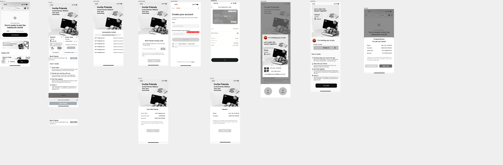

# 11. 整体流程

# 12. 需求描述

<table style="width:89%;">
<colgroup>
<col style="width: 20%" />
<col style="width: 19%" />
<col style="width: 48%" />
</colgroup>
<tbody>
<tr>
<td style="text-align: left;"><strong>页面</strong></td>
<td style="text-align: left;">UI/UX</td>
<td style="text-align: left;"><strong>具体描述</strong></td>
</tr>
<tr>
<td style="text-align: center;">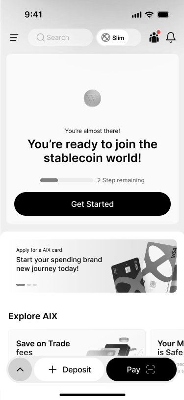</td>
<td style="text-align: center;">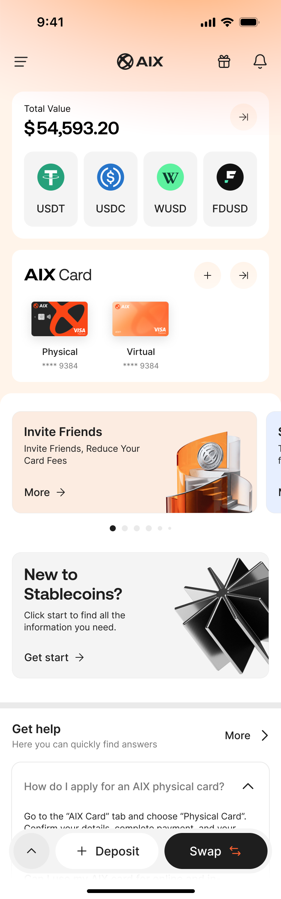</td>
<td style="text-align: left;">
入口：App 首页固定入口

小红点逻辑：

若新活动上线后14天内显示小红点。

若新奖励到账后14天内显示小红点。

有奖励即将失效7天内显示小红点。失效后不显示小红点。

进入Explore或者My rewards页面，返回首页之后，小红点消失；

交互：

App 首页右上角活动 icon，点击进入活动中心。

注意：

用户看到小红点，点击后小红点消失。若此时又发了一个奖励，则小红点会再次出现。

若新活动和新奖励都触发了，则用户需要查看活动页面和奖励页面后，首页的小红点才会消失。
</td>
</tr>
<tr>
<td style="text-align: left;"></td>
<td style="text-align: center;">

</td>
<td style="text-align: left;">
页面名称：活动中心-活动列表

入口：点击首屏的入口

显示：

1.分成两个tab： explore、My rewards

explore：

显示当前处于有效期的活动的列表。

按照活动的开始时间倒序排列。

显示活动的引导图（配置项）、活动主标题、活动副标题、actioncopywriting；

小红点逻辑：

新活动上线后14天内显示小红点。

若用户再次进入该页面，则小红点消失。

若14天用户未进入，则小红点消失。

用户通过首页icon进入该页面，Tab默认在Explore tab；如果通过消息中心-奖励获取/临期/奖励弹窗跳转至该页面，Tab切换至My rewards；

点击：

活动卡片，则跳转至对应actionurl（配置项），本期跳转至mgm活动页面。

异常：

若没有活动，则显示：coming soon。
</td>
</tr>
<tr>
<td style="text-align: left;"></td>
<td style="text-align: center;">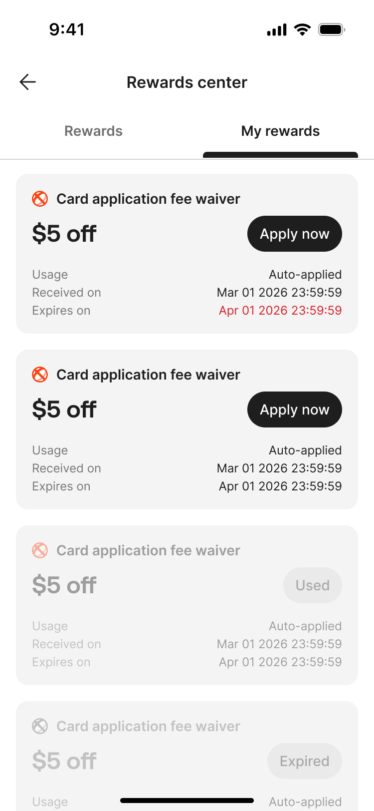</td>
<td style="text-align: left;">
页面名称：活动中心-奖励列表

入口：点击首屏的入口、消息中心、push

显示：

1.分成两个tab： explore、My rewards

My rewards：

显示用户获得全部奖励；当前只有申卡费减免的奖励；

排序：按照当前有效&gt;已使用&gt;已过期。

均为当前有效，则按照过期时间倒序。

均为已使用，则按照收到时间倒序；

均为已过期，则按照过期时间倒序。

奖励卡片：

奖励名称：运营定义

制卡费减免金额，显示$XX.XX +off

制卡费减免$XX.XX，XX.XX由后台配置文件实现。

小数点后面若为0，则不限时对应的“0”；

示例：$4.99,前端显示4.99；$4.90,前端显示4.9；$4.00,前端显示4；

使用场景描述：运营定义

CTA文案：运营定义

若已过期，则button显示Expired。无法点击。

若已使用，则button显示Used。无法点击。若奖励被冻结，则button也显示Used。

收到时间：奖励发放时间。

过期时间：奖励过期时间。有效期截止时间为当前奖励发放后的30个自然日的24点，具体可见【MGM活动概况】描述。奖励即将失效7天内过期时间的文案，高亮显示。

跳转链接

点击跳转链接，跳转至申卡页面。跳转链接由后台配置文件实现。

注意：奖励卡片当前仅支持当前1种样式。

小红点逻辑:

新奖励到账后14天内显示小红点。

若用户再次进入该页面，则小红点消失。

若14天用户未进入，则小红点消失。

奖励即将失效7天内显示小红点。失效后不显示小红点。

点击：

活动CTA，则跳转至对应actionurl。本次实现：若用户已完成kyc，则跳转至申卡流程。若用户未完成kyc，则弹出弹窗，not now及去认证。点击去认证，跳转至kyc流程。若用户kyc审核中，则跳转至homepage页。

异常：

若没有奖励，则显示：coming soon。

注意：

默认进入展示的explore，可以根据链接参数不同，点击进入该页面后自动切换至My reward tab。
</td>
</tr>
<tr>
<td style="text-align: center;">

</td>
<td style="text-align: center;">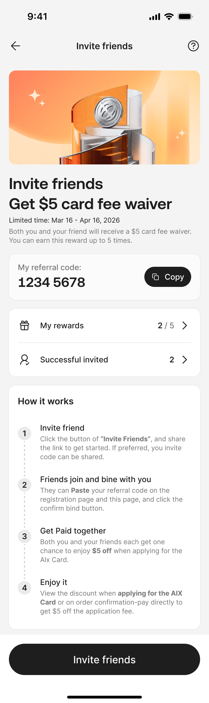</td>
<td style="text-align: left;">
页面名称：202512MGM活动详情

用户限制：已登录用户，且账户状态是：Actived；

入口：点击首屏的入口或营销位，以及点击对应的活动页面链接。

显示：

显示faq入口，跳转至对应的faq页面。（zendesk配置）

显示营销氛围图（运营配置）--使用oboss-banner能力

<a href="https://advancegroup.sg.larksuite.com/wiki/LPahw9N9minPZWkwthclU5l6grH">[2025-11-27] AIX+PopUp+banner等能力接入【首页+MGM页面】</a>

显示活动主标题：Invite friends Get $5 card fee waiver

显示活动开始时间及结束时间

时间格式: 月份-日期 时:分（若不跨年）

若跨年：则显示月份-日期-年份 时:分

显示活动副标题：Both you and your friend will receive a $5 card fee waiver. You can earn this reward up to 5 times.

邀请码区：

显示邀请码：明文显示。具体生成见上方【邀请码概况】描述。

生成时机：注册登录后，为用户自动生成邀请码。

点击复制，toast提示：复制成功。可将邀请码复制到剪贴板上。

奖励区：

显示我的奖励入口

显示本次活动已获得奖励数量

显示本次活动最多获得奖励数量，x=5（一期）

显示成功邀请的好友数；

以当前登录用户为中心，查询其他用户与其主动建立绑定关系的用户数。

示例：A用户分享了邀请码，有3个人绑定了。同时，A用户还绑定了B的邀请码。则成功邀请的用户数为3，不是4。

若为0，则不显示数字。

取值范围：仅限于本次活动（202512MGM活动）成功绑定的好友。

显示邀请好友button，首屏吸底

How it works

Invite friend

Click the button of “Invite Friends”, and share the link to get started. If preferred, you invite code can be shared.

Friends join and bine with you

They can Paste your referral code on the registration page and this page, and click the confirm bind button.

Get Paid together

Both you and your friends each get one chance to enjoy $5 off when applying for the Alx Card.

Enjoy it

View the discount when applying for the AlX Card or on order confirmation-pay directly to get $5 off the application fee.

显示banner入口，点击跳转至landingpage。（支持多个），接入oboss-banner能力，尺寸待定。

显示活动规则入口，点击则跳转至活动规则详情。--使用landingpage配置活动规则。

<a href="https://advancegroup.sg.larksuite.com/wiki/LPahw9N9minPZWkwthclU5l6grH">[2025-11-27] AIX+PopUp+banner等能力接入【首页+MGM页面】</a>

交互：

点击我的奖励button，则弹出对应的pop up；

点击成功邀请好友数的入口：则弹出对应的pop up；

点击邀请好友button，则显示对应的pop up。

异常处理：@Da Fu (Dave)

若用户未登录/注册，则访问该页面链接时，自动跳转至登录/注册页面。登录成功后，显示具体的活动内容。

若用户账户存在不是Actived，则访问该页面链接时，显示挡板页面，提示不在受邀范围内。

若活动已发布且已过期，则不显示邀请好友button。

若活动已下线，则显示挡板页面，提示活动已失效。

若成功邀请好友数据获取异常，则不显示邀请好友数字。

若邀请码生成/查询失败，则访问该页面链接时，显示挡板页面，提示活动已失效。

其他遵循APP的整体规则。
</td>
</tr>
<tr>
<td style="text-align: center;"></td>
<td style="text-align: center;">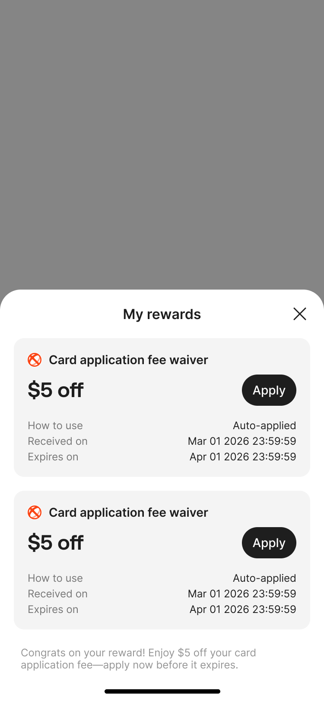</td>
<td style="text-align: left;">
弹窗：我的奖励

用户限制：已登录用户，且账户状态是：Actived；

前提条件：用户已绑定其他人，或被其他人绑定。

入口：点击202512MGM活动详情页面-我的奖励button

显示：

取值范围：仅限于本次活动（202512MGM活动）发放的奖励

排序：按照当前有效&gt;已使用&gt;已过期。

均为当前有效，则按照过期时间正序。

均为已使用，则按照收到时间倒序；

均为已过期，则按照过期时间倒序。

奖励卡片：

奖励名称：运营定义

制卡费减免金额，显示$XX.XX +off

制卡费减免$XX.XX，XX.XX由后台配置文件实现。

小数点后面若为0，则不限时对应的“0”；

示例：$4.99,前端显示4.99；$4.90,前端显示4.9；$4.00,前端显示4；

使用场景描述：运营定义

CTA文案：运营定义

若已过期，则button显示Expired。无法点击。

若已使用，则button显示Used。无法点击

若奖励被冻结，则button也显示Used。

收到时间：奖励发放时间。

过期时间：有效期截止时间为当前奖励发放后的30个自然日的24点，具体可见【MGM活动概况】描述。奖励即将失效7天内过期时间的文案，高亮显示。

跳转链接

点击跳转链接，跳转至申卡页面。跳转链接由后台配置文件实现。

本次实现：若用户已完成kyc，则跳转至申卡流程。若用户未完成kyc，则跳转至kyc流程。若用户kyc审核中，则跳转至homepage页。

交互：

点击关闭及灰色区域，则关闭该弹窗。

异常：

若无奖励，则显示无奖励样式的弹窗，提示用户去邀请好友获取奖励。点击去邀请，则弹出邀请好友弹窗。
</td>
</tr>
<tr>
<td style="text-align: center;"></td>
<td style="text-align: center;">

</td>
<td style="text-align: left;">
弹窗：成功邀请的好友列表弹窗

用户限制：已登录用户数，且账户状态是：Actived；

前提条件：该用户的邀请码已被其他人绑定。

入口：点击202512MGM活动详情页面-成功邀请好友数的入口

显示：

取值范围：仅限于本次活动（202512MGM活动）绑定的好友

显示具体成功邀请好友的人数。

显示绑定该用户邀请码的用户明细：

绑定该邀请码时对应的登录用户的邮箱，其中邮箱名称需加*脱敏显示。

显示具体绑定该邀请码的具体时间。

按照绑定时间倒序显示。

显示邀请好友button。

交互 
1. 点击关闭及灰色区域，则关闭该弹窗。

异常：

若无邀请好友，则显示无邀请记录的弹窗，提示用户去邀请好友获取奖励。点击去邀请，则弹出邀请好友弹窗。
</td>
</tr>
<tr>
<td style="text-align: center;">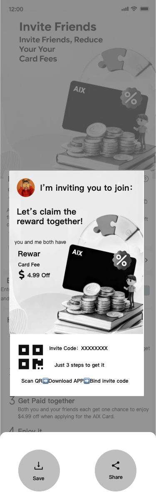</td>
<td style="text-align: center;"></td>
<td style="text-align: left;">
弹窗：邀请好友弹窗

用户限制：已登录用户，且账户状态是：Actived；

前提条件：无

入口：点击202512MGM活动详情页面-邀请好友button

显示：

显示邀请好友的引导分享图。

显示二维码

活动引导页面的链接，尾部参数包含登录人信息+邀请码信息，链接由长链接生成短链。

制卡费减免金额，显示$XX.XX +off

制卡费减免$XX.XX，XX.XX由后台配置文件实现。

小数点后面若为0，则不限时对应的“0”；

示例：$4.99,前端显示4.99；$4.90,前端显示4.9；$4.00,前端显示4；

金额需与活动详情页保持一致。

显示引导文案： Let's claim the reward together! You and I both have Card Fees

显示奖励信息

显示保存图片入口

显示复制link入口，活动引导页面的链接，尾部参数包含登录人信息+邀请码信息+语言信息，链接由长链接生成短链。

显示分享组件。

交互：

点击保存图片，则弹出系统访问相册的授权引导（如有），明确有授权后，将图片保存到用户相册。toast提示：保存成功。

点击复制按钮，则toast提示：Copied！Invite your friends now.

点击关闭及灰色区域，则关闭该弹窗。

点击分享组件的icon，则遵循分享组件交互样式。

点击分享组件，分享内容：文案+link。（link中的图是固定的，文案固定），图待补充。

分享文案：【待定】@Devon Xiao

分享渠道

<em>messenger：66%（可能有问题）</em>

<em>copy link：14%</em>

<em>facebook：9%（可能有问题）</em>

<em>viber：3%</em>

<em>what’s app：3%</em>

<em>sms：2%</em>

<em>Tel</em>

<em>X</em>

<em>others：3%</em>

异常：

若二维码生成失败、分享组件加载失败，则不显示该弹窗。在当前页面toast提示：系统错误，请稍后重试。

若保存图片失败，则toast提示：保存失败，请稍后重试。
</td>
</tr>
<tr>
<td style="text-align: left;"></td>
<td style="text-align: center;">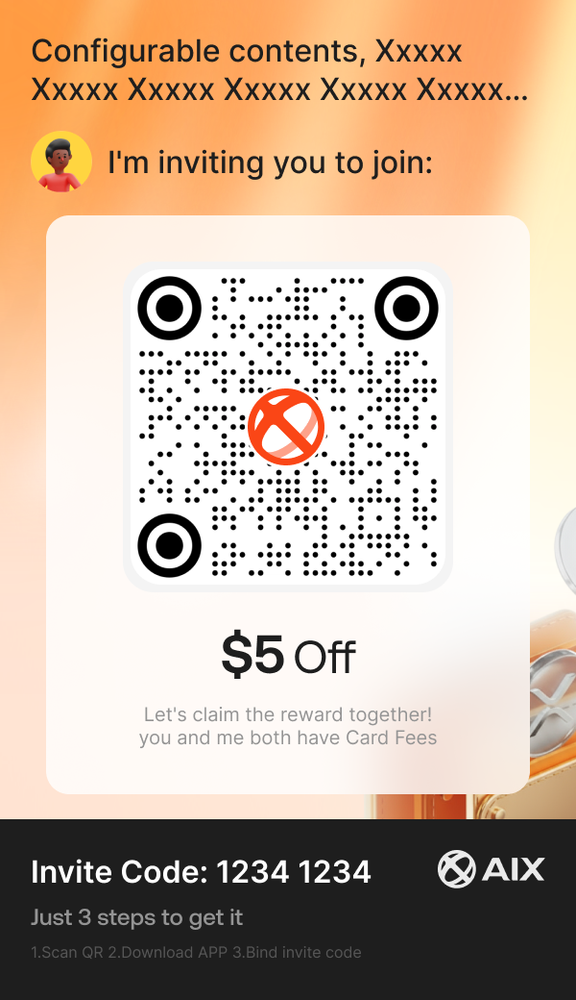</td>
<td style="text-align: left;">
图片：邀请好友的图片

用户限制：已登录用户，且账户状态是：Actived；

前提条件：无

入口：点击202512MGM活动详情页面-邀请好友button-保存图片

显示：

显示标题 ：AIX rewards（运营定义）

显示登录用户的头像（如有）

显示副标题: I am inviting you to join

显示奖励信息

金额需与活动详情页保持一致。

显示二维码

二维码：活动引导页面的链接，尾部参数包含登录人信息+邀请码信息+语言信息，链接由长链接生成短链。

显示引导文案： Let's claim the reward together! You and I both have Card Fees

显示邀请码

分享人的邀请码，此处显示为明文。

显示操作路径文案。

Just 3 steps to get it

1.Scan QR 2.Download APP 3.Bind invite code
</td>
</tr>
<tr>
<td style="text-align: center;"></td>
<td style="text-align: center;"></td>
<td style="text-align: left;">
页面：被邀请人识别二维码打开的页面、点击分享后的链接

用户限制：无需登录

入口：用户识别邀请图中的二维码

显示：

显示引导参与活动的氛围图，与mgm活动页面顶部的图保持一致。

显示faq入口，跳转至对应的faq页面。（zendesk配置）

显示主标题：Join AIX Pay Get $5 card fee waiver

不显示活动开始时间及结束时间。

显示副标题：Enter your email to claim your reward. You will be automatically linked to your friend referral code XXXXXXXX.

邀请码

与邀请图保持一致，明文显示。

显示分享人的头像

与邀请图保持一致。

显示邀请话术: I am inviting you to join

显示输入邮箱区域及显示button。

若滑动屏幕，悬浮快捷入口。

显示how it works

显示USP文案。USP的语言版本【文字部分支持多语言】，@Devon Xiao

显示隐私协议及服务政策。

显示活动规则入口，点击则跳转至活动规则详情。--使用landingpage配置活动规则。

<a href="https://advancegroup.sg.larksuite.com/wiki/LPahw9N9minPZWkwthclU5l6grH">[2025-11-27] AIX+PopUp+banner等能力接入【首页+MGM页面】</a>

交互：

点击复制邀请码， 则toast提示：复制成功。

输入邮箱，

输入规则：

最长限制为103个字符，超出不可输入；

实时格式校验：

当格式不符合邮箱规范（如：缺少@符号、域名不完整）时，应提示：Email format is invalid

当输入框为空时，应提示：Email should not be empty

点击button，则判断预绑定关系的校验接口，建立预绑定关系，并显示对应的结果页。

注意：绑定人邮箱与同一个邀请码只能建立一次预绑定关系。绑定人邮箱可能会与多个邀请码建立预绑定关系，但是最终只能与一个code（最后绑定的邀请码）建立真实的绑定关系。

点击隐私协议、服务政策，则跳转到对应的详情页。

<del>当前活动是否已下线，需为已发布。否则，提示：活动已下线。</del>

<del>当前活动是否仍在有效期，需在有效期否则，提示：活动已下线。</del>

<del>邀请码是否存在，需存在。否则，提示：邀请码不存在。</del>

<del>邀请是否在有效期（仅为系统邀请码），需在有效期否则，提示：邀请码已过期。</del>

<del>绑定人及被绑定人是否为目标用户；需均为目标用户否则，提示：不符合参与条件。</del>

<del>绑定人的邮箱如果在aix数据库中，则视为已注册用户，不符合条件。</del>

<del>被绑定人用户状态是否为actived，actived（邀请人为AIX官方邀请时，不校验账户状态，详见4:邀请码）；否则，提示：不符合参与条件。</del>

<del>绑定人是否与该邀请码建立了预绑定关系。需未建立。否则，提示：请换一个邮箱再试</del>。

<del>进入OTP页面。邮箱OTP验证页，见<a href="https://advancegroup.sg.larksuite.com/wiki/HdI2wMXXviIOOwkVJNjlWY35gSh#share-Rew8dANwFoaWYAxxL8NlWEr5gNb">AIX Security 身份认证需求V1.0</a>，遵守邮件OTP的频控限制。</del>

<del>完成OTP校验后，则调用预绑定关系接口，实现预绑定。同时二次校验，二次校验通过及失败，显示对应的结果页。</del>

<del>点击button，则判断预绑定关系的校验接口，建立预绑定关系：</del>

<del>当前活动是否已下线，需为已发布。否则，toast提示：活动已下线。</del>

<del>当前活动是否仍在有效期，需在有效期否则，toast提示：活动已下线。</del>

<del>邀请码是否存在，需存在。否则，toast提示：邀请码不存在。</del>

<del>邀请是否在有效期（仅为系统邀请码），需在有效期否则，toast提示：邀请码已过期。</del>

<del>绑定人及被绑定人是否为目标用户；需均为目标用户否则，toast提示：不符合参与条件。</del>

<del>绑定人的邮箱如果在aix数据库中，则视为已注册用户，不符合条件。</del>

<del>被绑定人用户状态是否为actived，actived（邀请人为AIX官方邀请时，不校验账户状态，详见4:邀请码）；否则，toast提示：不符合参与条件。</del>

<del>绑定人是否与该邀请码建立了预绑定关系。需未建立。否则，toast提示：请换一个邮箱再试。</del>

频控：

同一个设备指纹总次数限制（总次数 非单位时间），最多1000次。超过后，toast提示：The system is busy, please try again later。

同一个ip <strong>单位时间</strong>内总次数限制 1000000/10min。超过后，toast提示：The system is busy, please try again later。锁定15分钟后可再提交。

异常：

若存在用户将链接篡改，导致丢失头像，则不显示头像。

若存在用户将链接篡改，导致丢失邀请码，则不显示邀请码区域。并toast提示：请正确识别二维码。

若本活动已发布且已过期，则显示挡板页面，提示活动已失效。@Da Fu (Dave)

若本活动已下线，则显示挡板页面，提示 活动已失效。@Da Fu (Dave)
</td>
</tr>
<tr>
<td style="text-align: left;"></td>
<td style="text-align: center;"></td>
<td style="text-align: left;">
页面：被邀请人与绑定人建立了预绑定关系

显示：

显示分享人的头像

与邀请图保持一致。

显示邀请话术: I am inviting you to join

显示预绑定关系建立成功提示文案：快去领取奖励吧。

点击get the app now button，则判断用户是否已安装AIX APP。

若未安装，则跳转至对应的应用商店，引导下载安装APP。

若已安装，则自动唤起APP。

异常：无
</td>
</tr>
<tr>
<td style="text-align: left;"></td>
<td style="text-align: center;"></td>
<td style="text-align: left;">
页面：被邀请人与绑定人未建立预绑定关系

显示：

显示分享人的头像

与邀请图保持一致。

根据失败的状态，显示对应的失败文案。

当前活动是否已下线，需为已发布。否则，提示：活动已下线。

当前活动是否仍在有效期，需在有效期否则，提示：活动已下线。

邀请码是否存在，需存在。否则，提示：邀请码不存在。

邀请是否在有效期（仅为系统邀请码），需在有效期否则，提示：邀请码已过期。

绑定人及被绑定人是否为目标用户；需均为目标用户否则，提示：不符合参与条件。

绑定人的邮箱如果在aix数据库中，则视为已注册用户，不符合条件。

被绑定人用户状态是否为actived，actived（邀请人为AIX官方邀请时，不校验账户状态，详见4:邀请码）；否则，提示：不符合参与条件。

绑定人是否与该邀请码建立了预绑定关系。需未建立。否则，提示：请换一个邮箱再试。

显示跳转app的引导文案。（运营定义）

点击get the app now button，则判断用户是否已安装AIX APP。

若未安装，则跳转至对应的应用商店，引导下载安装APP。

若已安装，则自动唤起APP。

APP打开后，正常进入引导页。

异常：无
</td>
</tr>
<tr>
<td style="text-align: center;">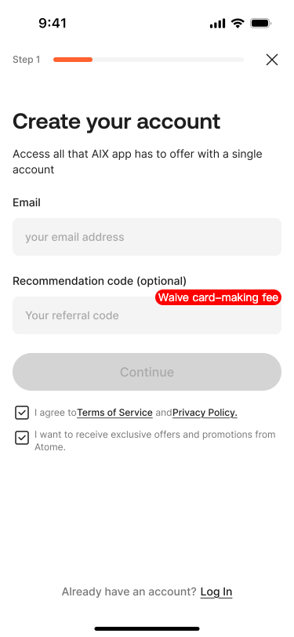</td>
<td style="text-align: center;"></td>
<td style="text-align: left;">
绑定邀请码-注册页面

<del>根据用户输入的邮箱，自动反显出对应的邀请码referred code 。需提供1个查询最新的预绑定关系的接口。</del>

若用户主动输入邀请码，则点击continue，则判断以下逻辑：若不符合条件，则清空邀请码，并且给出对应的toast提示。【不建立预绑定关系】

<del>调用预绑定关系的校验接口，二次校验是否正常。若二次校验失败，则清空邀请码，并且给出对应的toast提示。</del>

<del>当前活动是否已下线，需为已发布。否则，toast提示：活动已下线。</del>

<del>当前活动是否仍在有效期，需在有效期否则，toast提示：活动已下线。</del>

邀请码是否存在，需存在。否则，toast提示：邀请码不存在。

邀请是否在有效期（仅为系统邀请码），需在有效期否则，toast提示：邀请码已过期。

<del>绑定人及被绑定人是否为目标用户；需均为目标用户否则，toast提示：不符合参与条件。</del>

<del>绑定人的邮箱如果在aix数据库中，则视为已注册用户，不符合条件。</del>

<del>被绑定人用户状态是否为actived，actived（邀请人为AIX官方邀请时，不校验账户状态，详见4:邀请码）；否则，toast提示：不符合参与条件。</del>

<del>绑定人是否与该邀请码建立了预绑定关系。若没有，则需调用预绑定关系建立接口，建立预绑定关系。如已建立，则可正常继续。</del>

若用户不输入邀请码，则点击continue，正常继续。

其他见：注册流程。

异常场景【注意】：

<del>因查询最新的预绑定关系的接口异常，则不显示referral code。系统触发报警，后台自动执行异常处理任务，为该用户实现自动绑定。</del>

<del>若用户在该页面手动清空邀请码，则视为不绑定邀请码，不应建立任何绑定关系。</del>

<del>若用户手动修改邀请码（且邀请码有效），则最终建立绑定关系时应与用户手动修改的邀请码建立绑定关系。</del>

若用户手动输入邀请码，并建立预绑定关系。则最终建立绑定关系，以用户输入为准。

若用户在当前页面人工操作导致未建立绑定关系，在进入app中无兜底绑定入口。【业务诉求】
</td>
</tr>
<tr>
<td style="text-align: center;"></td>
<td style="text-align: center;">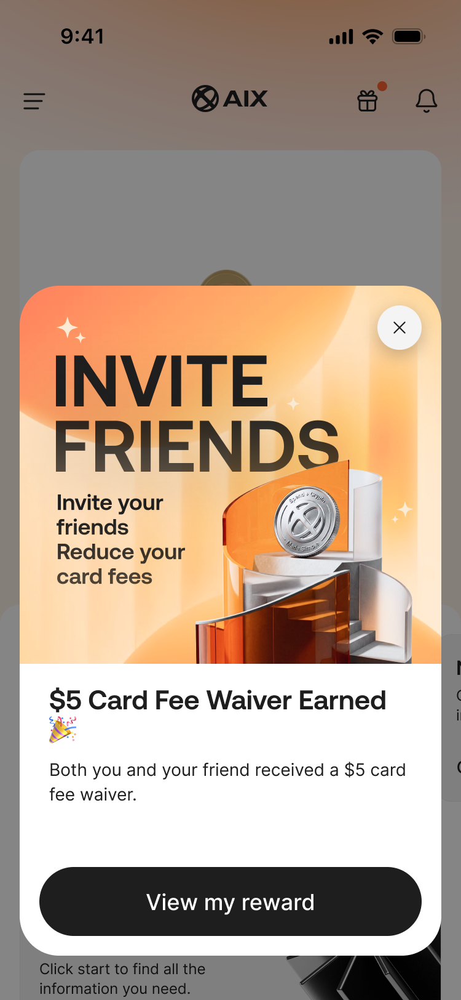</td>
<td style="text-align: left;">
首页建立绑定关系及发奖

用户限制：<strong>绑定人视角</strong>

建立绑定关系：

当用户完成注册流程后，正常进入首页。若用户在注册流程有预绑定的referred code（包含在外部页面操作的预绑定，或者在注册流程中手动输入了有效的邀请码）， 则调用绑定关系建立接口，自动发放活动奖励。

建立绑定关系判断条件：

当前活动是否已下线，需为已发布。

当前活动是否仍在有效期，需在有效期

邀请码是否存在，需存在

邀请码是否在有效期（仅为系统邀请码），需在有效期

绑定人及被绑定人是否为目标用户；需均为目标用户

绑定人及被绑定人的用户状态是否为actived，需均为actived（邀请人为AIX官方邀请时，不校验账户状态，详见4:邀请码）。

绑定人是否已绑定其他人；绑定人不能其他人。

被绑定人是否已绑定其他人；不限制。

若不符合上述条件，导致绑定关系建立失败，则对于绑定人和未绑定人不做任何提示。

若因网络、接口调用失败，导致导致绑定关系建立失败，则系统触发报警，后台自动执行异常处理任务，为该用户实现自动绑定。

发奖逻辑：

若调用绑定关系建立成功，则自动触发发奖接口。判断逻辑【研发可定义】：

绑定人及被绑定人建立绑定关系。

每个绑定关系触发1次发奖。每个用户最多有X个奖励。(支持配置)，1期X=5个。

奖励弹窗：

发奖成功后，显示对应的奖励弹窗。

奖励弹窗文案：

背景图

奖励主标题

奖励副标题

button文案

此类弹窗定义为功能性弹窗，与营销弹窗不同。暂不使用oboss能力。

<em>弹窗出现的时机：x-tag 判断逻辑之后，其他弹窗（运营、push引导开关）之前。</em>

现有已有弹窗的优先级：强更、弱更的弹窗&gt;x-tag&gt;活动奖励弹窗&gt;营销运营弹窗&gt;push权限弹窗。

频控：1个奖励仅出现1次弹窗，点击关闭后不再出现。不参与其他弹窗（强更、弱更、运营、push引导开关）的频控逻辑计算。

弹窗所在页面：APP首页。

交互：

点击button，则跳转至对应的链接（申卡或者my rewards的tab页面，运营提前指定@Qin Lai 赖勤 (Quincy)）

点击关闭，则关闭弹窗，停留在当前页面。

异常：

<em>若同时存在两个活动且均有效，且满足全部条件，则与最新的活动建立绑定关系，绑定成功后触发奖励。</em>

<del>站外建立预绑定关系的方案A：站外的预绑定关系建立与活动挂钩，若活动已失效或者结束，则视为无有效的预绑定关系。若用户在站外看到并参与了第一个活动，与code码建立了预绑定关系。在后续第一个活动失效了，第二个活动已经上线且有效，此时用户来到app后注册成功后不触发奖励。</del>

站外建立预绑定关系的方案：站外及站内的预绑定关系建立与活动无关。若用户在站外看到并参与了第一个活动，与code码建立了预绑定关系。在后续第一个活动失效了，第二个活动已经上线且有效，则用户在满足上述条件时，触发的是第二个活动奖励。发奖以真实绑定关系建立时判断为准。

站内手动输入邀请码的方案：第一个活动开始时，用户在社群看到了一个邀请码，但没有下载app。在后续第一个活动失效了，第二个活动已经上线且有效，这时该用户下载了app并手动输入了该邀请码，此时，则用户在满足上述条件时，触发的是第二个活动奖励。发奖以真实绑定关系建立时判断为准。

站内手动输入邀请码的方案：若用户在站外看到并参与了第一个活动，与code码建立了预绑定关系。在后续第一个活动失效了，第二个活动已经上线且有效，这时该用户下载了app并手动输入了另一个人的邀请码，此时，则用户在满足上述条件时，触发的是第二个活动奖励。发奖以真实绑定关系建立时判断为准。

若用户在站外看到并参与了第一个活动，与code码建立了预绑定关系。在后续第一个活动失效了，第二个活动已经上线且有效，这时该用户下载了app并手动输入了该邀请码，此时，则用户在满足上述条件时，触发的是第二个活动奖励。发奖以真实绑定关系建立时判断为准。

若绑定时当前没有任何有效活动，则不触发奖励。

若接口异常导致未建立绑定关系，服务端增加报警。后续定时任务处理。
</td>
</tr>
<tr>
<td style="text-align: left;"></td>
<td style="text-align: center;">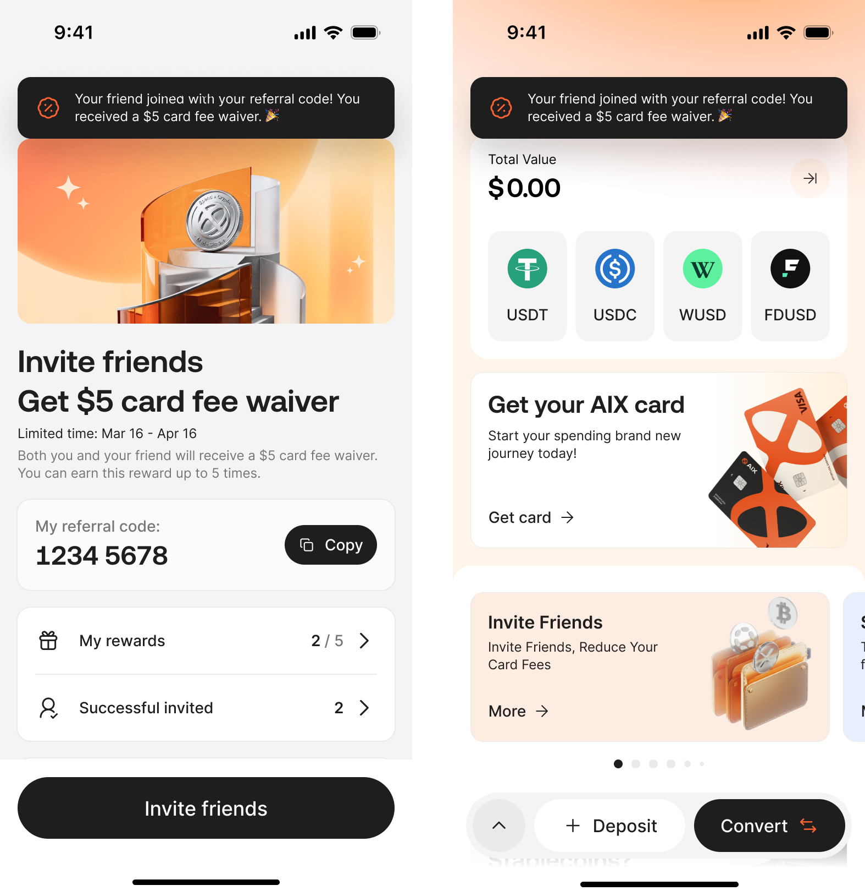</td>
<td style="text-align: left;">
建立绑定关系及发奖

用户限制：<strong>被绑定人视角</strong>

建立绑定关系：同绑定人

发奖逻辑：同绑定人

奖励形式-push提示：

出现的页面：任意页面。

<em>push出现的时机：发奖成功即提示。不参与其他弹窗（强更、弱更、运营、push引导开关）的频控逻辑计算，可与其他弹窗同时出现。</em>

频控：1个奖励仅出现1次提示，点击关闭后不再出现。

当前存在有奖励发放，提示1次。

提示文案：Your friend joined with your referral code! You received a $5 card fee waiver.

注意：

发奖成功即触发该push。

若有新奖励，则首页的红点需显示。
</td>
</tr>
<tr>
<td style="text-align: center;"></td>
<td style="text-align: left;"></td>
<td style="text-align: left;">
申请卡减免页面

备注：对外提供接口

查询用户当前最优奖励的接口。详见：【6. 对外提供接口能力】

冻结用户当前奖励的接口。详见：【6. 对外提供接口能力】

若未支付成功，则调用解冻用户当前奖励的接口。详见：【6. 对外提供接口能力】

若支付成功，则调用核销用户当前奖励的接口。详见：【6. 对外提供接口能力】

异常：

核销异常toast

冻结异常toast
</td>
</tr>
<tr>
<td style="text-align: center;"></td>
<td style="text-align: left;"></td>
<td style="text-align: left;">
<del>弹窗：绑定邀请码弹窗</del>

<del>用户限制：已登录用户，且账户状态是：Actived；</del>

<del>前提条件：本活动中，用户未绑定过其他人</del>

<del>入口：用户点击活动详情页面-去绑定；或在被邀请人识别二维码打开的页面中点击了去绑定（用户已安装及登录了APP）</del>

<del>显示：</del>

<del>显示引导输入邀请码的入口</del>

<del>支持自行输入及快捷粘贴。</del>

<del>交互：</del>

<del>点击关闭及灰色区域，则关闭该弹窗。</del>

<del>点击输入框，则拉起系统键盘，由用户自行输入。</del>

<del>仅支持输入数字、英文大小写，不支持输入中文、特殊符号，空格。长度最少输入2个字符，最多输入30个字符。</del>

<del>点击确定，则依次判断：</del>

<del>当前活动是否已下线，需为已发布。</del>

<del>当前活动是否仍在有效期，需在有效期</del>

<del>邀请码是否存在，需存在</del>

<del>邀请是否在有效期（仅为系统邀请码），需在有效期</del>

<del>绑定人及被绑定人是否为目标用户；需均为目标用户</del>

<del>绑定人及被绑定人的用户状态是否为actived，需均为actived（邀请人为AIX官方邀请时，不校验账户状态，详见4:邀请码）；</del>

<del>绑定人是否已绑定其他人；绑定人不能其他人。</del>

<del>被绑定人是否已绑定其他人；不限制。</del>

<del>若满足上述条件，则绑定人及被绑定人建立绑定关系，自动发放活动奖励或者更新活动奖励的有效期。toast提示：绑定成功。</del>

<del>若发放奖励，则关闭该弹窗，显示奖励反馈弹窗。</del>

<del>若本次活动已发奖，则需给绑定用户/被绑定用户更新奖励的有效期。则关闭该弹窗，显示我的奖励弹窗。</del>

<del>异常：</del>

<del>点击确定，若活动已发布且已过期，则toast提示：活动已截止，下次再参与吧</del>

<del>点击确定，若活动已下线，则toast提示：活动已截止，下次再参与吧。</del>

<del>点击确定，若邀请码不存在，则toast提示：该邀请码不存在，请换一个吧</del>

<del>点击确定，若邀请码已失效（仅限于系统邀请码场景），则toast提示：邀请码已失效。</del>

<del>点击确定，若绑定人已不是目标用户，则toast提示：暂时无法绑定别人。</del>

<del>点击确定，若被绑定人已不是目标用户，则toast提示：暂时无法绑定该用户。</del>

<del>点击确定，若绑定人账户状态为非actived ，则toast提示：暂时无法绑定别人。</del>

<del>点击确定，若被绑定人账户状态为非actived ，则toast提示：暂时无法绑定该用户。</del>

<del>点击确定，若绑定人已绑定其他人，则toast提示：你已绑定。关闭该弹窗，弹出我已绑定好友的弹窗。</del>

<del>点击确定，若调用绑定接口失败，则toast提示：系统异常，请稍后重试。</del>
</td>
</tr>
<tr>
<td style="text-align: center;"></td>
<td style="text-align: left;"></td>
<td style="text-align: left;">
<del>弹窗：我已绑定好友的弹窗</del>

<del>用户限制：已登录用户，且账户状态是：Actived；</del>

<del>前提条件：本活动中，用户主动绑定了好友的邀请码</del>

<del>入口：用户点击活动详情页面-查看绑定详情。</del>

<del>显示：</del>

<del>本活动中，用户已通过邀请码绑定的用户的邮箱；</del>

<del>显示绑定操作对应的邀请码，明文显示。</del>

<del>显示绑定的时间。</del>

<del>交互：</del>

<del>点击我知道了，则返回活动主页。</del>

<del>点击关闭及灰色区域，则关闭该弹窗。</del>

<del>异常：无</del>
</td>
</tr>
</tbody>
</table>

# 13. 数据埋点及数据统计需求【梳理中】

[AIX+MGM+数据分析需求](https://advancegroup.sg.larksuite.com/docx/D5KsdaWReo4D7XxMmeIlQKcHgaf)

# 14. Notification【梳理中】

需服务端与oboss对接及开发对应的参数，详见：

[AIX【System Notification+content】](https://advancegroup.sg.larksuite.com/wiki/Rj6KwJPnfisKltktktElRy4tgrG?sheet=355e90)

参考资料：

<table style="width:88%;">
<colgroup>
<col style="width: 88%" />
</colgroup>
<tbody>
<tr>
<td>
邀请码 -》系统生成

web2 转账标识-》AIX ID -》支持用户自定义-不允许重复

AIX ID -》不支持更改，支持用户自定义

用户在使用节点前需要强制设置（目前暂无）+其他节点提示设置（注册成功后，kYC 成功后，me tab ，转账）

AIX ID 就是客户的唯一账户标识，用于转账，CS ticket 等

头像,昵称是否仅为展示作为用户备注存在， 可重复，无唯一性校验
</td>
</tr>
</tbody>
</table>
