# \[2025-11-25\] AIX+Notification（push及站内信）

**目录**

<table style="width:89%;">
<colgroup>
<col style="width: 4%" />
<col style="width: 12%" />
<col style="width: 13%" />
<col style="width: 11%" />
<col style="width: 5%" />
<col style="width: 17%" />
<col style="width: 14%" />
<col style="width: 9%" />
</colgroup>
<tbody>
<tr>
<td style="text-align: left;"><strong>业务端</strong></td>
<td style="text-align: left;">需求模块</td>
<td style="text-align: left;">功能描述</td>
<td style="text-align: left;"><strong>作者</strong></td>
<td style="text-align: left;"><strong>需求批次</strong></td>
<td style="text-align: left;"><strong>PRD</strong></td>
<td style="text-align: left;"><strong>Meegle</strong></td>
<td style="text-align: left;">需求状态</td>
</tr>
<tr>
<td style="text-align: left;">用户端</td>
<td style="text-align: left;">【通用】注册登录</td>
<td style="text-align: left;">包括注册/登录/忘记密码等功能</td>
<td style="text-align: left;">@Yifeng Wu 吴忆锋</td>
<td style="text-align: left;">第1批</td>
<td style="text-align: left;"><a href="https://advancegroup.sg.larksuite.com/wiki/NerUwjf1kiLTOkk9uJClnSYZgCc?from=from_copylink">AIX Card 注册登录需求V1.0</a></td>
<td style="text-align: left;"><a href="https://project.larksuite.com/atome_agile/story/detail/8508344">[Feature]AIX项目-注册登录需求</a></td>
<td style="text-align: left;">已评审</td>
</tr>
<tr>
<td style="text-align: left;">用户端</td>
<td style="text-align: left;">【通用】ME模块</td>
<td style="text-align: left;">包括绑定/更新手机号、修改密码、登出、设置通知等账户相关管理功能</td>
<td style="text-align: left;">@Yifeng Wu 吴忆锋</td>
<td style="text-align: left;">第1批</td>
<td style="text-align: left;"><a href="https://advancegroup.sg.larksuite.com/wiki/PxXnwhWp6iWr7RkEYnwl0I6sgzc?from=from_copylink">AIX Card ME模块需求V1.0</a></td>
<td style="text-align: left;"><a href="https://project.larksuite.com/atome_agile/story/detail/8508345">[Feature]AIX Card ME模块需求</a></td>
<td style="text-align: left;">已评审</td>
</tr>
<tr>
<td style="text-align: left;">用户端</td>
<td style="text-align: left;">【通用】AIX主页</td>
<td style="text-align: left;">AIX主页</td>
<td style="text-align: left;">@Xuemin Zhu 朱学敏</td>
<td style="text-align: left;">第2批</td>
<td style="text-align: left;"><a href="https://advancegroup.sg.larksuite.com/docx/Tf1ydauugoKzzQx3PkUlG8t7g6f">AIX APP V1.0【Home】</a></td>
<td style="text-align: left;"><a href="https://project.larksuite.com/atome_agile/story/detail/8646936?parentUrl=/atome_agile/story/homepage&amp;openScene=1">[Feature]AIX APP Main</a></td>
<td style="text-align: left;">已评审</td>
</tr>
<tr>
<td style="text-align: left;">用户端</td>
<td style="text-align: left;">【Wallet】资产</td>
<td style="text-align: left;">
钱包主页

单币种首页

交易记录
</td>
<td style="text-align: left;">@Xuemin Zhu 朱学敏</td>
<td style="text-align: left;">第2批</td>
<td style="text-align: left;"><a href="https://advancegroup.sg.larksuite.com/docx/FlV6dPLYgowznwxAALAlPYuzgeA">AIX Wallet V1.0【Asset】</a></td>
<td style="text-align: left;"><a href="https://project.larksuite.com/atome_agile/story/detail/8646936?parentUrl=/atome_agile/story/homepage&amp;openScene=1">[Feature]AIX APP Main</a></td>
<td style="text-align: left;">已评审</td>
</tr>
<tr>
<td style="text-align: left;">用户端</td>
<td style="text-align: left;">【通用】全局问题库</td>
<td style="text-align: left;">
问题入口

最近3条

FAQ页面
</td>
<td style="text-align: left;">@Xuemin Zhu 朱学敏</td>
<td style="text-align: left;"></td>
<td style="text-align: left;"><a href="https://advancegroup.sg.larksuite.com/docx/OlWEdynrboay1QxcpfhlYbJtgZg">AIX APP V1.0 【FAQ】</a></td>
<td style="text-align: left;"><a href="https://project.larksuite.com/atome_agile/story/detail/10077340?parentUrl=/atome_agile/story/homepage&amp;openScene=1">[Feature]AIX APP V1.0 全局问题【FAQ】</a></td>
<td style="text-align: left;">已评审</td>
</tr>
<tr>
<td style="text-align: left;">用户端</td>
<td style="text-align: left;">【认证】Security</td>
<td style="text-align: left;">包括身份认证模块</td>
<td style="text-align: left;">@Yifeng Wu 吴忆锋</td>
<td style="text-align: left;">第2批</td>
<td style="text-align: left;"><a href="https://advancegroup.sg.larksuite.com/wiki/HdI2wMXXviIOOwkVJNjlWY35gSh?from=from_copylink">AIX Security 身份认证需求V1.0</a></td>
<td style="text-align: left;"><a href="https://project.larksuite.com/atome_agile/story/detail/8649980">[Feature]AIX Security 身份认证需求V1.0</a></td>
<td style="text-align: left;">已评审</td>
</tr>
<tr>
<td style="text-align: left;">用户端</td>
<td style="text-align: left;">【Card】申卡</td>
<td style="text-align: left;">
申请开卡

扣制卡费

卡片详情

卡片展示
</td>
<td style="text-align: left;">@Xuemin Zhu 朱学敏</td>
<td style="text-align: left;">第2批</td>
<td style="text-align: left;"><a href="https://advancegroup.sg.larksuite.com/docx/AgJgdrCaLoCDUFxoKHqlnZGMgkh">AIX Card V1.0【Application】</a></td>
<td style="text-align: left;"><a href="https://project.larksuite.com/atome_agile/story/detail/7981054">[Feature]AIX Card V1.0【Application】</a></td>
<td style="text-align: left;">已评审</td>
</tr>
<tr>
<td style="text-align: left;">用户端</td>
<td style="text-align: left;">【Card】Card Manage</td>
<td style="text-align: left;">包括卡激活、设置/修改PIN、冻结卡、解冻卡等</td>
<td style="text-align: left;">@Yifeng Wu 吴忆锋</td>
<td style="text-align: left;">第2批</td>
<td style="text-align: left;"><a href="https://advancegroup.sg.larksuite.com/wiki/Uwyfwkc2jixSBukf2YJllpjsgRd?from=from_copylink">AIX Card 【manage】模块需求V1.0</a></td>
<td style="text-align: left;"><a href="https://project.larksuite.com/atome_agile/story/detail/8649952">[Feature]AIX Card manage模块需求V1.0</a></td>
<td style="text-align: left;">已评审</td>
</tr>
<tr>
<td style="text-align: left;">用户端</td>
<td style="text-align: left;">【Card】Card transaction</td>
<td style="text-align: left;">包括卡自动转钱包功能</td>
<td style="text-align: left;">@Yifeng Wu 吴忆锋</td>
<td style="text-align: left;"></td>
<td style="text-align: left;"><a href="https://advancegroup.sg.larksuite.com/wiki/Ap7pwQeetiS7hlk9MTqlEcycgjc?from=from_copylink">AIX Card交易【transaction】</a></td>
<td style="text-align: left;"><a href="https://project.larksuite.com/atome_agile/story/detail/9148370">[Feature]AIX Card交易【transaction】</a></td>
<td style="text-align: left;">已评审</td>
</tr>
<tr>
<td style="text-align: left;">用户端</td>
<td style="text-align: left;">【通用】交易记录</td>
<td style="text-align: left;">
全量交易记录

卡交易记录

Card交易详情

OTC交易详情

Crypto交易详情
</td>
<td style="text-align: left;">@Xuemin Zhu 朱学敏</td>
<td style="text-align: left;">第2批</td>
<td style="text-align: left;"><a href="https://advancegroup.sg.larksuite.com/docx/RJqtdUND9oGdkxxrPRllg94kgFe">AIX APP V1.0【Transaction &amp; History】</a></td>
<td style="text-align: left;"><a href="https://project.larksuite.com/atome_agile/story/detail/7981018?parentUrl=/atome_agile/story/homepage&amp;openScene=4">[Feature]AIX APP V1.0【Transaction &amp; History】</a></td>
<td style="text-align: left;">
已评审

（后续会根据UX调整二次评）
</td>
</tr>
<tr>
<td style="text-align: left;">用户端</td>
<td style="text-align: left;">【钱包】开户kyc</td>
<td style="text-align: left;">开通DTC账户</td>
<td style="text-align: left;">@Yifeng Wu 吴忆锋</td>
<td style="text-align: left;">第3批</td>
<td style="text-align: left;"><a href="https://advancegroup.sg.larksuite.com/wiki/ISjLwCKi5itjNXkpCLllQD5Qgle?from=from_copylink">AIX WALLET 钱包开户KYC需求V1.0</a></td>
<td style="text-align: left;"><a href="https://project.larksuite.com/atome_agile/story/detail/8836465">[Feature]AIX WALLET 钱包开户KYC需求V1.0</a></td>
<td style="text-align: left;"></td>
</tr>
<tr>
<td style="text-align: left;">用户端</td>
<td style="text-align: left;">【Wallet】钱包交易</td>
<td style="text-align: left;">
兑换

转账

地址充值

链接钱包充值
</td>
<td style="text-align: left;">@Xuemin Zhu 朱学敏</td>
<td style="text-align: left;">第5批</td>
<td style="text-align: left;"><a href="https://advancegroup.sg.larksuite.com/docx/GDWWdl5G9oI1GSxvD7alRX1Uguf">AIX Wallet V1.0【Deposit &amp; Send &amp; Swap 】</a></td>
<td style="text-align: left;"><a href="https://project.larksuite.com/atome_agile/story/detail/8528235?parentUrl=/atome_agile/story/homepage&amp;openScene=1">[Feature]AIX Wallet V1.0【Transaction】</a></td>
<td style="text-align: left;">
已评审

（后续会根据UX调整二次评）
</td>
</tr>
<tr>
<td style="text-align: left;">营销端</td>
<td style="text-align: left;">【营销】营销后管模块</td>
<td style="text-align: left;">Notification、CMS、Landing page配置、usergroup等等</td>
<td style="text-align: left;">@Yijun Yin 尹伊君</td>
<td style="text-align: left;">第5批</td>
<td style="text-align: left;"><a href="https://advancegroup.sg.larksuite.com/wiki/MBmiw9mOKi0HmfkvYMNlsYd5guc?from=from_copylink">[AIX]OBOSS MVP</a></td>
<td style="text-align: left;"><a href="https://project.larksuite.com/atome_agile/story/detail/9249153?from=from_parent_docs">[Feature]AIX OBoss MVP</a></td>
<td style="text-align: left;">已评审</td>
</tr>
<tr>
<td style="text-align: left;">营销端</td>
<td style="text-align: left;">AIX官网</td>
<td style="text-align: left;">pc端官网</td>
<td style="text-align: left;">@Bing Han 韩冰</td>
<td style="text-align: left;">第3批</td>
<td style="text-align: left;"><a href="https://advancegroup.sg.larksuite.com/wiki/JMRmw7tT9iBUntknqVXlT9aNgHc">[2025-11-05]AIX-官网需求一期</a></td>
<td style="text-align: left;"><a href="https://project.larksuite.com/atome_agile/story/detail/8846363?parentUrl=/atome_agile/story/homepage&amp;openScene=4">[Feature]AIX website</a></td>
<td style="text-align: left;">已评审</td>
</tr>
<tr>
<td style="text-align: left;">营销端</td>
<td style="text-align: left;">AIX外部投放waitlist</td>
<td style="text-align: left;">支持外部渠道投放</td>
<td style="text-align: left;">@Bing Han 韩冰</td>
<td style="text-align: left;">第5批</td>
<td style="text-align: left;"><a href="https://advancegroup.sg.larksuite.com/wiki/NQ2EwGQ35iK5VPkq3AVlWrflgod">[2025-11-20]AIX-外部投放waitlist</a></td>
<td style="text-align: left;">https://project.larksuite.com/atome_agile/story/detail/9020640</td>
<td style="text-align: left;">已评审</td>
</tr>
<tr>
<td style="text-align: left;">营销端</td>
<td style="text-align: left;">AIX+MGM</td>
<td style="text-align: left;">MGM邀请好友得奖励</td>
<td style="text-align: left;">@Bing Han 韩冰</td>
<td style="text-align: left;">第5批</td>
<td style="text-align: left;"><a href="https://advancegroup.sg.larksuite.com/wiki/JZ7pweVA5ig3A9keKBqlrBoPgev">[2025-11-20]AIX-MGM及邀请码</a></td>
<td style="text-align: left;"><a href="https://project.larksuite.com/atome_agile/story/detail/8932901?parentUrl=/atome_agile/story/homepage&amp;openScene=1">[Feature]AIX+MGM</a></td>
<td style="text-align: left;">已评审</td>
</tr>
<tr>
<td style="text-align: left;">营销端</td>
<td style="text-align: left;">AIX+banner、popup</td>
<td style="text-align: left;">增加弹窗、广告位的能力</td>
<td style="text-align: left;">@Bing Han 韩冰</td>
<td style="text-align: left;">第5批</td>
<td style="text-align: left;"><a href="https://advancegroup.sg.larksuite.com/wiki/LPahw9N9minPZWkwthclU5l6grH">[2025-11-27] AIX+PopUp+banner等能力接入【首页+MGM页面】</a></td>
<td style="text-align: left;"><a href="https://project.larksuite.com/atome_agile/story/detail/9011030?parentUrl=/atome_agile/story/homepage&amp;openScene=4">[Feature]AIX+弹窗+banner等基础能力接入</a></td>
<td style="text-align: left;">已评审</td>
</tr>
<tr>
<td style="text-align: left;">营销端</td>
<td style="text-align: left;">AIX+push、站内信</td>
<td style="text-align: left;">增加消息中心、站内信等能力</td>
<td style="text-align: left;">@Bing Han 韩冰</td>
<td style="text-align: left;">第5批</td>
<td style="text-align: left;"><a href="https://advancegroup.sg.larksuite.com/wiki/M2PAw01mFiUnf1kD8gnlqSq9gAc">[2025-11-25] AIX+Notification（push及站内信）</a></td>
<td style="text-align: left;">https://project.larksuite.com/atome_agile/story/detail/9396507?parentUrl=%2Fatome_agile%2Fstory%2Fhomepage&amp;openScene=4</td>
<td style="text-align: left;">已评审</td>
</tr>
<tr>
<td style="text-align: left;">营销端</td>
<td style="text-align: left;">AIX官网增加waitlist</td>
<td style="text-align: left;">pc端官网+waitlist</td>
<td style="text-align: left;">@Bing Han 韩冰</td>
<td style="text-align: left;">第5批</td>
<td style="text-align: left;"><a href="https://advancegroup.sg.larksuite.com/wiki/QUCewgT6ZiboYCkev4tlJDiVgTc">[2026-01-04]AIX官网增加waitlist</a></td>
<td style="text-align: left;"><a href="https://project.larksuite.com/atome_agile/story/detail/9583833?parentUrl=/atome_agile/story/homepage&amp;openScene=1">[Feature]官网增加waitlist</a></td>
<td style="text-align: left;">已评审</td>
</tr>
</tbody>
</table>

# 1. 修订记录

<table style="width:89%;">
<colgroup>
<col style="width: 9%" />
<col style="width: 13%" />
<col style="width: 35%" />
<col style="width: 9%" />
<col style="width: 21%" />
</colgroup>
<tbody>
<tr>
<td style="text-align: left;">日期</td>
<td style="text-align: left;">版本</td>
<td style="text-align: left;">说明</td>
<td style="text-align: left;">页面</td>
<td style="text-align: left;">作者</td>
</tr>
<tr>
<td style="text-align: left;">April 16</td>
<td style="text-align: left;">v1.0</td>
<td style="text-align: left;">
卡消费成功的依赖webhook状态更改为：

type=purchase、INCREMENTAL AUTH

status=（101 AUTHORIZED）

卡退款成功的的依赖webhook状态更改为：

type=refund

status=capture

or

type=reversed(301)

status=success
</td>
<td style="text-align: left;">通知体系</td>
<td style="text-align: left;">@Bing Han 韩冰</td>
</tr>
</tbody>
</table>

**一、背景**

随着AIX项目的MVP版本的基础功能不断补齐，营销类需求将日益成为重点。本次希望能够接入Oboss平台的push、及站内信的能力来实现运营触达。

核心原则：

**合规优先**：遵循金融类信息监管要求，营销类需用户明确同意，通知类标注机构信息及联系方式；涉及加密资产需提示风险，不承诺收益。

**价值匹配**：通知类聚焦安全与进度，营销类贴合用户生命周期（新用户、活跃用户、沉睡用户）。

**体验可控**：提供营销类通知退订入口，避免高频骚扰；重要通知多渠道触达保障覆盖率。

**二、目标**

接入现有平台的foundation能力，实现：系统api调用通知和oboss配置调用通知。

使用场景：「1」oboss配置 「2」业务api调用；

**三、需求概况**

<table style="width:89%;">
<colgroup>
<col style="width: 14%" />
<col style="width: 73%" />
</colgroup>
<tbody>
<tr>
<td style="text-align: left;"><strong>类型</strong></td>
<td style="text-align: left;">明细</td>
</tr>
<tr>
<td style="text-align: left;">PM</td>
<td style="text-align: left;">@Bing Han 韩冰</td>
</tr>
<tr>
<td style="text-align: left;">需求方</td>
<td style="text-align: left;">@Devon Xiao@Reinaldo Gani</td>
</tr>
<tr>
<td style="text-align: left;">UI/UX</td>
<td style="text-align: left;">@Bowen Li (Eli)</td>
</tr>
<tr>
<td style="text-align: left;">前端</td>
<td style="text-align: left;"></td>
</tr>
<tr>
<td style="text-align: left;">服务端</td>
<td style="text-align: left;"></td>
</tr>
<tr>
<td style="text-align: left;">测试</td>
<td style="text-align: left;"></td>
</tr>
<tr>
<td style="text-align: left;">Figma</td>
<td style="text-align: left;">https://www.figma.com/design/LxHqrwdNow4AnEZG3Sj9bF/%E2%86%92-AIX-Dev-Handoff-2026-Q1?node-id=0-1&amp;p=f&amp;t=xZ6XzkFwNiF4fHlI-0</td>
</tr>
<tr>
<td style="text-align: left;">BRD</td>
<td style="text-align: left;"><a href="https://advancegroup.sg.larksuite.com/wiki/EEMtwzH5qiv7o5kducMlZoOVgFh?sheet=19c194">AIX营销规划</a></td>
</tr>
<tr>
<td style="text-align: left;">期望上线时间</td>
<td style="text-align: left;"></td>
</tr>
<tr>
<td style="text-align: left;">Meggle</td>
<td style="text-align: left;"><a href="https://project.larksuite.com/atome_agile/story/detail/9396507?parentUrl=/atome_agile/story/homepage&amp;openScene=4">[Feature]AIX+Notification</a></td>
</tr>
<tr>
<td style="text-align: left;">关联域PRD</td>
<td style="text-align: left;"><a href="https://advancegroup.sg.larksuite.com/docx/VNAxdvHEToxzfdxUtDslDSjdg5g">[AIX]OBOSS MVP</a></td>
</tr>
<tr>
<td style="text-align: left;">技术方案</td>
<td style="text-align: left;"></td>
</tr>
<tr>
<td style="text-align: left;">整体策略</td>
<td style="text-align: left;"><a href="https://advancegroup.sg.larksuite.com/wiki/IVxhwghfli8scOkzqPdl8X5rgsg">[2025-11-25] AIX+通知体系策略</a></td>
</tr>
<tr>
<td style="text-align: left;">支持语言</td>
<td style="text-align: left;">跟随APP的语言</td>
</tr>
<tr>
<td style="text-align: left;">Oboss地址</td>
<td style="text-align: left;">https://ph-oboss.apaylater.com/main/marketing/banner/add</td>
</tr>
<tr>
<td style="text-align: left;">邮件模版</td>
<td style="text-align: left;"><a href="https://advancegroup.sg.larksuite.com/wiki/EypvwDeAfiNyLykbvGxlNWvogTd?open_in_browser=true">AIX Email Template</a></td>
</tr>
<tr>
<td style="text-align: left;">Others</td>
<td style="text-align: left;">
<a href="https://advancegroup.sg.larksuite.com/wiki/WeY2wnzj0iUyIbk8V9blkQIcgoe?sheet=qBWniC">AIX项目管理表</a>

<a href="https://advancegroup.sg.larksuite.com/docx/N6p1daNe7ovTCWxrxKClxYGTgde">工作助手</a>

<a href="https://advancegroup.sg.larksuite.com/wiki/MK74wemqiiNrFbkeIy7lmyWFg0e">AIX Integration</a>

https://fintechnews.ph/69134/crypto/gotyme-bank-launches-gocrypto-trading-feature-philippines/

稳定币的现在与未来：

https://mp.weixin.qq.com/s/YaHdruVlKSv4hljHDYExfA
</td>
</tr>
</tbody>
</table>

**四、数据流向**

App-Client 端调用 app-backend 服务 , app-backend 又调用massage-center ，massage-center 主要对从上游接收到的消息进行 **过滤/push/存储** 等操作，**存储到数据库里的消息，是用户进入到消息列表中看到的消息。**

massage-center对符合要求的消息发送到单独的一个推送系统里面【massage-push-system】由这个系统再给app-client端进行消息推送（此时推送是用户锁屏时的通知）。

注意：该能力依赖APP上报用户的 **device-token** ，用于确认推送设备。（需技术同学提供）

**四、 流程图**

**五、接口及消息接入**

**Push推送**

mq接入 ：[MQ API](https://apifox.advai.net/apidoc/shared-5acecba2-39c3-4220-9c1e-99e313f2e315/api-28855)

实时推送服务：

**aaclub.notification.push.message**

https://apifox.advai.net/apidoc/shared/5acecba2-39c3-4220-9c1e-99e313f2e315/api-28855

<table style="width:89%;">
<colgroup>
<col style="width: 9%" />
<col style="width: 6%" />
<col style="width: 22%" />
<col style="width: 44%" />
<col style="width: 6%" />
</colgroup>
<tbody>
<tr>
<td style="text-align: left;">字段</td>
<td style="text-align: left;">是否必填</td>
<td style="text-align: left;">含义</td>
<td style="text-align: left;">枚举</td>
<td style="text-align: left;">UI</td>
</tr>
<tr>
<td style="text-align: left;">userIds</td>
<td style="text-align: left;">Yes</td>
<td style="text-align: left;">消息接收方UID</td>
<td style="text-align: left;"></td>
<td style="text-align: left;"></td>
</tr>
<tr>
<td style="text-align: left;">title</td>
<td style="text-align: left;">Yes</td>
<td style="text-align: left;">
老样式消息标题

新版本仍需保留，用于对老消息兼容以及push消息展示
</td>
<td style="text-align: left;"></td>
<td style="text-align: left;"></td>
</tr>
<tr>
<td style="text-align: left;">message</td>
<td style="text-align: left;">Yes</td>
<td style="text-align: left;">
老样式消息正文

新版本仍需保留，用于对老消息兼容以及push消息展示
</td>
<td style="text-align: left;"></td>
<td style="text-align: left;"></td>
</tr>
<tr>
<td style="text-align: left;">type</td>
<td style="text-align: left;">Yes</td>
<td style="text-align: left;">
点击后跳转页面：

OPERATION：某个APP内页面

MESSAGE_DETAIL：进入消息详情页
</td>
<td style="text-align: left;">OPERATION, MESSAGE_DETAIL</td>
<td style="text-align: left;"></td>
</tr>
<tr>
<td style="text-align: left;">category_id</td>
<td style="text-align: left;">yes</td>
<td style="text-align: left;">消息类型（精确到二级分类）</td>
<td style="text-align: left;">见消息分类id</td>
<td style="text-align: left;"></td>
</tr>
<tr>
<td style="text-align: left;">
data

&gt;&gt; actionsUrl
</td>
<td style="text-align: left;">根据type传</td>
<td style="text-align: left;">
若type=OPERATION

跳转页面链接
</td>
<td style="text-align: left;"></td>
<td style="text-align: left;"></td>
</tr>
<tr>
<td style="text-align: left;">thumbnailsURL</td>
<td style="text-align: left;">不传</td>
<td style="text-align: left;">图片地址Image url</td>
<td style="text-align: left;"></td>
<td style="text-align: left;"></td>
</tr>
<tr>
<td style="text-align: left;">
Extra

&gt;&gt; tag
</td>
<td style="text-align: left;">不传</td>
<td style="text-align: left;">业务定义的消息分类，用于控制是否在首页展示<a href="https://advancegroup.larksuite.com/docx/AM1EdKtxdoqlElxMWzguaVHns0g#Jt9GdMpvhoYRWuxD0H6uvSYYsob">（已归档）APP Homepage Upgrade</a></td>
<td style="text-align: left;"></td>
<td style="text-align: left;"></td>
</tr>
<tr>
<td style="text-align: left;">businessLine</td>
<td style="text-align: left;">yes</td>
<td style="text-align: left;">传aix</td>
<td style="text-align: left;"></td>
<td style="text-align: left;"><table style="width:4%;">
<colgroup>
<col style="width: 2%" />
<col style="width: 1%" />
</colgroup>
<tbody>
<tr>
<td style="text-align: center;"></td>
<td style="text-align: center;"></td>
</tr>
</tbody>
</table>
<table style="width:4%;">
<colgroup>
<col style="width: 2%" />
<col style="width: 1%" />
</colgroup>
<tbody>
<tr>
<td style="text-align: center;"></td>
<td style="text-align: center;"></td>
</tr>
</tbody>
</table></td>
</tr>
<tr>
<td style="text-align: left;">msgStatusIcon</td>
<td style="text-align: left;">不传</td>
<td style="text-align: left;">用于highlight消息重要状态的icon</td>
<td style="text-align: left;">
SUCCESS, FAILED, REMINDER, PROCESSING, NULL

若未传值，则默认为NULL
</td>
<td rowspan="2" style="text-align: left;">
Success

Failed

Reminder

Processing

</td>
</tr>
<tr>
<td style="text-align: left;">msgStatusName</td>
<td style="text-align: left;">不传</td>
<td style="text-align: left;">用户highlight消息重要状态的标题，可业务自定义</td>
<td style="text-align: left;">
自定义

<table style="width:42%;">
<colgroup>
<col style="width: 41%" />
</colgroup>
<tbody>
<tr>
<td style="text-align: left;">例如：Payment Successful / Application Rejected</td>
</tr>
</tbody>
</table></td>
</tr>
<tr>
<td style="text-align: left;">keyTitle</td>
<td style="text-align: left;">Yes</td>
<td style="text-align: left;">消息的关键标题，加粗展示</td>
<td style="text-align: left;">
自定义

<table style="width:42%;">
<colgroup>
<col style="width: 41%" />
</colgroup>
<tbody>
<tr>
<td style="text-align: left;">
例如：

变量：Order amount / Voucher amount / Points

纯文案：Text
</td>
</tr>
</tbody>
</table></td>
<td rowspan="2" style="text-align: center;">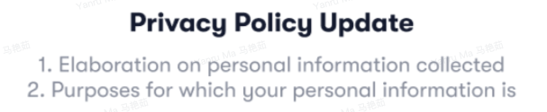</td>
</tr>
<tr>
<td style="text-align: left;">keyMessage</td>
<td style="text-align: left;">Yes</td>
<td style="text-align: left;">
消息的解释文案，灰色字体

支持换行，最大展示xxx字符，超出展示...
</td>
<td style="text-align: left;">自定义</td>
</tr>
<tr>
<td style="text-align: left;">extraInfo</td>
<td style="text-align: left;">不传</td>
<td style="text-align: left;">消息的额外信息</td>
<td style="text-align: left;">
Label + value + value icon（optional）

Reference：

支付方式icon<a href="https://advancegroup.larksuite.com/wiki/UuTOwITd4iXQkZkHaOOu5L8yscf">支付资产logo url</a>

card+apple pay

<strong>[payment method icon.zip]</strong>

支付方式展示格式（参考文档<a href="https://advancegroup.larksuite.com/docx/doxusPYKcxfsyGyab4sXwp2wCSW#doxusKGGAqUi6koMEeGNeVqd4Ph">Payment method management</a> ）

Card： 展示Last 4 digits

Bank account： 展示Last 4 digits

Apple pay： 展示Apple Pay
</td>
<td style="text-align: center;">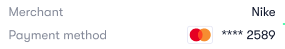</td>
</tr>
<tr>
<td style="text-align: left;">buttonName</td>
<td style="text-align: left;">不传</td>
<td style="text-align: left;">底部CTA名称</td>
<td style="text-align: left;">
自定义

若actionsUrl有值，则展示；若无，则不展示该button；

默认值为See details

<table style="width:42%;">
<colgroup>
<col style="width: 41%" />
</colgroup>
<tbody>
<tr>
<td style="text-align: left;">
例如：

Verify now

Pay now
</td>
</tr>
</tbody>
</table></td>
<td style="text-align: center;"></td>
</tr>
</tbody>
</table>

**消息中心展示**

**/internal/messages/query**

https://apifox.advai.net/apidoc/shared/5acecba2-39c3-4220-9c1e-99e313f2e315/api-36509

**五、Classification**

<table style="width:88%;">
<colgroup>
<col style="width: 88%" />
</colgroup>
<tbody>
<tr>
<td><table style="width:87%;">
<colgroup>
<col style="width: 9%" />
<col style="width: 21%" />
<col style="width: 6%" />
<col style="width: 6%" />
<col style="width: 6%" />
<col style="width: 6%" />
<col style="width: 6%" />
<col style="width: 10%" />
<col style="width: 10%" />
</colgroup>
<tbody>
<tr>
<td style="text-align: left;">
Category lv1

一级分类
</td>
<td style="text-align: left;">
Category lv2

二级分类
</td>
<td style="text-align: left;">caller</td>
<td style="text-align: left;">SMS</td>
<td style="text-align: left;">Email</td>
<td style="text-align: left;">Push</td>
<td style="text-align: left;">Message</td>
<td style="text-align: left;">是否支持人工发送</td>
<td style="text-align: left;">备注</td>
</tr>
<tr>
<td style="text-align: left;">Transaction:"1"</td>
<td style="text-align: left;">
Payment: "100"

deposit： "101"

Receive："102"

Send：“103"

Swap： "104"

Refund： "105"

Card application： "106"

Card Cancel： "107"

Abnormal transaction： "108"

Spending limit："109"
</td>
<td style="text-align: left;">Backend</td>
<td style="text-align: left;"></td>
<td style="text-align: left;">✅</td>
<td style="text-align: left;">✅</td>
<td style="text-align: left;">✅</td>
<td style="text-align: left;">否</td>
<td style="text-align: left;"></td>
</tr>
<tr>
<td style="text-align: left;">Promotions:"2"</td>
<td style="text-align: left;">
Campaign:"200"

Offers:"201"

News:"202"

Rewards:"203"
</td>
<td style="text-align: left;">
Backend

Oboss
</td>
<td style="text-align: left;"></td>
<td style="text-align: left;"></td>
<td style="text-align: left;">✅</td>
<td style="text-align: left;">✅</td>
<td style="text-align: left;">是</td>
<td style="text-align: left;"></td>
</tr>
<tr>
<td style="text-align: left;">account:"3"</td>
<td style="text-align: left;">
Account verification: "300"

Account management: "301"

Card apply: "302"

Card activation "303"

Card mailing "304"

Card freezing/unfreezing"305"
</td>
<td style="text-align: left;">Backend</td>
<td style="text-align: left;"></td>
<td style="text-align: left;">✅</td>
<td style="text-align: left;">✅</td>
<td style="text-align: left;">✅</td>
<td style="text-align: left;">否</td>
<td style="text-align: left;"></td>
</tr>
<tr>
<td style="text-align: left;">Security:"4"</td>
<td style="text-align: left;">
Register: "400"

Login:"401"

Forgot passcode /Reset passcode:"402"

Remote Login Alert："403"

Pin Reset: "404"

Change Mobile Number/Bind mobile number："405"
</td>
<td style="text-align: left;">Backend</td>
<td style="text-align: left;">✅</td>
<td style="text-align: left;">✅</td>
<td style="text-align: left;">✅</td>
<td style="text-align: left;">✅</td>
<td style="text-align: left;">否</td>
<td style="text-align: left;"></td>
</tr>
<tr>
<td style="text-align: left;">System:"5"</td>
<td style="text-align: left;">
Updated&amp;Maintenance："500"

Rules adjusted: "501"

Survey:"502"

Others:"000"
</td>
<td style="text-align: left;">
Oboss

Backend
</td>
<td style="text-align: left;"></td>
<td style="text-align: left;"></td>
<td style="text-align: left;">✅</td>
<td style="text-align: left;">✅</td>
<td style="text-align: left;"><del>是</del></td>
<td style="text-align: left;"></td>
</tr>
</tbody>
</table></td>
</tr>
</tbody>
</table>

**六、User preference record**

<table style="width:89%;">
<colgroup>
<col style="width: 21%" />
<col style="width: 67%" />
</colgroup>
<tbody>
<tr>
<td style="text-align: left;">Module</td>
<td style="text-align: left;">Description</td>
</tr>
<tr>
<td style="text-align: left;">数据初始化</td>
<td style="text-align: left;">
参照原有atome_afterpay_core.user的记录

<a href="https://advancegroup.larksuite.com/wiki/wikuswjdC6UMrkHMMyAwjKWyULf">User basic info</a>

数据初始化

data_consent=1

promotions（email/push/sms）全部开启

system（email/push/sms）全部开启

data_consent=0

promotions（email/push/sms）<u>全部关闭</u>

system（email/push/sms）全部开启

<del>MoEngage数据同步</del>

<del>同步MonEngage user subscribe status至user notification preference</del>

<del>Subscribe = promotions（email）开启</del>

<del>Unsubscribe = promotions（email）关闭</del>
</td>
</tr>
<tr>
<td style="text-align: left;">用户偏好数据</td>
<td style="text-align: left;">
UserID

Channel： SMS/Email/Push

Type： Promotion/System

Status： active/inactive

update time
</td>
</tr>
</tbody>
</table>

**六、需求明细**

**通知内容（包括入参字段）**

需服务端与oboss对接及开发对应的参数，详见：

[AIX【System Notification】](https://advancegroup.sg.larksuite.com/wiki/Rj6KwJPnfisKltktktElRy4tgrG?sheet=355e90)

**push**

<table style="width:89%;">
<colgroup>
<col style="width: 12%" />
<col style="width: 21%" />
<col style="width: 34%" />
<col style="width: 14%" />
<col style="width: 5%" />
</colgroup>
<tbody>
<tr>
<td style="text-align: left;">UI</td>
<td style="text-align: left;">页面</td>
<td style="text-align: left;">描述</td>
<td style="text-align: left;"></td>
<td style="text-align: left;"></td>
</tr>
<tr>
<td style="text-align: left;"></td>
<td style="text-align: center;"></td>
<td style="text-align: left;">
标题：AIX+push

前提条件：

系统设置-通知开关必须已开启。

user status = active。

user status = active，按照user的notification setting发送

user status = inactive/Closed，全部消息推送停止

user status = banned，全部消息推送停止

若为promotion【catogory=2】或者system【catogory=5】，则需用户设置数据包含push

Notification Preference（参照用户偏好数据记录）

当前未受到FC&amp;DND的约束（from oboss能力）

优先级： user status &gt; users notification preference &gt;FC&amp;DND

显示：

AIX图标及主标题、副标题，通过oboss能力实现。

Push可展示的字符长度限制（待定），超出为...

交互：点击push，跳转至oboss配置的链接。
</td>
<td style="text-align: left;">

</td>
<td style="text-align: left;"></td>
</tr>
<tr>
<td style="text-align: center;"></td>
<td style="text-align: center;"></td>
<td style="text-align: left;">
标题：首页增加Notification开关引导弹窗

见：<a href="https://advancegroup.sg.larksuite.com/wiki/LPahw9N9minPZWkwthclU5l6grH">[2025-11-27] AIX+PopUp+banner等能力接入【首页+MGM页面】</a>
</td>
<td style="text-align: left;"></td>
<td style="text-align: left;"></td>
</tr>
</tbody>
</table>

**消息中心**

1.1 **Message 列表页**

入口：home page的右上角， metab-notifications

依赖接口：https://apifox.advai.net/apidoc/shared/70aae3c7-e6b3-4d8c-8bd0-fcfbb5cb3d6c/api-36502

<table style="width:89%;">
<colgroup>
<col style="width: 5%" />
<col style="width: 14%" />
<col style="width: 19%" />
<col style="width: 6%" />
<col style="width: 36%" />
<col style="width: 5%" />
</colgroup>
<tbody>
<tr>
<td style="text-align: left;"></td>
<td style="text-align: left;">UI</td>
<td style="text-align: left;">Demo</td>
<td style="text-align: left;">Module</td>
<td style="text-align: left;">Description</td>
<td style="text-align: left;">Remarks</td>
</tr>
<tr>
<td style="text-align: left;"></td>
<td rowspan="3" style="text-align: center;">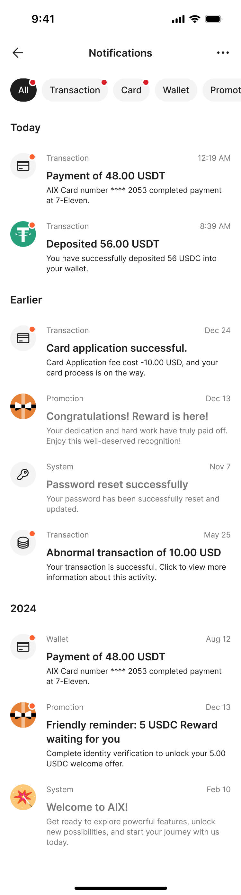</td>
<td rowspan="3" style="text-align: center;">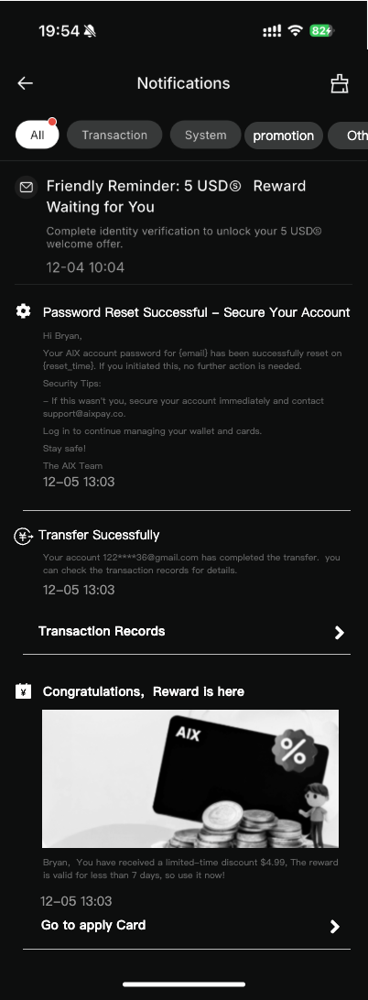</td>
<td style="text-align: left;">Title bar</td>
<td style="text-align: left;">
Title： Notifications

一键已读：

Icon: 点击后将所有消息标记为已读，toast 文案：全部已读。

红点提示：

有未读消息，则显示小红点。

已读消息，不显示红点。

<del>展示数字：若该类目消息全部已读，则不展示。若该类目有未读消息，则展示当前类目未读消息总数。<strong>超过100条展示99+</strong></del>

<del>不展示数字：向上滑动页面，顶部tab会缩小，缩小后只展示红点</del>
</td>
<td style="text-align: center;">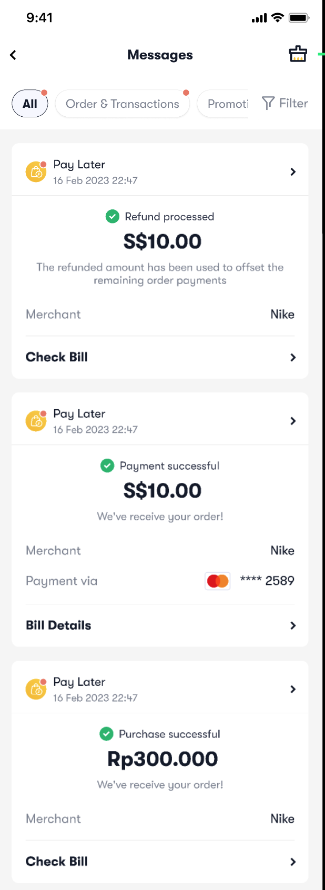</td>
</tr>
<tr>
<td style="text-align: left;"></td>
<td style="text-align: left;">Category</td>
<td style="text-align: left;">
分类tag 按照Category Lv1展示

All（默认选中），包含所有消息，按照接收消息的时间倒序排列（即最新的在最上面）

Transaction:"1"

Promotion:"2"

Account:"3"

Security:"4"

System:"5"

排序：从左到右依次排序。

若分类下有未读消息，则Category tag展示红点；

分类标签为：单选，点击后则刷新当前列表页，仅展示对应category下的msg内容，按照接收消息的时间倒序排列（即最新的在最上面）
</td>
<td style="text-align: left;"></td>
</tr>
<tr>
<td style="text-align: left;"></td>
<td style="text-align: left;">Message list</td>
<td style="text-align: left;">
消息排序

按照接收消息的时间倒序排列（即最新的在最上面）

刷新机制

消息内容在每次进入消息列表页时刷新；

支持下拉刷新；

<del>删除机制</del>

<del>左滑后展示删除按钮，点击后可删除消息，若用户删除消息，则立即从列表页消失。后续消息顺序补上。</del>

block红点逻辑：

未读状态：Icon会展示红点

已读状态：Icon红点消失

未读状态标识及数字需实时刷新，点击消息后列表页未读标识消失；
</td>
<td style="text-align: left;"></td>
</tr>
</tbody>
</table>

1.2 **Notification block**

1.2.1 **交易类（非限额）**

|  |
|:---|
| 一级分类=Transaction，二级分类=Payment、Withdrawal、deposit、Transfer 、Swap、Refund、Card application、abnormal transaction |

<table style="width:89%;">
<colgroup>
<col style="width: 4%" />
<col style="width: 17%" />
<col style="width: 4%" />
<col style="width: 4%" />
<col style="width: 8%" />
<col style="width: 12%" />
<col style="width: 5%" />
<col style="width: 23%" />
<col style="width: 8%" />
</colgroup>
<tbody>
<tr>
<td style="text-align: left;"></td>
<td style="text-align: left;">Template</td>
<td style="text-align: left;">UI</td>
<td style="text-align: left;">demo</td>
<td style="text-align: left;">Module</td>
<td style="text-align: left;">含义</td>
<td style="text-align: left;">是否有值</td>
<td style="text-align: left;">Description</td>
<td style="text-align: left;">Remarks</td>
</tr>
<tr>
<td style="text-align: left;"></td>
<td rowspan="12" style="text-align: center;">

</td>
<td style="text-align: left;"></td>
<td style="text-align: left;"></td>
<td style="text-align: left;">Biz line icon</td>
<td style="text-align: left;">业务线</td>
<td style="text-align: left;">是</td>
<td style="text-align: left;"></td>
<td style="text-align: left;"></td>
</tr>
<tr>
<td style="text-align: left;"></td>
<td style="text-align: left;"></td>
<td style="text-align: left;"></td>
<td style="text-align: left;">type</td>
<td style="text-align: left;">
点击后跳转页面：

OPERATION：某个APP内页面

MESSAGE_DETAIL：进入消息详情页
</td>
<td style="text-align: left;">是，传：OPERATION</td>
<td style="text-align: left;"></td>
<td style="text-align: left;"></td>
</tr>
<tr>
<td style="text-align: left;"></td>
<td style="text-align: center;">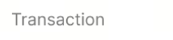</td>
<td style="text-align: center;"></td>
<td style="text-align: left;">categories</td>
<td style="text-align: left;">消息分类（一级）</td>
<td style="text-align: left;">是</td>
<td style="text-align: left;"></td>
<td style="text-align: left;"></td>
</tr>
<tr>
<td style="text-align: left;"></td>
<td style="text-align: center;"></td>
<td style="text-align: center;"></td>
<td style="text-align: left;">BusinessLineIconUrl</td>
<td style="text-align: left;">消息分类（二级）</td>
<td style="text-align: left;">是</td>
<td style="text-align: left;">
每个交易类别定义一个图标

详见：交易图标分类
</td>
<td style="text-align: left;"></td>
</tr>
<tr>
<td style="text-align: left;"></td>
<td style="text-align: center;"></td>
<td style="text-align: center;"></td>
<td style="text-align: left;">Title/Key Title</td>
<td style="text-align: left;">标题</td>
<td style="text-align: left;">是</td>
<td style="text-align: left;">
加粗字体

若有Key title，则展示Key title，若无Key title，则取Title展示；

显示全部文案
</td>
<td style="text-align: left;">
详见：

<a href="https://advancegroup.sg.larksuite.com/wiki/Rj6KwJPnfisKltktktElRy4tgrG?sheet=lnYqsG">AIX【System Notification】</a>
</td>
</tr>
<tr>
<td style="text-align: left;"></td>
<td style="text-align: center;"></td>
<td style="text-align: center;"></td>
<td style="text-align: left;">Key message / Message</td>
<td style="text-align: left;">正文</td>
<td style="text-align: left;">是</td>
<td style="text-align: left;">
灰色小字

若有Key message，则展示Key message，若无Key message，则取Message展示；

默认最多展示3行，超出部分展示...
</td>
<td style="text-align: left;">
详见：

<a href="https://advancegroup.sg.larksuite.com/wiki/Rj6KwJPnfisKltktktElRy4tgrG?sheet=lnYqsG">AIX【System Notification+content】</a>
</td>
</tr>
<tr>
<td style="text-align: left;"></td>
<td style="text-align: left;"></td>
<td style="text-align: center;"></td>
<td style="text-align: left;">Image</td>
<td style="text-align: left;">图片</td>
<td style="text-align: left;">否</td>
<td style="text-align: left;">若有包含thumbnailsURL，则展示，无则隐藏</td>
<td style="text-align: left;"></td>
</tr>
<tr>
<td style="text-align: left;"></td>
<td style="text-align: left;"></td>
<td style="text-align: center;">

</td>
<td style="text-align: left;">Timestamp</td>
<td style="text-align: left;">时间戳</td>
<td style="text-align: left;">是</td>
<td style="text-align: left;">
用户收到消息的时间

展示规则（不变）：

当天的消息展示hh:mm，以Today分组。

今年且非当天的展示文案"month-day"，以Earlier分组。

非今年，其他时间展示同其他日期格式："month-day"，按照年分组。
</td>
<td style="text-align: left;"></td>
</tr>
<tr>
<td style="text-align: left;"></td>
<td style="text-align: left;"></td>
<td style="text-align: center;"></td>
<td style="text-align: left;">跳转详情页</td>
<td style="text-align: left;">跳转详情页</td>
<td style="text-align: left;">是</td>
<td style="text-align: left;">
跳转至对应的该笔的交易详情页

取值来源：ctaActionUrl

点击后内置浏览器打开actionsUrl
</td>
<td style="text-align: left;"></td>
</tr>
<tr>
<td style="text-align: left;"></td>
<td style="text-align: left;"></td>
<td style="text-align: center;"></td>
<td style="text-align: left;">Status icon+name</td>
<td style="text-align: left;">状态标识</td>
<td style="text-align: left;">否</td>
<td style="text-align: left;">
取msgStatusIcon以及msgStatusName，有则展示，无则隐藏。

icon枚举

SUCCESS, FAILED, REMINDER, PROCESSING, NULL（不展示icon）

若未传，则默认值为Null

name有则展示，无则隐藏，无默认值
</td>
<td style="text-align: left;"></td>
</tr>
<tr>
<td style="text-align: left;"></td>
<td style="text-align: left;"></td>
<td style="text-align: center;"></td>
<td style="text-align: left;">Extra info</td>
<td style="text-align: left;">附属信息</td>
<td style="text-align: left;">否</td>
<td style="text-align: left;">
由Label + Value + Value icon组成组成

Label展示在左侧，Value展示在右侧

最多支持两组，超出的不展示。
</td>
<td style="text-align: left;"></td>
</tr>
<tr>
<td style="text-align: left;"></td>
<td style="text-align: left;"></td>
<td style="text-align: center;"></td>
<td style="text-align: left;">CTA</td>
<td style="text-align: left;">跳转Inapp页面</td>
<td style="text-align: left;">否</td>
<td style="text-align: left;"></td>
<td style="text-align: left;"></td>
</tr>
<tr>
<td style="text-align: left;"></td>
<td style="text-align: left;"></td>
<td style="text-align: left;"></td>
<td style="text-align: left;"></td>
<td style="text-align: left;">其他</td>
<td style="text-align: left;"></td>
<td style="text-align: left;">否</td>
<td style="text-align: left;"></td>
<td style="text-align: left;"></td>
</tr>
</tbody>
</table>

1.2.2 **交易类-异常交易-限额提醒**

|                                               |
|:----------------------------------------------|
| 一级分类=Transaction，二级分类=Spending limit |

<table style="width:89%;">
<colgroup>
<col style="width: 4%" />
<col style="width: 17%" />
<col style="width: 4%" />
<col style="width: 4%" />
<col style="width: 7%" />
<col style="width: 13%" />
<col style="width: 5%" />
<col style="width: 23%" />
<col style="width: 8%" />
</colgroup>
<tbody>
<tr>
<td style="text-align: left;"></td>
<td style="text-align: left;">Template</td>
<td style="text-align: left;">UI</td>
<td style="text-align: left;">demo</td>
<td style="text-align: left;">Module</td>
<td style="text-align: left;">含义</td>
<td style="text-align: left;">是否有值</td>
<td style="text-align: left;">Description</td>
<td style="text-align: left;">Remarks</td>
</tr>
<tr>
<td style="text-align: left;"></td>
<td rowspan="12" style="text-align: center;"></td>
<td style="text-align: left;"></td>
<td style="text-align: left;"></td>
<td style="text-align: left;">Biz line icon</td>
<td style="text-align: left;">业务线</td>
<td style="text-align: left;">是</td>
<td style="text-align: left;"></td>
<td style="text-align: left;"></td>
</tr>
<tr>
<td style="text-align: left;"></td>
<td style="text-align: left;"></td>
<td style="text-align: left;"></td>
<td style="text-align: left;">type</td>
<td style="text-align: left;">
点击后跳转页面：

OPERATION：某个APP内页面

MESSAGE_DETAIL：进入消息详情页
</td>
<td style="text-align: left;">是，传：MESSAGE_DETAIL</td>
<td style="text-align: left;"></td>
<td style="text-align: left;"></td>
</tr>
<tr>
<td style="text-align: left;"></td>
<td style="text-align: center;">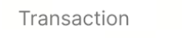</td>
<td style="text-align: center;"></td>
<td style="text-align: left;">categories</td>
<td style="text-align: left;">消息分类（一级）</td>
<td style="text-align: left;">是</td>
<td style="text-align: left;"></td>
<td style="text-align: left;"></td>
</tr>
<tr>
<td style="text-align: left;"></td>
<td style="text-align: center;"></td>
<td style="text-align: center;"></td>
<td style="text-align: left;">BusinessLineIconUrl</td>
<td style="text-align: left;">消息分类（二级）</td>
<td style="text-align: left;">是</td>
<td style="text-align: left;">
每个交易类别定义一个图标

详见：交易图标分类
</td>
<td style="text-align: left;"></td>
</tr>
<tr>
<td style="text-align: left;"></td>
<td style="text-align: center;"></td>
<td style="text-align: center;"></td>
<td style="text-align: left;">Key title / Title</td>
<td style="text-align: left;">标题</td>
<td style="text-align: left;">是</td>
<td style="text-align: left;">
加粗字体

若有Key title，则展示Key title，若无Key title，则取Title展示；

显示全部文案
</td>
<td style="text-align: left;">
详见：

<a href="https://advancegroup.sg.larksuite.com/wiki/Rj6KwJPnfisKltktktElRy4tgrG?sheet=lnYqsG">AIX【System Notification+content】</a>
</td>
</tr>
<tr>
<td style="text-align: left;"></td>
<td style="text-align: center;"></td>
<td style="text-align: center;"></td>
<td style="text-align: left;">Key message / Message</td>
<td style="text-align: left;">正文</td>
<td style="text-align: left;">是</td>
<td style="text-align: left;">
灰色小字

若有Key message，则展示Key message，若无Key message，则取Message展示；

默认最多展示3行，超出部分展示...
</td>
<td style="text-align: left;">
详见：

<a href="https://advancegroup.sg.larksuite.com/wiki/Rj6KwJPnfisKltktktElRy4tgrG?sheet=lnYqsG">AIX【System Notification+content】</a>
</td>
</tr>
<tr>
<td style="text-align: left;"></td>
<td style="text-align: left;"></td>
<td style="text-align: center;"></td>
<td style="text-align: left;">Image</td>
<td style="text-align: left;">图片</td>
<td style="text-align: left;">否</td>
<td style="text-align: left;">若有包含thumbnailsURL，则展示，无则隐藏</td>
<td style="text-align: left;"></td>
</tr>
<tr>
<td style="text-align: left;"></td>
<td style="text-align: left;"></td>
<td style="text-align: center;">

</td>
<td style="text-align: left;">Timestamp</td>
<td style="text-align: left;">时间戳</td>
<td style="text-align: left;">是</td>
<td style="text-align: left;">
用户收到消息的时间

展示规则（不变）：

当天的消息展示hh:mm，以Today分组。

今年且非当天的展示文案"month-day"，以Earlier分组。

非今年，其他时间展示同其他日期格式："month-day"，按照年分组。
</td>
<td style="text-align: left;"></td>
</tr>
<tr>
<td style="text-align: left;"></td>
<td style="text-align: left;"></td>
<td style="text-align: center;"></td>
<td style="text-align: left;">跳转详情页</td>
<td style="text-align: left;">跳转详情页</td>
<td style="text-align: left;">是</td>
<td style="text-align: left;">跳转至消息二级页，展示消息详情</td>
<td style="text-align: left;"></td>
</tr>
<tr>
<td style="text-align: left;"></td>
<td style="text-align: left;"></td>
<td style="text-align: center;"></td>
<td style="text-align: left;">Status icon+name</td>
<td style="text-align: left;">状态标识</td>
<td style="text-align: left;">否</td>
<td style="text-align: left;">
取msgStatusIcon以及msgStatusName，有则展示，无则隐藏。

icon枚举

SUCCESS, FAILED, REMINDER, PROCESSING, NULL（不展示icon）

若未传，则默认值为Null

name有则展示，无则隐藏，无默认值
</td>
<td style="text-align: left;"></td>
</tr>
<tr>
<td style="text-align: left;"></td>
<td style="text-align: left;"></td>
<td style="text-align: center;"></td>
<td style="text-align: left;">Extra info</td>
<td style="text-align: left;">附属信息</td>
<td style="text-align: left;">否</td>
<td style="text-align: left;">
由Label + Value + Value icon组成组成

Label展示在左侧，Value展示在右侧

最多支持两组，超出的不展示。
</td>
<td style="text-align: left;"></td>
</tr>
<tr>
<td style="text-align: left;"></td>
<td style="text-align: left;"></td>
<td style="text-align: center;"></td>
<td style="text-align: left;">CTA</td>
<td style="text-align: left;">跳转Inapp页面</td>
<td style="text-align: left;">否</td>
<td style="text-align: left;">不显示</td>
<td style="text-align: left;"></td>
</tr>
<tr>
<td style="text-align: left;"></td>
<td style="text-align: left;"></td>
<td style="text-align: left;"></td>
<td style="text-align: left;"></td>
<td style="text-align: left;">其他</td>
<td style="text-align: left;"></td>
<td style="text-align: left;">否</td>
<td style="text-align: left;"></td>
<td style="text-align: left;"></td>
</tr>
</tbody>
</table>

1.2.3 **账户类**

|                  |
|:-----------------|
| 一级分类=account |

<table style="width:89%;">
<colgroup>
<col style="width: 4%" />
<col style="width: 16%" />
<col style="width: 4%" />
<col style="width: 4%" />
<col style="width: 7%" />
<col style="width: 12%" />
<col style="width: 9%" />
<col style="width: 22%" />
<col style="width: 7%" />
</colgroup>
<tbody>
<tr>
<td style="text-align: left;"></td>
<td style="text-align: left;">Template</td>
<td style="text-align: left;">UI</td>
<td style="text-align: left;">demo</td>
<td style="text-align: left;">Module</td>
<td style="text-align: left;">含义</td>
<td style="text-align: left;">是否有值</td>
<td style="text-align: left;">Description</td>
<td style="text-align: left;">Remarks</td>
</tr>
<tr>
<td style="text-align: left;"></td>
<td rowspan="12" style="text-align: center;"></td>
<td style="text-align: left;"></td>
<td style="text-align: left;"></td>
<td style="text-align: left;">Biz line icon</td>
<td style="text-align: left;">业务线</td>
<td style="text-align: left;">是</td>
<td style="text-align: left;"></td>
<td style="text-align: left;"></td>
</tr>
<tr>
<td style="text-align: left;"></td>
<td style="text-align: left;"></td>
<td style="text-align: left;"></td>
<td style="text-align: left;">type</td>
<td style="text-align: left;">
点击后跳转页面：

OPERATION：某个APP内页面

MESSAGE_DETAIL：进入消息详情页
</td>
<td style="text-align: left;">
是，

申卡成功，传：OPERATION

其他传：MESSAGE_DETAIL

详见：

<a href="https://advancegroup.sg.larksuite.com/wiki/Rj6KwJPnfisKltktktElRy4tgrG?sheet=lnYqsG">AIX【System Notification+content】</a>
</td>
<td style="text-align: left;"></td>
<td style="text-align: left;"></td>
</tr>
<tr>
<td style="text-align: left;"></td>
<td style="text-align: left;"></td>
<td style="text-align: center;">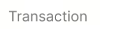</td>
<td style="text-align: left;">categories</td>
<td style="text-align: left;">消息分类（一级）</td>
<td style="text-align: left;">是</td>
<td style="text-align: left;"></td>
<td style="text-align: left;"></td>
</tr>
<tr>
<td style="text-align: left;"></td>
<td style="text-align: center;"></td>
<td style="text-align: center;"></td>
<td style="text-align: left;">BusinessLineIconUrl</td>
<td style="text-align: left;">消息分类（二级）</td>
<td style="text-align: left;">是</td>
<td style="text-align: left;">
每个交易类别定义一个图标

详见：交易图标分类
</td>
<td style="text-align: left;"></td>
</tr>
<tr>
<td style="text-align: left;"></td>
<td style="text-align: center;"></td>
<td style="text-align: center;"></td>
<td style="text-align: left;">Key title / Title</td>
<td style="text-align: left;">标题</td>
<td style="text-align: left;">是</td>
<td style="text-align: left;">
加粗字体

若有Key title，则展示Key title，若无Key title，则取Title展示；

显示全部文案
</td>
<td style="text-align: left;">
详见：

<a href="https://advancegroup.sg.larksuite.com/wiki/Rj6KwJPnfisKltktktElRy4tgrG?sheet=lnYqsG">AIX【System Notification+content】</a>
</td>
</tr>
<tr>
<td style="text-align: left;"></td>
<td style="text-align: center;"></td>
<td style="text-align: center;"></td>
<td style="text-align: left;">Key message / Message</td>
<td style="text-align: left;">正文</td>
<td style="text-align: left;">是</td>
<td style="text-align: left;">
灰色小字

若有Key message，则展示Key message，若无Key message，则取Message展示；

默认最多展示3行，超出部分展示...
</td>
<td style="text-align: left;">
详见：

<a href="https://advancegroup.sg.larksuite.com/wiki/Rj6KwJPnfisKltktktElRy4tgrG?sheet=lnYqsG">AIX【System Notification+content】</a>
</td>
</tr>
<tr>
<td style="text-align: left;"></td>
<td style="text-align: left;"></td>
<td style="text-align: center;"></td>
<td style="text-align: left;">Image</td>
<td style="text-align: left;">图片</td>
<td style="text-align: left;">否</td>
<td style="text-align: left;">若有包含thumbnailsURL，则展示，无则隐藏</td>
<td style="text-align: left;"></td>
</tr>
<tr>
<td style="text-align: left;"></td>
<td style="text-align: left;"></td>
<td style="text-align: center;">

</td>
<td style="text-align: left;">Timestamp</td>
<td style="text-align: left;">时间戳</td>
<td style="text-align: left;">是</td>
<td style="text-align: left;">
用户收到消息的时间

展示规则（不变）：

当天的消息展示hh:mm，以Today分组。

今年且非当天的展示文案"month-day"，以Earlier分组。

非今年，其他时间展示同其他日期格式："month-day"，按照年分组。
</td>
<td style="text-align: left;"></td>
</tr>
<tr>
<td style="text-align: left;"></td>
<td style="text-align: left;"></td>
<td style="text-align: center;"></td>
<td style="text-align: left;">跳转详情页</td>
<td style="text-align: left;">跳转详情页</td>
<td style="text-align: left;">是</td>
<td style="text-align: left;">跳转至消息二级页，展示消息详情</td>
<td style="text-align: left;"></td>
</tr>
<tr>
<td style="text-align: left;"></td>
<td style="text-align: left;"></td>
<td style="text-align: center;"></td>
<td style="text-align: left;">Status icon+name</td>
<td style="text-align: left;">状态标识</td>
<td style="text-align: left;">否</td>
<td style="text-align: left;">
取msgStatusIcon以及msgStatusName，有则展示，无则隐藏。

icon枚举

SUCCESS, FAILED, REMINDER, PROCESSING, NULL（不展示icon）

若未传，则默认值为Null

name有则展示，无则隐藏，无默认值
</td>
<td style="text-align: left;"></td>
</tr>
<tr>
<td style="text-align: left;"></td>
<td style="text-align: left;"></td>
<td style="text-align: center;"></td>
<td style="text-align: left;">Extra info</td>
<td style="text-align: left;">附属信息</td>
<td style="text-align: left;">否</td>
<td style="text-align: left;">
由Label + Value + Value icon组成组成

Label展示在左侧，Value展示在右侧

最多支持两组，超出的不展示。
</td>
<td style="text-align: left;"></td>
</tr>
<tr>
<td style="text-align: left;"></td>
<td style="text-align: left;"></td>
<td style="text-align: center;"></td>
<td style="text-align: left;">CTA</td>
<td style="text-align: left;">跳转Inapp页面</td>
<td style="text-align: left;">否</td>
<td style="text-align: left;">不显示</td>
<td style="text-align: left;"></td>
</tr>
<tr>
<td style="text-align: left;"></td>
<td style="text-align: left;"></td>
<td style="text-align: left;"></td>
<td style="text-align: left;"></td>
<td style="text-align: left;">其他</td>
<td style="text-align: left;"></td>
<td style="text-align: left;">否</td>
<td style="text-align: left;"></td>
<td style="text-align: left;"></td>
</tr>
</tbody>
</table>

1.2.4 **系统类**

|                 |
|:----------------|
| 一级分类=System |

<table style="width:89%;">
<colgroup>
<col style="width: 4%" />
<col style="width: 17%" />
<col style="width: 4%" />
<col style="width: 4%" />
<col style="width: 6%" />
<col style="width: 12%" />
<col style="width: 8%" />
<col style="width: 23%" />
<col style="width: 8%" />
</colgroup>
<tbody>
<tr>
<td style="text-align: left;"></td>
<td style="text-align: left;">Template</td>
<td style="text-align: left;">UI</td>
<td style="text-align: left;">demo</td>
<td style="text-align: left;">Module</td>
<td style="text-align: left;">含义</td>
<td style="text-align: left;">是否有值</td>
<td style="text-align: left;">Description</td>
<td style="text-align: left;">Remarks</td>
</tr>
<tr>
<td style="text-align: left;"></td>
<td rowspan="12" style="text-align: center;"></td>
<td style="text-align: left;"></td>
<td style="text-align: left;"></td>
<td style="text-align: left;">Biz line icon</td>
<td style="text-align: left;">业务线</td>
<td style="text-align: left;">是</td>
<td style="text-align: left;"></td>
<td style="text-align: left;"></td>
</tr>
<tr>
<td style="text-align: left;"></td>
<td style="text-align: left;"></td>
<td style="text-align: left;"></td>
<td style="text-align: left;">type</td>
<td style="text-align: left;">
点击后跳转页面：

OPERATION：某个APP内页面

MESSAGE_DETAIL：进入消息详情页
</td>
<td style="text-align: left;">
是，传值详见：

<a href="https://advancegroup.sg.larksuite.com/wiki/Rj6KwJPnfisKltktktElRy4tgrG?sheet=lnYqsG">AIX【System Notification+content】</a>
</td>
<td style="text-align: left;"></td>
<td style="text-align: left;"></td>
</tr>
<tr>
<td style="text-align: left;"></td>
<td style="text-align: center;">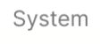</td>
<td style="text-align: center;"></td>
<td style="text-align: left;">categories</td>
<td style="text-align: left;">消息分类（一级）</td>
<td style="text-align: left;">是</td>
<td style="text-align: left;"></td>
<td style="text-align: left;"></td>
</tr>
<tr>
<td style="text-align: left;"></td>
<td style="text-align: center;"></td>
<td style="text-align: center;"></td>
<td style="text-align: left;">BusinessLineIconUrl</td>
<td style="text-align: left;">消息分类（二级）</td>
<td style="text-align: left;">是</td>
<td style="text-align: left;">
每个交易类别定义一个图标

详见：交易图标分类
</td>
<td style="text-align: left;"></td>
</tr>
<tr>
<td style="text-align: left;"></td>
<td style="text-align: center;"></td>
<td style="text-align: center;"></td>
<td style="text-align: left;">Key title / Title</td>
<td style="text-align: left;">标题</td>
<td style="text-align: left;">是</td>
<td style="text-align: left;">
加粗字体

若有Key title，则展示Key title，若无Key title，则取Title展示；

显示全部文案
</td>
<td style="text-align: left;">
详见：

<a href="https://advancegroup.sg.larksuite.com/wiki/Rj6KwJPnfisKltktktElRy4tgrG?sheet=lnYqsG">AIX【System Notification+content】</a>
</td>
</tr>
<tr>
<td style="text-align: left;"></td>
<td style="text-align: center;"></td>
<td style="text-align: center;"></td>
<td style="text-align: left;">Key message / Message</td>
<td style="text-align: left;">正文</td>
<td style="text-align: left;">是</td>
<td style="text-align: left;">
灰色小字

若有Key message，则展示Key message，若无Key message，则取Message展示；

默认最多展示3行，超出部分展示...
</td>
<td style="text-align: left;">
详见：

<a href="https://advancegroup.sg.larksuite.com/wiki/Rj6KwJPnfisKltktktElRy4tgrG?sheet=lnYqsG">AIX【System Notification+content】</a>
</td>
</tr>
<tr>
<td style="text-align: left;"></td>
<td style="text-align: left;"></td>
<td style="text-align: center;"></td>
<td style="text-align: left;">Image</td>
<td style="text-align: left;">图片</td>
<td style="text-align: left;">可选</td>
<td style="text-align: left;">
不展示图片

如传图片，则在消息详情页面展示图片。
</td>
<td style="text-align: left;"></td>
</tr>
<tr>
<td style="text-align: left;"></td>
<td style="text-align: left;"></td>
<td style="text-align: center;">

</td>
<td style="text-align: left;">Timestamp</td>
<td style="text-align: left;">时间戳</td>
<td style="text-align: left;">是</td>
<td style="text-align: left;">
用户收到消息的时间

展示规则（不变）：

当天的消息展示hh:mm，以Today分组。

今年且非当天的展示文案"month-day"，以Earlier分组。

非今年，其他时间展示同其他日期格式："month-day"，按照年分组。
</td>
<td style="text-align: left;"></td>
</tr>
<tr>
<td style="text-align: left;"></td>
<td style="text-align: left;"></td>
<td style="text-align: center;"></td>
<td style="text-align: left;">跳转详情页</td>
<td style="text-align: left;">跳转详情页</td>
<td style="text-align: left;">是</td>
<td style="text-align: left;">跳转至消息二级页，展示消息详情</td>
<td style="text-align: left;"></td>
</tr>
<tr>
<td style="text-align: left;"></td>
<td style="text-align: left;"></td>
<td style="text-align: center;"></td>
<td style="text-align: left;">Status icon+name</td>
<td style="text-align: left;">状态标识</td>
<td style="text-align: left;">否</td>
<td style="text-align: left;">
取msgStatusIcon以及msgStatusName，有则展示，无则隐藏。

icon枚举

SUCCESS, FAILED, REMINDER, PROCESSING, NULL（不展示icon）

若未传，则默认值为Null

name有则展示，无则隐藏，无默认值
</td>
<td style="text-align: left;"></td>
</tr>
<tr>
<td style="text-align: left;"></td>
<td style="text-align: left;"></td>
<td style="text-align: center;"></td>
<td style="text-align: left;">Extra info</td>
<td style="text-align: left;">附属信息</td>
<td style="text-align: left;">否</td>
<td style="text-align: left;">
由Label + Value + Value icon组成组成

Label展示在左侧，Value展示在右侧

最多支持两组，超出的不展示。
</td>
<td style="text-align: left;"></td>
</tr>
<tr>
<td style="text-align: left;"></td>
<td style="text-align: left;"></td>
<td style="text-align: center;"></td>
<td style="text-align: left;">CTA</td>
<td style="text-align: left;">跳转Inapp页面</td>
<td style="text-align: left;">否</td>
<td style="text-align: left;">不显示</td>
<td style="text-align: left;"></td>
</tr>
<tr>
<td style="text-align: left;"></td>
<td style="text-align: left;"></td>
<td style="text-align: left;"></td>
<td style="text-align: left;"></td>
<td style="text-align: left;">其他</td>
<td style="text-align: left;"></td>
<td style="text-align: left;">否</td>
<td style="text-align: left;"></td>
<td style="text-align: left;"></td>
</tr>
</tbody>
</table>

1.2.5 **营销活动类**

|                     |
|:--------------------|
| 一级分类=Promotions |

<table style="width:89%;">
<colgroup>
<col style="width: 4%" />
<col style="width: 16%" />
<col style="width: 4%" />
<col style="width: 4%" />
<col style="width: 9%" />
<col style="width: 12%" />
<col style="width: 8%" />
<col style="width: 22%" />
<col style="width: 7%" />
</colgroup>
<tbody>
<tr>
<td style="text-align: left;"></td>
<td style="text-align: left;">Template</td>
<td style="text-align: left;">UI</td>
<td style="text-align: left;">demo</td>
<td style="text-align: left;">Module</td>
<td style="text-align: left;">含义</td>
<td style="text-align: left;">是否有值</td>
<td style="text-align: left;">Description</td>
<td style="text-align: left;">Remarks</td>
</tr>
<tr>
<td style="text-align: left;"></td>
<td rowspan="12" style="text-align: center;"></td>
<td style="text-align: left;"></td>
<td style="text-align: left;"></td>
<td style="text-align: left;">Biz line icon</td>
<td style="text-align: left;">业务线</td>
<td style="text-align: left;">是</td>
<td style="text-align: left;"></td>
<td style="text-align: left;"></td>
</tr>
<tr>
<td style="text-align: left;"></td>
<td style="text-align: left;"></td>
<td style="text-align: left;"></td>
<td style="text-align: left;">type</td>
<td style="text-align: left;">
点击后跳转页面：

OPERATION：某个APP内页面

MESSAGE_DETAIL：进入消息详情页
</td>
<td style="text-align: left;">
是，传值详见：

<a href="https://advancegroup.sg.larksuite.com/wiki/Rj6KwJPnfisKltktktElRy4tgrG?sheet=lnYqsG">AIX【System Notification+content】</a>
</td>
<td style="text-align: left;"></td>
<td style="text-align: left;"></td>
</tr>
<tr>
<td style="text-align: left;"></td>
<td style="text-align: center;"></td>
<td style="text-align: center;"></td>
<td style="text-align: left;">categories</td>
<td style="text-align: left;">消息分类（一级）</td>
<td style="text-align: left;">是</td>
<td style="text-align: left;"></td>
<td style="text-align: left;"></td>
</tr>
<tr>
<td style="text-align: left;"></td>
<td style="text-align: center;"></td>
<td style="text-align: center;"></td>
<td style="text-align: left;">BusinessLineIconUrl</td>
<td style="text-align: left;">消息分类（二级）</td>
<td style="text-align: left;">是</td>
<td style="text-align: left;">
每个交易类别定义一个图标

详见：交易图标分类
</td>
<td style="text-align: left;"></td>
</tr>
<tr>
<td style="text-align: left;"></td>
<td style="text-align: center;"></td>
<td style="text-align: center;"></td>
<td style="text-align: left;">Key title / Title</td>
<td style="text-align: left;">标题</td>
<td style="text-align: left;">是</td>
<td style="text-align: left;">
加粗字体

若有Key title，则展示Key title，若无Key title，则取Title展示；

显示全部文案
</td>
<td style="text-align: left;">
详见：

<a href="https://advancegroup.sg.larksuite.com/wiki/Rj6KwJPnfisKltktktElRy4tgrG?sheet=lnYqsG">AIX【System Notification+content】</a>
</td>
</tr>
<tr>
<td style="text-align: left;"></td>
<td style="text-align: center;"></td>
<td style="text-align: center;"></td>
<td style="text-align: left;">Key message / Message</td>
<td style="text-align: left;">正文</td>
<td style="text-align: left;">是</td>
<td style="text-align: left;">
灰色小字

若有Key message，则展示Key message，若无Key message，则取Message展示；

默认最多展示3行，超出部分展示...
</td>
<td style="text-align: left;">
详见：

<a href="https://advancegroup.sg.larksuite.com/wiki/Rj6KwJPnfisKltktktElRy4tgrG?sheet=lnYqsG">AIX【System Notification+content】</a>
</td>
</tr>
<tr>
<td style="text-align: left;"></td>
<td style="text-align: left;"></td>
<td style="text-align: center;"></td>
<td style="text-align: left;">Image</td>
<td style="text-align: left;">图片</td>
<td style="text-align: left;">可选</td>
<td style="text-align: left;">
不展示图片

如传图片，则在消息详情页面展示图片。
</td>
<td style="text-align: left;"></td>
</tr>
<tr>
<td style="text-align: left;"></td>
<td style="text-align: left;"></td>
<td style="text-align: center;">

</td>
<td style="text-align: left;">Timestamp</td>
<td style="text-align: left;">时间戳</td>
<td style="text-align: left;">是</td>
<td style="text-align: left;">
用户收到消息的时间

展示规则（不变）：

当天的消息展示hh:mm，以Today分组。

今年且非当天的展示文案"month-day"，以Earlier分组。

非今年，其他时间展示同其他日期格式："month-day"，按照年分组。
</td>
<td style="text-align: left;"></td>
</tr>
<tr>
<td style="text-align: left;"></td>
<td style="text-align: left;"></td>
<td style="text-align: center;"></td>
<td style="text-align: left;">跳转详情页</td>
<td style="text-align: left;">跳转详情页</td>
<td style="text-align: left;">是</td>
<td style="text-align: left;">跳转至消息二级页，展示消息详情</td>
<td style="text-align: left;"></td>
</tr>
<tr>
<td style="text-align: left;"></td>
<td style="text-align: left;"></td>
<td style="text-align: center;"></td>
<td style="text-align: left;">Status icon+name</td>
<td style="text-align: left;">状态标识</td>
<td style="text-align: left;">否</td>
<td style="text-align: left;">
取msgStatusIcon以及msgStatusName，有则展示，无则隐藏。

icon枚举

SUCCESS, FAILED, REMINDER, PROCESSING, NULL（不展示icon）

若未传，则默认值为Null

name有则展示，无则隐藏，无默认值
</td>
<td style="text-align: left;"></td>
</tr>
<tr>
<td style="text-align: left;"></td>
<td style="text-align: left;"></td>
<td style="text-align: center;"></td>
<td style="text-align: left;">Extra info</td>
<td style="text-align: left;">附属信息</td>
<td style="text-align: left;">否</td>
<td style="text-align: left;">
由Label + Value + Value icon组成组成

Label展示在左侧，Value展示在右侧

最多支持两组，超出的不展示。
</td>
<td style="text-align: left;"></td>
</tr>
<tr>
<td style="text-align: left;"></td>
<td style="text-align: left;"></td>
<td style="text-align: center;"></td>
<td style="text-align: left;">CTA</td>
<td style="text-align: left;">跳转Inapp页面</td>
<td style="text-align: left;">否</td>
<td style="text-align: left;">不显示</td>
<td style="text-align: left;"></td>
</tr>
<tr>
<td style="text-align: left;"></td>
<td style="text-align: left;"></td>
<td style="text-align: left;"></td>
<td style="text-align: left;"></td>
<td style="text-align: left;">其他</td>
<td style="text-align: left;"></td>
<td style="text-align: left;">否</td>
<td style="text-align: left;"></td>
<td style="text-align: left;"></td>
</tr>
</tbody>
</table>

1.2.6 **身份安全类**

|                   |
|:------------------|
| 一级分类=Security |

<table style="width:89%;">
<colgroup>
<col style="width: 4%" />
<col style="width: 17%" />
<col style="width: 4%" />
<col style="width: 4%" />
<col style="width: 6%" />
<col style="width: 12%" />
<col style="width: 8%" />
<col style="width: 23%" />
<col style="width: 8%" />
</colgroup>
<tbody>
<tr>
<td style="text-align: left;"></td>
<td style="text-align: left;">Template</td>
<td style="text-align: left;">UI</td>
<td style="text-align: left;">demo</td>
<td style="text-align: left;">Module</td>
<td style="text-align: left;">含义</td>
<td style="text-align: left;">是否有值</td>
<td style="text-align: left;">Description</td>
<td style="text-align: left;">Remarks</td>
</tr>
<tr>
<td style="text-align: left;"></td>
<td rowspan="12" style="text-align: center;"></td>
<td style="text-align: left;"></td>
<td style="text-align: left;"></td>
<td style="text-align: left;">Biz line icon</td>
<td style="text-align: left;">业务线</td>
<td style="text-align: left;">是</td>
<td style="text-align: left;"></td>
<td style="text-align: left;"></td>
</tr>
<tr>
<td style="text-align: left;"></td>
<td style="text-align: left;"></td>
<td style="text-align: left;"></td>
<td style="text-align: left;">type</td>
<td style="text-align: left;">
点击后跳转页面：

OPERATION：某个APP内页面

MESSAGE_DETAIL：进入消息详情页
</td>
<td style="text-align: left;">
是，

传值：MESSAGE_DETAIL
</td>
<td style="text-align: left;"></td>
<td style="text-align: left;"></td>
</tr>
<tr>
<td style="text-align: left;"></td>
<td style="text-align: center;">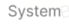</td>
<td style="text-align: center;"></td>
<td style="text-align: left;">categories</td>
<td style="text-align: left;">消息分类（一级）</td>
<td style="text-align: left;">是</td>
<td style="text-align: left;"></td>
<td style="text-align: left;"></td>
</tr>
<tr>
<td style="text-align: left;"></td>
<td style="text-align: center;"></td>
<td style="text-align: center;"></td>
<td style="text-align: left;">BusinessLineIconUrl</td>
<td style="text-align: left;">消息分类（二级）</td>
<td style="text-align: left;">是</td>
<td style="text-align: left;">
每个交易类别定义一个图标

详见：交易图标分类
</td>
<td style="text-align: left;"></td>
</tr>
<tr>
<td style="text-align: left;"></td>
<td style="text-align: center;"></td>
<td style="text-align: center;"></td>
<td style="text-align: left;">Key title / Title</td>
<td style="text-align: left;">标题</td>
<td style="text-align: left;">是</td>
<td style="text-align: left;">
加粗字体

若有Key title，则展示Key title，若无Key title，则取Title展示；

显示全部文案
</td>
<td style="text-align: left;">
详见：

<a href="https://advancegroup.sg.larksuite.com/wiki/Rj6KwJPnfisKltktktElRy4tgrG?sheet=lnYqsG">AIX【System Notification+content】</a>
</td>
</tr>
<tr>
<td style="text-align: left;"></td>
<td style="text-align: center;"></td>
<td style="text-align: center;"></td>
<td style="text-align: left;">Key message / Message</td>
<td style="text-align: left;">正文</td>
<td style="text-align: left;">是</td>
<td style="text-align: left;">
灰色小字

若有Key message，则展示Key message，若无Key message，则取Message展示；

默认最多展示3行，超出部分展示...
</td>
<td style="text-align: left;">
详见：

<a href="https://advancegroup.sg.larksuite.com/wiki/Rj6KwJPnfisKltktktElRy4tgrG?sheet=lnYqsG">AIX【System Notification+content】</a>
</td>
</tr>
<tr>
<td style="text-align: left;"></td>
<td style="text-align: left;"></td>
<td style="text-align: center;"></td>
<td style="text-align: left;">Image</td>
<td style="text-align: left;">图片</td>
<td style="text-align: left;">否</td>
<td style="text-align: left;">若有包含thumbnailsURL，则展示，无则隐藏</td>
<td style="text-align: left;"></td>
</tr>
<tr>
<td style="text-align: left;"></td>
<td style="text-align: left;"></td>
<td style="text-align: center;">

</td>
<td style="text-align: left;">Timestamp</td>
<td style="text-align: left;">时间戳</td>
<td style="text-align: left;">是</td>
<td style="text-align: left;">
用户收到消息的时间

展示规则（不变）：

当天的消息展示hh:mm，以Today分组。

今年且非当天的展示文案"month-day"，以Earlier分组。

非今年，其他时间展示同其他日期格式："month-day"，按照年分组。
</td>
<td style="text-align: left;"></td>
</tr>
<tr>
<td style="text-align: left;"></td>
<td style="text-align: left;"></td>
<td style="text-align: center;"></td>
<td style="text-align: left;">跳转详情页</td>
<td style="text-align: left;">跳转详情页</td>
<td style="text-align: left;">是</td>
<td style="text-align: left;">跳转至消息二级页，展示消息详情</td>
<td style="text-align: left;"></td>
</tr>
<tr>
<td style="text-align: left;"></td>
<td style="text-align: left;"></td>
<td style="text-align: center;"></td>
<td style="text-align: left;">Status icon+name</td>
<td style="text-align: left;">状态标识</td>
<td style="text-align: left;">否</td>
<td style="text-align: left;">
取msgStatusIcon以及msgStatusName，有则展示，无则隐藏。

icon枚举

SUCCESS, FAILED, REMINDER, PROCESSING, NULL（不展示icon）

若未传，则默认值为Null

name有则展示，无则隐藏，无默认值
</td>
<td style="text-align: left;"></td>
</tr>
<tr>
<td style="text-align: left;"></td>
<td style="text-align: left;"></td>
<td style="text-align: center;"></td>
<td style="text-align: left;">Extra info</td>
<td style="text-align: left;">附属信息</td>
<td style="text-align: left;">否</td>
<td style="text-align: left;">
由Label + Value + Value icon组成组成

Label展示在左侧，Value展示在右侧

最多支持两组，超出的不展示。
</td>
<td style="text-align: left;"></td>
</tr>
<tr>
<td style="text-align: left;"></td>
<td style="text-align: left;"></td>
<td style="text-align: center;"></td>
<td style="text-align: left;">CTA</td>
<td style="text-align: left;">跳转Inapp页面</td>
<td style="text-align: left;">否</td>
<td style="text-align: left;">不显示</td>
<td style="text-align: left;"></td>
</tr>
<tr>
<td style="text-align: left;"></td>
<td style="text-align: left;"></td>
<td style="text-align: left;"></td>
<td style="text-align: left;"></td>
<td style="text-align: left;">其他</td>
<td style="text-align: left;"></td>
<td style="text-align: left;">否</td>
<td style="text-align: left;"></td>
<td style="text-align: left;"></td>
</tr>
</tbody>
</table>

1.3 **Message detail page**

接口：https://apifox.advai.net/apidoc/shared/70aae3c7-e6b3-4d8c-8bd0-fcfbb5cb3d6c/api-36560

<table style="width:89%;">
<colgroup>
<col style="width: 8%" />
<col style="width: 20%" />
<col style="width: 5%" />
<col style="width: 7%" />
<col style="width: 5%" />
<col style="width: 5%" />
<col style="width: 27%" />
<col style="width: 10%" />
</colgroup>
<tbody>
<tr>
<td style="text-align: left;">UI</td>
<td style="text-align: left;">Template</td>
<td style="text-align: left;">demo</td>
<td style="text-align: left;">Module</td>
<td style="text-align: left;">含义</td>
<td style="text-align: left;">是否有值</td>
<td style="text-align: left;">Description</td>
<td style="text-align: left;">Remarks</td>
</tr>
<tr>
<td rowspan="8" style="text-align: center;"></td>
<td rowspan="8" style="text-align: center;">

</td>
<td style="text-align: center;"></td>
<td style="text-align: left;">Biz line icon</td>
<td style="text-align: left;">业务线</td>
<td style="text-align: left;">是</td>
<td style="text-align: left;"></td>
<td style="text-align: center;"></td>
</tr>
<tr>
<td style="text-align: center;"></td>
<td style="text-align: left;">Timestamp</td>
<td style="text-align: left;">时间戳</td>
<td style="text-align: left;">是</td>
<td style="text-align: left;">用户收到消息的时间</td>
<td style="text-align: left;"></td>
</tr>
<tr>
<td style="text-align: center;"></td>
<td style="text-align: left;">Status icon+name</td>
<td style="text-align: left;">状态标识</td>
<td style="text-align: left;">否</td>
<td style="text-align: left;">
取msgStatusIcon以及msgStatusName，有则展示，无则隐藏。

icon枚举

SUCCESS, FAILED, REMINDER, PROCESSING, NULL（不展示icon）

若未传，则默认值为Null

name有则展示，无则隐藏，无默认值
</td>
<td style="text-align: left;"></td>
</tr>
<tr>
<td style="text-align: center;"></td>
<td style="text-align: left;">Key title / Title</td>
<td style="text-align: left;">标题</td>
<td style="text-align: left;">是</td>
<td style="text-align: left;">
加粗字体

若有Key title，则展示Key title，若无Key title，则取Title展示；

显示全部文案
</td>
<td style="text-align: left;">
详见：

<a href="https://advancegroup.sg.larksuite.com/wiki/Rj6KwJPnfisKltktktElRy4tgrG?sheet=lnYqsG">AIX【System Notification+content】</a>
</td>
</tr>
<tr>
<td style="text-align: center;"></td>
<td style="text-align: left;">Key message / Message</td>
<td style="text-align: left;">正文</td>
<td style="text-align: left;">是</td>
<td style="text-align: left;">
灰色小字

若有Key message，则展示Key message，若无Key message，则取Message展示；

展示完整正文内容。
</td>
<td style="text-align: left;">
详见：

<a href="https://advancegroup.sg.larksuite.com/wiki/Rj6KwJPnfisKltktktElRy4tgrG?sheet=lnYqsG">AIX【System Notification+content】</a>
</td>
</tr>
<tr>
<td style="text-align: center;">

</td>
<td style="text-align: left;">Image</td>
<td style="text-align: left;">图片</td>
<td style="text-align: left;">可选</td>
<td style="text-align: left;">若有包含thumbnailsURL，则展示，无则隐藏</td>
<td style="text-align: left;"></td>
</tr>
<tr>
<td style="text-align: center;"></td>
<td style="text-align: left;">Extra info</td>
<td style="text-align: left;">附属信息</td>
<td style="text-align: left;">否</td>
<td style="text-align: left;">
由Key+Value组成

Key展示在左侧，Value展示在右侧

最多支持两组，超出的不展示。
</td>
<td style="text-align: left;"></td>
</tr>
<tr>
<td style="text-align: center;">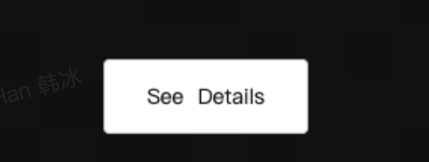</td>
<td style="text-align: left;">CTA</td>
<td style="text-align: left;">跳转Inapp页面</td>
<td style="text-align: left;">否</td>
<td style="text-align: left;">不显示</td>
<td style="text-align: left;"></td>
</tr>
</tbody>
</table>

1.4 **Me tab**

<table style="width:89%;">
<colgroup>
<col style="width: 10%" />
<col style="width: 10%" />
<col style="width: 19%" />
<col style="width: 31%" />
<col style="width: 17%" />
</colgroup>
<tbody>
<tr>
<td style="text-align: left;">Module</td>
<td style="text-align: left;">UI</td>
<td style="text-align: left;">demo</td>
<td style="text-align: left;">Description</td>
<td style="text-align: left;">Remarks</td>
</tr>
<tr>
<td style="text-align: left;">Me page入口</td>
<td style="text-align: center;">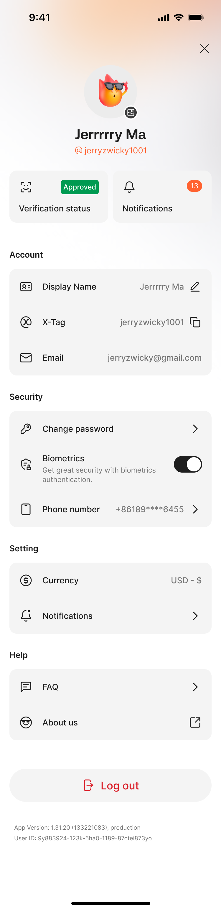</td>
<td style="text-align: center;">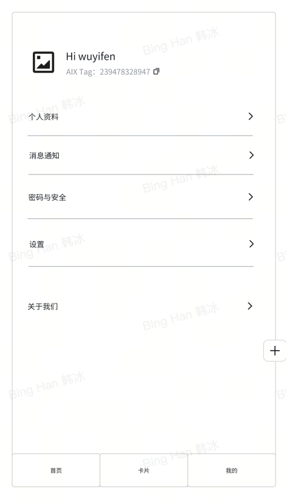</td>
<td style="text-align: left;">
未读消息提示逻辑：

若用户有未读消息，则提示：红点+未读消息数字

未读消息数字，超过100条展示99+

若用户进入me tab时距离上次进入若有新增的有未读消息，则展示红点提醒+未读消息数字；当用户点击进入消息列表后，返回Me tab，则红点消失，未读消息数字保留；

若用户没有未读的消息，则不提示红点，不提示未读消息的数字。
</td>
<td style="text-align: left;"></td>
</tr>
<tr>
<td style="text-align: left;">Notification setting页面信息</td>
<td style="text-align: center;">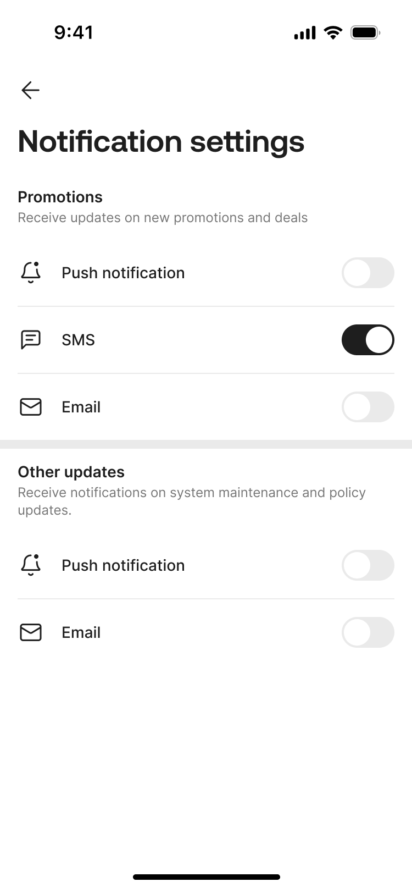</td>
<td style="text-align: left;">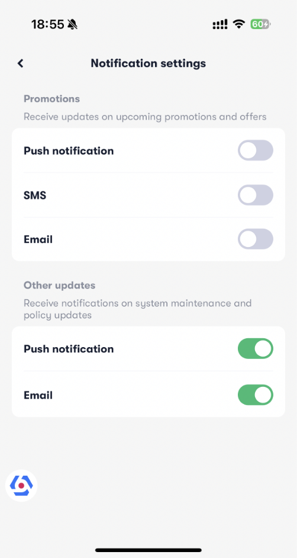</td>
<td style="text-align: left;">
入口：APP-我的-设置-通知设置

包含下方控制能力：

Promotion【category=2】

Push notification

SMS

Email

System【category=5】

Push notification

Email
</td>
<td style="text-align: left;"></td>
</tr>
</tbody>
</table>

1.5 **Login/Register**

|                                                                      |
|:---------------------------------------------------------------------|
| Promotional materials have to be unticked by default in all markets. |

<table style="width:89%;">
<colgroup>
<col style="width: 10%" />
<col style="width: 15%" />
<col style="width: 16%" />
<col style="width: 32%" />
<col style="width: 6%" />
<col style="width: 6%" />
</colgroup>
<tbody>
<tr>
<td style="text-align: left;">Module</td>
<td style="text-align: left;">UI</td>
<td style="text-align: left;">demo</td>
<td style="text-align: left;">Description</td>
<td style="text-align: left;">UX</td>
<td style="text-align: left;">Remarks</td>
</tr>
<tr>
<td style="text-align: left;">APP</td>
<td style="text-align: center;">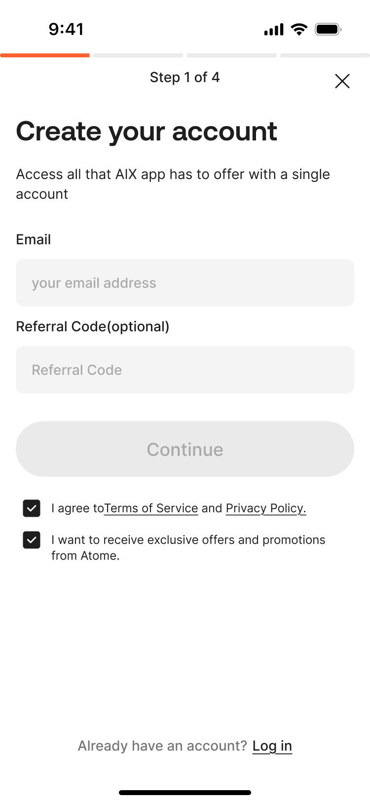</td>
<td style="text-align: center;">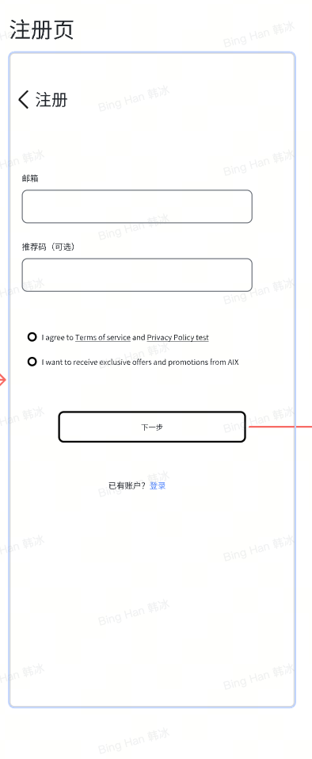</td>
<td style="text-align: left;">
显示：I want to receive exclusive offers and promotions from AIX.

交互：

默认勾选，用户可取消勾选（与atome保持一致）

若用户勾选，则data_consent=1

promotions（email/push/sms）全部开启

system（email/push）全部开启

若用户取消勾选，则data_consent=0

promotions（email/push/sms）<u>全部关闭</u>

system（email/push）全部开启

更多：<a href="https://advancegroup.sg.larksuite.com/wiki/NerUwjf1kiLTOkk9uJClnSYZgCc">AIX Card 注册登录需求V1.0</a>

4月13日更新：

若前端用户隐藏入口，不可勾选，服务端直接赋值data_consent=1。
</td>
<td style="text-align: left;"></td>
<td style="text-align: left;"></td>
</tr>
</tbody>
</table>

**Webhook接入**

# 1. 加密钱包交易类webhook

**点击图片可查看完整电子表格**

**点击图片可查看完整电子表格**

# 2. 卡交易类webhook

**点击图片可查看完整电子表格**

# 3. 卡状态变更

3.1 **AIX后端处理**

收到webhook后，后端需根据 cardId 定位对应卡记录，并以 newCardStatus 作为最新状态来源，同步更新 AIX 卡状态。

AIX 内部卡状态需按统一映射规则转换，具体参考《[3.1 cardstatus映射规则](https://advancegroup.sg.larksuite.com/wiki/Hjtgwru5QiODEuk2NIUlftkEgEg#share-NiUUdzbTQoXqhvx1fvnlHv01gfv)》文档。

3.2 **字段说明**

**点击图片可查看完整电子表格**

# 4. 其他可见

1、申卡  
[AIX Card V1.0【Application】](https://advancegroup.sg.larksuite.com/wiki/Hjtgwru5QiODEuk2NIUlftkEgEg)  
2、kyc  
[AIX WALLET 钱包开户KYC需求V1.0](https://advancegroup.sg.larksuite.com/wiki/ISjLwCKi5itjNXkpCLllQD5Qgle)

**附录  **

DTC接口文档：

https://advancegroup.sg.larksuite.com/drive/folder/Q0dHfSY5ulRFR2dtJ7ullLpgg5g

[Message Center 技术方案](https://advancegroup.sg.larksuite.com/wiki/wikusyojfDvE19aHDIOYhByIBab)

[Message center](https://advancegroup.sg.larksuite.com/docx/doxusa3KnpMIwP4SRhdmzqVGJyf)

[\[PRD\] Message Center Upgrade](https://advancegroup.sg.larksuite.com/wiki/HrvIwhbZuin2OAkJjNgunNOXsAc)

[Notification Setting](https://advancegroup.sg.larksuite.com/wiki/wikusvWP4SG27GfOLb05nwv2raf)

[Notification system overview](https://advancegroup.sg.larksuite.com/wiki/Y3IIwxk7IibWP1k5SAzukUL4s6f)

<table style="width:89%;">
<colgroup>
<col style="width: 24%" />
<col style="width: 31%" />
<col style="width: 33%" />
</colgroup>
<tbody>
<tr>
<td style="text-align: center;">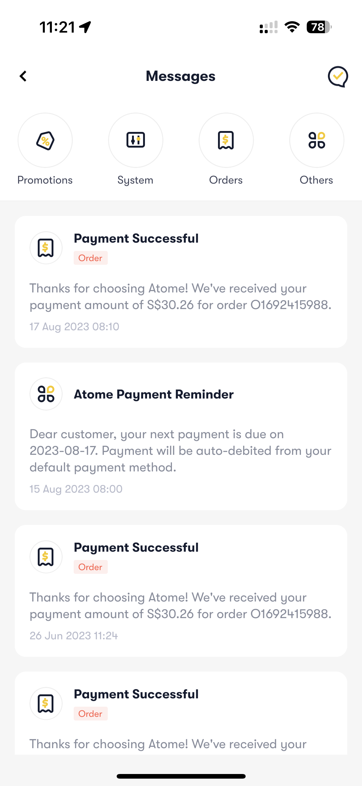</td>
<td style="text-align: center;">

</td>
<td style="text-align: center;">

</td>
</tr>
</tbody>
</table>

**Moengage: https://dashboard-01.moengage.com/**

外采的营销系统，主要用于邮件、WhatsApp触达

权限管理人：Devon xiao

<table style="width:89%;">
<colgroup>
<col style="width: 6%" />
<col style="width: 24%" />
<col style="width: 6%" />
<col style="width: 8%" />
<col style="width: 6%" />
<col style="width: 32%" />
<col style="width: 6%" />
</colgroup>
<tbody>
<tr>
<td style="text-align: left;"></td>
<td style="text-align: left;"></td>
<td style="text-align: left;"></td>
<td style="text-align: left;"></td>
<td style="text-align: left;"></td>
<td style="text-align: left;"></td>
<td style="text-align: left;"></td>
</tr>
<tr>
<td style="text-align: left;"></td>
<td style="text-align: left;">Template</td>
<td style="text-align: left;">demo</td>
<td style="text-align: left;">Module</td>
<td style="text-align: left;">含义</td>
<td style="text-align: left;">Description</td>
<td style="text-align: left;">Remarks</td>
</tr>
<tr>
<td style="text-align: left;"></td>
<td rowspan="10" style="text-align: center;">

</td>
<td style="text-align: left;"></td>
<td style="text-align: left;">Biz line icon</td>
<td style="text-align: left;">业务线</td>
<td style="text-align: left;">AIX</td>
<td style="text-align: center;"></td>
</tr>
<tr>
<td style="text-align: left;"></td>
<td style="text-align: center;"></td>
<td style="text-align: left;">category</td>
<td style="text-align: left;">类别</td>
<td style="text-align: left;">
每个交易类别定义一个图标

详见：交易图标分类
</td>
<td style="text-align: left;"></td>
</tr>
<tr>
<td style="text-align: left;"></td>
<td style="text-align: center;"></td>
<td style="text-align: left;">Key title / Title</td>
<td style="text-align: left;">标题</td>
<td style="text-align: left;">
加粗字体

若有Key title，则展示Key title，若无Key title，则取Title展示；

超出部分展示...
</td>
<td style="text-align: left;"></td>
</tr>
<tr>
<td style="text-align: left;"></td>
<td style="text-align: center;"></td>
<td style="text-align: left;">Key message / Message</td>
<td style="text-align: left;">正文</td>
<td style="text-align: left;">
灰色小字

若有Key message，则展示Key message，若无Key message，则取Message展示；

默认最多展示3行，超出部分展示...
</td>
<td style="text-align: left;"></td>
</tr>
<tr>
<td style="text-align: left;"></td>
<td style="text-align: center;"></td>
<td style="text-align: left;">Image</td>
<td style="text-align: left;">图片</td>
<td style="text-align: left;">若有包含thumbnailsURL，则展示，无则隐藏</td>
<td style="text-align: left;"></td>
</tr>
<tr>
<td style="text-align: left;"></td>
<td style="text-align: center;"></td>
<td style="text-align: left;">Timestamp</td>
<td style="text-align: left;">时间戳</td>
<td style="text-align: left;">
用户收到消息的时间

展示规则（不变）：

当天的消息展示hh:mm

昨天的展示文案"Yesterday"

其他时间展示同其他日期格式：例如16 Feb 2023 22:47
</td>
<td style="text-align: left;"></td>
</tr>
<tr>
<td style="text-align: left;"></td>
<td style="text-align: center;"></td>
<td style="text-align: left;">Detail page button</td>
<td style="text-align: left;">跳转详情页</td>
<td style="text-align: left;">无icon，点击消息卡片后跳转消息详情页</td>
<td style="text-align: left;"></td>
</tr>
<tr>
<td style="text-align: left;"></td>
<td style="text-align: center;"></td>
<td style="text-align: left;">Status icon+name</td>
<td style="text-align: left;">状态标识</td>
<td style="text-align: left;">
取msgStatusIcon以及msgStatusName，有则展示，无则隐藏。

icon枚举

SUCCESS, FAILED, REMINDER, PROCESSING, NULL（不展示icon）

若未传，则默认值为Null

name有则展示，无则隐藏，无默认值
</td>
<td style="text-align: left;"></td>
</tr>
<tr>
<td style="text-align: left;"></td>
<td style="text-align: center;"></td>
<td style="text-align: left;">Extra info</td>
<td style="text-align: left;">附属信息</td>
<td style="text-align: left;">
由Label + Value + Value icon组成组成

Label展示在左侧，Value展示在右侧

最多支持两组，超出的不展示。
</td>
<td style="text-align: left;"></td>
</tr>
<tr>
<td style="text-align: left;"></td>
<td style="text-align: center;"></td>
<td style="text-align: left;">CTA</td>
<td style="text-align: left;">跳转Inapp页面</td>
<td style="text-align: left;">
若有包含actionsUrl，则展示此button；无则隐藏

文案取buttonName，若未传，则默认展示：See Details

点击后内置浏览器打开actionsUrl
</td>
<td style="text-align: left;"></td>
</tr>
</tbody>
</table>
