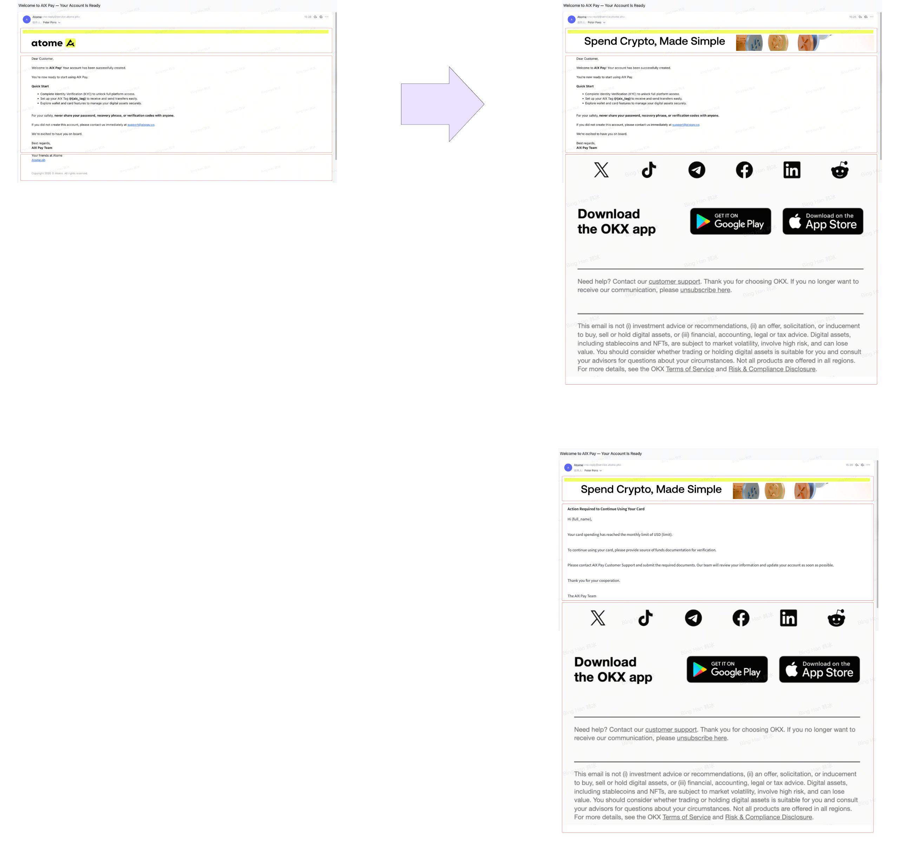
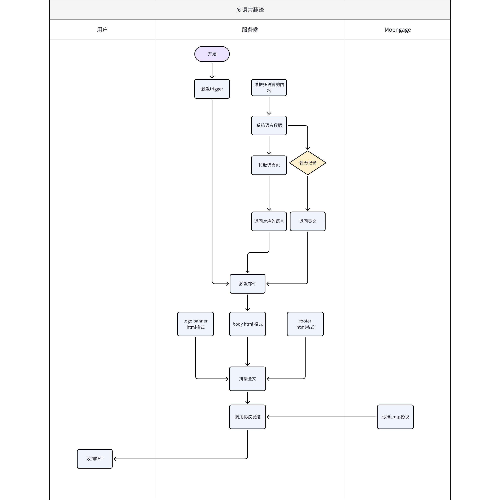

# \[2026-03-12\]AIX+系统邮件

**目录**

**\[同步块-无权限下载此内容\]**

# 1. 需求背景

支持aix项目的多语言能力

# 2. 需求概况

|              |                |
|:-------------|:---------------|
| **类型**     | 明细           |
| PM           | @Bing Han 韩冰 |
| 需求方       |                |
| UI/UX        |                |
| 前端         |                |
| 服务端       |                |
| 测试         |                |
| Figma        |                |
| BRD          |                |
| 期望上线时间 |                |
| Meggle       |                |
| 关联域PRD    |                |
| 历史需求PRD  |                |
| 技术方案     |                |
| 支持语言     |                |
| 设备适配     |                |
| 链接         |                |
| 文案review   |                |
| Others       |                |

# 3. demo

**Basic information：**

This project just includes the AIX, not atome.

The template needed to be designed, including : logo banner+body+footer; the design team is working on the ui designed.

Currently, we have already implemented the Moenage standard protocol and at the technical level we can send emails.

System email content：[AIX【System Notification+content】](https://advancegroup.sg.larksuite.com/wiki/Rj6KwJPnfisKltktktElRy4tgrG?sheet=NVFORu)

**Questions:**

Regarding **the system email**, will the template, which includes logo banner+body+footer be configured in MoEngage, or not?

Regarding **the system email**, will the email body be configured in MoEngage, or not?

Regarding **the promotion email**, will the template, which includes logo banner+body+footer be configured in MoEngage, or not?

Regarding **the promotion email**, will the email body be configured in MoEngage, or not?

Create the template. Do we need to call this interface:https://developers.moengage.com/hc/en-us/articles/18187641060244-Create-Email-Template-API#01GQRA6BGSEZA2F6DR6NA2BBDA

# 4. Interface interaction

4.1 **System email**

# 5. 数据埋点

待定

# 6. 数据分析需求（待定）

# 7. 参考资料

[\[AIX\]Email Design & Template Requirement](https://advancegroup.sg.larksuite.com/wiki/QExLwJ85Qi9au8k0czdlTpxNgkf)
