# \[AIX\]OBOSS MVP

**需求背景**

**背景**

为满足全球用户对一体化、便捷安全数字金融服务的需求，本项目旨在开发一款创新的移动应用。该应用将整合先进的支付与账户管理技术，致力于为用户提供全新的移动端金融管理体验。

对于新应用的营销和部分基础管理能力，期望复用oboss现有的能力。

|  |
|:---|
| BRD：[AIX营销规划](https://advancegroup.sg.larksuite.com/wiki/EEMtwzH5qiv7o5kducMlZoOVgFh?from=from_copylink&sheet=19c194) |

**需求内容**

|       |        |                          |
|:------|:-------|:-------------------------|
| 日期  | 负责人 | 备注                     |
| 11.3  | yijun  | 完成一期方案             |
| 11.27 | yijun  | 完成调整范围后的初版方案 |

**功能清单**

<table style="width:89%;">
<colgroup>
<col style="width: 10%" />
<col style="width: 16%" />
<col style="width: 19%" />
<col style="width: 41%" />
</colgroup>
<tbody>
<tr>
<td style="text-align: center;">模块</td>
<td style="text-align: center;">功能</td>
<td style="text-align: left;">子功能</td>
<td style="text-align: center;">概要</td>
</tr>
<tr>
<td style="text-align: left;">系统对接</td>
<td style="text-align: left;">系统对接</td>
<td style="text-align: left;">系统对接</td>
<td style="text-align: left;">Oboss对接AIX业务系统的相关能力</td>
</tr>
<tr>
<td rowspan="3" style="text-align: left;">Operation</td>
<td style="text-align: left;">Popup</td>
<td style="text-align: left;">Popup</td>
<td style="text-align: left;">管理和创建Popup</td>
</tr>
<tr>
<td style="text-align: left;">Banner</td>
<td style="text-align: left;">Banner</td>
<td style="text-align: left;">管理和创建Banner</td>
</tr>
<tr>
<td style="text-align: left;">Landing Page</td>
<td style="text-align: left;">Landing Page</td>
<td style="text-align: left;">管理和创建LP</td>
</tr>
<tr>
<td rowspan="7" style="text-align: left;">Notification</td>
<td rowspan="3" style="text-align: left;">Send Message</td>
<td style="text-align: left;">Send Message页面管理</td>
<td style="text-align: left;">管理以生成的消息推送任务</td>
</tr>
<tr>
<td style="text-align: left;">Pending List页面管理</td>
<td style="text-align: left;">对需要审批的推送任务进行处理</td>
</tr>
<tr>
<td style="text-align: left;">创建推送任务</td>
<td style="text-align: left;">创建PUSH和Notification center类型的推送任务</td>
</tr>
<tr>
<td style="text-align: left;">FC&amp;DND</td>
<td style="text-align: left;">FC&amp;DND</td>
<td style="text-align: left;">配置推送次数和免打扰时间</td>
</tr>
<tr>
<td style="text-align: left;">Analysis</td>
<td style="text-align: left;">Analysis</td>
<td style="text-align: left;">展示推送任务的数据效果</td>
</tr>
<tr>
<td style="text-align: left;">提供业务用的推送服务</td>
<td style="text-align: left;">提供业务用的推送服务</td>
<td style="text-align: left;">提供业务用的推送服务</td>
</tr>
<tr>
<td style="text-align: left;">消息中心展示对接</td>
<td style="text-align: left;">消息中心展示对接</td>
<td style="text-align: left;">消息中心展示对接</td>
</tr>
<tr>
<td rowspan="5" style="text-align: center;">Group</td>
<td rowspan="5" style="text-align: center;">User Group</td>
<td style="text-align: left;">User Group管理</td>
<td style="text-align: left;">用户组管理列表</td>
</tr>
<tr>
<td style="text-align: left;">SPECFIFIC</td>
<td style="text-align: left;">运营手动上传用户文件生成用户组</td>
</tr>
<tr>
<td style="text-align: left;">SPLIT</td>
<td style="text-align: left;">将已有用户组进行随机分组，生成新的用户组</td>
</tr>
<tr>
<td style="text-align: left;">ALL USER EXCLUDE USER</td>
<td style="text-align: left;">通过全部用户剔除指定用户组来实现圈选</td>
</tr>
<tr>
<td style="text-align: left;">User Group使用场景</td>
<td style="text-align: left;">用户组主要的使用场景和对应规则限制</td>
</tr>
<tr>
<td rowspan="2" style="text-align: center;">Link</td>
<td style="text-align: center;">DeepLink</td>
<td style="text-align: left;">DeepLink</td>
<td style="text-align: left;">生成的使用标准的 HTTPS 协议的DeepLink 链接</td>
</tr>
<tr>
<td style="text-align: center;">OneLink</td>
<td style="text-align: left;">OneLink</td>
<td style="text-align: left;">生成的使用自定义的应用协议的Onelink 格式链接</td>
</tr>
<tr>
<td rowspan="3" style="text-align: center;">System Users</td>
<td style="text-align: center;">System User List</td>
<td style="text-align: left;">System User List</td>
<td style="text-align: left;">管理系统用户</td>
</tr>
<tr>
<td style="text-align: center;">System Roles</td>
<td style="text-align: left;">System Roles</td>
<td style="text-align: left;">管理权限角色和权限点的关系</td>
</tr>
<tr>
<td style="text-align: center;">Apply Access</td>
<td style="text-align: left;">Apply Access</td>
<td style="text-align: left;">申请和审批权限申请</td>
</tr>
</tbody>
</table>

**1 AIX业务系统对接**

|  |
|:---|
| [AIX Integration](https://advancegroup.sg.larksuite.com/wiki/MK74wemqiiNrFbkeIy7lmyWFg0e?from=from_copylink) |

**1.1 Growth新增对接服务 aix adapter**

**1.2 Aix user agent 兼容**

**1.3 Atome 特定功能新增开关**

**2 Operation**

**2.1 Popup**

**2.1.1 Popup管理**

Popup功能管理的是应用内的运营目的弹窗，当前主要作用是引导用户进入活动页面。App端对多种弹窗类型的展示和优先级规则，由业务侧进行规范。

页面入口：Operation\>Popups；

在Popups系统内的Business line和Display Location配置项，AIX需要与Atome进行隔离

Business line：本期仅「AIX」

Display Location：本期

「AIX/Homepage」，对应AIX应用的首页

Popups管理列表

管理列表分Acitve和Inactive两个tab，分别筛选展示生效和失效状态的弹窗配置

生效条件：配置的Status=ture **且** 配置的结束展示时间晚于当前时间

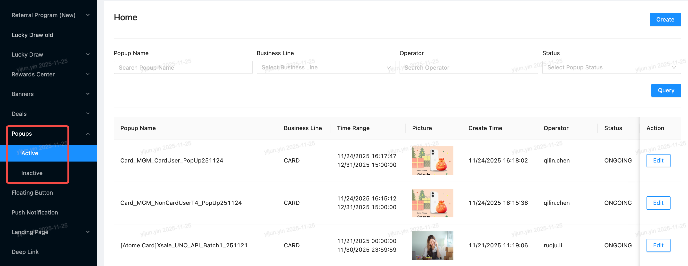

<table style="width:88%;">
<colgroup>
<col style="width: 8%" />
<col style="width: 11%" />
<col style="width: 68%" />
</colgroup>
<tbody>
<tr>
<td style="text-align: left;">模块</td>
<td style="text-align: left;">字段</td>
<td style="text-align: left;">规则</td>
</tr>
<tr>
<td rowspan="7" style="text-align: left;">列表字段</td>
<td style="text-align: left;">Popup Name</td>
<td style="text-align: left;">弹窗名称，创建时由配置者设定</td>
</tr>
<tr>
<td style="text-align: left;">Business Line</td>
<td style="text-align: left;">业务线归属，在该系统中仅「<strong>AIX」</strong>一个枚举值</td>
</tr>
<tr>
<td style="text-align: left;">Time Range</td>
<td style="text-align: left;">配置生效时间范围，创建时由配置者设定</td>
</tr>
<tr>
<td style="text-align: left;">Picture</td>
<td style="text-align: left;">弹窗图片，创建时由配置者设定</td>
</tr>
<tr>
<td style="text-align: left;">Create Time</td>
<td style="text-align: left;">弹窗配置创建时间</td>
</tr>
<tr>
<td style="text-align: left;">Operator</td>
<td style="text-align: left;">弹窗配置创建人</td>
</tr>
<tr>
<td style="text-align: left;">Status</td>
<td style="text-align: left;">
通过活动时间计算的状态，与Status配置逻辑不一致

「UPCOMING」：当前时间早于活动开始时间

「ONGOING」：当前时间在活动进行时间区间内

「EXPIRED」：当前时间晚于活动结束时间
</td>
</tr>
<tr>
<td rowspan="4" style="text-align: left;">搜索筛选</td>
<td style="text-align: left;">Popup Name</td>
<td style="text-align: left;">弹窗名称，文本输入框，模糊搜索</td>
</tr>
<tr>
<td style="text-align: left;">Business Line</td>
<td style="text-align: left;">业务线归属，单选组件，在该系统中仅「<strong>AIX」</strong>一个枚举值</td>
</tr>
<tr>
<td style="text-align: left;">Operator</td>
<td style="text-align: left;">创建人，文本输入框，模糊搜索</td>
</tr>
<tr>
<td style="text-align: left;">Status</td>
<td style="text-align: left;">在Active tap，可选择「ONGOING」「UPCOMING」；在Inactive tap，不可选择，默认筛选「INACTIVE」</td>
</tr>
<tr>
<td rowspan="3" style="text-align: left;">操作按钮</td>
<td style="text-align: left;">Create</td>
<td style="text-align: left;">创建新的弹窗配置，点击跳转创建页面，仅Acitve tab展示</td>
</tr>
<tr>
<td style="text-align: left;">Edit</td>
<td style="text-align: left;">点击对所选弹窗进行编辑</td>
</tr>
<tr>
<td style="text-align: left;">Query</td>
<td style="text-align: left;">基于配置的搜索筛选条件进行搜索</td>
</tr>
</tbody>
</table>

**2.1.2 Popup新增和编辑**

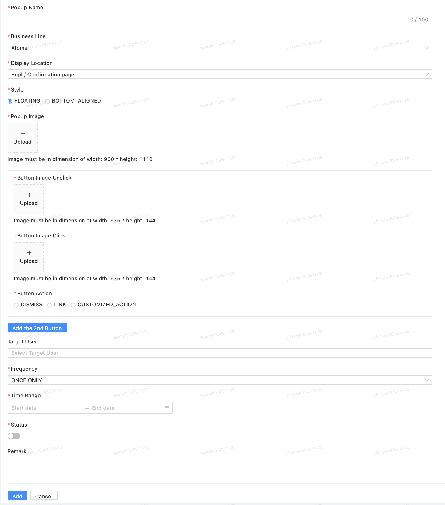

<table style="width:89%;">
<colgroup>
<col style="width: 8%" />
<col style="width: 16%" />
<col style="width: 64%" />
</colgroup>
<tbody>
<tr>
<td style="text-align: left;"><strong>模块</strong></td>
<td style="text-align: left;"><strong>字段</strong></td>
<td style="text-align: left;"><strong>规则</strong></td>
</tr>
<tr>
<td rowspan="3" style="text-align: left;">基础信息</td>
<td style="text-align: left;">Popup Name</td>
<td style="text-align: left;">文本输入框；字符限制：100 字；必填</td>
</tr>
<tr>
<td style="text-align: left;">Business Line</td>
<td style="text-align: left;">下拉选择框；必填</td>
</tr>
<tr>
<td style="text-align: left;">Display Location</td>
<td style="text-align: left;">
下拉选择框；必填

AIX/Homepage
</td>
</tr>
<tr>
<td rowspan="7" style="text-align: left;">弹窗样式</td>
<td style="text-align: left;">
当前弹窗样式配置受到Location和Style两个配置项的影响

在AIX项目中，要求所有Location都按支持双按钮配置形式的弹窗来设计，统一标准
</td>
<td style="text-align: left;"></td>
</tr>
<tr>
<td style="text-align: left;">Style</td>
<td style="text-align: left;">
单选按钮组；必填

FLOATING：从页面中间弹出的悬浮式弹窗

<del>BOTTOM_ALIGNED：从页面底部拉起的半屏弹窗</del>
</td>
</tr>
<tr>
<td style="text-align: left;">Popup Image</td>
<td style="text-align: left;">
弹窗主图；图片上传组件；必填

尺寸要求：1029*1368

FLOATING

<del>BOTTOM_ALIGNED</del>
</td>
</tr>
<tr>
<td style="text-align: left;">Button Image Unclick</td>
<td style="text-align: left;">
FLOATING样式需要配置；按钮未点击状态的图片

图片上传组件；尺寸要求：1029*264；必填
</td>
</tr>
<tr>
<td style="text-align: left;">Button Image Click</td>
<td style="text-align: left;">
FLOATING样式需要配置；按钮点击状态的图片

图片上传组件；尺寸要求：1029*264；必填
</td>
</tr>
<tr>
<td style="text-align: left;"><del>Button Name</del></td>
<td style="text-align: left;">
<del>BOTTOM_ALIGNED样式需要配置，按钮文案</del>

<del>文本输入框；字符限制：30 字；必填</del>
</td>
</tr>
<tr>
<td style="text-align: left;">Button Action</td>
<td style="text-align: left;">
按钮点击后的行为；单选按钮组；必填

DISMISS：用户点击按钮后关闭弹窗

LINK：跳转链接，选择后展示deeplink组件进行配置；用户点击按钮后跳转对应页面

CUSTOMIZED_ACTION：自定义业务动作，本期为空
</td>
</tr>
<tr>
<td rowspan="4" style="text-align: left;">展示规则</td>
<td style="text-align: left;">Target User</td>
<td style="text-align: left;">弹窗目标用户；从生效的usergroup中进行选择；非必填，未填写则代表所有用户可见</td>
</tr>
<tr>
<td style="text-align: left;">Frequency</td>
<td style="text-align: left;">
弹窗展示频率；下拉选择框；默认选项：ONCE ONLY；必填

ONCE ONLY：每个用户仅展示一次

ONCE PER DAY：每个用户每天仅展示一次

ONCE PER THREE DAY：每个用户每3天仅展示一次

ONCE PER week：每个用户每周仅展示一次

ONCE PER MONTH：每个用户每月仅展示一次
</td>
</tr>
<tr>
<td style="text-align: left;">Time Range</td>
<td style="text-align: left;">弹窗生效时间范围；日期选择器（双框）；选择 “Start date”（开始时间）和 “End date”（结束时间）；非必填，未填写则代表长期生效</td>
</tr>
<tr>
<td style="text-align: left;">Status</td>
<td style="text-align: left;">开关组件；控制状态：Enable状态为popup生效，Disable则popup无效</td>
</tr>
<tr>
<td style="text-align: left;">备注</td>
<td style="text-align: left;">Remark</td>
<td style="text-align: left;">备注信息；多行输入框；非必填</td>
</tr>
<tr>
<td rowspan="2" style="text-align: left;">操作</td>
<td style="text-align: left;">Submit</td>
<td style="text-align: left;">
检验必填性、字符长度，通过则创建成功，保存信息；未通过，则拦截，拦截提示：

必填性未填，提示Please enter XX，XX为必填字段名；
</td>
</tr>
<tr>
<td style="text-align: left;">Cancel</td>
<td style="text-align: left;">点击则取消当前页面编辑信息，返回上级页面。</td>
</tr>
</tbody>
</table>

**2.2 Banner**

**2.2.1 Banner管理**

页面入口：Operation\>Popups；

在Banner系统内的Location配置项，AIX需要与Atome进行隔离

Display Location：

「AIX/Homepage」，对应AIX应用的首页；

「AIX/Homepage bottom」，对应AIX应用首页底部

「AIX/MGM home」，对应AIX应用邀请活动页面

Banner管理列表

管理列表分Acitve和Inactive两个tab，分别筛选展示生效和失效状态的Banner配置

生效条件：配置的Status=ture **且** 配置的结束展示时间晚于当前时间

AIX项目不提供Active Floor、Inactive Floor两个功能入口，该功能已废弃后续将进行整体下架处理。

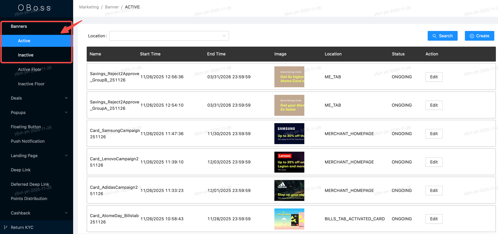

<table style="width:88%;">
<colgroup>
<col style="width: 8%" />
<col style="width: 11%" />
<col style="width: 68%" />
</colgroup>
<tbody>
<tr>
<td style="text-align: left;">模块</td>
<td style="text-align: left;">字段</td>
<td style="text-align: left;">规则</td>
</tr>
<tr>
<td rowspan="6" style="text-align: left;">列表字段</td>
<td style="text-align: left;">Name</td>
<td style="text-align: left;">Banner名称，创建时由配置者设定</td>
</tr>
<tr>
<td style="text-align: left;">Start Time</td>
<td style="text-align: left;">配置生效开始时间，创建时由配置者设定</td>
</tr>
<tr>
<td style="text-align: left;">End Time</td>
<td style="text-align: left;">配置生效结束时间，创建时由配置者设定</td>
</tr>
<tr>
<td style="text-align: left;">Image</td>
<td style="text-align: left;">展示上传的弹窗主图</td>
</tr>
<tr>
<td style="text-align: left;">Location</td>
<td style="text-align: left;">展示预设的位置标识</td>
</tr>
<tr>
<td style="text-align: left;">Status</td>
<td style="text-align: left;">
通过活动时间计算的状态，与Status配置逻辑不一致

「UPCOMING」：当前时间早于活动开始时间Style

「ONGOING」：当前时间在活动进行时间区间内

「EXPIRED」：当前时间晚于活动结束时间
</td>
</tr>
<tr>
<td style="text-align: left;">搜索筛选</td>
<td style="text-align: left;">Location</td>
<td style="text-align: left;">
下拉选择组件，根据该功能的可用location进行筛选

「AIX/Homepage」「AIX/Homepage bottom」「AIX/MGM home」
</td>
</tr>
<tr>
<td rowspan="4" style="text-align: left;">操作按钮</td>
<td style="text-align: left;">Create</td>
<td style="text-align: left;">创建新的Banner配置，点击跳转创建页面</td>
</tr>
<tr>
<td style="text-align: left;">Edit</td>
<td style="text-align: left;">点击对所选弹窗进行编辑</td>
</tr>
<tr>
<td style="text-align: left;">Sort</td>
<td style="text-align: left;">
用于编辑同一个Location下不同配置的展示顺序，仅Active tab展示该按钮，选择location后展示该按钮

点击后可以拖动页面中的生效配置，拖动后的列表顺序与用户在APP展示的顺序一致

完成调整后点击「Apply」按钮，保持配置并生效；点击「Canel」取消本次操作
</td>
</tr>
<tr>
<td style="text-align: left;">Search</td>
<td style="text-align: left;">基于配置的搜索筛选条件进行搜索</td>
</tr>
</tbody>
</table>

**2.2.2 Banner新增和编辑**

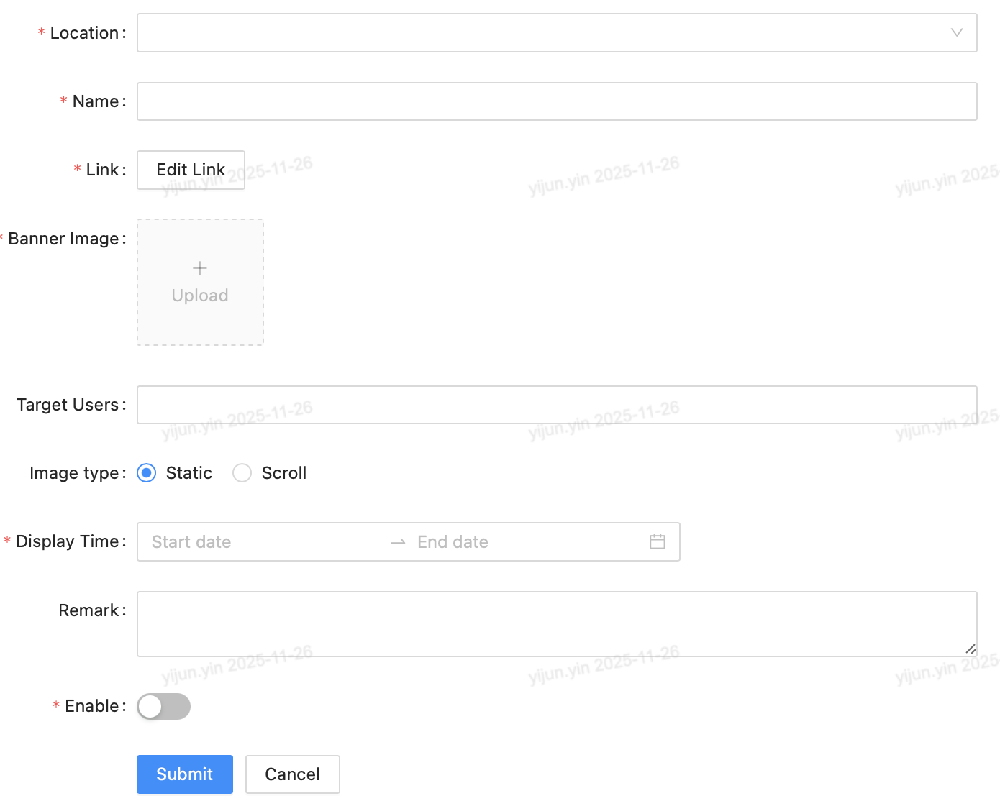

<table style="width:89%;">
<colgroup>
<col style="width: 8%" />
<col style="width: 16%" />
<col style="width: 64%" />
</colgroup>
<tbody>
<tr>
<td style="text-align: left;"><strong>模块</strong></td>
<td style="text-align: left;"><strong>字段</strong></td>
<td style="text-align: left;"><strong>规则</strong></td>
</tr>
<tr>
<td rowspan="2" style="text-align: left;">基础信息</td>
<td style="text-align: left;">Name</td>
<td style="text-align: left;">文本输入框；必填</td>
</tr>
<tr>
<td style="text-align: left;">Location</td>
<td style="text-align: left;">下拉选择框；必填</td>
</tr>
<tr>
<td rowspan="7" style="text-align: left;">Banner规则</td>
<td style="text-align: left;">
AIX Banner功能仅支持纯图片样式，对于需要按钮的样式考虑采用feeds功能实现

本期暂不考虑特殊定制化逻辑的banner形式，后续有相关需求再进行迭代
</td>
<td style="text-align: left;"></td>
</tr>
<tr>
<td style="text-align: left;">Link</td>
<td style="text-align: left;">跳转链接，选择后展示deeplink组件进行配置；用户点击Banner后跳转对应页面</td>
</tr>
<tr>
<td style="text-align: left;">Banner Image</td>
<td style="text-align: left;">
图片上传组件；必填

尺寸要求：不同Location对应的尺寸要求不一致

AIX项目可以沟通一个通用尺寸范围，由运营上传时控制尺寸

AIX/Homepage：981*408

AIX/Homepage bottom：1029*（480～564）

AIX/MGM home：UI稿暂未sign off，当前不设限制
</td>
</tr>
<tr>
<td style="text-align: left;">Target User</td>
<td style="text-align: left;">弹窗目标用户；从生效的usergroup中进行选择；非必填，未填写则代表所有用户可见</td>
</tr>
<tr>
<td style="text-align: left;">Image type</td>
<td style="text-align: left;">Banner的展现形式；单选组件；Static静态形式；Scroll动态滚动形式</td>
</tr>
<tr>
<td style="text-align: left;">Display Time</td>
<td style="text-align: left;">生效时间范围；日期选择器（双框）；选择 “Start date”（开始时间）和 “End date”（结束时间）；非必填，未填写则代表长期生效</td>
</tr>
<tr>
<td style="text-align: left;">Status</td>
<td style="text-align: left;">开关组件；控制状态：Enable状态为生效，Disable则无效</td>
</tr>
<tr>
<td style="text-align: left;">备注</td>
<td style="text-align: left;">Remark</td>
<td style="text-align: left;">备注信息；多行输入框；非必填</td>
</tr>
<tr>
<td rowspan="2" style="text-align: left;">操作</td>
<td style="text-align: left;">Submit</td>
<td style="text-align: left;">
检验必填性、字符长度，通过则创建成功，保存信息；未通过，则拦截，拦截提示：

必填性未填，提示Please enter XX，XX为必填字段名；
</td>
</tr>
<tr>
<td style="text-align: left;">Cancel</td>
<td style="text-align: left;">点击则取消当前页面编辑信息，返回上级页面。</td>
</tr>
</tbody>
</table>

**2.3 Landing Page**

|                                                                        |
|:-----------------------------------------------------------------------|
| 本期接入的是旧版的Landing Page能力，线上服务特定页面的Beta版本暂不接入 |

**2.3.1 Landing Page管理**

页面入口：Operation\>Landing Page\>Landing Page；

Landing Page管理

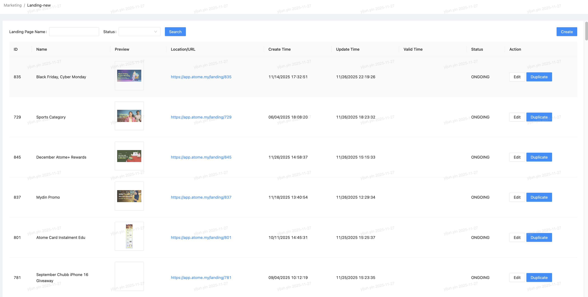

<table style="width:89%;">
<colgroup>
<col style="width: 8%" />
<col style="width: 16%" />
<col style="width: 64%" />
</colgroup>
<tbody>
<tr>
<td style="text-align: left;"><strong>模块</strong></td>
<td style="text-align: left;"><strong>字段</strong></td>
<td style="text-align: left;"><strong>规则</strong></td>
</tr>
<tr>
<td rowspan="9" style="text-align: left;"><strong>列表字段</strong></td>
<td style="text-align: left;">ID</td>
<td style="text-align: left;">系统自动生成的唯一标识</td>
</tr>
<tr>
<td style="text-align: left;">Name</td>
<td style="text-align: left;">展示 Landing Page 的名称，配置时设定</td>
</tr>
<tr>
<td style="text-align: left;">Preview</td>
<td style="text-align: left;">预览图；展示 LP 顶部图片；若首个组件是 campaign，则取 TO_COLLECT 图片</td>
</tr>
<tr>
<td style="text-align: left;">URL</td>
<td style="text-align: left;">
系统自动生成的 Landing Page 访问链接

该系统需要使用AIX申请的域名，此处需要进行处理
</td>
</tr>
<tr>
<td style="text-align: left;">Create Time</td>
<td style="text-align: left;">展示 LP 的创建时间</td>
</tr>
<tr>
<td style="text-align: left;">Update Time</td>
<td style="text-align: left;">展示 LP 的最后更新时间</td>
</tr>
<tr>
<td style="text-align: left;">Valid Time</td>
<td style="text-align: left;">展示 LP 的生效时间范围</td>
</tr>
<tr>
<td style="text-align: left;">Status</td>
<td style="text-align: left;">
Enabled：生效；用户可访问

Disabled：下线；用户不可访问，提示 “活动已下线”

Draft：草稿，用户不可访问
</td>
</tr>
<tr>
<td style="text-align: left;">Action</td>
<td style="text-align: left;">操作按钮：- Edit：点击跳转至 LP 编辑页面- Duplicate：点击复制当前 LP 配置</td>
</tr>
<tr>
<td rowspan="2" style="text-align: left;"><strong>筛选搜索</strong></td>
<td style="text-align: left;">Landing Page Name</td>
<td style="text-align: left;">文本输入框；支持在所有 LP 列表中模糊匹配搜索</td>
</tr>
<tr>
<td style="text-align: left;">Status</td>
<td style="text-align: left;">下拉选择框；选项：Enabled/Disabled/Draft</td>
</tr>
<tr>
<td rowspan="3" style="text-align: left;">操作按钮</td>
<td style="text-align: left;">Edit</td>
<td style="text-align: left;">点击跳转至 LP 编辑页面</td>
</tr>
<tr>
<td style="text-align: left;">Duplicate</td>
<td style="text-align: left;">点击跳转至 LP 编辑页面，并复制当前 LP 配置</td>
</tr>
<tr>
<td style="text-align: left;">Create</td>
<td style="text-align: left;">点击跳转至 LP 创建页面</td>
</tr>
</tbody>
</table>

**2.3.2 Landing Page新增和编辑**

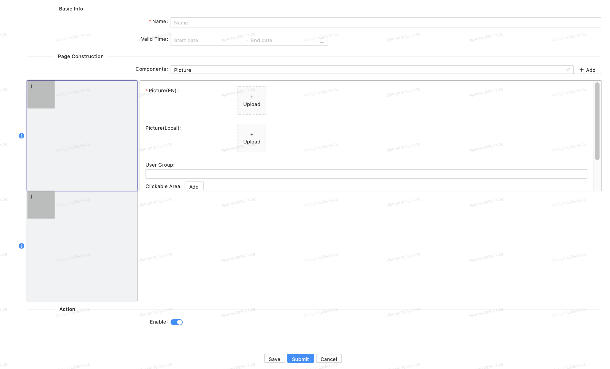

<table style="width:88%;">
<colgroup>
<col style="width: 9%" />
<col style="width: 15%" />
<col style="width: 63%" />
</colgroup>
<tbody>
<tr>
<td style="text-align: left;"><strong>模块</strong></td>
<td style="text-align: left;"><strong>字段</strong></td>
<td style="text-align: left;"><strong>规则</strong></td>
</tr>
<tr>
<td style="text-align: left;"><strong>基础配置</strong></td>
<td style="text-align: left;">Name</td>
<td style="text-align: left;">必填项；支持最多 50 字符输入，超出不可输入</td>
</tr>
<tr>
<td style="text-align: left;"><strong>状态按钮</strong></td>
<td style="text-align: left;">Enable button</td>
<td style="text-align: left;">默认开启；点击关闭则用户无法访问；Draft 状态下默认开启且不记录状态</td>
</tr>
<tr>
<td style="text-align: left;">组件配置</td>
<td style="text-align: left;">Components</td>
<td style="text-align: left;">必填项；下拉选项：Picture；点击 Add 按钮后显示对应编辑模块</td>
</tr>
<tr>
<td rowspan="4" style="text-align: left;"><strong>Picture组件</strong></td>
<td style="text-align: left;">图片规则</td>
<td style="text-align: left;">
不限比例、宽度填满；必填项；上传后在预览区域展示

支持配置EN和LOCAL，LOCAL对应越南语
</td>
</tr>
<tr>
<td style="text-align: left;">User Group</td>
<td style="text-align: left;">选填；为空则全员可见此模块</td>
</tr>
<tr>
<td style="text-align: left;">Clickable Area</td>
<td style="text-align: left;">最多添加 20 个；新增时生成带编号的默认点击区及配置行；点击区可拖动调整大小、不可重合、可删除；每个点击区配置一个跳转链接</td>
</tr>
<tr>
<td style="text-align: left;">Link Type</td>
<td style="text-align: left;">oboss 通用模块，创建后展示预览信息</td>
</tr>
<tr>
<td rowspan="4" style="text-align: left;"><strong>预览区域</strong></td>
<td style="text-align: left;">模块数量</td>
<td style="text-align: left;">至少 1 个，最多 100 个</td>
</tr>
<tr>
<td style="text-align: left;">模块排序</td>
<td style="text-align: left;">点击左侧蓝色按钮可拖拽调整 Component 顺序</td>
</tr>
<tr>
<td style="text-align: left;">图片展示</td>
<td style="text-align: left;">默认空图；上传后宽度固定、高度填满展示</td>
</tr>
<tr>
<td style="text-align: left;">模块操作</td>
<td style="text-align: left;">点击模块可编辑、删除</td>
</tr>
<tr>
<td rowspan="3" style="text-align: left;"><strong>操作按钮</strong></td>
<td style="text-align: left;">Save</td>
<td style="text-align: left;">点击保存内容并生成 ID、Link；非 Draft 状态（已 Submit）后不再展示该按钮</td>
</tr>
<tr>
<td style="text-align: left;">Submit</td>
<td style="text-align: left;">点击后发布 LP，状态为按照状态配置更新为 Enable 或 Disable</td>
</tr>
<tr>
<td style="text-align: left;">Cancel</td>
<td style="text-align: left;">不保存当前操作，返回上级列表页</td>
</tr>
<tr>
<td rowspan="2" style="text-align: left;"><strong>编辑逻辑</strong></td>
<td style="text-align: left;">Draft 状态</td>
<td style="text-align: left;">所有内容均可修改</td>
</tr>
<tr>
<td style="text-align: left;">Enabled/Disabled 状态</td>
<td style="text-align: left;">Name 不可修改，其他内容可修改</td>
</tr>
</tbody>
</table>

**3 Notification**

**3.1 Send Message**

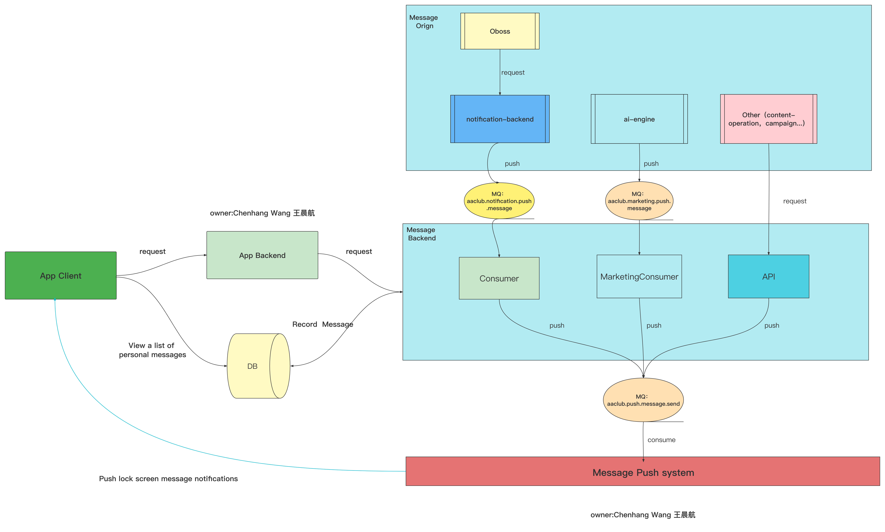

<table style="width:88%;">
<colgroup>
<col style="width: 88%" />
</colgroup>
<tbody>
<tr>
<td style="text-align: left;">
本期仅接入Push和Message Center两种消息推送形式，其余形式后续版本进行迭代

该模块描述的是通过Oboss创建推送任务并进行管理的推送
</td>
</tr>
</tbody>
</table>

|  |
|:---|
| 该能力依赖APP上报用户的 **device-token** ，用于确认推送设备，需要APP端支持 |

**3.1.1 Send Meesage管理**

页面入口：Notification center \> Send message；

在Notification系统内的Business line配置项，AIX需要与Atome进行隔离

Business line：本期仅AIX

管理列表

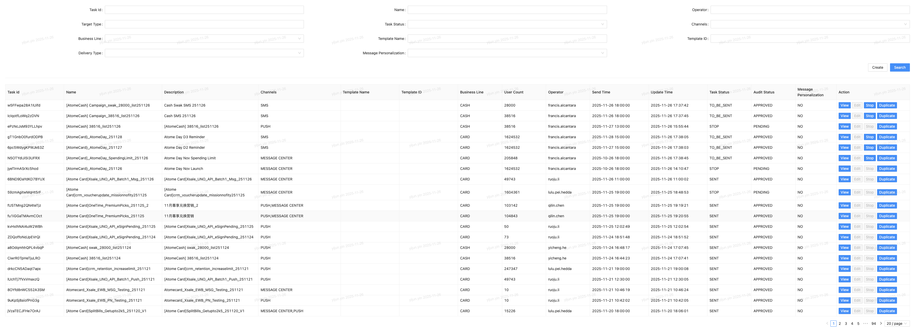

<table style="width:89%;">
<colgroup>
<col style="width: 8%" />
<col style="width: 14%" />
<col style="width: 66%" />
</colgroup>
<tbody>
<tr>
<td style="text-align: left;">模块</td>
<td style="text-align: left;">字段</td>
<td style="text-align: left;">规则</td>
</tr>
<tr>
<td rowspan="14" style="text-align: left;">列表字段</td>
<td style="text-align: left;">Task Id</td>
<td style="text-align: left;">推送任务唯一标识，系统自动生成</td>
</tr>
<tr>
<td style="text-align: left;">Name</td>
<td style="text-align: left;">推送任务名称，创建推送任务时配置</td>
</tr>
<tr>
<td style="text-align: left;">Description</td>
<td style="text-align: left;">任务描述，创建推送任务时配置</td>
</tr>
<tr>
<td style="text-align: left;">Channels</td>
<td style="text-align: left;">推送渠道，展示本次任务使用的渠道，支持展示多个，本期仅支持PUSH、Message Center</td>
</tr>
<tr>
<td style="text-align: left;">Template Name</td>
<td style="text-align: left;">关联模板名称，展示任务使用的消息模板名称，本期该字段为空</td>
</tr>
<tr>
<td style="text-align: left;">Template ID</td>
<td style="text-align: left;">关联模板 ID，展示任务使用的消息模板 ID，本期该字段为空</td>
</tr>
<tr>
<td style="text-align: left;">Business Line</td>
<td style="text-align: left;">所属业务线，展示任务对应的业务线，当前仅支持「AIX」</td>
</tr>
<tr>
<td style="text-align: left;">User Count</td>
<td style="text-align: left;">
目标用户数量

一次性发送任务：未发送时，取将要发送的用户数量；任务已发送，取已发送到用户数量

周期性推送任务：消息状态在变为sent前：展示下一期要推送的用户数量；消息状态在变为sent后，固定为最后一次推送到的用户数量

通过EVENT_TRIGGERED触发的推送任务：展示成果推送的用户数量
</td>
</tr>
<tr>
<td style="text-align: left;">Operator</td>
<td style="text-align: left;">操作人，展示创建推送任务的操作人名称</td>
</tr>
<tr>
<td style="text-align: left;">Send Time</td>
<td style="text-align: left;">
推送时间

一次性发送任务：格式为YYYY-MM-DD HH:MM:SS

周期性推送任务：格式为YYYY-MM-DD HH:MM:SS（首次推送时间）+发送周期拼接（every x days）

通过EVENT_TRIGGERED触发的推送任务：格式为YYYY-MM-DD HH:MM:SS
</td>
</tr>
<tr>
<td style="text-align: left;">Update Time</td>
<td style="text-align: left;">最后更新时间，格式为YYYY-MM-DD HH:MM:SS，记录任务状态变更的最新时间</td>
</tr>
<tr>
<td style="text-align: left;">Task Status</td>
<td style="text-align: left;">
CREATED

任务创建成功，提交后，未审核

任务创建成功，提交审核后，审核不通过

TO_BE_SENT

新建任务审核通过，未到达推送时间

推送失败后，补偿发送

SENDING

推送任务审核通过，且到达发送时间

推送失败的批次，系统补偿重新发送

周期性推送任务，且存在下一个推送周期

FAILED：服务异常，导致全部/部分批次未推送

SENT

一次性推送任务推送完成

周期性推送任务最后一个周期推送完成

STOP：审核通过后，手动终止的任务
</td>
</tr>
<tr>
<td style="text-align: left;">Audit Status</td>
<td style="text-align: left;">
审核状态，展示为APPROVED（审核通过）、PENDING（待审核），REJECTED（审核拒绝）

随审核流程自动更新
</td>
</tr>
<tr>
<td style="text-align: left;">Message Personalization</td>
<td style="text-align: left;">
消息个性化配置，展示为YES（开启）/NO（关闭），与任务配置一致

在消息配置中是否配置了个性化参数
</td>
</tr>
<tr>
<td rowspan="11" style="text-align: left;">搜索筛选</td>
<td style="text-align: left;">Task Id</td>
<td style="text-align: left;">组件类型：单行输入框；用于按任务 ID 精准筛选，支持文本输入匹配。</td>
</tr>
<tr>
<td style="text-align: left;">Name</td>
<td style="text-align: left;">组件类型：单行输入框；用于按任务名称模糊筛选，支持文本输入匹配。</td>
</tr>
<tr>
<td style="text-align: left;">Operator</td>
<td style="text-align: left;">组件类型：单行输入框；用于按操作人筛选，支持文本输入匹配。</td>
</tr>
<tr>
<td style="text-align: left;">Target Type</td>
<td style="text-align: left;">
组件类型：下拉选择框；用于按目标用户类型筛选。

选项：ALL_USERS、CREATED_USER_GROUP、EVENT_TRIGGERED
</td>
</tr>
<tr>
<td style="text-align: left;">Task Status</td>
<td style="text-align: left;">组件类型：下拉选择框；用于按任务状态筛选</td>
</tr>
<tr>
<td style="text-align: left;">Channels</td>
<td style="text-align: left;">组件类型：下拉选择框；用于按推送渠道筛选，选项包含PUSH、MESSAGE_CENTER。</td>
</tr>
<tr>
<td style="text-align: left;">Business Line</td>
<td style="text-align: left;">组件类型：下拉选择框；用于按业务线筛选，选项包含AIX</td>
</tr>
<tr>
<td style="text-align: left;">Template Name</td>
<td style="text-align: left;">组件类型：单行输入框；用于按模板名称筛选，支持文本输入匹配。本期无应用，正常保留</td>
</tr>
<tr>
<td style="text-align: left;">Template ID</td>
<td style="text-align: left;">组件类型：单行输入框；用于按模板 ID 筛选，支持文本输入匹配。本期无应用，正常保留</td>
</tr>
<tr>
<td style="text-align: left;">Delivery Type</td>
<td style="text-align: left;">
组件类型：下拉选择框；用于按推送类型筛选，选项为系统预设的推送类型分类。

选项：ONE_TIME、PERIODIC、EVENT_TRIGGERED
</td>
</tr>
<tr>
<td style="text-align: left;">Message Personalization</td>
<td style="text-align: left;">组件类型：下拉选择框；用于按消息个性化配置筛选，选项为YES（开启）、NO（关闭）。</td>
</tr>
<tr>
<td rowspan="4" style="text-align: left;">操作按钮</td>
<td style="text-align: left;">View</td>
<td style="text-align: left;">点击跳转至详情页，所有状态可见</td>
</tr>
<tr>
<td style="text-align: left;">Stop</td>
<td style="text-align: left;">仅TO_BE_SENT、SENDING、FAILED状态可点击，点击后状态切换为STOP</td>
</tr>
<tr>
<td style="text-align: left;">Duplicate</td>
<td style="text-align: left;">点击后复制任务配置生成新待编辑的推送任务</td>
</tr>
<tr>
<td style="text-align: left;">Edit</td>
<td style="text-align: left;">编辑按钮，点击跳转到配置编辑页面，仅CREATED状态可点击</td>
</tr>
</tbody>
</table>

**3.1.2 Pending List管理**

页面入口：Notification center \> Pending List；

Pending List管理页面的字段和筛选条件与Send Message页面基本一致，对差异部分进行表述

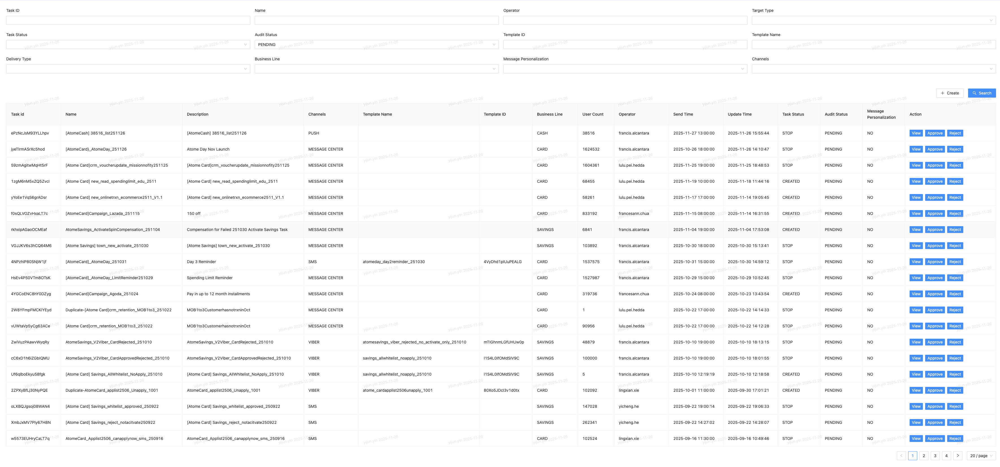

<table style="width:89%;">
<colgroup>
<col style="width: 8%" />
<col style="width: 13%" />
<col style="width: 67%" />
</colgroup>
<tbody>
<tr>
<td style="text-align: left;">搜索筛选</td>
<td style="text-align: left;">Audit Status</td>
<td style="text-align: left;">下拉选择组件；审核状态，选项为PENDING（待审核），AUDITED（已审核，包括APPROVED、REJECTED）；默认项为PENDING</td>
</tr>
<tr>
<td rowspan="3" style="text-align: left;">操作按钮</td>
<td style="text-align: left;">View</td>
<td style="text-align: left;">点击跳转至详情页，所有状态可见</td>
</tr>
<tr>
<td style="text-align: left;">Approve</td>
<td style="text-align: left;">PENDING状态可见，点击通过该任务，更新任务审批状态</td>
</tr>
<tr>
<td style="text-align: left;">Reject</td>
<td style="text-align: left;">PENDING状态可见，点击拒绝该任务，更新任务审批状态</td>
</tr>
</tbody>
</table>

**3.1.3 创建推送任务**

在Send Message和Pending List页面，点击Create按钮，进入创建推送任务流程

Target Audience 目标人群配置

> 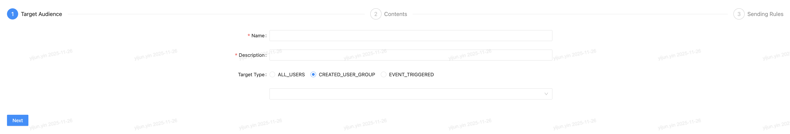

Name：文本输入，必填，字符限制：50，超出后无法输入

Description：文本输入，必填，字符限制：500，超出后无法输入

Target Type：接收人群类型，单选，枚举：All users、Created user group、Event Triggered

默认选All users，指所有用户可以接收到

选择Created user group时，可根据group name选择，数据来源于user group， 支持模糊查询，检索后单选

本期不支持Event Triggered形式，该选项置灰不可选择

Contents 推送内容配置

> 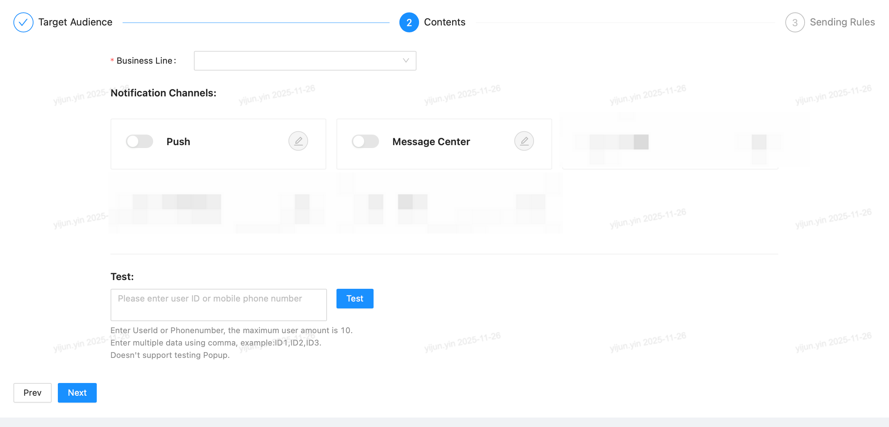

Business Line：必填，下拉单选，本期允许选择：待业务方提供

Notification Channels：与Business Line联动，只有选择了Business Line后才可编辑

本期包含2个卡片：Push、Message Center

点击进入对应的弹窗配置页面

Test：推送测试功能

测试人员名单：多行文本输入框，输入UserId或手机号作为测试体验账号，最大用户数为10。使用逗号输入多个数据，例如：ID1， ID2，ID3。

点击「Test」按钮，按照已经完成的推送配置对测试用户进行推送。

校验是否时有效的UID和手机号，该环节校验条件要符合AIX的UID生成规则，不符合则报错

校验是否已经完成推送配置，未完成则报错

Push推送配置

> 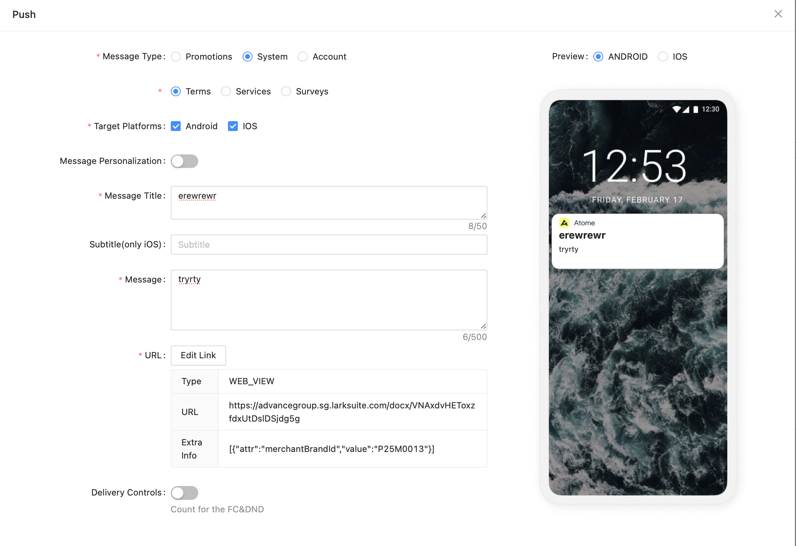

Message Type：控制消息分类；单选组合组件；必填；选择后联动二级选项：

**此处配置需要与Atome进行隔离，建议一级选项保持一致，二级选项进行差异化处理**

选 Promotions：二级选项为 ：Campaign、Offers、News、Rewards

选 System：二级选项为：Updated&Maintenance、Rules adjusted、Survey、Others

选 Account：二级选项为：Account verification、Account management、Card apply、Card activation、Card mailing、Card freezing/unfreezing

<table style="width:79%;">
<colgroup>
<col style="width: 78%" />
</colgroup>
<tbody>
<tr>
<td><table style="width:77%;">
<colgroup>
<col style="width: 8%" />
<col style="width: 19%" />
<col style="width: 5%" />
<col style="width: 5%" />
<col style="width: 5%" />
<col style="width: 5%" />
<col style="width: 5%" />
<col style="width: 9%" />
<col style="width: 9%" />
</colgroup>
<tbody>
<tr>
<td style="text-align: left;">
Category lv1

一级分类
</td>
<td style="text-align: left;">
Category lv2

二级分类
</td>
<td style="text-align: left;">caller</td>
<td style="text-align: left;">SMS</td>
<td style="text-align: left;">Email</td>
<td style="text-align: left;">Push</td>
<td style="text-align: left;">Message</td>
<td style="text-align: left;">是否支持人工发送</td>
<td style="text-align: left;">备注</td>
</tr>
<tr>
<td style="text-align: left;">Transaction:"1"</td>
<td style="text-align: left;">
Payment: "100"

deposit： "101"

Receive："102"

Send：“103"

Swap： "104"

Refund： "105"

Card application： "106"

Card Cancel： "107"

Abnormal transaction： "108"

Spending limit："109"
</td>
<td style="text-align: left;">Backend</td>
<td style="text-align: left;"></td>
<td style="text-align: left;">✅</td>
<td style="text-align: left;">✅</td>
<td style="text-align: left;">✅</td>
<td style="text-align: left;">否</td>
<td style="text-align: left;"></td>
</tr>
<tr>
<td style="text-align: left;">Promotions:"2"</td>
<td style="text-align: left;">
Campaign:"200"

Offers:"201"

News:"202"

Rewards:"203"
</td>
<td style="text-align: left;">
Backend

Oboss
</td>
<td style="text-align: left;"></td>
<td style="text-align: left;"></td>
<td style="text-align: left;">✅</td>
<td style="text-align: left;">✅</td>
<td style="text-align: left;">是</td>
<td style="text-align: left;"></td>
</tr>
<tr>
<td style="text-align: left;">account:"3"</td>
<td style="text-align: left;">
Account verification: "300"

Account management: "301"

Card apply: "302"

Card activation "303"

Card mailing "304"

Card freezing/unfreezing"305"
</td>
<td style="text-align: left;">Backend</td>
<td style="text-align: left;"></td>
<td style="text-align: left;">✅</td>
<td style="text-align: left;">✅</td>
<td style="text-align: left;">✅</td>
<td style="text-align: left;">否</td>
<td style="text-align: left;"></td>
</tr>
<tr>
<td style="text-align: left;">Security:"4"</td>
<td style="text-align: left;">
Register: "400"

Login:"401"

Forgot passcode /Reset passcode:"402"

Remote Login Alert："403"

Pin Reset: "404"

Change Mobile Number/Bind mobile number："405"
</td>
<td style="text-align: left;">Backend</td>
<td style="text-align: left;">✅</td>
<td style="text-align: left;">✅</td>
<td style="text-align: left;">✅</td>
<td style="text-align: left;">✅</td>
<td style="text-align: left;">否</td>
<td style="text-align: left;"></td>
</tr>
<tr>
<td style="text-align: left;">System:"5"</td>
<td style="text-align: left;">
Updated&amp;Maintenance："500"

Rules adjusted: "501"

Survey:"502"

Others:"000"
</td>
<td style="text-align: left;">
Oboss

Backend
</td>
<td style="text-align: left;"></td>
<td style="text-align: left;"></td>
<td style="text-align: left;">✅</td>
<td style="text-align: left;">✅</td>
<td style="text-align: left;"><del>是</del></td>
<td style="text-align: left;"></td>
</tr>
</tbody>
</table>

同步自文档: <a href="https://advancegroup.sg.larksuite.com/docx/YTU2dl5C7oEXhIxG6Nnlc1vng7D#VFXtdKtlxsWWEBbUBFDlWgF1gof">https://advancegroup.sg.larksuite.com/docx/YTU2dl5C7oEXhIxG6Nnlc1vng7D#VFXtdKtlxsWWEBbUBFDlWgF1gof</a>
</td>
</tr>
</tbody>
</table>

Target Platforms：控制推送的系统类型；复选组件；必填；选项为 Android、IOS

Message Title：消息标题；文本输入框组件；必填；字符限制 50

Message：消息内容；文本输入框组件；必填；字符限制 500

Subtitle (only IOS)：IOS 端副标题；文本输入框组件；选填；仅当 Target Platforms 含 IOS 时显示；字符限制 50

URL：跳转链接；deeplink配置组件；必填；

Delivery Controls：发送限制开关；开关组件；非必填；开启后受免打扰限制

Preview：预览功能；在弹窗右侧预览展示样式

可选择预览系统；选项为 Android、IOS；选项与 Target Platforms 联动

Confirm：提交按钮；按钮组件；点击校验内容，未通过则提示：

未选 Type：“Please select the Type”

未选 Target Platforms：“Please select the target platforms”

Title 为空：“Please enter the message title”

Message 为空：“Please enter the message”

URL 为空：“Please enter the jump link”

Cancel：关闭弹窗；点击关闭并保存已填内容

Message Center推送配置

> 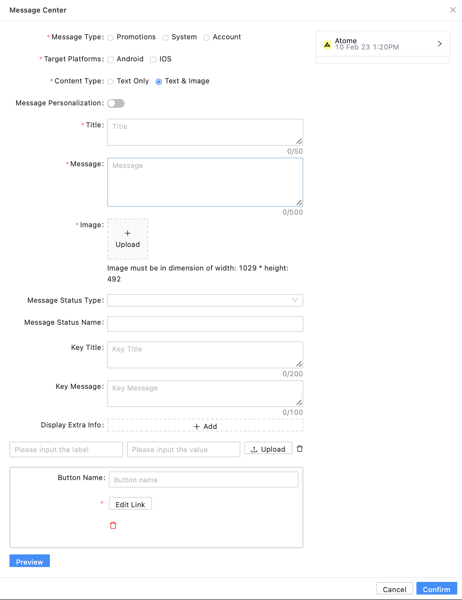

Message Type：控制消息分类；单选组合组件；必填；选择后联动二级选项：

**此处配置需要与Atome进行隔离，建议一级选项保持一致，二级选项进行差异化处理**

Target Platforms：推送系统类型；复选框组件；必填；选项为 Android、IOS

Content Type：内容类型；单选框组件；必填；选项为 Text Only（纯文本）、Text & Image（图文结合）

Title：消息标题；文本输入框组件；必填；字符限制 50

Message：消息内容；文本输入框组件；必填；字符限制 500

Image：消息图片；图片上传控件；选填；仅当 Content Type 为 Text & Image 时显示；要求宽 1029 \* 高 492，仅支持 jpg/png 格式

edit link：跳转链接；deeplink配置组件；必填；

Message Status Type：消息卡片状态类型，用于在消息中心highlight消息重要状态的icon；下拉单选组件；选填；选项为 SUCCESS、FAILED、REMINDER、PROCESSING、NULL，默认 NULL

Message Status Name：消息卡片状态文案，用于在消息中心highlight消息重要状态的标题；输入框组件；选填；字符限制 30

Key Title：消息卡片的关键标题，将加粗展示；输入框组件；选填；字符限制 200

Key Message：消息卡片的解释文案，浅色字体，支持换行；多行输入框组件；选填；字符限制 200

Display Extra Info：消息卡片额外信息；按钮组件；选填；点击 + Add 可添加 Label、Value、Icon；支持删除 / 新增

Label：展示标签，文本输入框

Value：展示价值，文本输入框

Icon：图片上传组件

Add Button：消息卡片按钮；按钮组件；选填；

Button Name：文本输入框，字符限制 30

URL：按钮跳转链接；deeplink配置组件；

Preview：消息卡片预览；点击在弹窗右侧展示预览样式

Confirm：提交按钮；按钮组件；点击校验内容，未通过则提示：

未选 Message Type / 二级选项：“Please select the Message Type”

未选 Target Platforms：“Please select the Target Platforms”

未选 Content Type：“Please select the Content Type”

Title 为空：“Please enter the Title”

Message 为空：“Please enter the Message”

edit link 为空：“Please select the Edit Link”

Cancel：关闭弹窗；点击关闭并保存已填内容

Sending Rules 推送规则配置

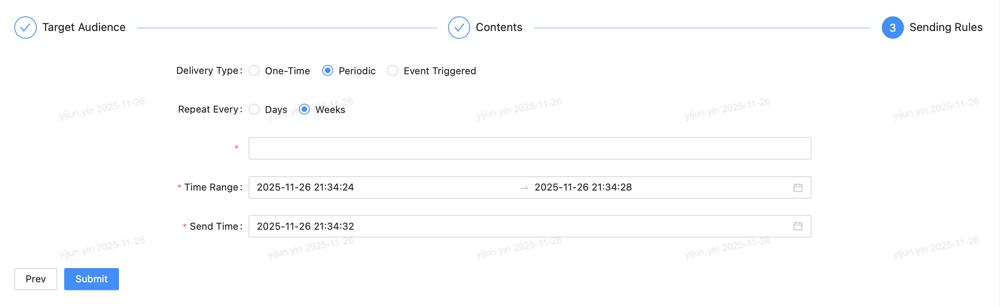

Delivery Type：必填，单选；显示：One-Time（一次性推送任务）、Periodic（重复性推送任务）两个选项

One-Time：为单次发送任务

勾选时，联动出现Scheduled Time选项，日期时间选择控件，选择具体发送时间

Periodic：为周期性发送

可选择重复频率，必填，按天/周发送，单选，且联动输入框：

选择按天时，需要输入n天，即每n天重复发送

选择按周时，需要输入n周，即每n周重复发送

任务起止时间，必填，即发送周期，

具体发送时间，必填，即首次次发送的具体时间

Event Triggered：本期不支持，置灰不可选择

**3.2 FC&DND**

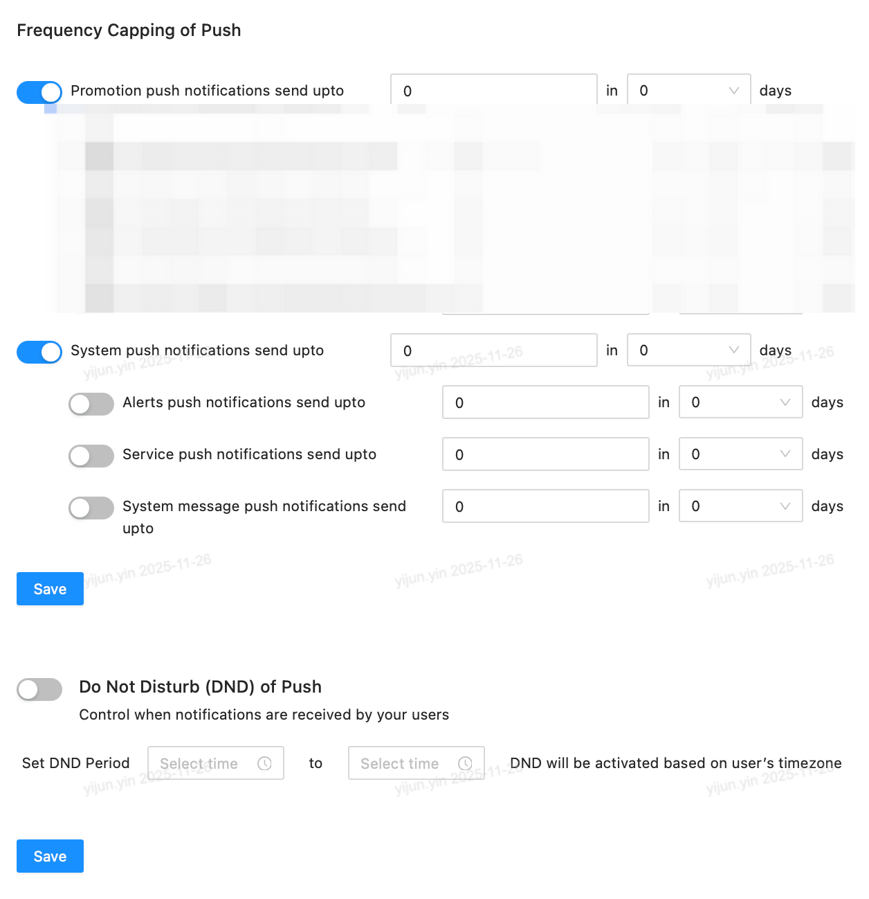

Frequency Capping of Push（推送频率限制）

功能说明：按一二级分类配置 Push 的发送频率限制

Promotion push notifications send upto

功能：配置 Promotion 类型 Push 的频率限制；开关组件；

打开后可配置 “M in N days”（N 天内最多发送 M 条）

规则：M、N 为整型（需校验）；N 为下拉单选，枚举 1-30

二级分类配置：空，待业务梳理AIX的Promotion 类型

System push notifications send upto

功能：配置 System 类型 Push 的频率限制；开关组件；

打开后可配置 “M in N days”（N 天内最多发送 M 条）

规则：M、N 为整型（需校验）；N 为下拉单选，枚举 1-30

二级分类配置：

Alerts push notifications send upto：配置 System 下 Alerts 类型的频率限制

Service push notifications send upto：配置 System 下 Service 类型的频率限制

System message push notifications send upto：配置 System 下 System message 类型的频率限制

Save：点击后保存当前频率限制规则；生效逻辑：以保存时间为频率统计的起始时间

Do Not Disturb (DND) of Push（推送免打扰）

功能说明：配置 Push 发送的免打扰时间段

功能开关配置：开启后生效

引导文案：“Control when notifications are received by your users”

免打扰时间范围配置项

文案说明：“Set DND Period” + “DND will be activated based on user’s timezone”

时间段配置：时间选择组件，选择一天内的一个时间段，配置开始和结束时间

Save ：点击后保存当前免打扰配置

免打扰规则（简要说明，本期不做变化）

底层根据FC配置，按push分类记录周期内push发送数量，如配置了promotion类型的push 在30天内最多发送10条，那么底层需记录实际发送数量，且30天重置一次

如超出限制，拦截push发送，作丢弃处理

**3.3 Analysis**

页面入口：Notification center \> Analysis

该页面展示通过OBOSS创建的推送任务的效果

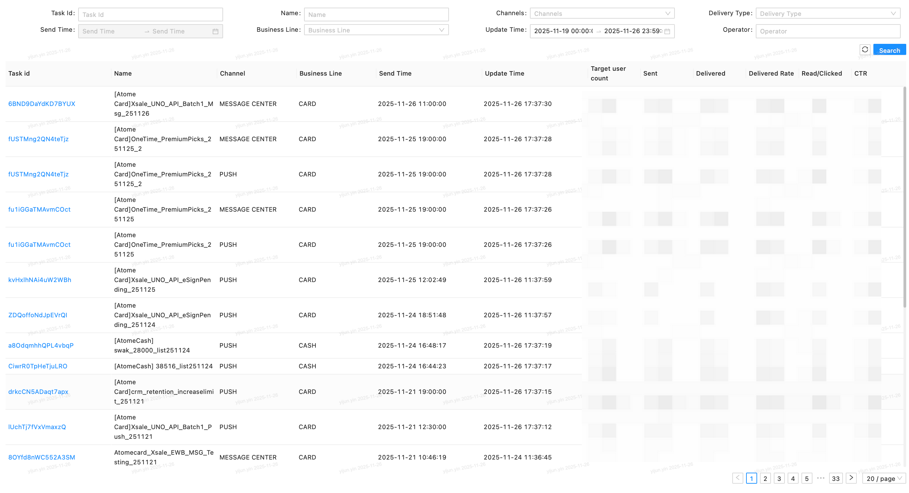

<table style="width:89%;">
<colgroup>
<col style="width: 9%" />
<col style="width: 12%" />
<col style="width: 66%" />
</colgroup>
<tbody>
<tr>
<td style="text-align: left;">模块</td>
<td style="text-align: left;">字段</td>
<td style="text-align: left;">规则</td>
</tr>
<tr>
<td rowspan="8" style="text-align: left;"><strong>筛选项</strong></td>
<td style="text-align: left;">Task Id</td>
<td style="text-align: left;">文本输入框，支持按任务 ID 筛选</td>
</tr>
<tr>
<td style="text-align: left;">Name</td>
<td style="text-align: left;">文本输入框，支持按任务名称筛选</td>
</tr>
<tr>
<td style="text-align: left;">Channel</td>
<td style="text-align: left;">下拉单选，枚举：MESSAGE CENTER、PUSH</td>
</tr>
<tr>
<td style="text-align: left;">Send Time</td>
<td style="text-align: left;">时间选择器，筛选 Send Time 在起止时间范围内的任务</td>
</tr>
<tr>
<td style="text-align: left;">Business Line</td>
<td style="text-align: left;">下拉单选，枚举：AIX</td>
</tr>
<tr>
<td style="text-align: left;">Delivery Type</td>
<td style="text-align: left;">下拉选择，筛选对应推送类型的任务</td>
</tr>
<tr>
<td style="text-align: left;">Update Time</td>
<td style="text-align: left;">时间选择器，筛选更新时间在起止范围内的任务</td>
</tr>
<tr>
<td style="text-align: left;">Operator</td>
<td style="text-align: left;">文本输入框，支持按操作人筛选</td>
</tr>
<tr>
<td rowspan="12" style="text-align: left;"><strong>列表字段</strong></td>
<td style="text-align: left;">Task id</td>
<td style="text-align: left;">文字链，点击跳转至对应任务详情页</td>
</tr>
<tr>
<td style="text-align: left;">Name</td>
<td style="text-align: left;">展示任务名称</td>
</tr>
<tr>
<td style="text-align: left;">Channel</td>
<td style="text-align: left;">展示实际推送渠道，枚举：MESSAGE CENTER、PUSH</td>
</tr>
<tr>
<td style="text-align: left;">Business Line</td>
<td style="text-align: left;">展示任务配置的业务线，枚举：AIX</td>
</tr>
<tr>
<td style="text-align: left;">Send Time</td>
<td style="text-align: left;">
One-Time：展示后台设置的 Scheduled Time

Periodic：展示对应周期的开始发送时间

EVENT_TRIGGERED：本期不支持
</td>
</tr>
<tr>
<td style="text-align: left;">Update Time</td>
<td style="text-align: left;">展示任务状态变为 SENT/STOP 的更新时间</td>
</tr>
<tr>
<td style="text-align: left;">Target User Count</td>
<td style="text-align: left;">
ALL_USERS：显示 “ALL”-

CREATED_USER_GROUP：显示对应用户组的用户数

EVENT_TRIGGERED：本期不支持
</td>
</tr>
<tr>
<td style="text-align: left;">Sent</td>
<td style="text-align: left;">
展示实际推送给下游服务的用户总数

PUSH：Push 消息发送，以 Target user 为基础，其中推送给App端成功的用户数量，记为 Sent

MESSAGE CENTER：Message Center 消息发送，以 Target user 为基础，其中推送给App端成功的用户数量，记为 Sent
</td>
</tr>
<tr>
<td style="text-align: left;">Delivered</td>
<td style="text-align: left;">
按渠道展示送达数

PUSH：消费 <strong>PushDisplay</strong> 的埋点数据，Action ID= ，以消息体extra结构中 messageId和mktTaskId匹配到营销平台的messageId和taskId

如果AIX项目的Action ID有变化，此处需要对应调整

MESSAGE CENTER：等于 Sent
</td>
</tr>
<tr>
<td style="text-align: left;">Delivered Rate</td>
<td style="text-align: left;">送达率（Delivered / Sent）</td>
</tr>
<tr>
<td style="text-align: left;">Read/Clicked</td>
<td style="text-align: left;">
按渠道展示已读 / 点击数

PUSH：消费 <strong>PushClick</strong> 的埋点数据，Action ID= ，以消息体extra结构中 messageId和mktTaskId匹配到营销平台的messageId和taskId

如果AIX项目的Action ID有变化，此处需要对应调整

MESSAGE CENTER：Message Center 消息，统计已读的用户数量
</td>
</tr>
<tr>
<td style="text-align: left;">CTR</td>
<td style="text-align: left;">点击率（Read/Clicked/ Delivered）</td>
</tr>
<tr>
<td style="text-align: left;"><strong>列表逻辑</strong></td>
<td style="text-align: left;">排序规则</td>
<td style="text-align: left;">按任务状态变为 SENT/STOP 的更新时间倒序排列</td>
</tr>
<tr>
<td style="text-align: left;"></td>
<td style="text-align: left;">拆分规则</td>
<td style="text-align: left;">
One-Time：按 Channel 维度拆分展示

Periodic：按 Channel + 发送周期维度拆分展示

EVENT_TRIGGERED：本期不支持
</td>
</tr>
</tbody>
</table>

**3.4 提供业务用的推送服务**

|                                                               |
|:--------------------------------------------------------------|
| 除了通过oboss创建推送任务外，本期也提供业务可用的实时推送服务 |

**aaclub.notification.push.message**

https://apifox.advai.net/apidoc/shared/5acecba2-39c3-4220-9c1e-99e313f2e315/api-28855

业务可通过该MQ直接生成需要推送的消息，进入消息推送队列；

businessLine：该字段需要增加枚举AIX

**3.5 消息中心展示对接**

**/internal/messages/query**

https://apifox.advai.net/apidoc/shared/5acecba2-39c3-4220-9c1e-99e313f2e315/api-36509

https://apifox.advai.net/apidoc/shared/70aae3c7-e6b3-4d8c-8bd0-fcfbb5cb3d6c/api-36502

该模块接口规范不变

对于AIX项目，如果有新增的**Message category**诉求，待用户端确认后协助进行调整

**4 Group**

**4.1 User Group**

**4.1.1 User Group管理**

页面入口：Group\>User Group New；页面查看权限：Usergroup - view

User Group管理列表

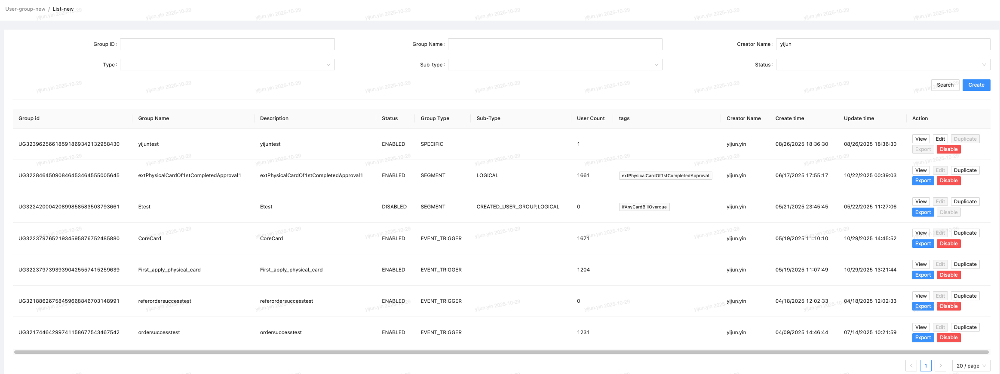

<table style="width:88%;">
<colgroup>
<col style="width: 8%" />
<col style="width: 11%" />
<col style="width: 68%" />
</colgroup>
<tbody>
<tr>
<td style="text-align: left;">模块</td>
<td style="text-align: left;">功能点</td>
<td style="text-align: left;">功能说明</td>
</tr>
<tr>
<td rowspan="11" style="text-align: left;">列表字段</td>
<td style="text-align: left;">Group id</td>
<td style="text-align: left;">用户组唯一 ID，创建成功后系统自动生成</td>
</tr>
<tr>
<td style="text-align: left;">Group Name</td>
<td style="text-align: left;">用户组名称，创建时由配置者设定</td>
</tr>
<tr>
<td style="text-align: left;">Description</td>
<td style="text-align: left;">用户组描述信息，创建时由配置者设定</td>
</tr>
<tr>
<td style="text-align: left;">Status</td>
<td style="text-align: left;">用户组状态；ENABLED表示启用，可用于使用；DISABLED表示禁用</td>
</tr>
<tr>
<td style="text-align: left;">Group Type</td>
<td style="text-align: left;">用户组类型；本期支持SPECFIFIC、SPLIT、ALL USER EXCLUDE USER、STATIC SUBGROUP</td>
</tr>
<tr>
<td style="text-align: left;">Sub-Type</td>
<td style="text-align: left;">用户组子类型，本期保留该字段，实际效果为全空；该字段当前仅用于SEGMENT类型，本期未接入</td>
</tr>
<tr>
<td style="text-align: left;">User Count</td>
<td style="text-align: left;">
该用户组下的用户预估数量，展示最近一次查询结果的数值，有3个更新节点

创建用户组时，会同步一次数据

每天凌晨会同步一次数据

每次发push的时候，会同步一次数据
</td>
</tr>
<tr>
<td style="text-align: left;">tags</td>
<td style="text-align: left;">
展示SPLIT类型分组后的结果

展示SEGMENT类型使用到的tag，本期未接入该类型
</td>
</tr>
<tr>
<td style="text-align: left;">Creator Name</td>
<td style="text-align: left;">创建者名称</td>
</tr>
<tr>
<td style="text-align: left;">Create time</td>
<td style="text-align: left;">用户组创建时间</td>
</tr>
<tr>
<td style="text-align: left;">Update time</td>
<td style="text-align: left;">用户组规则更新时间</td>
</tr>
<tr>
<td rowspan="6" style="text-align: left;">搜索筛选</td>
<td style="text-align: left;">Group ID</td>
<td style="text-align: left;">用户组唯一 ID，精确搜索</td>
</tr>
<tr>
<td style="text-align: left;">Group Name</td>
<td style="text-align: left;">用户组名称输入框，模糊搜索</td>
</tr>
<tr>
<td style="text-align: left;">Creator Name</td>
<td style="text-align: left;">创建者名称输入框，模糊搜索</td>
</tr>
<tr>
<td style="text-align: left;">Type</td>
<td style="text-align: left;">分组类型下拉选择框，本期支持All、SPECFIFIC、SPLIT、ALL USER EXCLUDE USER</td>
</tr>
<tr>
<td style="text-align: left;">Sub-type</td>
<td style="text-align: left;">分组子类型下拉选择框，本期支持All</td>
</tr>
<tr>
<td style="text-align: left;">Status</td>
<td style="text-align: left;">分组状态下拉选择框，ENABLED、DISABLED</td>
</tr>
<tr>
<td rowspan="5" style="text-align: left;">操作按钮</td>
<td style="text-align: left;">View</td>
<td style="text-align: left;">点击查看分组详情；SPLIT、EXTERNAL类型该按钮不可点击</td>
</tr>
<tr>
<td style="text-align: left;">Edit</td>
<td style="text-align: left;">点击编辑分组信息；SPECFIFIC类型支持编辑，其余类型按钮展示不可点击样式；关联权限Usergroup - edit</td>
</tr>
<tr>
<td style="text-align: left;">Duplicate</td>
<td style="text-align: left;">点击复制现有组并生成新组，点击跳转至编辑页面，配置规则与选定项一致，Group name增加Duplicate_前缀；EVENT TRIGGER、ALL USER EXCLUDE USER类型支持复制，其余类型按钮展示不可点击样式；关联权限Usergroup - edit</td>
</tr>
<tr>
<td style="text-align: left;">Export</td>
<td style="text-align: left;">
点击导出分组内用户数据；SPECFIFIC、EVENT TRIGGER、EXTERNAL类型支持导出；

生成一个csv文件，包含所有符合条件的userID并自动下载 
当用户组内 UID ＞100 万 时，将进行分包，导出多个文件；分包大小规则：自动分成每组50万UID数据

命名规则：采用 “分组标识 - 日期 - 子包信息” 格式

关联权限Usergroup - editx
</td>
</tr>
<tr>
<td style="text-align: left;">Disable</td>
<td style="text-align: left;">
点击禁用该用户分组，ENABLED状态的展示可点击样式，DISABLED状态展示不可点击样式；

点击按钮展示二次确认弹窗，确认后进行校验

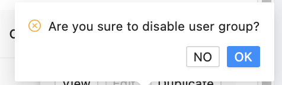

需要校验该user group是否在其他功能中有被使用：

未被使用，则后端更改user group状态为Disable，前端Disable按钮禁用，且关闭弹窗；

<table style="width:61%;">
<colgroup>
<col style="width: 60%" />
</colgroup>
<tbody>
<tr>
<td style="text-align: left;">校验规则详情：<a href="https://advancegroup.sg.larksuite.com/wiki/F91hwaawbiBzP2kxXPvuzPYDsbb?from=from_copylink">（已上线）【oboss】支持disable user group功能</a></td>
</tr>
</tbody>
</table>

如果user group有被使用，则弹出Failed弹窗，不更改user group状态；

<blockquote>

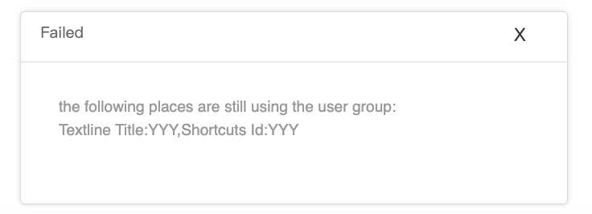

</blockquote>

关联权限Usergroup - edit
</td>
</tr>
</tbody>
</table>

~~长期未使用user group提醒~~

~~针对创建时间距当前时间15天以上的，未被使用过的且状态仍为Enable状态的user group，向lark发自动提醒：~~

~~提醒频率：每周两次；~~

~~发送时间：每周一、每周三早10点（北京时间）；~~

~~提醒内容：~~

~~标题：近期未被使用的user group，英文「Infrequently Used User Group Warning」~~

~~内容：Group id、Group Name、Creator Name、Create time；~~

~~每一个user group作为一条单独的内容提醒；~~

~~提醒方式：lark群报警机器人~~

**4.1.2 SPECFIFIC类型规则**

功能概述

SPECIFIC 类型用户组是通过上传用户 UID 列表在 OBoss 系统中创建的用户分组。

运营人员可分别维护**总人群 UID** 和**剔除人群 UID** ，最终该用户组的有效用户范围为：**总人群** 中的用户，排除 **需要剔除人群** 中的用户。

创建SPECFIFIC类型用户组

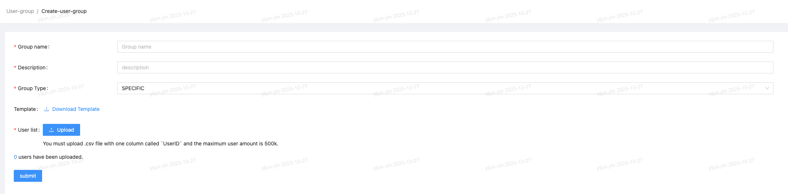

Group Type：SPECIFIC

Download Template：链接按钮，点击可下载用于上传用户列表的 CSV 模板template.csv

User list（Upload）：必选操作项，点击Upload按钮上传包含UserID列的 CSV 文件

创建时单个文件最大支持 50 万用户量；

页面提示 “*You must upload .csv file with one column called UserID and the maximum user amount is 500k.*”

上传计数：当用户上传成功后，显示本次已上传且校验匹配的用户数量，如 “666 *users have been uploaded.*”。

submit：提交按钮，点击后完成该特定用户分组的创建流程。

编辑SPECFIFIC类型用户组

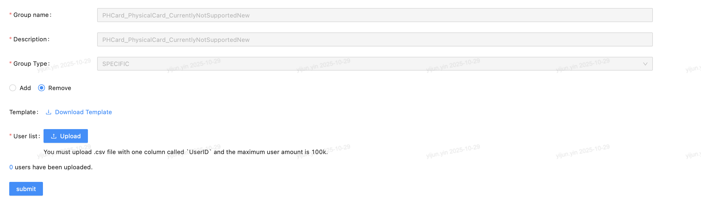

Add/Remove 类型选择：

Add：单选按钮，选择后上传的 UID 列表将增加在 **总人群** 中，即该用户组的基础用户范围。

Remove：单选按钮，选择后上传的 UID 列表将增加在 **剔除人群** 中，即从总人群中排除的用户范围。

User list（Upload）：必选操作项，点击Upload按钮上传 CSV 文件（含UserID列）；页面提示 “You must upload .csv file with one column called UserID and the maximum user amount is 100k.”

上传计数：显示已上传的用户数量，显示本次已上传且校验匹配的用户数量。

**业务方通过SPECFIFIC接口能力直接创建User group**

**4.1.3 SPLIT类型规则**

SPLIT 类型用户组，支持将指定的源用户组（Operation Group）随机拆分为若干子分组，满足用户分群测试、分层运营等业务场景需求。

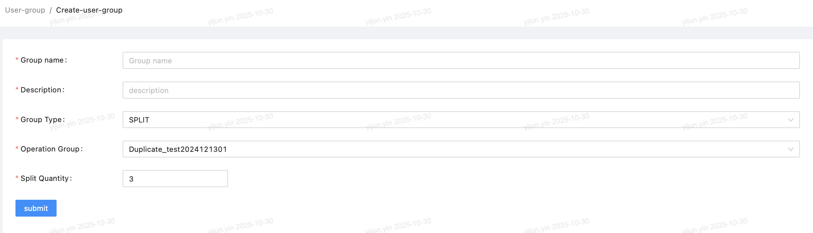

Group Type：SPLIT

Operation Group：必选下拉框组件，支持模糊搜索，用于选择需要拆分的源用户组。

**单选检索下拉组件**选项规则：

启用ENABLE状态

组类型为 ALL、SPECIFIC、ALL_USER_EXCLUDE_USER 的用户组。

Split Quantity：必选文本输入框，仅允许输入正整数N（取值范围1-10），

表示将 Operation Group 随机拆分为N份子分组，各子分组的标签格式为 “group name_x”。

**4.1.4 ALL USER EXCLUDE USER类型规则**

ALL_USER_EXCLUDE_USER 类型用户组，逻辑为 “全量用户排除指定用户组”，满足排除特定人群的运营需求。

该类型的数据不会落库也不会定时更新预计可用人数，仅在使用时进行判断。

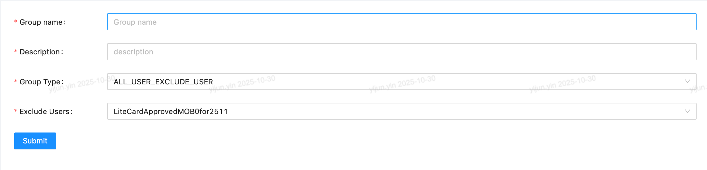

Group Type：ALL_USER_EXCLUDE_USER

Exclude Users：必选下拉框组件，默认文案为 “Select user group”，用于选择需要排除的用户组。支持根据符合条件的组的名称进行模糊搜索

**单选检索下拉组件**选项规则：

启用ENABLE状态

用户量user count小于 20 万

组类型为 SPECIFIC

**4.1.5 User Group使用场景**

用户组（User Group）核心支撑两类业务场景，覆盖 “实时校验” 与 “提前圈选” 两大核心需求，适配不同业务运营与功能配置场景：

实时校验

场景定义：基于用户组配置的多维度条件组合，实时校验单个用户是否符合规则，进而触发差异化的功能展示或交互逻辑。

核心逻辑：以用户唯一标识（UID）为检索依据，实时查询该用户是否满足用户组的配置条件（如属性、标签、行为等组合规则）。

典型应用：主要用于与 APP 端、campaign/task等功能的发放判断等场景

人群圈选

场景定义：基于预设的配置条件（如用户属性、行为标签、业务状态等），在指定时间筛选出符合条件的用户集合（用户 UID 列表），用于定向运营动作。

核心逻辑：系统根据用户组规则，在指定时间计算并存储满足条件的全量用户列表，无需实时校验，可直接调用该用户集合。

典型应用：主要用于营销触达、定向发券、定向发放任务等场景

**5 Link**

**5.1 生成Deep Link**

**WEB_VIEW类型**：用于配置指向在线Web页面的Deeplink，APP内通过WebView组件加载该在线页面。

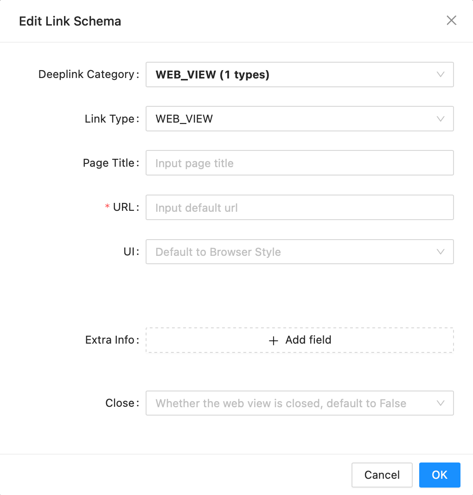

**配置字段**：

Deeplink Category：选择为WEB_VIEW。

Link Type：在Deeplink Category=WEB_VIEW时，该选择仅允许选择为WEB_VIEW。

Page Title：输入框，用于填写Web页面的标题，非必填。

URL：必填输入框，需输入在线Web页面的默认URL。

UI：下拉选择框，用于设置WebView的UI样式。

Native Style：采用原生风格的 UI 展示，与 APP 原生界面交互逻辑、样式保持一致

Browser Style：采用类浏览器的 UI 风格，模拟浏览器的导航、交互体验

Hide Navigation：隐藏导航栏，WebView 页面不展示导航元素，营造沉浸式页面体验

Bottom Sheet：以底部弹窗（Bottom Sheet）的形式展示 WebView 页面，点击外部可关闭

Extra Info：通过+ Add field可添加额外信息字段，用于传递自定义参数。当前版本该选项为空。

Close：下拉选择框，用于设置WebView的关闭逻辑，未配置则为false；选项为 true 、false。

~~**OFFLINE_WEB_VIEW类型**：用于配置指向离线Web页面的Deeplink，APP内通过WebView组件加载本地离线Web资源。~~

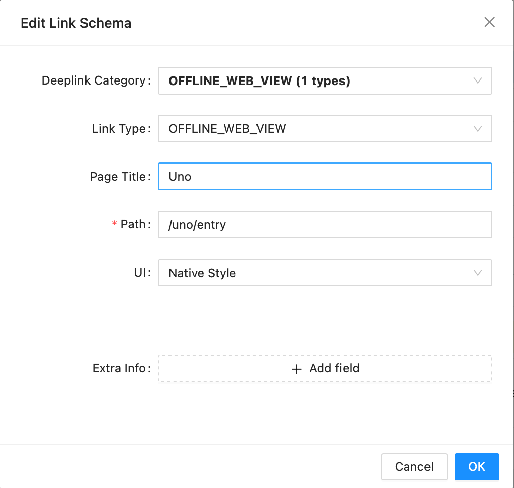

~~**配置字段**：~~

~~Deeplink Category：选择为OFFLINE_WEB_VIEW。~~

~~Link Type：在Deeplink Category=OFFLINE_WEB_VIEW时，该选择仅允许选择为OFFLINE_WEB_VIEW。~~

~~Page Title：输入框，用于填写Web页面的标题，非必填。~~

~~PATH：必填输入框，需输入离线Web页面的路径参数。~~

~~UI：下拉选择框，用于设置WebView的UI样式。~~

~~Native Style：采用原生风格的 UI 展示，与 APP 原生界面交互逻辑、样式保持一致~~

~~Browser Style：采用类浏览器的 UI 风格，模拟浏览器的导航、交互体验~~

~~Hide Navigation：隐藏导航栏，WebView 页面不展示导航元素，营造沉浸式页面体验~~

~~Bottom Sheet：以底部弹窗（Bottom Sheet）的形式展示 WebView 页面，点击外部可关闭~~

~~Extra Info：通过+ Add field可添加额外信息字段，用于传递自定义参数。当前版本该选项为空。~~

EXTERNAL_BROWSER类型：用于配置需在外部浏览器中打开的任意URL，触发APP外浏览器跳转。

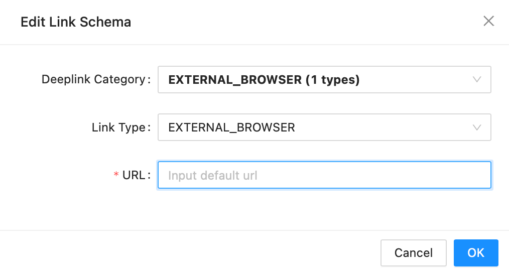

**配置字段**

Deeplink Category：选择为EXTERNAL_BROWSER。

Link Type：在Deeplink Category=EXTERNAL_BROWSER时，该选择仅允许选择为EXTERNAL_BROWSER。

：必填输入框，需输入在线Web页面的默认URL。

**Others类型（原生页面）**：用于配置指向APP内纯原生页面的Deeplink，通过选择对应路由Path实现原生页面跳转。

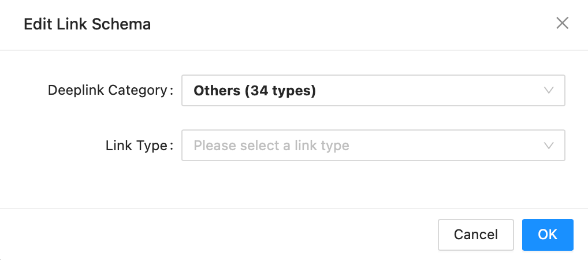

**配置字段**：

Deeplink Category：选择为Others。

Link Type：下拉选择框，需选择具体的原生页面路由类型。选项由研发进行维和，在新增原生页面时，将类型维护在功能中供运营方选择。

**5.2 生成结果**

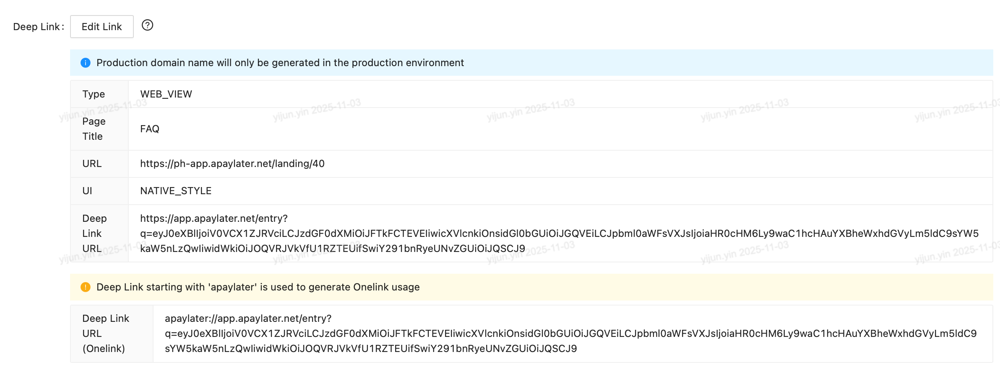

配置信息展示，根据创建时的选项进行完整展示

Type：WEB_VIEW，标识链接类型。

Page Title：配置的 Web 页面标题（如示例中 “FAQ”）。

URL：配置的在线 Web 页面完整 URL。

UI：选择的 WebView 展示样式（如示例中NATIVE_STYLE）。

DeepLink 结果输出，生成deeplink和onelink两种链接

Deep Link URL：生成的使用标准的 HTTPS 协议的DeepLink 链接。

更安全，用户可以看到完整的 URL，适合外部分享。

Deep Link URL (Onelink)：生成的使用自定义的应用协议的Onelink 格式链接。

更快速，但需要用户信任该协议，适合内部应用使用。

**6 System Users**

**6.1 权限系统概述**

权限体系核心逻辑

系统采用 “权限点 - 权限角色 - 用户” 三层关联逻辑，实现页面展示与功能使用的精细化权限管控，确保用户仅能访问与操作具备权限的功能模块。

权限点：

权限点由研发团队在开发页面或功能时按需设定，作为系统功能的最小权限单元，明确标识某一页面的访问权限或某一功能的操作权限。

命名规范：采用 “模块 / 功能 - 操作类型” 格式命名，确保权限点含义清晰、可追溯。

权限角色

权限角色是权限点的集合，用于关联一组业务相关的权限点

每个权限角色可灵活配置关联的权限点，支持根据业务角色的职责范围，组合不同的权限点形成专属规则。

用户权限

关联方式：通过赋予用户权限角色，建立用户与权限点的间接关联关系（即用户获得某一权限角色后，自动拥有该规则下所有权限点的权限）。

权限校验逻辑：当用户使用某一功能（如访问页面、执行操作）时，系统会实时校验用户是否拥有该功能对应的权限点；若拥有则允许使用，否则拦截操作并提示权限不足。

用户与lark相关联，仅有我司lark账号可以申请权限以及左右权限的审批人。当用户失去lark身份，则对应失去系统的用户身份。

**6.2 System Roles**

权限管理管理

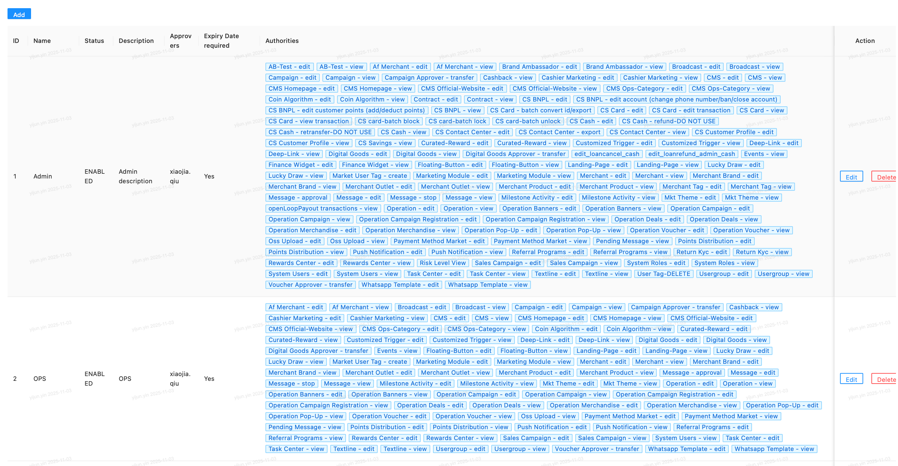

<table style="width:88%;">
<colgroup>
<col style="width: 8%" />
<col style="width: 11%" />
<col style="width: 68%" />
</colgroup>
<tbody>
<tr>
<td style="text-align: left;">模块</td>
<td style="text-align: left;">功能点</td>
<td style="text-align: left;">功能说明</td>
</tr>
<tr>
<td rowspan="7" style="text-align: left;">列表字段</td>
<td style="text-align: left;">ID</td>
<td style="text-align: left;">角色的唯一标识，由系统自动生成，无需人工配置，用于后台数据关联与前端唯一识别</td>
</tr>
<tr>
<td style="text-align: left;">Name</td>
<td style="text-align: left;">角色的业务名称，创建权限角色时填写</td>
</tr>
<tr>
<td style="text-align: left;">Status</td>
<td style="text-align: left;">
角色的启用状态

ENABLED：启用状态，角色可正常分配给用户，用户获得该角色对应的权限

DISABLED：禁用状态，角色暂不可分配，已分配用户的对应权限临时失效
</td>
</tr>
<tr>
<td style="text-align: left;">Description</td>
<td style="text-align: left;">角色的业务描述，用于说明角色的用途或适用场景，创建权限角色时填写</td>
</tr>
<tr>
<td style="text-align: left;">Approvers</td>
<td style="text-align: left;">该角色的审批人，申请该权限时将有审批人受到审批</td>
</tr>
<tr>
<td style="text-align: left;">Expiry Date required</td>
<td style="text-align: left;">
标识该角色是否需要设置过期日期

Yes：需要设置，适用于临时权限场景，到期后角色自动失效

No：无需设置，适用于长期固定权限场景（如职能部门），角色长期有效
</td>
</tr>
<tr>
<td style="text-align: left;">Authorities</td>
<td style="text-align: left;">该角色关联的权限点集合，以标签形式直观展示</td>
</tr>
<tr>
<td rowspan="3" style="text-align: left;">操作按钮</td>
<td style="text-align: left;">Add 按钮</td>
<td style="text-align: left;">点击后进入角色新增页面，支持创建新的权限角色</td>
</tr>
<tr>
<td style="text-align: left;">Edit 按钮</td>
<td style="text-align: left;">针对单条角色记录，点击后进入编辑页面</td>
</tr>
<tr>
<td style="text-align: left;">Delete 按钮</td>
<td style="text-align: left;">针对单条角色记录，点击后删除该角色</td>
</tr>
</tbody>
</table>

权限角色新增与删除

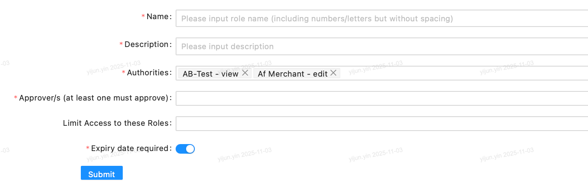

Name：必填输入框，用于填写权限角色的业务名称。

Description：必填输入框，用于填写角色的业务描述，说明角色的适用场景与权限范围。

Authorities：必填区域，展示当前角色关联的所有权限点；支持添加或删除权限点。

点击展示多选组件，允许模糊搜索，所有选中的权限点将以标签的形式展示在组件中

Approver/s ：必填区域，用于选择申请该权限角色的审批人，至少选择 1 位审批人；支持添加或删除审批人。

Limit Access to these Roles：选填输入框，访问时长选项。

Expiry date required：必填开关组件，用于设置该角色是否需要过期日期：

开启（选中）：需配置角色的过期日期，适用于临时权限场景；

关闭（未选中）：无需配置过期日期，适用于长期权限场景。

检验规则

必填校验：提交前需确保已填写或配置。

审批人规则：Approver/s至少选择 1 位审批人，否则无法提交，保障权限变更的审批合规性。

权限点管理：可根据业务需求新增或删除Authorities中的权限点，实现角色权限的动态调整；权限点由研发预设，编辑时仅支持选择已有权限点。

过期日期逻辑：若Expiry date required开启，需在后续流程中配置具体过期日期。

System User List

用户管理：该页面用于管理 “用户 - 权限角色” 的关联关系

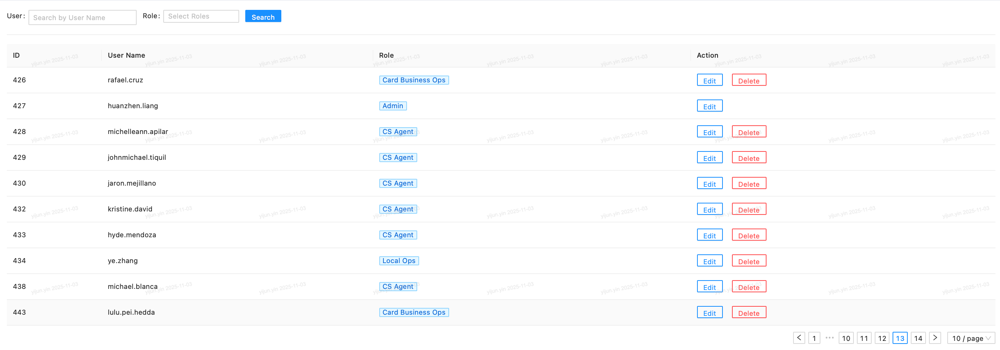

<table style="width:88%;">
<colgroup>
<col style="width: 11%" />
<col style="width: 12%" />
<col style="width: 64%" />
</colgroup>
<tbody>
<tr>
<td style="text-align: left;">模块</td>
<td style="text-align: left;">功能点</td>
<td style="text-align: left;">功能说明</td>
</tr>
<tr>
<td rowspan="2" style="text-align: left;">搜索筛选</td>
<td style="text-align: left;">User输入框</td>
<td style="text-align: left;">支持通过用户名模糊搜索用户，快速定位目标用户的权限信息</td>
</tr>
<tr>
<td style="text-align: left;">Role下拉框</td>
<td style="text-align: left;">支持选择特定角色，筛选出拥有该角色的所有用户</td>
</tr>
<tr>
<td rowspan="3" style="text-align: left;">列表字段</td>
<td style="text-align: left;">ID</td>
<td style="text-align: left;">用户的唯一标识，系统自动生成</td>
</tr>
<tr>
<td style="text-align: left;">User Name</td>
<td style="text-align: left;">用户名称，创建员工档案时确认</td>
</tr>
<tr>
<td style="text-align: left;">Role</td>
<td style="text-align: left;">用户关联的权限角色，以标签形式展示</td>
</tr>
<tr>
<td rowspan="2" style="text-align: left;">操作按钮</td>
<td style="text-align: left;">Edit</td>
<td style="text-align: left;">点击进入用户权限编辑页面，可修改用户关联的权限角色</td>
</tr>
<tr>
<td style="text-align: left;">Delete</td>
<td style="text-align: left;">点击删除该用户，移除该用户的所有权限；拥有Admin权限的用户不允许被删除。</td>
</tr>
</tbody>
</table>

用户编辑

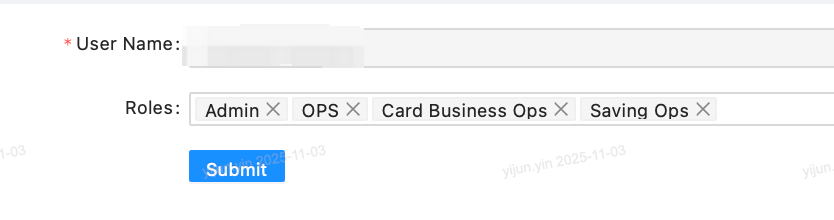

点击编辑按钮可查看该用户拥有的权限角色。允许通过删除按钮移除用户拥有的权限角色。

完成编辑后点击提交完成修改。

**63 Apply Access**

权限申请

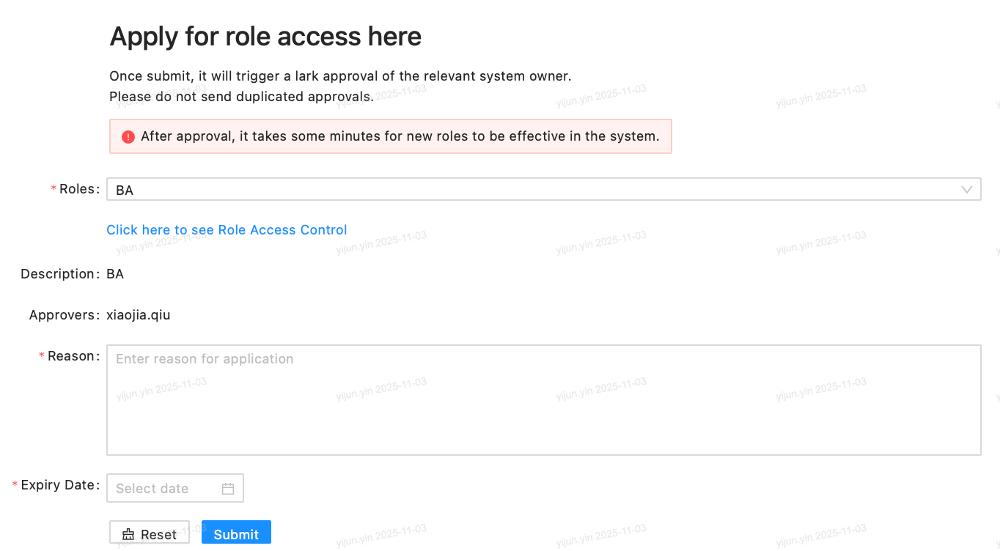

\*Roles 下拉框：必填，用于选择申请的权限角色，角色选项由系统预设的权限角色列表提供。

角色说明链接：“Click here to see Role Access Control”，点击跳转System Roles页面。

Description：展示所选角色的业务描述，为申请者提供角色用途参考。

Approvers：展示该角色申请的审批人。

Reason 输入框：必填，用于填写申请权限的原因，说明申请的业务必要性。

Expiry Date 日期选择框：必填，用于选择权限的过期日期，适配临时权限申请场景。

是否展示该选项由创建对应的权限角色是否配置该字段决定。

权限审批

权限审批与Lark的审批系统进行关联

消息提醒：审批人在 Lark 端收到消息通知（包含审批单摘要：申请人、申请角色、申请理由），点击通知可进入审批详情页。

审批操作：Lark 审批详情页展示完整申请信息（与系统提交内容一致），支持两种操作：

通过：审批人点击 “通过” 按钮，Lark 系统记录审批结果并同步时间，并同步至权限管理系统。

权限管理系统接收 Lark “通过” 结果后，自动执行权限赋予：自动为申请用户赋予所申请的权限角色，关联用户与角色的关联关系。

系统向申请用户推送 Lark 通知，告知用户申请成功。

拒绝：审批人点击 “拒绝” 按钮，需填写拒绝原因（必填），Lark 系统记录结果后同步至权限管理系统。

权限管理系统接收 Lark “拒绝” 结果后，不执行权限赋予操作，仅记录审批状态为 “已拒绝”。

系统向申请用户推送 Lark 通知，告知用户申请驳回。
