# AIX Security 身份认证需求V1.0

# 1. 需求变更日志

<table style="width:89%;">
<colgroup>
<col style="width: 10%" />
<col style="width: 10%" />
<col style="width: 45%" />
<col style="width: 22%" />
</colgroup>
<tbody>
<tr>
<td style="text-align: left;">变更时间</td>
<td style="text-align: left;">变更人</td>
<td style="text-align: left;">变更内容</td>
<td style="text-align: left;">备注</td>
</tr>
<tr>
<td style="text-align: left;">2025-10-21</td>
<td style="text-align: left;">@Yifeng Wu 吴忆锋</td>
<td style="text-align: left;">初稿</td>
<td style="text-align: left;"></td>
</tr>
<tr>
<td style="text-align: left;">2025-11-04</td>
<td style="text-align: left;">@Yifeng Wu 吴忆锋</td>
<td style="text-align: left;">
【7.1.1 流程说明】

增加跳过认证逻辑，如果是bio登录场景，可以跳过认证

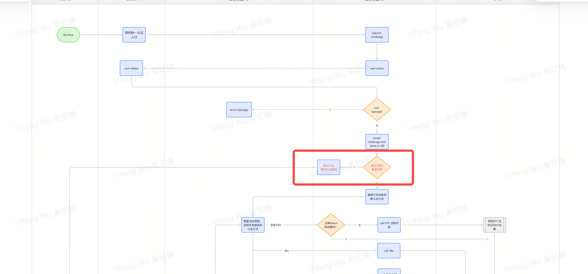
</td>
<td style="text-align: left;"></td>
</tr>
<tr>
<td style="text-align: left;">2025-11-06</td>
<td style="text-align: left;">@Yifeng Wu 吴忆锋</td>
<td style="text-align: left;">
【活体认证】模块已更新完毕

@Xin Wang 王鑫@Liang Wu 吴亮
</td>
<td style="text-align: left;"></td>
</tr>
<tr>
<td style="text-align: left;">2025-11-28</td>
<td style="text-align: left;">@Yifeng Wu 吴忆锋</td>
<td style="text-align: left;">
<strong>1、验证处理规则</strong>

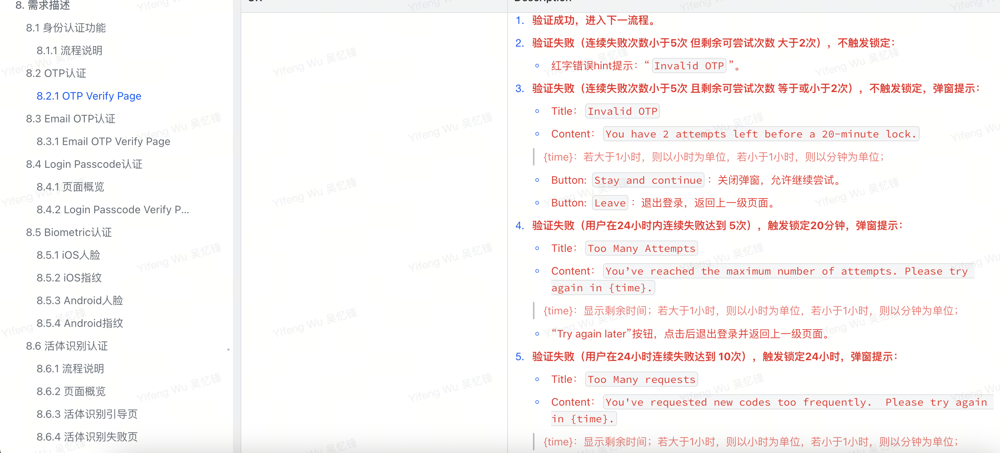

调整内容：调整描述4种失败场景；

影响范围：

8.2.1 OTP Verify Page

8.3.1 Email OTP Verify Page

8.4.2 Login Passcode Verify Page

<strong>2、 进入页面自动触发otp规则</strong>

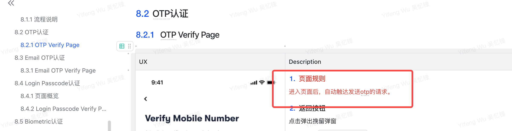

调整内容：进入页面后，自动触达发送otp的请求。

影响范围：

8.2.1 OTP Verify Page

8.3.1 Email OTP Verify Page

@Dongjie Tan 谭东杰@Xin Wang 王鑫@Bowen Li (Eli)@Lei Zhang 张雷
</td>
<td style="text-align: left;"></td>
</tr>
</tbody>
</table>

# 2. 引用资料

|  |  |
|:---|:---|
| **类型** | 链接 |
| PM | @Yifeng Wu 吴忆锋 |
| Figma | https://www.figma.com/design/LxHqrwdNow4AnEZG3Sj9bF/%E2%86%92-AIX-Dev-Handoff-2026-Q1?node-id=7004-13147&t=GOP5txT3YSZu48D4-0 |
| 翻译文案 | [AIX 翻译文案管理-多维表](https://advancegroup.sg.larksuite.com/wiki/Ah4UwdvDMiY19lkuMkwlHzWPgLd?from=from_copylink) |
| BRD | N/A |
| 技术方案 | [AIX System Design v0.1(Draft)](https://advancegroup.sg.larksuite.com/wiki/DHvYw3fRkiFYkRkiHK9lwSG4gnh) |

# 3. 需求索引

**\[同步块-无权限下载此内容\]**

# 2. 项目概述

2.1 **项目背景**

|  |
|:---|
| 为满足全球用户对一体化、便捷安全数字金融服务的需求，本项目旨在开发一款创新的移动应用。该应用将整合先进的支付与账户管理技术，致力于为用户提供全新的移动端金融管理体验。 |

2.2 **项目目的**

<table style="width:88%;">
<colgroup>
<col style="width: 88%" />
</colgroup>
<tbody>
<tr>
<td>
构建基础​：建立安全、便捷的用户注册登录与账户体系。

核心功能​：实现充值、提现、转账、消费等关键支付功能。

安全保障​：通过多层验证与风控策略，确保用户资产与信息安全。

体验优化​：提供流畅直观的操作流程，提升用户留存。
</td>
</tr>
</tbody>
</table>

2.3 **名词解释**

<table style="width:88%;">
<colgroup>
<col style="width: 88%" />
</colgroup>
<tbody>
<tr>
<td><table style="width:86%;">
<colgroup>
<col style="width: 16%" />
<col style="width: 69%" />
</colgroup>
<tbody>
<tr>
<td style="text-align: left;"><strong>名词/缩写</strong></td>
<td style="text-align: left;"><strong>说明</strong></td>
</tr>
<tr>
<td style="text-align: left;">DeviceID</td>
<td style="text-align: left;">用于唯一识别用户客户端的设备编号。用于实现设备绑定、可信设备判断及风险控制等。</td>
</tr>
<tr>
<td style="text-align: left;">IVS</td>
<td style="text-align: left;">
Identity Verification Service，身份验证服务。

通常指用于进行高强度实名验证的服务（如证件识别、人脸比对等），在注册或敏感操作流程中可能被调用。
</td>
</tr>
<tr>
<td style="text-align: left;">Biometric</td>
<td style="text-align: left;">通过用户的生物特征（如指纹、面部信息）进行身份验证的技术。支持iOS Face ID/Android指纹/人脸</td>
</tr>
<tr>
<td style="text-align: left;">AIX Tag</td>
<td style="text-align: left;">用户在AIX平台上的身份标识符。用于在转账、社交等场景中代替复杂的钱包地址，使用户能够被轻松找到和支付。此标识一旦设置，通常不可更改。</td>
</tr>
<tr>
<td style="text-align: left;">DTC</td>
<td style="text-align: left;">AIX项目的合作伙伴，提供加密钱包、卡片发行和KYC服务的后端平台，支持OpenAPI接口，用于处理交易、认证和账户管理。</td>
</tr>
<tr>
<td style="text-align: left;">AAI</td>
<td style="text-align: left;">第三方身份验证服务提供商，用于KYC流程中的护照上传、活体检测和人脸比对。支持Webhook回调和URL生成。</td>
</tr>
<tr>
<td style="text-align: left;">Master Account</td>
<td style="text-align: left;">DTC侧的账户概念，主账户，可申请API Key管理多个Sub Account。敏感操作需Sub Account授权。</td>
</tr>
<tr>
<td style="text-align: left;">Sub Account</td>
<td style="text-align: left;">DTC侧的账户概念，子账户，由Master创建，用于分离用户资产。KYC需独立完成。</td>
</tr>
<tr>
<td style="text-align: left;">WalletConnect</td>
<td style="text-align: left;">通过Deeplink/QR链接外部钱包充值。自动加白名单、交易报备，直接到账。</td>
</tr>
<tr>
<td style="text-align: left;">PIN</td>
<td style="text-align: left;">Personal Identification Number，卡片PIN码，用于线下交易。4位数字，支持Set/Change/Reset。</td>
</tr>
<tr>
<td style="text-align: left;">稳定币类型</td>
<td style="text-align: left;">稳定币类型USDC, USDT, FDUSD, WUSD，支持在BASE/BSC/ETHEREUM/SOLANA网络充值/转账/兑换。</td>
</tr>
<tr>
<td style="text-align: left;">区块链网络</td>
<td style="text-align: left;">支持的区块链网络，各网络币种不同（e.g., BASE: USDC）。包括：BASE, BSC, ETHEREUM, SOLANA</td>
</tr>
<tr>
<td style="text-align: left;">Global Travel Rule</td>
<td style="text-align: left;">全球旅行规则，合规要求，仅支持如Binance的白名单钱包充值。自动报备，无需声明。</td>
</tr>
</tbody>
</table>

同步自文档: <a href="https://advancegroup.sg.larksuite.com/docx/Sy4TdCxUFoCEWbxdcoQlBgzhgfh#WEeGd3rFjsp8Kjb59vLlbcdog1n">https://advancegroup.sg.larksuite.com/docx/Sy4TdCxUFoCEWbxdcoQlBgzhgfh#WEeGd3rFjsp8Kjb59vLlbcdog1n</a>
</td>
</tr>
</tbody>
</table>

# 3. 项目计划

[AIX项目管理表](https://advancegroup.sg.larksuite.com/sheets/RFR2sp4VGhbXVDtlnjTlwVsYgAb?from=from_copylink&sheet=z4hjo9)

# 4. 功能清单

略

# 5. 国家线

|        |        |        |
|:------:|:------:|:------:|
| **VN** | **PH** | **AU** |
|   ✅   |   ✅   |   ✅   |

# 6. 客户端对接方式

AIX 客户端需通过 H5 内嵌 WebView 的方式接入以下两类服务：

AIX 身份认证服务（如 OTP、邮箱验证、登录密码等）

DTC 身份核验服务（如活体人脸识别、KYC 等）

# 7. 全局规则

7.1 **认证方式&限制**

<table style="width:89%;">
<colgroup>
<col style="width: 10%" />
<col style="width: 6%" />
<col style="width: 6%" />
<col style="width: 19%" />
<col style="width: 16%" />
<col style="width: 28%" />
</colgroup>
<tbody>
<tr>
<td style="text-align: left;">Factor Authentication</td>
<td style="text-align: left;">Type</td>
<td style="text-align: left;">安全程度</td>
<td style="text-align: left;">定义</td>
<td style="text-align: left;">限制规则</td>
<td style="text-align: left;">锁定方式</td>
</tr>
<tr>
<td style="text-align: left;">OTP</td>
<td style="text-align: left;">你拥有的</td>
<td style="text-align: left;">高</td>
<td style="text-align: left;">
4 位数字密码，通过短信发送默认当前用户账户绑定的手机号码发送

<strong>MVP仅接入SMS模式，后续迭代版本再接入Whatsapp、语音等模式</strong>
</td>
<td style="text-align: left;">
24小时内失败5次 → 锁定20分钟

24小时内失败10次 → 锁定24小时
</td>
<td style="text-align: left;">
全局共享锁定

适用范围：

短信OTP、语音OTP等基于手机号的验证方式。

锁定维度：

若用户已登录（存在 UID），以 UID 为锁定维度。

若用户未登录（无 UID），以输入的 手机号 为锁定维度。

计数规则：

同一维度（UID 或手机号）在 所有业务场景（如登录、注册、换绑、找回密码等）下的OTP验证失败次数 共享累加。

锁定规则：

累计失败次数达到预设阈值（如5次）后，触发全局锁定。

锁定期间，该维度（UID/手机号）在所有场景下均无法请求或验证OTP。

该维度的失败计数在锁定生效或验证成功时清零，解锁后重新开始计数。
</td>
</tr>
<tr>
<td style="text-align: left;">邮箱OTP</td>
<td style="text-align: left;">你拥有的</td>
<td style="text-align: left;">中</td>
<td style="text-align: left;">4位数字密码，通过邮件发送</td>
<td style="text-align: left;">
24小时内失败5次 → 锁定20分钟

24小时内失败10次 → 锁定24小时
</td>
<td style="text-align: left;">
场景隔离锁定

适用范围：

邮箱验证码（如注册、登录、找回密码等）。

锁定维度：

若用户已登录（存在 UID），以 (UID) 为锁定维度。

若用户未登录（无 UID），以 (邮箱地址) 为锁定维度。

计数规则：

失败次数按场景组合独立计数，跨场景不共享。

例如：在“注册”场景失败5次被锁，不影响“登录”场景的尝试次数。

锁定规则：

单个场景失败达阈值后，仅该场景的邮箱OTP功能被锁定。

其他场景仍可正常请求和验证。

该维度的失败计数在锁定生效或验证成功时清零，解锁后重新开始计数。
</td>
</tr>
<tr>
<td style="text-align: left;">Login Passcode</td>
<td style="text-align: left;">你知道的</td>
<td style="text-align: left;">高</td>
<td style="text-align: left;">大小写英文+数字+符号</td>
<td style="text-align: left;">
24小时内失败5次 → 锁定20分钟

24小时内失败10次 → 锁定24小时
</td>
<td style="text-align: left;">同「场景隔离锁定」方式</td>
</tr>
<tr>
<td style="text-align: left;">BIOMETRICS</td>
<td style="text-align: left;">你本人的</td>
<td style="text-align: left;">中</td>
<td style="text-align: left;">会根据用户自己本身设备中的人脸/指纹等验证用户</td>
<td style="text-align: left;">
无失败次数限制

前端返回失败 → 禁用该功能至用户重新授权
</td>
<td style="text-align: left;">
设备失败 → 禁用至重新授权

<table style="width:26%;">
<colgroup>
<col style="width: 25%" />
</colgroup>
<tbody>
<tr>
<td style="text-align: left;">设备本地验证失败 → 前端清除本地生物识别凭证 + 后端关闭该用户在该设备的 Bio 开关。</td>
</tr>
</tbody>
</table></td>
</tr>
<tr>
<td style="text-align: left;">人脸识别（DTC侧提供）</td>
<td style="text-align: left;">你本人的</td>
<td style="text-align: left;">高</td>
<td style="text-align: left;">活体验证人脸相似度验证目前对比通过的分数为活体验证: 90 人脸相似度验证: 70</td>
<td style="text-align: left;">
24小时内失败5次 → 锁定20分钟

24小时内失败10次 → 锁定24小时
</td>
<td style="text-align: left;">同「场景隔离锁定」方式</td>
</tr>
</tbody>
</table>

7.2 **不同场景的验证方式**

<table style="width:89%;">
<colgroup>
<col style="width: 14%" />
<col style="width: 13%" />
<col style="width: 25%" />
<col style="width: 35%" />
</colgroup>
<tbody>
<tr>
<td rowspan="2" style="text-align: center;">场景</td>
<td style="text-align: center;">验证方式</td>
<td style="text-align: center;"></td>
<td rowspan="2" style="text-align: center;">备注</td>
</tr>
<tr>
<td style="text-align: center;"><strong>DTC</strong></td>
<td style="text-align: center;"><strong>AIX</strong></td>
</tr>
<tr>
<td style="text-align: left;"><strong>注册</strong></td>
<td style="text-align: center;">❌</td>
<td style="text-align: left;">✅ EMAIL_OTP</td>
<td style="text-align: left;"></td>
</tr>
<tr>
<td style="text-align: left;"><strong>登录</strong></td>
<td style="text-align: center;">❌</td>
<td style="text-align: left;">
用户选择登录方式1：

✅ OTP

✅ EMAIL_OTP 
✅ Login_PASSCODE

用户选择登录方式2： 
✅ Biometric
</td>
<td style="text-align: left;">Bio登录： 
如果是Bio登录，目前可直接跳过</td>
</tr>
<tr>
<td style="text-align: left;"><strong>Biometric授权</strong></td>
<td style="text-align: center;">❌</td>
<td style="text-align: left;">✅ Login_PASSCODE</td>
<td style="text-align: left;">支持免身份认证： 
用户在完成手动登录后的5分钟内，无需再次进行身份验证</td>
</tr>
<tr>
<td style="text-align: left;">首次绑定手机号</td>
<td style="text-align: center;">❌</td>
<td style="text-align: left;">✅ OTP</td>
<td style="text-align: left;"></td>
</tr>
<tr>
<td style="text-align: left;"><strong>更换手机号</strong></td>
<td style="text-align: center;">❌</td>
<td style="text-align: left;">✅ OTP</td>
<td style="text-align: left;"></td>
</tr>
<tr>
<td style="text-align: left;"><strong>修改密码</strong></td>
<td style="text-align: center;">❌</td>
<td style="text-align: left;">✅ Login_PASSCODE 
✅ OTP 
✅IVS_DEVICE_BIOMETRICS</td>
<td style="text-align: left;"></td>
</tr>
<tr>
<td style="text-align: left;"><strong>忘记密码</strong></td>
<td style="text-align: center;">❌</td>
<td style="text-align: left;">
✅ OTP

✅ EMAIL_OTP`
</td>
<td style="text-align: left;"></td>
</tr>
<tr>
<td style="text-align: left;"><strong>开户+KYC</strong></td>
<td style="text-align: center;"><a href="https://doc-center-acmp.advance.ai/docs/document-verification">Document Verification</a> 
<a href="https://doc-center-acmp.advance.ai/docs/liveness-detection">Liveness Detection</a> 
<a href="https://doc-center-acmp.advance.ai/docs/ag-fc">Face Comparision</a></td>
<td style="text-align: left;">❌</td>
<td style="text-align: left;"></td>
</tr>
<tr>
<td style="text-align: left;"><strong><del>钱包地址</del></strong></td>
<td style="text-align: center;"><del>❌</del></td>
<td style="text-align: left;"><del>✅ OTP</del> 
<del>✅ EMAIL_OTP</del> 
<del>✅IVS_DEVICE_BIOMETRICS</del></td>
<td style="text-align: left;"></td>
</tr>
<tr>
<td style="text-align: left;"><strong>充值</strong></td>
<td style="text-align: center;">❌</td>
<td style="text-align: left;">❌</td>
<td style="text-align: left;"></td>
</tr>
<tr>
<td style="text-align: left;"><strong>兑换</strong></td>
<td style="text-align: center;">❌</td>
<td style="text-align: left;">✅ OTP 
✅ EMAIL_OTP 
✅IVS_DEVICE_BIOMETRICS</td>
<td style="text-align: left;"></td>
</tr>
<tr>
<td style="text-align: left;"><strong>转账</strong></td>
<td style="text-align: center;">❌</td>
<td style="text-align: left;">✅ OTP 
✅ EMAIL_OTP 
✅IVS_DEVICE_BIOMETRICS</td>
<td style="text-align: left;"></td>
</tr>
<tr>
<td style="text-align: left;"><strong>Crypto Withdraw</strong></td>
<td style="text-align: center;"><a href="https://doc-center-acmp.advance.ai/docs/face-auth">Face Authentication</a></td>
<td style="text-align: left;">❌</td>
<td style="text-align: left;"></td>
</tr>
<tr>
<td style="text-align: left;"><strong>Fiat Withdraw</strong></td>
<td style="text-align: center;"><a href="https://doc-center-acmp.advance.ai/docs/face-auth">Face Authentication</a></td>
<td style="text-align: left;">❌</td>
<td style="text-align: left;"></td>
</tr>
<tr>
<td style="text-align: left;"><strong>卡申请</strong></td>
<td style="text-align: center;"><a href="https://doc-center-acmp.advance.ai/docs/face-auth">Face Authentication</a></td>
<td style="text-align: left;">❌</td>
<td style="text-align: left;"></td>
</tr>
<tr>
<td style="text-align: left;"><strong>查看卡敏感信息</strong></td>
<td style="text-align: center;"><a href="https://doc-center-acmp.advance.ai/docs/face-auth">Face Authentication</a></td>
<td style="text-align: left;">❌</td>
<td style="text-align: left;"></td>
</tr>
<tr>
<td style="text-align: left;"><strong>激活卡</strong></td>
<td style="text-align: center;"><a href="https://doc-center-acmp.advance.ai/docs/face-auth">Face Authentication</a></td>
<td rowspan="2" style="text-align: left;">❌</td>
<td style="text-align: left;"></td>
</tr>
<tr>
<td style="text-align: left;"><strong>设置pin</strong></td>
<td style="text-align: center;"><a href="https://doc-center-acmp.advance.ai/docs/face-auth">Face Authentication</a></td>
<td style="text-align: left;"></td>
</tr>
<tr>
<td style="text-align: left;"><strong>重置pin</strong></td>
<td style="text-align: center;"><a href="https://doc-center-acmp.advance.ai/docs/face-auth">Face Authentication</a></td>
<td style="text-align: left;">❌</td>
<td style="text-align: left;"></td>
</tr>
<tr>
<td style="text-align: left;"><strong>冻结卡</strong></td>
<td style="text-align: center;">❌</td>
<td style="text-align: left;">❌</td>
<td style="text-align: left;"></td>
</tr>
<tr>
<td style="text-align: left;"><strong>解冻卡</strong></td>
<td style="text-align: center;">❌</td>
<td style="text-align: left;">✅OTP 
✅IVS_DEVICE_BIOMETRICS</td>
<td style="text-align: left;"></td>
</tr>
<tr>
<td style="text-align: left;"><strong>注销卡</strong></td>
<td style="text-align: center;">❌</td>
<td style="text-align: left;">❌</td>
<td style="text-align: left;"></td>
</tr>
</tbody>
</table>

7.3 **验证优先级（多选一场景）**

认证方式优先级列表

<table style="width:89%;">
<colgroup>
<col style="width: 15%" />
<col style="width: 32%" />
<col style="width: 40%" />
</colgroup>
<tbody>
<tr>
<td style="text-align: center;">优先级</td>
<td style="text-align: center;">认证方式</td>
<td style="text-align: center;">条件说明</td>
</tr>
<tr>
<td style="text-align: left;">1</td>
<td style="text-align: left;">Biometric（设备生物识别）</td>
<td style="text-align: left;">必须满足： 
• 前端未清除本地生物识别凭证</td>
</tr>
<tr>
<td style="text-align: left;">2</td>
<td style="text-align: left;">Login Passcode（密码）</td>
<td style="text-align: left;"></td>
</tr>
<tr>
<td style="text-align: left;">3</td>
<td style="text-align: left;">OTP（短信验证码）</td>
<td style="text-align: left;">用户已绑定手机号</td>
</tr>
<tr>
<td style="text-align: left;">4</td>
<td style="text-align: left;">EMAIL_OTP（邮箱验证码）</td>
<td style="text-align: left;"></td>
</tr>
</tbody>
</table>

|  |
|:---|
| 💡 注：若当前认证方式不满足使用条件，系统将自动跳过，并进入下一优先级的认证方式。 |

7.4 **验证有效期说明**

<table style="width:88%;">
<colgroup>
<col style="width: 88%" />
</colgroup>
<tbody>
<tr>
<td style="text-align: left;">
知识点

为提升用户体验，避免因网络延迟或流程耗时导致提交失败，DTC 后端将 Token 实际有效期设为 10 分钟，但向 AIX 返回的有效期标记为 5 分钟。AIX 按此 5 分钟窗口进行校验，形成缓冲机制，保障用户在合理时间内完成操作。
</td>
</tr>
</tbody>
</table>

<table style="width:89%;">
<colgroup>
<col style="width: 19%" />
<col style="width: 12%" />
<col style="width: 56%" />
</colgroup>
<tbody>
<tr>
<td style="text-align: left;">类型</td>
<td style="text-align: left;">有效期</td>
<td style="text-align: left;">免重认证逻辑</td>
</tr>
<tr>
<td style="text-align: left;"><strong>DTC 活体识别</strong></td>
<td style="text-align: left;">5分钟</td>
<td style="text-align: left;">
根据DTC返回的token有效期判断

5分钟内重复调用 → <strong>免再次活体</strong>

该5分钟有效期的免重认证逻辑支持跨不同业务场景生效
</td>
</tr>
<tr>
<td style="text-align: left;"><strong>AIX 自有认证</strong></td>
<td style="text-align: left;">无缓存</td>
<td style="text-align: left;">每次操作均需重新认证</td>
</tr>
</tbody>
</table>

7.5 **身份认证状态机**

|            |                                  |           |
|:----------:|:--------------------------------:|:---------:|
|   状态值   |               说明               | 是否终态  |
|  INITIAL   | 发起挑战初始化，create challenge | ❌ 非终态 |
| VALIDATING |              验证中              | ❌ 非终态 |
|    DONE    |           验证成功完成           |  ✅ 终态  |
|  EXPIRED   |         已过期，流程终止         |  ✅ 终态  |

**验证挑战中有效期**

用户发起身份验证请求后，系统生成的验证挑战（Challenge）会话在 10 分钟内有效。在此期间，用户需完成指定的认证方式（如 OTP、Email OTP、生物识别等）以通过验证。若超时未完成，则该挑战自动失效，必须重新发起新的认证流程。

**验证挑战后有效期**

身份验证成功后，系统将生成一个短期有效的认证凭证，用于后续业务操作。该凭证仅在规定时间内（10分钟） 有效。

7.6 **通用页面**

7.6.1 **IVS Verification Expired Popup**

<table style="width:89%;">
<colgroup>
<col style="width: 30%" />
<col style="width: 58%" />
</colgroup>
<tbody>
<tr>
<td style="text-align: left;">UX</td>
<td style="text-align: left;">Description</td>
</tr>
<tr>
<td rowspan="4" style="text-align: left;"></td>
<td rowspan="4" style="text-align: left;">
1. <strong>页面规则</strong>

认证的业务流程中（如申卡、交易确认等），用户完成 IVS 后返回业务流程页面。由于 IVS 会话存在有效期，若用户未在有效期内完成业务提交，则在点击「提交」时需进行校验并拦截

2. <strong>弹窗</strong>

<strong>Title</strong>：Verification Expired

<strong>Content</strong>：Your identity verification has expired. Please complete it again before submitting.

<strong>Button</strong>：Try Again
</td>
</tr>
<tr>
</tr>
<tr>
</tr>
<tr>
</tr>
</tbody>
</table>

7.6.2 **Too many failed popup**

<table style="width:89%;">
<colgroup>
<col style="width: 30%" />
<col style="width: 58%" />
</colgroup>
<tbody>
<tr>
<td style="text-align: left;">UX</td>
<td style="text-align: left;">Description</td>
</tr>
<tr>
<td rowspan="4" style="text-align: left;">
后端锁定：

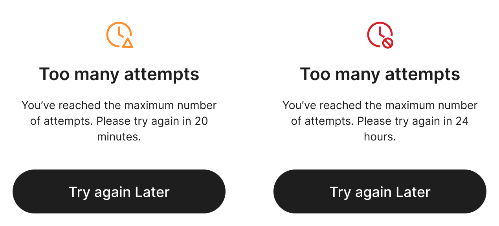
</td>
<td rowspan="4" style="text-align: left;">
1. <strong>页面规则</strong>

在业务流程发起身份认证，对应挑战若被锁，后端识别出则弹窗提示被锁；

2. <strong>按钮</strong>

Title：Too Many Attempts

Content：You’ve reached the maximum number of attempts. Please try again in {time} minutes.

<table style="width:55%;">
<colgroup>
<col style="width: 55%" />
</colgroup>
<tbody>
<tr>
<td style="text-align: left;">{time}：显示剩余时间；若大于1小时，则以小时为单位，若小于1小时，则以分钟为单位；</td>
</tr>
</tbody>
</table>

“Try again later”按钮，点击后退出登录并返回到业务流程发起页。
</td>
</tr>
<tr>
</tr>
<tr>
</tr>
<tr>
</tr>
<tr>
<td style="text-align: left;">
纯前端锁定：

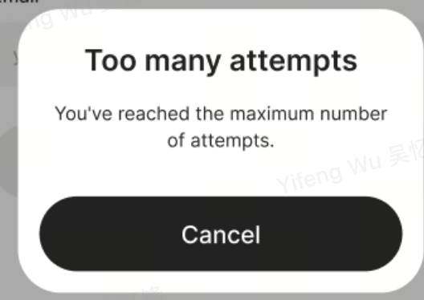
</td>
<td style="text-align: left;">
1. <strong>页面规则</strong>

在业务流程发起身份认证，对应挑战若被锁，前端识别出则弹窗提示被锁；

2. <strong>按钮</strong>

Title：Too Many Attempts

Content：Biometric authentication has been temporarily disabled by your device.Please unlock your device using your passcode and try again.

“Try again later”按钮，点击后退出登录并返回到业务流程发起页。
</td>
</tr>
</tbody>
</table>

7.6.3 **Account interception popup**

<table style="width:89%;">
<colgroup>
<col style="width: 30%" />
<col style="width: 58%" />
</colgroup>
<tbody>
<tr>
<td style="text-align: left;">UX</td>
<td style="text-align: left;">Description</td>
</tr>
<tr>
<td rowspan="4" style="text-align: center;"></td>
<td rowspan="4" style="text-align: left;">
1. <strong>页面规则</strong>

账户被banned，无法发起身份认证流程

2. <strong>按钮</strong>

点击按钮关闭弹窗，留在当前页
</td>
</tr>
<tr>
</tr>
<tr>
</tr>
<tr>
</tr>
</tbody>
</table>

# 8. 需求描述

8.1 **身份认证功能**

8.1.1 **流程说明**

8.2 **OTP认证**

8.2.1 **OTP Verify Page**

<table style="width:89%;">
<colgroup>
<col style="width: 30%" />
<col style="width: 58%" />
</colgroup>
<tbody>
<tr>
<td style="text-align: left;">UX</td>
<td style="text-align: left;">Description</td>
</tr>
<tr>
<td rowspan="4" style="text-align: center;">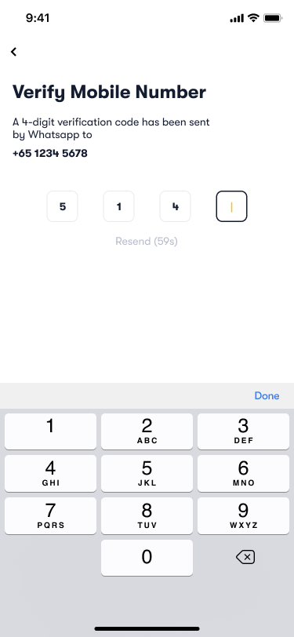</td>
<td rowspan="4" style="text-align: left;">
1. <strong>页面规则</strong>

进入页面后，自动触达发送otp的请求。

2. <strong>返回按钮</strong>

点击弹出挽留弹窗

Title：Confirm Exit?

Content: Are you sure you want to leave before verification is complete?

Button:

Stay and continue: 点击后关闭弹窗，停留在当前页；

Leave: 点击后关闭弹窗，返回到业务流程发起页；

3. <strong>标题 (Title)：</strong>

Verify Mobile Number

4. <strong>副标题 (Subtitle)：</strong>

We will send a 4-digit verification to you on {mobile number}

5. <strong>手机号码显示：</strong>

登录注册场景：明文展示用户填写的手机号码。以PH为例，前端展示为： +638048322412；

非登录场景：进行掩码处理。

格式：+国际手机区号&amp;手机号前N位掩码&amp;最后三位明文

示例（PH）：+63******412

6. <strong>密码输入框</strong>

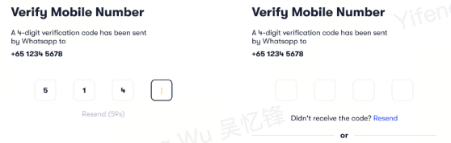

6.1 <strong>验证码发送与接收</strong>

系统需向用户手机号发送一封包含 4位数字验证码（OTP）​ 。

用户需在验证页面输入收到的完整4位验证码。

<strong>验证码5分钟有效期</strong>

6.2 <strong>验证码输入规则</strong>

输入框仅接受4位数字输入，非数字字符无效。

用户必须按顺序依次输入每一位数字。

删除操作仅支持从最后一位开始逐位向前删除。

6.3 <strong>自动提交验证</strong>

当系统检测到用户已输入完4位验证码时，应自动触发提交验证请求，无需用户手动点击确认按钮。

6.4 <strong>验证处理规则</strong>

<strong>验证成功​，进入下一流程。</strong>

<strong>验证失败（连续失败次数（0，5） 但剩余可尝试次数 大于2次），不触发锁定：</strong>

红字错误hint提示：“Invalid OTP”。

<strong>验证失败（连续失败次数（0，5） 且剩余可尝试次数 等于或小于2次），不触发锁定，弹窗提示：</strong>

Title：Invalid OTP

Content：You have {times} attempts left before being locked out for 20 minutes.

<table style="width:51%;">
<colgroup>
<col style="width: 50%" />
</colgroup>
<tbody>
<tr>
<td style="text-align: left;">{times}：剩余次数；</td>
</tr>
</tbody>
</table>

Button: Stay and continue：关闭弹窗，允许继续尝试。

Button: Leave：退出登录，返回业务流程发起页。

<strong>验证失败（用户在24小时内连续失败等于 5次），触发锁定20分钟，弹窗提示：</strong>

Title：Too Many Attempts

Content：You’ve reached the maximum number of attempts. Please try again in {time}.

<table style="width:51%;">
<colgroup>
<col style="width: 50%" />
</colgroup>
<tbody>
<tr>
<td style="text-align: left;">{time}：显示剩余时间；若大于1小时，则以小时为单位，若小于1小时，则以分钟为单位；</td>
</tr>
</tbody>
</table>

“Try again later”按钮，点击后退出登录并返回到业务流程发起页。

此弹窗复用【<a href="https://advancegroup.sg.larksuite.com/wiki/HdI2wMXXviIOOwkVJNjlWY35gSh#share-BELGd7dqhotYQbxEz0blkapJgoe">7.6.2 Too many failed popup</a>】

<strong>验证失败（连续失败次数（5，10）， 但剩余可尝试次数 大于2次），不触发锁定：</strong>

红字错误hint提示：“Invalid OTP”。

<strong>验证失败（连续失败次数（5，10） 且剩余可尝试次数 等于或小于2次），不触发锁定，弹窗提示：</strong>

Title：Invalid OTP

Content：You have {times} attempts left before being locked out for 24 hours.

<table style="width:51%;">
<colgroup>
<col style="width: 50%" />
</colgroup>
<tbody>
<tr>
<td style="text-align: left;">{times}：剩余次数；</td>
</tr>
</tbody>
</table>

Button: Stay and continue：关闭弹窗，允许继续尝试。

Button: Leave：退出登录，返回业务流程发起页。

<strong>验证失败（用户在24小时连续失败达到 10次），触发锁定24小时，弹窗提示：</strong>

Title：Too Many requests

Content：You've requested new codes too frequently. Please try again in {time}.

<table style="width:51%;">
<colgroup>
<col style="width: 50%" />
</colgroup>
<tbody>
<tr>
<td style="text-align: left;">{time}：显示剩余时间；若大于1小时，则以小时为单位，若小于1小时，则以分钟为单位；</td>
</tr>
</tbody>
</table>

“Try again later”按钮，点击后退出登录并返回业务流程发起页。

此弹窗复用【<a href="https://advancegroup.sg.larksuite.com/wiki/HdI2wMXXviIOOwkVJNjlWY35gSh#share-BELGd7dqhotYQbxEz0blkapJgoe">7.6.2 Too many failed popup</a>】

6.5 <strong>重新发送规则</strong>

60s倒数结束，用户可请求重新发送验证码。

冷却限制​：用户在 24 小时内最多可执行 3 次验证码<strong>“重新发送”操作</strong>。达到上限后，系统将触发20分钟的冷却期<strong>，弹窗提示：</strong>

Title：Resend Limit Reached

Content：You've reached the resend limit. Please try again in {time}.

<table style="width:51%;">
<colgroup>
<col style="width: 50%" />
</colgroup>
<tbody>
<tr>
<td style="text-align: left;">{time}：显示剩余时间；若大于1小时，则以小时为单位，若小于1小时，则以分钟为单位；</td>
</tr>
</tbody>
</table>

“Try again later”按钮，点击后退出登录并返回业务流程发起页。

验证码安全规则：

每次重新发送验证码后，之前的旧验证码立即失效，仅以最新发送的验证码为准。

该验证码仅限发起请求的设备使用，更换设备无效。

7. <strong>其他规则：</strong>

每次发送otp都是新的随机生成的，验证的时候以最后一次发送的有效
</td>
</tr>
<tr>
</tr>
<tr>
</tr>
<tr>
</tr>
</tbody>
</table>

8.3 **Email OTP认证**

8.3.1 **Email OTP Verify Page**

<table style="width:89%;">
<colgroup>
<col style="width: 30%" />
<col style="width: 58%" />
</colgroup>
<tbody>
<tr>
<td style="text-align: left;">UX</td>
<td style="text-align: left;">Description</td>
</tr>
<tr>
<td rowspan="4" style="text-align: center;">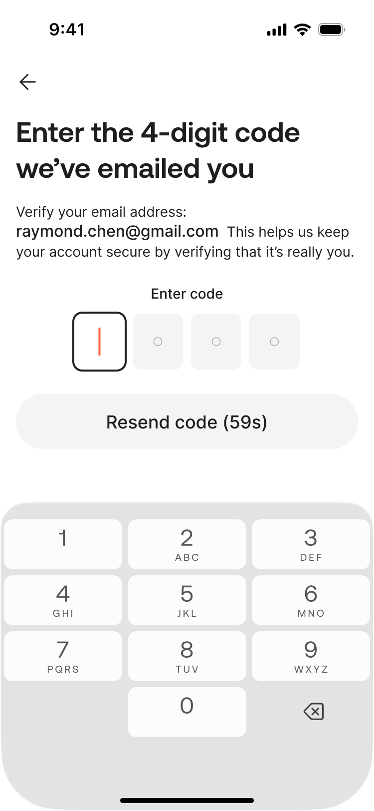</td>
<td rowspan="4" style="text-align: left;">
1. <strong>页面规则</strong>

进入页面后，自动触达发送otp的请求。

2. <strong>返回按钮</strong>

点击弹出挽留弹窗

Title：Confirm Exit?

Content: Are you sure you want to leave before verification is complete?

Button:

Stay and continue: 点击后关闭弹窗，停留在当前页；

Leave: 点击后关闭弹窗，返回到业务流程发起页；

3. <strong>标题/副标题</strong>

固定文案

邮箱地址：取user_info中的email 地址，掩码展示，邮箱@之前的首位和末位以及邮箱后缀明文展示，中间位数用掩码*展示，*的展示个数与位数相同；举例，用户email地址为：test43500@gmail.com，前端展示为：t*******0@gmail.com；

<table style="width:55%;">
<colgroup>
<col style="width: 55%" />
</colgroup>
<tbody>
<tr>
<td style="text-align: left;">注：注册场景邮箱可见不掩码处理</td>
</tr>
</tbody>
</table>

4. <strong>密码输入框</strong>

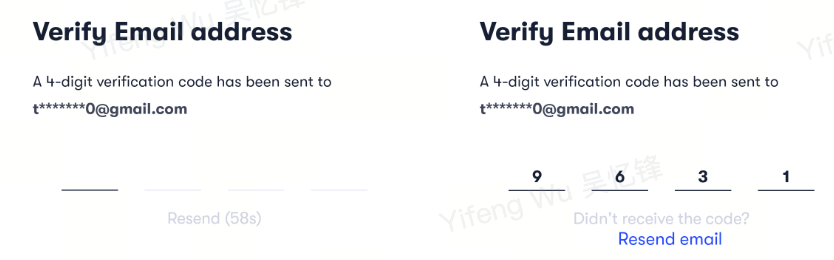

4.1 <strong>验证码发送与接收</strong>

系统需向用户指定的邮箱发送一封包含 4位数字验证码（OTP）​ 的邮件。

用户需在验证页面输入收到的完整4位验证码。

验证码5分钟有效期

4.2 <strong>验证码输入规则</strong>

输入框仅接受4位数字输入，非数字字符无效。

用户必须按顺序依次输入每一位数字。

删除操作仅支持从最后一位开始逐位向前删除。

4.3 <strong>自动提交验证</strong>

当系统检测到用户已输入完4位验证码时，应自动触发提交验证请求，无需用户手动点击确认按钮。

4.4 <strong>验证处理规则</strong>

<strong>验证成功​，进入下一流程。</strong>

<strong>验证失败（连续失败次数（0，5） 但剩余可尝试次数 大于2次），不触发锁定：</strong>

红字错误hint提示：“Invalid OTP”。

<strong>验证失败（连续失败次数（0，5） 且剩余可尝试次数 等于或小于2次），不触发锁定，弹窗提示：</strong>

Title：Invalid OTP

Content：You have {times} attempts left before being locked out for 20 minutes.

<table style="width:51%;">
<colgroup>
<col style="width: 50%" />
</colgroup>
<tbody>
<tr>
<td style="text-align: left;">{times}：剩余次数；</td>
</tr>
</tbody>
</table>

Button: Stay and continue：关闭弹窗，允许继续尝试。

Button: Leave：退出登录，返回业务流程发起页。

<strong>验证失败（用户在24小时内连续失败等于 5次），触发锁定20分钟，弹窗提示：</strong>

Title：Too Many Attempts

Content：You’ve reached the maximum number of attempts. Please try again in {time}.

<table style="width:51%;">
<colgroup>
<col style="width: 50%" />
</colgroup>
<tbody>
<tr>
<td style="text-align: left;">{time}：显示剩余时间；若大于1小时，则以小时为单位，若小于1小时，则以分钟为单位；</td>
</tr>
</tbody>
</table>

“Try again later”按钮，点击后退出登录并返回上一级页面。

此弹窗复用【<a href="https://advancegroup.sg.larksuite.com/wiki/HdI2wMXXviIOOwkVJNjlWY35gSh#share-BELGd7dqhotYQbxEz0blkapJgoe">7.6.2 Too many failed popup</a>】

<strong>验证失败（连续失败次数（5，10）， 但剩余可尝试次数 大于2次），不触发锁定：</strong>

红字错误hint提示：“Invalid OTP”。

<strong>验证失败（连续失败次数（5，10） 且剩余可尝试次数 等于或小于2次），不触发锁定，弹窗提示：</strong>

Title：Invalid OTP

Content：You have {times} attempts left before being locked out for 24 hours.

<table style="width:51%;">
<colgroup>
<col style="width: 50%" />
</colgroup>
<tbody>
<tr>
<td style="text-align: left;">{times}：剩余次数；</td>
</tr>
</tbody>
</table>

Button: Stay and continue：关闭弹窗，允许继续尝试。

Button: Leave：退出登录，返回业务流程发起页。

<strong>验证失败（用户在24小时连续失败达到 10次），触发锁定24小时，弹窗提示：</strong>

Title：Too Many requests

Content：You've requested new codes too frequently. Please try again in {time}.

<table style="width:51%;">
<colgroup>
<col style="width: 50%" />
</colgroup>
<tbody>
<tr>
<td style="text-align: left;">{time}：显示剩余时间；若大于1小时，则以小时为单位，若小于1小时，则以分钟为单位；</td>
</tr>
</tbody>
</table>

“Try again later”按钮，点击后退出登录并返回业务流程发起页。

4.5 <strong>重新发送规则</strong>

60s倒数结束，用户可请求重新发送验证码。

冷却限制​：用户在 24 小时内最多可执行 3 次验证码<strong>“重新发送”操作</strong>。达到上限后，系统将触发20分钟的冷却期<strong>，弹窗提示：</strong>

Title：Too Many requests

Content：You've requested new codes too frequently. Please try again in {time}.

<table style="width:51%;">
<colgroup>
<col style="width: 50%" />
</colgroup>
<tbody>
<tr>
<td style="text-align: left;">{time}：显示剩余时间；若大于1小时，则以小时为单位，若小于1小时，则以分钟为单位；</td>
</tr>
</tbody>
</table>

“Try again later”按钮，点击后退出登录并返回业务流程发起页。

验证码安全规则：

每次重新发送验证码后，之前的旧验证码立即失效，仅以最新发送的验证码为准。

该验证码仅限发起请求的设备使用，更换设备无效。

5. <strong>其他规则：</strong>

每次发送otp都是新的随机生成的，验证的时候以最后一次发送的有效
</td>
</tr>
<tr>
</tr>
<tr>
</tr>
<tr>
</tr>
</tbody>
</table>

8.4 **Login Passcode认证**

8.4.1 **页面概览**

8.4.2 **Login Passcode Verify Page**

<table style="width:89%;">
<colgroup>
<col style="width: 30%" />
<col style="width: 58%" />
</colgroup>
<tbody>
<tr>
<td style="text-align: left;">UX</td>
<td style="text-align: left;">Description</td>
</tr>
<tr>
<td rowspan="4" style="text-align: center;">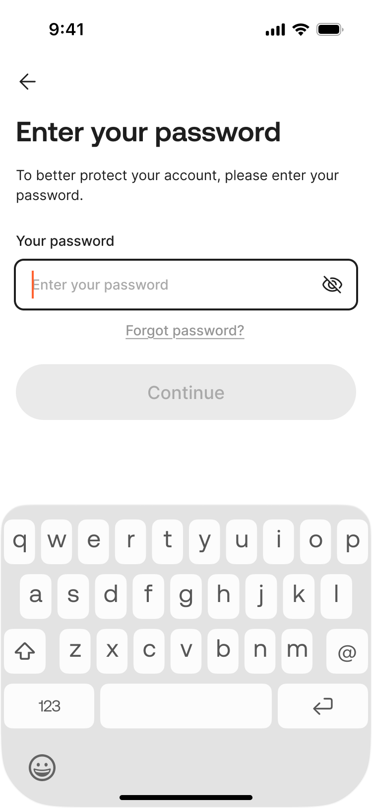</td>
<td rowspan="4" style="text-align: left;">
1. <strong>返回按钮</strong>

点击弹出挽留弹窗

Title：Confirm Exit?

Content: Are you sure you want to leave before verification is complete?

Button:

Stay and continue: 点击后关闭弹窗，停留在当前页；

Leave: 点击后关闭弹窗，返回到业务流程发起页；

2. <strong>密码输入框</strong>

2.1 <strong>输入规则</strong>

长度限制​：最长输入32个字符。当用户输入超过32个字符时，前端应禁止其继续输入

支持的字符类型​：

小写字母​：a - z

大写字母​：A - Z

数字​：0 - 9

符号/特殊字符​：常见的标点符号和特殊字符，例如：! @ # $ % ^ &amp; * ( ) _ + - = { } [ ] | \ : " ; ' &lt; &gt; ? , . /等。

显示控制：

默认状态​：输入框内所有字符以密文形式显示。

显示/隐藏切换​：输入框右侧必须提供“眼睛”图标。

图标为“闭眼”状态时，显示密文。

用户点击后，密码以明文显示。

3. <strong>Next按钮</strong>

前端校验规则：仅当密码输入框非空且字符数不少于8位时，“下一步”按钮才变为可点击。

点击按钮：

<strong>验证成功​，进入下一流程。</strong>

<strong>验证失败（连续失败次数（0，5） 但剩余可尝试次数 大于2次），不触发锁定：</strong>

红字错误hint提示：“Incorrect account or password”。

<strong>验证失败（连续失败次数（0，5） 且剩余可尝试次数 等于或小于2次），不触发锁定，弹窗提示：</strong>

Title：Incorrect account or password

Content：You have {times} attempts left before a {time} lock.

<table style="width:51%;">
<colgroup>
<col style="width: 50%" />
</colgroup>
<tbody>
<tr>
<td style="text-align: left;">{times}：剩余次数；</td>
</tr>
</tbody>
</table>

Button: Stay and continue：关闭弹窗，允许继续尝试。

Button: Leave：退出登录，返回业务流程发起页。

<strong>验证失败（用户在24小时内连续失败达到 5次），触发锁定20分钟，弹窗提示：</strong>

Title：Too Many Attempts

Content：You’ve reached the maximum number of attempts. Please try again in {time}.

<table style="width:51%;">
<colgroup>
<col style="width: 50%" />
</colgroup>
<tbody>
<tr>
<td style="text-align: left;">{time}：显示剩余时间；若大于1小时，则以小时为单位，若小于1小时，则以分钟为单位；</td>
</tr>
</tbody>
</table>

“Try again later”按钮，点击后退出登录并返回业务流程发起页。

此弹窗复用【<a href="https://advancegroup.sg.larksuite.com/wiki/HdI2wMXXviIOOwkVJNjlWY35gSh#share-BELGd7dqhotYQbxEz0blkapJgoe">7.6.2 Too many failed popup</a>】

<strong>验证失败（连续失败次数（5，10）， 但剩余可尝试次数 大于2次），不触发锁定：</strong>

红字错误hint提示：“Incorrect account or password”。

<strong>验证失败（连续失败次数（5，10） 且剩余可尝试次数 等于或小于2次），不触发锁定，弹窗提示：</strong>

Title：Incorrect account or password

Content：You have {times} attempts left before being locked out for 24 hours.

<table style="width:51%;">
<colgroup>
<col style="width: 50%" />
</colgroup>
<tbody>
<tr>
<td style="text-align: left;">{times}：剩余次数；</td>
</tr>
</tbody>
</table>

Button: Stay and continue：关闭弹窗，允许继续尝试。

Button: Leave：退出登录，返回业务流程发起页。

<strong>验证失败（用户在24小时连续失败达到 10次），触发锁定24小时，弹窗提示：</strong>

Title：Too Many Attempts

Content：You’ve reached the maximum number of attempts. Please try again in {time}.

<table style="width:51%;">
<colgroup>
<col style="width: 50%" />
</colgroup>
<tbody>
<tr>
<td style="text-align: left;">{time}：显示剩余时间；若大于1小时，则以小时为单位，若小于1小时，则以分钟为单位；</td>
</tr>
</tbody>
</table>

“Try again later”按钮，点击后退出登录并返回业务流程发起页。
</td>
</tr>
<tr>
</tr>
<tr>
</tr>
<tr>
</tr>
</tbody>
</table>

8.5 **Biometric认证**

<table style="width:88%;">
<colgroup>
<col style="width: 88%" />
</colgroup>
<tbody>
<tr>
<td style="text-align: left;">
iOS可以控制校验次数；

安卓可尝试次数则依据系统；
</td>
</tr>
</tbody>
</table>

<table style="width:89%;">
<colgroup>
<col style="width: 21%" />
<col style="width: 66%" />
</colgroup>
<tbody>
<tr>
<td style="text-align: left;"><strong>UXUI</strong></td>
<td style="text-align: left;"><strong>需求说明</strong></td>
</tr>
<tr>
<td style="text-align: left;"></td>
<td style="text-align: left;">
发起Biometric，拉起设备人脸验证

判断是否验证通过：

设备端验证通过，则进行后端验证

后端验证成功，进入下一步流程；

后端验证失败，则系统弹窗提示verify failed，点击user other methods按钮，返回身份认证发起页；

IOS设备端验证失败，则弹窗提示

未超过次数限制：

用户点击Try again后可再次验证；

点击「Cancel」，关闭弹窗；

超过设备验证次数限制：

点击「Cancel」，关闭弹窗；

点击「Use another method」，返回身份认证发起页；

安卓设备端验证失败，则弹窗提示

安卓失败弹窗为系统弹窗，以各机型实际展示为准；

不限制失败次数，以各机型实际限制为准；
</td>
</tr>
</tbody>
</table>

8.6 **活体识别认证**

|                                            |
|:-------------------------------------------|
| liveness采集失败不会计费，采集成功才会计费 |

8.6.1 **流程说明**

8.6.2 **页面概览**

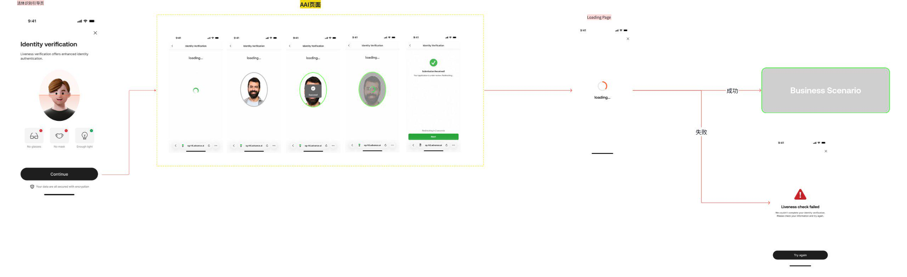

8.6.3 **Face Auth Guide Page**

<table style="width:89%;">
<colgroup>
<col style="width: 30%" />
<col style="width: 58%" />
</colgroup>
<tbody>
<tr>
<td style="text-align: left;">UX</td>
<td style="text-align: left;">Description</td>
</tr>
<tr>
<td rowspan="4" style="text-align: center;"></td>
<td rowspan="4" style="text-align: left;">
1. <strong>页面说明</strong>

本页面为活体识别流程的入口引导页，用于向用户展示识别前的注意事项。

2. <strong>返回按钮</strong>

点击后返回至上一级页面，中断当前识别流程。

3. <strong>“Start” 按钮</strong>

未锁定状态：用户点击后，系统调用AAI的H5页开始做活体采集；

锁定状态：用户失败次数过多，后端返回被锁定，

点击按钮弹窗拦截：

Title：Facial Verification Locked

Content：You've reached the maximum attempts for facial verification. Please try again after [MM-DD hh:mm].

MM-DD hh:mm为解锁时间

OK按钮：点击按钮，返回流程入口页

4. <strong>安全限制规则</strong>

系统需基于用户账户维度，需执行以下限制：

规则一：24小时内累计失败 5次，该面部验证功能将被系统锁定 20分钟。

规则二：24小时内累计失败 10次，该面部验证功能将被系统锁定 24小时。

规则三：24小时内，接口层面连续发起20次则锁20min，验证成功后清零重新计算。

计数与清零：

规则一和规则二的累计失败判断：DTC返回face result=fail才算失败，其他结果不算失败（其他结果不计费）

清零规则：人脸验证通过后则清零。
</td>
</tr>
<tr>
</tr>
<tr>
</tr>
<tr>
</tr>
</tbody>
</table>

8.6.4 **Liveness Scan Page（AAI页面）**

<table style="width:89%;">
<colgroup>
<col style="width: 30%" />
<col style="width: 58%" />
</colgroup>
<tbody>
<tr>
<td style="text-align: left;">UX</td>
<td style="text-align: left;">Description</td>
</tr>
<tr>
<td rowspan="4" style="text-align: center;"></td>
<td rowspan="4" style="text-align: left;">
当用户进入submission received页面时，AAI已经有了face 比对结果

点击按钮，跳转到Face Auth Loading Page
</td>
</tr>
<tr>
</tr>
<tr>
</tr>
<tr>
</tr>
</tbody>
</table>

8.6.5 **Face Auth Loading Page**

<table style="width:89%;">
<colgroup>
<col style="width: 30%" />
<col style="width: 58%" />
</colgroup>
<tbody>
<tr>
<td style="text-align: left;">UX</td>
<td style="text-align: left;">Description</td>
</tr>
<tr>
<td rowspan="4" style="text-align: center;"></td>
<td rowspan="4" style="text-align: left;">
1. <strong>返回按钮</strong>

点击弹出挽留弹窗

Title：Confirm Exit?

Content: Are you sure you want to leave before verification is complete?

Button:

Stay and continue: 点击后关闭弹窗，停留在当前页；

Leave: 点击后关闭弹窗，返回到业务流程入口页；

2. <strong>页面说明</strong>

当 AAI 返回活体识别成功时，跳转至本页面。

页面加载后，以固定时间间隔向后台接口发送请求，查询认证结果状态；

成功：当后端返回成功状态时，页面自动跳转至业务流程的下一页面；

后端查询DTC，DTC返回FAIL / EXPIRED / incomplete / 空值，那么判断为失败： 自动跳转至 Face Auth Failed Page。

若网络异常，那么进入<a href="https://advancegroup.sg.larksuite.com/wiki/Uwyfwkc2jixSBukf2YJllpjsgRd#share-BTWAdOz3MosdsnxkZkElb5Sogig">Network Error Page</a>

若系统异常，那么进入<a href="https://advancegroup.sg.larksuite.com/wiki/Uwyfwkc2jixSBukf2YJllpjsgRd#share-Tqwmdp5pdoc6M8xDFs3lVRkWgQd">Server Error Page</a>

若等待超过30秒仍未收到结果，进入<a href="https://advancegroup.sg.larksuite.com/wiki/ISjLwCKi5itjNXkpCLllQD5Qgle#share-IU9ed4cUmoIlmzxHjr6l9sK8gdg">Loading Failed Page</a>
</td>
</tr>
<tr>
</tr>
<tr>
</tr>
<tr>
</tr>
</tbody>
</table>

8.6.6 **Face Auth Failed Page**

<table style="width:89%;">
<colgroup>
<col style="width: 30%" />
<col style="width: 58%" />
</colgroup>
<tbody>
<tr>
<td style="text-align: left;">UX</td>
<td style="text-align: left;">Description</td>
</tr>
<tr>
<td rowspan="4" style="text-align: center;"></td>
<td rowspan="4" style="text-align: left;">
1. <strong>页面说明</strong>

当 AAI 返回活体识别失败结果时，跳转至本页面。用户可选择重新尝试或退出流程。

2. <strong>返回按钮</strong>

点击按钮，返回业务流程入口页

3. <strong>页面文案</strong>

固定主文案： 固定显示 “Verification failed.”。

后端返回face result为空值，那么展示文案：Liveness check failed. Please try again.

后端返回face result为FAIL / EXPIRED / incomplete，那么展示<a href="https://advancegroup.sg.larksuite.com/wiki/ISjLwCKi5itjNXkpCLllQD5Qgle#share-P57KdHhAaoIkqqxiTr6lHCFhgPh">Face Comparison API错误码</a>映射中的映射前端提示文案

4. <strong>Try again按钮</strong>

正常状态：点击该按钮将返回身份认证入口页

<del>锁定状态：当账户触发安全锁时，点击按钮弹窗提示：</del>

<del>文案：For your account security, facial verification is temporarily unavailable. Please try again after [解锁时间]。</del>

<del>确认按钮：点击直接返回至流程入口页。</del>
</td>
</tr>
<tr>
</tr>
<tr>
</tr>
<tr>
</tr>
</tbody>
</table>

# 9. 外部接口依赖

9.1 **外部接口清单**

9.1.1 **生成url**

**请求路径**

\[POST\] /openapi/v1/ekyc/get-verification-url

**请求参数**

|                          |        |      |                          |
|:------------------------:|:------:|:----:|:------------------------:|
|           字段           |  类型  | 必填 |           说明           |
| query.successRedirectUrl | string |  是  | 验证成功后跳转的回调 URL |
| query.failureRedirectUrl | string |  是  | 验证失败后跳转的回调 URL |
|      tokenAuthType       | string |  是  |                          |

**响应**

|                |        |      |                  |
|:--------------:|:------:|:----:|:----------------:|
|      字段      |  类型  | 必填 |       说明       |
| urlExpiredTime | string |  是  |   url 过期时间   |
|   requestId    | string |  是  | 用来获取验证结果 |

9.1.2 **查询验证结果**

**请求路径**

\[GET\] /openapi/v1/ekyc/get-auth-result/{requestId}

**请求参数**

|           |        |      |      |
|:---------:|:------:|:----:|:----:|
|   字段    |  类型  | 必填 | 说明 |
| requestId | string |  是  |      |

**响应**

|  |  |  |
|:--:|:--:|:--:|
| 字段 | 类型 | 说明 |
| token | string | 验证成功时才会返回 |
| tokenExpiredTime | string | token过期时间 |
| status | string | 状态 INCOMPLETE（包含未验证和验证中），PASS 成功，FAIL 失败(需要重新生成url)，EXPIRED 已过期（需要重新生成url) |

9.2 **外部接口地址**

[Master sub account 设计方案](https://dtcpayoa.sg.larksuite.com/docx/TIp8dkHUgoIeQ3xRSMcl1aIQgce?from=from_copylink)

# 10. 接口错误码映射

10.1 **passport error code**

|  |  |  |
|:---|:---|:---|
| API 错误码 (code) | 解释 | AIX映射前端提示文案 |
| LIVENESS_ATTACK | 检测到活体攻击风险/疑似非真人操作 | Liveness verification failed. Please try again in a well-lit environment. |
| SIMILARITY_FAILED | 人脸比对失败/与证件照不一致 | Face verification failed. Please make sure your face matches your ID document and try again. |
| UNABLE_GET_IMAGE | 未获取到有效人脸图片 | Unable to capture a clear face image. Please try again. |
| PARAMETER_ERROR | 请求参数异常 | Face verification could not be completed at this time. Please try again later. |
| USER_TIMEOUT | 用户超时 | Face verification timed out. Please try again. |
| RETRY_COUNT_REACH_MAX | 重试次数已达上限 | You have reached the maximum number of attempts. Please try again later. |
| FACE_QUALITY_TOO_POOR | 人脸图片质量过低 | Face image quality is too poor. Please try again in better lighting and keep your face clearly visible. |
| ERROR | 通用错误 | Face verification could not be completed at this time. Please try again later. |
| DEFAULT | 兜底文案 | The identity document could not be verified. Please ensure it is clear and valid, then try again. |

# 11. 待定事项

~~验证处理规则：需要列出来10次，以及验证错误4，5次的提示语优化~~
