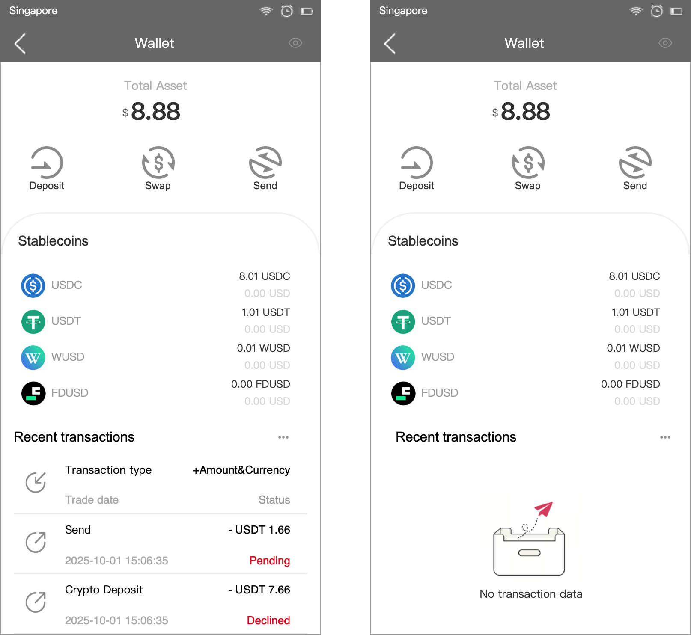
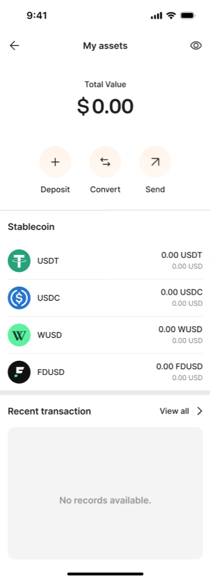
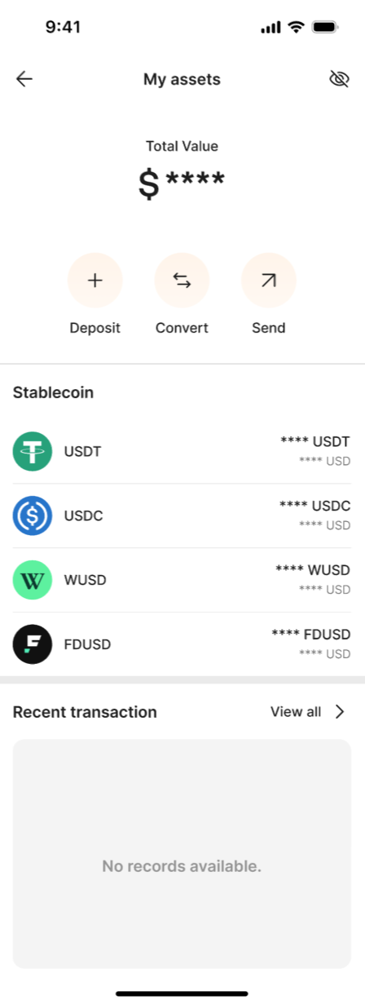
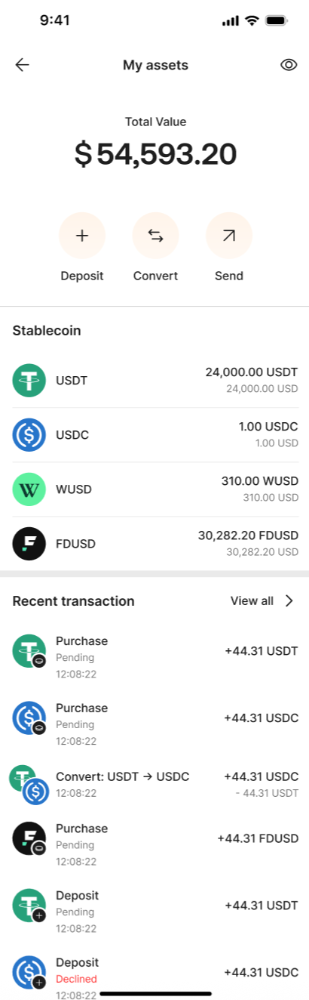
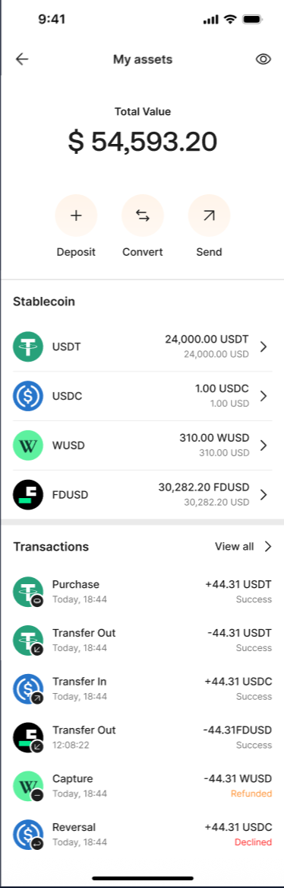

# AIX Wallet V1.0【Asset】

# 1. 引言

1.1 **需求索引**

**\[同步块-无权限下载此内容\]**

1.2 **修订记录**

|        |      |                               |                    |
|:-------|:-----|:------------------------------|:-------------------|
| 日期   | 版本 | 说明                          | 作者               |
| Jan 27 | V1.1 | MVP不做单币种首页，后续再迭代 | @Xuemin Zhu 朱学敏 |

# 2. 全局说明

2.1 **交易说明**

<table style="width:88%;">
<colgroup>
<col style="width: 88%" />
</colgroup>
<tbody>
<tr>
<td>
当前钱包仅做稳定币业务：FDUSD,USDC,USDT,WUSD；

开通钱包的用户，可以查看钱包资产、单币种余额及交易明细；
</td>
</tr>
</tbody>
</table>

2.2 **接口范围**

|  |  |  |  |
|:---|:---|:---|:---|
| **接口** | 接口名称 | **接口地址** | **接口说明** |
| **查看全量币种余额** | Get Wallet Account Balance | \[GET\] /openapi/v1/wallet/balances |  |
| **查询单币种余额** | Get Balance | \[GET\] /openapi/v1/wallet/balance/{currency} |  |

# 3. 数据字典

# 4. AIX前端功能需求

4.1 **钱包首页 My Assets**

4.1.1 **需求背景**

|  |
|:---|
| 对于已经开通AIX钱包的用户，可以查看总资产、交易记录，并支持用户进行充值、转账、兑换等操作 |

4.1.2 **业务流程**

4.1.3 **页面交互**

4.1.4 **功能需求**

<table style="width:89%;">
<colgroup>
<col style="width: 8%" />
<col style="width: 19%" />
<col style="width: 44%" />
<col style="width: 15%" />
</colgroup>
<tbody>
<tr>
<td style="text-align: center;"><strong>需求</strong></td>
<td style="text-align: center;"><strong>UI或UE</strong></td>
<td style="text-align: center;"><strong>页面说明</strong></td>
<td style="text-align: left;"><strong>备注</strong></td>
</tr>
<tr>
<td style="text-align: left;">钱包首页</td>
<td style="text-align: center;">

</td>
<td style="text-align: center;">
<strong>顶部导航栏：</strong>

标题：“MY Assets”

返回：点击 “←”可回到上一级页面；

眼睛：点击“眼睛”后可以全局显示或隐藏总资产和稳定币余额；

<strong>全局刷新：</strong>

用户进入该页面时，静默刷新获取最新的钱包资产、稳定币余额和最近交易记录；

<strong>资产区：</strong>

Total Asset：总资产：

Currency：默认显示括号内的USD（$）;

根据默认法币USD试算对应的金额，保留2位小数：如，8.88 USD

<strong>Total Asset（当前法币预估资产）=USDT余额*Rate1 + USDC余额*Rate2 + WUSD余额*Rate3+ FDUSD余额*Rate4，</strong>试算结果按各个稳定币四舍五入处理并保留2位小数再相加；

根据用户持有的USDT、USDC、WUSD、FDUSD及当前默认法币USD，分别调用汇率接口【 /openapi/v1/otc/get-otc-rate】获得Rate1、Rate2、Rate3、Rate4

如果任一汇率获取异常，直接提示“Network abnormality. Please try again later.”

用户访问该页面时，要获取一次最新汇率（DTC汇率24h有效）；

<strong>快捷功能入口：</strong>

Deposit：加密币充值，点击“Deposit”进入充值页面Deposit；

Swap：兑换加密币，点击“Swap”进入兑换页面Swap

Send：P2P转账，点击“Send”进入转账页面Send；

<strong>稳定币列表：</strong>

用户进入钱包首页时，后端调用接口【 [GET] /openapi/v1/wallet/balances】获取全量币种最新钱包账户余额，并筛选稳定币【USDC、USDT、WUSD、FDUSD】的余额并展示给用户；

Title：“Stablecoin”

Currency：币种及图标：可配置

USDC

USDT

WUSD

FDUSD

按照USDC、USDT、WUSD、FDUSD固定排序（暂不按余额做降序），后端可配置要展示的币种可配置

点击“&gt;”跳转到当前币种首页；

Crypto Balance：当前币种的加密币余额，金额隐藏时显示“****”；

Fiat Balance：当前币种的法币余额：

Currency：默认显示USD

根据用户持有的USDT、USDC、WUSD、FDUSD及当前默认的法币USD，分别调用汇率接口【 /openapi/v1/otc/get-otc-rate】获得Rate；

Fiat Balance = Crypto Balance * Rate，试算结果按四舍五入处理并保留2位小数；

金额隐藏时显示“****”；

<strong>最近交易展示：</strong>

钱包资产页的最近钱包交易记录是聚合（<strong>加密币交易、兑换交易</strong>），后端调用加密币交易接口【/openapi/v1/crypto-txn/search】、OTC兑换记录接口【/openapi/v1/otc/search】查询交易记录，并按交易类型进行数据过滤后展示给用户：

① 加密币交易仅展示原始交易类型为【DEPOSIT】【TRANSFER_IN】【TRANSFER_OUT】【CARD_FEE_DEBIT】【CARD_FEE_REFUND】的记录给用户；

② 加密币兑换的展示全部记录给用户；

展示当前用户近<strong>近1年</strong>钱包交易（加密币交易、兑换交易）的最近6条记录给用户：

如果条数X为0就占位符显示“No transaction data”

如果条数1≤X＜6，就显示对应条数，页面自适应长度；

按照交易时间降序排列展示；

用户进入钱包首页时，静默拉取最新的交易记录；

Title：Recent transaction

点击“View all”跳转到全量交易记录页面Transactions；

Type：交易类型及对应图标可配置

Crypto Deposit加密币充值

Receive转入

Send转出

Swap兑换

Card Application 申卡扣费

Card Cancel申卡退费

Status：加密币交易状态可配置

Pending

Success

Refunded

Declined

Under Review

Cancelled

<strong>单笔加密币交易记录展示逻辑：</strong>

Type：交易类型及对应图标（对客显示为交易名称）

Crypto Deposit

Receive

Send

Card Application

Card Cancel

Indicator：交易方向：入金+、出金-：

Crypto Deposit加密币充值【+】

Receive转入【+】

Send转出【-】

Card Application 【-】

Card Cancel【+】

Amount&amp;Currency：交易金额及币种

Transaction time：交易时间

格式：年-月-日 时:分:秒

Status：加密币交易状态

Pending

Success

Refunded

Declined

Under Review

Cancelled

<strong>单笔兑换交易记录展示逻辑：（不展示交易状态）</strong>

Type：交易类型及对应图标（对客显示为交易名称）

Swap兑换

Indicator：交易方向：入金+、出金-：

Buy currency兑换买入【+】

Sell currency兑换卖出【-】

Buy amount&amp;currency：买入金额及币种

Sell amount&amp;currency：卖出金额及币种

Transaction time：交易时间
</td>
<td style="text-align: left;">注：因合规问题充值用户无法正常操作Withdraw，只能按退款走人工处理，故先隐藏Withdraw入口，</td>
</tr>
</tbody>
</table>

# 5. DTC渠道接口需求

5.1 **获取指定币种钱包余额Get Balance**

5.1.1 **接口说明**

此接口用于获取特定货币钱包的余额和场外交易限额。

5.1.2 **接口地址**

\[GET\] /openapi/v1/wallet/balance/{currency}

5.1.3 **接口时序**

5.1.4 **接口请求**

5.1.5 **接口响应**

5.1.6 **错误码**

注：如果DTCPay接口返回当前错误码之外的其他错误，直接lark报警通知，以便产品和渠道确定后续的错误处理。

5.2 **获取全量币种钱包余额Get Wallet Account Balance**

5.2.1 **接口说明**

此接口用于查询经过身份验证的客户所有货币的所有钱包账户余额。

5.2.2 **接口地址**

\[GET\] /openapi/v1/wallet/balances

5.2.3 **接口时序**

5.2.4 **接口请求**

注：请求参数包含在请求头会提交MasterAccount或SubAccount，无其他请求字段。

5.2.5 **接口响应**

5.2.6 **错误码**

注：如果DTCPay接口返回当前错误码之外的其他错误，直接lark报警通知，以便产品和渠道确定后续的错误处理。

# 6. 非功能需求

# 7. 附录

7.1 **相关文档**

DTC接口文档 https://advancegroup.sg.larksuite.com/drive/folder/Q0dHfSY5ulRFR2dtJ7ullLpgg5g

7.2 **需求评审**

https://advancegroup.sg.larksuite.com/minutes/obsgh7271uikrh7hg3p435ix
