# AIX Wallet V1.0【Deposit & Send & Swap 】

# 1. 引言

1.1 **需求索引**

**\[同步块-无权限下载此内容\]**

1.2 **修订记录**

<table style="width:89%;">
<colgroup>
<col style="width: 10%" />
<col style="width: 10%" />
<col style="width: 43%" />
<col style="width: 24%" />
</colgroup>
<tbody>
<tr>
<td style="text-align: left;">日期</td>
<td style="text-align: left;">版本</td>
<td style="text-align: left;">说明</td>
<td style="text-align: left;">作者</td>
</tr>
<tr>
<td style="text-align: left;">Dec 12th</td>
<td style="text-align: left;">V1.1</td>
<td style="text-align: left;">转账增加刷脸功能；</td>
<td style="text-align: left;">@Xuemin Zhu 朱学敏</td>
</tr>
<tr>
<td style="text-align: left;">4-22</td>
<td style="text-align: left;"></td>
<td style="text-align: left;">
GTR-选择网络页面

usdt和usdc最小金额配置修订为1.5

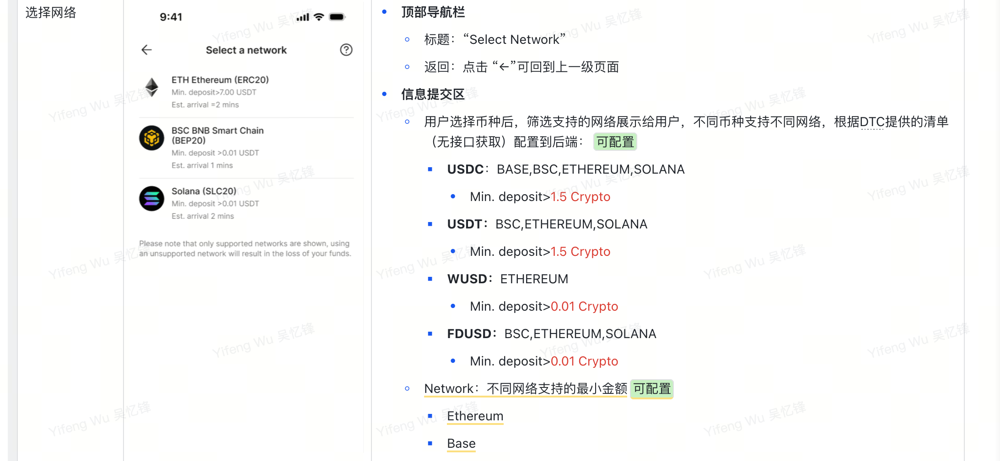

底部文案变更

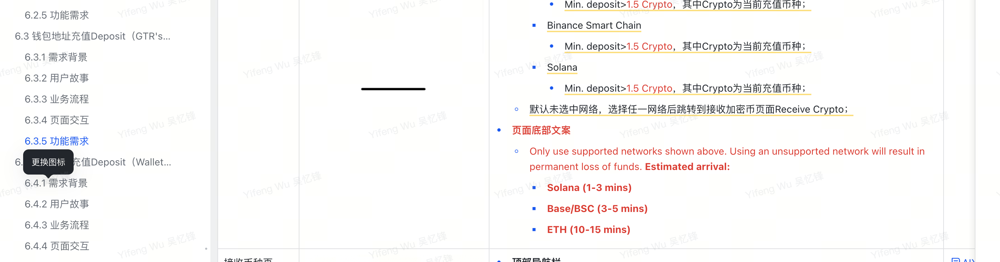

GTR-接收币种页

中间警告文案调整样式

弹窗内容调整

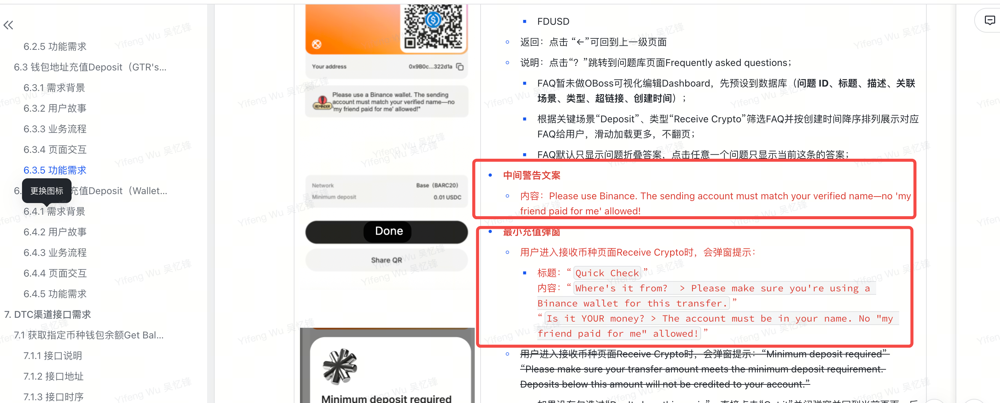

walletconnect-充值下单页

进入页面新增弹窗

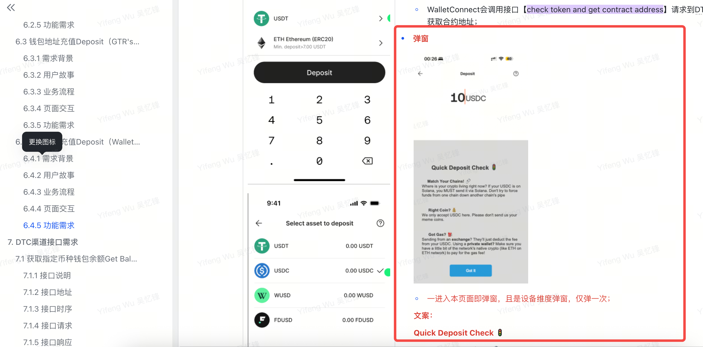

默认网络改为BSC BNB Smart Chain (BEP-20)

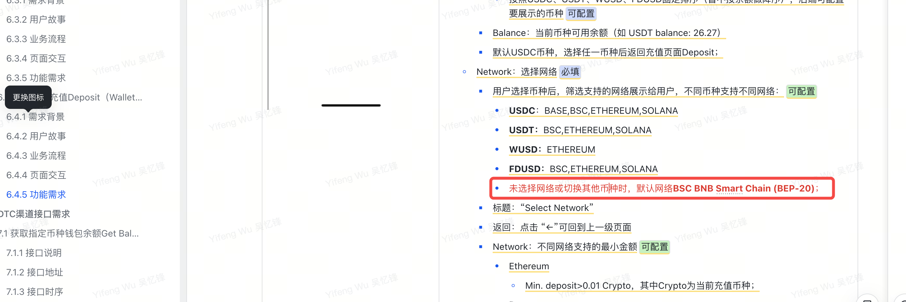

充值确认页

无可用第三方钱包，弹出toast提示

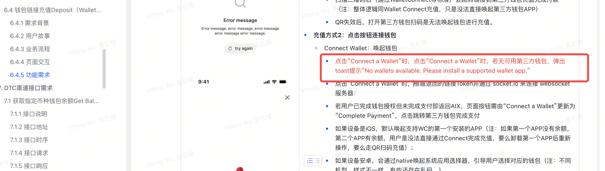
</td>
<td style="text-align: left;"></td>
</tr>
</tbody>
</table>

# 2. 引用资料

|  |  |
|:---|:---|
| **类型** | 链接 |
| PM |  |
| Figma | https://www.figma.com/design/LxHqrwdNow4AnEZG3Sj9bF/%E2%86%92-AIX-Dev-Handoff-2026-Q1?node-id=0-1&p=f&t=qPT5wVP0HRD1mVmk-0 |
| 技术方案 |  |

# 3. 全局说明

3.1 **交易说明**

<table style="width:88%;">
<colgroup>
<col style="width: 88%" />
</colgroup>
<tbody>
<tr>
<td>
转账是AIX体系内且开通了DTC钱包账户在DTC账户体系内（通过AIX注册的用户），完成<strong>不同用户同一币种</strong>的加密币转账；

兑换是在DTC账户体系内（通过AIX注册的用户），完成<strong>同一用户不同币种</strong>的加密币兑换；

WalletConnect充值 ，通过deeplink或者QR，<strong>自动加白名单，自动交易报备</strong>，不需要做交易声明，直接到账；

地址充值，必须是<strong>Gloabl travel rule</strong>支持的钱包 ，当前仅有Binance（得会催对方update list，做成可配置）无法触发加白名单，但会自动交易报备，故不需要做交易声明，直接到账；

<strong>提现不做，因牌照等合规问题，引导联系CS走人工处理；</strong>

不同网络支持的交易币种：<strong>BASE</strong>：USDC；<strong>BSC</strong>:FDUSD,USDC,USDT；<strong>ETHEREUM</strong>:FDUSD,USDC,USDT,WUSD；<strong>SOLANA</strong>:FDUSD, USDC, USDT；
</td>
</tr>
</tbody>
</table>

3.2 **接口范围**

<table style="width:89%;">
<colgroup>
<col style="width: 12%" />
<col style="width: 20%" />
<col style="width: 36%" />
<col style="width: 19%" />
</colgroup>
<tbody>
<tr>
<td style="text-align: left;"><strong>接口</strong></td>
<td style="text-align: left;">接口名称</td>
<td style="text-align: left;"><strong>接口地址</strong></td>
<td style="text-align: left;"><strong>接口说明</strong></td>
</tr>
<tr>
<td style="text-align: left;"><strong>钱包转账-加密币</strong></td>
<td style="text-align: left;">Wallet Account Transfer</td>
<td style="text-align: left;">[POST] /openapi/v1/wallet/transfer</td>
<td style="text-align: left;"></td>
</tr>
<tr>
<td rowspan="2" style="text-align: left;"><strong>钱包兑换-加密币</strong></td>
<td style="text-align: left;">Get OTC Rate</td>
<td style="text-align: left;">[POST] /openapi/v1/otc/get-otc-rate</td>
<td style="text-align: left;">获取汇率</td>
</tr>
<tr>
<td style="text-align: left;">Request OTCå</td>
<td style="text-align: left;">[POST] /openapi/v1/otc/request</td>
<td style="text-align: left;">申请换汇</td>
</tr>
<tr>
<td style="text-align: left;"><strong>钱包地址充值-加密币</strong></td>
<td style="text-align: left;">Get Deposit Address</td>
<td style="text-align: left;">[POST] /openapi/v1/crypto-account/deposit-address/search-obj</td>
<td style="text-align: left;">GTR充值</td>
</tr>
<tr>
<td style="text-align: left;"><strong>链接钱包充值-加密币</strong></td>
<td style="text-align: left;">WalletConnect</td>
<td style="text-align: left;"><a href="https://dtcpayoa.sg.larksuite.com/wiki/SKIawmFE9ip0gFkVZWKlTbksg7d">Documentation dtc-nodejs-wallet-connect (ARCHIVE)</a></td>
<td style="text-align: left;">WalletConnect充值</td>
</tr>
<tr>
<td rowspan="2" style="text-align: left;"><strong>查询交易详情</strong></td>
<td style="text-align: left;">Get Crypto Transaction</td>
<td style="text-align: left;">[GET] /openapi/v1/crypto-txn/{txnId}</td>
<td style="text-align: left;"></td>
</tr>
<tr>
<td style="text-align: left;">Get Crypto Transaction By ReferenceNo</td>
<td style="text-align: left;">[GET] /openapi/v1/crypto-txn/reference-number/{referenceNo}</td>
<td style="text-align: left;">回调异常时，用业务单号查询</td>
</tr>
<tr>
<td rowspan="2" style="text-align: left;"><strong>查询兑换详情</strong></td>
<td style="text-align: left;">Get OTC Info</td>
<td style="text-align: left;">[GET] /openapi/v1/otc/{otc_id}</td>
<td style="text-align: left;"></td>
</tr>
<tr>
<td style="text-align: left;">Get OTC Info by Reference Number</td>
<td style="text-align: left;">[GET] /openapi/v1/otc/reference-number/{referenceNo}</td>
<td style="text-align: left;"></td>
</tr>
<tr>
<td style="text-align: left;"><strong>查看全量币种余额</strong></td>
<td style="text-align: left;">Get Wallet Account Balance</td>
<td style="text-align: left;">[GET] /openapi/v1/wallet/balances</td>
<td style="text-align: left;"></td>
</tr>
<tr>
<td style="text-align: left;"><strong>查询单币种余额</strong></td>
<td style="text-align: left;">Get Balance</td>
<td style="text-align: left;">[GET] /openapi/v1/wallet/balance/{currency}</td>
<td style="text-align: left;"></td>
</tr>
</tbody>
</table>

3.3 **接口字段**

[AIX Card - 全局参数&字段处理](https://advancegroup.sg.larksuite.com/sheets/KvtPs3xv5hfS5wt3Q6xlPC2IgHO?sheet=H3Thmi)

# 4. 状态处理

4.1 **CryptoTransactionState加密币交易状态映射**

4.2 **OtcStatus状态映射**

# 5. Wallet数据字典

5.1 **CryptoTransactionType加密交易类型**

5.2 **CryptoTransactionState加密交易状态**

5.3 **MainNet主网络**

5.4 **OtcStatus场外交易状态**

5.5 **Currency 加密币**

|          |                   |                |
|:--------:|:-----------------:|:---------------|
| **Name** |     **desc**      | **Remark**     |
|  FDUSD   | First Digital USD | 第一数字美元币 |
|   USDC   |     USD Coin      | 美元币         |
|   USDT   |    USD Tether     | 泰达币         |
|   WUSD   |   Worldwide USD   | 环球美元币     |

5.6 **Available Currency可用币种**

<table style="width:88%;">
<colgroup>
<col style="width: 88%" />
</colgroup>
<tbody>
<tr>
<td><table style="width:86%;">
<colgroup>
<col style="width: 14%" />
<col style="width: 34%" />
<col style="width: 36%" />
</colgroup>
<tbody>
<tr>
<td style="text-align: left;"><strong>Currency</strong></td>
<td style="text-align: left;"><strong>Descriptor</strong></td>
<td style="text-align: left;"><strong>Remark</strong></td>
</tr>
<tr>
<td style="text-align: left;">SGD</td>
<td style="text-align: left;">Singapore Dollar</td>
<td style="text-align: left;">新加坡元</td>
</tr>
<tr>
<td style="text-align: left;">USD</td>
<td style="text-align: left;">United States Dollar</td>
<td style="text-align: left;">美元</td>
</tr>
<tr>
<td style="text-align: left;">ETH</td>
<td style="text-align: left;">Ether (Ethereum), will be deprecated on 01 Dec 2024</td>
<td style="text-align: left;">以太坊于2024年12月1日弃用</td>
</tr>
<tr>
<td style="text-align: left;">BTC</td>
<td style="text-align: left;">Bitcoin, will be deprecated on 01 Dec 2024</td>
<td style="text-align: left;">比特币于2024年12月1日弃用</td>
</tr>
<tr>
<td style="text-align: left;">USDT</td>
<td style="text-align: left;">USD Tether</td>
<td style="text-align: left;">泰达币</td>
</tr>
<tr>
<td style="text-align: left;">USDC</td>
<td style="text-align: left;">USD Coin</td>
<td style="text-align: left;">美元币</td>
</tr>
<tr>
<td style="text-align: left;">FPS</td>
<td style="text-align: left;">Faster Payment System</td>
<td style="text-align: left;"></td>
</tr>
</tbody>
</table>

同步自文档: <a href="https://advancegroup.sg.larksuite.com/docx/RJqtdUND9oGdkxxrPRllg94kgFe#O6WCdQq2nsIBttbQDuelOP5ugPc">https://advancegroup.sg.larksuite.com/docx/RJqtdUND9oGdkxxrPRllg94kgFe#O6WCdQq2nsIBttbQDuelOP5ugPc</a>
</td>
</tr>
</tbody>
</table>

5.7 **RiskLevel钱包地址风险等级**

5.8 **WalletAddressType钱包地址类型**

# 6. AIX前端功能需求

6.1 **钱包转账Send Crypto**

6.1.1 **需求背景**

|  |
|:---|
| 本功能允许用户向他人发送稳定币，支持通过（手机号、Email、Tag等）向指定收款人发送稳定币（同一币种），如USDT、USDC 等。 |

6.1.2 **用户故事**

<table style="width:88%;">
<colgroup>
<col style="width: 88%" />
</colgroup>
<tbody>
<tr>
<td style="text-align: left;">
作为一名持有加密货币AIX用户，我希望能够向朋友发送稳定币，可以通过他们的手机号、邮箱或专属标签来识别收款人，在发送前能够确认所有信息，并在发送后实时了解转账状态。

主要功能流程：

用户选择"加密币转账"

选择收款人识别方式（手机/邮箱/标签）

选择稳定币类型（USDT、USDC、WUSD等）

输入收款人信息和发送金额

确认发送信息

完成刷脸验证

查看发送结果

查看订单详情
</td>
</tr>
</tbody>
</table>

6.1.3 **业务流程**

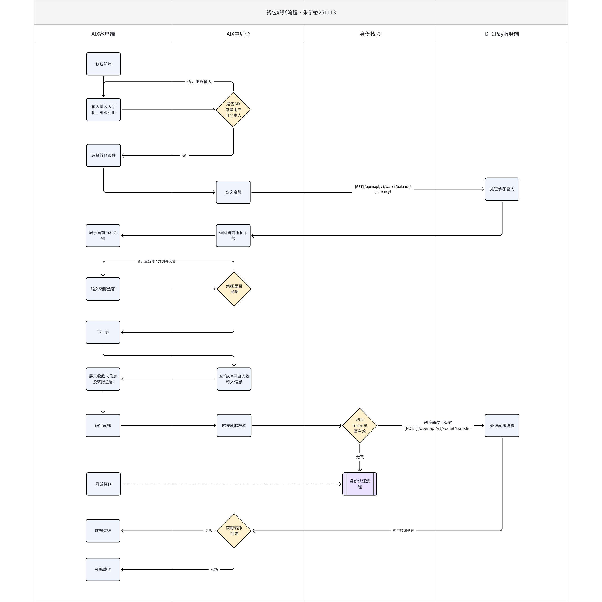

6.1.4 **页面交互**

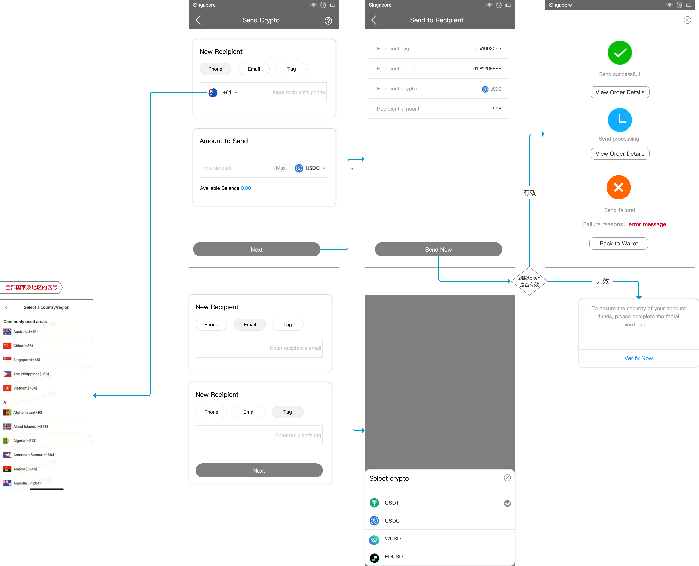

6.1.5 **功能需求**

<table style="width:89%;">
<colgroup>
<col style="width: 9%" />
<col style="width: 22%" />
<col style="width: 44%" />
<col style="width: 12%" />
</colgroup>
<tbody>
<tr>
<td style="text-align: center;"><strong>需求</strong></td>
<td style="text-align: left;"><strong>UI或UX</strong></td>
<td style="text-align: center;"><strong>页面说明</strong></td>
<td style="text-align: center;"><strong>备注</strong></td>
</tr>
<tr>
<td style="text-align: left;">选择接收人</td>
<td style="text-align: center;">

</td>
<td style="text-align: center;">
<strong>顶部导航栏：</strong>

标题：“Send Crypto”

返回：点击 “←”，可回到上一级页面；

说明：点击“？”跳转到问题库页面Frequently asked questions；

FAQ暂未做OBoss可视化编辑Dashboard，先预设到数据库（<strong>问题 ID、标题、描述、关联场景、类型、超链接、创建时间</strong>）；

根据关键场景“Transactions”、类型“Crypto Send”筛选FAQ并按创建时间降序排列展示对应FAQ给用户，滑动加载更多，不翻页；

FAQ默认只显示问题折叠答案，点击任意一个问题只显示当前这条的答案；

<strong>收款人信息区：</strong>

New Recipient：接收人的录入方式，当前所选页签必填必填：

Phone：手机号

电话区号：显示全部国家/地址的区号和国旗，用户选择后会反显

纯数字输入，20个字符；

文本输入提示“Enter recipient's phone”

Email：用户邮箱

60个字符；

文本输入框做正则表达式校验^[#.0-9a-zA-Z\\s,\\/\\-_:+?')(@#!&amp;]+$，且必须包含@

文本输入提示“Enter recipient's email”

X-Tag：用户ID

用户注册AIX平台的UserID

30个字符；

文本输入提示“Enter recipient's X-tag”

三种输入方式互斥，只读取当前页签所选择的，输入任一“Phone、Email、X-Tag”后，精准搜索接收方

<strong>最近转账人：</strong>

展示用户最近10笔转账成功的收款人；可配置

按照转账时间降序排列展示收款人“Phone”或“Email”或"X-Tag"及头像（未设置给默认）

点击任一收款人跳转到转账金额输入页面Send；

<strong>功能操作区：</strong>

点击“Confirm”会校验接收方是否AIX平台存量用户，或是否转给当前转账人（本人）：

如果不存在，提示“The recipient does not exist. Please verify the information.”

如果是本人，提示"The recipient cannot be filled in as oneself."；

以上两个校验通过，跳转到输入金额的转账页面Send；
</td>
<td style="text-align: left;"></td>
</tr>
<tr>
<td style="text-align: left;">转账金额</td>
<td style="text-align: center;">
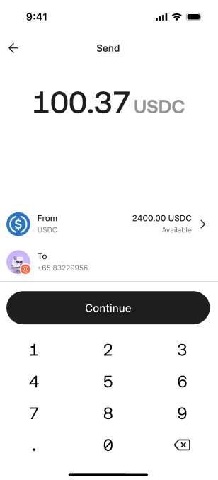

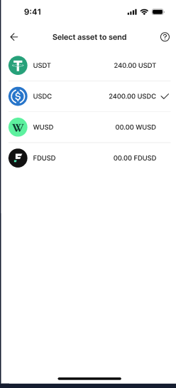

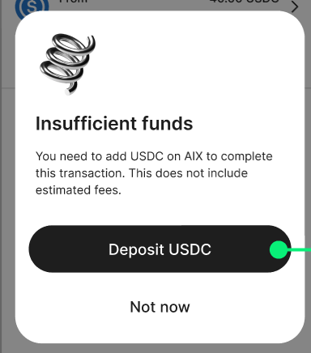
</td>
<td style="text-align: center;">
<strong>顶部导航栏：</strong>

标题：“Send”

返回：点击 “←”，可回到上一级页面；

<strong>转账录入区：</strong>

Amount：转账金额必填

纯数字<del>，保留2位小数</del>；

最少输入1（不可输入小数点），最多不大于可用余额；否则给出提示“Amount invalid”；

From：选择后反显币种及图标：必选

USDC

USDT

WUSD

FDUSD

默认选择USDC；

Available Balance：可用余额，用户选择币种后，后端调用接口【 /openapi/v1/wallet/balance/{currency}】查询当前币种的可用余额展示给用户；

To：接收人，基于用户填写的Phone、Email或X-tag展示给用户；

<strong>选择币种区：</strong>

用户进入选择币种页面时，后端调用接口【 [GET] /openapi/v1/wallet/balances】获取全量币种最新钱包账户余额，并筛选稳定币【USDC、USDT、WUSD、FDUSD】的余额并展示给用户；

Title：“Select Asset to send”

Currency：币种及图标：可配置

USDC

USDT

WUSD

FDUSD

按照USDC、USDT、WUSD、FDUSD固定排序（暂不按余额做降序），后端可配置要展示的币种可配置

Balance：可用余额

选择后返回当前转账页面Send；

<strong>功能操作区：</strong>

点击“Continue”后，校验账户可用余额是否足够覆盖转账金额：

不足，提示“Insufficient balance” “Your available balance is not enough to complete this send.”；

点击“Deposit Crypto”跳转到充值页面Select deposit method，其中Crypto为当前操作转账币种；

点击“Not now”，返回当前页面，用户可以修改转账金额重新提交；

足够，跳转至转账信息确认页Send to Recipien ；
</td>
<td style="text-align: left;"></td>
</tr>
<tr>
<td style="text-align: left;">
确定转账信息

send_to_recipient
</td>
<td style="text-align: center;">
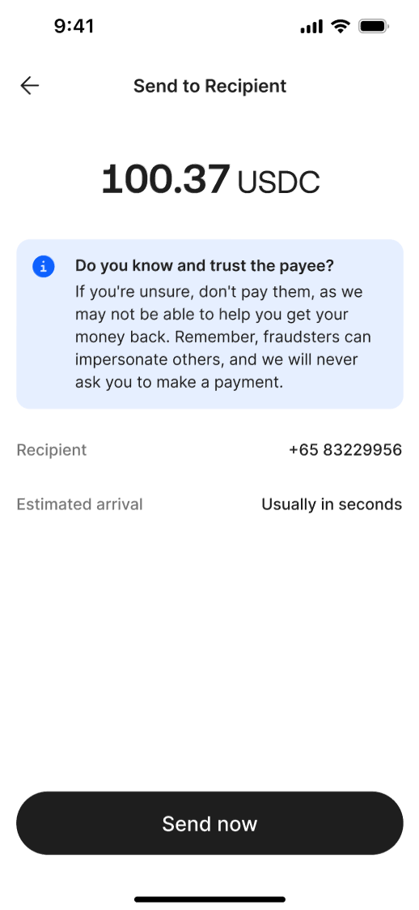

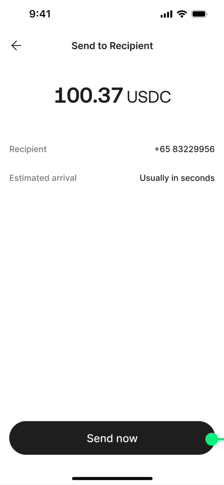
</td>
<td style="text-align: center;">
<strong>顶部导航栏：</strong>

标题：“Send to Recipient”

返回：点击 “←”，可回到上一级页面；

<strong>转账信息区：</strong>

Recipient amount：接收金额；

Recipient crypto：接收币种：

USDT

USDC

WUSD

FDUSD

Tips：首次（和当前收款人无历史转账记录）给联系人转账有提示信息“Do you know and trust the payee?” “If you're unsure, don't pay them, as we may not be able to help you get your money back. Remember, fraudsters can impersonate others, and we will never ask you to make a payment.”；

Recipient：接收人，基于用户填写的Phone、Email或X-tag展示给用户；

Estimated arrival：“Usually in seconds”纯文案，无逻辑；

<strong>功能操作区：</strong>

点击“Send Now”触发刷脸Token校验：

如果刷脸Token无效，触发刷脸操作，引导用户完成刷脸：如果刷脸成功会跳转到结果页。如果刷脸失败，可以重试，但重试次数超限会禁止操作；

如果刷脸Token有效，前端跳转到转账结果页，后端调用接口【/openapi/v1/wallet/transfer】请求转账申请；
</td>
<td style="text-align: left;"></td>
</tr>
<tr>
<td style="text-align: left;">
转账结果

send_result
</td>
<td style="text-align: center;">
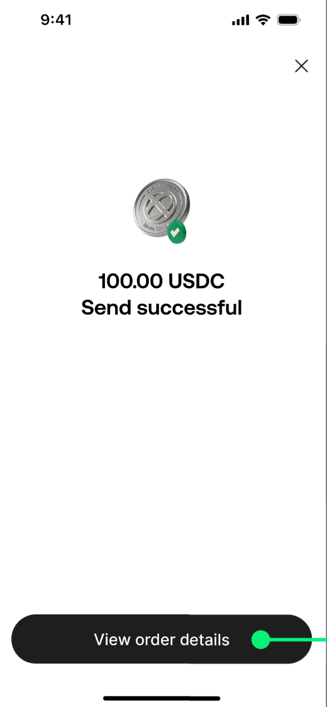

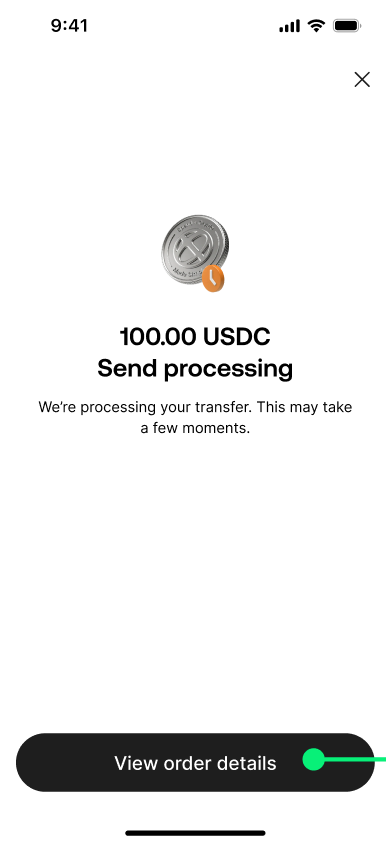

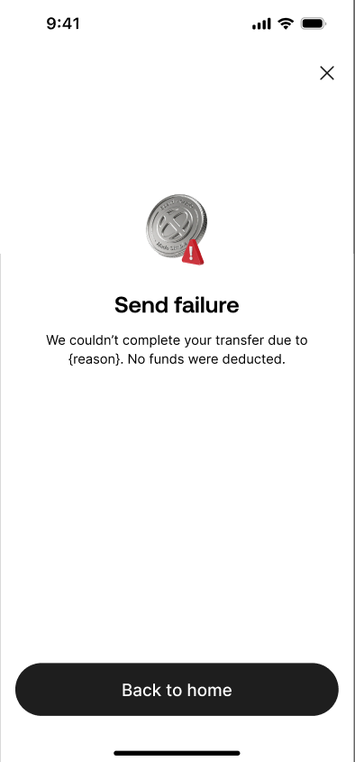
</td>
<td style="text-align: center;">
<strong>顶部导航栏</strong>

关闭：点击 “<strong>⊗</strong>”，结束当前转账流程，跳转到钱包首页Wallet；

<strong>成功结果页</strong>

如果转账响应成功且返回了交易状态“Success”页面显示转账成功

状态说明：“Send successful!”；

点击 “View Order Details” 跳转到交易详情页Transaction DetailsButton

<strong>审核中结果页</strong>

如果转账响应成功且返回了交易状态“Processing”页面显示转账处理中

状态说明： “Send processing!”

状态描述：“We’re processing your transfer. This may take a few moments.”

点击 “View Order Details” 跳转到交易详情页Transaction DetailsButton

<strong>失败结果页</strong>

如果转账响应失败且返回了交易状态“Failed”，页面显示转账失败

状态说明： “Send failure!”

状态描述：“We couldn’t complete your transfer due to {reason}. No funds were deducted.”，其中reason：读取DTCPay返回的错误信息Error message并展示给用户；

点击 “Back to Wallet” 返回钱包首页Button；
</td>
<td style="text-align: left;"></td>
</tr>
</tbody>
</table>

6.2 **钱包兑换Swap Crypto**

6.2.1 **需求背景**

|  |
|:---|
| 为满足用户在平台内进行加密货币兑换需求，需构建加密货币兑换（Swap）功能模块，实现同一用户不同稳定币（如 USDT、USDC 等）之间的兑换 |

6.2.2 **用户故事**

<table style="width:88%;">
<colgroup>
<col style="width: 88%" />
</colgroup>
<tbody>
<tr>
<td style="text-align: left;">
作为一名持有加密货币AIX用户，我希望能够将持有的USDT兑换为USDC，在兑换前能够查看实时汇率和预估到账金额，确认兑换后能够实时了解兑换状态，并在兑换完成后查看订单详情。

主要功能流程：

用户选择"兑换加密币"

选择要兑换的币种（From）和目标币种（To）

输入兑换金额

查看实时汇率和预估到账金额

确认兑换订单

查看兑换结果

查看订单详情
</td>
</tr>
</tbody>
</table>

6.2.3 **业务流程**

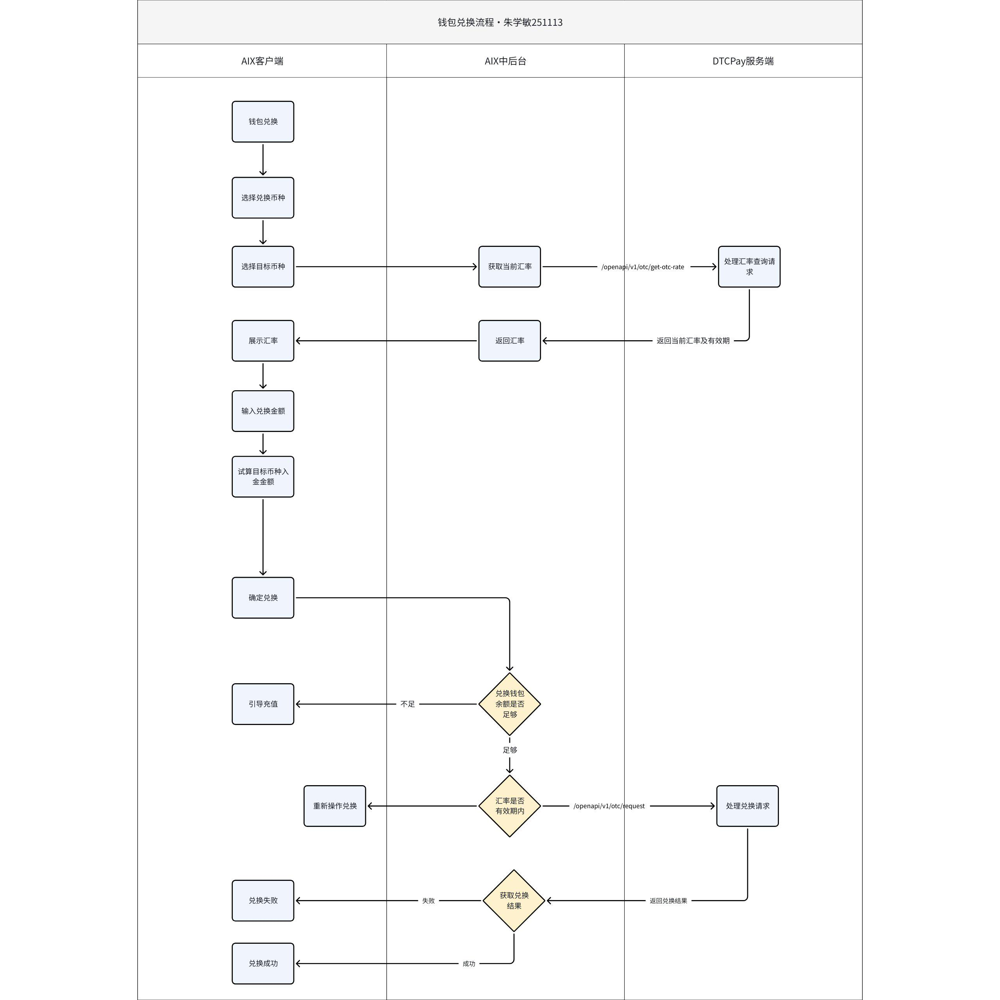

6.2.4 **页面交互**

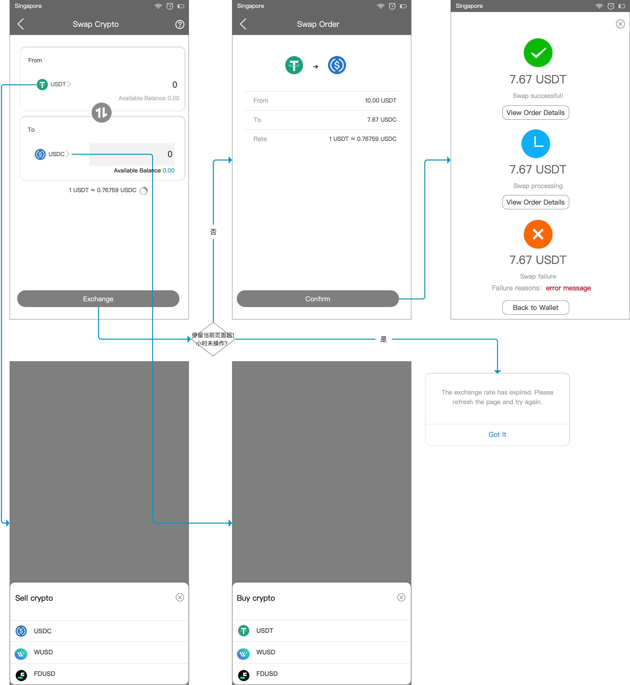

6.2.5 **功能需求**

<table style="width:89%;">
<colgroup>
<col style="width: 9%" />
<col style="width: 20%" />
<col style="width: 46%" />
<col style="width: 12%" />
</colgroup>
<tbody>
<tr>
<td style="text-align: center;"><strong>需求</strong></td>
<td style="text-align: left;"><strong>UI或UX</strong></td>
<td style="text-align: center;"><strong>需求描述</strong></td>
<td style="text-align: center;"><strong>备注</strong></td>
</tr>
<tr>
<td style="text-align: left;">兑换下单</td>
<td style="text-align: center;">
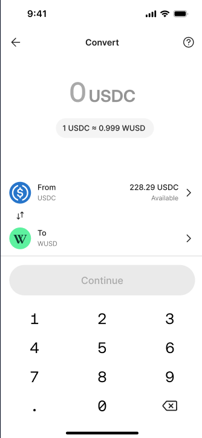

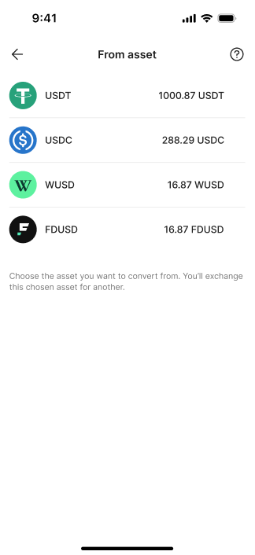

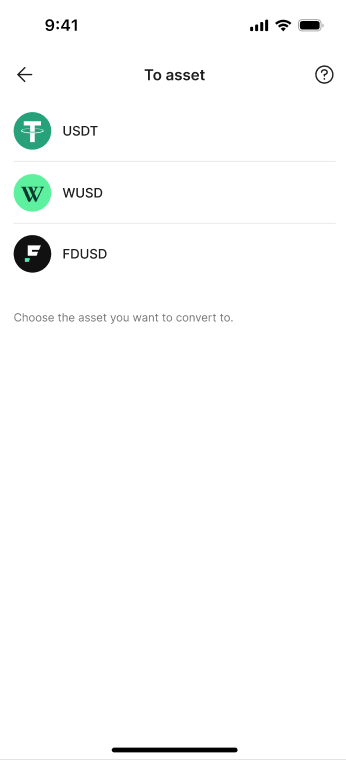

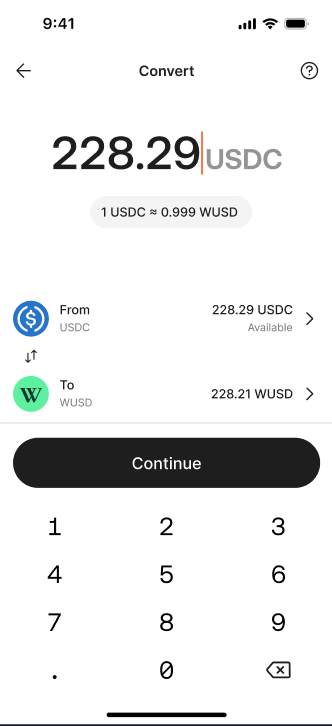
</td>
<td style="text-align: center;">
<strong>顶部导航栏</strong>

标题：“Swap”

返回：点击 “←”可回到上一级页面；

说明：点击“？”跳转到问题库页面Frequently asked questions；

FAQ暂未做OBoss可视化编辑Dashboard，先预设到数据库（<strong>问题 ID、标题、描述、关联场景、类型、超链接、创建时间</strong>）；

根据关键场景“Transactions”、类型“Crypto Swap”筛选FAQ并按创建时间降序排列展示对应FAQ给用户，滑动加载更多，不翻页；

FAQ默认只显示问题折叠答案，点击任意一个问题只显示当前这条的答案；

<strong>“From” 卖出</strong>

Sell crypto：卖出币种（初始币种）必选

点击“&gt;”弹窗提示选择卖出币种，默认包括USDT、USDC、WUSD、FDUSD（后端可配置要展示的币种可配置），但会过滤当前“Buy crypto”已选择的币种；

默认USDC；

用户选择某一币种后，会反显当前卖出币种及图标；

Available Balance：可用余额：

用户选择“卖出币种”后，后端调用接口【[GET] /openapi/v1/wallet/balance/{currency}】查询当前币种可用余额并展示给用户；

Sell amount：卖出金额必填

仅可输入数字，保留2位小数

输入金额最少1，最多不大于可用余额，否则给出提示“Amount invalid”

若输入金额小于1，提示“Amount cannot be less than 1”

<strong>“To” 买入</strong>

Buy crypto：买入币种(目标币种)必选

点击“&gt;”可选择买入币种（目标币种），默认包括USDT、USDC、WUSD、FDUSD（后端可配置要展示的币种可配置），会过滤当前“Sell crypto”已选择的币种；

用户选择某一币种后，会反显当前买入币种及图标；

Available Balance：可用余额，用户选择“卖出币种”后，后端调用接口【[GET] /openapi/v1/wallet/balance/{currency}】查询当前币种可用余额；

Buy amount：买入金额：

系统根据当前汇率计算买入金额，即Buy amount=Sell amount*Rate；

buyAmount 是 <strong>向下舍入</strong>，示例：比如卖出金额8.99，汇率1.12，买入金额是10.0688，按照向下舍入变 10.06。

买入金额自动反显不可修改，

Rate：汇率：

用户选择买入币种和卖出币种，并填写卖出金额后，调用接口【[POST] /openapi/v1/otc/get-otc-rate】获取当前所选币种汇率展示给用户；

每次选择不同币种，或切换不同币种，都会实时获取最新汇率；

1 Sell crypto=<strong>Rate</strong> * Sell crypto，示例“1 USDT = 0.78759 USDC”

<strong>功能操作栏</strong>

点击“Continue”时，跳转到兑换订单确认页Swap Order；

œ
</td>
<td style="text-align: left;"></td>
</tr>
<tr>
<td style="text-align: left;">兑换确认</td>
<td style="text-align: center;">
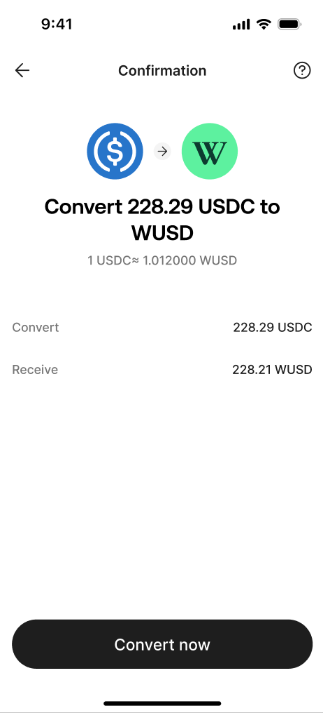

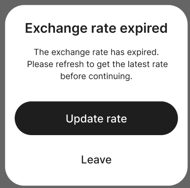

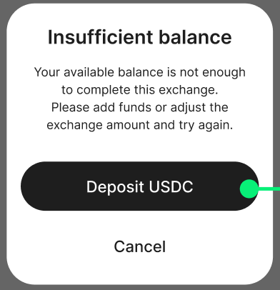
</td>
<td style="text-align: center;">
<strong>顶部导航栏</strong>

标题：“Swap Order”

返回：点击 “←”，可回到上一级页面；

<strong>订单概览区</strong>

兑换方向：展示卖出币种、兑换、买入币种的图标（如 USDT→USDC）

From:：卖出金额及币种，如“10.00 USDT”；

To：买入金额及币种，如“To: 7.87 USDC”；

Rate：当前汇率，示例“:1 USDT = 0.78759 USDC”（与兑换选择页一致）。

<strong>功能操作栏</strong>

Confirm：确定兑换，点击“Confirm”时会进行相关校验Button

①校验当前Rate是否过了汇率报价有效期：

失效，提示“Exchange rate expired” “The exchange rate has expired.
 Please refresh to get the latest rate before continuing.”

点击“Update rate”跳转到兑换页面Swap，页面恢复到初始加载状态，不保留历史操作数据；

点击“Leave”跳转到发起页；

②卖出币种的可用余额是否足够覆盖卖出金额：

不足，提示“Insufficient balance” “Your available balance is not enough to complete this exchange.Please add funds or adjust the exchange amount and try again.”；

点击“Deposit Crypto”跳转到充值页面Select a deposit method，其中Crypto为当前操作币种；

点击“Cancel”关闭弹窗，并返回当前页面；

如果①和②都校验通过，跳转到兑换结果页，后端调用接口【[POST] /openapi/v1/otc/request】请求换汇；
</td>
<td style="text-align: left;"></td>
</tr>
<tr>
<td style="text-align: left;">兑换结果</td>
<td style="text-align: center;">
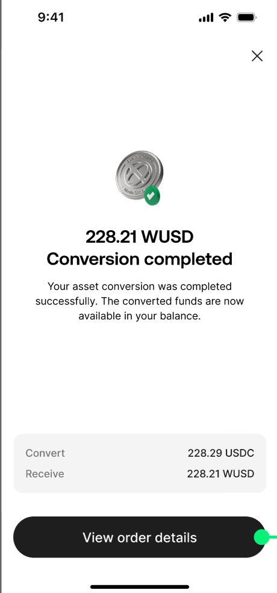

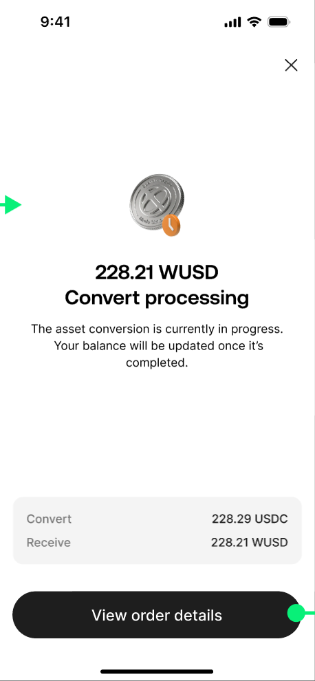

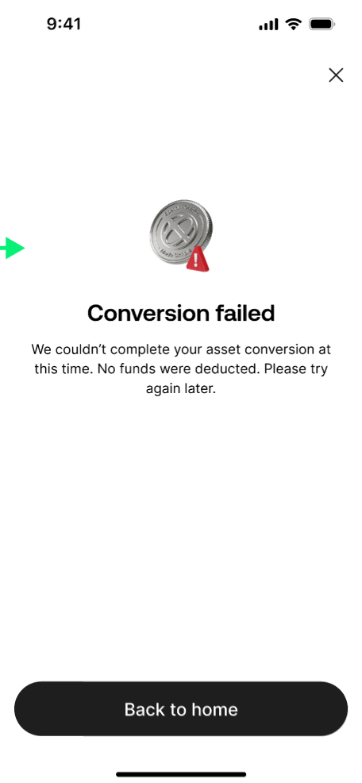
</td>
<td style="text-align: center;">
<strong>顶部导航栏</strong>

关闭：点击 “<strong>⊗</strong>”，结束当前兑换流程，跳转到业务发起页面；

<strong>兑换成功页</strong>

如果兑换响应成功且返回了OTC状态“Completed”页面显示兑换成功

BuyAmount&amp;Crypto：买入金额及币种：示例7.67 USDT”；

From：卖出金额及币种

To：买入金额及币种

状态说明：Swap completed

状态描述：Your asset conversion was completed successfully. The converted funds are now available in your balance.

点击“View Order Details”跳转到交易详情页Transaction Details；Button

<strong>兑换处理中页</strong>；

如果兑换响应成功且返回了OTC状态“Pending”页面显示兑换处理中

BuyAmount&amp;Crypto：买入金额及币种：示例7.67 USDT”；

From：卖出金额及币种

To：买入金额及币种

状态说明：Swap processing

状态描述：The asset conversion is currently in progress.
 Your balance will be updated once it’s completed.

点击“Back To Home”跳转到Home页；Button

<strong>兑换失败页</strong>

如果兑换响应失败，或返回了OTC状态“Expired”或“Cancelled”，页面显示兑换失败

BuyAmount&amp;Crypto：买入金额及币种：示例7.67 USDT”；

状态说明：Swap failed

状态描述：We couldn’t complete your asset conversion at this time. No funds were deducted. Please try again later.

点击“Back to Wallet”跳转到钱包首页WalletButton
</td>
<td style="text-align: left;"></td>
</tr>
</tbody>
</table>

6.3 **钱包地址充值Deposit（GTR's Wallet）**

6.3.1 **需求背景**

<table style="width:88%;">
<colgroup>
<col style="width: 88%" />
</colgroup>
<tbody>
<tr>
<td style="text-align: left;">
本功能允许用户通过生成专属钱包接收地址，接收来自他人的加密货币（如 USDT、USDC 等）转账。

用户将稳定币（转入AIX平台账户，支持多稳定币、多链选择。用户可使用支持全球履行规则的GTR's Wallet进行转账充（自动交易报备，不需要做交易声明，也不用校验地址白名单）。

注：当前支持GTR's Wallet的只有Binance，还在催DTC Update List
</td>
</tr>
</tbody>
</table>

6.3.2 **用户故事**

<table style="width:88%;">
<colgroup>
<col style="width: 88%" />
</colgroup>
<tbody>
<tr>
<td style="text-align: left;">
作为一名持有加密货币AIX用户，我希望能够安全、方便地生成一个收款地址，让他人能够向我转账指定的代币，并且我能选择我喜欢的网络和钱包类型，以避免转账错误或资产丢失。

主要功能流程：

用户选择“加密币充值”

选择钱包类型（托管）

选择要接收的资产（如USDT、USDC）

选择网络（如Ethereum、Base等）

系统生成对应地址

用户分享地址给付款方
</td>
</tr>
</tbody>
</table>

6.3.3 **业务流程**

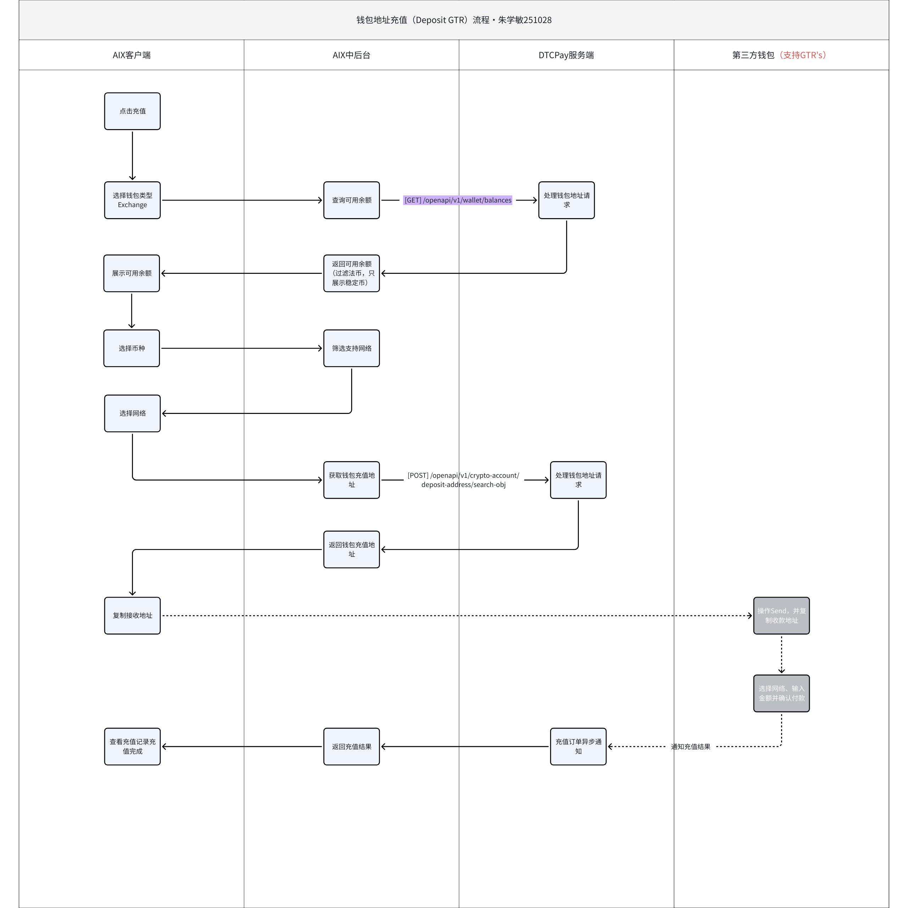

6.3.4 **页面交互**

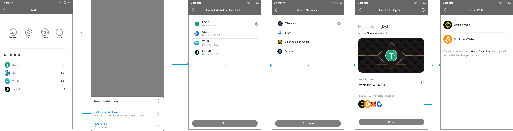

6.3.5 **功能需求**

<table style="width:89%;">
<colgroup>
<col style="width: 8%" />
<col style="width: 20%" />
<col style="width: 48%" />
<col style="width: 11%" />
</colgroup>
<tbody>
<tr>
<td style="text-align: center;"><strong>需求</strong></td>
<td style="text-align: left;"><strong>UI或UX</strong></td>
<td style="text-align: center;"><strong>需求描述</strong></td>
<td style="text-align: center;"><strong>备注</strong></td>
</tr>
<tr>
<td style="text-align: left;">GTR充值入口</td>
<td style="text-align: center;">
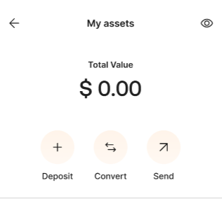

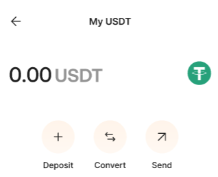

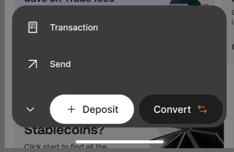
</td>
<td style="text-align: center;">
<strong>充值入口</strong>

AIX主页点击“Deposit”调起弹窗并选择“Exchange”

钱包首页My Assets点击“Deposit”后，在充值方式中选择“Exchange”

单币种首页MY Stablecoin点击“Deposit”后，在充值方式中选择“Exchange”
</td>
<td style="text-align: left;"></td>
</tr>
<tr>
<td style="text-align: left;">选择充值方式</td>
<td style="text-align: center;">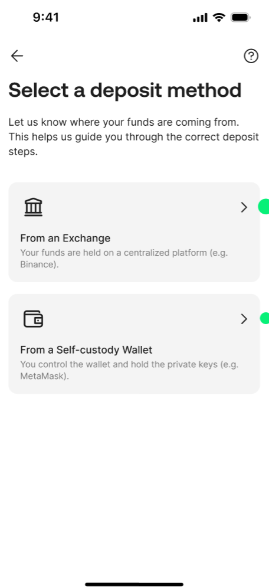</td>
<td style="text-align: center;">
<strong>选择钱包弹窗</strong>

标题：Select deposit method

说明：点击“？”跳转到问题库页面Frequently asked questions；

FAQ暂未做OBoss可视化编辑Dashboard，先预设到数据库（<strong>问题 ID、标题、描述、关联场景、类型、超链接、创建时间</strong>）；

根据关键场景“Deposit”、类型“Deposit method”筛选FAQ并按创建时间降序排列展示对应FAQ给用户，滑动加载更多，不翻页；

FAQ默认只显示问题折叠答案，点击任意一个问题只显示当前这条的答案；

充值方式提示：“Let us know where your funds are coming from.This helps us guide you through the correct deposit steps.”

From a Self-custodial Wallet：自托管钱包

文案：“You control the wallet and hold the private keys (e.g. MetaMask).”可配置

选择“&gt;”跳转到链接充值页面Deposit Crypto

注：适用于中心化交易所账户

From an Exchange：交易所（托管钱包）

文案：“Your funds are held on a centralized platform (e.g. Binance).”可配置

选择“&gt;”跳转到地址充值页面Select Asset to Receive

注：适用于中心化交易所账户
</td>
<td style="text-align: left;"></td>
</tr>
<tr>
<td style="text-align: left;">选择币种</td>
<td style="text-align: center;">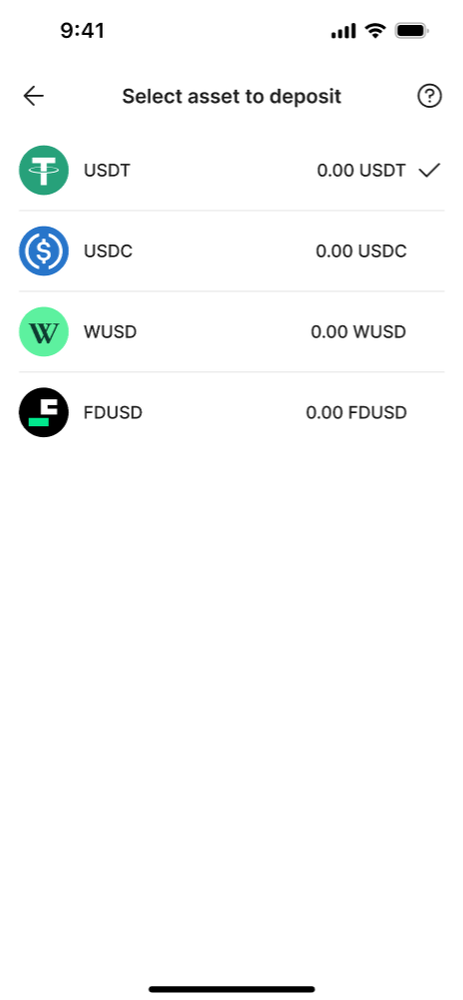</td>
<td style="text-align: center;">
<strong>顶部导航栏</strong>

标题：“Select Asset to deposit”

返回：点击 “←”可回到上一级页面

<strong>资产选择区</strong>

用户进入当前页面时，后端调用接口【 [GET] /openapi/v1/wallet/balances】获取全量币种最新钱包账户余额，并筛选稳定币【USDT、USDC、WUSD、FDUSD】的余额Balance并展示给用户；

Crypto：币种及图标单选

USDT

USDC

WUSD

FDUSD

按照USDC、USDT、WUSD、FDUSD固定排序（暂不按余额做降序），后端可配置要展示的币种可配置

Balance：当前币种可用余额（如 USDT balance: 26.27）

默认未选中币种，选择任一币种后跳转到选择网络页面Select Network；
</td>
<td style="text-align: left;"></td>
</tr>
<tr>
<td style="text-align: left;">选择网络</td>
<td style="text-align: center;">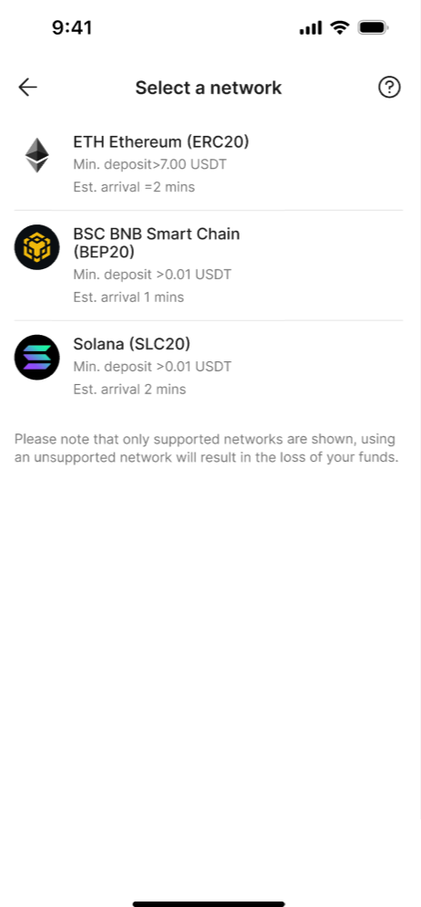</td>
<td style="text-align: center;">
<strong>顶部导航栏</strong>

标题：“Select Network”

返回：点击 “←”可回到上一级页面

<strong>信息提交区</strong>

用户选择币种后，筛选支持的网络展示给用户，不同币种支持不同网络，根据DTC提供的清单（无接口获取）配置到后端：可配置

<strong>USDC</strong>：BASE,BSC,ETHEREUM,SOLANA

Min. deposit&gt;1.5 Crypto

<strong>USDT：</strong>BSC,ETHEREUM,SOLANA

Min. deposit&gt;1.5 Crypto

<strong>WUSD：</strong>ETHEREUM

Min. deposit&gt;0.01 Crypto

<strong>FDUSD：</strong>BSC,ETHEREUM,SOLANA

Min. deposit&gt;0.01 Crypto

Network：不同网络支持的最小金额可配置

Ethereum

Base

Binance Smart Chain

Solana

默认未选中网络，选择任一网络后跳转到接收加密币页面Receive Crypto；

<strong>页面底部文案</strong>

Only use supported networks shown above. Using an unsupported network will result in permanent loss of funds.
</td>
<td style="text-align: left;"></td>
</tr>
<tr>
<td style="text-align: left;">接收币种页</td>
<td style="text-align: center;">
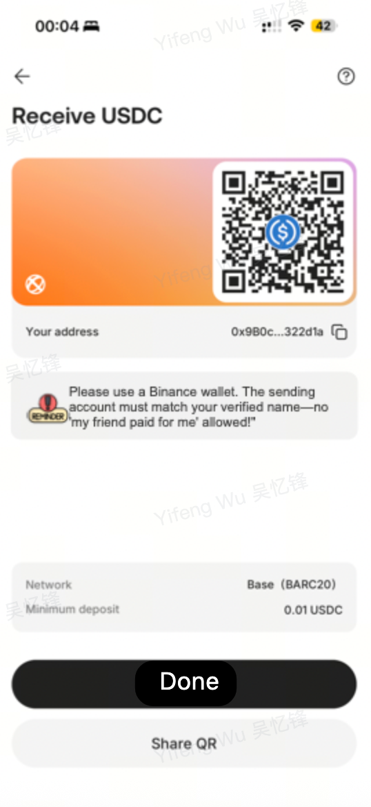

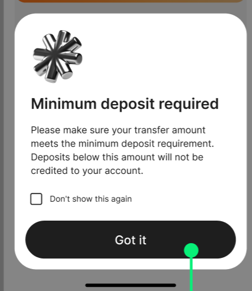
</td>
<td style="text-align: center;">
<strong>顶部导航栏</strong>

标题：“Receive Crypto”， Crypto为当前所选币种，示例“Receive USDT”：

USDT

USDC

WUSD

FDUSD

返回：点击 “←”可回到上一级页面

说明：点击“？”跳转到问题库页面Frequently asked questions；

FAQ暂未做OBoss可视化编辑Dashboard，先预设到数据库（<strong>问题 ID、标题、描述、关联场景、类型、超链接、创建时间</strong>）；

根据关键场景“Deposit”、类型“Receive Crypto”筛选FAQ并按创建时间降序排列展示对应FAQ给用户，滑动加载更多，不翻页；

FAQ默认只显示问题折叠答案，点击任意一个问题只显示当前这条的答案；

<strong>中间警告文案</strong>

内容：Please use Binance. The sending account must match your verified name—no 'my friend paid for me' allowed!

<strong>最小充值弹窗</strong>

用户进入接收币种页面Receive Crypto时，会弹窗提示：

标题：“Quick Check” 
内容：“Where's it from? &gt; Please make sure you're using a Binance wallet for this transfer.” 
“Is it YOUR money? &gt; The account must be in your name. No "my friend paid for me" allowed!”

<del>用户进入接收币种页面Receive Crypto时，会弹窗提示：“Minimum deposit required” “Please make sure your transfer amount meets the minimum deposit requirement. Deposits below this amount will not be credited to your account.”</del>

一进入本页面即弹窗，且是设备维度弹窗，仅弹一次；

<del>如果没有勾选过“Don't show this again”，直接点击“Got it”关闭弹窗并回到当前页面，后续进入该页面都会弹窗提示；</del>

<del>如果有勾选过“Don't show this again”，并点击“Got it”关闭弹窗会回到当前页面，且后续不会再次弹窗提示；</del>

<strong>充值概览区</strong>

文案：“Go find your supported payment GTR’s wallet <strong>here &gt;</strong>”

点击“here &gt;”跳转到全球履行规则钱包页GTR's Wallet

Your Address：接收地址

用户进入该页面时，后端调用接口【/openapi/v1/crypto-account/deposit-address/search-obj】获取钱包充值地址；

将地址字符串生成对应的QR，并显示对应币种图标：

USDT

USDC

WUSD

FDUSD

点击“<strong>❐</strong>”可以复制Recipient Address到剪贴板，并提示“The information has been copied.”；

Network：根据用户选择的mainNet 展示：

Ethereum

Base

Binance Smart Chain

Solana

Minimum deposit：最小充值金额，根据选择的网络展示对应的金额及币种；

<strong>功能操作栏</strong>

点击“Done”时，结束当前地址充值流程并返回钱包首页Wallet；

点击“Share QR Code”时，调用系统分享组件；
</td>
<td style="text-align: left;"><a href="https://advancegroup.sg.larksuite.com/docx/OlWEdynrboay1QxcpfhlYbJtgZg">AIX APP V1.0 【FAQ】</a></td>
</tr>
<tr>
<td style="text-align: left;"><del>GTR's Wallet</del></td>
<td style="text-align: center;">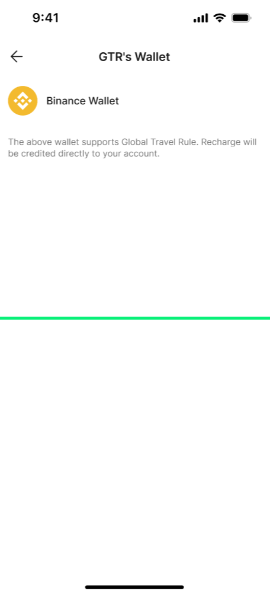</td>
<td style="text-align: center;">
<strong><del>顶部导航栏</del></strong>

<del>标题：“GTR's Wallet”</del>

<del>返回：点击 “←”可回到上一级页面；</del>

<del><strong>钱包列表区（托管钱包）</strong>支持全球履行规则的GTR钱包：可配置</del>

<del>展示支持全球旅行规则GTR的钱包名称及图标，按新增时间降序排列，滑动加载更多，不做分页</del>

<del>Binance Wallet</del>

<del>文案：“The above wallet supports <strong>Global Travel Rule</strong>. Recharge will be credited directly to your account.”</del>

<del>注：GTR钱包充值是自动交易报备，不需要做交易声明，也不用校验地址白名单，当前仅支持Binance（DTC后续会增加）</del>
</td>
<td style="text-align: left;"></td>
</tr>
</tbody>
</table>

6.4 **钱包链接充值Deposit（WalletConnect）**

<table style="width:88%;">
<colgroup>
<col style="width: 88%" />
</colgroup>
<tbody>
<tr>
<td style="text-align: left;">
知识点

<strong>Deeplink 有效期</strong>

系统生成 WalletConnect deeplink 后，<strong>有效期为 5 分钟</strong>。

用户需要在 <strong>5 分钟内通过第三方钱包完成授权</strong>。

若超过 5 分钟未完成授权，则 deeplink 失效，需要 <strong>重新生成 deeplink</strong>。

授权有效期由 <strong>WalletConnect协议控制</strong>。

<strong>WalletConnect 授权有效期</strong>

用户完成 WalletConnect 授权后，<strong>授权有效期为 1 天</strong>。

在该有效期内，<strong>DTC 允许 AIX 发起 send_payment 请求</strong>。

授权有效期由 <strong>DTC 控制</strong>。
</td>
</tr>
</tbody>
</table>

6.4.1 **需求背景**

|  |
|:---|
| 本功能为 APP 用户提供加密货币充值服务，支持 “个人非托管钱包”充值。用户通过WalletConnect实现链接钱包充值，在操作充值时，用户可以打开钱包扫二维码完成充值，或通过打开DeepLink唤起钱包进行充值。 |

6.4.2 **用户故事**

<table style="width:88%;">
<colgroup>
<col style="width: 88%" />
</colgroup>
<tbody>
<tr>
<td style="text-align: left;">
作为一名持有加密货币AIX用户，我希望能够生成一个接收地址二维码，或直接打开第三方非托管钱包，方便我或他人向我的钱包存入指定的代币，并且我可以选择不同Token，以及通过多种方式分享接收地址。

主要流程：

用户选择“加密币充值”

选择钱包类型（非托管）

输入充值金额，并选择Token和发送地址

生成地址二维码

可选择分享QR或直接连接钱包

查看充值结果；
</td>
</tr>
</tbody>
</table>

6.4.3 **业务流程**

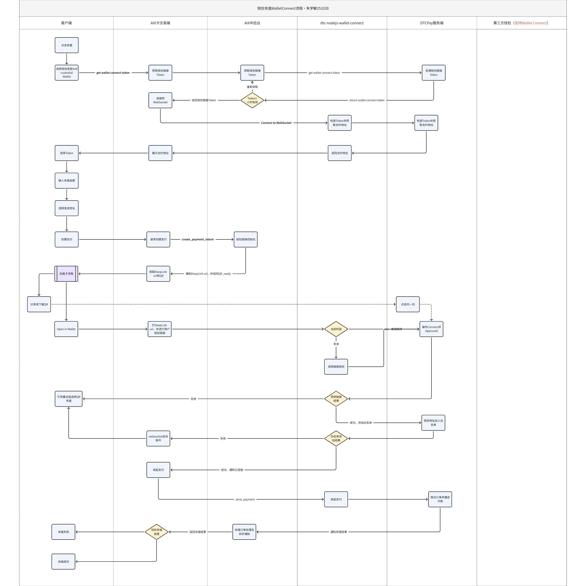

6.4.4 **页面交互**

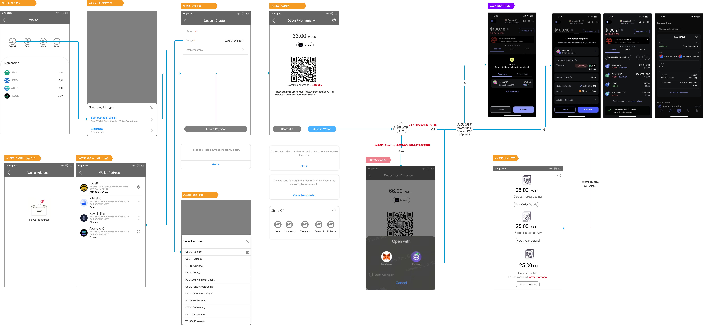

6.4.5 **功能需求**

<table style="width:89%;">
<colgroup>
<col style="width: 8%" />
<col style="width: 20%" />
<col style="width: 47%" />
<col style="width: 11%" />
</colgroup>
<tbody>
<tr>
<td style="text-align: center;"><strong>需求</strong></td>
<td style="text-align: left;"><strong>UI或UX</strong></td>
<td style="text-align: center;"><strong>需求描述</strong></td>
<td style="text-align: center;"><strong>备注</strong></td>
</tr>
<tr>
<td style="text-align: left;">充值入口</td>
<td style="text-align: center;">
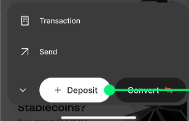

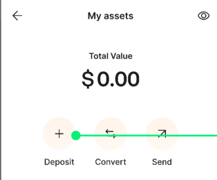

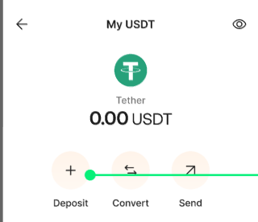
</td>
<td style="text-align: center;">
<strong>充值入口</strong>

AIX主页点击“Deposit”并选择“Self-custodial Wallet”

Wallet首页点击“Deposit”并选择“Self-custodial Wallet”

单币种首页点击“Deposit”并选择“Self-custodial Wallet”
</td>
<td style="text-align: left;"></td>
</tr>
<tr>
<td style="text-align: left;">选择钱包类型</td>
<td style="text-align: center;">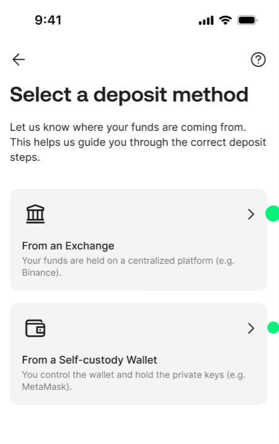</td>
<td style="text-align: center;">
<strong>选择钱包弹窗</strong>

标题：Select deposit method

说明：点击“？”跳转到问题库页面Frequently asked questions；

FAQ暂未做OBoss可视化编辑Dashboard，先预设到数据库（<strong>问题 ID、标题、描述、关联场景、类型、超链接、创建时间</strong>）；

根据关键场景“Deposit”、类型“Deposit method”筛选FAQ并按创建时间降序排列展示对应FAQ给用户，滑动加载更多，不翻页；

FAQ默认只显示问题折叠答案，点击任意一个问题只显示当前这条的答案；

充值方式提示：“Let us know where your funds are coming from.This helps us guide you through the correct deposit steps.”

From a Self-custodial Wallet：自托管钱包

文案：“Best Wallet, Bifrost Wallet, TokenPocket, etc.”可配置

选择“&gt;”跳转到链接充值页面Deposit Crypto

注：适用于用户自己掌握私钥的钱包

From an Exchange：交易所（托管钱包）

文案：“Binance, etc.”可配置

选择“&gt;”跳转到地址充值页面Select Asset to Receive

注：适用于中心化交易所账户
</td>
<td style="text-align: left;"></td>
</tr>
<tr>
<td style="text-align: left;">充值下单</td>
<td style="text-align: center;">
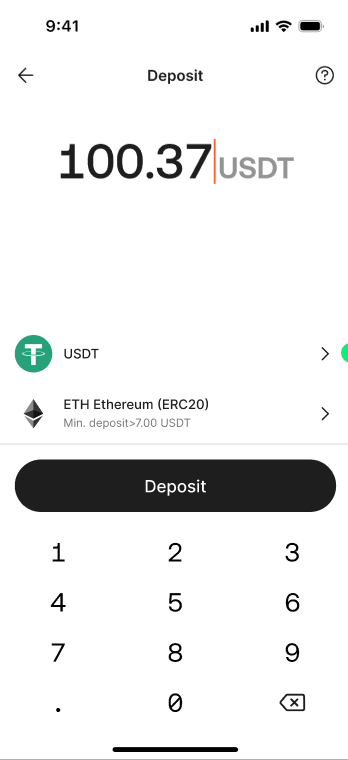

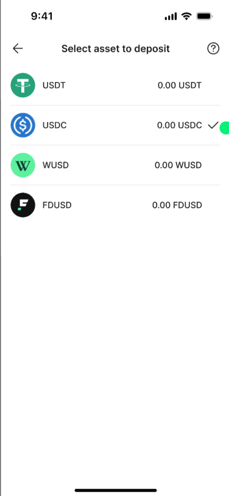

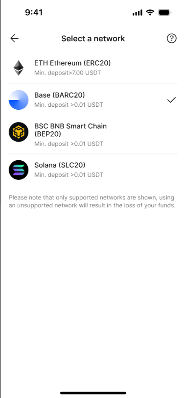
</td>
<td style="text-align: center;">
<strong>顶部导航栏</strong>

标题：“Deposit”

返回：点击 “←”，可回到上一级页面；

<strong>获取钱包连接Token并连接WebSocket</strong>

用户进入该页面时，调用接口【get wallet connect token】获取钱包链接Token；

Token是1小时有效，如果ErrorCode返回“invalid_auth_credentials”Token失效，系统重新调用接口【get wallet connect token】获取Token；

获得Token后，调用接口【Connect to WebSocke】连接到WebSocket服务器；

WalletConnect会调用接口【check token and get contract address】请求到DTC检查令牌并获取合约地址；

<strong>弹窗</strong>

<blockquote>

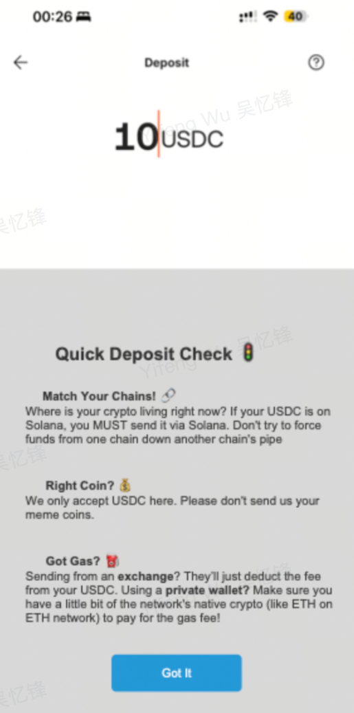

</blockquote>

一进入本页面即弹窗，且是设备维度弹窗，仅弹一次；

<blockquote>

<strong>文案：</strong>

<strong>Quick Deposit Check</strong> 🚦

<strong>Match Your Chains!</strong> 🔗 Where is your crypto living right now? If your stablecoin is on Solana, you MUST send it via Solana. Don't try to force funds from one chain down another chain's pipe.

<strong>Right Coin?</strong> 💰 We only accept USDC here. Please don't send us your meme coins.

<strong>Got Gas?</strong> ⛽️ Sending from an exchange? They’ll just deduct the fee from your stablecoin. Using a private wallet? <strong>You MUST have the network's native crypto (like ETH on Base) to pay for gas—it is the ONLY way. Without it, your deposit will fail.</strong>

</blockquote>

<strong>信息提交区</strong>

Amount：金额必填

纯数字，限制30个字符串

输入金额最小值≥0.01，

输入金额最大值≥单笔充值限额，默认9999999.00，按币种分别配置（USDT / USDC / WUSD / FDUSD））可配置

Crypto：选择币种必填

用户进入当前页面时，后端调用接口【 [GET] /openapi/v1/wallet/balances】获取全量币种最新钱包账户余额，并筛选稳定币【USDT、USDC、WUSD、FDUSD】的余额Balance并展示给用户；

标题：“Select Asset to deposit”

返回：点击 “←”可回到上一级页面

Crypto：币种及图标单选

USDT

USDC

WUSD

FDUSD

按照USDC、USDT、WUSD、FDUSD固定排序（暂不按余额做降序），后端可配置要展示的币种可配置

Balance：当前币种可用余额（如 USDT balance: 26.27）

默认USDC币种，选择任一币种后返回充值页面Deposit；

Network：选择网络必填

用户选择币种后，筛选支持的网络展示给用户，不同币种支持不同网络：可配置

<strong>USDC</strong>：BASE,BSC,ETHEREUM,SOLANA

<strong>USDT：</strong>BSC,ETHEREUM,SOLANA

<strong>WUSD：</strong>ETHEREUM

<strong>FDUSD：</strong>BSC,ETHEREUM,SOLANA

未选择网络或切换其他币种时，默认网络<strong>BSC BNB Smart Chain (BEP-20)，若无对应BSC BNB网络，则默认为为ETH</strong>

标题：“Select Network”

返回：点击 “←”可回到上一级页面

Network：不同网络支持的最小金额可配置

Ethereum

Min. deposit&gt;0.01 Crypto，其中Crypto为当前充值币种；

Base

Min. deposit&gt;0.01 Crypto，其中Crypto为当前充值币种；

Binance Smart Chain

Min. deposit&gt;0.01 Crypto，其中Crypto为当前充值币种；

Solana

Min. deposit&gt;0.01 Crypto，其中Crypto为当前充值币种；

默认未选中网络，选择任一网络后返回充值页面Deposit；

<strong>功能操作栏</strong>

点击“Deposit”跳转到充值加载页；
</td>
<td style="text-align: left;"></td>
</tr>
<tr>
<td style="text-align: left;">充值确认页</td>
<td style="text-align: center;">

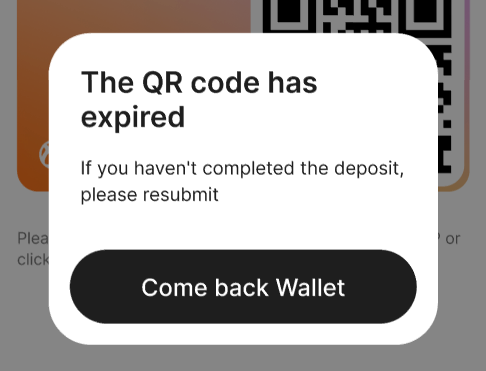

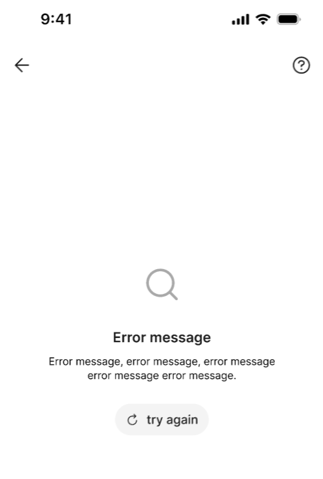

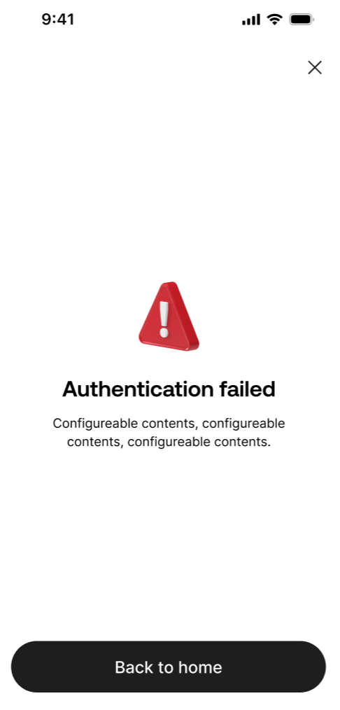
</td>
<td style="text-align: center;">
<strong>顶部导航栏</strong>

标题：“Deposit confirmation ”

返回：点击 “←”，可回到上一级页面；

说明：点击“？”跳转到问题库页面Frequently asked questions；

FAQ暂未做OBoss可视化编辑Dashboard，先预设到数据库（<strong>问题 ID、标题、描述、关联场景、类型、超链接、创建时间</strong>）；

根据关键场景“Deposit”、类型“Crypto Deposit”筛选FAQ并按创建时间降序排列展示对应FAQ给用户，滑动加载更多，不翻页；

FAQ默认只显示问题折叠答案，点击任意一个问题只显示当前这条的答案；

<strong>生成QR</strong>

在进入充值确认页时，会调用接口【create_payment_intent】，Wallet Connect初始化钱包连接：

支付创建成功后，Wallet Connect链接成功并回调通知DeepLink url，通过【qr_ready】返回uri字符串；

前端根据返回的uri字符串生成带当前充值币种logo的QR码；

提示：“Awaiting payment... <strong>4:00 Min</strong>”<del>可配置</del>

超过过期时间后，二维码置灰，分享按钮不可点击，并在页面提示“The QR code has expired” “If you haven't completed the deposit, please resubmit.”，点击“Come back Wallet”返回钱包首页；

描述：“Please scan the code using a wallet that supports WalletConnect, or click the button below for quick top-up.”

<strong>订单概览区</strong>

Amount：金额

Crypto：币种

USDT

USDC

WUSD

FDUSD

Network：网络

Ethereum

Base

Binance Smart Chain

Solana

<strong>充值方式1：扫描二维码唤起钱包</strong>

Share QR Code：扫码唤起钱包：

点击“Share QR Code”时，调用系统分享组件；

扫描二维码后（通过WalletConnect等标准）会跳转链接到第三方钱包页面完成付款（注：整体逻辑同Wallet Connect充值，只是没法直接唤起第三方钱包APP）

QR失效后，打开第三方钱包扫码是无法唤起钱包进行充值。

<strong>充值方式2：点击按钮连接钱包</strong>

Connect Wallet：唤起钱包

点击“Connect a Wallet”时，点击“Connect a Wallet”时，若无可用第三方钱包，弹出toast提示“No wallets available. Please install a supported wallet app.”

点击“Connect a Wallet”时，根据返回的链接Token并通过 socket.io 来连接 websocket 服务器：

若用户已完成钱包授权但未完成支付即返回AIX，页面按钮需由“Connect a Wallet”更新为“Complete Payment”，点击跳转第三方钱包完成支付

如果设备是iOS，默认唤起支持WC的第一个安装的APP（注：如果第一个APP没有余额，第二个APP有余额，用户是没法直接通过Connect完成充值，要么卸载第一个APP后重新操作，要么走QR扫码充值）；

如果设备安卓，会通过native唤起系统应用选择器，引导用户选择对应的钱包（注：不同机型，样式不一样，有些还存在乱码。）

注：用户操作wallet connect并Approved后，DTC会自动添加地址到白名单（<del>当天使用该发送地址二次充值不用在进行Approved的，直接走付款流程</del>）:

如果添加白名单成功，即链接成功，调用接口【send_payment】发送支付；

如果添加白名单失败会自动断开websocket，弹窗提示“Connection failed，Unable to send connect request, Please try again.”，点击“Got it”关闭弹窗返回当前页面；

注：支持WalletConnect的主流钱包：https://walletguide.walletconnect.network/?devices=Mobile&amp;chains=eip155%3A1%2Csolana%3A5eykt4UsFv8P8NJdTREpY1vzqKqZKvdp%2Ceip155%3A8453%2Ceip155%3A56 选择设备及网络即可看到支持的钱包，如Binance Wallet，TokenPocket，Bybit Wallet等；

<strong>异常处理</strong>

<table style="width:45%;">
<colgroup>
<col style="width: 45%" />
</colgroup>
<tbody>
<tr>
<td style="text-align: left;">用户从第三方钱包回跳 AIX 后，因授权/支付结果未明确返回或连接中断导致状态不确定，需进入异常分流页面处理。</td>
</tr>
</tbody>
</table>

当用户从第三方钱包回跳 AIX 时，若长连接中断导致状态无法确认，则载充值确认页展示 Loading 状态且不可操作。AIX 将尝试重新建立长连接并获取当前状态，最多重试 <strong>5 次</strong>；若 5 次仍未建立成功，则按 <strong>长连接中断</strong> 场景进行失败处理，并跳转至对应异常场景页面。

<strong>异常场景①：下单失败</strong>

调用 create_payment 时，DTC 返回明确错误码：比如“create_payment_error、payment_failed、payment_rejected，跳转到下单失败页，用户可以重试；

<blockquote>

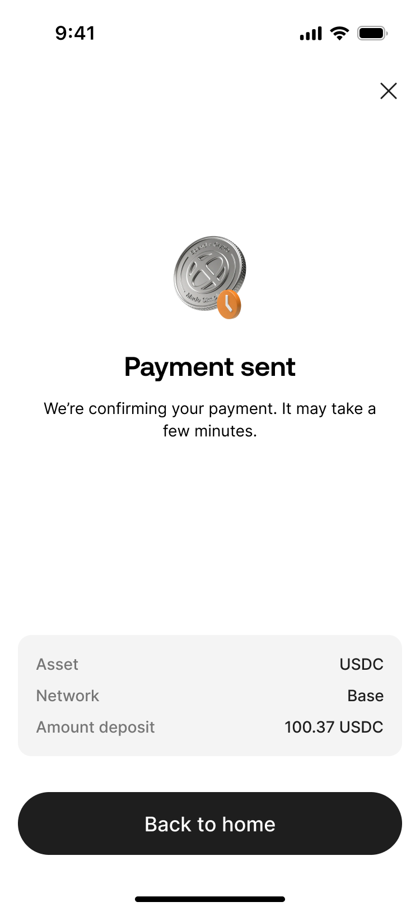

</blockquote>

点击back to home 或关闭按钮，回到首页；

<strong>异常场景②：授权失败&amp;长连接中断，无法获取授权状态</strong>

操作“Connect Wallet”时，

DTC返回明确Error Code，比如“connection_failed”、“connection_rejected” "disconnected" "send_connect_request_error",跳转到授权失败页，用户不可重试;

AIX 内完成对 DTC 的授权（授权成功回调已收到），但在 AIX 发起 send_payment（支付请求）之前，AIX 与 DTC 的长连接断开,跳转到授权失败页，用户不可重试;

其中invalid_auth_credentials，系统会自动获取Token用户无感，重新获取3次，超过也是跳转到授权失败页面，用户不可重试。

<blockquote>

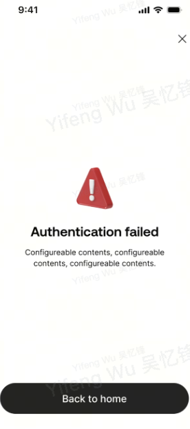

</blockquote>

点击“Back to home ”或“X”结束充值流程，回到钱包首页；

<strong>异常场景③：授权成功，但长连接断开（支付状态不明）</strong>

操作“Connect Wallet”时，AIX 发起 send_payment（支付请求）之后，AIX 与 DTC 的长连接断开,跳转到<strong>Payment Confirmation</strong> 页;

<blockquote>

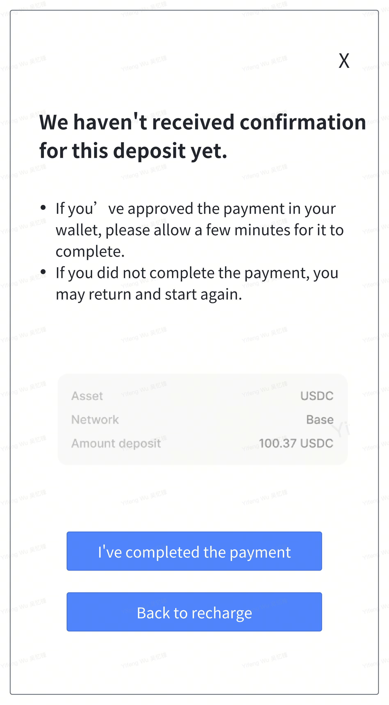

</blockquote>

点击“I've completed the payment ”或“X”结束流程，回到钱包首页；

点击“Back to recharge”，跳转到充值下单页；

<strong>异常场景④：授权成功，支付不成功（长连接未中断）</strong>

操作“Connect Wallet”时，AIX 发起 send_payment（支付请求）之后，AIX 与 DTC 的长连接未断开,跳转到<strong>Payment Confirmation</strong> 页;

<blockquote>

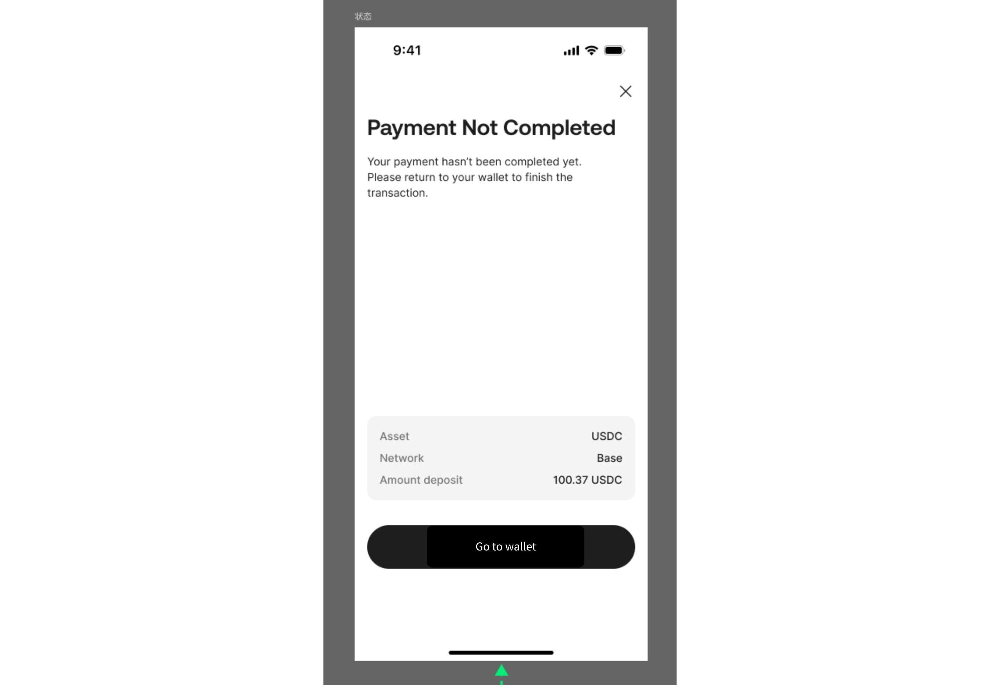

</blockquote>

点击“Go to wallet ”跳转到第三方钱包；

点击“关闭按钮”，弹出挽留弹窗

Title：Leave this payment?

Content: This payment still needs to be completed or canceled in your wallet. 
If you leave this page now, you may not be able to complete the other payment successfully within the next 5 minutes.

Button:

Stay and continue: 点击后关闭弹窗，停留在当前页；

Leave: 点击后关闭弹窗，返回到业务流程入口页；
</td>
<td style="text-align: left;"></td>
</tr>
<tr>
<td style="text-align: left;">充值结果页</td>
<td style="text-align: center;">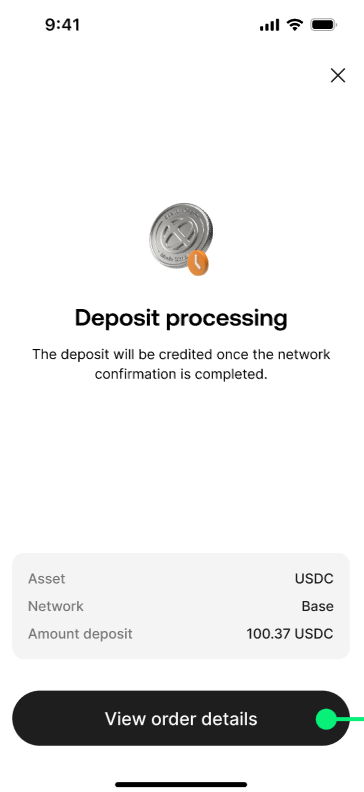</td>
<td style="text-align: center;">
<strong>顶部导航栏</strong>

关闭：点击 “<strong>⊗</strong>”，结束当前兑换流程，跳转到钱包首页Wallet；

<strong>结果概览区</strong>

用户在第三方钱包操作了确认付款后，DTC会重定向到AIX充值结果页；

<strong>充值成功页</strong>

充值订单创建成功（响应状态"success": true）且返回了交易状态“Completed”页面显示充值成功

Amount&amp;Crypto：充值金额及币种：示例25.00 USDT”；

状态说明：Deposit successful!

点击“View Order Details”跳转到交易详情页Transaction Details；Button

<strong>充值处理中页</strong>；

充值订单创建成功（响应状态"success": true）且返回了交易状态“PENDING、PROCESSING、AUTHORIZED”页面显示充值处理中

Amount&amp;Crypto：充值金额及币种：示例25.00 USDT”；

状态说明：“Deposit progressing”

状态描述：“The deposit will be credited once the network confirmation is completed.”

点击“View Order Details”跳转到交易详情页Transaction Details；Button

<strong>充值失败页</strong>

充值订单响应失败（"success": false），或返回了交易状态“REJECTED、CLOSED”，页面提示充值失败

Amount&amp;Crypto：充值金额及币种：示例25.00 USDT”；

状态说明：“Deposit failed”

点击“Back to Wallet”跳转到钱包首页WalletButton

<strong>异常场景①：下单失败</strong>

操作“Send payment”时，DTC返回明确Error Code，比如“request_payment_error”、“payment_rejected” "payment_failed" "add_whitelist_failed",跳转到充值失败结果页，用户不可重试;
</td>
<td style="text-align: left;"></td>
</tr>
</tbody>
</table>

# 7. DTC渠道接口需求

7.1 **获取指定币种钱包余额Get Balance**

7.1.1 **接口说明**

此接口用于获取特定货币钱包的余额和场外交易限额。

7.1.2 **接口地址**

\[GET\] /openapi/v1/wallet/balance/{currency}

7.1.3 **接口时序**

7.1.4 **接口请求**

7.1.5 **接口响应**

7.1.6 **错误码**

注：如果DTCPay接口返回当前错误码之外的其他错误，直接lark报警通知，以便产品和渠道确定后续的错误处理。

7.2 **钱包转账Wallet Account Transfer**

7.2.1 **接口说明**

此接口用于DTC不同账户之间同币种的转账；

7.2.2 **接口地址**

\[POST\] /openapi/v1/wallet/transfer

7.2.3 **接口时序**

7.2.4 **接口请求**

7.2.5 **接口响应**

7.2.6 **错误码**

注：如果DTCPay接口返回当前错误码之外的其他错误，直接lark报警通知，以便产品和渠道确定后续的错误处理。

7.3 **钱包充值地址Get Deposit Address**

7.3.1 **接口说明**

获取客户的存款地址，如果指定了特定的主网，该 API 将返回该网络下的充值地址。如果未指定主网，该 API 将返回所有可用网络下的充值地址。

7.3.2 **接口地址**

\[POST\] /openapi/v1/crypto-account/deposit-address/search-obj

7.3.3 **接口时序**

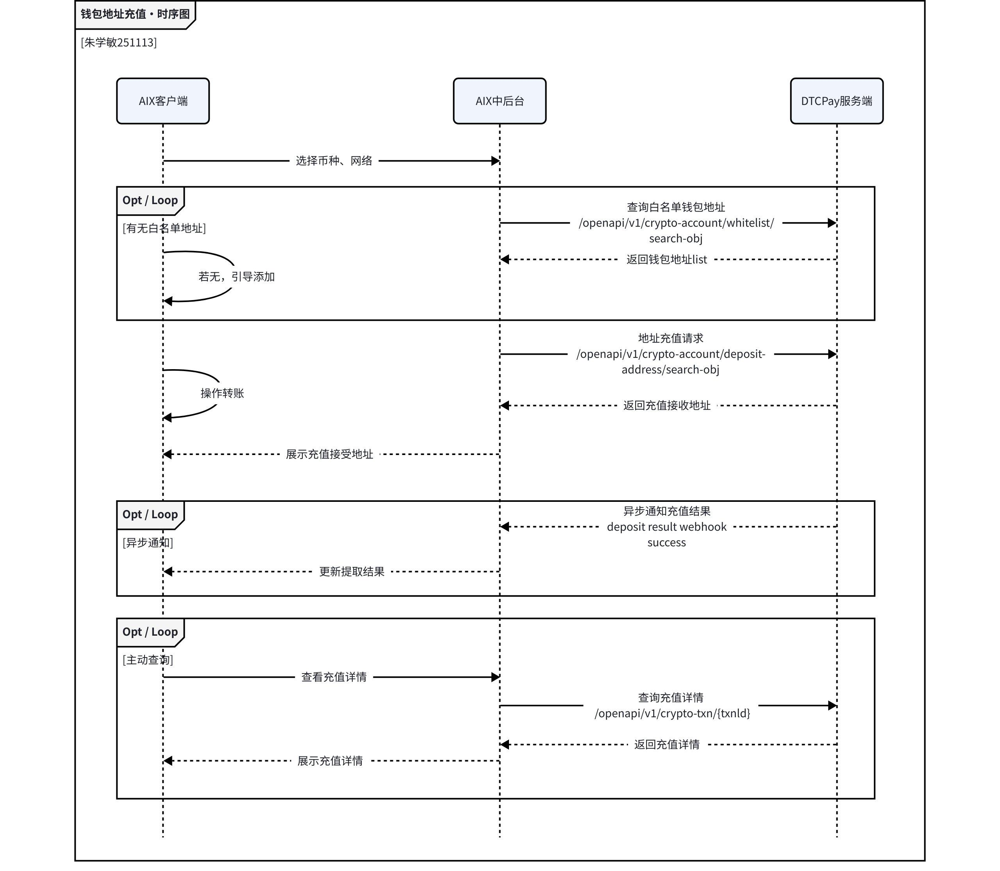

7.3.4 **接口请求**

7.3.5 **接口响应**

7.3.6 **错误码**

注：如果DTCPay接口返回当前错误码之外的其他错误，直接lark报警通知，以便产品和渠道确定后续的错误处理。

7.4 **钱包充值Wallet Connect**

7.4.1 **接口说明**

通过SDK集成DTC的WalletConnect，用户选择WC钱包后会自动添加白名单，然后链接到第三方WC钱包进行Approved后完成后续的付款。

注：如果userId和walletAddress存在，下一次create_payment_intent将不需要在7天内再次连接加密钱包。

7.4.2 **接口地址**

[Documentation dtc-nodejs-wallet-connect (ARCHIVE)](https://dtcpayoa.sg.larksuite.com/wiki/SKIawmFE9ip0gFkVZWKlTbksg7d)

7.4.3 **接口时序**

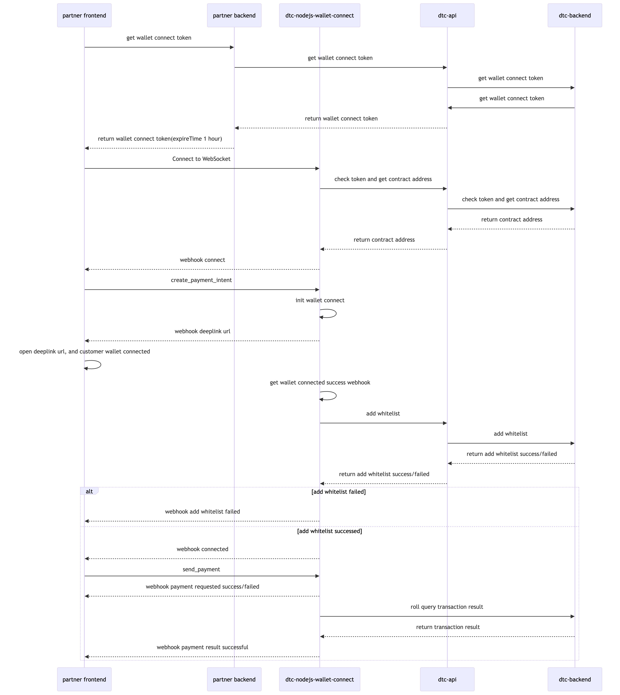

<table style="width:88%;">
<colgroup>
<col style="width: 88%" />
</colgroup>
<tbody>
<tr>
<td style="text-align: left;">
sequenceDiagram

participant pf as partner frontend 【AIX卡交易端】

participant pb as partner backend【AIX后台】

participant dfa as dtc-nodejs-wallet-connect【WC端】

participant da as dtc-api【DTC开放API】

participant db as dtc-backend【DTC后台】

【AIX卡交易端】pf-&gt;&gt;pb【AIX后台】: <strong>get wallet connect token获取钱包连接令牌</strong>

【AIX后台】pb-&gt;&gt;da【DTC开放API】: get wallet connect token获取钱包连接令牌

【DTC开放API】da-&gt;&gt;db【DTC后台】: get wallet connect token获取钱包连接令牌

【DTC后台】db-&gt;&gt;da【DTC开放API】: get wallet connect token获取钱包连接令牌

【DTC开放API】da--&gt;&gt;pb【AIX后台】: return wallet connect token返回钱包连接令牌

【AIX后台】pb--&gt;&gt;pf【AIX卡交易端】: return wallet connect token(expireTime 1 hour)返回钱包连接令牌（过期时间 1 小时）

【AIX卡交易端】pf-&gt;&gt;dfa【WC端】: <strong>Connect to WebSocket连接到WebSocket</strong>

【WC端】dfa-&gt;&gt;da【DTC开放API】: check token and get contract address检查令牌并获取合约地址

【DTC开放API】da-&gt;&gt;db【DTC后台】: check token and get contract address检查令牌并获取合约地址

【DTC后台】db--&gt;&gt;da【DTC开放API】: return contract address返回合约地址

【DTC开放API】da--&gt;&gt;dfa【WC端】: return contract address返回合约地址

【WC端】dfa--&gt;&gt;pf【AIX卡交易端】: webhook connect通知连接

【AIX卡交易端】pf-&gt;&gt;dfa【WC端】: <strong>create_payment_intent创建支付</strong>

【WC端】dfa-&gt;&gt;dfa【WC端】: init wallet connect初始化钱包连接

【WC端】dfa--&gt;&gt;pf【AIX卡交易端】: webhook deeplink url通知DeepLink url

【AIX卡交易端】pf-&gt;&gt;pf【AIX卡交易端】: open deeplink url, and customer wallet connected <strong>打开DeepLink URL且客户钱包已连接</strong>

【WC端】dfa-&gt;&gt;dfa【WC端】: get wallet connected success webhook获取钱包连接成功的回调

【WC端】dfa-&gt;&gt;da【DTC开放API】: add whitelist添加白名单

【DTC开放API】da-&gt;&gt;db【DTC后台】: add whitelist添加白名单

【DTC后台】db--&gt;&gt;da【DTC开放API】: return add whitelist success/failed返回添加白名单成功 / 失败

【DTC开放API】da--&gt;&gt;dfa【WC端】: return add whitelist success/failed返回添加白名单成功 / 失败

alt add whitelist failed添加白名单失败

【WC端】dfa--&gt;&gt;pf【AIX卡交易端】: webhook add whitelist failed通知添加白名单失败

else add whitelist successed添加白名单成功

【WC端】dfa--&gt;&gt;pf【AIX卡交易端】: webhook connected<strong>通知已连接</strong>

【AIX卡交易端】pf-&gt;&gt;dfa【WC端】: send_payment<strong>发送支付</strong>

【WC端】 dfa--&gt;&gt;pf【AIX卡交易端】: webhook payment requested success/failed通知支付请求成功 / 失败

【WC端】dfa-&gt;&gt;db【DTC后台】: roll query transaction result轮询查询交易结果

【DTC后台】 db--&gt;&gt;dfa【WC端】: return transaction result返回交易结果

【WC端】dfa--&gt;&gt;pf【AIX卡交易端】: webhook payment result successful返回交易结果成功

end
</td>
</tr>
</tbody>
</table>

7.5 **获取OTC汇率 Get OTC Rate**

7.5.1 **接口说明**

此接口用于获取获取场外交易汇率。

7.5.2 **接口地址**

\[POST\] /openapi/v1/otc/get-otc-rate

7.5.3 **接口时序**

7.5.4 **接口请求**

7.5.5 **接口响应**

7.5.6 **错误码**

注：如果DTCPay接口返回当前错误码之外的其他错误，直接lark报警通知，以便产品和渠道确定后续的错误处理。

7.6 **查询单笔加密币交易详情Get Crypto Transaction**

7.6.1 **接口说明**

此接口可根据交易ID获取单笔加密交易详细

7.6.2 **接口地址**

\[GET\] /openapi/v1/crypto-txn/{txnId}

7.6.3 **接口时序**

7.6.4 **接口请求**

7.6.5 **接口响应**

7.6.6 **错误码**

注：如果DTCPay接口返回当前错误码之外的其他错误，直接lark报警通知，以便产品和渠道确定后续的错误处理。

7.7 **业务单号查询单笔交易详情Get Crypto Transaction By ReferenceNo**

7.7.1 **接口说明**

此接口可根据业务ID获取单笔加密交易详细，如果因DTCPay没有给响应结果回调，可以通过此接口查询最新交易。

7.7.2 **接口地址**

\[GET\] /openapi/v1/crypto-txn/reference-number/{referenceNo}

7.7.3 **接口时序**

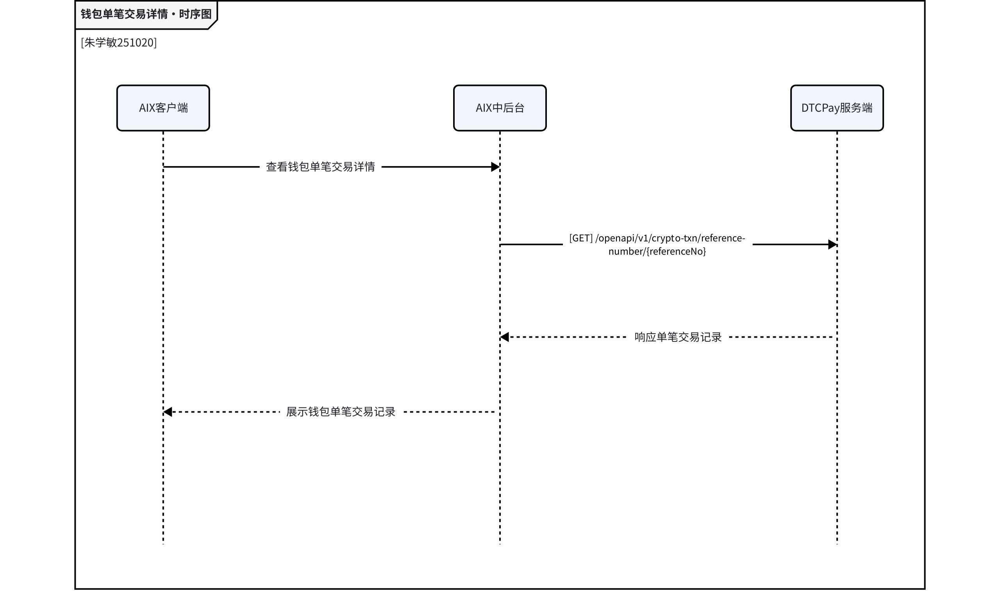

7.7.4 **接口请求**

注：请求参数包含在请求头会提交MasterAccount或SubAccount、RequestID，无其他请求字段。

7.7.5 **接口响应**

7.7.6 **错误码**

注：如果DTCPay接口返回当前错误码之外的其他错误，直接lark报警通知，以便产品和渠道确定后续的错误处理。

7.8 **Request OTC钱包兑换**

7.8.1 **接口说明**

此接口用于当前账户不同币种之间的兑换；“dtcQuoteId”是一个一次性报价标识符。一旦使用过，该标识符即失效，不能再重复使用。要重新获取新的“dtcQuoteId”，需通过调用“\[POST\] /openapi/v1/otc/get-otc-rate”来获取。

7.8.2 **接口地址：**

\[POST\] /openapi/v1/otc/request

7.8.3 **接口时序**

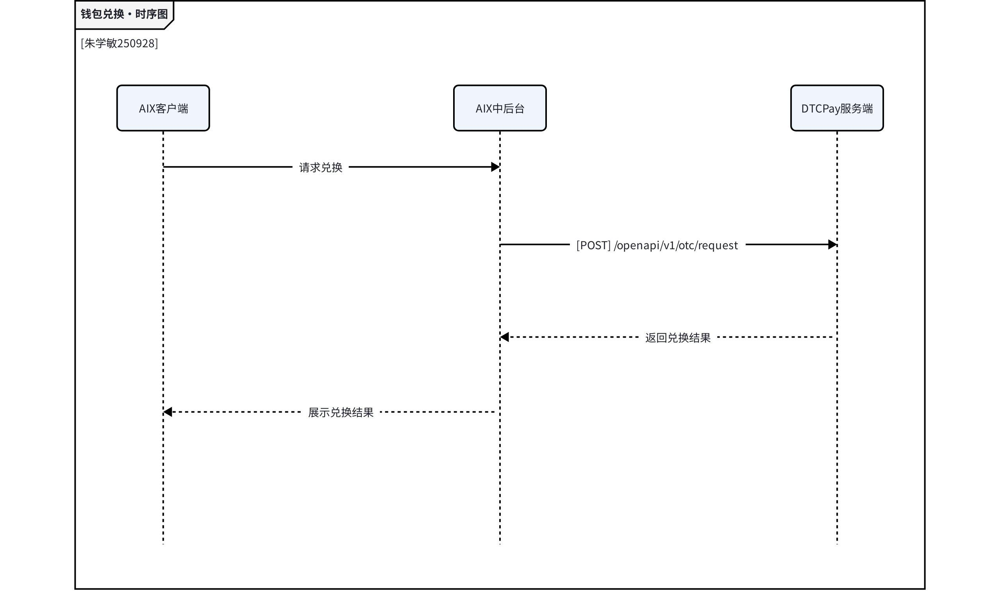

7.8.4 **接口请求**

7.8.5 **接口响应**

7.8.6 **错误码**

注：如果DTCPay接口返回当前错误码之外的其他错误，直接lark报警通知，以便产品和渠道确定后续的错误处理。

7.9 **查询OTC交易详情Get OTC Info**

7.9.1 **接口说明**

此接口通过otc_id查询场外交易详情；

7.9.2 **接口地址**

\[GET\] /openapi/v1/otc/{otc_id}

7.9.3 **接口时序**

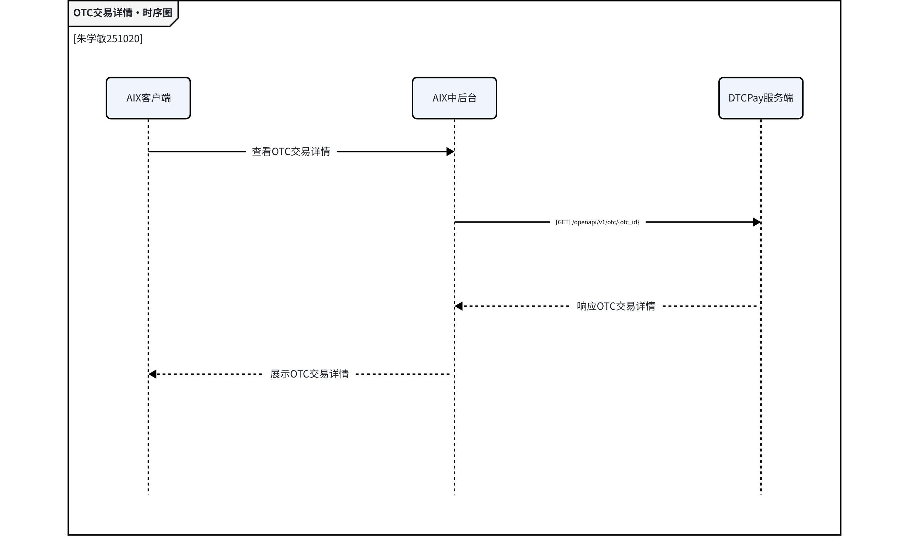

7.9.4 **接口请求**

7.9.5 **接口响应**

7.9.6 **错误码**

注：如果DTCPay接口返回当前错误码之外的其他错误，直接lark报警通知，以便产品和渠道确定后续的错误处理。

7.10 **referenceNo查询OTC交易详情Get OTC Info by Reference Number**

7.10.1 **接口说明**

此接口通过referenceNo查询场外交易详情；

7.10.2 **接口地址**

\[GET\] /openapi/v1/otc/reference-number/{referenceNo}

7.10.3 **接口时序**

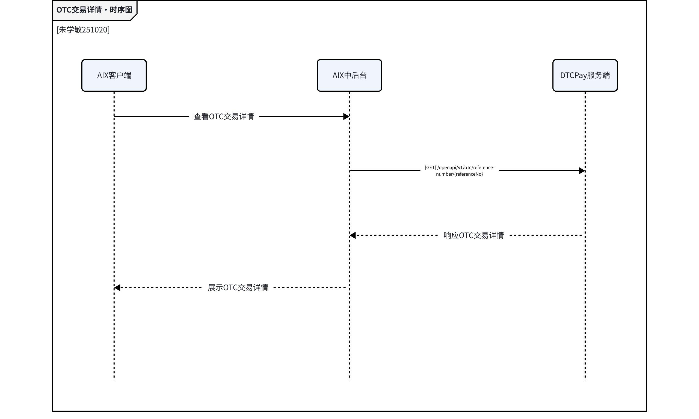

7.10.4 **接口请求**

7.10.5 **接口响应**

7.10.6 **错误码**

注：如果DTCPay接口返回当前错误码之外的其他错误，直接lark报警通知，以便产品和渠道确定后续的错误处理。

7.11 **获取全量币种钱包余额Get Wallet Account Balance**

申卡时开启了钱包余额不能为0的校验，就要调用该接口查询任一币种钱包余额大于0即可。

7.11.1 **接口说明**

此接口用于查询经过身份验证的客户所有货币的所有钱包账户余额。

7.11.2 **接口地址**

\[GET\] /openapi/v1/wallet/balances

7.11.3 **接口时序**

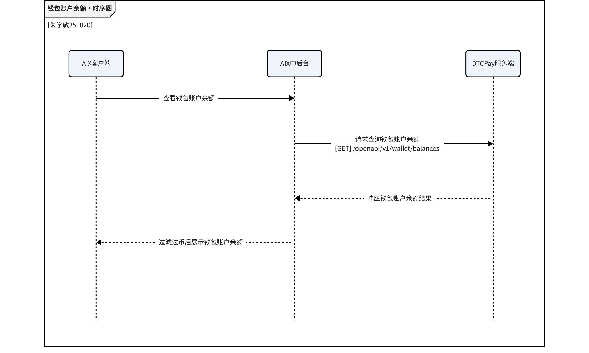

7.11.4 **接口请求**

注：请求参数包含在请求头会提交MasterAccount或SubAccount，无其他请求字段。

7.11.5 **接口响应**

7.11.6 **错误码**

注：如果DTCPay接口返回当前错误码之外的其他错误，直接lark报警通知，以便产品和渠道确定后续的错误处理。

7.12 **获取指定币种钱包余额Get Balance**

7.12.1 **接口说明**

此接口用于获取特定货币钱包的余额和场外交易限额。

7.12.2 **接口地址**

\[GET\] /openapi/v1/wallet/balance/{currency}

7.12.3 **接口时序**

7.12.4 **接口请求**

7.12.5 **接口响应**

7.12.6 **错误码**

注：如果DTCPay接口返回当前错误码之外的其他错误，直接lark报警通知，以便产品和渠道确定后续的错误处理。

# 8. 附录

8.1 **相关文档**

[AIX Card - 全局参数&字段处理](https://advancegroup.sg.larksuite.com/sheets/KvtPs3xv5hfS5wt3Q6xlPC2IgHO?sheet=6b2169)

[Documentation dtc-nodejs-wallet-connect (ARCHIVE)](https://dtcpayoa.sg.larksuite.com/wiki/SKIawmFE9ip0gFkVZWKlTbksg7d)

8.2 **需求评审**

https://advancegroup.sg.larksuite.com/minutes/obsgiyshndbtad6jlq2m6ku3
