# \[2025-11-05\]AIX-官网需求一期

**目录**

**\[同步块-无权限下载此内容\]**

# 1. 变更记录

<table style="width:89%;">
<colgroup>
<col style="width: 14%" />
<col style="width: 59%" />
<col style="width: 14%" />
</colgroup>
<tbody>
<tr>
<td style="text-align: left;">变更时间</td>
<td style="text-align: left;">变更内容</td>
<td style="text-align: left;">变更人</td>
</tr>
<tr>
<td style="text-align: left;">2025/12/3</td>
<td style="text-align: left;">
隐藏下载APP的入口

隐藏support入口

隐藏服务协议、隐私政策入口

隐藏APP二维码

隐藏社媒入口

补充faq内容
</td>
<td style="text-align: left;">@Tong Wu 吴桐</td>
</tr>
</tbody>
</table>

# 2. 需求背景

为配合公司新业务 ——AIX 加密货币交易功能卡的正式上线，现计划同步推出其专属官方网站。网站将采用简洁现代的设计风格，清晰呈现 AIX 的核心亮点与主要特色，同时重点凸显产品的安全性与便捷性，以此建立用户信任、提升品牌形象，最终为整体业务增长提供助力。

# 3. 需求概况

<table style="width:89%;">
<colgroup>
<col style="width: 12%" />
<col style="width: 76%" />
</colgroup>
<tbody>
<tr>
<td style="text-align: left;"><strong>类型</strong></td>
<td style="text-align: left;">链接</td>
</tr>
<tr>
<td style="text-align: left;">PM</td>
<td style="text-align: left;">@Bing Han 韩冰</td>
</tr>
<tr>
<td style="text-align: left;">需求方</td>
<td style="text-align: left;">@Tong Wu 吴桐</td>
</tr>
<tr>
<td style="text-align: left;">UI/UX</td>
<td style="text-align: left;"></td>
</tr>
<tr>
<td style="text-align: left;">前端</td>
<td style="text-align: left;">@Bingliang Hu 胡秉亮</td>
</tr>
<tr>
<td style="text-align: left;">服务端</td>
<td style="text-align: left;"></td>
</tr>
<tr>
<td style="text-align: left;">测试</td>
<td style="text-align: left;"></td>
</tr>
<tr>
<td style="text-align: left;">Figma</td>
<td style="text-align: left;"><strong>[该类型的内容暂不支持下载]</strong></td>
</tr>
<tr>
<td style="text-align: left;">BRD</td>
<td style="text-align: left;"><a href="https://advancegroup.sg.larksuite.com/docx/HsKZdFaK7oXcJdxLcCCl7foggSJ?from=from_copylink">[BRD] AIX网站首页布局及内容（9.12</a></td>
</tr>
<tr>
<td style="text-align: left;">期望上线时间</td>
<td style="text-align: left;">2025/11？？？</td>
</tr>
<tr>
<td style="text-align: left;">Meggle</td>
<td style="text-align: left;"><a href="https://project.larksuite.com/atome_agile/story/detail/8846363?parentUrl=/atome_agile/story/homepage&amp;openScene=4">[Feature]AIX website</a></td>
</tr>
<tr>
<td style="text-align: left;">关联域PRD</td>
<td style="text-align: left;"></td>
</tr>
<tr>
<td style="text-align: left;">历史需求PRD</td>
<td style="text-align: left;"><a href="https://advancegroup.sg.larksuite.com/wiki/V4ElwHmoSiETOTkOFwVlxDUXgrf">AIX官网需求1.0</a></td>
</tr>
<tr>
<td style="text-align: left;">技术方案</td>
<td style="text-align: left;"></td>
</tr>
<tr>
<td style="text-align: left;">pc/移动端</td>
<td style="text-align: left;">目前仅有pc端</td>
</tr>
<tr>
<td style="text-align: left;">官网链接</td>
<td style="text-align: left;">https://www.aixpay.co/</td>
</tr>
<tr>
<td style="text-align: left;">官网语言切换</td>
<td style="text-align: left;">
AU（EN）

PH（EN）

VN（Việt Nam）
</td>
</tr>
<tr>
<td style="text-align: left;">Others</td>
<td style="text-align: left;"><a href="https://advancegroup.sg.larksuite.com/docx/R3pQdi7HeouFHYx3VL8l1blbg8d">AIX知识库</a></td>
</tr>
</tbody>
</table>

# 4. 需求优先级

<table style="width:89%;">
<colgroup>
<col style="width: 19%" />
<col style="width: 20%" />
<col style="width: 22%" />
<col style="width: 17%" />
<col style="width: 9%" />
</colgroup>
<tbody>
<tr>
<td style="text-align: left;">页面</td>
<td style="text-align: left;">Module</td>
<td style="text-align: left;">图</td>
<td style="text-align: left;">优先级</td>
<td style="text-align: left;">备注</td>
</tr>
<tr>
<td rowspan="9" style="text-align: left;">
Homepage

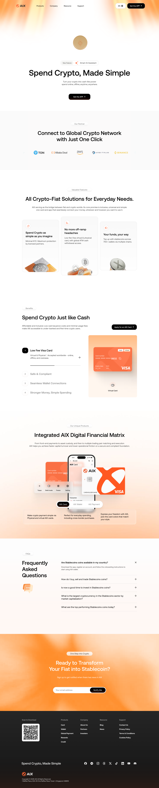
</td>
<td style="text-align: left;">Navigation</td>
<td style="text-align: center;"></td>
<td style="text-align: left;">一期（11月底）</td>
<td style="text-align: left;"></td>
</tr>
<tr>
<td style="text-align: left;">Introduce</td>
<td style="text-align: center;">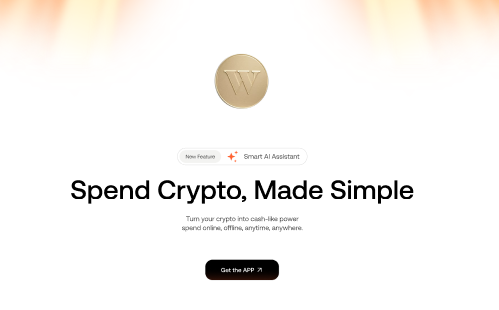</td>
<td style="text-align: left;">一期（11月底）</td>
<td style="text-align: left;"></td>
</tr>
<tr>
<td style="text-align: left;">Global Network</td>
<td style="text-align: center;"></td>
<td style="text-align: left;">一期（11月底）</td>
<td style="text-align: left;"></td>
</tr>
<tr>
<td style="text-align: left;">Features</td>
<td style="text-align: center;">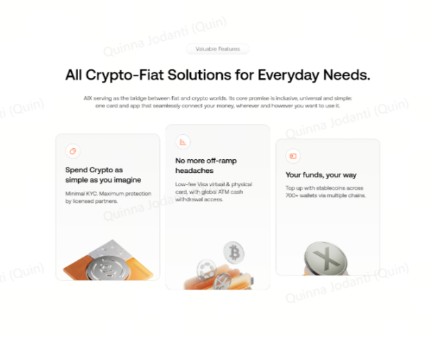</td>
<td style="text-align: left;">一期（11月底）</td>
<td style="text-align: left;"></td>
</tr>
<tr>
<td style="text-align: left;">Benefits</td>
<td style="text-align: center;"></td>
<td style="text-align: left;">一期（11月底）</td>
<td style="text-align: left;"></td>
</tr>
<tr>
<td style="text-align: left;">USP</td>
<td style="text-align: center;">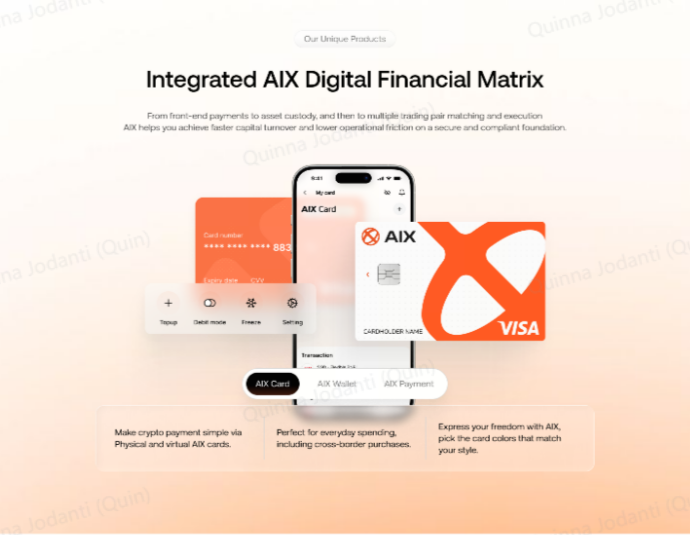</td>
<td style="text-align: left;">一期（11月底）</td>
<td style="text-align: left;"></td>
</tr>
<tr>
<td style="text-align: left;">Frequently Asked Questions</td>
<td style="text-align: center;">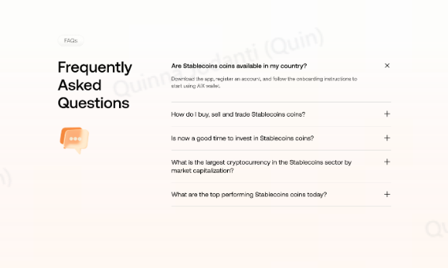</td>
<td style="text-align: left;">一期（11月底）</td>
<td style="text-align: left;"></td>
</tr>
<tr>
<td style="text-align: left;">Email subscription</td>
<td style="text-align: center;"></td>
<td style="text-align: left;">二期</td>
<td style="text-align: left;"></td>
</tr>
<tr>
<td style="text-align: left;">Footer</td>
<td style="text-align: center;">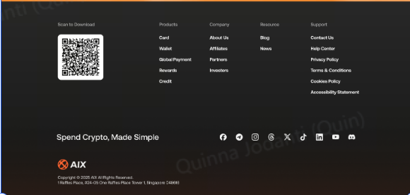</td>
<td style="text-align: left;">一期（11月底）</td>
<td style="text-align: left;"></td>
</tr>
<tr>
<td style="text-align: left;">二级页面-card</td>
<td style="text-align: left;"></td>
<td style="text-align: left;"></td>
<td style="text-align: left;">一期（11月底）</td>
<td style="text-align: left;"></td>
</tr>
<tr>
<td style="text-align: left;">二级页面-Wallet Page</td>
<td style="text-align: left;"></td>
<td style="text-align: left;"></td>
<td style="text-align: left;">一期（11月底）</td>
<td style="text-align: left;"></td>
</tr>
<tr>
<td style="text-align: left;">二级页面- About Us Page</td>
<td style="text-align: left;"></td>
<td style="text-align: left;"></td>
<td style="text-align: left;">一期（11月底）</td>
<td style="text-align: left;"></td>
</tr>
<tr>
<td style="text-align: left;">二级页面-Help Center Page</td>
<td style="text-align: left;"></td>
<td style="text-align: left;"></td>
<td style="text-align: left;">一期（11月底）</td>
<td style="text-align: left;"></td>
</tr>
<tr>
<td style="text-align: left;">二级页面- Blog Page</td>
<td style="text-align: left;"></td>
<td style="text-align: left;"></td>
<td style="text-align: left;">二期</td>
<td style="text-align: left;"></td>
</tr>
<tr>
<td style="text-align: left;">二级页面- News Page</td>
<td style="text-align: left;"></td>
<td style="text-align: left;"></td>
<td style="text-align: left;">二期</td>
<td style="text-align: left;"></td>
</tr>
<tr>
<td style="text-align: left;">二级页面-Payment Page</td>
<td style="text-align: left;"></td>
<td style="text-align: left;"></td>
<td style="text-align: left;">二期</td>
<td style="text-align: left;"></td>
</tr>
</tbody>
</table>

# 5. 需求描述

5.1 **Homepage**

官网线上地址：https://www.aixpay.co/

<table style="width:89%;">
<colgroup>
<col style="width: 17%" />
<col style="width: 16%" />
<col style="width: 38%" />
<col style="width: 16%" />
</colgroup>
<tbody>
<tr>
<td style="text-align: left;"><strong>页面</strong></td>
<td style="text-align: left;"><strong>模块</strong></td>
<td style="text-align: left;"><strong>具体描述</strong></td>
<td style="text-align: left;">越南语版本</td>
</tr>
<tr>
<td rowspan="9" style="text-align: center;"></td>
<td style="text-align: left;">
PC端导航栏

移动端导航栏（参考样式）

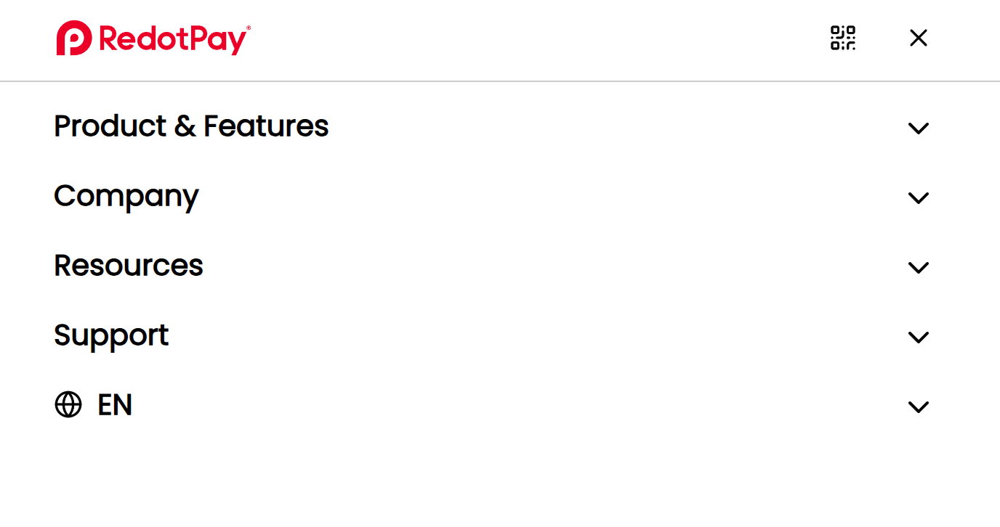
</td>
<td style="text-align: left;">
<strong>Module：导航栏</strong>

<strong>PC端显示：</strong>

显示AIX logo+AIX

导航栏始终固定在页面顶部，确保在页面滚动时用户仍可便捷操作。

一级导航Card，点击跳转至二级页面，链接：https://www.aixpay.co/card

一级导航Wallet，点击跳转至二级页面，链接：https://www.aixpay.co/wallet

一级导航Company，点击跳转至二级页面，链接：https://www.aixpay.co/about-us

一级导航Get help，点击跳转至二级页面，链接：https://www.aixpay.co/help/，需CS团队提供，待跟进。

<del><strong>【待确认】</strong>一级导航Resource，二期增加。当鼠标悬停在该导航时，显示下拉栏：</del>

<del>News, 二期增加。</del>

<del>Blog, 二期增加。</del>

多语言切换，选项显示EN、VN。默认语言为EN。

Get the App <strong>按钮</strong>

鼠标悬停在该位置时，鼠标悬浮弹出下载二维码。二维码请预留位置，待上线前给到。

交互： 
页面在非首屏时，向上滑动，则显示navigation bar，方便用户快速点击。

<strong>移动端显示：</strong>

显示Get App的首屏置顶悬浮banner，点击Get App button，则跳转商店下载页。链接待上线前给到。

用户点击关闭，则不显示banner。下次再次进入，继续显示。

显示AIX logo +AIX

显示AIX下载的二维码，点击二维码图标，则跳转商店下载页。链接待上线前给到。

显示更多，点击更多，则展开/收起抽屉。显示：

Card，点击跳转至二级页面。链接：https://www.aixpay.co/card

Wallet，点击跳转至二级页面。链接：https://www.aixpay.co/wallet

Company，点击跳转至二级页面。链接：https://www.aixpay.co/about-us

Get help，点击跳转至二级页面。链接：https://www.aixpay.co/help/
</td>
<td style="text-align: left;">
<strong>Thẻ</strong>

Ví

<strong>Công ty</strong>

<strong>Trợ giúp</strong>

<strong>CTA:</strong> Tải ứng dụng
</td>
</tr>
<tr>
<td style="text-align: left;">
介绍

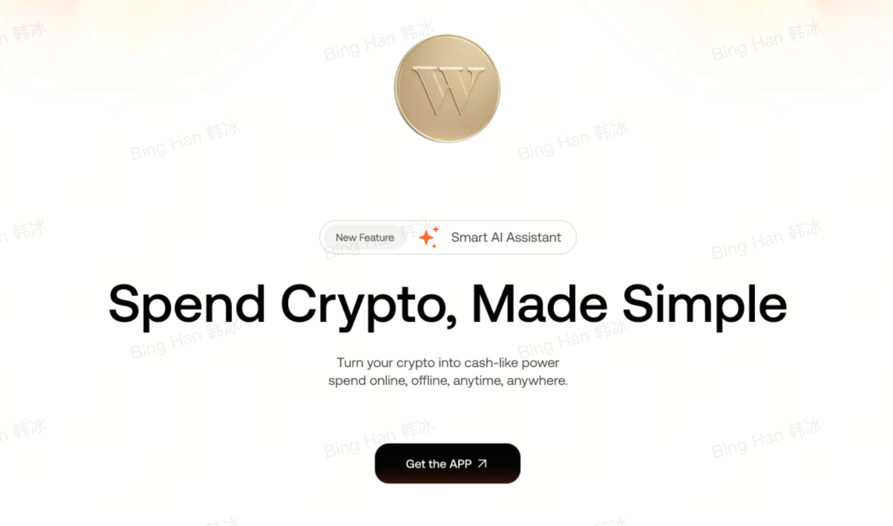
</td>
<td style="text-align: left;">
<strong>Module：介绍</strong>

显示：

硬币部分为Lottie/gif等格式的动态效果。

Title: <strong>Spend Crypto, Made Simple.</strong>

Body: Turn your crypto into cash-like power — spend it online, offline, anytime, anywhere.

下载APP：

<strong>PC端：</strong>Get the APP<strong>按钮</strong>, 点击/鼠标悬停弹出下载二维码。二维码请预留位置，待上线前给到。

<strong>移动端：</strong>不显示Get the APP<strong>按钮。</strong>
</td>
<td style="text-align: left;">
<strong>Title:</strong> Chi tiêu tiền mã hóa dễ dàng

<strong>Body:</strong> Chuyển đổi tiền mã hóa sang tiền mặt. Chi tiêu trực tuyến, ngoại tuyến, mọi lúc, mọi nơi.

<strong>CTA:</strong> Tải ứng dụng
</td>
</tr>
<tr>
<td style="text-align: left;">
Global Network

</td>
<td style="text-align: left;">
<strong>Module：Global Network</strong>

tag： Our Partner

显示：

Title: <strong>Connect to Global Crypto Networks in Just One Click</strong>

钱包图标(依次排序：Binance Wallet，OKX Wallet，Bybit Wallet，Trust Wallet，Bitget wallet，Metamask，

Bitcoin.com Wallet，Bifrost Wallet，Robinhood，BitPay Wallet，Base(Coinbase Wallet)，Fireblocks，Ledger Live，Blockchain.com，Trezor Suite)，图标可见：https://walletguide.walletconnect.network

<table style="width:36%;">
<colgroup>
<col style="width: 10%" />
<col style="width: 11%" />
<col style="width: 6%" />
<col style="width: 6%" />
</colgroup>
<tbody>
<tr>
<td style="text-align: center;"></td>
<td style="text-align: center;"></td>
<td style="text-align: center;"></td>
<td style="text-align: center;">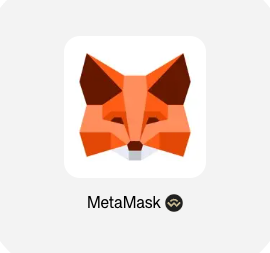</td>
</tr>
</tbody>
</table>
<table style="width:36%;">
<colgroup>
<col style="width: 11%" />
<col style="width: 5%" />
<col style="width: 5%" />
<col style="width: 6%" />
<col style="width: 6%" />
</colgroup>
<tbody>
<tr>
<td style="text-align: center;">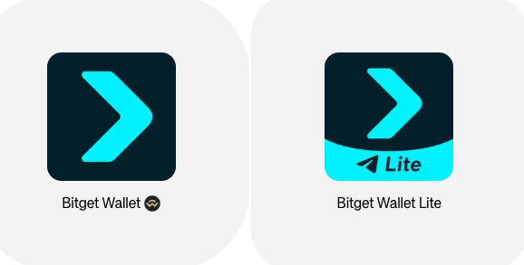</td>
<td style="text-align: center;"></td>
<td style="text-align: center;"></td>
<td style="text-align: center;"></td>
<td style="text-align: center;">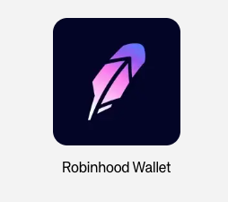</td>
</tr>
</tbody>
</table>
<table style="width:36%;">
<colgroup>
<col style="width: 5%" />
<col style="width: 6%" />
<col style="width: 5%" />
<col style="width: 5%" />
<col style="width: 5%" />
<col style="width: 6%" />
</colgroup>
<tbody>
<tr>
<td style="text-align: center;">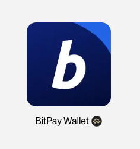</td>
<td style="text-align: center;">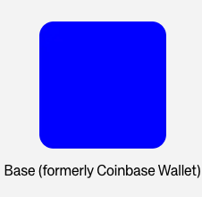</td>
<td style="text-align: center;"></td>
<td style="text-align: center;"></td>
<td style="text-align: center;"></td>
<td style="text-align: center;">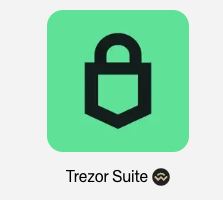</td>
</tr>
</tbody>
</table></td>
<td style="text-align: left;">
<strong>Tag:</strong> Đối tác uy tín

<strong>Title:</strong>

Kết nối mạng lưới tiền mã hóa toàn

cầu chỉ với một lần chạm
</td>
</tr>
<tr>
<td style="text-align: left;">
Features

</td>
<td style="text-align: left;">
<strong>Module：Your Crypto Hub</strong>

Tag: Valuable Features

Title: All-in-One Everyday Crypto-Fiat Payments

Sub-title: AIX bridges the gap between crypto and fiat. One card, one app, and seamless access to your money wherever and however you want to use it.

Feature:

<strong>Simple and secure</strong>

Verify your identity in just a few steps with facial recognition and KYC.

<strong>Spend your way</strong>

Manage and spend your funds anytime, anywhere.

<strong>Trusted and stable</strong>

AIX partners with licensed VASPs to safeguard your crypto.
</td>
<td style="text-align: left;">
<strong>Tag:</strong> Trung tâm tiền mã hóa của bạn

<strong>Title:</strong> Giải pháp thanh toán tiền mã hóa và tiền pháp định đa năng mọi lúc, mọi nơi

<strong>Sub-title</strong>: AIX kết nối tiền mã hóa và tiền pháp định. Chỉ với một thẻ, một ứng dụng, bạn có thể sử dụng tiền của mình mọi lúc, mọi nơi theo cách bạn muốn.

<strong>Tính năng:</strong>

<strong>Đơn giản và bảo mật</strong>

Xác minh danh tính chỉ trong vài bước với nhận dạng khuôn mặt và KYC.

<strong>Chi tiêu theo cách của bạn</strong>

Quản lý và sử dụng tiền của bạn mọi lúc, mọi nơi.

<strong>Tin cậy và ổn định</strong>

AIX hợp tác với các VASP được cấp phép để bảo vệ tài sản tiền mã hóa của bạn.
</td>
</tr>
<tr>
<td style="text-align: left;">
Benefits

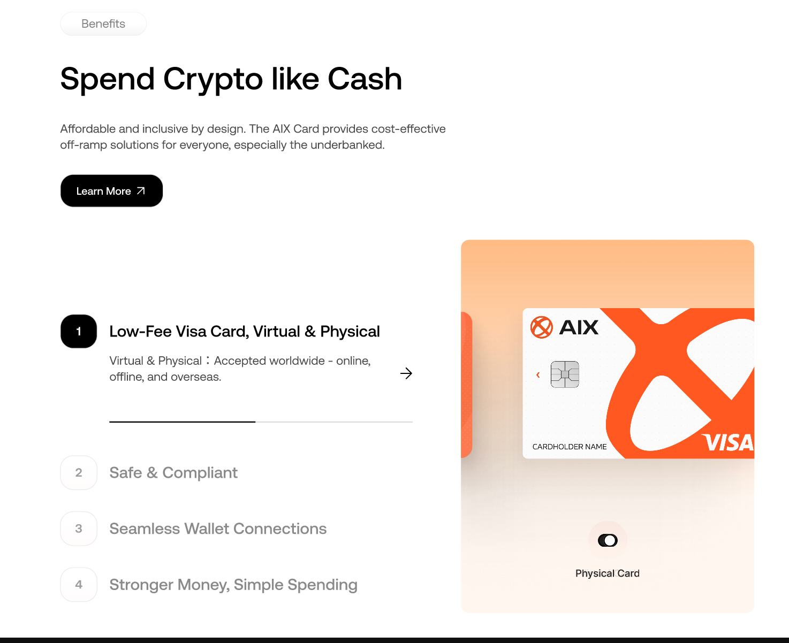
</td>
<td style="text-align: left;">
<strong>Module : AIX Card</strong>

Title: <strong>Spend Crypto Like Cash</strong>

Sub-title: Affordable and inclusive by design. The AIX Card provides cost-effective off-ramp solutions for everyone, especially the underbanked.

<del>Apply for an AIX Card <strong>按钮</strong>, [PC]鼠标悬浮弹出下载二维码, 【H5】点击，跳转商店下载页</del>

Benefit： (左边)

文案：

<strong>Low-Fee Visa Card：Available in both virtual and physical cards. Accepted worldwide: online, in-store, and overseas.</strong>

<strong>Safe and Compliant：</strong>Minimal KYC, maximum protection by licensed partners.

<strong>Seamless Wallet Connections:</strong> Top up with stablecoins from 700+ wallets across multiple chains.

<strong>Stronger Money, Simpler Spending:</strong> USD-backed stablecoins protect your value from currency volatility.

点击交互:

每5秒自动轮播，进度条按轮播进度切换展示

鼠标hover切换

展示卡设计，包括实物卡和虚拟卡两种样式。

默认显示虚拟卡样式，可以切换至实物卡样式。

增加显示一个【learn More】button，点击后进入card页面。

注意UI图需考虑移动端显示效果。
</td>
<td style="text-align: left;">
<strong>Tag:</strong> Thẻ AIX

<strong>Title:</strong> Chi tiêu tiền mã hóa như tiền mặt

<strong>Sub-title:</strong> Thiết kế tiết kiệm và toàn diện. Thẻ AIX cung cấp giải pháp chuyển đổi hiệu quả về chi phí cho mọi người, đặc biệt là những người chưa được tiếp cận dịch vụ ngân hàng.

<strong>Lợi ích:</strong>

<strong>Thẻ Visa phí thấp</strong>

Có sẵn thẻ ảo và thẻ vật lý. Chấp nhận toàn cầu: trực tuyến, các cửa hàng và nước ngoài.

<strong>An toàn và tuân thủ</strong>

KYC tối giản, bảo vệ tối đa nhờ các đối tác được cấp phép.

<strong>Kết nối ví liền mạch</strong>

Nạp tiền bằng stablecoin từ hơn 700 ví trên nhiều blockchain.

<strong>Tiền vững mạnh, chi tiêu đơn giản</strong>

Stablecoin được hỗ trợ bằng USD giúp giữ giá trị trước sự biến động tiền tệ.
</td>
</tr>
<tr>
<td style="text-align: left;">
USP

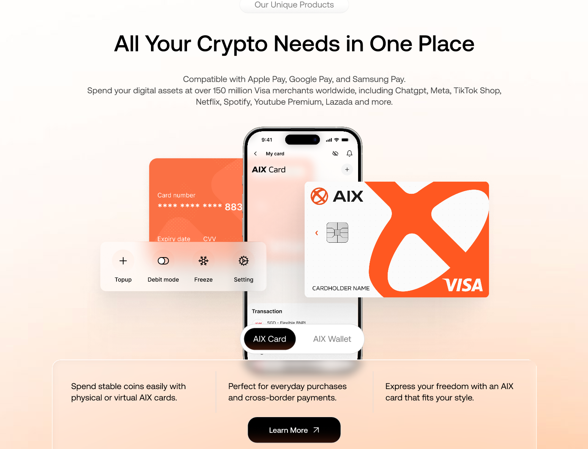
</td>
<td style="text-align: left;">
<strong>Module ：Complete Crypto Solutions</strong>

Title: All Your Crypto Needs in One Place

Sub-title:

Compatible with Apple Pay, Google Pay, and Samsung Pay.

Spend your digital assets at over 150 million Visa merchants worldwide, including Chatgpt, Meta, TikTok Shop, Netflix, Spotify, Youtube Premium, Lazada and more.

展示卡配图

AIX Card<strong>按钮 ，</strong>支持手动切换至wallet

Spend stablecoins easily with physical or virtual AIX cards.

Perfect for everyday purchases and cross-border payments.

Express your freedom with an AIX card that fits your style.

显示【learn More】入口，点击跳转至Card页面。

AIX Wallet<strong>按钮</strong>，支持手动切换至Card

Send and receive crypto to your AIX wallet securely in just a few clicks.

Connect seamlessly to 700+ wallets across 150+ blockchains.

Swap between 15+ major fiat currencies and stablecoins, including USD, SGD, USDT, and USDC.

显示【learn More】入口，点击跳转至Wallet页面。

注意UI图需考虑移动端显示效果。
</td>
<td style="text-align: left;">
<strong>Tag: Giải pháp tiền mã hóa toàn diện</strong>

<strong>Title：Mọi nhu cầu tiền mã hóa tại một nơi</strong>

<strong>Sub-title:</strong>

Tương thích với Apple Pay, Google Pay và Samsung Pay.

Chi tiêu tài sản kỹ thuật số của bạn tại hơn 150 triệu cửa hàng chấp nhận Visa trên toàn thế giới, bao gồm Chatgpt, Meta, TikTok Shop, Netflix, Spotify, Youtube Premium và Lazada.

<strong>Thẻ AIX</strong>

Chi tiêu stablecoin dễ dàng với thẻ AIX vật lý hoặc ảo.

Hoàn hảo cho giao dịch mua sắm hàng ngày và thanh toán xuyên biên giới.

Thể hiện phong cách tự do của bạn với thẻ AIX phù hợp cá tính.

<strong>Ví AIX</strong>

Gửi và nhận tiền mã hóa vào ví AIX an toàn chỉ với vài lần chạm.

Kết nối liền mạch với hơn 700 ví trên hơn 150 chuỗi blockchain.

Hoán đổi giữa 15+ loại tiền pháp định chính và stablecoin, bao gồm USD, SGD, USDT và USDC.
</td>
</tr>
<tr>
<td style="text-align: left;">
Frequently Asked Questions

</td>
<td style="text-align: left;">
<strong>Module: FAQs</strong>

Title: <strong>Frequently Asked Questions</strong>

Questions (展示3个)：前端固定写死三个。待@Tong Wu 吴桐提供。<strong>button</strong> 若未展开展示+，否则展示-。点击-, 收起答案。

What is AIX?

<blockquote>

Access. Inclusion. Xtraordinary.

AIX makes using digital assets as easy as a debit card, from sign-up to checkout, without the usual crypto complexity.

</blockquote>

How do I get started? 
Download the AIX app, enter the email address to register, input the 4-digit code from the verification email, then create and confirm the secure password.

Is AIX safe?

<blockquote>

Yes, AIX uses advanced security measures to protect your funds and personal information. Minimal KYC, maximum protection by licensed partners.

</blockquote>

默认展开第一个question
</td>
<td style="text-align: left;">
<strong>Tag:</strong> Câu hỏi thường gặp

<strong>Title:</strong> Câu hỏi thường gặp

◦ <strong>AIX là gì?</strong> 
Access. Inclusion. Xtraordinary.

AIX mang đến giải pháp sử dụng tài sản số một cách đơn giản và thuận tiện như thẻ ghi nợ, cho phép người dùng thực hiện toàn bộ hành trình từ đăng ký đến thanh toán mà không gặp phải những quy trình phức tạp thường thấy trong lĩnh vực tiền mã hóa.

◦ <strong>Làm thế nào để bắt đầu?</strong> 
Tải ứng dụng AIX, nhập email để đăng ký, nhập mã 4 chữ số được gửi qua email xác minh, sau đó tạo và xác nhận mật khẩu bảo mật.

◦ <strong>AIX có an toàn không?</strong> 
Có. AIX áp dụng các biện pháp bảo mật tiên tiến nhằm bảo vệ tài sản và thông tin cá nhân của người dùng. Quy trình KYC được tối giản, trong khi mức độ an toàn được bảo đảm thông qua các đối tác được cấp phép và tuân thủ theo các tiêu chuẩn bảo mật cao nhất.
</td>
</tr>
<tr>
<td style="text-align: left;">
Email subscription

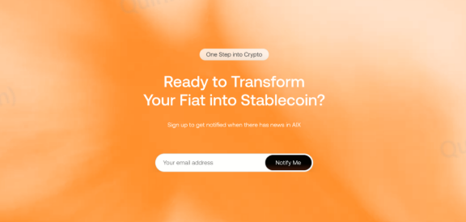
</td>
<td style="text-align: left;">二期需求，本期不涉及</td>
<td style="text-align: left;"></td>
</tr>
<tr>
<td style="text-align: left;">
Footer

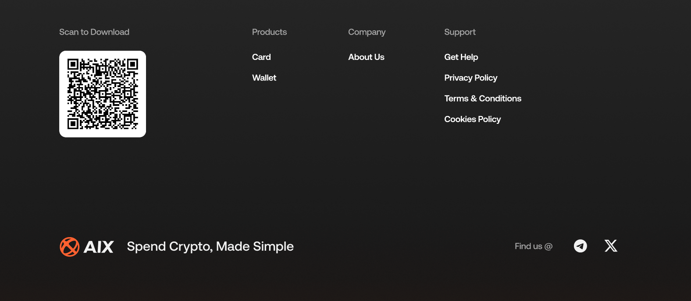

</td>
<td style="text-align: left;">
<strong>Module：Footer</strong>

<strong>PC端样式：</strong>

Get the App, 展示下载二维码

Product Sevice

Card, 点击跳转https://www.aixpay.co/card页面

Wallet, 点击跳转https://www.aixpay.co/wallet页面

Company

About Us, 点击跳转https://www.aixpay.co/about-us页面

Resources，（二期需求）

Blog，（二期需求）

News，（二期需求）

Support

Get help，点击跳转help页面，需CS团队提供，待跟进

Privacy Policy, 点击跳转https://www.aixpay.co/privacy-policy页面，待定

Terms and Conditions, 点击跳转https://www.aixpay.co/terms-and-conditions页面，待定

展示社媒icon，根据点击icon跳转到媒体网站-aix主页：x和tele。

AIX Card - Spend Crypto, Made Simple, 展示aix商标图案。

<strong>移动端样式：</strong>

显示AIXlogo+AIX名称

副标题：Spend Crypto, Made Simple

Product Sevice，默认收起。点击可展开/收起。展开后显示：

Card, 点击跳转https://www.aixpay.co/card页面

Wallet, 点击跳转https://www.aixpay.co/wallet页面

Company，默认收起。点击可展开/收起。展开后显示：

About Us, 点击跳转https://www.aixpay.co/about-us页面

Support，默认收起。点击可展开/收起。展开后显示：

Help，点击跳转help页面，需CS团队提供，待跟进

Privacy Policy, 点击跳转https://www.aixpay.co/privacy-policy页面，待定

Terms and Conditions, 点击跳转https://www.aixpay.co/terms-and-conditions页面，待定

显示Get the App的button, 点击Get App button，则跳转商店下载页。链接待上线前给到。

展示社媒icon，根据点击icon跳转到媒体网站：x和tele，待定。点击后唤起对应的APP-aix主页，需技术判断实现方式。
</td>
<td style="text-align: left;">
<strong>Nhận thẻ AIX của bạn</strong>

<strong>Sản phẩm</strong>

Thẻ

Ví

<strong>Công ty</strong>

Giới thiệu

<strong>Tài nguyên</strong>

Blog

Tin tức

<strong>Hỗ trợ</strong>

Trợ giúp

Chính sách bảo mật

Điều khoản và điều kiện
</td>
</tr>
</tbody>
</table>

5.2 **二级页面-Card Page**

链接： https://www.aixpay.co/card

核心定位：推卡→ 核心功能、权益、虚拟/实体卡

<table style="width:89%;">
<colgroup>
<col style="width: 17%" />
<col style="width: 18%" />
<col style="width: 31%" />
<col style="width: 21%" />
</colgroup>
<tbody>
<tr>
<td style="text-align: left;"><strong>页面UI</strong></td>
<td style="text-align: left;"><strong>模块</strong></td>
<td style="text-align: left;"><strong>具体描述</strong></td>
<td style="text-align: left;">越南语版本</td>
</tr>
<tr>
<td rowspan="8" style="text-align: center;"></td>
<td style="text-align: left;">
导航栏

</td>
<td style="text-align: left;">
Entrance：

在Homepage页面操作，

点击<strong>顶部导航栏-【Card】</strong>

点击<strong>Benefits -【Learn More】</strong>

点击<strong>Our Unique Products--AIX Card--【Learn More】</strong>

点击<strong>Footer-Product Sevice-【Card】</strong>

Exit：

点击左上角AIX图标，则跳转至HomePage

PC端：顶部导航栏与Homepage页面保持一致。 
页面在非首屏时，向上滑动，则显示navigation bar，方便用户快速点击。

移动端：

显示Get App的首屏置顶悬浮banner，点击Get App button，则跳转商店下载页。链接待上线前给到。

用户点击关闭，则不显示banner。下次再次进入，继续显示。

其他与移动端Homepage页面保持一致。
</td>
<td style="text-align: left;"></td>
</tr>
<tr>
<td style="text-align: left;">
banner

</td>
<td style="text-align: left;">
<strong>Module：banner</strong>

显示：

Tag: AIX Card

title: Spend Crypto Like Cash

Subtag: supported by DTCpay

Body:

Accepted at over 150 million Visa merchants worldwide.

Available as virtual or physical cards to suit your needs.

下载APP：

<strong>PC端：Get Your AIX Card Now按钮</strong>, 点击/鼠标悬停弹出下载二维码。二维码请预留位置，待上线前给到。

<strong>移动端：Get Your AIX Card Now按钮,</strong>点击Get App button，则跳转商店下载页。链接待上线前给到。

UI图需调整
</td>
<td style="text-align: left;">
<strong>Tag:</strong> Thẻ AIX

<strong>Title:</strong> Chi tiêu tiền mã hóa như tiền mặt

Subtag: được hỗ trợ bởi DTCpay

Được sử dụng tại hơn 150 triệu cửa hàng chấp nhận Visa trên toàn thế giới.

Có sẵn thẻ ảo hoặc thẻ vật lý, phù hợp với nhu cầu của bạn.

<strong>CTA:</strong> Nhận thẻ AIX của bạn
</td>
</tr>
<tr>
<td style="text-align: left;">
卡介绍

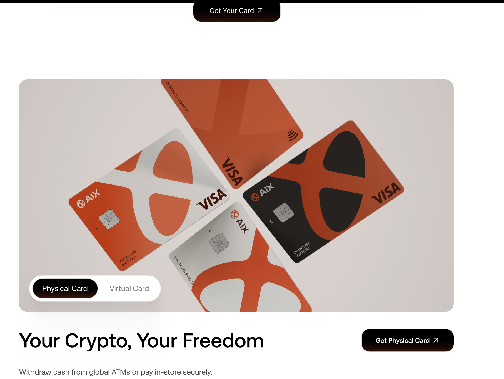
</td>
<td style="text-align: left;">
<strong>Module：Physical Card&amp;Virtual Card</strong>

显示：

默认显示<strong>Physical Car</strong>d，点击可以切换至<strong>Virtual Card</strong>

Physical Card ：

Title: Your Crypto, Your Freedom

Body:

Withdraw cash from global ATMs or pay in-store securely.

Make it yours - choose from 3 custom card designs.

Virtual Card:

Title: <strong>Crypto, Just a Tap Away</strong>

Body:

Get verified in minutes and start spending instantly.

Pay for your subscriptions, travel expenses, daily payments and more.

Compatible with Apple Pay, Google Pay and Samsung Pay.

下载APP：

<strong>PC端：Get Your Card Now按钮</strong>, 点击/鼠标悬停弹出下载二维码。二维码请预留位置，待上线前给到。

<strong>移动端：Get Your Card Now按钮,</strong>点击Get App button，则跳转商店下载页。链接待上线前给到。
</td>
<td style="text-align: left;">
<strong>Tag:</strong> Thẻ vật lý

<strong>Title:</strong> Tiền mã hóa của bạn, tự do của bạn

Rút tiền mặt tại các máy ATM toàn cầu hoặc thanh toán an toàn tại cửa hàng.

Tạo phong cách riêng - chọn từ 3 thiết kế thẻ tùy chỉnh.

<strong>CTA:</strong> Nhận thẻ AIX của bạn

<strong>Tag:</strong> Thẻ ảo

<strong>Title:</strong> Tiền mã hóa, chỉ một chạm

Xác minh trong vài phút và bắt đầu chi tiêu ngay lập tức.

Thanh toán cho các dịch vụ đăng ký gói, chi phí du lịch, chi tiêu hàng ngày và nhiều hơn nữa.

Tương thích với Apple Pay, Google Pay và Samsung Pay.

<strong>CTA:</strong> Nhận thẻ AIX của bạn
</td>
</tr>
<tr>
<td style="text-align: left;">
Security&amp;Trust

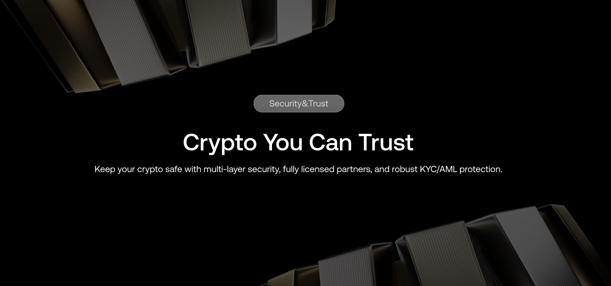
</td>
<td style="text-align: left;">
<strong>Module： Security&amp;Trust</strong>

title：Crypto You Can Trust

Sub-title：Keep your crypto safe with multi-layer security, fully licensed partners, and robust KYC/AML protection.

UI图更新
</td>
<td style="text-align: left;">
<strong>Title:</strong> Tiền mã hóa đáng tin cậy

Giữ tiền mã hóa của bạn an toàn với bảo mật nhiều lớp, các đối tác được cấp phép đầy đủ và bảo vệ KYC/AML mạnh mẽ.
</td>
</tr>
<tr>
<td style="text-align: left;">
Features

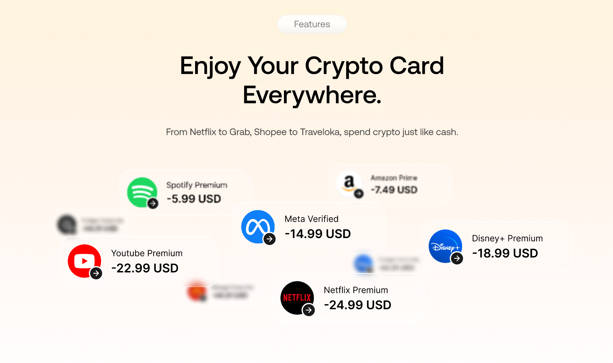
</td>
<td style="text-align: left;">
<strong>Module： Features</strong>

title：Enjoy Your Crypto Card Everywhere.

subtitle：From Netflix to Grab, Shopee to Traveloka, spend crypto just like cash.

icon：商户图标滚动显示放大效果。（TikTok Shop，Netflix，Spotify，Youtube Premium ，Disney，Grab，Lazada，Amazon Prime ，McDonalds，Chatgpt, Meta, Paypal，Apple ，Samsung，KFC）

金额需要补充下，已补充。
</td>
<td style="text-align: left;">
<strong>Title:</strong> Sử dụng thẻ tiền mã hóa mọi nơi

Từ Netflix đến Grab, Shopee đến Traveloka, chi tiêu tiền mã hóa dễ dàng như tiền mặt.
</td>
</tr>
<tr>
<td style="text-align: left;">
FAQ

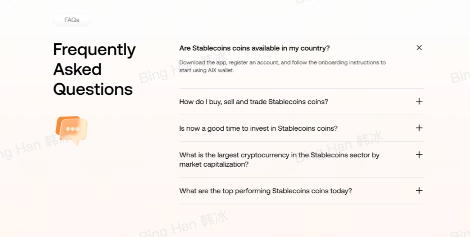
</td>
<td style="text-align: left;">
<strong>Module: FAQs</strong>

Title: <strong>Frequently Asked Questions</strong>

Questions (展示3个)：前端固定写死三个。待@Tong Wu 吴桐提供。

<strong>button</strong> 若未展开展示+，否则展示-

点击+，展开展示答案

点击-, 收起答案。

How do I apply for an AIX physical card?

Go to the “AIX Card” tab and choose “Physical Card”. Confirm your details, complete payment, and your card will be shipped within a few days.

Can I use my AIX card for online and in-store purchases?

Yes. AIX card is built on the Visa network, meaning you can use it at any merchant where Visa is accepted worldwide. It is also OK to add AIX cards to a digital wallet, such as Apple Pay (coming soon), Google Wallet or Samsung Wallet.

How I can set AIX card pin?

You’ll be prompted to create a 6-digit PIN when you activate your AIX card. Just follow the on-screen steps, and you’ll have your PIN set
</td>
<td style="text-align: left;">
Câu hỏi thường gặp

◦ <strong>Làm thế nào để đăng ký thẻ vật lý AIX?</strong> 
Vui lòng truy cập mục “AIX Card” và chọn “Physical Card”. Xác nhận thông tin của bạn, hoàn tất thanh toán và thẻ sẽ được gửi tới bạn trong vài ngày làm việc.

◦ <strong>Tôi có thể sử dụng thẻ AIX để thanh toán trực tuyến và tại cửa hàng không?</strong> 
Có. Thẻ AIX được phát hành trên mạng lưới Visa, vì vậy bạn có thể sử dụng tại bất kỳ điểm chấp nhận Visa nào trên toàn thế giới. Bạn cũng có thể thêm thẻ AIX vào các ví điện tử như Apple Pay (sắp ra mắt), Google Wallet hoặc Samsung Wallet.

◦ <strong>Làm thế nào để thiết lập mã PIN cho thẻ AIX?</strong> 
Bạn sẽ được yêu cầu tạo mã PIN gồm 6 chữ số khi kích hoạt thẻ AIX. Chỉ cần làm theo hướng dẫn hiển thị trên màn hình và mã PIN của bạn sẽ được thiết lập ngay.
</td>
</tr>
<tr>
<td style="text-align: left;">邮件订阅</td>
<td style="text-align: left;">二期需求，本期不涉及</td>
<td style="text-align: left;"></td>
</tr>
<tr>
<td style="text-align: left;">
Footer

</td>
<td style="text-align: left;">同首页</td>
<td style="text-align: left;"></td>
</tr>
</tbody>
</table>

5.3 **二级页面-Wallet Page**

链接：https://www.aixpay.co/wallet

核心定位：讲管理 → 聚焦资产管理、合规、安全、交易灵活性

<table style="width:89%;">
<colgroup>
<col style="width: 16%" />
<col style="width: 18%" />
<col style="width: 28%" />
<col style="width: 24%" />
</colgroup>
<tbody>
<tr>
<td style="text-align: left;"><strong>页面UI</strong></td>
<td style="text-align: left;"><strong>模块</strong></td>
<td style="text-align: left;"><strong>具体描述</strong></td>
<td style="text-align: left;"></td>
</tr>
<tr>
<td rowspan="7" style="text-align: center;">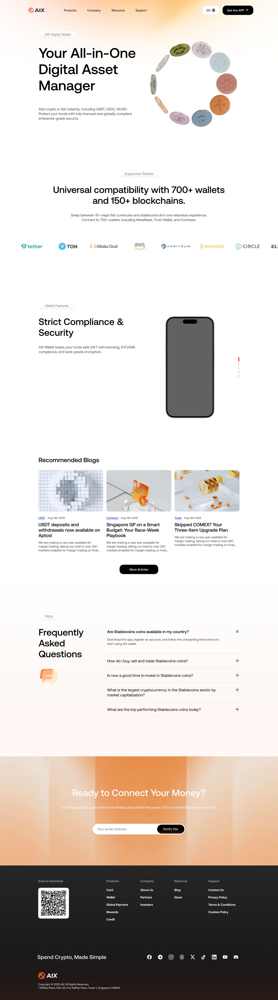</td>
<td style="text-align: left;">
导航栏

</td>
<td style="text-align: left;">
Entrance：

在Homepage页面操作，

点击<strong>顶部导航栏-【Wallet】</strong>

点击<strong>Our Unique Products--AIX Wallet--【Learn More】</strong>

点击<strong>Footer-Product Sevice-【Wallet】</strong>

Exit：

点击左上角AIX图标，则跳转至HomePage

PC端：顶部导航栏与Homepage页面保持一致。 
页面在非首屏时，向上滑动，则显示navigation bar，方便用户快速点击。

移动端：

显示Get App的首屏置顶悬浮banner，点击Get App button，则跳转商店下载页。链接待上线前给到。

用户点击关闭，则不显示banner。下次再次进入，继续显示。

其他与移动端Homepage页面保持一致。
</td>
<td style="text-align: left;"></td>
</tr>
<tr>
<td style="text-align: left;">
Banner

</td>
<td style="text-align: left;">
<strong>Title: AIX Digital Wallet</strong>

SubTitle: <strong>Your All-in-One Digital Asset Manager</strong>

Body:

Connect 700+ wallets such as MetaMask, Trust Wallet, and Coinbase. Top up stablecoins anytime securely 24/7.

Instantly add crypto or fiat, including USDT, USDC, WUSD and FDUSD.

Protect your funds with fully licensed and globally compliant enterprise-grade security

下载APP：

<strong>PC端：Start with Zero Gas Fee按钮</strong>, 点击/鼠标悬停弹出下载二维码。二维码请预留位置，待上线前给到。

<strong>移动端：Start with Zero Gas Fee按钮,</strong>点击 button，则跳转商店下载页。链接待上线前给到。

UI需调整
</td>
<td style="text-align: left;">
<strong>Title: Ví kỹ thuật số AIX -</strong>

<strong>subtitle：</strong> Quản lý tài sản kỹ thuật số tất cả trong một

Kết nối với hơn 700 ví như MetaMask, Trust Wallet và Coinbase. Nạp stablecoin an toàn mọi lúc 24/7.

Nạp tiền mã hóa hoặc tiền pháp định ngay lập tức, bao gồm USDT, USDC và WUSD.

Bảo vệ tiền của bạn với bảo mật cấp doanh nghiệp, được cấp phép đầy đủ và tuân thủ quy định toàn cầu

<strong>CTA:</strong> Tải ví của bạn
</td>
</tr>
<tr>
<td style="text-align: left;">
Supported Wallets

</td>
<td style="text-align: left;">
<strong>Module：Our Partner</strong>

显示：

Title: <strong>Connect to Your Favourite Wallets</strong>

钱包图标(Binance Wallet，OKX Wallet，Bybit Wallet，Trust Wallet，bitget wallet，Metamask，Bitcoin.com Wallet，Bifrost Wallet，Robinhood，BitPay Wallet，Coinbase Wallet，Fireblocks，Ledger，Blockchain.com，Trezor)，每行5个，图标可见：https://walletguide.walletconnect.network，注意UI图需更新
</td>
<td style="text-align: left;"><strong>Title: Kết nối với ví yêu thích của bạn</strong></td>
</tr>
<tr>
<td style="text-align: left;">
Features

</td>
<td style="text-align: left;">
<strong>Module：Features</strong>

第一个：

<strong>Strict Compliance &amp; Security</strong>

AIX Wallet keeps your funds safe 24/7 with full licensing, KYC/AML compliance, and enterprise-grade encryption.

第二个：

<strong>Swap Currencies</strong>

Swap across chains instantly and allocate funds for spending, investing, or payments effortlessly.

第三个：

<strong>Asset Visibility</strong>

Track all your crypto and fiat balances in real time, complete with transaction history.

第四个：

<strong>Fast Transfers</strong>

Send funds to any wallet in seconds. Simple, fast, and flexible.

第五个：

<strong>Zero Friction, More Freedom</strong>

Load, swap, and move crypto in just a few clicks.
</td>
<td style="text-align: left;">
<strong>Tuân thủ &amp; Bảo mật nghiêm ngặt</strong>

Ví AIX bảo vệ tiền của bạn 24/7 với đầy đủ giấy phép, tuân thủ KYC/AML và mã hóa cấp doanh nghiệp.

<strong>Hoán đổi tiền tệ</strong>

Hoán đổi giữa các blockchain ngay lập tức và phân bổ tiền để chi tiêu, đầu tư hoặc thanh toán dễ dàng.

<strong>Hiển thị tài sản</strong>

Theo dõi tất cả số dư tiền mã hóa và tiền pháp định theo thời gian thực, kèm lịch sử giao dịch chi tiết.

<strong>Chuyển tiền nhanh</strong>

Gửi tiền đến bất kỳ ví nào trong vài giây. Đơn giản, nhanh chóng và linh hoạt.

<strong>Không rào cản, tự do hơn</strong>

Nạp, hoán đổi và di chuyển tiền mã hóa chỉ với vài lần chạm.
</td>
</tr>
<tr>
<td style="text-align: center;">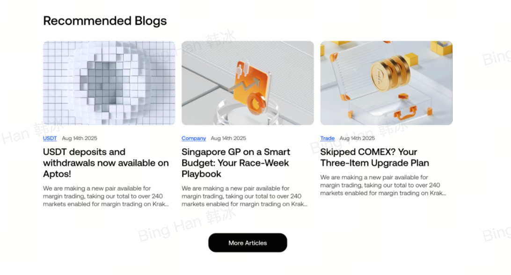</td>
<td style="text-align: left;">二期需求，本期不涉及</td>
<td style="text-align: left;"></td>
</tr>
<tr>
<td style="text-align: left;">
FAQ

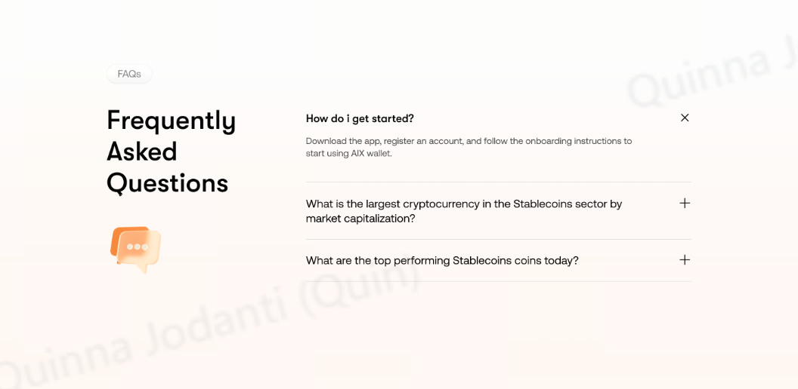
</td>
<td style="text-align: left;">
<strong>Module: FAQs</strong>

Title: <strong>Frequently Asked Questions</strong>

Questions (展示3个)：前端固定写死三个。待@Tong Wu 吴桐提供。

<strong>button</strong> 若未展开展示+，否则展示-

点击+，展开展示答案

点击-, 收起答案。

What is a Currency Account?

A currency account is a digital account that functions like a traditional bank account but exists entirely online. It allows you to receive, hold, and transfer funds electronically without a physical branch.

How can I top up my AIX account using stablecoins?

There are 2 ways to top up your AIX stablecoins wallet account

Bind crypto wallet (via Wallet Connect)

Wallet address/QR Code stablecoins top-up

Which stablecoins are supported for topping up an AIX account?

There are four supported stablecoins: USDT, USDC, WUSD, and FDUSD.
</td>
<td style="text-align: left;">
Câu hỏi thường gặp

◦ <strong>Tài khoản Tiền tệ (Currency Account) là gì?</strong> 
Tài khoản Tiền tệ là tài khoản số hoạt động tương tự như tài khoản ngân hàng truyền thống nhưng tồn tại hoàn toàn trực tuyến. Tài khoản cho phép bạn nhận, lưu giữ và chuyển tiền điện tử mà không cần đến chi nhánh vật lý.

◦ <strong>Làm thế nào để nạp stablecoin vào tài khoản AIX của tôi?</strong> 
Có hai cách để nạp stablecoin vào ví AIX:

<strong>Liên kết ví crypto</strong> (thông qua Wallet Connect)

<strong>Nạp stablecoin bằng địa chỉ ví hoặc mã QR</strong>

◦ <strong>Những loại stablecoin nào được hỗ trợ để nạp vào tài khoản AIX?</strong> 
AIX hiện hỗ trợ bốn loại stablecoin: <strong>USDT, USDC, WUSD và FDUSD</strong>.
</td>
</tr>
<tr>
<td style="text-align: left;">
Footer

</td>
<td style="text-align: left;">同首页</td>
<td style="text-align: left;"></td>
</tr>
</tbody>
</table>

5.4 **二级页面- About Us Page**

链接：https://www.aixpay.co/aboutus

核心定位：公司介绍-实力彰显、靠谱&专业

<table style="width:89%;">
<colgroup>
<col style="width: 19%" />
<col style="width: 16%" />
<col style="width: 35%" />
<col style="width: 16%" />
</colgroup>
<tbody>
<tr>
<td style="text-align: left;"><strong>页面UI</strong></td>
<td style="text-align: left;"><strong>模块</strong></td>
<td style="text-align: left;"><strong>模块元素</strong></td>
<td style="text-align: left;"></td>
</tr>
<tr>
<td rowspan="8" style="text-align: center;"></td>
<td style="text-align: left;">
导航栏

</td>
<td style="text-align: left;">
Entrance：

在Homepage页面操作，

点击<strong>顶部导航栏-Company</strong>

点击<strong>Footer-Company-【About us】</strong>

Exit：

点击左上角AIX图标，则跳转至HomePage

PC端：顶部导航栏与Homepage页面保持一致。 
页面在非首屏时，向上滑动，则显示navigation bar，方便用户快速点击。

移动端：

显示Get App的首屏置顶悬浮banner，点击Get App button，则跳转商店下载页。链接待上线前给到。

用户点击关闭，则不显示banner。下次再次进入，继续显示。

其他与移动端Homepage页面保持一致。
</td>
<td style="text-align: left;"></td>
</tr>
<tr>
<td style="text-align: left;">
Our Mission

</td>
<td style="text-align: left;">
<strong>Spend Crypto, Made Simple</strong>

AIX makes using digital assets as easy as a debit card, from sign-up to checkout, without the usual crypto complexity.
</td>
<td style="text-align: left;">
<strong>Chi tiêu tiền mã hóa, thật dễ dàng</strong>

AIX giúp việc sử dụng tài sản kỹ thuật số dễ dàng như thẻ ghi nợ, từ đăng ký đến thanh toán, loại bỏ những phức tạp của tiền mã hóa.
</td>
</tr>
<tr>
<td style="text-align: left;">
Our Vision

</td>
<td style="text-align: left;">
<strong>All Connected.</strong>

AIX exists to unify the financial world, bridging fiat and crypto seamlessly. We believe in universal access: one card, one app, connecting your money wherever and however you want to use it.
</td>
<td style="text-align: left;">
<strong>Kết nối tất cả.</strong>

AIX ra đời để hợp nhất thế giới tài chính, làm cầu nối liền mạch giữa tiền pháp định và tiền mã hóa. Chúng tôi tin vào khả năng tiếp cận toàn diện: một thẻ, một ứng dụng, kết nối tiền của bạn mọi lúc, mọi nơi theo cách bạn muốn.
</td>
</tr>
<tr>
<td style="text-align: left;">
Brand

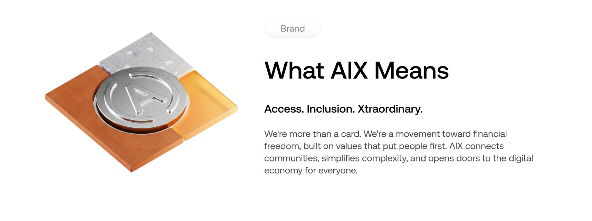
</td>
<td style="text-align: left;">
<strong>tag：What AIX Means</strong>

Access. Inclusion. Xtraordinary.

We're more than a card. We're a movement toward financial freedom, built on values that put people first. AIX connects communities, simplifies complexity, and opens doors to the digital economy for everyone.
</td>
<td style="text-align: left;">
<strong>Ý nghĩa của AIX</strong>

Tiếp cận. Toàn diện. Đột phá.

Chúng tôi không chỉ là một chiếc thẻ. Chúng tôi là phong trào hướng tới tự do tài chính, được xây dựng dựa trên những giá trị lấy con người làm trọng tâm. AIX kết nối cộng đồng, đơn giản hóa sự phức tạp và mở ra cơ hội trong nền kinh tế số cho mọi người.
</td>
</tr>
<tr>
<td style="text-align: left;">
Promise

</td>
<td style="text-align: left;">
<strong>Our Promise</strong>

AIX is built for the way you live. Spend, save, or stake. We connect you to your financial future without the friction of traditional banking.
</td>
<td style="text-align: left;">
<strong>Cam kết của chúng tôi</strong>

AIX được thiết kế phù hợp với phong cách sống của bạn. Chi tiêu, tiết kiệm hoặc staking. Chúng tôi kết nối bạn với tương lai tài chính mà không có rào cản của ngân hàng truyền thống.
</td>
</tr>
<tr>
<td style="text-align: left;">
Product USP

</td>
<td style="text-align: left;">
<strong>Fast, Low-Friction Sign-Up</strong>

Quick KYC onboarding and a full-featured wallet with staking gets you up and running in minutes.

<strong>Affordable and Inclusive</strong>

Low card issuance costs and minimal usage fees make AIX accessible to underbanked and first-time crypto users alike.

<strong>Spend Crypto Like Cash</strong>

Real-time crypto-to-fiat conversion protects against volatility. Pay online, in shops, or via QR codes with confidence and simplicity.
</td>
<td style="text-align: left;">
<strong>Đăng ký nhanh, không rào cản</strong>

KYC nhanh chóng và một ví đầy đủ tính năng bao gồm staking giúp bạn bắt đầu chỉ trong vài phút.

<strong>Tiết kiệm và toàn diện</strong>

Chi phí phát hành thẻ thấp và phí sử dụng tối thiểu giúp AIX tiếp cận những người chưa sử dụng dịch vụ ngân hàng và người dùng tiền mã hóa lần đầu.

<strong>Chi tiêu tiền mã hóa như tiền mặt</strong>

Chuyển đổi tiền mã hóa sang tiền pháp định theo thời gian thực giúp bảo vệ khỏi sự biến động. Thanh toán trực tuyến, tại cửa hàng hoặc mã QR một cách tự tin và đơn giản.
</td>
</tr>
<tr>
<td style="text-align: left;">邮件订阅</td>
<td style="text-align: left;">二期需求，本期不涉及</td>
<td style="text-align: left;"></td>
</tr>
<tr>
<td style="text-align: center;"></td>
<td style="text-align: left;">Footer：同首页</td>
<td style="text-align: left;"></td>
</tr>
</tbody>
</table>

5.5 **二级页面-Help Center Page (Zendesk)**

链接：https://www.aixpay.co/helpcenter

|            |              |
|:-----------|:-------------|
| **页面UI** | **模块元素** |
|            | 待CS提供     |

# 6. 数据需求

每个页面的曝光和点击

<table style="width:89%;">
<colgroup>
<col style="width: 10%" />
<col style="width: 11%" />
<col style="width: 11%" />
<col style="width: 11%" />
<col style="width: 14%" />
<col style="width: 30%" />
</colgroup>
<tbody>
<tr>
<td style="text-align: left;">页面</td>
<td style="text-align: left;">module</td>
<td style="text-align: left;">位置</td>
<td style="text-align: left;">曝光</td>
<td style="text-align: left;">点击</td>
<td style="text-align: left;">备注</td>
</tr>
<tr>
<td rowspan="6" style="text-align: left;">n/a</td>
<td rowspan="6" style="text-align: left;">导航栏</td>
<td style="text-align: left;">card</td>
<td style="text-align: left;">✅</td>
<td style="text-align: left;">✅</td>
<td rowspan="6" style="text-align: left;">区分homepage、card、wallet、about us不同页面</td>
</tr>
<tr>
<td style="text-align: left;">wallet</td>
<td style="text-align: left;">✅</td>
<td style="text-align: left;">✅</td>
</tr>
<tr>
<td style="text-align: left;">company</td>
<td style="text-align: left;">✅</td>
<td style="text-align: left;">✅</td>
</tr>
<tr>
<td style="text-align: left;">Get help</td>
<td style="text-align: left;">✅</td>
<td style="text-align: left;">✅</td>
</tr>
<tr>
<td style="text-align: left;">语言切换</td>
<td style="text-align: left;">✅</td>
<td style="text-align: left;">✅</td>
</tr>
<tr>
<td style="text-align: left;">Get the APP</td>
<td style="text-align: left;">✅</td>
<td style="text-align: left;">✅</td>
</tr>
<tr>
<td rowspan="8" style="text-align: left;">n/a</td>
<td rowspan="8" style="text-align: left;">footer</td>
<td style="text-align: left;">card</td>
<td style="text-align: left;">✅</td>
<td style="text-align: left;">✅</td>
<td rowspan="8" style="text-align: left;">区分homepage、card、wallet、about us不同页面</td>
</tr>
<tr>
<td style="text-align: left;">wallet</td>
<td style="text-align: left;">✅</td>
<td style="text-align: left;">✅</td>
</tr>
<tr>
<td style="text-align: left;">company</td>
<td style="text-align: left;">✅</td>
<td style="text-align: left;">✅</td>
</tr>
<tr>
<td style="text-align: left;">Get help</td>
<td style="text-align: left;">✅</td>
<td style="text-align: left;">✅</td>
</tr>
<tr>
<td style="text-align: left;">Privacy Policy</td>
<td style="text-align: left;">✅</td>
<td style="text-align: left;">✅</td>
</tr>
<tr>
<td style="text-align: left;">Terms and Conditions</td>
<td style="text-align: left;">✅</td>
<td style="text-align: left;">✅</td>
</tr>
<tr>
<td style="text-align: left;">社媒-X</td>
<td style="text-align: left;">✅</td>
<td style="text-align: left;">✅</td>
</tr>
<tr>
<td style="text-align: left;">社媒-tele</td>
<td style="text-align: left;">✅</td>
<td style="text-align: left;">✅</td>
</tr>
<tr>
<td rowspan="3" style="text-align: left;">homepage</td>
<td style="text-align: left;">介绍</td>
<td style="text-align: left;">Get the APP</td>
<td style="text-align: left;">✅</td>
<td style="text-align: left;">✅</td>
<td style="text-align: left;"></td>
</tr>
<tr>
<td style="text-align: left;">benefits</td>
<td style="text-align: left;">Learn more</td>
<td style="text-align: left;">✅</td>
<td style="text-align: left;">✅</td>
<td style="text-align: left;"></td>
</tr>
<tr>
<td style="text-align: left;">USP</td>
<td style="text-align: left;">Learn more</td>
<td style="text-align: left;">✅</td>
<td style="text-align: left;">✅</td>
<td style="text-align: left;"></td>
</tr>
<tr>
<td style="text-align: left;">card</td>
<td style="text-align: left;">banner</td>
<td style="text-align: left;">Get the APP</td>
<td style="text-align: left;">✅</td>
<td style="text-align: left;">✅</td>
<td style="text-align: left;"></td>
</tr>
<tr>
<td style="text-align: left;"></td>
<td style="text-align: left;">卡介绍</td>
<td style="text-align: left;">Get the APP</td>
<td style="text-align: left;">✅</td>
<td style="text-align: left;">✅</td>
<td style="text-align: left;"></td>
</tr>
<tr>
<td style="text-align: left;">wallet</td>
<td style="text-align: left;">banner</td>
<td style="text-align: left;">Get the APP</td>
<td style="text-align: left;">✅</td>
<td style="text-align: left;">✅</td>
<td style="text-align: left;"></td>
</tr>
<tr>
<td style="text-align: left;">About us</td>
<td style="text-align: left;"></td>
<td style="text-align: left;"></td>
<td style="text-align: left;">✅</td>
<td style="text-align: left;"></td>
<td style="text-align: left;"></td>
</tr>
</tbody>
</table>

# 7. 参考资料

内容参考；[AIX Card GTM (PH, VN & AU)](https://advancegroup.sg.larksuite.com/docx/SNnbdMwvOoIJBUx5pg6lyKCDgyg)

功能参考：[W304_AIX Stablecoin Official Website PRD](https://advancegroup.sg.larksuite.com/docx/NlAZdfZEaomts0x07p3lkYe8gtg?302from=wiki)

架构参考：[AIX official web](https://advancegroup.sg.larksuite.com/wiki/Wgifwia7GiRoZukb59QlZvi4g3e?sheet=090fa6)

竞品参考：https://www.redotpay.com/card

URL规范：

URL统一使用小写字母或数字，单词之间用短横线链接，例如https://www.aixpay.co/about-us；

避免在URL中使用特殊字符，如逗号、冒号、感叹号、句号、空格等；

避免不必要的特殊网址参数；

使用静态化的URL；

URL结构保持简单合理，最多3-4个层级，避免多层嵌套；

当前已有页面链接：

首页：https://www.aixpay.co/

card页面：https://www.aixpay.co/card

wallet页面：https://www.aixpay.co/wallet

blog页面：https://www.aixpay.co/blog/

news页面：https://www.aixpay.co/news/

About us页面：https://www.aixpay.co/about-us

Privacy Policy：https://www.aixpay.co/privacy-policy

Terms and Conditions：https://www.aixpay.co/terms-and-conditions
