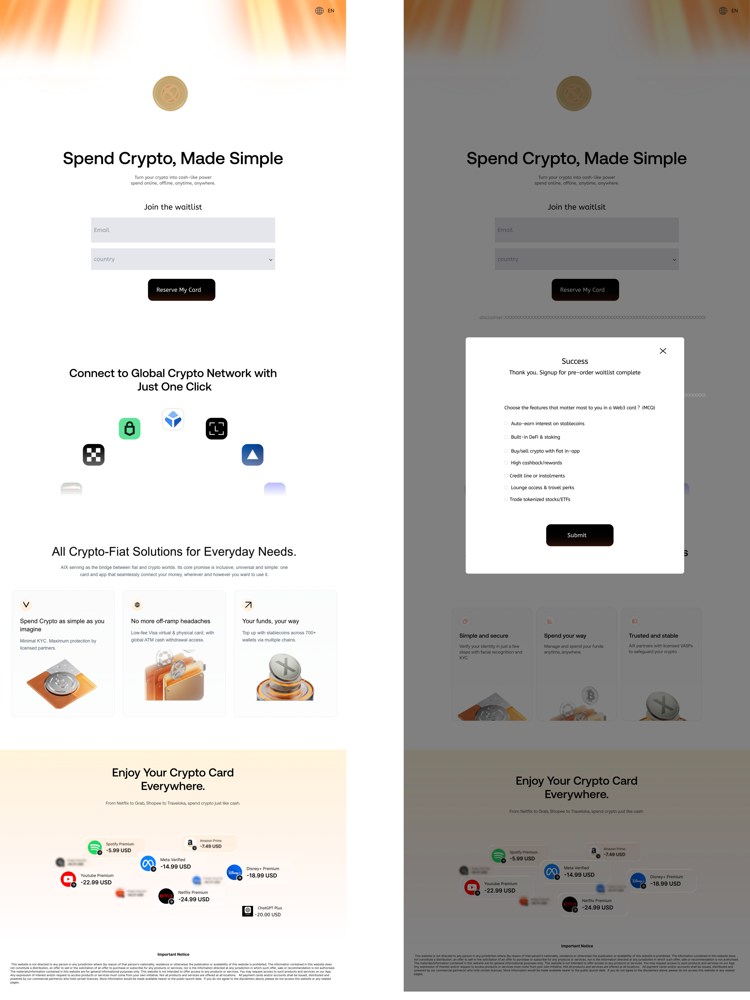
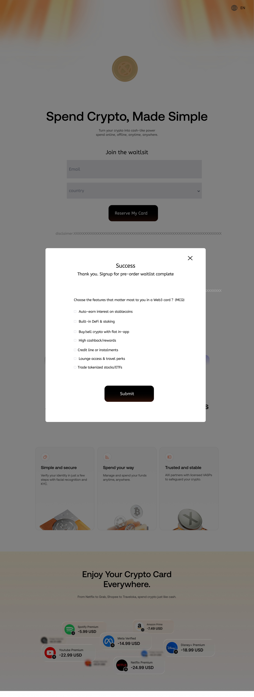

# \[2025-11-20\]AIX-外部投放waitlist

# 1. 目录

<table style="width:89%;">
<colgroup>
<col style="width: 4%" />
<col style="width: 12%" />
<col style="width: 13%" />
<col style="width: 11%" />
<col style="width: 5%" />
<col style="width: 17%" />
<col style="width: 14%" />
<col style="width: 9%" />
</colgroup>
<tbody>
<tr>
<td style="text-align: left;"><strong>业务端</strong></td>
<td style="text-align: left;">需求模块</td>
<td style="text-align: left;">功能描述</td>
<td style="text-align: left;"><strong>作者</strong></td>
<td style="text-align: left;"><strong>需求批次</strong></td>
<td style="text-align: left;"><strong>PRD</strong></td>
<td style="text-align: left;"><strong>Meegle</strong></td>
<td style="text-align: left;">需求状态</td>
</tr>
<tr>
<td style="text-align: left;">用户端</td>
<td style="text-align: left;">【通用】注册登录</td>
<td style="text-align: left;">包括注册/登录/忘记密码等功能</td>
<td style="text-align: left;">@Yifeng Wu 吴忆锋</td>
<td style="text-align: left;">第1批</td>
<td style="text-align: left;"><a href="https://advancegroup.sg.larksuite.com/wiki/NerUwjf1kiLTOkk9uJClnSYZgCc?from=from_copylink">AIX Card 注册登录需求V1.0</a></td>
<td style="text-align: left;"><a href="https://project.larksuite.com/atome_agile/story/detail/8508344">[Feature]AIX项目-注册登录需求</a></td>
<td style="text-align: left;">已评审</td>
</tr>
<tr>
<td style="text-align: left;">用户端</td>
<td style="text-align: left;">【通用】ME模块</td>
<td style="text-align: left;">包括绑定/更新手机号、修改密码、登出、设置通知等账户相关管理功能</td>
<td style="text-align: left;">@Yifeng Wu 吴忆锋</td>
<td style="text-align: left;">第1批</td>
<td style="text-align: left;"><a href="https://advancegroup.sg.larksuite.com/wiki/PxXnwhWp6iWr7RkEYnwl0I6sgzc?from=from_copylink">AIX Card ME模块需求V1.0</a></td>
<td style="text-align: left;"><a href="https://project.larksuite.com/atome_agile/story/detail/8508345">[Feature]AIX Card ME模块需求</a></td>
<td style="text-align: left;">已评审</td>
</tr>
<tr>
<td style="text-align: left;">用户端</td>
<td style="text-align: left;">【通用】AIX主页</td>
<td style="text-align: left;">AIX主页</td>
<td style="text-align: left;">@Xuemin Zhu 朱学敏</td>
<td style="text-align: left;">第2批</td>
<td style="text-align: left;"><a href="https://advancegroup.sg.larksuite.com/docx/Tf1ydauugoKzzQx3PkUlG8t7g6f">AIX APP V1.0【Home】</a></td>
<td style="text-align: left;"><a href="https://project.larksuite.com/atome_agile/story/detail/8646936?parentUrl=/atome_agile/story/homepage&amp;openScene=1">[Feature]AIX APP Main</a></td>
<td style="text-align: left;">已评审</td>
</tr>
<tr>
<td style="text-align: left;">用户端</td>
<td style="text-align: left;">【Wallet】资产</td>
<td style="text-align: left;">
钱包主页

单币种首页

交易记录
</td>
<td style="text-align: left;">@Xuemin Zhu 朱学敏</td>
<td style="text-align: left;">第2批</td>
<td style="text-align: left;"><a href="https://advancegroup.sg.larksuite.com/docx/FlV6dPLYgowznwxAALAlPYuzgeA">AIX Wallet V1.0【Asset】</a></td>
<td style="text-align: left;"><a href="https://project.larksuite.com/atome_agile/story/detail/8646936?parentUrl=/atome_agile/story/homepage&amp;openScene=1">[Feature]AIX APP Main</a></td>
<td style="text-align: left;">已评审</td>
</tr>
<tr>
<td style="text-align: left;">用户端</td>
<td style="text-align: left;">【通用】全局问题库</td>
<td style="text-align: left;">
问题入口

最近3条

FAQ页面
</td>
<td style="text-align: left;">@Xuemin Zhu 朱学敏</td>
<td style="text-align: left;"></td>
<td style="text-align: left;"><a href="https://advancegroup.sg.larksuite.com/docx/OlWEdynrboay1QxcpfhlYbJtgZg">AIX APP V1.0 【FAQ】</a></td>
<td style="text-align: left;"><a href="https://project.larksuite.com/atome_agile/story/detail/10077340?parentUrl=/atome_agile/story/homepage&amp;openScene=1">[Feature]AIX APP V1.0 全局问题【FAQ】</a></td>
<td style="text-align: left;">已评审</td>
</tr>
<tr>
<td style="text-align: left;">用户端</td>
<td style="text-align: left;">【认证】Security</td>
<td style="text-align: left;">包括身份认证模块</td>
<td style="text-align: left;">@Yifeng Wu 吴忆锋</td>
<td style="text-align: left;">第2批</td>
<td style="text-align: left;"><a href="https://advancegroup.sg.larksuite.com/wiki/HdI2wMXXviIOOwkVJNjlWY35gSh?from=from_copylink">AIX Security 身份认证需求V1.0</a></td>
<td style="text-align: left;"><a href="https://project.larksuite.com/atome_agile/story/detail/8649980">[Feature]AIX Security 身份认证需求V1.0</a></td>
<td style="text-align: left;">已评审</td>
</tr>
<tr>
<td style="text-align: left;">用户端</td>
<td style="text-align: left;">【Card】申卡</td>
<td style="text-align: left;">
申请开卡

扣制卡费

卡片详情

卡片展示
</td>
<td style="text-align: left;">@Xuemin Zhu 朱学敏</td>
<td style="text-align: left;">第2批</td>
<td style="text-align: left;"><a href="https://advancegroup.sg.larksuite.com/docx/AgJgdrCaLoCDUFxoKHqlnZGMgkh">AIX Card V1.0【Application】</a></td>
<td style="text-align: left;"><a href="https://project.larksuite.com/atome_agile/story/detail/7981054">[Feature]AIX Card V1.0【Application】</a></td>
<td style="text-align: left;">已评审</td>
</tr>
<tr>
<td style="text-align: left;">用户端</td>
<td style="text-align: left;">【Card】Card Manage</td>
<td style="text-align: left;">包括卡激活、设置/修改PIN、冻结卡、解冻卡等</td>
<td style="text-align: left;">@Yifeng Wu 吴忆锋</td>
<td style="text-align: left;">第2批</td>
<td style="text-align: left;"><a href="https://advancegroup.sg.larksuite.com/wiki/Uwyfwkc2jixSBukf2YJllpjsgRd?from=from_copylink">AIX Card 【manage】模块需求V1.0</a></td>
<td style="text-align: left;"><a href="https://project.larksuite.com/atome_agile/story/detail/8649952">[Feature]AIX Card manage模块需求V1.0</a></td>
<td style="text-align: left;">已评审</td>
</tr>
<tr>
<td style="text-align: left;">用户端</td>
<td style="text-align: left;">【Card】Card transaction</td>
<td style="text-align: left;">包括卡自动转钱包功能</td>
<td style="text-align: left;">@Yifeng Wu 吴忆锋</td>
<td style="text-align: left;"></td>
<td style="text-align: left;"><a href="https://advancegroup.sg.larksuite.com/wiki/Ap7pwQeetiS7hlk9MTqlEcycgjc?from=from_copylink">AIX Card交易【transaction】</a></td>
<td style="text-align: left;"><a href="https://project.larksuite.com/atome_agile/story/detail/9148370">[Feature]AIX Card交易【transaction】</a></td>
<td style="text-align: left;">已评审</td>
</tr>
<tr>
<td style="text-align: left;">用户端</td>
<td style="text-align: left;">【通用】交易记录</td>
<td style="text-align: left;">
全量交易记录

卡交易记录

Card交易详情

OTC交易详情

Crypto交易详情
</td>
<td style="text-align: left;">@Xuemin Zhu 朱学敏</td>
<td style="text-align: left;">第2批</td>
<td style="text-align: left;"><a href="https://advancegroup.sg.larksuite.com/docx/RJqtdUND9oGdkxxrPRllg94kgFe">AIX APP V1.0【Transaction &amp; History】</a></td>
<td style="text-align: left;"><a href="https://project.larksuite.com/atome_agile/story/detail/7981018?parentUrl=/atome_agile/story/homepage&amp;openScene=4">[Feature]AIX APP V1.0【Transaction &amp; History】</a></td>
<td style="text-align: left;">
已评审

（后续会根据UX调整二次评）
</td>
</tr>
<tr>
<td style="text-align: left;">用户端</td>
<td style="text-align: left;">【钱包】开户kyc</td>
<td style="text-align: left;">开通DTC账户</td>
<td style="text-align: left;">@Yifeng Wu 吴忆锋</td>
<td style="text-align: left;">第3批</td>
<td style="text-align: left;"><a href="https://advancegroup.sg.larksuite.com/wiki/ISjLwCKi5itjNXkpCLllQD5Qgle?from=from_copylink">AIX WALLET 钱包开户KYC需求V1.0</a></td>
<td style="text-align: left;"><a href="https://project.larksuite.com/atome_agile/story/detail/8836465">[Feature]AIX WALLET 钱包开户KYC需求V1.0</a></td>
<td style="text-align: left;"></td>
</tr>
<tr>
<td style="text-align: left;">用户端</td>
<td style="text-align: left;">【Wallet】钱包交易</td>
<td style="text-align: left;">
兑换

转账

地址充值

链接钱包充值
</td>
<td style="text-align: left;">@Xuemin Zhu 朱学敏</td>
<td style="text-align: left;">第5批</td>
<td style="text-align: left;"><a href="https://advancegroup.sg.larksuite.com/docx/GDWWdl5G9oI1GSxvD7alRX1Uguf">AIX Wallet V1.0【Deposit &amp; Send &amp; Swap 】</a></td>
<td style="text-align: left;"><a href="https://project.larksuite.com/atome_agile/story/detail/8528235?parentUrl=/atome_agile/story/homepage&amp;openScene=1">[Feature]AIX Wallet V1.0【Transaction】</a></td>
<td style="text-align: left;">
已评审

（后续会根据UX调整二次评）
</td>
</tr>
<tr>
<td style="text-align: left;">营销端</td>
<td style="text-align: left;">【营销】营销后管模块</td>
<td style="text-align: left;">Notification、CMS、Landing page配置、usergroup等等</td>
<td style="text-align: left;">@Yijun Yin 尹伊君</td>
<td style="text-align: left;">第5批</td>
<td style="text-align: left;"><a href="https://advancegroup.sg.larksuite.com/wiki/MBmiw9mOKi0HmfkvYMNlsYd5guc?from=from_copylink">[AIX]OBOSS MVP</a></td>
<td style="text-align: left;"><a href="https://project.larksuite.com/atome_agile/story/detail/9249153?from=from_parent_docs">[Feature]AIX OBoss MVP</a></td>
<td style="text-align: left;">已评审</td>
</tr>
<tr>
<td style="text-align: left;">营销端</td>
<td style="text-align: left;">AIX官网</td>
<td style="text-align: left;">pc端官网</td>
<td style="text-align: left;">@Bing Han 韩冰</td>
<td style="text-align: left;">第3批</td>
<td style="text-align: left;"><a href="https://advancegroup.sg.larksuite.com/wiki/JMRmw7tT9iBUntknqVXlT9aNgHc">[2025-11-05]AIX-官网需求一期</a></td>
<td style="text-align: left;"><a href="https://project.larksuite.com/atome_agile/story/detail/8846363?parentUrl=/atome_agile/story/homepage&amp;openScene=4">[Feature]AIX website</a></td>
<td style="text-align: left;">已评审</td>
</tr>
<tr>
<td style="text-align: left;">营销端</td>
<td style="text-align: left;">AIX外部投放waitlist</td>
<td style="text-align: left;">支持外部渠道投放</td>
<td style="text-align: left;">@Bing Han 韩冰</td>
<td style="text-align: left;">第5批</td>
<td style="text-align: left;"><a href="https://advancegroup.sg.larksuite.com/wiki/NQ2EwGQ35iK5VPkq3AVlWrflgod">[2025-11-20]AIX-外部投放waitlist</a></td>
<td style="text-align: left;">https://project.larksuite.com/atome_agile/story/detail/9020640</td>
<td style="text-align: left;">已评审</td>
</tr>
<tr>
<td style="text-align: left;">营销端</td>
<td style="text-align: left;">AIX+MGM</td>
<td style="text-align: left;">MGM邀请好友得奖励</td>
<td style="text-align: left;">@Bing Han 韩冰</td>
<td style="text-align: left;">第5批</td>
<td style="text-align: left;"><a href="https://advancegroup.sg.larksuite.com/wiki/JZ7pweVA5ig3A9keKBqlrBoPgev">[2025-11-20]AIX-MGM及邀请码</a></td>
<td style="text-align: left;"><a href="https://project.larksuite.com/atome_agile/story/detail/8932901?parentUrl=/atome_agile/story/homepage&amp;openScene=1">[Feature]AIX+MGM</a></td>
<td style="text-align: left;">已评审</td>
</tr>
<tr>
<td style="text-align: left;">营销端</td>
<td style="text-align: left;">AIX+banner、popup</td>
<td style="text-align: left;">增加弹窗、广告位的能力</td>
<td style="text-align: left;">@Bing Han 韩冰</td>
<td style="text-align: left;">第5批</td>
<td style="text-align: left;"><a href="https://advancegroup.sg.larksuite.com/wiki/LPahw9N9minPZWkwthclU5l6grH">[2025-11-27] AIX+PopUp+banner等能力接入【首页+MGM页面】</a></td>
<td style="text-align: left;"><a href="https://project.larksuite.com/atome_agile/story/detail/9011030?parentUrl=/atome_agile/story/homepage&amp;openScene=4">[Feature]AIX+弹窗+banner等基础能力接入</a></td>
<td style="text-align: left;">已评审</td>
</tr>
<tr>
<td style="text-align: left;">营销端</td>
<td style="text-align: left;">AIX+push、站内信</td>
<td style="text-align: left;">增加消息中心、站内信等能力</td>
<td style="text-align: left;">@Bing Han 韩冰</td>
<td style="text-align: left;">第5批</td>
<td style="text-align: left;"><a href="https://advancegroup.sg.larksuite.com/wiki/M2PAw01mFiUnf1kD8gnlqSq9gAc">[2025-11-25] AIX+Notification（push及站内信）</a></td>
<td style="text-align: left;">https://project.larksuite.com/atome_agile/story/detail/9396507?parentUrl=%2Fatome_agile%2Fstory%2Fhomepage&amp;openScene=4</td>
<td style="text-align: left;">已评审</td>
</tr>
<tr>
<td style="text-align: left;">营销端</td>
<td style="text-align: left;">AIX官网增加waitlist</td>
<td style="text-align: left;">pc端官网+waitlist</td>
<td style="text-align: left;">@Bing Han 韩冰</td>
<td style="text-align: left;">第5批</td>
<td style="text-align: left;"><a href="https://advancegroup.sg.larksuite.com/wiki/QUCewgT6ZiboYCkev4tlJDiVgTc">[2026-01-04]AIX官网增加waitlist</a></td>
<td style="text-align: left;"><a href="https://project.larksuite.com/atome_agile/story/detail/9583833?parentUrl=/atome_agile/story/homepage&amp;openScene=1">[Feature]官网增加waitlist</a></td>
<td style="text-align: left;">已评审</td>
</tr>
</tbody>
</table>

# 2. 需求背景

目前 Atome Crypto Card 项目仅在 **越南（VN）**、**菲律宾（PH）**、**澳大利亚（AU）** 三个国家开放。  
但在活动宣传或页面入口中，来自其他国家/地区的用户也会尝试申请，导致他们只能看到“暂不支持”的提示，用户体验较差，也无法收集到潜在意向用户信息。

本功能的目标是：

为不在支持国家范围内的用户提供**加入候补名单**的入口；

收集用户的**邮箱地址（Email）与意向国家（Country）**，以便后续开放时可通知用户；

建立一套候补名单数据库，用于评估市场潜力、用户兴趣分布及后续拓展优先级。

详见：[\[BRD\] Aix Waitlist](https://advancegroup.sg.larksuite.com/wiki/FKtRwpAO8iD6tDkSeLTlioIVgFc)

# 3. 需求概况

<table style="width:89%;">
<colgroup>
<col style="width: 12%" />
<col style="width: 76%" />
</colgroup>
<tbody>
<tr>
<td style="text-align: left;"><strong>类型</strong></td>
<td style="text-align: left;">明细</td>
</tr>
<tr>
<td style="text-align: left;">PM</td>
<td style="text-align: left;">@Bing Han 韩冰</td>
</tr>
<tr>
<td style="text-align: left;">需求方</td>
<td style="text-align: left;">@Devon Xiao</td>
</tr>
<tr>
<td style="text-align: left;">UI/UX</td>
<td style="text-align: left;"></td>
</tr>
<tr>
<td style="text-align: left;">前端</td>
<td style="text-align: left;"></td>
</tr>
<tr>
<td style="text-align: left;">服务端</td>
<td style="text-align: left;"></td>
</tr>
<tr>
<td style="text-align: left;">测试</td>
<td style="text-align: left;"></td>
</tr>
<tr>
<td style="text-align: left;">Figma</td>
<td style="text-align: left;">https://www.figma.com/design/iDt3nk3jeLm8iGg91uvfVU/%E2%86%92-AIX-Dev-Handoff-2025-Q4?node-id=2961-69055&amp;t=6be6RGcu1a3CrE2v-4</td>
</tr>
<tr>
<td style="text-align: left;">BRD</td>
<td style="text-align: left;"><a href="https://advancegroup.sg.larksuite.com/wiki/FKtRwpAO8iD6tDkSeLTlioIVgFc">[BRD] Aix Waitlist</a></td>
</tr>
<tr>
<td style="text-align: left;">期望上线时间</td>
<td style="text-align: left;">2025年12月底</td>
</tr>
<tr>
<td style="text-align: left;">Meggle</td>
<td style="text-align: left;"><a href="https://project.larksuite.com/atome_agile/story/detail/9020640">[Feature]AIX+waitlist</a></td>
</tr>
<tr>
<td style="text-align: left;">关联域PRD</td>
<td style="text-align: left;"></td>
</tr>
<tr>
<td style="text-align: left;">历史需求PRD</td>
<td style="text-align: left;"></td>
</tr>
<tr>
<td style="text-align: left;">技术方案</td>
<td style="text-align: left;"></td>
</tr>
<tr>
<td style="text-align: left;">支持语言</td>
<td style="text-align: left;">
默认为英语

多语言切换待语言包集成后女，支持切换语言。

在越南国家访问默认显示越南语，其他国家显示英文。
</td>
</tr>
<tr>
<td style="text-align: left;">设备适配</td>
<td style="text-align: left;">移动端+PC端</td>
</tr>
<tr>
<td style="text-align: left;">链接</td>
<td style="text-align: left;">
<a href="http://aix.co/waitlist">aix.co/waitlist</a>+ referral参数

区分不同的渠道，用于跟踪不同渠道的用户数及反馈的意见内容

Referral :

x1

tele1

tele2

tele3

tele4

tele5

tele6

tele7

tele8

tele9

tele10

tele11

tele12

tele13

线上投放链接：

<a href="https://advancegroup.sg.larksuite.com/sheets/Ys1Gs2Dzoh1SvptXDHbl42Xugyd?from=space_personal_filelist&amp;pre_pathname=/drive/me/&amp;previous_navigation_time=1766995499154">Waitlist Drop link</a>
</td>
</tr>
<tr>
<td style="text-align: left;">文案review</td>
<td style="text-align: left;"><a href="https://advancegroup.sg.larksuite.com/docx/TGqPds0LroPmdmxYqCLls3t9gag">AIX waitlist copy draft</a></td>
</tr>
<tr>
<td style="text-align: left;">Others</td>
<td style="text-align: left;">
<a href="https://advancegroup.sg.larksuite.com/wiki/WeY2wnzj0iUyIbk8V9blkQIcgoe?sheet=qBWniC">AIX项目管理表</a>

深度解析：RedotPay 如何在全球 U 卡赛道跑到第一？

https://mp.weixin.qq.com/s/NksznTLCPe5Iqv8RcqhAaA?from=singlemessage&amp;isappinstalled=0&amp;scene=1&amp;clicktime=1763385296&amp;enterid=1763385296
</td>
</tr>
</tbody>
</table>

# 4. Demo

# 5. 需求描述

<table style="width:89%;">
<colgroup>
<col style="width: 25%" />
<col style="width: 43%" />
<col style="width: 19%" />
</colgroup>
<tbody>
<tr>
<td style="text-align: left;"><strong>页面</strong></td>
<td style="text-align: left;"><strong>具体描述</strong></td>
<td style="text-align: left;">越南语版本</td>
</tr>
<tr>
<td style="text-align: left;"></td>
<td style="text-align: left;"></td>
<td style="text-align: left;"></td>
</tr>
<tr>
<td style="text-align: center;"></td>
<td style="text-align: left;">
标题：投放页面

显示：

显示氛围图

<del>显示语言切换入口：</del>

<del>在越南国家访问默认显示越南语，其他国家显示英文。</del>

显示邀请加入等待列表的提示框。

引导用户输入邮箱。

输入规则：最长限制为254个字符,超出不可输入;

格式校验:当格式不符合邮箱规范(如:缺少@符号、域名不完整)时,应提示:Email format is invalid。当输入框为空时,应提示:Email should not be empty

引导用户输入国家

单选，支持用户模糊搜索。

输入限制:不限制输入类型,输入的字符数不超过50个。

搜索清除:点击搜索框右侧的"x"(清除按钮),

可清空输入内容。

匹配逻辑:支持模糊匹配,可根据<del>区号</del>或国家检索出来。

空状态:无匹配结果时,展示为空

展示全部国家，完整国家list参考，见: <a href="https://advancegroup.sg.larksuite.com/wiki/IeKMw357ziJVjFkGTullgz1UgLe">国家和地区list</a>

列表排序规则，实现方式: 采用组件 new Intl.Collator('vi-VN').compare

JavaScript: new Intl.Collator('vi-VN').compare 排序规则解释

排序遵循越南语字母顺序

越南语有 29 个基础字母，顺序为：（按照基本字母来分组）A, Ả, Â, B, C, D, Đ, E, Ẻ, G, H, I, K, L, M, N, O, Ô, Ố, P, Q, R, S, T, U, Ủ, V, X, Y

注：Đ 是独立字母，排在 D 之后；Ả、Â、Ẻ、Ô、Ố、Ủ 都是独立字母，不等同于 A 或 E。

相同词根的词须连续排列

例如：如果存在 bạ、bà、bá 等（仅声调不同），它们应紧挨着排在一起，不能被其他词（如 ban）插在中间。

禁止逐字完全比较（如先比第一个字的所有属性）

必须采用 “整串先比基础字母→再比声调” 的方式，这是国际标准（Unicode 排序算法）。

常用地区

显示常用国家地区,固定为:澳大利亚、中国、新加坡、菲律宾、越南

<del>首字母索引的导航栏</del>

<del>点击字母:点击某一字母,页面会自动滚动到所有首字母为该字母的国家/地区</del>

显示预约按钮。

邮箱或国家未选择，则预约按钮置灰色，不可点击。

邮箱及国家补充完整，则预约按钮高亮可点击。

第一个楼层文案：

<blockquote>

title：Spend Crypto, Made Simple

subtitle：Turn your crypto into cash-like power. Spend online, offline, anytime, anywhere.

</blockquote>

第二个楼层文案：Connect to Global Crypto Networks in Just One Click

第三个楼层文案：

<blockquote>

title：All-in-One Everyday Crypto-Fiat Payments

subtitle：AIX bridges the gap between crypto and fiat. One card, one app, and seamless access to your money wherever and however you want to use it.

</blockquote>

<strong>Crypto spending made simple</strong> 
Minimal KYC. Maximum protection. Fully licensed and regulated for your peace of mind.

<strong>Spend crypto like cash</strong> 
Low-fee Visa cards (virtual and physical) that work everywhere - online, in-store or at any ATM globally.

<strong>Your funds, your way</strong> 
Top up effortlessly with stablecoins from 700+ wallets across all major chains.

第四个楼层文案：

<blockquote>

title：Enjoy Your Crypto Card Everywhere

subtitle：From Netflix and Amazon to YouTube and Spotify, you can spend crypto just like cash at 100+ million Visa card–accepting merchants around the world.

</blockquote>

Spotify Premium：<strong>-5.99 USD</strong>

Amazon Prime：<strong>-7.49 USD</strong>

Meta Verified：<strong>-14.99 USD</strong>

Disney+ Premium：<strong>-18.99 USD</strong>

Youtube Premium ：<strong>-22.99 USD</strong>

Netflix Premium：<strong>-24.99 USD</strong>

ChatGPT Plus：<strong>-20.00 USD</strong>

第五个楼层文案disclaimer：

<strong>Important Notice</strong> 
This website is not directed to any person in any jurisdiction where (by reason of that person's nationality, residence or otherwise) the publication or availability of this website is prohibited. The information contained in this website does not constitute a distribution, an offer to sell or the solicitation of an offer to purchase or subscribe for any products or services, nor is the information directed at any jurisdiction in which such offer, sale or recommendation is not authorised. 
 
The materials/information contained in this website are for general informational purposes only. This website is not intended to offer access to any products or services. You may request access to such products and services on our App. Any expression of interest and/or request to access products or services must come from your own initiative. Not all products and services are offered at all locations. 
 
All payment cards and/or accounts shall be issued, distributed and powered by our commercial partner(s) who hold certain licences. More information would be made available nearer to the public launch date. 
<strong>If you do not agree to the disclaimers above‚ please do not access this website or any related pages.</strong>

交互：

点击提交，则弹出成功加入等待列表的弹窗。

同一个邮箱，最多支持5个国家。超过后，toast：The submission limit has been reached

投放链接参考：<a href="http://aix.co/waitlist">aix.co/waitlist</a>

数据落库：

针对已提交预约的用户对应的邮箱、国家、most matters 、来源（外部投放、APP）、提交时间、渠道值、设备指纹ID等信息需要落库落表存储，并推送至数仓。以便运营同学分析。

若用户作答了多选题，其作答结果应一并落库，并推送至数仓。以便运营同学分析。

频控：

同一个邮箱、同一个国家，仅提交1次。再次提交，toast：Submitted, please do not resubmit

同一个设备指纹总次数限制（总次数 非单位时间），最多10次。超过后，toast提示：The system is busy, please try again later。

同一个ip <strong>单位时间</strong>内总次数限制 100/15min。超过后，toast提示：The system is busy, please try again later。锁定15分钟后可再提交。

接口总限流（研发定义）超过后，toast提示：The system is busy, please try again later。
</td>
<td style="text-align: left;"></td>
</tr>
<tr>
<td style="text-align: center;"></td>
<td style="text-align: left;">
标题：成功加入等待列表的弹窗

显示：

显示成功加入引导文案：

title：Welcome to the waitlist

Subtitle：You're in! Watch your inbox for launch updates and early access.

显示多选题，引导用户选择期待增加的功能：

<blockquote>

题干：What matters most to you in a Web3 card? (MCQ)

选项：

</blockquote>

Auto-earn interest on stablecoins

Crypto transfers

Easy fiat-to-crypto conversion

High cashback &amp; rewards

Built-in DeFi &amp; staking tools

Credit limit and installment features

Trade tokenized assets (stocks/ETFs)

Others (pls specify)

当用户选择Others，引导用户自行输入一行文本。长度最多100个字符，选择others 非必须输入文本。

当用户勾选了一个选项及以上，则提交按钮高亮可点击。

当用户未做任何勾选，提交按钮置灰色不可点击。

交互：

点击提交，给出toast提示：Thanks for your feedback。

点击关闭，则关闭弹窗，停留在当前页面。
</td>
<td style="text-align: left;"></td>
</tr>
</tbody>
</table>

# 6. 数据埋点

待定

# 7. 数据分析需求（待定）

# 8. 参考资料
