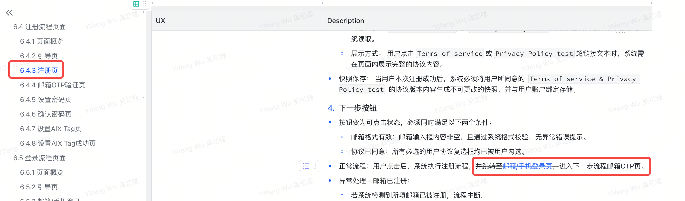
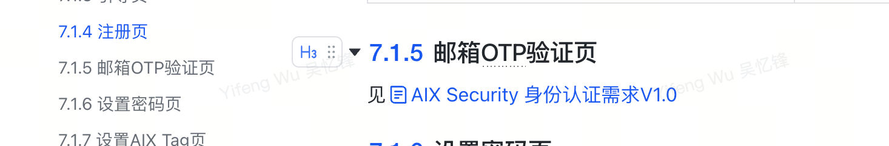
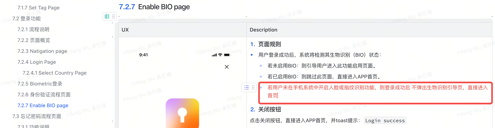
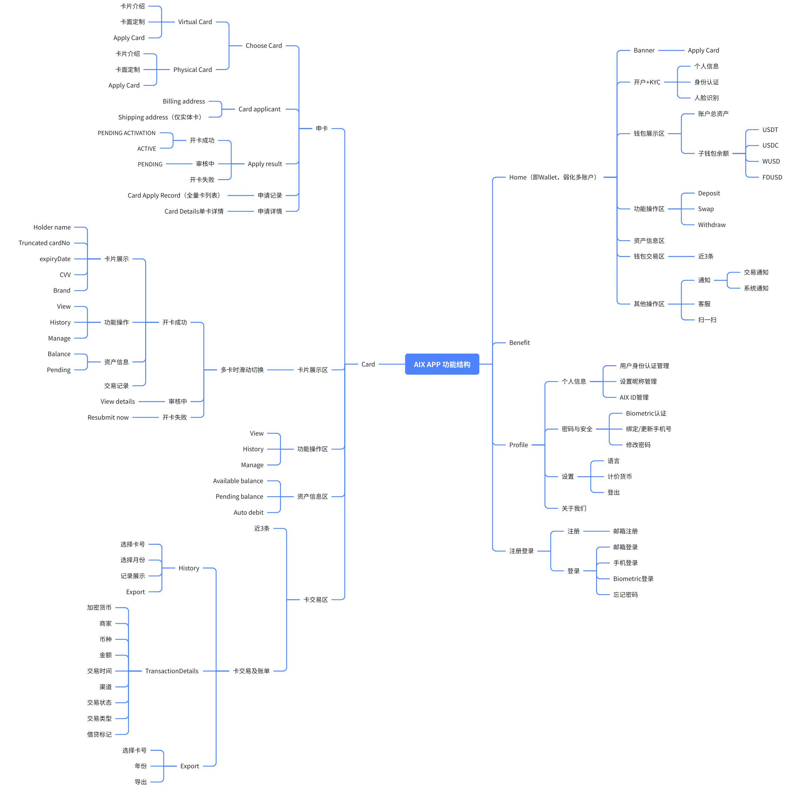
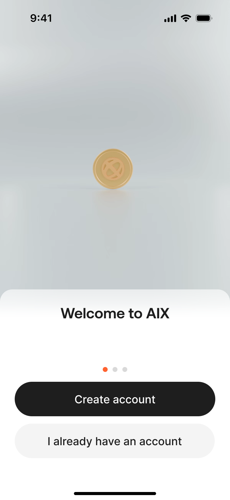
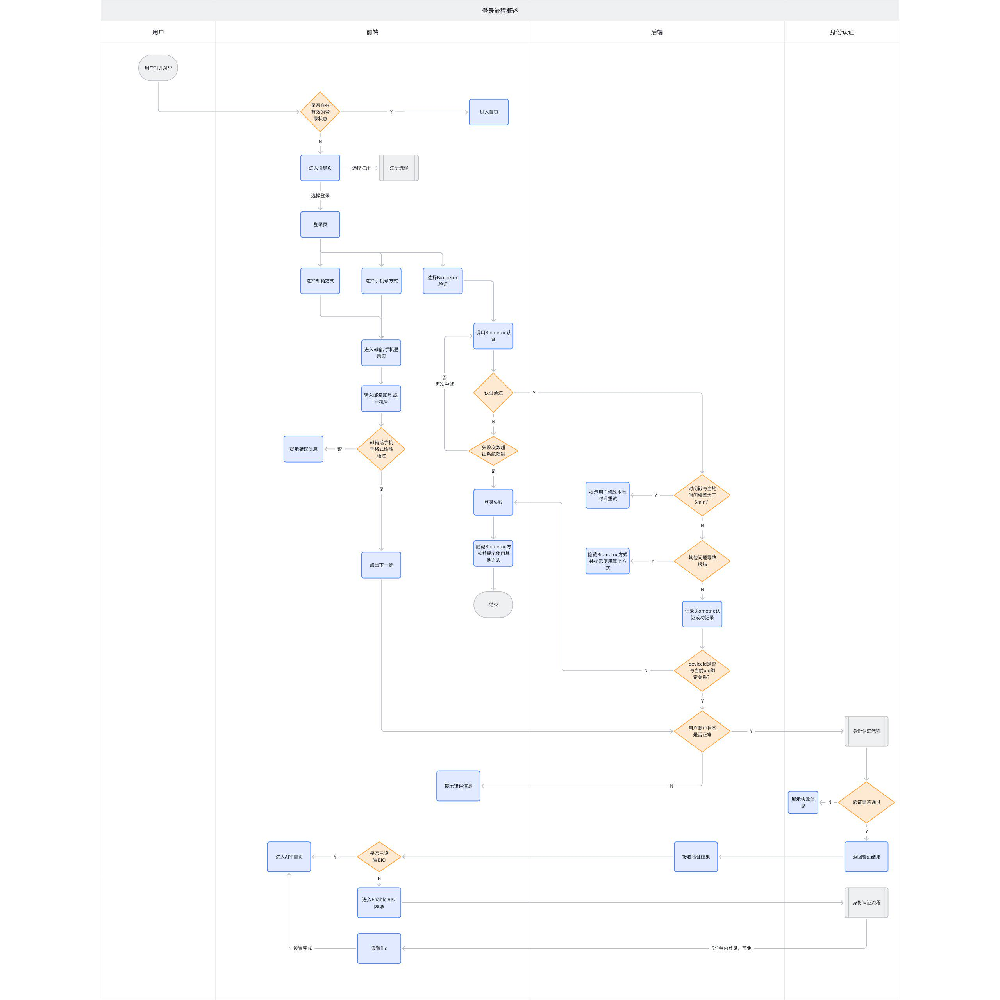
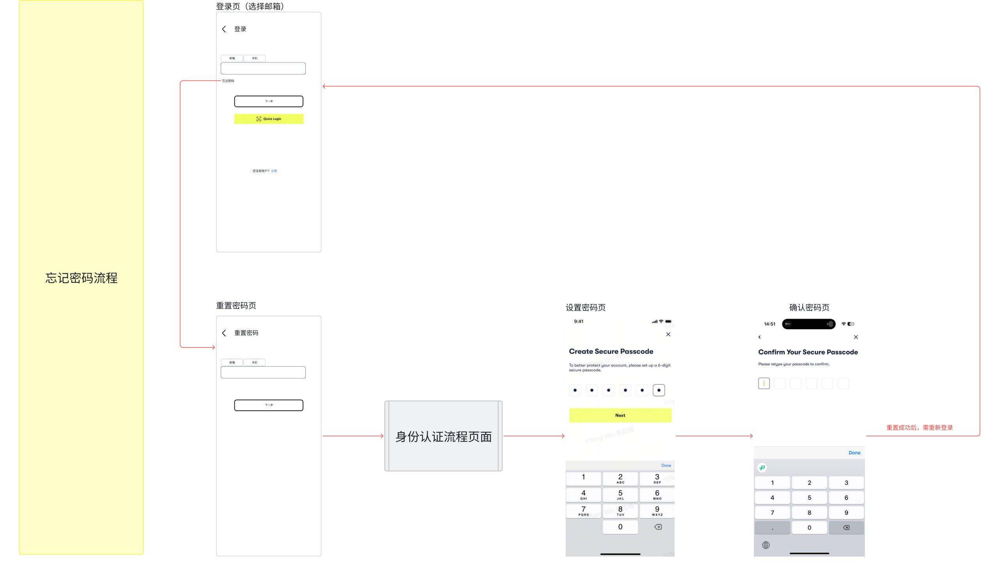
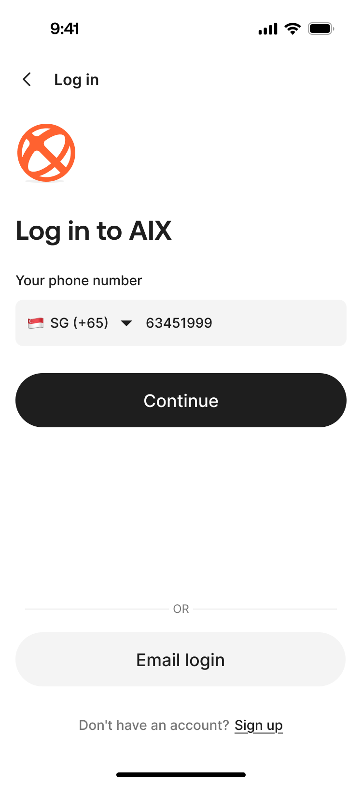

<!--
转换说明：本文件由 archive/historical-prd/card/AIX Card 注册登录需求V1.0 (2).docx 自动转换生成。
图片目录：assets/aix-card-registration-login-v1-0-2/
注意：Word 中复杂排版、浮动对象、批注/修订、文本框、SmartArt 等可能无法在 Markdown 中完全等价。
-->

__AIX Card 注册登录需求V1\.0__

1\. __需求变更日志__

变更时间

变更人

变更内容

备注

2025\-10\-21

@Yifeng Wu 吴忆锋

初稿

2025\-10\-28

@Yifeng Wu 吴忆锋

更正错误描述

@Dongjie Tan 谭东杰@Bowen Li \(Eli\)

2025\-10\-29

@Yifeng Wu 吴忆锋

登录密码调整：

- 旧规则：登录密码为6位数字；
- 新规则：登录密码为英文字母\+数字\+符号

@Dongjie Tan 谭东杰@Bowen Li \(Eli\)@Wei Sun 孙伟@XingBo Jie 揭兴波@Xin Wang 王鑫@Wei Li 李伟

2025\-10\-29

@Yifeng Wu 吴忆锋

@Dongjie Tan 谭东杰@Xin Wang 王鑫@Wei Li 李伟

目录调整（无功能调整）

- 注册流程和登录流程，原先放在统一规则下。
- 调整为分拆到注册功能和登录功能目录下

2025\-10\-29

@Yifeng Wu 吴忆锋

补充5分钟有效期描述

@Xin Wang 王鑫

2025\-10\-31

@Yifeng Wu 吴忆锋

# 1. 【注册页】支持大小写字母

@Yu Zhang 张豫

# 1. 【设置AIX Tag页】补充无网络描述

@Yu Zhang 张豫@Dongjie Tan 谭东杰

# 1. 【邮箱OTP页】

@Liang Wu 吴亮

# 1. 【邮箱OTP页】移至【身份认证模块】统一管理

[AIX Security 身份认证需求V1\.0](https://advancegroup.sg.larksuite.com/wiki/HdI2wMXXviIOOwkVJNjlWY35gSh#share-Rew8dANwFoaWYAxxL8NlWEr5gNb)

@Liang Wu 吴亮@Xin Wang 王鑫

2025\-11\-11

@Yifeng Wu 吴忆锋

【忘记密码流程页面】\-【功能说明】

补充忘记密码后，需要自动关闭bio

@Yu Zhang 张豫

2025\-11\-18

@Yifeng Wu 吴忆锋

以下本次需求变更，均用红色字体标记

# 1. __AIX Tag 设置流程调整__

- 原规则：注册过程中必须完成 Tag 设置，方可注册成功。
- 新规则：用户创建密码即视为注册成功，后续通过引导页可选设置 Tag；用户可跳过，不影响账户使用。
- 影响范围：
- 7\.1\.1 流程说明 → 调整注册主流程
- 7\.1\.2 页面概览 → 调整注册主流程
- 7\.1\.6 设置密码页 → 调整“创建密码 后即 注册成功”
- 7\.1\.7 设置 AIX Tag 页 → 改为可选引导页
- 7\.1\.8 设置 AIX Tag 成功页 → 移除该页面

# 1. __推荐码生成逻辑变更__

- 原规则：推荐码与用户设置的 AIX Tag 一致。
- 新规则：推荐码由系统独立生成，与 Tag 解耦（具体规则见 MGM 需求文档）。
- 影响范围：
- 7\.1\.4 注册页 → 调整推荐码的输入框校验规则。

# 1. __登录后 BIO 引导策略更新__

- 原规则：登录后自动启用 BIO（若设备支持）。
- 新规则：登录成功后，仅当用户未设置 BIO 时，展示引导页供其选择是否开启。
- 影响范围：
- 7\.2\.7 新增 Enable BIO Page（引导式非强制）。

# 1. __手机号国家/地区选择扩展__

- 原规则：仅支持 AU、PH、VN 三个国家/地区的区号。
- 新规则：支持全球国家/地区手机号选择。
- 影响范围：
- 7\.2\.4\.1 国家/地区页面 → 更新区号列表为全量国际选项。

2025\-11\-24

@Yifeng Wu 吴忆锋

登录后，设置Bio需进行身份认证：

@Dongjie Tan 谭东杰@Lei Zhang 张雷@Wei Sun 孙伟@Xin Wang 王鑫

2025\-12\-23

@Yifeng Wu 吴忆锋

@Dongjie Tan 谭东杰@Lei Zhang 张雷@Wei Sun 孙伟@Xin Wang 王鑫

因为DTC短信服务商不支持

2025\-12\-25

@Yifeng Wu 吴忆锋

补充当前事实逻辑

2025\-12\-26

@Yifeng Wu 吴忆锋

@yurong liu 刘玉荣@Lei Zhang 张雷

# 1. 补充逻辑：切换时保留填写内容不清空

# 1. Set Tag Page

旧规则：点击关闭按钮需弹窗挽留，且点击确认直接提交；

新规则：点击关闭直接进入首页，且点击确认，需用户再次确认；

2\. __引用资料__

__类型__

链接

PM

@Yifeng Wu 吴忆锋

Figma

https://www\.figma\.com/design/iDt3nk3jeLm8iGg91uvfVU/%E2%86%AA\-AIX\-Dev\-Handoff\-2025\-Q4?node\-id=520\-3281&t=dxVmtqdcRlhesw35\-1

翻译文案

[AIX 翻译文案管理\-多维表](https://advancegroup.sg.larksuite.com/wiki/Ah4UwdvDMiY19lkuMkwlHzWPgLd?from=from_copylink)

BRD

N/A

 技术方案

[AIX System Design v0\.1\(Draft\)](https://advancegroup.sg.larksuite.com/wiki/DHvYw3fRkiFYkRkiHK9lwSG4gnh)

3\. __需求索引__

__\[同步块\-无权限下载此内容\]__

2\. __项目概述__

2\.1 __项目背景__

为满足全球用户对一体化、便捷安全数字金融服务的需求，本项目旨在开发一款创新的移动应用。该应用将整合先进的支付与账户管理技术，致力于为用户提供全新的移动端金融管理体验。

2\.2 __项目目的__

# 1. 构建基础​：建立安全、便捷的用户注册登录与账户体系。
# 2. 核心功能​：实现充值、提现、转账、消费等关键支付功能。
# 3. 安全保障​：通过多层验证与风控策略，确保用户资产与信息安全。
# 4. 体验优化​：提供流畅直观的操作流程，提升用户留存。

2\.3 __名词解释__

__名词/缩写__

__说明__

DeviceID

用于唯一识别用户客户端的设备编号。用于实现设备绑定、可信设备判断及风险控制等。

IVS

Identity Verification Service，身份验证服务。

通常指用于进行高强度实名验证的服务（如证件识别、人脸比对等），在注册或敏感操作流程中可能被调用。

Biometric

通过用户的生物特征（如指纹、面部信息）进行身份验证的技术。支持iOS Face ID/Android指纹/人脸

AIX Tag

用户在AIX平台上的身份标识符。用于在转账、社交等场景中代替复杂的钱包地址，使用户能够被轻松找到和支付。此标识一旦设置，通常不可更改。

DTC

AIX项目的合作伙伴，提供加密钱包、卡片发行和KYC服务的后端平台，支持OpenAPI接口，用于处理交易、认证和账户管理。

AAI

第三方身份验证服务提供商，用于KYC流程中的护照上传、活体检测和人脸比对。支持Webhook回调和URL生成。

Master Account

DTC侧的账户概念，主账户，可申请API Key管理多个Sub Account。敏感操作需Sub Account授权。

Sub Account

DTC侧的账户概念，子账户，由Master创建，用于分离用户资产。KYC需独立完成。

WalletConnect

通过Deeplink/QR链接外部钱包充值。自动加白名单、交易报备，直接到账。

PIN

Personal Identification Number，卡片PIN码，用于线下交易。4位数字，支持Set/Change/Reset。

稳定币类型

稳定币类型USDC, USDT, FDUSD, WUSD，支持在BASE/BSC/ETHEREUM/SOLANA网络充值/转账/兑换。

区块链网络

支持的区块链网络，各网络币种不同（e\.g\., BASE: USDC）。包括：BASE, BSC, ETHEREUM, SOLANA

Global Travel Rule

全球旅行规则，合规要求，仅支持如Binance的白名单钱包充值。自动报备，无需声明。

3\. __项目计划__

[AIX项目管理表](https://advancegroup.sg.larksuite.com/sheets/RFR2sp4VGhbXVDtlnjTlwVsYgAb?from=from_copylink&sheet=z4hjo9)

4\. __功能结构__

5\. __国家线__

__VN__

__PH__

__AU__

✅

✅

✅

6\. __全局规则__

6\.1 __AIX验证场景说明__

[AIX验证场景维护](https://advancegroup.sg.larksuite.com/sheets/TuOisdYqgh2cfvtmbLalhQlpgxe?from=from_copylink)

6\.2 __账户说明__

规则说明

1\. __uid生成方式__

- 服务端在用户注册成功后生成 UID。

UID的生成规则由开发侧定义。产品侧的核心诉求是确保其具备良好的业务可用性。该UID将频繁用于客服（CS）、会员推荐（MGM）等需要人工记录与核对的场景，因此要求ID本身易于识别、记忆和沟通。\-\-营销侧有ID概念

2\. __账户状态__

- 共有3种状态【Active、Banned、Closed、Locked】

# 1. Active：

- 定义：账户正常使用中；
- 触发条件：注册成功后；

# 1. Banned：

- 定义：账户被限制使用；可恢复；
- 触发条件：风控触发对应规则，一期不支持；
- 限制：不可登录
- 解除方式：联系客服处理；

# 1. Closed

- 定义：账户被注销；不可恢复；
- 触发条件：风控触发对应规则/客服手动操作，一期不支持；
- 限制：不可登录，所有功能不可用；
- 解除方式：无法解除

# 1. Locked：

- 定义：因安全原因临时锁定；
- 触发条件：登录失败超过N次；
- 限制：不可登录
- 解除方式：
- __自动解除__：锁定时长到期后自动变为 Active。
- __自助解除__：用户通过“忘记密码”重置密码后立即解除。

3\. __登录失败锁定说明__

4\. __昵称规则__

- 注册成功后昵称自动生成，生成规则：随机4位英文\+随机6位数字。
- 需要用户手动设置，见需求[AIX Card ME模块需求V1\.0](https://advancegroup.sg.larksuite.com/wiki/PxXnwhWp6iWr7RkEYnwl0I6sgzc#share-HgbedqiQyobfikxEfD4luD2bgZg)

5\. __手机号/邮箱唯一性规则__

- 邮箱：全局唯一，不允许重复注册或绑定。
- 手机号：全局唯一，不允许重复注册或绑定。

6\. __设备绑定策略__

- 自动绑定：用户成功注册/登录后，系统自动将当前 Device ID 与账户绑定。
- 绑定数量限制：单个账户最多绑定 1 个deviceid。
- 最多允许 1 个设备同时在线。
- 仅当设备已绑定，登录时方可启用 Biometric 功能

7\. __需求描述__

7\.1 __注册功能__

7\.1\.1 __流程说明__

7\.1\.2 __页面概览__

7\.1\.3 __Navigation Page__

UX

Description

1\. __推广引导区__

- 一期写死，后续需在OBOSS配置实现

2\. __注册按钮__

- 点击Creat account按钮，跳转至[邮箱注册页](https://advancegroup.sg.larksuite.com/wiki/NerUwjf1kiLTOkk9uJClnSYZgCc#share-NbztdHKCvozvpmx16jIl5pISgYd)；
- 点击I already have an account按钮，跳转至[邮箱/手机登录页](https://advancegroup.sg.larksuite.com/wiki/NerUwjf1kiLTOkk9uJClnSYZgCc#share-NbztdHKCvozvpmx16jIl5pISgYd)；

7\.1\.4 __Registration Page__

UX

Description

1\. __Email输入框__

- 输入规则：
- 最长限制为103个字符，超出不可输入；
- 实时格式校验：
- 当格式不符合邮箱规范（如：缺少@符号、域名不完整）时，应提示：Email format is invalid 
- 当输入框为空时，应提示：Email should not be empty 

2\. __Referral code输入框__

- __格式规则__
- 长度限制：​ 总长度限制为3\-30个字符，提示：Please enter 3–30 letters or digits\.
- 类型限制，只能输入英文（区分大小写）\+数字，提示：Please enter 3–30 letters or digits\.

3\. __协议说明__

- 默认为不勾选状态
- 协议内容展示
- 内容来源：​ Terms of service与 Privacy Policy test的协议全文内容需从中台管理系统读取。
- 展示方式：​ 用户点击Terms of service或Privacy Policy test超链接文本时，系统需在页面内展示完整的协议内容。
- 协议链接：[https://advancegroup\.sg\.larksuite\.com/drive/folder/KcRtfsWfvl3BoMd48W1lbgcugcc](https://advancegroup.sg.larksuite.com/drive/folder/KcRtfsWfvl3BoMd48W1lbgcugcc)
- 快照保存：​ 当用户本次注册成功后，系统必须将用户所同意的 Terms of service & Privacy Policy test 的协议版本内容生成不可更改的快照​，并与用户账户绑定存储。
- 若后端报错，无法获取协议则toast提示：Something went wrong\. Please try again later

4\. __下一步按钮__

- 按钮变为可点击状态，必须同时满足以下两个条件：
- 邮箱格式有效​：邮箱输入框内容非空，且通过系统格式校验，无异常错误提示。
- 协议已同意​：所有必选的用户协议复选框均已被用户勾选。
- 正常流程​：用户点击后，系统执行注册流程，进入下一步流程邮箱OTP页。
- 异常处理：
- 若推荐码不存在​：提示：Referral code does not exist
- 若系统检测到所填邮箱已被注册，提示：This email has been used
- 频控：
- 同一个设备指纹总次数限制：5次 / 10分钟，超过后锁定 10分钟。toast提示：The system is busy, please try again later。
- 同一个IP单位时间内总次数限制：100次 / 10分钟，超过后锁定 10分钟。toast提示：The system is busy, please try again later。
- 接口总限流（研发定义）超过后，toast提示：The system is busy, please try again later。

5\. __登录按钮__

- 点击登录跳转到[邮箱/手机登录页](https://advancegroup.sg.larksuite.com/wiki/NerUwjf1kiLTOkk9uJClnSYZgCc#share-OMAIdTi8ko4LjVxr54elMWwFgfd)

7\.1\.5 __邮箱OTP验证页__

见[AIX Security 身份认证需求V1\.0](https://advancegroup.sg.larksuite.com/wiki/HdI2wMXXviIOOwkVJNjlWY35gSh#share-Rew8dANwFoaWYAxxL8NlWEr5gNb)

7\.1\.6 __Set Password Page__

UX

Description

1\. __返回按钮__

点击弹出挽留弹窗

- Title：Confirm Exit?
- Content: Are you sure you want to leave before verification is complete?
- Button:
- Stay and continue: 点击后关闭弹窗，停留在当前页；
- Leave: 点击后关闭弹窗，返回到入口页；

2\. __标题__

- 固定文案：设置密码

3\. __密码输入框__

3\.1 __输入规则__

- 长度限制​：最长输入32个字符。当用户输入超过32个字符时，前端应禁止其继续输入，并可在界面toast提示（如Toast提示“密码最长32个字符”）。
- 支持的字符类型​：
- 小写字母​：a \- z
- 大写字母​：A \- Z
- 数字​：0 \- 9
- 符号/特殊字符​：常见的标点符号和特殊字符，例如：\! @ \# $ % ^ & \* \( \) \_ \+ \- = \{ \} \[ \] | \\ : " ; ' < > ? , \. /等。
- 显示控制：
- 默认状态​：输入框内所有字符以密文（圆点•或星号\*）形式显示。
- 显示/隐藏切换​：输入框右侧必须提供“眼睛”图标。
- 图标为“闭眼”状态时，显示密文。
- 用户点击后，图标切换为“睁眼”状态，密码以明文显示。再次点击，恢复密文显示。
- 输入框失焦后校验
- 密码长度不足8位或超过32位。红字提示：Password must be between 8\-32 characters
- 密码长度符合，但不包含任何小写字母 \(a\-z\)。提示：Password must include a lowercase letter
- 密码长度符合，但不包含任何大写字母 \(A\-Z\)。提示：Password must include an uppercase letter
- 密码长度符合，但不包含任何数字 \(0\-9\)。提示：Password must include a number
- 密码长度符合，但不包含任何符号（如\!@\#$等）。提示：Password must include a supported symbol

4\. __Next按钮__

- 只有当错误提示信息消失（即所有校验均通过）时，“下一步”按钮才变为可点击状态
- 点击按钮，进入Re\-set Password Page

7\.1\.7 __Re\-enter Password Page__

UX

Description

1\. __返回按钮__

点击弹出挽留弹窗

- Title：Confirm Exit?
- Content: Are you sure you want to leave before verification is complete?
- Button:
- Stay and continue: 点击后关闭弹窗，停留在当前页；
- Leave: 点击后关闭弹窗，返回到入口页；

2\. __标题__

- 固定文案：设置密码

3\. __密码输入框__

3\.1 __输入规则__

- 长度限制​：最长输入32个字符。当用户输入超过32个字符时，前端应禁止其继续输入，并可在界面toast提示（如Toast提示“密码最长32个字符”）。
- 支持的字符类型​：
- 小写字母​：a \- z
- 大写字母​：A \- Z
- 数字​：0 \- 9
- 符号/特殊字符​：常见的标点符号和特殊字符，例如：\! @ \# $ % ^ & \* \( \) \_ \+ \- = \{ \} \[ \] | \\ : " ; ' < > ? , \. /等。
- 显示控制：
- 默认状态​：输入框内所有字符以密文（圆点•或星号\*）形式显示。
- 显示/隐藏切换​：输入框右侧必须提供“眼睛”图标。
- 图标为“闭眼”状态时，显示密文。
- 用户点击后，图标切换为“睁眼”状态，密码以明文显示。再次点击，恢复密文显示。
- 实时动态校验
- 密码长度不足8位或超过32位。提示：Password must be between 8\-32 characters
- 密码长度符合，但不包含任何小写字母 \(a\-z\)。提示：Password must include a lowercase letter
- 密码长度符合，但不包含任何大写字母 \(A\-Z\)。提示：Password must include an uppercase letter
- 密码长度符合，但不包含任何数字 \(0\-9\)。提示：Password must include a number
- 密码长度符合，但不包含任何符号（如\!@\#$等）。提示：Password must include a symbol

4\. __Next按钮__

- 只有当错误提示信息消失（即所有校验均通过）时，“下一步”按钮才变为可点击状态
- 点击按钮，系统完成密码设置，逻辑处理
- 两次密码不一致，提示：Passwords do not match\. Please try again\.
- 创建失败：​ 后端返回服务器错误，系统弹出错误提示弹窗：

__Title：__  
 Submission failed

__Content：__  
Something went wrong\. Please try again\.  
__ Try again Button__

- 点击后：重新提交。

__Leave Button：__

- 点击后：关闭弹窗，退出当前流程，返回业务流程入口页面。

- 创建成功：​ 系统完成账户注册流程，用户自动登录，并跳转至设置AIX Tag页。

7\.1\.8 __Set Tag Page__

UX

Description

1\. __主标题&副标题__

title：Create your X\-Tag

subtitle：Create a unique ID so others can easily send you funds\. This can't be changed later\.

2\. __AIX Tag格式规则__

- __格式规则__
- 组成结构：​ AIX Tag由固定前缀"@"和用户自定义部分组成。
- 字符集限制：​ 自定义部分仅支持大小写字母（a\-z）、数字（0\-9）、下划线（\_）和点号（\.）。
- 长度限制：​ 总长度限制为3\-30个字符（不含"@"前缀）。
- 格式约束：​
- 不能以下划线（\_）或点号（\.）结尾。
- 不允许连续出现两个下划线（\_）或 连续两个点号（\.）。
- 区分大小写
- *保留字限制：​ 禁止使用系统保留关键词：admin、support、api、null，此处不区分大小写；*
- __唯一性校验机制__
- *当用户输入内容后发起格式检查。若错误提示：*

Requirements:

\- Between 3\-30 characters

\- Use letters, numbers, underscores \(\_\), or periods \(\.\)

\- No double underscores or periods

\- Can't end with \_ or \.

\- Reserved words \(admin, support, api, null\) aren't allowed

- __校验结果处理：​​__
- 若Tag已被占用，系统返回"不可用"状态。
- 若Tag可用，系统返回"可用"状态。
- 若无网络：Toast提示：Please check your internet connection and try again\.

3\. __右上角关闭按钮__

- 点击关闭，进入app首页；

4\. __确认\-按钮__

- 初始状态为禁用（灰色）。仅当用户输入的字符符合格式要求，且Tag返回可用，则可点击；
- 点击后弹窗确认：

title：Confirm your X\-Tag

subtitle：Once confirmed, it cannot be changed\.
 Please make sure it’s exactly what you want\.

button：Confirm and Cancel

- 点击取消按钮，取消弹窗，停留在当前页面
- 点击confirm按钮，业务逻辑处理
- 用户点击可用状态的确认按钮后，系统提交AIX Tag创建请求。
- 唯一性校验：若该tag已存在，则提示：This tag is already taken\. Try another one\.
- 创建成功：​ 跳转至设置APP首页。
- 创建失败：​ 后端返回服务器错误，提示：Something went wrong\. Please try again later\.

7\.2 __登录功能__

7\.2\.1 __流程说明__

7\.2\.2 __页面概览__

7\.2\.3 __Natigation page__

复用[注册功能\-Natigation Page](https://advancegroup.sg.larksuite.com/wiki/NerUwjf1kiLTOkk9uJClnSYZgCc#share-CR79djZSFoOPiqxyd0PlogdNg8c)

7\.2\.4 __Login Page__

UX

Description

1\. __输入切换__

- 页面提供 ​“邮箱”​ 和 ​“手机号”​ 两种登录方式的切换能力。切换时能保留原填写内容；
- 默认选中 ​“邮箱”​ 方式。

2\. __邮箱输入框__

- 输入规则：​
- 输入内容最长限制为 254个字符。
- 校验规则：​
- 系统需对输入内容进行邮箱格式校验。
- 输入内容不能为空。
- 错误提示：​
- 若格式错误，提示：Email format is invalid。
- 若内容为空，提示：Email should not be empty。

3\. __手机号输入框（按国家/地区规则）​​ __

- 当用户选择“手机号”登录方式时，需显示国家/地区代码选择器及手机号输入框。
- __选择国际区号__
- 点击国际区号，进入Select Country Page
- __手机号输入__
- 输入限制：
- 仅允许输入数字；
- 长度限制：限制最长输入20位；

4\. __下一步按钮__

- 初始状态为禁用。仅当输入框内容不为空，且输入格式校验通过，变为可用；
- 点击按钮处理逻辑：
- 账号不存在或未注册：提示文案​：您输入的账号信息有误，请检查或注册新账号。
- 手机号少于6位：提示：Phone number must be at least 6 digits
- 账号被Banned：提示文案​：Account locked\. Please contact customer support\.
- 正常流程：自动跳转至 身份[验证流程页](https://advancegroup.sg.larksuite.com/wiki/NerUwjf1kiLTOkk9uJClnSYZgCc#share-DW1ydjiosoeIhKx7KqblPKc8g9b)；

5\. __Quick Login按钮__

- 显示条件：​ 
- 仅当App本地检测到存在可用的生物识别（Biometric）密钥信息时，才向用户展示此按钮。
- 功能逻辑：​ 
- 点击后触发生物识别登录流程，具体逻辑见独立的“[Biometric登录](https://advancegroup.sg.larksuite.com/wiki/NerUwjf1kiLTOkk9uJClnSYZgCc#share-BXoXdolJgouIdixDGMPlXI8ug0a)”章节。

7\.2\.4\.1 __Select Country Page__

UX

Description

1\. __页面规则   
__

- 点击打开国家列表，展示全部国家。
- 展示完整国家list参考，见[国家和地区list](https://advancegroup.sg.larksuite.com/wiki/IeKMw357ziJVjFkGTullgz1UgLe?from=from_copylink)；
- 国家list，后端需要隐藏中国和中国台湾选项；
- 列表排序规则
- 实现方式：采用组件new Intl\.Collator\('vi\-VN'\)\.compare

JavaScript：new Intl\.Collator\('vi\-VN'\)\.compare排序规则解释

# 1. 排序遵循越南语字母顺序

- 越南语有 29 个基础字母，顺序为：（__按照基本字母来分组__）  
A, Ă, Â, B, C, D, Đ, E, Ê, G, H, I, K, L, M, N, O, Ô, Ơ, P, Q, R, S, T, U, Ư, V, X, Y
- 注：Đ 是独立字母，排在 D 之后；Ă、Â、Ê、Ô、Ơ、Ư 都是独立字母，不等同于 A 或 E。

# 1. 相同词根的国家名连续排列

- 例如：如果存在 ba、bà、bá 等（仅声调不同），它们应紧挨着排在一起，不能被其他词（如 ban）插在中间。

# 1. 禁止逐字完全比较（如先比第一个字的所有属性）

- 必须采用 “整串先比基础字母 → 再比声调” 的方式，这是国际标准（Unicode 排序算法）。

2\. __常用地区__

显示常用国家地区，固定为：澳大利亚、新加坡、菲律宾、越南

7\.2\.5 __Biometric登录__

__模块__

__UXUI__

__需求说明__

__iOS人脸__

- 点击「Quick Login」，拉起设备人脸验证
- 判断是否验证通过：
- 设备端验证通过，则进行后端验证
- 后端验证成功，进入下一步流程，并使用biometric签名请求身份认证；
- 后端验证失败，则弹窗提示错误信息引导跳转至输入手机号页面（见左图），同时清除本地Bio信息，后端关闭该账户Bio开关（引导用户重新设置Bio）
- 设备端验证失败，则弹窗提示
- 失败单数次的弹窗为系统弹窗，按钮展示为「Try FaceID Again」和「Cancel」；
- 点击「Try FaceID Again」，重新拉起Bio验证；
- 点击「Cancel」，关闭弹窗回到邮箱/手机登录页；
- 失败双数次的弹窗按钮展示为「Cancel」和「Use Other Methods」
- 点击「Cancel」，关闭弹窗回到邮箱/手机登录页；
- 点击「Use Other Methods」，跳转至邮箱/手机登录页；

__iOS指纹__

- 点击「Quick Login」，拉起设备指纹验证
- 判断是否验证通过：
- 设备端验证通过，则进行后端验证
- 后端验证成功，进入下一步流程，并使用biometric签名请求身份认证；
- 后端验证失败，则弹窗提示错误信息引导跳转至输入手机号页面（见左图），同时清除本地Bio信息，后端关闭该账户Bio开关（引导用户重新设置Bio）
- 设备端验证失败，则弹窗提示
- 失败1次（每轮）的弹窗为系统弹窗，按钮展示为「Cancel」；
- 点击「Cancel」，关闭弹窗回到邮箱/手机登录页；
- 失败2次（每轮）的弹窗按钮展示为「Cancel」和「Use another method」
- 点击「Cancel」，关闭弹窗回到邮箱/手机登录页；
- 点击「Use another method」，跳转至邮箱/手机登录页；
- 失败5次（第3轮第一次）时，系统提示指纹被锁，引导用户使用其他方式。

__Android人脸__

- 点击「Quick Login」，拉起设备人脸验证
- 判断是否验证通过：
- 设备端验证通过，则进行后端验证
- 后端验证成功，进入下一步流程，并使用biometric签名请求身份认证；
- 后端验证失败，则弹窗提示错误信息引导跳转至输入手机号页面（见左图），同时清除本地Bio信息，后端关闭该账户Bio开关（引导用户重新设置Bio）
- 设备端验证失败，则弹窗提示
- 安卓失败弹窗为系统弹窗，以各机型实际展示为准；
- 不限制失败次数，以各机型实际限制为准；
- 若失败次数大于设备限制次数，则弹窗提示错误信息，点击「Use another method」跳转至输入手机号页面，同时前端清除本地Bio信息并隐藏「Quick Login」按钮。

__Android指纹__

- 点击「Quick Login」，若协议已全部勾选，则拉起设备人脸验证
- 判断是否验证通过：
- 设备端验证通过，则进行后端验证
- 后端验证成功，进入下一步流程，并使用biometric签名请求身份认证；
- 后端验证失败，则弹窗提示错误信息引导跳转至输入手机号页面（见左图），同时清除本地Bio信息，后端关闭该账户Bio开关（引导用户重新设置Bio）
- 设备端验证失败，则弹窗提示
- 安卓失败弹窗为系统弹窗，以各机型实际展示为准；
- 不限制失败次数，以各机型实际限制为准；
- 若失败次数大于设备限制次数，则弹窗提示错误信息，点击「Use another method」跳转至输入手机号页面，同时前端清除本地Bio信息并隐藏「Quick Login」按钮。

7\.2\.6 __身份验证流程页面__

见[AIX Security 身份认证需求V1\.0](https://advancegroup.sg.larksuite.com/wiki/HdI2wMXXviIOOwkVJNjlWY35gSh#share-Rew8dANwFoaWYAxxL8NlWEr5gNb)

7\.2\.7 __Enable BIO page__

UX

Description

1\. __页面规则__

- 用户登录成功后，系统将检测其生物识别（BIO）状态：
- 若未启用BIO：则引导用户进入此功能启用页面。
- 若已启用BIO：则跳过此页面，直接进入APP首页。
- 若用户未在手机系统中开启人脸或指纹识别功能，则登录成功后 不弹出生物识别引导页，直接进入首页

2\. __关闭按钮__

点击关闭按钮，直接进入APP首页，并toast提示：Login success

3\. __图片&标题&副标题__

固定文案

4\. __Enable now按钮__

- 点击按钮，检测设备生物识别权限状态

知识点：是否需授权由设备校验，ios需授权，安卓不需要授权

- 已授权：直接调起生物认证流程
- 未授权：弹窗引导至系统权限设置
- 特殊处理：
- 需调用身份认证接口
- 用户在完成手动登录后的5分钟内，无需再次进行身份验证
- 用户在完成手动登录后的5分钟后，需要进行身份验证后再继续设置

7\.3 __忘记密码流程页面__

7\.3\.1 __功能说明__

当用户重置密码后，需要清除BIO信息，已开启的BIO需要自动关闭。

7\.3\.2 __页面概览__

7\.3\.3 __Reset Password Page 重置密码页__

UX

Description

1\. __返回按钮__

点击返回上一级页面

1\. __输入切换__

- 页面提供 ​“邮箱”​ 和 ​“手机号”​ 两种登录方式的切换能力。切换时能保留原填写内容；
- 默认选中 ​“邮箱”​ 方式。

2\. __邮箱输入框__

- 输入规则：​
- 输入内容最长限制为 254个字符。
- 校验规则：​
- 系统需对输入内容进行邮箱格式校验。
- 输入内容不能为空。
- 错误提示：​
- 若格式错误，提示：Email format is invalid。
- 若内容为空，提示：Email should not be empty。

3\. __手机号输入框（按国家/地区规则）​​ __

- 当用户选择“手机号”登录方式时，需显示国家/地区代码选择器及手机号输入框。
- __选择国际区号__
- 点击国际区号，进入Select Country Page
- __手机号输入__
- 输入限制：
- 仅允许输入数字；
- 长度限制：限制最长输入20位；

  
同步自文档: [https://advancegroup\.sg\.larksuite\.com/docx/Sy4TdCxUFoCEWbxdcoQlBgzhgfh\#YcAHdATXJszfE4b7oBtlyplGg3g](https://advancegroup.sg.larksuite.com/docx/Sy4TdCxUFoCEWbxdcoQlBgzhgfh#YcAHdATXJszfE4b7oBtlyplGg3g)

2\. __下一步按钮__

- 初始为灰色不可点击；当输入合法且非空时高亮可点击。
- 点击进入身份验证流程页面

7\.3\.4 __身份验证流程页面__

见[AIX Security 身份认证需求V1\.0](https://advancegroup.sg.larksuite.com/wiki/HdI2wMXXviIOOwkVJNjlWY35gSh#share-Rew8dANwFoaWYAxxL8NlWEr5gNb)

7\.3\.5 __设置密码页__

- __功能说明：__

复用[设置密码页](https://advancegroup.sg.larksuite.com/wiki/NerUwjf1kiLTOkk9uJClnSYZgCc#share-PbGmdh1tooTDcFxFSc1lTbU1ggh)模块

- __安全规则：__

密码重置成功后，系统将强制登出当前账户，用户需使用新密码重新登录。

8\. __待定事项__

- 手机国际区号调整
- 设备采集\-\-mvp不做
- 邀请码需要单独自动生成code
- 登录时，如果手机号或邮箱不存在，需要提示
