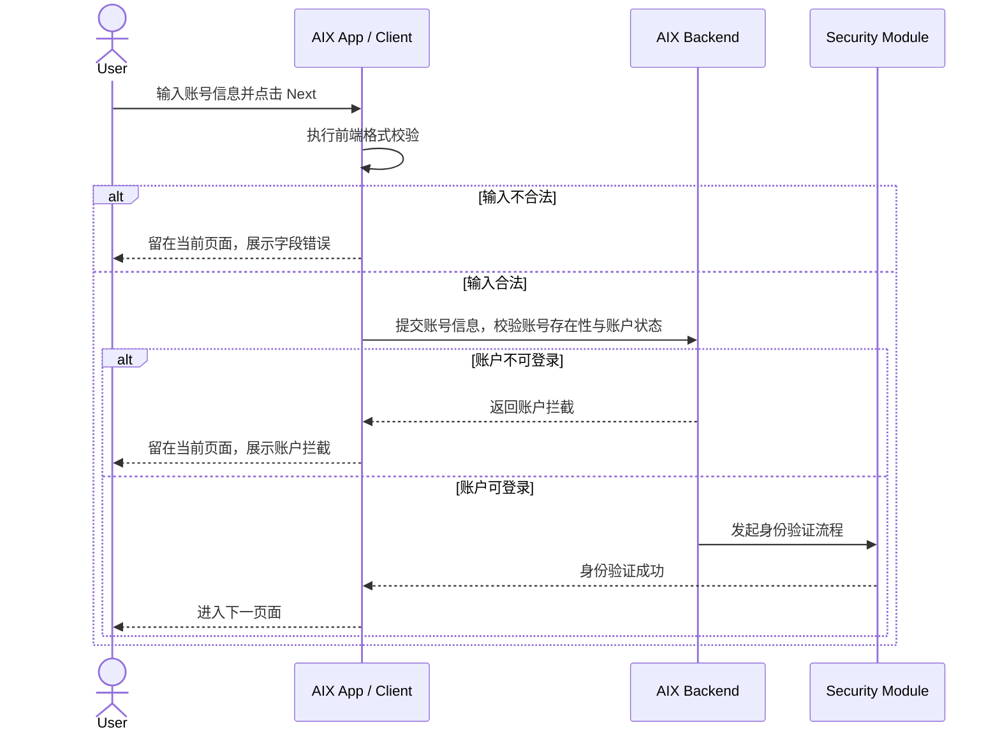
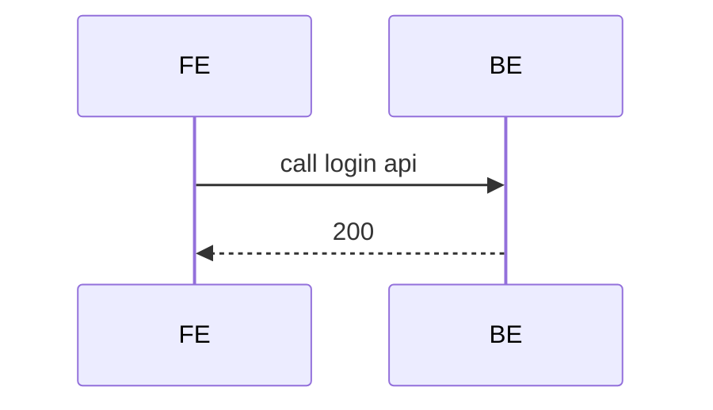

# Writing Standard 知识库写作规范

## 1. 写作原则

- 只写事实，不写推测。
- 先写业务规则，再写页面表现。
- 涉及资金、账户、卡、交易、KYC 时，必须写风控 / 合规边界。
- 页面截图可以保留，但规则必须文字化。
- 流程必须可被 UI、开发、测试、业务和 AI 共同理解。
- 页面关系不得只依赖原始 PRD 截图，必须使用结构化文本或 Mermaid 表达。
- 功能正文是事实来源，不写评审型内容；待确认事项统一进入 `knowledge-base/changelog/knowledge-gaps.md`。

## 2. 标准章节

每个核心功能文件应包含：

1. 功能定位
2. 适用范围
3. 前置条件
4. 业务流程
5. 页面关系总览
6. 页面卡片与交互规则
7. 字段与接口依赖
8. 异常与失败处理
9. 风控 / 合规边界
10. 来源引用

如存在不确定点、文档冲突、原文疑似错误，不在功能正文中展开，统一记录到 `knowledge-base/changelog/knowledge-gaps.md`。

## 3. 表达规则

- 状态、字段、接口名必须使用标准名称。
- 同一概念不得多种说法混用。
- 异常处理必须写清触发条件、用户提示、系统动作、最终状态。
- 状态机必须写清是否终态。
- 文档缺口必须明确标注，不得把推测写成事实。
- 功能文件不写“多角色阅读视角”，不写评审结论，不写方案比选过程。

## 4. 流程表达规范

### 4.1 流程表达定位

业务流程图用于表达产品业务流程和系统交互，不用于替代页面概览图。

- 页面跳转关系：放在“页面关系总览”。
- 系统交互过程：放在“业务流程”。
- 页面元素规则：放在“页面卡片与交互规则”。
- 详细校验、系统动作、成功/失败结果：放在“业务逻辑矩阵”。

### 4.2 强制形式

所有核心业务流程统一使用 Mermaid `sequenceDiagram`。

禁止在最终正文中保留：

- ASCII 泳道图。
- 伪时序图。
- 多方案并存。
- “试验版”“方案 A / B / C”等过程性标记。

允许补充简单文本主链路，但主交互图必须使用 Mermaid 时序图。

### 4.3 写法原则

形式使用时序图，表达方式采用职能泳道图的业务语言。

也就是说：

- 图形结构按时间顺序展开。
- 参与方按职责分层。
- 文案写“参与方做了什么业务动作”，不写纯技术调用名。
- 每个异常分支必须写清失败落点。

推荐写法：



不推荐写法：



原因：该写法只表达技术调用，缺少业务动作、校验意图、异常落点，不能作为产品事实知识库。

### 4.4 标准参与方

常用参与方命名如下：

| 参与方 | 使用场景 | 说明 |
|---|---|---|
| User | 用户动作 | 点击、输入、选择、确认、关闭 |
| Client / AIX App | 前端 / App | 页面展示、输入校验、弹窗、Toast、设备能力判断 |
| Backend / AIX Backend | 后端服务 | 账号校验、状态校验、业务提交、状态查询 |
| Security Module | 身份认证 | OTP、Email OTP、Login Passcode、Biometric、认证失败/锁定 |
| Device OS | 设备系统能力 | Face ID、Touch ID、Android Fingerprint、Android Face |
| DTC / AAI / Third Party | 外部系统 | KYC、发卡、钱包、渠道服务、第三方能力 |

参与方不得随意变体。例如同一文件中不得混用 `BE`、`Backend`、`Server` 表达同一系统。

### 4.5 分支与异常规则

时序图必须覆盖：

- 主流程成功路径。
- 前端校验失败。
- 后端校验失败。
- 外部系统失败。
- 身份认证失败或锁定。
- 最终页面落点或状态落点。

Mermaid 中统一使用 `alt / else / end` 表达分支。

异常分支写法必须包含三要素：

```text
失败原因 → 系统动作 → 用户/状态落点
```

示例：

```text
Account not found → 返回账号错误 → 留在 Login Page，展示账号错误
```

禁止只写：

```text
失败 → 提示错误
```

### 4.6 子流程拆分规则

单个 Mermaid 图过长时，应按业务子链路拆分，但仍放在同一章节下。

推荐拆法：

```text
A. Manual Login
B. Quick Login
C. Enable BIO
```

每个子链路必须独立可读，并能与业务逻辑矩阵互相对应。

## 5. 页面关系与截图规则

### 5.1 页面关系总览

页面概览不得只使用原始 PRD 截图表达。

凡涉及页面跳转、页面关系、弹窗关系、返回关系、异常分支，必须用“页面关系总览”表格表达。

推荐字段：

```markdown
| 当前页面 / 能力 | 页面目的 | 用户动作 / 触发条件 | 下一步 | 说明 |
|---|---|---|---|---|
```

页面关系总览只说明页面之间的入口、出口和跳转关系，不展开系统校验细节。

### 5.2 原始 PRD 页面概览截图

原始 PRD 页面概览截图可以保留，但只能作为追溯证据，不作为主要规则表达。

推荐写法：

```markdown
## 原始 PRD 参考截图

> 以下截图来自原始飞书 PRD，仅用于追溯原始设计上下文。  
> 页面关系以本文“页面关系总览”和结构化规则为准。
```

### 5.3 单页截图

具体页面截图可以保留，但必须配套结构化页面元素表。

```markdown
| 元素 | 类型 | 展示条件 | 交互规则 | 异常 |
|---|---|---|---|---|
| TBD | TBD | TBD | TBD | TBD |
```

## 6. 来源引用规则

功能文件必须在末尾保留来源引用。

引用格式：

```text
- (Ref: 文档名 / 章节 / 版本)
```

如引用知识库内部文件，使用：

```text
- (Ref: knowledge-base/security/biometric-verification.md)
```

如正文引用了不确定点，必须指向：

```text
- (Ref: knowledge-base/changelog/knowledge-gaps.md / 对应模块 / 日期)
```
