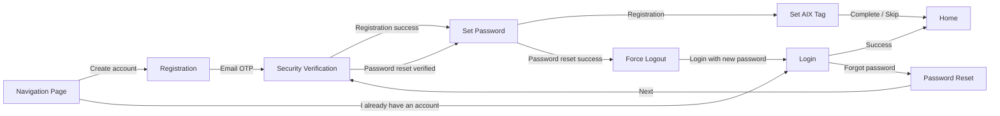

# Account 账户模块

## 1. 模块定位

Account 模块沉淀 AIX 用户账户体系事实，覆盖注册、登录、密码重置、基础账户状态、唯一性和设备绑定规则。

本模块是 Wallet、Card、Transaction 等后续业务模块的账户前置基础。

## 2. 功能清单

| 功能 | 文件 | 状态 | 说明 | 来源 |
|---|---|---|---|---|
| Registration | [registration.md](./registration.md) | active | 邮箱注册、Email OTP、设置密码、设置 AIX Tag | AIX Card 注册登录需求V1.0 / 7.1 |
| Login | [login.md](./login.md) | active | Email / Phone 登录、Quick Login、Enable BIO | AIX Card 注册登录需求V1.0 / 7.2 |
| Password Reset | [password-reset.md](./password-reset.md) | active | 重置密码、身份验证、BIO 清理、强制登出 | AIX Card 注册登录需求V1.0 / 7.3 |

## 3. 适用范围

| 维度 | 规则 | 来源 | 备注 |
|---|---|---|---|
| 国家 / 地区 | VN / PH / AU | AIX Card 注册登录需求V1.0 | 需同步至 `_meta/countries-and-regions.md` |
| 账户状态 | Active / Locked / Banned / Closed | AIX Card 注册登录需求V1.0 / 5.2 账户说明 | 统一见 `_meta/status-dictionary.md` |
| 设备绑定 | 单账户最多绑定 1 个 Device ID，最多允许 1 个设备同时在线 | AIX Card 注册登录需求V1.0 / 5.2.6 设备绑定策略 | BIO 启用依赖设备绑定 |
| 唯一性 | 邮箱、手机号全局唯一 | AIX Card 注册登录需求V1.0 / 5.2.5 | 不允许重复注册或绑定 |

## 4. 模块依赖

| 依赖对象 | 依赖内容 | 说明 |
|---|---|---|
| `_meta/status-dictionary.md` | Account Status | 账户状态统一定义 |
| `_meta/countries-and-regions.md` | 国家线 | VN / PH / AU 支持范围 |
| `security/global-rules.md` | 认证方式、认证有效期、场景矩阵 | 注册、登录、密码重置依赖身份认证能力 |
| `security/email-otp-verification.md` | Email OTP | 注册、密码重置依赖 |
| `security/otp-verification.md` | SMS OTP | 登录、密码重置等场景可依赖 |
| `security/login-passcode-verification.md` | Login Passcode | 登录与敏感操作认证依赖 |
| `security/biometric-verification.md` | Biometric | Quick Login、Enable BIO、密码重置后 BIO 清理依赖 |

## 5. 核心流程总览

## 6. 账户状态总览

| 状态 | 定义 | 触发条件 | 限制 | 解除方式 | 是否终态 |
|---|---|---|---|---|---|
| Active | 账户正常使用中 | 注册成功后 | 无 | - | 否 |
| Locked | 因安全原因临时锁定 | 登录失败超过阈值 | 不可登录 | 锁定到期或按安全规则处理 | 否 |
| Banned | 账户被限制使用，可恢复 | 风控触发对应规则，一期不支持 | 不可登录 | 联系客服处理 | 否 |
| Closed | 账户被注销，不可恢复 | 风控触发对应规则 / 客服手动操作，一期不支持 | 不可登录，所有功能不可用 | 无法解除 | 是 |

## 7. 字段与规则总览

| 规则 / 字段 | 规则内容 | 影响范围 | 来源 |
|---|---|---|---|
| UID | 服务端在用户注册成功后生成 | 全局账户识别 | AIX Card 注册登录需求V1.0 / 5.2.1 |
| 昵称 | 注册成功后自动生成：随机 4 位英文 + 随机 6 位数字 | ME 模块可修改 | AIX Card 注册登录需求V1.0 / 5.2.4 |
| 邮箱唯一性 | 邮箱全局唯一，不允许重复注册或绑定 | 注册 / 绑定邮箱 | AIX Card 注册登录需求V1.0 / 5.2.5 |
| 手机号唯一性 | 手机号全局唯一，不允许重复注册或绑定 | 登录 / 绑定手机号 | AIX Card 注册登录需求V1.0 / 5.2.5 |
| Device ID | 注册 / 登录成功后自动绑定当前 Device ID | 登录 / BIO | AIX Card 注册登录需求V1.0 / 5.2.6 |
| AIX Tag | 注册后可设置唯一 ID，用于他人转账识别 | 注册 / 收款 / 转账 | AIX Card 注册登录需求V1.0 / 7.1.8 |

## 8. 异常与失败处理总览

| 场景 | 触发条件 | 用户提示 / 系统动作 | 来源 |
|---|---|---|---|
| 邮箱已注册 | 注册时输入已存在邮箱 | `This email has been used` | registration.md |
| 推荐码不存在 | 注册时输入无效 Referral code | `Referral code does not exist` | registration.md |
| 登录账号不存在 / 未注册 | 登录时账号不存在 | 保留原文提示，见 login.md | login.md |
| 账户不可登录 | Banned / Closed / Locked | 阻止登录 | login.md / status-dictionary.md |
| 密码重置成功 | 用户完成重置密码 | 强制登出，清除 BIO，关闭已开启 BIO | password-reset.md |

## 9. 风控 / 合规边界

| 边界 | 规则 | 影响范围 | 来源 |
|---|---|---|---|
| 账户唯一性 | 邮箱、手机号全局唯一 | 防重复账户 / 绑定冲突 | AIX Card 注册登录需求V1.0 / 5.2.5 |
| 设备绑定 | 单账户单设备绑定与单设备在线 | 登录安全 / BIO 前提 | AIX Card 注册登录需求V1.0 / 5.2.6 |
| 账户状态拦截 | Banned / Closed / Locked 均影响登录能力 | 登录与后续业务入口 | AIX Card 注册登录需求V1.0 / 5.2.2 |
| 身份认证 | 注册、登录、密码重置依赖 Security 模块 | 账户安全 | AIX Security 身份认证需求V1.0 |
| BIO 清理 | 密码重置成功后清除 BIO 并关闭已开启 BIO | 防止旧认证链路继续用于快捷登录 | AIX Card 注册登录需求V1.0 / 7.3.1 |

## 10. 来源引用

- (Ref: 历史prd/AIX Card 注册登录需求V1.0 (2).docx / 5.2 账户说明 / V1.0)
- (Ref: 历史prd/AIX Card 注册登录需求V1.0 (2).docx / 7.1 注册功能 / V1.0)
- (Ref: 历史prd/AIX Card 注册登录需求V1.0 (2).docx / 7.2 登录功能 / V1.0)
- (Ref: 历史prd/AIX Card 注册登录需求V1.0 (2).docx / 7.3 忘记密码流程页面 / V1.0)
- (Ref: knowledge-base/account/registration.md)
- (Ref: knowledge-base/account/login.md)
- (Ref: knowledge-base/account/password-reset.md)
- (Ref: knowledge-base/security/global-rules.md)
- (Ref: knowledge-base/changelog/knowledge-gaps.md / Account / 2026-05-01)
