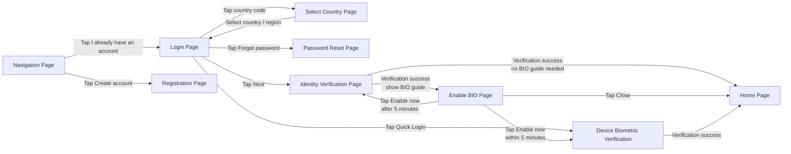

# Login 登录功能 - 可读性结构副本

> 本文件是 `login.md` 的结构化可读性副本，用于对比新的 Page 章节写法。  
> 原始事实以 `knowledge-base/account/login.md` 为准；本文件不替代正式事实源。

## 1. 文档定位

本文用于说明已注册用户如何通过 Email、Phone 或 Quick Login 登录 AIX App，并说明登录过程中涉及的页面、用户动作、系统处理、异常边界和外部依赖。

本文不维护 Security 模块的完整认证规则。OTP、Email OTP、Login Passcode、Biometric 认证失败、锁定、有效期等细节以 `knowledge-base/security/*` 为准。

---

## 2. 适用范围

| 维度 | 规则 |
|---|---|
| 用户状态 | 已注册用户可进入登录流程；未注册用户应走 Registration |
| 账户状态 | Active 可继续登录；Banned / Closed / Locked 等异常状态应被拦截 |
| 登录方式 | Email / Phone / Quick Login |
| Phone 国家 / 地区选择 | Phone 登录时选择 Country Code；中国和中国台湾选项后端隐藏 |
| 身份认证 | Email / Phone 登录成功前需进入 Security 身份验证流程 |
| Biometric | 支持 iOS Face ID / Touch ID、Android Face / Fingerprint |
| Enable BIO | 登录成功后，若用户未启用 BIO 且设备支持，则引导用户开启 |

---

## 3. 用户侧页面关系总览图

> 本图只表达页面之间的主关系。输入校验、账户拦截、认证失败、Biometric 失败等细节放在具体页面说明中。

---

## 4. 页面说明

### 4.1 Navigation Page

> 用户在未登录状态下选择注册或登录。

#### 页面摘要

- **页面类型**：AIX App 主页面
- **入口 / 触发**：App 未登录启动 / 用户退出登录后
- **页面目标**：引导用户选择注册或登录
- **可去向页面**：
  - Login Page
  - Registration Page

#### 用户动作与页面去向

| 用户动作 | 系统处理 | 去向 |
|---|---|---|
| 点击 `I already have an account` | 进入登录流程 | Login Page |
| 点击 `Create account` | 进入注册流程 | Registration Page |

#### 核心规则

1. Navigation Page 复用 Registration 的 Navigation Page。
2. 本文只维护进入 Login 的分支；注册规则见 `registration.md`。

---

### 4.2 Login Page

> 用户通过 Email / Phone / Quick Login 发起登录。

<table>
<tr>
<td width="38%" valign="top">

#### 页面截图

</td>
<td width="62%" valign="top">

#### 读者需要知道

- **入口**：Navigation Page 点击 `I already have an account`
- **主路径**：输入 Email / Phone → 点击 `Next` → Identity Verification Page
- **其他路径**：
  - 点击 Country Code → Select Country Page
  - 点击 `Forgot password` → Password Reset Page
  - 点击 `Quick Login` → Device Biometric Verification
  - 点击 `Sign up` → Registration Page
- **关键规则**：
  - Email / Phone 切换时保留已输入内容
  - Email 最长 254 字符
  - Phone 仅数字，最长 20 位；少于 6 位提示错误
  - Quick Login 仅本地存在可用 BIO 密钥时展示
- **边界**：Security 认证细节不在本页维护，以 `security/*` 为准

</td>
</tr>
</table>

#### 用户动作与页面去向

| 用户动作 | 系统处理 | 去向 |
|---|---|---|
| 点击 Back | 返回上一级页面 | Navigation Page |
| 切换 Email / Phone | 切换登录账号输入方式，并保留原填写内容 | Login Page |
| 点击 Country Code | 打开国家 / 地区区号选择页 | Select Country Page |
| 输入 Email / Phone，点击 `Next` | 校验输入格式、账号是否存在、账户状态是否允许登录 | Identity Verification Page / Login Page |
| 点击 `Quick Login` | 调起设备生物识别验证 | Device Biometric Verification |
| 点击 `Forgot password` | 进入密码找回流程 | Password Reset Page |
| 点击 `Sign up` | 进入注册流程 | Registration Page |

#### 核心规则

1. 用户可通过 **Email / Phone / Quick Login** 发起登录。
2. Email / Phone 默认选中 **Email**。
3. Email / Phone 切换时，保留用户已填写内容。
4. `Next` 仅在输入非空且格式合法后可继续。
5. Email 登录账号最长 **254 字符**。
6. Phone 登录账号仅允许输入数字，最长 **20 位**。
7. Phone 少于 6 位时提示：`Phone number must be at least 6 digits`。
8. 账号不存在、未注册或账户状态不可登录时，不进入身份验证流程。
9. Quick Login 仅在 App 本地检测到可用 Biometric 密钥时展示。
10. Security 认证细节不在 Login Page 中展开，以 `security/*` 为准。

#### 元素明细

| 元素 | 类型 | 展示条件 | 交互 / 校验规则 | 成功结果 | 失败 / 提示 | 后续流转 |
|---|---|---|---|---|---|---|
| Back | Button | 页面展示时 | 点击返回上一级页面 | 返回上一级页面 | 无 | Navigation Page |
| Email / Phone 切换 | Tab | 默认展示 | 默认选中 Email；切换时保留输入内容 | 切换登录方式 | 无 | Login Page |
| Email 输入框 | TextInput | Email tab | 非空、邮箱格式校验；最长 254 字符 | 可点击 Next | `Email format is invalid` / `Email should not be empty` | Identity Verification Page / Login Page |
| Country Code | Selector | Phone tab | 点击进入国家 / 地区选择页 | 选择区号 | 无 | Select Country Page |
| Phone 输入框 | TextInput | Phone tab | 仅允许数字；最长 20 位；不少于 6 位 | 可点击 Next | `Phone number must be at least 6 digits` | Identity Verification Page / Login Page |
| Next | Button | 输入合法且非空 | 点击后校验账号和账户状态 | 进入身份验证 | 账号不存在 / 账户不可登录时展示错误 | Identity Verification Page / Login Page |
| Quick Login | Button | 本地存在可用 BIO 密钥 | 点击后拉起设备生物识别 | 进入 Home 或后续登录流程 | 按 Biometric 规则处理 | Device Biometric Verification |
| Forgot password | Link / Button | 页面展示时 | 点击进入找回密码流程 | 进入 Password Reset | 无 | Password Reset Page |
| Sign up | Link / Button | 页面展示时 | 点击进入注册流程 | 进入 Registration | 无 | Registration Page |

#### 异常与边界

| 场景 | 页面表现 | 系统处理 | 最终状态 |
|---|---|---|---|
| 输入为空 | `Next` 不可用 | 不发起登录 | 留在 Login Page |
| Email 格式不合法 | 展示 Email 格式错误 | 阻止继续 | 留在 Login Page |
| Phone 少于 6 位 | 展示手机号长度错误 | 阻止继续 | 留在 Login Page |
| 账号不存在 / 未注册 | 展示账号错误提示 | 阻止进入身份验证 | 留在 Login Page |
| 账户 Banned / Closed / Locked | 展示账户拦截提示 | 阻止登录 | Login Page / Security Handling |
| Quick Login 失败 | 展示 Biometric 失败提示或引导其他方式登录 | 按 Biometric 规则处理 | Login Page / Security Handling |

---

### 4.3 Select Country Page

> 用户在 Phone 登录时选择国家 / 地区区号。

#### 页面摘要

- **页面类型**：AIX App 主页面
- **入口 / 触发**：Login Page Phone tab 点击 Country Code
- **页面目标**：选择手机号国家 / 地区区号
- **可去向页面**：Login Page

#### 页面截图

#### 页面内容

- 国家 / 地区列表
- 常用地区
- 搜索或列表选择能力，如页面实现提供

#### 用户动作与页面去向

| 用户动作 | 系统处理 | 去向 |
|---|---|---|
| 选择国家 / 地区 | 返回 Login Page，并带回所选 Country Code | Login Page |

#### 核心规则

1. 国家列表展示全部国家 / 地区。
2. 中国和中国台湾选项需要隐藏。
3. 排序采用 `new Intl.Collator('vi-VN').compare`。
4. 常用地区固定展示澳大利亚、新加坡、菲律宾、越南。

---

### 4.4 Identity Verification Page

> 用户在 Email / Phone 登录前完成必要身份验证。

#### 页面摘要

- **页面类型**：Security 认证流程
- **入口 / 触发**：Login Page 输入合法，账号存在且账户状态允许登录
- **页面目标**：完成登录前身份验证
- **可去向页面**：
  - Home Page
  - Enable BIO Page
  - Login Page / Security Handling

#### 用户动作与页面去向

| 用户动作 / 结果 | 系统处理 | 去向 |
|---|---|---|
| 完成身份验证 | 完成登录 / 创建会话，并判断 BIO 状态 | Home Page / Enable BIO Page |
| 身份验证失败 / 锁定 | 按 Security 规则处理 | Security Handling / Login Page |

#### 核心规则

1. Login 不维护 OTP、Email OTP、Login Passcode、BIO 认证的完整规则。
2. 登录场景支持的认证方式以 Security 模块为准。
3. Bio 登录场景可跳过后续认证。

---

### 4.5 Device Biometric Verification / Quick Login

> 用户通过设备生物识别完成快捷登录，或在 Enable BIO 流程中完成设备验证。

#### 页面摘要

- **页面 / 能力类型**：系统生物识别能力 / 快捷登录能力
- **入口 / 触发**：
  - Login Page 点击 `Quick Login`
  - Enable BIO Page 点击 `Enable now`
- **页面目标**：通过设备生物识别完成快捷登录或 BIO 设置
- **可去向页面**：
  - Home Page
  - Login Page / Security Handling

#### 页面截图

#### 用户动作与页面去向

| 用户动作 / 结果 | 系统处理 | 去向 |
|---|---|---|
| 点击 `Quick Login` 并通过设备验证 | 后端进行 biometric 验证和签名认证 | Home Page |
| 点击 `Enable now` 并通过设备验证 | 后端启用 BIO / 绑定 biometric credential | Home Page |
| 设备端验证失败 | 按 Biometric 规则提示 | Login Page / Security Handling |
| 后端验证失败 | 清除本地 BIO，关闭后端 BIO 开关，引导回登录方式 | Login Page / Security Handling |
| Android 超过设备限制次数 | 清除本地 BIO，隐藏 Quick Login | Login Page |

#### 核心规则

1. Quick Login 仅在本地存在可用 BIO 密钥时展示。
2. 设备端验证通过后，仍需进行后端验证。
3. 后端验证失败时，需要清除本地 BIO，并关闭该账户后端 BIO 开关。
4. Android 超过设备限制次数时，需要隐藏 Quick Login。
5. 设备端失败次数、锁定、重试等细节以 Security / Biometric 文件为准。

---

### 4.6 Enable BIO Page

> 用户登录成功后，引导其启用 Biometric 登录。

#### 页面摘要

- **页面类型**：AIX App 引导页
- **入口 / 触发**：登录成功后，用户未启用 BIO，且设备支持生物识别
- **页面目标**：引导用户开启 Biometric 登录
- **可去向页面**：
  - Home Page
  - Device Biometric Verification
  - Identity Verification Page
  - 系统设置 / 权限引导

#### 页面截图

#### 页面内容

- BIO 引导图片
- 标题
- 副标题
- `Close`
- `Enable now`

#### 用户动作与页面去向

| 用户动作 / 条件 | 系统处理 | 去向 |
|---|---|---|
| 点击 `Close` | 直接进入 APP 首页，并 Toast 提示 `Login success` | Home Page |
| 点击 `Enable now`，已授权且手动登录 5 分钟内 | 直接调起设备生物认证流程 | Device Biometric Verification |
| 点击 `Enable now`，手动登录超过 5 分钟 | 先进入身份验证，验证成功后继续设置 BIO | Identity Verification Page |
| 点击 `Enable now`，未授权 | 引导至系统权限设置 | 系统设置 / 权限引导 |

#### 核心规则

1. 已启用 BIO 的用户，登录成功后跳过 Enable BIO Page。
2. 设备未开启人脸或指纹识别功能时，不展示 Enable BIO Page。
3. Enable BIO 是登录后的引导，不是登录成功的强制阻断。
4. 手动登录后 5 分钟内点击 `Enable now`，无需再次身份验证。
5. 手动登录后超过 5 分钟点击 `Enable now`，需要重新身份验证。

---

## 5. 字段与依赖

| 字段 / 能力 | 用途 | 来源 | 备注 |
|---|---|---|---|
| email | Email 登录账号 | Login Page | 非空、格式校验；最长 254 字符 |
| phone | Phone 登录账号 | Login Page | 仅允许输入数字；最长 20 位；Phone 少于 6 位提示错误 |
| countryCode | Phone 登录国家 / 地区区号 | Select Country Page | 国家列表隐藏中国和中国台湾 |
| accountStatus | 登录拦截 | Backend / Account | Banned / Closed / Locked 等不可登录 |
| biometricLocalKey | 判断是否展示 Quick Login | App 本地 | 本地存在可用 BIO 密钥才展示 Quick Login |
| bioEnabled | 判断是否展示 Enable BIO Page | Backend / Security | 已启用则跳过 Enable BIO Page |
| manualLoginTime | 判断是否需要重新身份认证 | App / Backend | 手动登录后 5 分钟内免再次身份验证 |
| deviceBiometricPermission | 判断是否能启用 BIO | OS / Device | 未授权时引导系统设置 |

---

## 6. 系统责任边界

| 范围 | AIX 责任 | 外部 / 其他模块责任 |
|---|---|---|
| Login 页面 | 展示 Email / Phone / Quick Login / Forgot password / Country Code 等入口 | 无 |
| 输入校验 | 控制 Next 是否可用，展示基础输入错误 | 无 |
| 账户校验 | 调用 Backend 判断账号是否存在、状态是否允许登录 | Backend 提供账户状态与校验结果 |
| 身份认证 | 进入 Security 认证流程，承接认证结果 | Security 维护认证方式、失败、锁定、有效期等规则 |
| Device Biometric | 拉起系统生物识别，承接设备端结果 | OS / Device 控制 Face ID / Touch ID / 指纹 / 人脸识别 |
| Quick Login | 根据本地 BIO 密钥展示入口；承接后端验证失败后的 Account 侧后果 | Backend 处理 biometric 签名和身份认证 |
| Enable BIO | 登录后展示引导，控制 5 分钟免重认证规则 | Security / Device 处理认证与生物识别权限 |
| Password Reset | 从 Login 跳转到 Password Reset | Password Reset 文件维护具体规则 |

---

## 7. 不得推导的内容

1. Quick Login 对所有用户默认展示。
2. 用户未设置 BIO 时一定强制启用 BIO 才能进入 Home。
3. Device Biometric 通过就一定代表后端验证通过。
4. Login 自身维护 Security 的完整失败、锁定、重试规则。
5. 中国和中国台湾隐藏规则由前端还是后端最终实现，除非有明确实现来源。
6. Android Fingerprint 的“协议已全部勾选”逻辑直接适用于登录；该描述疑似旧文档串入注册协议逻辑，需谨慎处理。
7. Enable BIO 的系统权限引导在 iOS / Android 上完全一致。

---

## 8. 待确认项

| 问题 | 影响范围 | 当前处理 |
|---|---|---|
| Phone 少于 6 位错误提示是否为最终英文文案 | Login Page | 保留历史文档记录，后续以文案表 / UI 为准 |
| 账号 Banned 提示文案是否覆盖 Closed / Locked 等其他状态 | Login / Account Status | 不合并推导，其他状态按 Account / Security 规则确认 |
| 中国和中国台湾隐藏规则由前端还是后端最终实现 | Select Country Page | 当前记录为后端隐藏，不扩展实现细节 |
| Android Fingerprint 旧描述中的“协议已全部勾选”是否应删除 | Biometric Login | 标记为疑似串入注册逻辑，不作为强事实扩展 |
| Enable BIO 失败后的具体弹窗 / toast / retry 文案 | Enable BIO / Biometric | 按 Security / Biometric 规则处理，本文不重复定义 |

---

## 9. 来源引用

- (Ref: knowledge-base/account/login.md)
- (Ref: knowledge-base/account/_index.md)
- (Ref: knowledge-base/account/registration.md)
- (Ref: knowledge-base/account/password-reset.md)
- (Ref: knowledge-base/security/global-rules.md)
- (Ref: knowledge-base/security/biometric-verification.md)
