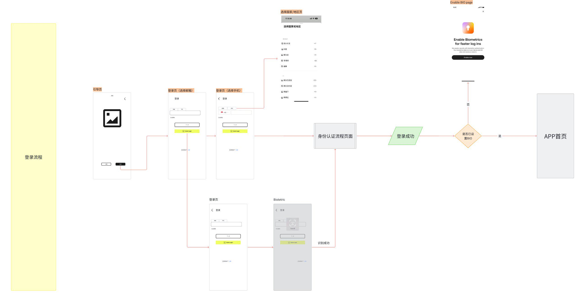

# AIX Card 注册登录需求 V1.0 — 登录功能

> 本文档由原始 PRD（飞书导出 .docx）100% 原文转译为结构化 Markdown，未做任何内容精简或归纳。
> 项目背景、项目目的、国家线、账户规则等全局信息见 [registration.md](./registration.md) 章节2-5。

---

## 7.2 登录功能

### 7.2.1 流程说明

> 原始PRD参考截图（飞书文档截图，含登录流程概览图）

### 7.2.2 页面概览

> 原始PRD参考截图（飞书文档截图，含登录功能所有页面概览）

---

### 7.2.3 Navigation Page（引导页）

> 复用注册功能-Navigation Page
> 详见 [registration.md → 7.3 Navigation Page](./registration.md#73-navigation-page引导页)

---

### 7.2.4 Login Page（登录页）

#### UX 参考截图

> 原始PRD参考截图（飞书文档截图，含登录页UI原型 — 多状态展示同一页面）

| 状态 | UX截图 |
|------|--------|
| 默认状态 |  |

#### 功能说明

> 注：原文档 Description 列从第4项开始，1-3项内容见 UX 截图中的页面交互说明。

**4. 下一步按钮**

- 初始状态为禁用。仅当输入框内容不为空，且输入格式校验通过，变为可用；

点击按钮处理逻辑：
- 账号不存在或未注册：提示文案：您输入的账号信息有误，请检查或注册新账号。
- 手机号少于6位：提示：Phone number must be at least 6 digits
- 账号被Banned：提示文案：Account locked. Please contact customer support.
- 正常流程：自动跳转至 身份验证流程页；

**5. Quick Login按钮**

显示条件：
- 仅当App本地检测到存在可用的生物识别（Biometric）密钥信息时，才向用户展示此按钮。

功能逻辑：
- 点击后触发生物识别登录流程，具体逻辑见独立的"Biometric登录"章节。

---

### 7.2.4.1 Select Country Page（国家选择页）

#### UX 参考截图

> 原始PRD参考截图（飞书文档截图，含国家选择页UI原型）

| 状态 | UX截图 |
|------|--------|
| 默认状态 |  |

#### 功能说明

**1. 页面规则**

- 点击打开国家列表，展示全部国家。
- 展示完整国家list参考，见国家和地区list；
- 国家list，后端需要隐藏中国和中国台湾选项；

列表排序规则：
- 实现方式：采用组件 `new Intl.Collator('vi-VN').compare`

**2. 常用地区**

- 显示常用国家地区，固定为：澳大利亚、新加坡、菲律宾、越南

---

### 7.2.5 Biometric登录

#### UX 参考截图

> 原始PRD参考截图（飞书文档截图，含Biometric登录各平台UI原型）

| 模块 | UX截图 |
|------|--------|
| iOS人脸 |  |
| iOS指纹 |  |
| Android人脸 |  |
| Android指纹 |  |

#### 功能说明

| 模块 | 需求说明 |
|------|----------|
| iOS人脸 | 点击「Quick Login」，拉起设备人脸验证 判断是否验证通过： - 设备端验证通过，则进行后端验证 - 后端验证成功，进入下一步流程，并使用biometric签名请求身份认证； - 后端验证失败，则弹窗提示 |
| iOS指纹 | 点击「Quick Login」，拉起设备指纹验证 判断是否验证通过： - 设备端验证通过，则进行后端验证 - 后端验证成功，进入下一步流程，并使用biometric签名请求身份认证； - 后端验证失败，则弹窗提示 |
| Android人脸 | 点击「Quick Login」，拉起设备人脸验证 判断是否验证通过： - 设备端验证通过，则进行后端验证 - 后端验证成功，进入下一步流程，并使用biometric签名请求身份认证； - 后端验证失败，则弹窗提示 |
| Android指纹 | 点击「Quick Login」，若协议已全部勾选，则拉起设备人脸验证 判断是否验证通过： - 设备端验证通过，则进行后端验证 - 后端验证成功，进入下一步流程，并使用biometric签名请求身份认证； - 后端验证失败，则弹窗提示 |

> 补充截图：Android指纹验证弹窗

---

### 7.2.6 身份验证流程页面

> 详细需求见：AIX Security 身份认证需求V1.0

---

### 7.2.7 Enable BIO Page（启用生物识别引导页）

#### UX 参考截图

> 原始PRD参考截图（飞书文档截图，含启用BIO引导页UI原型 — 多状态展示同一页面）

| 状态 | UX截图 |
|------|--------|
| 默认状态 |  |

#### Description 参考截图

#### 功能说明

**1. 页面规则**

用户登录成功后，系统将检测其生物识别（BIO）状态：
- 若未启用BIO：则引导用户进入此功能启用页面。
- 若已启用BIO：则跳过此页面，直接进入APP首页。
- 若用户未在手机系统中开启人脸或指纹识别功能，则登录成功后不弹出生物识别引导页，直接进入首页

**2. 关闭按钮**

- 点击关闭按钮，直接进入APP首页，并toast提示：Login success

**3. 图片&标题&副标题**

- 固定文案

**4. Enable now按钮**

点击按钮，检测设备生物识别权限状态：
- 已授权：直接调起生物认证流程
- 未授权：弹窗引导至系统权限设置

特殊处理：
- 需调用身份认证接口
- 用户在完成手动登录后的5分钟内，无需再次进行身份验证
- 用户在完成手动登录后的5分钟后，需要进行身份验证后再继续设置
