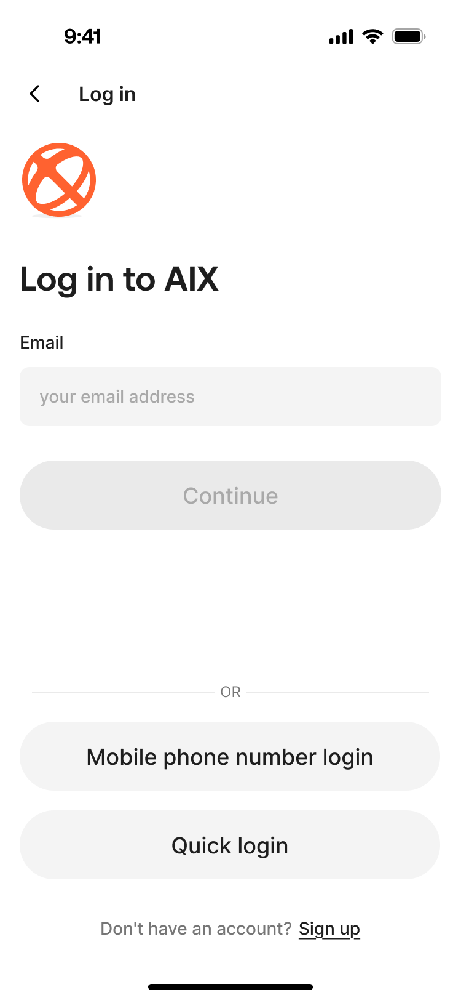
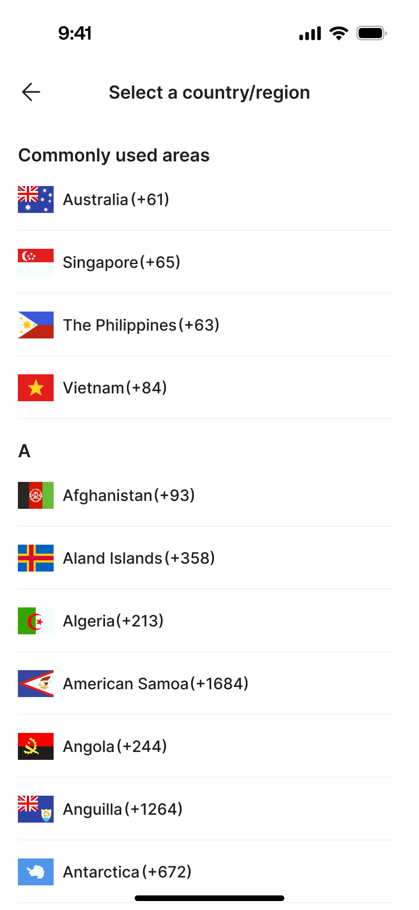
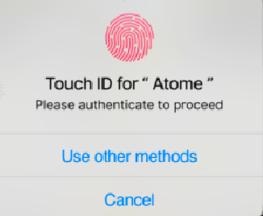
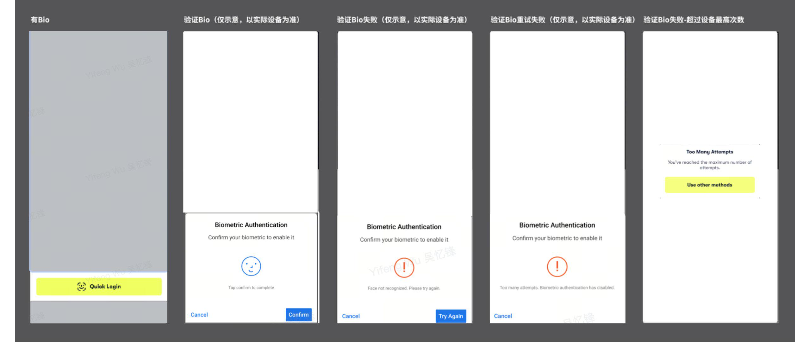

# Login 登录功能

## 1. 功能定位

Login 用于已注册用户通过邮箱、手机号或 Biometric 快捷登录进入 AIX App。

登录成功后，系统根据用户是否已启用 Biometric 决定是否展示 Enable BIO Page。若已启用 BIO，则跳过该引导页直接进入 Home。

## 2. 适用范围

| 维度 | 规则 | 来源 | 备注 |
|------|------|------|------|
| 用户状态 | 已注册用户 | AIX Card 注册登录需求V1.0 / 7.2 登录功能 | 未注册用户应引导注册 |
| 账户状态 | Active 可登录；Banned / Closed / Locked 不可登录 | AIX Card 注册登录需求V1.0 / 6.2 账户说明 | 状态定义见 `_meta/status-dictionary.md` |
| 登录方式 | Email / Phone / Biometric | AIX Card 注册登录需求V1.0 / 7.2.4；7.2.5 | Biometric 依赖设备绑定与本地凭证 |
| 国家 / 地区选择 | 手机号登录展示全球国家 / 地区区号列表 | AIX Card 注册登录需求V1.0 / 2025-11-18 变更记录；7.2.4.1 | 中国和中国台湾选项后端隐藏 |
| 身份认证 | 登录可选择 OTP / Email OTP / Login Passcode / BIO | AIX Security 身份认证需求V1.0 / 7.2 | Bio 登录目前可跳过其他认证 |

## 3. 前置条件

| 条件 | 说明 | 来源 |
|------|------|------|
| 用户已有 AIX 账户 | 登录面向已注册用户 | AIX Card 注册登录需求V1.0 / 7.2 |
| 账户未被禁止登录 | Banned / Closed / Locked 均影响登录能力 | AIX Card 注册登录需求V1.0 / 6.2 |
| Biometric 快捷登录需要本地存在可用 BIO 密钥 | 仅检测到可用生物识别密钥时展示 Quick Login | AIX Card 注册登录需求V1.0 / 7.2.5 |
| Biometric 启用依赖设备绑定 | 仅当设备已绑定，登录时方可启用 Biometric | AIX Card 注册登录需求V1.0 / 6.2.6 |

## 4. 业务流程

### 4.1 主链路

```text
Navigation Page → Login Page → 输入 / 快捷登录 → 身份验证 / 生物识别 → 登录成功 → BIO 检查 → Home
```

### 4.2 完整业务流程图

```text
┌─────────────────┐
│ Navigation Page │
└────────┬────────┘
         │ 点击 I already have an account
         ▼
┌────────────────────────────────────┐
│ Login Page                         │
│ - Email Login                      │
│ - Phone Login                      │
│ - Quick Login（有 BIO 密钥才展示）  │
│ - Forgot Password                  │
└───────┬──────────────┬─────────────┘
        │              │
        │              ├──────────────────────────────────────────┐
        │              │ Forgot Password                         │
        │              ▼                                          │
        │        ┌─────────────────────┐                          │
        │        │ Password Reset Page │                          │
        │        └─────────────────────┘                          │
        │                                                         │
        ├─────────────────────────────────────────────────────────┤
        │ Email / Phone 登录                                      │
        ▼                                                         │
┌────────────────────────────────────┐                            │
│ 输入校验                            │                            │
│ - Email：非空 + 格式校验 + ≤254     │                            │
│ - Phone：数字 + 长度校验            │                            │
│ - Next 初始禁用，校验通过才可点击   │                            │
└───────┬────────────────────────────┘                            │
        │ 校验通过 + 点击 Next                                    │
        ▼                                                         │
┌────────────────────────────────────┐                            │
│ 账号与账户状态校验                  │                            │
│ - 账号不存在 / 未注册 → 提示错误    │                            │
│ - Banned / Closed / Locked → 拦截   │                            │
│ - Active → 进入身份验证             │                            │
└───────┬────────────────────────────┘                            │
        │ Active                                                   │
        ▼                                                         │
┌────────────────────────────────────┐                            │
│ Identity Verification              │                            │
│ 具体认证方式由 Security 模块决定    │                            │
└───────┬──────────────┬─────────────┘                            │
        │              │                                          │
        │ 失败 / 锁定   │ 成功                                     │
        ▼              ▼                                          │
┌────────────────┐   ┌────────────────────┐                       │
│ Security Error │   │ Login Success      │                       │
│ Handling       │   └─────────┬──────────┘                       │
└────────────────┘             │                                  │
                               ▼                                  │
                      ┌────────────────────┐                      │
                      │ BIO 状态检查        │                      │
                      └───────┬─────┬──────┘                      │
                              │     │                             │
                    BIO 已启用 │     │ BIO 未启用 + 设备支持 BIO   │
                              ▼     ▼                             │
                         ┌──────┐ ┌─────────────────┐             │
                         │ Home │ │ Enable BIO Page │             │
                         └──────┘ └───────┬─────────┘             │
                                          │                       │
                     ┌────────────────────┼────────────────────┐  │
                     │                    │                    │  │
                     ▼                    ▼                    ▼  │
                点击 Close        Enable now 且 5分钟内   Enable now 且超5分钟
                     │                    │                    │
                     ▼                    ▼                    ▼
                 ┌──────┐        ┌────────────────┐    ┌────────────────────┐
                 │ Home │        │ Device BIO     │    │ Identity Verification│
                 └──────┘        └───────┬────────┘    └─────────┬──────────┘
                                          │ 成功                  │ 成功
                                          ▼                       ▼
                                      ┌──────┐            ┌────────────────┐
                                      │ Home │            │ Device BIO     │
                                      └──────┘            └───────┬────────┘
                                                                  │ 成功
                                                                  ▼
                                                              ┌──────┐
                                                              │ Home │
                                                              └──────┘

┌────────────────────────────────────┐
│ Quick Login 分支                    │
│ 仅本地存在 BIO 密钥时展示按钮        │
└───────┬────────────────────────────┘
        │ 点击 Quick Login
        ▼
┌────────────────────────────────────┐
│ Device Biometric Verification      │
│ - iOS Face ID / Touch ID           │
│ - Android Face / Fingerprint       │
└───────┬──────────────┬─────────────┘
        │              │
        │ 设备端通过    │ 设备端失败
        ▼              ▼
┌────────────────────┐ ┌────────────────────┐
│ 后端验证            │ │ 失败提示 / 留在登录 │
└───────┬────────────┘ └────────────────────┘
        │
        ├─ 后端成功 → 使用 biometric 签名请求身份认证 → Home
        └─ 后端失败 → 弹窗提示
```

### 4.3 业务逻辑矩阵

| 阶段 | 触发条件 | 前端校验 / 展示 | 后端 / 系统动作 | 成功结果 | 失败结果 |
|------|----------|-----------------|-----------------|----------|----------|
| 进入登录 | Navigation Page 点击 `I already have an account` | 展示 Login Page | 无 | 用户进入登录页 | 无 |
| Email 输入 | 用户选择 Email tab | 校验非空、邮箱格式、最大 254 字符 | 无 | Next 可点击 | 展示 Email 错误提示 |
| Phone 输入 | 用户选择 Phone tab | 校验数字、长度；Country Code 可选择 | 无 | Next 可点击 | 展示 Phone 错误提示 |
| 国家选择 | 点击 Country Code | 展示全部国家，隐藏中国和中国台湾；常用地区固定展示 | 返回所选区号 | 回到 Login Page | 无 |
| Next 登录 | 输入合法后点击 Next | 前端阻止非法输入 | 校验账号是否存在、账户状态是否可登录 | 进入 Identity Verification | 账号不存在 / Banned / Locked 等提示 |
| 身份验证 | 账号可登录 | 展示 Security 认证流程 | 按 Security 模块处理 OTP / Email OTP / Passcode 等 | 登录成功 | 认证失败 / 锁定 |
| Quick Login 展示 | 本地存在可用 BIO 密钥 | 展示 Quick Login 按钮 | 无 | 用户可点击快捷登录 | 无 BIO 密钥则不展示 |
| Quick Login 验证 | 点击 Quick Login | 拉起系统生物识别 | 设备通过后进行后端验证，并使用 biometric 签名请求身份认证 | 进入 Home | 设备失败 / 后端失败弹窗 |
| 登录后 BIO 检查 | 身份验证成功 | 判断是否已启用 BIO、设备是否支持 BIO | 读取 BIO 状态与设备能力 | Home 或 Enable BIO Page | 设备不支持则直接 Home |
| Enable BIO 关闭 | 点击 Close | 关闭引导页 | 无 | 进入 Home，Toast: `Login success` | 无 |
| Enable now 5分钟内 | 手动登录完成 5 分钟内点击 Enable now | 调起设备生物识别 | 免再次身份认证 | 设置成功后进入 Home | 设备验证失败按 Biometric 处理 |
| Enable now 超过5分钟 | 手动登录完成超过 5 分钟点击 Enable now | 进入身份验证流程 | Security 认证通过后继续设备生物识别 | 设置成功后进入 Home | 认证失败 / 设备失败 |

## 5. 页面关系总览

本表用于快速确认页面 / 能力、触发条件、下一步和关键说明。完整业务逻辑以“4. 业务流程”为准。

| 当前页面 / 能力 | 页面目的 | 用户动作 / 触发条件 | 下一步 | 说明 |
|----------------|----------|--------------------|--------|------|
| Navigation Page | 选择注册或登录 | 点击 `I already have an account` | Login Page | 进入登录 |
| Navigation Page | 选择注册或登录 | 点击 `Create account` | Registration Page | 进入注册 |
| Login Page | 输入邮箱、手机号，或使用 Quick Login | Email 输入合法 + 点击 `Next` | Identity Verification | 邮箱登录 |
| Login Page | 输入邮箱、手机号，或使用 Quick Login | Phone 输入合法 + 点击 `Next` | Identity Verification | 手机号登录 |
| Login Page | 输入邮箱、手机号，或使用 Quick Login | 点击 Country Code | Select Country Page | 选择手机号区号 |
| Select Country Page | 选择手机号国家 / 地区区号 | 选择国家 / 地区 | Login Page | 带回区号 |
| Login Page | 输入邮箱、手机号，或使用 Quick Login | 点击 `Forgot password` | Password Reset Page | 进入忘记密码 |
| Login Page | 输入邮箱、手机号，或使用 Quick Login | 点击 `Quick Login` | Biometric Verification | 仅本地有 Biometric 密钥时展示 |
| Identity Verification | 登录身份验证 | 验证成功 + BIO 已启用 | Home | 直接登录成功 |
| Identity Verification | 登录身份验证 | 验证成功 + BIO 未启用 + 设备支持 BIO | Enable BIO Page | 登录后引导开启 BIO |
| Identity Verification | 登录身份验证 | 验证失败 / 锁定 | Security Error Handling | 按 Security 模块规则处理 |
| Biometric Verification | 快捷登录验证 | 验证成功 | Home | 快捷登录成功 |
| Biometric Verification | 快捷登录验证 | 验证失败 | Security Error Handling | 设备端或后端验证失败 |
| Enable BIO Page | 登录后引导开启 BIO | 点击 Close | Home | Toast: `Login success` |
| Enable BIO Page | 登录后引导开启 BIO | 点击 Enable now，且手动登录 5 分钟内 | Biometric Verification | 免再次身份认证 |
| Enable BIO Page | 登录后引导开启 BIO | 点击 Enable now，且手动登录超过 5 分钟 | Identity Verification | 需重新身份认证后继续设置 |

## 6. 页面卡片与交互规则

### 6.1 Navigation Page

> Navigation Page 复用 Registration 中的 Navigation Page。

| 维度 | 内容 |
|------|------|
| 页面目的 | 引导用户进入注册或登录 |
| 入口 | App 未登录启动 / 用户退出登录后 |
| 出口 | `Create account` → Registration Page；`I already have an account` → Login Page |
| 关键规则 | 登录入口进入 Login Page；注册入口进入 Registration Page |

| 元素 | 类型 | 展示条件 | 交互规则 | 异常 |
|------|------|----------|----------|------|
| I already have an account | Button | 默认展示 | 点击进入 Login Page | 无 |
| Create account | Button | 默认展示 | 点击进入 Registration Page | 无 |

### 6.2 Login Page



| 维度 | 内容 |
|------|------|
| 页面目的 | 用户选择 Email / Phone 登录方式，或通过 Quick Login 快捷登录 |
| 入口 | Navigation Page 点击 `I already have an account` |
| 出口 | Next → Identity Verification；Quick Login → Biometric Verification；Forgot password → Password Reset Page |
| 关键校验 | Email 格式；Phone 长度；账号是否存在；账户状态是否允许登录 |
| 关联模块 | Security / Account Status / Biometric |

| 元素 | 类型 | 展示条件 | 交互规则 | 异常 |
|------|------|----------|----------|------|
| Email / Phone 切换 | Tab | 默认展示 | 默认选中 Email；用户可切换到 Phone | 切换时是否保留输入内容需按当前实现或 UI 确认 |
| Email 输入框 | TextInput | Email tab | 最长 254 字符；校验邮箱格式；不能为空 | `Email format is invalid`；`Email should not be empty` |
| Country Code | Selector | Phone tab | 点击进入 Select Country Page | 中国和中国台湾选项隐藏 |
| Phone 输入框 | TextInput | Phone tab | 仅允许数字；最长 20 位；少于 6 位提示错误 | `Phone number must be at least 6 digits` |
| Next | Button | 输入非空且格式校验通过 | 点击进入身份验证流程 | 账号不存在、账户 Banned、认证失败 |
| Quick Login | Button | 本地检测到可用 Biometric 密钥 | 点击触发设备生物识别登录流程 | 设备验证失败、后端验证失败 |
| Forgot password | Link / Button | 登录页展示 | 点击进入 Password Reset Page | 无 |

Next 按钮处理逻辑：

| 场景 | 规则 | 用户提示 / 动作 | 来源 |
|------|------|----------------|------|
| 账号不存在或未注册 | 后端判断账号不存在 | 原文中文：`您输入的账号信息有误，请检查或注册新账号。` | AIX Card 注册登录需求V1.0 / 7.2.4 |
| Phone 少于 6 位 | Phone 输入不满足最小长度 | `Phone number must be at least 6 digits` | 当前知识库旧内容 |
| 账户 Banned | 账户被限制登录 | `Account locked. Please contact customer support.` | 当前知识库旧内容 |
| 正常流程 | 输入合法且账号可登录 | 自动跳转至身份验证流程页 | AIX Card 注册登录需求V1.0 / 7.2.4 |

### 6.3 Select Country Page



| 维度 | 内容 |
|------|------|
| 页面目的 | 用户在手机号登录时选择国家 / 地区区号 |
| 入口 | Login Page 的 Phone tab 点击 Country Code |
| 出口 | 选择国家 / 地区后返回 Login Page |
| 关键规则 | 展示全部国家 / 地区；隐藏中国和中国台湾；常用地区固定展示 |
| 排序规则 | `new Intl.Collator('vi-VN').compare` |

| 元素 | 类型 | 展示条件 | 交互规则 | 异常 |
|------|------|----------|----------|------|
| 国家 / 地区列表 | List | Phone tab 点击 Country Code | 展示全部国家 / 地区；按排序规则展示 | 中国和中国台湾选项后端隐藏 |
| 常用地区 | List | 默认展示 | 固定展示 Australia、Singapore、Philippines、Vietnam | 无 |
| Search | SearchInput | 如 UI 提供 | 支持搜索国家 / 地区 | 无 |

### 6.4 Biometric Quick Login

| 维度 | 内容 |
|------|------|
| 页面 / 能力目的 | 用户通过设备生物识别完成快捷登录 |
| 入口 | Login Page 点击 Quick Login |
| 出口 | 验证成功 → Home；验证失败 → 错误提示或留在 Login Page |
| 展示条件 | App 本地检测到存在可用 Biometric 密钥 |
| 关联模块 | `security/biometric-verification.md` |

#### iOS Face ID


#### iOS Touch ID


#### Android Fingerprint Popup



#### Android Face



#### Android Fingerprint


| 元素 / 能力 | 类型 | 展示条件 | 交互规则 | 异常 |
|-------------|------|----------|----------|------|
| Quick Login | Button | 本地存在可用 Biometric 密钥 | 点击拉起设备生物识别 | 设备端失败 / 后端验证失败 |
| iOS Face ID | Device Auth | iOS 设备且支持 Face ID | 设备验证通过后进行后端验证，并使用 biometric 签名请求身份认证 | 后端失败弹窗提示 |
| iOS Touch ID | Device Auth | iOS 设备且支持 Touch ID | 设备验证通过后进行后端验证，并使用 biometric 签名请求身份认证 | 后端失败弹窗提示 |
| Android Face | Device Auth | Android 设备且支持人脸 | 设备验证通过后进行后端验证，并使用 biometric 签名请求身份认证 | 后端失败弹窗提示 |
| Android Fingerprint | Device Auth | Android 设备且支持指纹 | 设备验证通过后进行后端验证，并使用 biometric 签名请求身份认证 | 后端失败弹窗提示 |

### 6.5 Enable BIO Page


| 维度 | 内容 |
|------|------|
| 页面目的 | 用户登录成功后，引导其启用 Biometric 登录 |
| 入口 | 登录成功后，用户未启用 BIO，且设备支持生物识别 |
| 出口 | Close → Home；Enable now → 设备生物识别 / 身份认证后继续设置 |
| 关键规则 | 若已启用 BIO，跳过该页；若设备未开启人脸或指纹识别，不展示该页 |
| 认证窗口 | 手动登录后 5 分钟内免再次身份认证；超过 5 分钟需重新认证 |

| 元素 | 类型 | 展示条件 | 交互规则 | 异常 |
|------|------|----------|----------|------|
| Enable BIO Page | Guide Page | 登录成功后，用户未启用 BIO，且设备支持生物识别 | 引导用户选择是否开启 BIO | 若设备未开启人脸或指纹识别，不展示该页，直接进入 Home |
| Close | Button | 页面展示时 | 点击进入 Home，并 Toast：`Login success` | 无 |
| Enable now | Button | 页面展示时 | 检测设备生物识别权限状态；已授权则调起生物认证流程；未授权则弹窗引导至系统权限设置 | 认证失败按 Security / Biometric 规则处理 |

特殊规则：

| 规则 | 内容 | 来源 |
|------|------|------|
| 手动登录 5 分钟内免重认证 | 用户完成手动登录后的 5 分钟内，无需再次进行身份验证即可继续设置 BIO | AIX Card 注册登录需求V1.0 / 7.2.7；Security 场景矩阵 |
| 超过 5 分钟需重新认证 | 用户完成手动登录 5 分钟后，需要进行身份验证后再继续设置 | AIX Card 注册登录需求V1.0 / 7.2.7 |
| 已启用 BIO | 登录成功后跳过 Enable BIO Page，直接进入 Home | AIX Card 注册登录需求V1.0 / 7.2.7 |
| 未开启系统生物识别 | 登录成功后不弹出 BIO 引导页，直接进入 Home | AIX Card 注册登录需求V1.0 / 7.2.7 |

## 7. 字段与接口依赖

| 字段 / 能力 | 用途 | 读/写 | 来源 | 备注 |
|-------------|------|------|------|------|
| email | Email 登录账号 | 读 | Login Page | 最长 254 字符 |
| phone | Phone 登录账号 | 读 | Login Page | 仅数字，最长 20 位 |
| countryCode | 手机国家 / 地区区号 | 读 | Select Country Page | 全量国家 / 地区，隐藏中国和中国台湾 |
| accountStatus | 登录拦截 | 读 | Account Status | Active / Locked / Banned / Closed |
| biometricLocalKey | 判断是否展示 Quick Login | 读 | App 本地 | 本地存在可用密钥才展示 Quick Login |
| deviceId | 判断 BIO 前置条件 | 读 / 写 | 设备绑定策略 | 注册 / 登录成功后自动绑定 |
| bioEnabled | 判断是否展示 Enable BIO Page | 读 / 写 | Security / Biometric | 未启用时登录后可引导设置 |

## 8. 异常与失败处理

| 场景 | 触发条件 | 用户提示 | 系统动作 | 最终状态 | 来源 |
|------|----------|----------|----------|----------|------|
| Email 为空 | Email tab 未输入 | `Email should not be empty` | 阻止 Next | 留在 Login Page | AIX Card 注册登录需求V1.0 / 7.2.4 |
| Email 格式错误 | Email 格式不合法 | `Email format is invalid` | 阻止 Next | 留在 Login Page | AIX Card 注册登录需求V1.0 / 7.2.4 |
| Phone 少于 6 位 | Phone 长度不足 | `Phone number must be at least 6 digits` | 阻止 Next | 留在 Login Page | 当前知识库旧内容 |
| 账号不存在 / 未注册 | 后端判断账号不存在 | 原文中文：`您输入的账号信息有误，请检查或注册新账号。` | 不进入认证流程 | 留在 Login Page | AIX Card 注册登录需求V1.0 / 7.2.4 |
| 账户 Banned | 账户被限制登录 | `Account locked. Please contact customer support.` | 阻止登录 | 留在 Login Page | 当前知识库旧内容 / Account Status |
| 身份验证失败 / 锁定 | Security 认证失败或达到锁定条件 | 按 Security 模块规则 | 阻止进入 Home | Security Error Handling | AIX Security 身份认证需求V1.0 |
| Biometric 设备失败 | 设备端验证失败 | 按设备 / Security 规则提示 | 不进入 Home | 留在 Login / 认证失败状态 | AIX Card 注册登录需求V1.0 / 7.2.5 |
| Biometric 后端验证失败 | 后端验证不通过 | 弹窗提示 | 不进入 Home | 留在 Login / 认证失败状态 | AIX Card 注册登录需求V1.0 / 7.2.5 |
| Enable BIO 认证超时 | 手动登录超过 5 分钟后设置 BIO | 需重新身份认证 | 进入 Security 认证流程 | 认证通过后继续设置 BIO | AIX Card 注册登录需求V1.0 / 7.2.7 |

## 9. 风控 / 合规边界

| 边界 | 规则 | 影响 | 来源 |
|------|------|------|------|
| 账户状态拦截 | Banned / Closed / Locked 不可登录 | 防止异常账户进入业务流程 | AIX Card 注册登录需求V1.0 / 6.2 |
| Biometric 本地凭证 | Quick Login 仅在本地存在可用 BIO 密钥时展示 | 防止无凭证快捷登录 | AIX Card 注册登录需求V1.0 / 7.2.5 |
| 设备绑定 | 仅设备已绑定时，登录方可启用 Biometric | BIO 前置条件 | AIX Card 注册登录需求V1.0 / 6.2.6 |
| 身份认证 | 登录认证方式由 Security 模块统一定义 | 认证失败、锁定、有效期复用 Security | AIX Security 身份认证需求V1.0 |
| Enable BIO 5 分钟窗口 | 手动登录后 5 分钟内免再次身份认证 | 用户体验与安全平衡 | AIX Card 注册登录需求V1.0 / 7.2.7 |

## 10. 多角色阅读视角

### UI 视角

- 先看业务流程图理解登录完整链路，再看页面卡片查看具体页面截图和元素规则。
- 原始 PRD 页面概览截图不再作为主表达。
- 重点页面：Login Page、Select Country Page、Biometric 系统弹窗、Enable BIO Page。

### 开发视角

- 登录页需支持 Email / Phone 两种输入方式。
- Phone 登录依赖 Country Code 选择器，国家 / 地区列表需隐藏中国和中国台湾。
- Quick Login 展示依赖本地 Biometric 密钥；Enable BIO 展示依赖登录后 BIO 状态判断。
- Biometric 设备端验证通过后，仍需后端验证，并使用 biometric 签名请求身份认证。

### 测试视角

- 必测 Email 登录、Phone 登录、Country Select、账号不存在、Banned 拦截、Quick Login、后端验证失败、Enable BIO 展示 / 跳过、5 分钟免认证窗口。
- 需覆盖设备未开启生物识别时不展示 Enable BIO Page。

### 业务视角

- 登录是 Wallet / Card / Transaction 等业务入口前置能力。
- Enable BIO 是登录后引导，不是强制阻断；用户关闭后可进入 Home。

### AI 复用视角

- 新 PRD 涉及登录态、Quick Login、BIO 引导或账户拦截时，应引用本文件与 Security 模块。
- 不得在业务模块中重复定义 Biometric 登录与身份认证失败规则。

## 11. 待确认事项

| 问题 | 影响范围 | 建议确认人 | 状态 |
|------|----------|------------|------|
| Login Page 当前知识库旧文档缺少 Description 第 1-3 项，已按原始 PRD 片段补齐，但仍需结合最新 UI 校准 | Login Page | 产品 / UI | open |
| 账号不存在 / 未注册提示文案原始 PRD 为中文描述，需确认英文最终文案 | Login Page | 产品 / UI | open |
| Phone 少于 6 位错误提示来自当前知识库旧内容，需确认是否在原始 PRD / 翻译表中最终生效 | Login Page | 产品 / UI / 技术 | open |
| 中国和中国台湾隐藏规则需确认由后端过滤还是前端过滤 | Select Country Page | 产品 / 技术 | open |
| Android 指纹原旧文档出现“若协议已全部勾选”描述，疑似串入注册协议逻辑，需确认是否删除 | Biometric Login | 产品 / UI | open |
| Enable BIO 的系统授权差异不建议写成用户话术，需在技术实现中确认 iOS / Android 最终处理方式 | Enable BIO | 产品 / 技术 | open |

## 12. 来源引用

- (Ref: 历史prd/AIX Card 注册登录需求V1.0.docx / 2025-11-18 需求变更日志 / V1.0)
- (Ref: 历史prd/AIX Card 注册登录需求V1.0.docx / 6.2 账户说明 / V1.0)
- (Ref: 历史prd/AIX Card 注册登录需求V1.0.docx / 7.2.3 Navigation Page / V1.0)
- (Ref: 历史prd/AIX Card 注册登录需求V1.0.docx / 7.2.4 Login Page / V1.0)
- (Ref: 历史prd/AIX Card 注册登录需求V1.0.docx / 7.2.4.1 Select Country Page / V1.0)
- (Ref: 历史prd/AIX Card 注册登录需求V1.0.docx / 7.2.5 Biometric登录 / V1.0)
- (Ref: 历史prd/AIX Card 注册登录需求V1.0.docx / 7.2.7 Enable BIO Page / V1.0)
- (Ref: knowledge-base/security/global-rules.md)
- (Ref: knowledge-base/security/biometric-verification.md)
