# Login 登录功能

> Source alignment note: 本文件已开始按 `archive/converted-prd/app/registration-login/README.md` 与 `archive/converted-prd/security/identity-verification/README.md` 校准。登录主流程、Quick Login、Enable BIO 在注册登录 PRD 中有来源；但 Login Page 中“邮箱 / 手机号输入切换、邮箱输入框、手机号输入框”等部分在 converted-prd 中带删除线，同时 Select Country Page 又仍有正文描述，因此登录输入方式范围暂标 `DELETED_SOURCE`。

## 1. 文档定位

本文是 AIX Account / Login 的运行时事实源，用于沉淀：

1. 已注册用户进入 Login Page、发起登录、Quick Login、Enable BIO 的页面、流程和规则；Email / Phone 输入范围需确认。
2. Quick Login / Biometric 快捷登录的展示条件和系统交互边界。
3. 登录成功后 Enable BIO Page 的展示、跳过、开启和重新认证规则。
4. Login 与 Security 身份认证模块、Registration、Home 的关系；Password Reset 仅作为已删除排除入口处理。
5. 登录失败、账户拦截、Biometric 失败等异常处理边界。

本文不维护 Security 模块的完整认证规则。OTP、Email OTP、Login Passcode、Biometric 认证失败、锁定、有效期等细节以 `knowledge-base/security/*` 为准。

## 2. 适用范围

| 维度 | 规则 | 来源 / 备注 |
|---|---|---|
| 用户状态 | 已注册用户可进入登录流程 | 未注册用户应走 Registration |
| 账户状态 | Active 可继续登录；Banned / Closed 应被拦截 | `Locked` 在 registration-login 的账户状态中为删除线；OTP / Email OTP / Face Auth 锁定归入 Security 场景锁定 |
| 登录方式 | Login Page 输入方式 DELETED_SOURCE；Quick Login | Quick Login 仅本地存在可用 Biometric 密钥时展示 |
| 国家 / 地区选择 | Phone 登录时选择 Country Code | 国家列表展示全部国家 / 地区；中国和中国台湾选项后端隐藏 |
| 身份认证 | 手动登录成功前需进入身份验证流程 | 具体认证方式由 Security 模块决定 |
| Biometric | 支持 iOS Face ID / Touch ID、Android Face / Fingerprint | 设备端通过后仍需后端验证 |
| Enable BIO | 登录成功后，若用户未启用 BIO 且设备支持，则引导用户开启 | 已启用 BIO 或设备未开启生物识别时不展示 |

## 3. 用户侧页面流程图

本图按 `standard-prd-template.md` 的页面流程图规范绘制：只表达页面之间的主关系；主节点只放 Page；用户动作写在线条上；输入校验、账户拦截、认证失败、Biometric 失败等细节在具体页面说明中承接，不放入总览图。

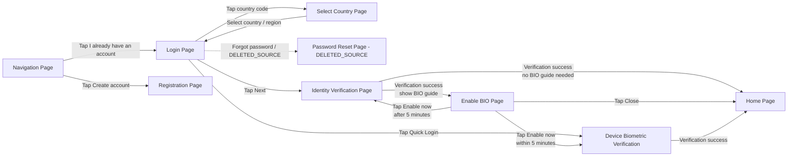

## 4. 系统时序图

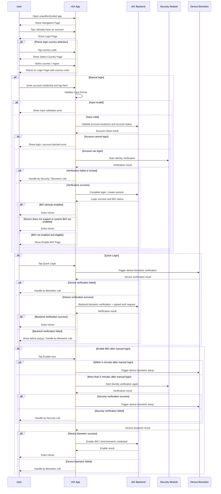

## 5. 页面清单

| 页面 / 能力 | 页面类型 | 入口 / 触发 | 下一步 | 备注 |
|---|---|---|---|---|
| Navigation Page | AIX App 主页面 | App 未登录启动 / 退出登录后 | Login Page / Registration Page | 复用 Registration 的 Navigation Page |
| Login Page | AIX App 主页面 | Navigation Page 点击登录入口 | Identity Verification / Quick Login / Country Select；Password Reset 为 DELETED_SOURCE | 登录主入口 |
| Select Country Page | AIX App 主页面 | Login Page Phone tab 点击 Country Code | Login Page | 选择手机号区号 |
| Identity Verification Page | Security 页面 / 认证流程 | 账号校验通过 | Home / Enable BIO / Security Handling | 具体规则由 Security 模块维护 |
| Device Biometric Verification | 系统生物识别能力 | Quick Login 或 Enable BIO | Home / Security Handling | iOS / Android 设备能力 |
| Enable BIO Page | AIX App 引导页 | 登录成功且用户未启用 BIO 且设备支持 BIO | Home / Device BIO / Identity Verification | 登录后引导，不是强制阻断 |
| Password Reset Page | DELETED_SOURCE | 历史 PRD 7.3 为删除线 | 不作为当前已确认入口 | 详见 password-reset.md |
| Home Page | AIX App 主页面 | 登录成功 | App 首页 | 本文不维护 Home 规则 |

## 6. 页面详情

### 6.1 Navigation Page

> Navigation Page 复用 Registration 的 Navigation Page。详见 `registration.md`。

| 项目 | 规则 |
|---|---|
| 页面类型 | AIX App 主页面 |
| 页面目标 | 引导用户选择注册或登录 |
| 入口 / 触发 | App 未登录启动 / 用户退出登录后 |
| 用户动作 | 点击 `I already have an account` 或 `Create account` |
| AIX 处理 | 根据用户选择进入 Login 或 Registration |
| 下一步 | Login Page / Registration Page |
| 边界说明 | 本文只维护进入 Login 的分支；注册规则见 `registration.md` |

### 6.2 Login Page

| 项目 | 规则 |
|---|---|
| 页面类型 | AIX App 主页面 |
| 页面目标 | 用户通过 Login Page 或 Quick Login 发起登录；Email / Phone 输入方式需确认 |
| 入口 / 触发 | Navigation Page 点击 `I already have an account` |
| 展示内容 | Login 输入区、Country Code、Next、Quick Login；Email / Phone 输入切换与 Forgot password 均需确认 |
| 用户动作 | 输入账号信息；选择国家区号；点击 Next；点击 Quick Login；Forgot password 为 DELETED_SOURCE |
| AIX 处理 | 校验输入格式；判断账号是否存在；判断账户状态；决定进入身份验证或展示错误 |
| 外部依赖 | AIX Backend、Security Module、Device Biometric |
| 下一步 | Identity Verification / Device Biometric Verification / Select Country；Password Reset 为 DELETED_SOURCE |
| 边界说明 | Security 认证细节不在本文维护 |

#### Login Page 元素规则

| 元素 | 类型 | 展示条件 | 交互规则 | 异常 / 备注 |
|---|---|---|---|---|
| Email / Phone 切换 | DELETED_SOURCE | converted-prd 中相关输入切换、邮箱输入框、手机号输入框为删除线 | 不作为当前已确认事实 | 需产品确认当前登录输入方式 |
| Email 输入框 | TextInput | Email tab | 非空、邮箱格式校验；最长 254 字符 | `Email format is invalid`；`Email should not be empty` |
| Country Code | Selector | Phone tab | 点击进入 Select Country Page | 中国和中国台湾选项后端隐藏 |
| Phone 输入框 | TextInput | Phone tab | 仅允许输入数字；最长 20 位；手机号少于 6 位提示错误 | `Phone number must be at least 6 digits` |
| Next | Button | 输入框不为空且格式校验通过后可用 | 点击后校验账号与账户状态，正常进入身份验证 | 账号不存在 / 未注册 / Banned 等展示错误 |
| Quick Login | Button | App 本地检测到可用 Biometric 密钥 | 点击触发生物识别快捷登录 | 无本地 BIO 密钥不展示 |
| Forgot password | DELETED_SOURCE | 历史 PRD 7.3 为删除线，Login Page 是否保留入口需确认 | 不作为当前已确认跳转 | 详见 `password-reset.md` |

#### Next 按钮处理逻辑

| 场景 | 规则 | 用户提示 / 动作 | 来源 / 备注 |
|---|---|---|---|
| 输入为空 | Next 禁用 | 不可点击 | 原 PRD |
| 输入格式不合法 | Next 不可用或展示格式错误 | 按输入类型展示错误 | 原 PRD / 实现 |
| Phone 少于 6 位 | 阻止继续 | `Phone number must be at least 6 digits` | 历史 Login 文档 |
| 账号不存在或未注册 | 后端判断账号不存在 | `您输入的账号信息有误，请检查或注册新账号。` | 原 PRD |
| 账号 Banned | 阻止登录 | `Account locked. Please contact customer support.` | registration-login / 7.2.4 Login Page |
| 正常流程 | 账号存在且状态允许登录 | 自动跳转至身份验证流程页 | 原 PRD |
| 身份验证失败 / 锁定 | Security 认证失败或达到锁定规则 | 按 Security / Biometric 规则处理 | 修复点：不在 Login 内重复定义 |

### 6.3 Select Country Page

| 项目 | 规则 |
|---|---|
| 页面类型 | AIX App 主页面 |
| 页面目标 | 用户在 Phone 登录时选择国家 / 地区区号 |
| 入口 / 触发 | Login Page Phone tab 点击 Country Code |
| 展示内容 | 国家 / 地区列表、常用地区 |
| 用户动作 | 选择国家 / 地区 |
| AIX 处理 | 返回 Login Page 并带回所选 Country Code |
| 下一步 | Login Page |
| 边界说明 | 国家完整清单以国家地区 list 为准 |

#### Select Country Page 规则

| 项目 | 规则 |
|---|---|
| 国家列表 | 展示全部国家 / 地区 |
| 隐藏规则 | 后端需要隐藏中国和中国台湾选项 |
| 排序规则 | 采用 `new Intl.Collator('vi-VN').compare` |
| 常用地区 | 固定展示澳大利亚、新加坡、菲律宾、越南 |

### 6.4 Device Biometric Verification / Quick Login

#### iOS Face ID

#### iOS Touch ID

#### Android Fingerprint Popup

#### Android Face

#### Android Fingerprint

| 项目 | 规则 |
|---|---|
| 页面 / 能力类型 | 系统生物识别能力 / 快捷登录能力 |
| 页面目标 | 用户通过设备生物识别完成快捷登录 |
| 入口 / 触发 | Login Page 点击 Quick Login |
| 展示条件 | App 本地检测到可用 Biometric 密钥 |
| 用户动作 | 完成 Face ID / Touch ID / Android Face / Android Fingerprint |
| AIX 处理 | 设备端通过后进行后端验证，并使用 biometric 签名请求身份认证 |
| 成功结果 | 进入 Home |
| 失败结果 | 弹窗提示或按 Security / Biometric 规则处理 |
| 边界说明 | 设备端识别能力由 OS 控制；失败锁定、重试等细节以 Security / Biometric 文件为准 |

#### Biometric 平台规则

| 模块 | 需求说明 |
|---|---|
| iOS Face ID | 点击 Quick Login，拉起设备人脸验证；设备端通过后进行后端验证；后端成功后进入下一步流程，并使用 biometric 签名请求身份认证；后端失败弹窗提示 |
| iOS Touch ID | 点击 Quick Login，拉起设备指纹验证；设备端通过后进行后端验证；后端成功后进入下一步流程，并使用 biometric 签名请求身份认证；后端失败弹窗提示 |
| Android Face | 点击 Quick Login，拉起设备人脸验证；设备端通过后进行后端验证；后端成功后进入下一步流程，并使用 biometric 签名请求身份认证；后端失败弹窗提示 |
| Android Fingerprint | 点击 Quick Login，拉起设备指纹验证；设备端通过后进行后端验证；后端成功后进入下一步流程，并使用 biometric 签名请求身份认证；后端失败弹窗提示 |

### 6.5 Identity Verification Page

| 项目 | 规则 |
|---|---|
| 页面类型 | Security 认证流程 |
| 页面目标 | 登录前完成必要身份验证 |
| 入口 / 触发 | Login Page 输入合法、账号存在且账户状态允许登录 |
| AIX 处理 | 进入 Security 身份认证流程 |
| 成功结果 | 登录成功，随后判断 BIO 状态 |
| 失败结果 | 按 Security / Biometric 规则处理 |
| 边界说明 | 本文不维护 OTP、Email OTP、Login Passcode、BIO 认证的完整规则 |

### 6.6 Enable BIO Page

| 项目 | 规则 |
|---|---|
| 页面类型 | AIX App 引导页 |
| 页面目标 | 用户登录成功后，引导其启用 Biometric 登录 |
| 入口 / 触发 | 登录成功后，用户未启用 BIO，且设备支持生物识别 |
| 展示内容 | BIO 引导图片、标题、副标题、Close、Enable now |
| 用户动作 | 点击 Close；点击 Enable now |
| AIX 处理 | 判断手动登录是否在 5 分钟内；判断设备生物识别权限；必要时进入身份认证流程 |
| 下一步 | Home / Device Biometric Verification / Identity Verification |
| 边界说明 | Enable BIO 是登录后引导，不是登录成功的强制阻断 |

#### Enable BIO Page 规则

| 场景 | 规则 | 下一步 |
|---|---|---|
| 已启用 BIO | 登录成功后跳过 Enable BIO Page | Home |
| 未启用 BIO，且设备支持 BIO | 登录成功后展示 Enable BIO Page | 用户选择 Close 或 Enable now |
| 设备未开启人脸或指纹识别功能 | 登录成功后不弹出生物识别引导页 | Home |
| 点击 Close | 直接进入 APP 首页，并 Toast 提示 `Login success` | Home |
| 点击 Enable now，已授权 | 直接调起设备生物认证流程 | Device Biometric Verification |
| 点击 Enable now，未授权 | 弹窗引导至系统权限设置 | 系统设置 / 权限引导 |
| 手动登录后 5 分钟内 | 无需再次进行身份验证 | Device Biometric Verification |
| 手动登录后超过 5 分钟 | 需要进行身份验证后再继续设置 | Identity Verification |
| Enable BIO 失败 | 认证失败或设备验证失败 | 按 Security / Biometric 规则处理 |

## 7. 字段与依赖

| 字段 / 能力 | 用途 | 来源 | 备注 |
|---|---|---|---|
| email | Email 登录账号 | Login Page | 非空、格式校验；最长 254 字符 |
| phone | Phone 登录账号 | Login Page | 仅允许输入数字；最长 20 位；Phone 少于 6 位提示错误 |
| countryCode | Phone 登录国家 / 地区区号 | Select Country Page | 国家列表隐藏中国和中国台湾 |
| accountStatus | 登录拦截 | Backend / Account | Banned / Closed 不可登录；`Locked` 不作为 Account Status 沉淀 |
| biometricLocalKey | 判断是否展示 Quick Login | App 本地 | 本地存在可用 BIO 密钥才展示 Quick Login |
| bioEnabled | 判断是否展示 Enable BIO Page | Backend / Security | 已启用则跳过 Enable BIO Page |
| manualLoginTime | 判断是否需要重新身份认证 | App / Backend | 手动登录后 5 分钟内免再次身份验证 |
| deviceBiometricPermission | 判断是否能启用 BIO | OS / Device | 未授权时引导系统设置 |

## 8. 异常与失败处理

| 场景 | 触发条件 | 用户提示 / 页面表现 | 系统动作 | 最终状态 |
|---|---|---|---|---|
| 输入为空 | 账号输入为空 | Next 禁用 | 不发起登录 | 留在 Login Page |
| Phone 少于 6 位 | Phone 长度不足 | `Phone number must be at least 6 digits` | 阻止继续 | 留在 Login Page |
| 账号不存在或未注册 | 后端校验账号不存在 | `您输入的账号信息有误，请检查或注册新账号。` | 阻止进入身份验证 | 留在 Login Page |
| 账号 Banned | 账户被限制登录 | `Account locked. Please contact customer support.` | 阻止登录 | 留在 Login Page |
| Security 认证失败 / 锁定 | 登录身份验证失败或达到锁定条件 | 按 Security 模块规则 | 阻止进入 Home | Security Handling |
| Biometric 设备失败 | 设备端验证失败 | 按 Biometric 规则提示 | 不进入 Home | Security / Biometric Handling |
| Biometric 后端验证失败 | 后端验证不通过 | 弹窗提示错误信息，引导跳转至输入手机号 / 登录页 | 清除本地 BIO 信息，后端关闭该账户 BIO 开关 | Security / Biometric Handling |
| Android Biometric 超过设备限制次数 | Android 设备验证失败次数超过设备限制 | 弹窗提示错误信息，用户可选择 Use another method | 前端清除本地 BIO 信息并隐藏 Quick Login 按钮 | Login Page |
| Enable BIO 超过 5 分钟 | 手动登录后超过 5 分钟再点击 Enable now | 进入身份验证 | Security 认证通过后继续设置 | Identity Verification |
| 设备未开启系统生物识别 | 登录成功后检测到设备未开启人脸 / 指纹 | 不展示 Enable BIO Page | 直接进入 Home | Home |

## 9. 系统责任边界

| 范围 | AIX 责任 | 外部 / 其他模块责任 |
|---|---|---|
| Login 页面 | Quick Login、Country Code 等有来源；Email / Phone 输入切换与 Forgot password 需确认 | 无 |
| 输入校验 | 控制 Next 是否可用，展示基础输入错误 | 无 |
| 账户校验 | 调用 Backend 判断账号是否存在、状态是否允许登录 | Backend 提供账户状态与校验结果 |
| 身份认证 | 进入 Security 认证流程，承接认证结果 | Security 维护 OTP、Email OTP、Login Passcode、BIO 等规则；登录场景支持 OTP、EMAIL_OTP、Login Passcode、Biometric，Bio 登录场景可跳过后续认证 |
| Device Biometric | 拉起系统生物识别，承接设备端结果 | OS / Device 控制 Face ID / Touch ID / 指纹 / 人脸识别 |
| Quick Login | 根据本地 BIO 密钥展示入口；设备端通过后发起后端验证；后端验证失败时清除本地 BIO、关闭后端 BIO 开关并引导回登录方式；Android 超过设备限制时隐藏 Quick Login | Backend 处理 biometric 签名和身份认证 |
| Enable BIO | 登录后展示引导，控制 5 分钟免重认证规则 | Security / Device 处理认证与生物识别权限 |
| Password Reset | DELETED_SOURCE；不得从 Login 反推当前入口已启用 | password-reset.md 说明已删除排除原因 |

## 10. 不得推导的内容

以下内容不得在没有来源时写成事实：

1. Quick Login 对所有用户默认展示。
2. 用户未设置 BIO 时一定强制启用 BIO 才能进入 Home。
3. Device Biometric 通过就一定代表后端验证通过。
4. Login 自身维护 Security 的完整失败、锁定、重试规则。
5. 中国和中国台湾隐藏规则由前端还是后端最终实现，除非有明确实现来源。
6. Android Fingerprint 的“协议已全部勾选”逻辑直接适用于登录；该描述疑似旧文档串入注册协议逻辑，需谨慎处理。
7. Enable BIO 的系统权限引导在 iOS / Android 上完全一致。

## 11. 删除线逻辑排除

用户已确认：源 PRD 中删除线内容视为已删除，不再作为已删除排除逻辑。

| 项目 | 处理 |
|---|---|
| Forgot Password 入口 | 删除线来源，不纳入当前 Login runtime 逻辑 |
| Password Reset 链路 | 删除线来源，不纳入当前 Login runtime 逻辑 |

## 12. 来源引用

- (Ref: archive/converted-prd/app/registration-login/README.md / 7.2 登录功能)
- (Ref: archive/converted-prd/app/registration-login/README.md / 7.2.3 Navigation Page)
- (Ref: archive/converted-prd/app/registration-login/README.md / 7.2.4 Login Page)
- (Ref: archive/converted-prd/app/registration-login/README.md / 7.2.4.1 Select Country Page)
- (Ref: archive/converted-prd/app/registration-login/README.md / 7.2.5 Biometric登录)
- (Ref: archive/converted-prd/app/registration-login/README.md / 7.2.7 Enable BIO Page)
- (Ref: archive/converted-prd/security/identity-verification/README.md)
- (Ref: knowledge-base/security/global-rules.md)
- (Ref: knowledge-base/security/biometric-verification.md)
- (Ref: 用户确认 / 2026-05-03 / Login 文档需要 Mermaid 页面流程图和 sequenceDiagram 时序图；补回 SecurityError label、Enable BIO 到 Identity、失败按 Security / Biometric 规则处理)

## Deleted-source rule update

- 2026-05-09：删除线内容按已删除处理。Forgot Password / Password Reset 不再作为 Login active 入口或待确认项。

## Page Visuals 页面图索引

> 本节绑定 converted-prd 中与本文件页面规则相关的页面截图 / 页面组图片，方便查看规则时同步查看页面长什么样。图片仍引用 `archive/converted-prd` 原始资产，避免重复复制。

### 1. 需求变更日志

_Source: archive/converted-prd/app/registration-login/README.md:71_

_Source: archive/converted-prd/app/registration-login/README.md:74_

_Source: archive/converted-prd/app/registration-login/README.md:84_

_Source: archive/converted-prd/app/registration-login/README.md:136_

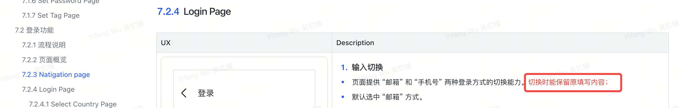

_Source: archive/converted-prd/app/registration-login/README.md:144_

### Enable BIO Page

_Source: archive/converted-prd/app/registration-login/README.md:122_

### 6. 全局规则

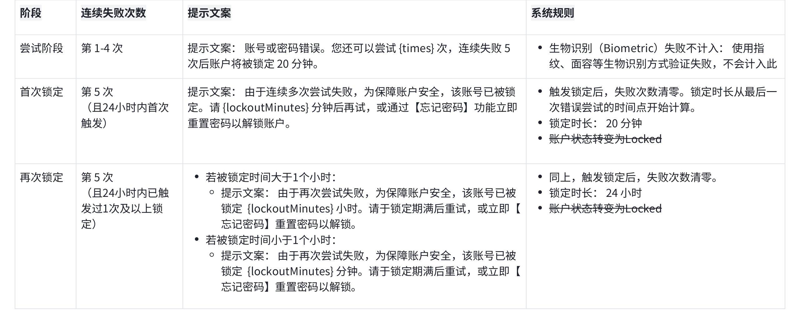

_Source: archive/converted-prd/app/registration-login/README.md:335_

### 7. 需求描述

_Source: archive/converted-prd/app/registration-login/README.md:357_

_Source: archive/converted-prd/app/registration-login/README.md:361_

_Source: archive/converted-prd/app/registration-login/README.md:418_

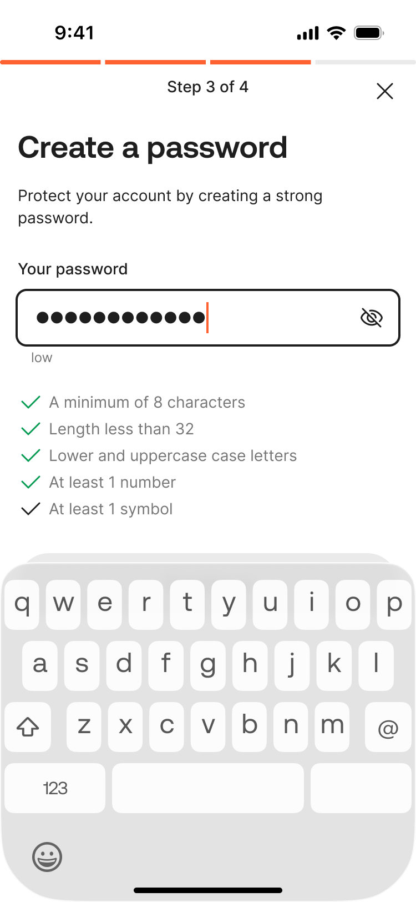

_Source: archive/converted-prd/app/registration-login/README.md:467_

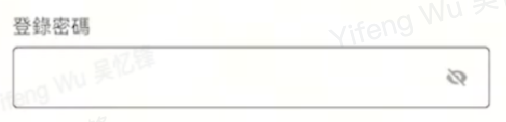

_Source: archive/converted-prd/app/registration-login/README.md:478_

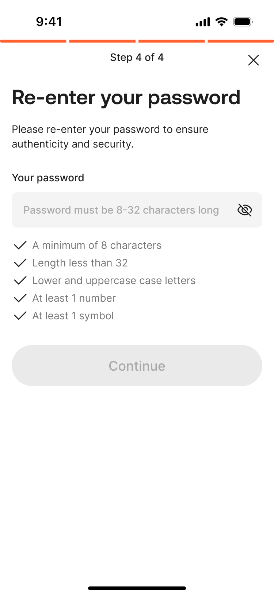

_Source: archive/converted-prd/app/registration-login/README.md:523_

_Source: archive/converted-prd/app/registration-login/README.md:599_

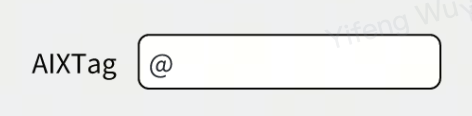

_Source: archive/converted-prd/app/registration-login/README.md:604_

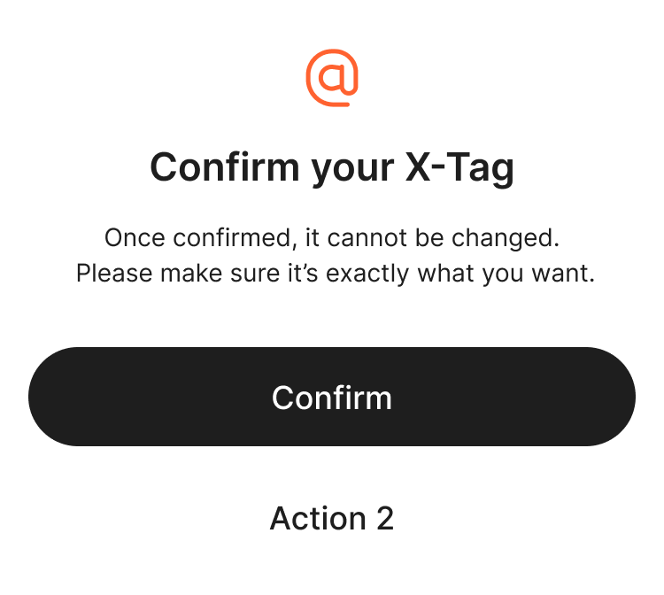

_Source: archive/converted-prd/app/registration-login/README.md:634_

_Source: archive/converted-prd/app/registration-login/README.md:682_

_Source: archive/converted-prd/app/registration-login/README.md:748_

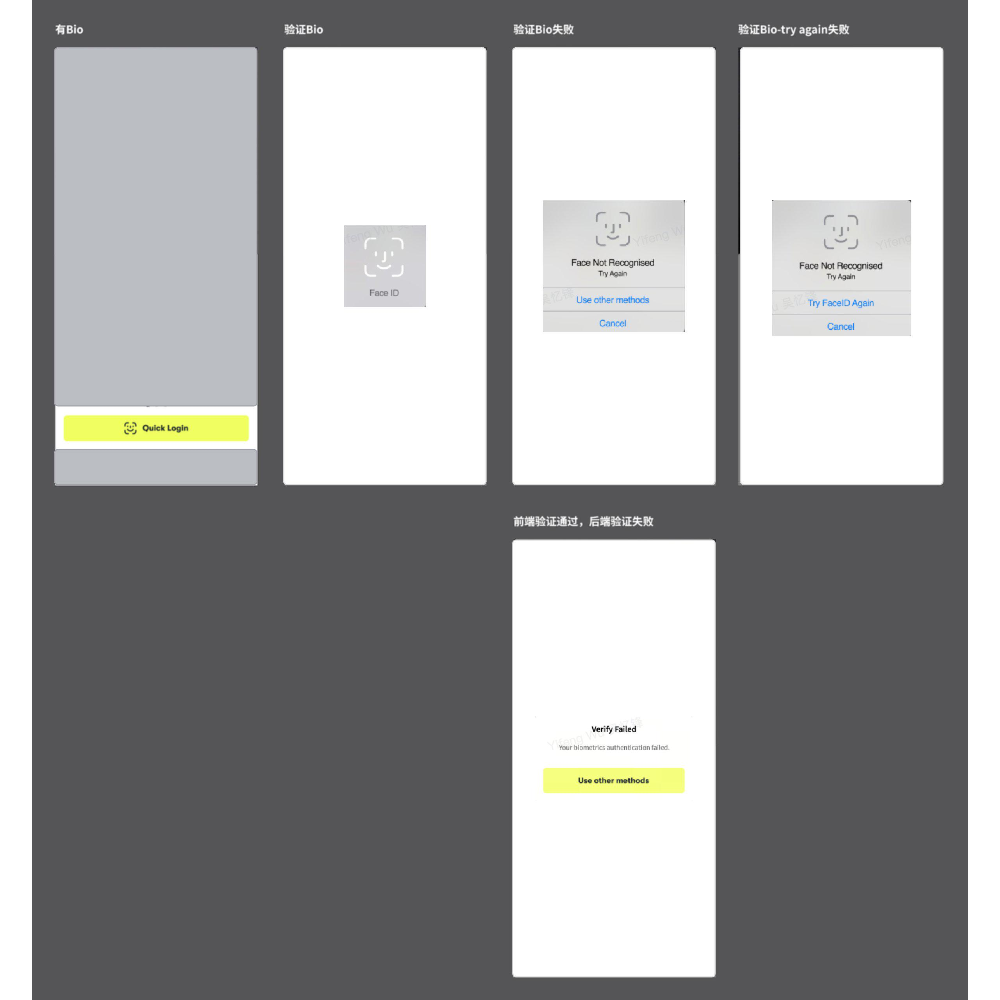

_Source: archive/converted-prd/app/registration-login/README.md:802_

### Login Page

_Source: archive/converted-prd/app/registration-login/README.md:659_

_Source: archive/converted-prd/app/registration-login/README.md:663_

### Select Country Page

_Source: archive/converted-prd/app/registration-login/README.md:702_

## Additional Page Visuals 补充页面图

> 本节补充第二轮页面覆盖审计中识别出的页面截图，仍引用 converted-prd 原始资产。

### 7. 需求描述

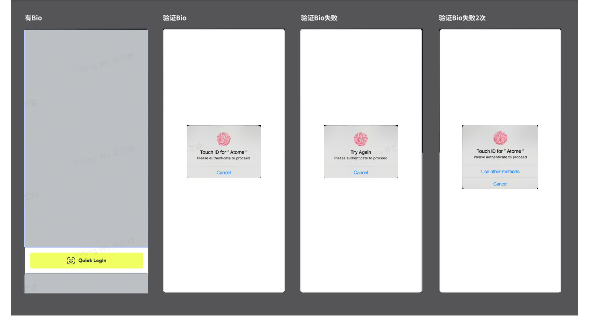

_Source: archive/converted-prd/app/registration-login/README.md:818_

### 7. 需求描述

_Source: archive/converted-prd/app/registration-login/README.md:831_

### 7. 需求描述

_Source: archive/converted-prd/app/registration-login/README.md:835_

### 7. 需求描述

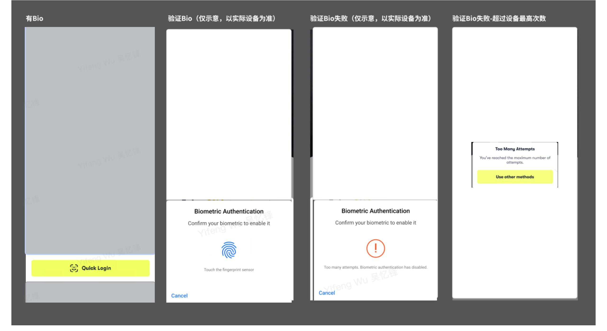

_Source: archive/converted-prd/app/registration-login/README.md:848_

### 7. 需求描述

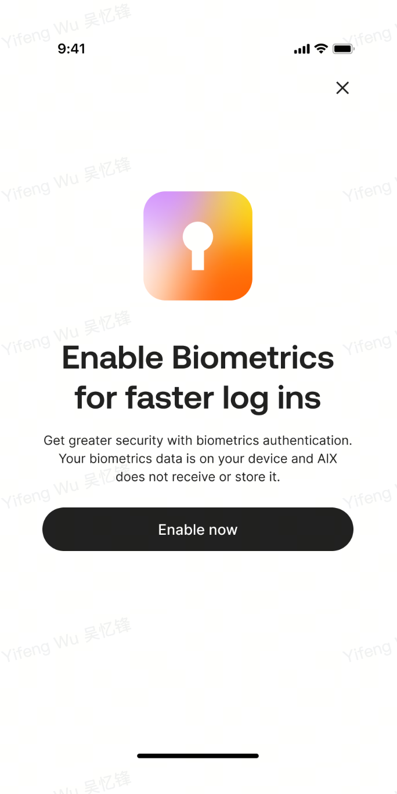

_Source: archive/converted-prd/app/registration-login/README.md:879_

### 7. 需求描述

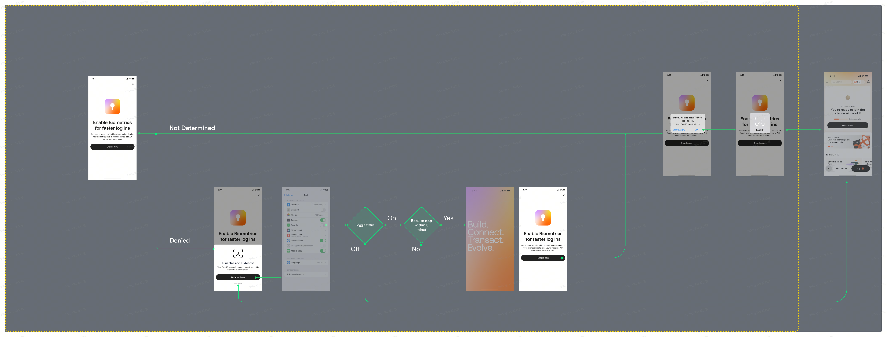

_Source: archive/converted-prd/app/registration-login/README.md:890_

### 7. 需求描述

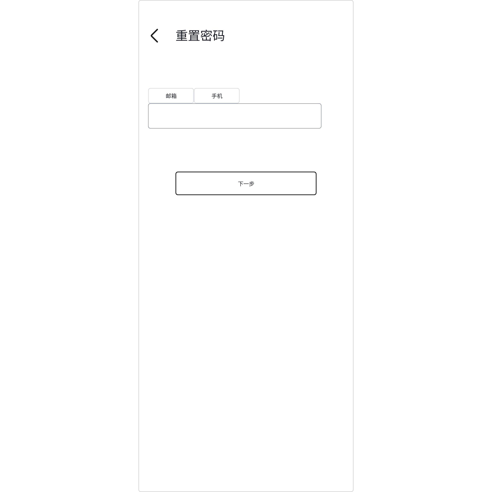

_Source: archive/converted-prd/app/registration-login/README.md:941_
