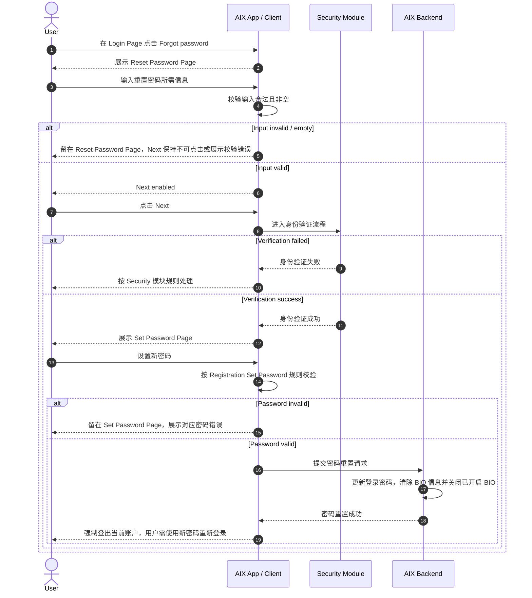
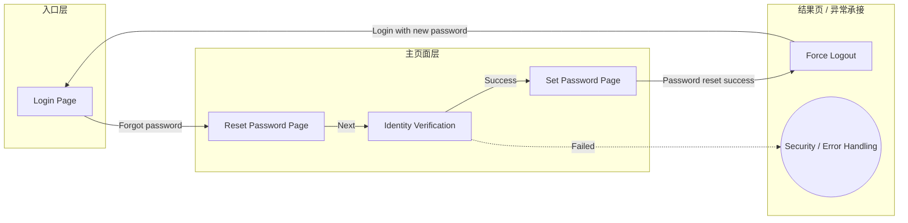

# Password Reset 忘记密码流程

## 1. 功能定位

Password Reset 用于用户在忘记登录密码时发起密码重置流程。

原始 PRD 明确：用户重置密码后，需要清除 BIO 信息；已开启的 BIO 需要自动关闭。密码重置成功后，系统强制登出当前账户，用户需使用新密码重新登录。

## 2. 适用范围

| 维度 | 规则 | 来源 | 备注 |
|---|---|---|---|
| 国家线 | VN / PH / AU | AIX Card 注册登录需求V1.0 / 国家线 | 与 Account 模块一致 |
| 用户状态 | 已注册用户 | AIX Card 注册登录需求V1.0 / 7.3 忘记密码流程页面 | 未注册用户不适用 |
| 入口 | Login Page 的 Forgot password | AIX Card 注册登录需求V1.0 / 7.2 Login Page；7.3 忘记密码流程页面 | Login 页面进入 |
| 身份验证 | 进入身份验证流程页面 | AIX Card 注册登录需求V1.0 / 7.3.4 身份验证流程页面 | 详细规则引用 Security |
| 密码设置 | 复用 Registration 的 Set Password Page | AIX Card 注册登录需求V1.0 / 7.3.5 设置密码页 | 密码规则引用 Registration |
| BIO 处理 | 重置密码后清除 BIO 信息并关闭已开启 BIO | AIX Card 注册登录需求V1.0 / 7.3.1 功能说明 | 安全边界 |

## 3. 前置条件

| 条件 | 说明 | 来源 |
|---|---|---|
| 用户从 Login 进入 | 忘记密码入口位于登录流程 | AIX Card 注册登录需求V1.0 / 7.2 Login Page |
| 用户可完成身份验证 | Reset Password Page 点击 Next 后进入身份验证流程页面 | AIX Card 注册登录需求V1.0 / 7.3.4 身份验证流程页面 |
| 密码设置规则可复用 | 设置密码页复用注册流程 Set Password Page | AIX Card 注册登录需求V1.0 / 7.3.5 设置密码页 |

## 4. 业务流程

### 4.1 主链路

```text
Login Page → Reset Password Page → Identity Verification → Set Password Page → Force Logout → Login with new password
```

### 4.2 业务流程与系统交互时序图



### 4.3 业务逻辑矩阵

| 阶段 | 触发条件 | 前端校验 / 展示 | 后端 / 系统动作 | 成功结果 | 失败结果 |
|---|---|---|---|---|---|
| 进入忘记密码 | Login Page 点击 Forgot password | 展示 Reset Password Page | 无 | 进入重置密码页 | 无 |
| Reset Password 输入 | 用户输入重置密码所需信息 | 输入合法且非空时 Next 高亮 | 无 | 可进入身份验证 | 输入不合法或为空时不可继续 |
| 身份验证 | 点击 Next | 进入身份验证流程页面 | 按 Security 模块处理 | 进入 Set Password Page | 失败按 Security 规则处理 |
| 设置新密码 | 身份验证成功 | 复用 Registration 的 Set Password 规则 | 提交密码重置 | 密码重置成功 | 密码规则失败或提交失败 |
| BIO 清理 | 密码重置成功 | 无 | 清除 BIO 信息，关闭已开启 BIO | BIO 不可继续用于旧密码后的快捷登录 | 无 |
| 强制登出 | 密码重置成功 | 当前账户登出 | 使用户需使用新密码重新登录 | 回到未登录状态 | 无 |

## 5. 页面关系总览

本节仅表达 Password Reset 模块涉及的页面节点和页面跳转关系。

身份验证细节以 Security 模块为准；密码设置规则以 Registration 的 Set Password Page 为准。



## 6. 页面卡片与交互规则

### 6.1 Reset Password Page


| 维度 | 内容 |
|---|---|
| 页面目的 | 用户发起忘记密码流程 |
| 入口 | Login Page 点击 Forgot password |
| 出口 | Next → 身份验证流程页面 |
| 关键规则 | 输入合法且非空后 Next 高亮可点击 |

| 元素 | 类型 | 展示条件 | 交互规则 | 异常 |
|---|---|---|---|---|
| Back | Button | 页面展示时 | 点击返回上一级页面 | 无 |
| Input | TextInput | 页面展示时 | 当输入合法且非空时，Next 高亮可点击 | 输入字段类型、格式规则见 `knowledge-gaps.md` |
| Next | Button | 输入合法且非空 | 点击进入身份验证流程页面 | 身份验证失败按 Security 规则处理 |

### 6.2 Identity Verification

| 维度 | 内容 |
|---|---|
| 页面目的 | 忘记密码流程中的身份验证 |
| 入口 | Reset Password Page 点击 Next |
| 出口 | 验证成功 → Set Password Page |
| 关联模块 | `security/global-rules.md`、`security/otp-verification.md`、`security/email-otp-verification.md` |

原始 PRD 写明：详细需求见 `AIX Security 身份认证需求V1.0`。

### 6.3 Set Password Page

| 维度 | 内容 |
|---|---|
| 页面目的 | 用户设置新登录密码 |
| 入口 | 身份验证成功 |
| 关键规则 | 复用 Registration 的 Set Password Page |
| 关联模块 | `account/registration.md` |

密码规则以 Registration 的 Set Password Page 为准，不在本文重复定义。

## 7. 字段与接口依赖

| 字段 / 能力 | 用途 | 读/写 | 来源 | 备注 |
|---|---|---|---|---|
| resetInput | Reset Password Page 输入 | 读 | Reset Password Page | 原文未明确字段名称与类型 |
| authenticationResult | 身份验证结果 | 读 | Security Module | 详细规则引用 Security |
| password | 新登录密码 | 写 | Registration / Set Password Page | 复用注册密码规则 |
| bioEnabled | BIO 开关状态 | 写 | Password Reset 功能说明 | 密码重置成功后关闭已开启 BIO |
| biometricLocalKey | 本地 BIO 信息 | 写 | Password Reset 功能说明 | 密码重置成功后清除 BIO 信息 |
| loginSession | 当前登录态 | 写 | Password Reset 安全规则 | 密码重置成功后强制登出 |

## 8. 异常与失败处理

| 场景 | 触发条件 | 用户提示 | 系统动作 | 最终状态 | 来源 |
|---|---|---|---|---|---|
| 输入为空或不合法 | Reset Password Page 输入不满足要求 | 原文未明确具体文案 | Next 不可点击或阻止继续 | 留在 Reset Password Page | AIX Card 注册登录需求V1.0 / 7.3.3 |
| 身份验证失败 | Security 认证失败 | 按 Security 模块规则处理 | 阻止进入 Set Password | Security / Error Handling | AIX Card 注册登录需求V1.0 / 7.3.4 |
| 密码规则失败 | 新密码不满足规则 | 按 Registration Set Password 规则处理 | 阻止提交 | 留在 Set Password Page | AIX Card 注册登录需求V1.0 / 7.3.5 |
| 密码重置成功 | 新密码设置成功 | 原文未明确成功提示 | 清除 BIO，关闭已开启 BIO，强制登出 | 用户需使用新密码重新登录 | AIX Card 注册登录需求V1.0 / 7.3.1 / 7.3.5 |

## 9. 风控 / 合规边界

| 边界 | 规则 | 影响 | 来源 |
|---|---|---|---|
| 身份验证 | Reset Password Page 点击 Next 后进入身份验证流程 | 防止未验证用户直接重设密码 | AIX Card 注册登录需求V1.0 / 7.3.4 |
| 密码规则复用 | 设置密码页复用注册 Set Password Page | 保持密码规则一致 | AIX Card 注册登录需求V1.0 / 7.3.5 |
| BIO 清理 | 密码重置后清除 BIO 信息 | 防止旧认证链路继续用于快捷登录 | AIX Card 注册登录需求V1.0 / 7.3.1 |
| BIO 关闭 | 已开启的 BIO 需要自动关闭 | 用户需重新完成 BIO 设置 | AIX Card 注册登录需求V1.0 / 7.3.1 |
| 强制登出 | 密码重置成功后强制登出当前账户 | 用户需使用新密码重新登录 | AIX Card 注册登录需求V1.0 / 7.3.5 |

## 10. 来源引用

- (Ref: 历史prd/AIX Card 注册登录需求V1.0 (2).docx / 7.3.1 功能说明 / V1.0)
- (Ref: 历史prd/AIX Card 注册登录需求V1.0 (2).docx / 7.3.2 页面概览 / V1.0)
- (Ref: 历史prd/AIX Card 注册登录需求V1.0 (2).docx / 7.3.3 Reset Password Page / V1.0)
- (Ref: 历史prd/AIX Card 注册登录需求V1.0 (2).docx / 7.3.4 身份验证流程页面 / V1.0)
- (Ref: 历史prd/AIX Card 注册登录需求V1.0 (2).docx / 7.3.5 设置密码页 / V1.0)
- (Ref: knowledge-base/account/registration.md / Set Password Page)
- (Ref: knowledge-base/security/global-rules.md)
- (Ref: knowledge-base/security/otp-verification.md)
- (Ref: knowledge-base/security/email-otp-verification.md)
- (Ref: knowledge-base/changelog/knowledge-gaps.md / Account Password Reset / 2026-05-01)
