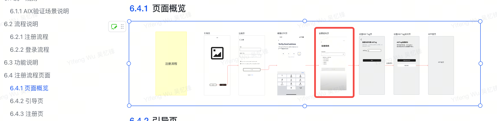
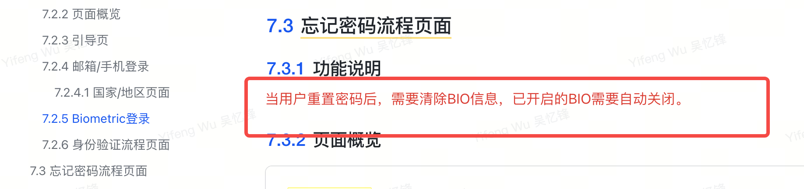
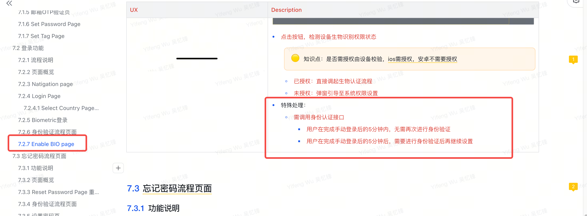
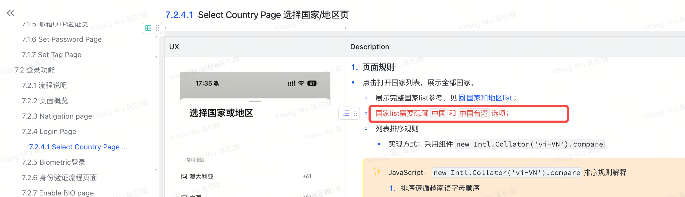
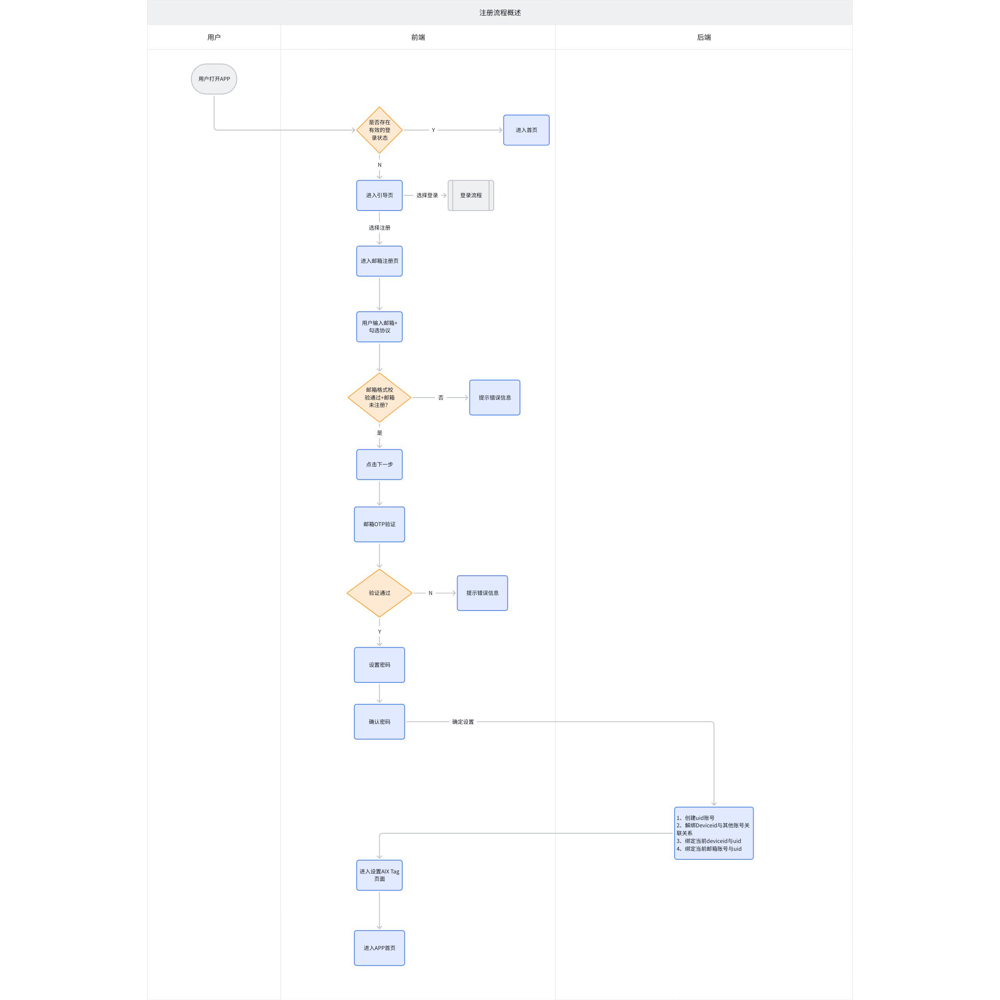
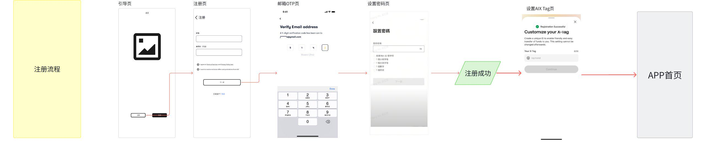

# AIX Card 注册登录需求 V1.0 — 注册功能

> 本文档由原始 PRD（飞书导出 .docx）100% 原文转译为结构化 Markdown，未做任何内容精简或归纳。

---

## 1. 引用资料

| 类型 | 链接 |
|------|------|
| PM | @Yifeng Wu 吴忆锋 |
| Figma | https://www.figma.com/design/iDt3nk3jeLm8iGg91uvfVU/%E2%86%AA-AIX-Dev-Handoff-20 |
| 翻译文案 | AIX 翻译文案管理-多维表 |
| BRD | N/A |

---

## 2. 项目概述

### 2.1 项目背景

为满足全球用户对一体化、便捷安全数字金融服务的需求，本项目旨在开发一款创新的移动应用。该应用将整合先进的支付与账户管理技术，致力于为用户提供全新的移动端金融管理体验。

### 2.2 项目目的

- **构建基础**：建立安全、便捷的用户注册登录与账户体系。
- **核心功能**：实现充值、提现、转账、消费等关键支付功能。
- **安全保障**：通过多层验证与风控策略，确保用户资产与信息安全。
- **体验优化**：提供流畅直观的操作流程，提升用户留存。

---

## 3. 项目计划

> 原始PRD参考截图（飞书文档截图，含AIX项目管理表）


---

## 4. 国家线

| VN | PH | AU |
|----|----|----|
| ✅ | ✅ | ✅ |

---

## 5. 全局规则

### 5.1 AIX验证场景说明

> 详见独立文档：AIX验证场景维护

### 5.2 账户说明

> 原始PRD参考截图（飞书文档截图，含账户规则完整说明）


#### 5.2.1 UID 生成方式

服务端在用户注册成功后生成 UID。

#### 5.2.2 账户状态

共有4种状态【Active、Banned、Closed、Locked】

**Active：**
- 定义：账户正常使用中；
- 触发条件：注册成功后；

**Banned：**
- 定义：账户被限制使用；可恢复；
- 触发条件：风控触发对应规则，一期不支持；
- 限制：不可登录
- 解除方式：联系客服处理；

**Closed：**
- 定义：账户被注销；不可恢复；
- 触发条件：风控触发对应规则/客服手动操作，一期不支持；
- 限制：不可登录，所有功能不可用；
- 解除方式：无法解除

**Locked：**
- 定义：因安全原因临时锁定；
- 触发条件：登录失败超过N次；
- 限制：不可登录
- 解除方式：
  - 自动解除：锁定时长到期后自动变为 Active。
  - 自助解除：用户通过"忘记密码"重置密码后立即解除。

#### 5.2.3 登录失败锁定说明

（详见登录模块）

#### 5.2.4 昵称规则

注册成功后昵称自动生成，生成规则：随机4位英文+随机6位数字。
需要用户手动设置，见需求AIX Card ME模块需求V1.0

#### 5.2.5 手机号/邮箱唯一性规则

- 邮箱：全局唯一，不允许重复注册或绑定。
- 手机号：全局唯一，不允许重复注册或绑定。

#### 5.2.6 设备绑定策略

- 自动绑定：用户成功注册/登录后，系统自动将当前 Device ID 与账户绑定。
- 绑定数量限制：单个账户最多绑定 1 个deviceid。
- 最多允许 1 个设备同时在线。
- 仅当设备已绑定，登录时方可启用 Biometric 功能

---

## 6. 需求变更日志（Table 0）

> 以下为原文档变更记录表中的关键变更截图

| 版本行 | 变更说明 | 截图 |
|--------|----------|------|
| R2 | 更正错误描述 @Dongjie Tan 谭东杰 @Bowen Li (Eli) |  |
| R3 | 登录密码调整：旧规则：登录密码为6位数字；新规则：登录密码为英文字母+数字+特殊字符 |   |
| R5 | 补充5分钟有效期描述 @Xin Wang 王鑫 |  |
| R6 | 【注册页】支持大小写字母 @Yu Zhang 张豫；【设置AIX Tag页】补充规则 |     |
| R7 | 【忘记密码流程页面】-【功能说明】补充忘记密码后，需要自动关闭bio @Yu |  |
| R9 | 登录后，设置Bio需进行身份认证 @Dongjie Tan 谭东杰 @Lei |  |
| R10 | @Dongjie Tan 谭东杰 @Lei Zhang 张雷 @Wei Sun 孙伟 |  |
| R11 | （无文字描述） |  |
| R12 | @yurong liu 刘玉荣 @Lei Zhang 张雷 补充逻辑：切换时保留填写内容 |  |

---

## 7. 注册功能

### 7.1 流程说明

> 原始PRD参考截图（飞书文档截图，含注册流程概览图）



### 7.2 页面概览

> 原始PRD参考截图（飞书文档截图，含注册功能所有页面概览）



---

### 7.3 Navigation Page（引导页）

> 对应原文 7.1.3 Navigation Page

#### UX 参考截图

> 原始PRD参考截图（飞书文档截图，含引导页UI原型 — 多状态展示同一页面）

| 状态 | UX截图 |
|------|--------|
| 默认状态 |  |

#### Description 参考截图


#### 功能说明

1. **推广引导区**
   - 一期写死，后续需在OBOSS配置实现

2. **注册按钮**
   - 点击Creat account按钮，跳转至邮箱注册页；
   - 点击I already have an account按钮，跳转至邮箱/手机登录页；

---

### 7.4 Registration Page（邮箱注册页）

> 对应原文 7.1.4 Registration Page

#### UX 参考截图

> 原始PRD参考截图（飞书文档截图，含注册页UI原型 — 多状态展示同一页面）

| 状态 | UX截图 |
|------|--------|
| 默认状态 |  |

#### Description 参考截图


#### 功能说明

**1. Email输入框**

输入规则：
- 最长限制为103个字符，超出不可输入；

实时格式校验：
- 当格式不符合邮箱规范（如：缺少@符号、域名不完整）时，应提示：Email format is invalid
- 当输入框为空时，应提示：Email should not be empty

**2. Referral code输入框**

格式规则：
- 长度限制：总长度限制为3-30个字符，提示：Please enter 3–30 letters or digits.
- 类型限制，只能输入英文（区分大小写）+数字，提示：Please enter 3–30 letters or digits.

**3. 协议说明**

- 默认为不勾选状态

协议内容展示：
- 内容来源：Terms of service与 Privacy Policy test的协议全文内容需从中台管理系统读取。
- 展示方式：用户点击Terms of service或Privacy Policy test超链接文本时，系统需在页面内展示完整的协议内容。
- 协议链接：https://advancegroup.sg.larksuite.com/drive/folder/KcRtfsWfvl3BoMd48W1lbgcugcc
- 快照保存：当用户本次注册成功后，系统必须将用户所同意的 Terms of service & Privacy Policy test 的协议版本内容生成不可更改的快照，并与用户账户绑定存储。
- 若后端报错，无法获取协议则toast提示：Something went wrong. Please try again later

**4. 下一步按钮**

按钮变为可点击状态，必须同时满足以下两个条件：
- 邮箱格式有效：邮箱输入框内容非空，且通过系统格式校验，无异常错误提示。
- 协议已同意：所有必选的用户协议复选框均已被用户勾选。

正常流程：用户点击后，系统执行注册流程，进入下一步流程邮箱OTP页。

异常处理：
- 若推荐码不存在：提示：Referral code does not exist
- 若系统检测到所填邮箱已被注册，提示：This email has been used

频控：
- 同一个设备指纹总次数限制：5次 / 10分钟，超过后锁定 10分钟。toast提示：The system is busy, please try again later。
- 同一个IP单位时间内总次数限制：100次 / 10分钟，超过后锁定 10分钟。toast提示：The system is busy, please try again later。
- 接口总限流（研发定义）超过后，toast提示：The system is busy, please try again later。

**5. 登录按钮**

- 点击登录跳转到邮箱/手机登录页

---

### 7.5 邮箱OTP验证页

> 对应原文 7.1.5 邮箱OTP验证页
> 详细需求见：AIX Security 身份认证需求V1.0

---

### 7.6 Set Password Page（设置密码页）

> 对应原文 7.1.6 Set Password Page

#### UX 参考截图

> 原始PRD参考截图（飞书文档截图，含设置密码页UI原型 — 多状态展示同一页面）

| 状态 | UX截图 |
|------|--------|
| 默认状态 |  |

#### Description 参考截图


#### 功能说明

**1. 返回按钮**

点击弹出挽留弹窗：
- Title：Confirm Exit?
- Content: Are you sure you want to leave before verification is complete?
- Button:
  - Stay and continue: 点击后关闭弹窗，停留在当前页；
  - Leave: 点击后关闭弹窗，返回到入口页；

**2. 标题**

固定文案：设置密码

**3. 密码输入框**

3.1 输入规则：
- 长度限制：最长输入32个字符。当用户输入超过32个字符时，前端应禁止其继续输入，并可在界面toast提示（如Toast提示"密码最长32个字符"）。

支持的字符类型：
- 小写字母：a - z
- 大写字母：A - Z
- 数字：0 - 9
- 符号/特殊字符：常见的标点符号和特殊字符，例如：! @ # $ % ^ & * ( ) _ + - = { } [ ] | \ : " ; ' < > ? , . / 等。

显示控制：
- 默认状态：输入框内所有字符以密文（圆点•或星号*）形式显示。
- 显示/隐藏切换：输入框右侧必须提供"眼睛"图标。
  - 图标为"闭眼"状态时，显示密文。
  - 用户点击后，图标切换为"睁眼"状态，密码以明文显示。再次点击，恢复密文显示。

输入框失焦后校验：
- 密码长度不足8位或超过32位。红字提示：Password must be between 8-32 characters
- 密码长度符合，但不包含任何小写字母 (a-z)。提示：Password must include a lowercase letter
- 密码长度符合，但不包含任何大写字母 (A-Z)。提示：Password must include an uppercase letter
- 密码长度符合，但不包含任何数字 (0-9)。提示：Password must include a number
- 密码长度符合，但不包含任何符号（如!@#$等）。提示：Password must include a supported symbol

**4. Next按钮**

- 只有当错误提示信息消失（即所有校验均通过）时，"下一步"按钮才变为可点击状态
- 点击按钮，进入Re-set Password Page

---

### 7.7 Re-enter Password Page（确认密码页）

> 对应原文 7.1.7 Re-enter Password Page

#### UX 参考截图

> 原始PRD参考截图（飞书文档截图，含确认密码页UI原型 — 多状态展示同一页面）

| 状态 | UX截图 |
|------|--------|
| 默认状态 |  |

#### Description 参考截图


#### 功能说明

**1. 返回按钮**

点击弹出挽留弹窗：
- Title：Confirm Exit?
- Content: Are you sure you want to leave before verification is complete?
- Button:
  - Stay and continue: 点击后关闭弹窗，停留在当前页；
  - Leave: 点击后关闭弹窗，返回到入口页；

**2. 标题**

固定文案：设置密码

**3. 密码输入框**

3.1 输入规则：
- 长度限制：最长输入32个字符。当用户输入超过32个字符时，前端应禁止其继续输入，并可在界面toast提示（如Toast提示"密码最长32个字符"）。

支持的字符类型：
- 小写字母：a - z
- 大写字母：A - Z
- 数字：0 - 9
- 符号/特殊字符：常见的标点符号和特殊字符，例如：! @ # $ % ^ & * ( ) _ + - = { } [ ] | \ : " ; ' < > ? , . / 等。

显示控制：
- 默认状态：输入框内所有字符以密文（圆点•或星号*）形式显示。
- 显示/隐藏切换：输入框右侧必须提供"眼睛"图标。
  - 图标为"闭眼"状态时，显示密文。
  - 用户点击后，图标切换为"睁眼"状态，密码以明文显示。再次点击，恢复密文显示。

实时动态校验：
- 密码长度不足8位或超过32位。提示：Password must be between 8-32 characters
- 密码长度符合，但不包含任何小写字母 (a-z)。提示：Password must include a lowercase letter
- 密码长度符合，但不包含任何大写字母 (A-Z)。提示：Password must include an uppercase letter
- 密码长度符合，但不包含任何数字 (0-9)。提示：Password must include a number
- 密码长度符合，但不包含任何符号（如!@#$等）。提示：Password must include a symbol

**4. Next按钮**

- 只有当错误提示信息消失（即所有校验均通过）时，"下一步"按钮才变为可点击状态
- 点击按钮，系统完成密码设置，逻辑处理：
  - 两次密码不一致，提示：Passwords do not match. Please try again.
  - 创建失败：后端返回服务器错误，系统弹出错误提示弹窗
  - 创建成功：系统完成账户注册流程，用户自动登录，并跳转至设置AIX Tag页。

---

### 7.8 Set Tag Page（设置AIX Tag页）

> 对应原文 7.1.8 Set Tag Page

#### UX 参考截图

> 原始PRD参考截图（飞书文档截图，含设置Tag页UI原型 — 多状态展示同一页面）

| 状态 | UX截图 |
|------|--------|
| 默认状态 |  |

#### Description 参考截图


#### 功能说明

**1. 主标题&副标题**

- title：Create your X-Tag
- subtitle：Create a unique ID so others can easily send you funds. This can't be changed later.

**2. AIX Tag格式规则**

格式规则：
- 组成结构：AIX Tag由固定前缀"@"和用户自定义部分组成。
- 字符集限制：自定义部分仅支持大小写字母（a-z）、数字（0-9）、下划线（_）和点号（.）。
- 长度限制：总长度限制为3-30个字符（不含"@"前缀）。
- 格式约束：
  - 不能以下划线（_）或点号（.）结尾。
  - 不允许连续出现两个下划线（_）或连续两个点号（.）。
  - 区分大小写
- 保留字限制：禁止使用系统保留关键词：admin、support、api、null，此处不区分大小写；

唯一性校验机制：
- 当用户输入内容后发起格式检查。若错误提示：
  ```
  Requirements:
  - Between 3-30 characters
  - Use letters, numbers, underscores (_), or periods (.)
  - No double underscores or periods
  - Can't end with _ or .
  - Reserved words (admin, support, api, null) aren't allowed
  ```

校验结果处理：
- 若Tag已被占用，系统返回"不可用"状态。
- 若Tag可用，系统返回"可用"状态。
- 若无网络：Toast提示：Please check your internet connection and try again.

**3. 右上角关闭按钮**

- 点击关闭，进入app首页；

**4. 确认-按钮**

- 初始状态为禁用（灰色）。仅当用户输入的字符符合格式要求，且Tag返回可用，则可点击；

点击后弹窗确认：
- title：Confirm your X-Tag
- subtitle：Once confirmed, it cannot be changed. Please make sure it's exactly what you want.
- button：Confirm and Cancel
  - 点击取消按钮，取消弹窗，停留在当前页面
  - 点击confirm按钮，业务逻辑处理：
    - 用户点击可用状态的确认按钮后，系统提交AIX Tag创建请求。
    - 唯一性校验：若该tag已存在，则提示：This tag is already taken. Try another one.
    - 创建成功：跳转至设置APP首页。
    - 创建失败：后端返回服务器错误，提示：Something went wrong. Please try again later.

---

## 8. 待定事项

- 手机国际区号调整
- 设备采集--mvp不做
- 邀请码需要单独自动生成code
- 登录时，如果手机号或邮箱不存在，需要提示
