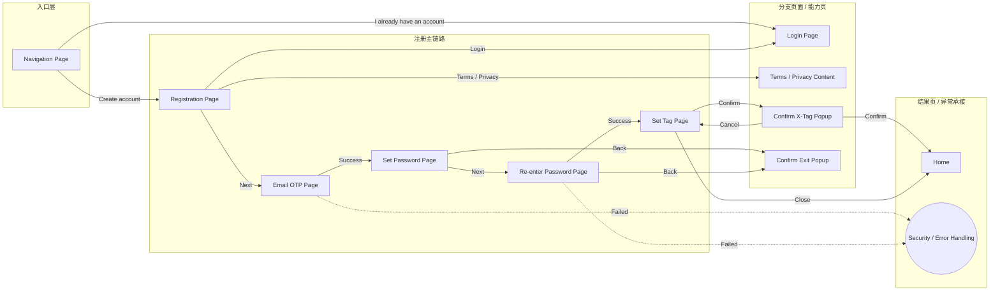
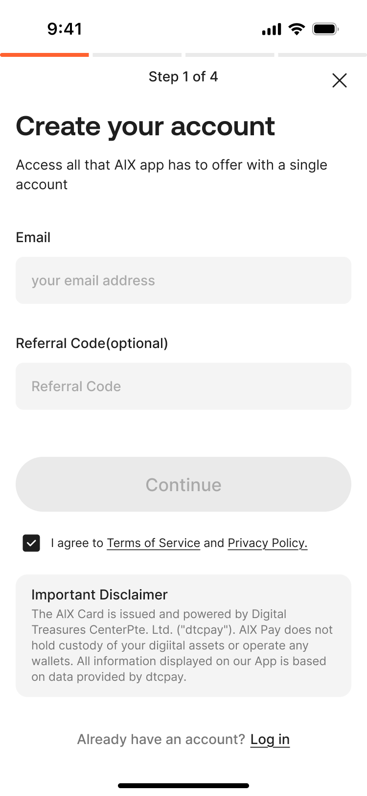
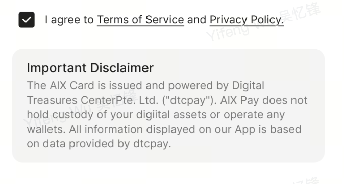

# Registration 注册功能

## 1. 功能定位

Registration 用于新用户通过邮箱创建 AIX 账户，并完成邮箱 OTP 验证、登录密码设置、AIX Tag 设置或跳过设置后进入 App 首页。

注册成功后，服务端生成 UID，账户状态为 Active。用户成功注册后，系统自动将当前 Device ID 与账户绑定。

## 2. 适用范围

| 维度 | 规则 | 来源 | 备注 |
|---|---|---|---|
| 国家线 | VN / PH / AU | AIX Card 注册登录需求V1.0 / 国家线 | 原文国家线均为支持 |
| 用户状态 | 未注册用户 | AIX Card 注册登录需求V1.0 / 7.1 注册功能 | 已有账户用户应进入 Login |
| 注册方式 | Email 注册 | AIX Card 注册登录需求V1.0 / 7.1.4 Registration Page | 原文为“邮箱注册页” |
| 账号唯一性 | 邮箱全局唯一，不允许重复注册或绑定 | AIX Card 注册登录需求V1.0 / 5.2.5 手机号/邮箱唯一性规则 | 手机号唯一性属于全局账户规则 |
| 账户状态 | 注册成功后触发 Active | AIX Card 注册登录需求V1.0 / 5.2.2 账户状态 | Banned / Closed / Locked 定义见账户状态规则 |
| 设备绑定 | 注册成功后自动绑定当前 Device ID | AIX Card 注册登录需求V1.0 / 5.2.6 设备绑定策略 | 单账户最多绑定 1 个 deviceId，最多 1 个设备同时在线 |
| 邮箱 OTP | 注册流程进入邮箱 OTP 页，详细规则见 Security | AIX Card 注册登录需求V1.0 / 7.1.5 邮箱OTP验证页 | 需引用 Security 模块 |

## 3. 前置条件

| 条件 | 说明 | 来源 |
|---|---|---|
| 用户未注册 | 已被注册邮箱不可继续注册 | AIX Card 注册登录需求V1.0 / 7.1.4 Registration Page |
| 协议可读取 | Terms of service 与 Privacy Policy 内容需从中台管理系统读取 | AIX Card 注册登录需求V1.0 / 7.1.4 Registration Page |
| 用户同意必选协议 | Next 可点击需满足邮箱格式有效且必选协议已勾选 | AIX Card 注册登录需求V1.0 / 7.1.4 Registration Page |

## 4. 业务流程

### 4.1 主链路

```text
Navigation Page → Registration Page → Email OTP Page → Set Password Page → Re-enter Password Page → Set Tag Page → Home
```

### 4.2 业务流程与系统交互时序图

```mermaid
sequenceDiagram
    autonumber
    actor User as User
    participant Client as AIX App / Client
    participant Backend as AIX Backend
    participant Security as Security Module

    rect rgb(245, 245, 245)
    Note over User,Backend: A. Email Registration
    User->>Client: 点击 Create account
    Client-->>User: 展示 Registration Page
    User->>Client: 输入 Email、Referral code（可选）并勾选必选协议
    Client->>Client: 执行邮箱格式、Referral code 格式、协议勾选校验
    alt Email invalid / empty
        Client-->>User: 留在 Registration Page，展示 Email 错误
    else Referral code format invalid
        Client-->>User: 留在 Registration Page，展示 Referral code 格式错误
    else Required agreement not checked
        Client-->>User: Next 保持禁用
    else Input valid
        Client-->>User: Next enabled
        User->>Client: 点击 Next
        Client->>Backend: 提交邮箱、Referral code、协议同意信息，执行注册前校验
        alt Referral code does not exist
            Backend-->>Client: 返回推荐码不存在
            Client-->>User: 留在 Registration Page，展示 Referral code does not exist
        else Email has been used
            Backend-->>Client: 返回邮箱已注册
            Client-->>User: 留在 Registration Page，展示 This email has been used
        else Rate limit / system busy
            Backend-->>Client: 返回频控或系统繁忙
            Client-->>User: Toast: The system is busy, please try again later
        else Agreement content unavailable
            Backend-->>Client: 返回协议获取失败
            Client-->>User: Toast: Something went wrong. Please try again later
        else Registration pre-check passed
            Backend-->>Security: 进入邮箱 OTP 验证流程
            Security-->>Client: 展示 Email OTP Page
        end
    end
    end

    rect rgb(245, 245, 245)
    Note over User,Backend: B. Password Setup
    Security-->>Client: Email OTP 验证成功
    Client-->>User: 展示 Set Password Page
    User->>Client: 输入密码
    Client->>Client: 校验密码长度与字符组成
    alt Password invalid
        Client-->>User: 留在 Set Password Page，展示对应密码错误
    else Password valid
        Client-->>User: Next enabled
        User->>Client: 点击 Next
        Client-->>User: 展示 Re-enter Password Page
        User->>Client: 再次输入密码并点击 Next
        Client->>Client: 校验确认密码格式与两次密码一致性
        alt Passwords do not match
            Client-->>User: 留在 Re-enter Password Page，展示 Passwords do not match. Please try again.
        else Backend server error
            Backend-->>Client: 返回服务器错误
            Client-->>User: 弹出错误提示弹窗
        else Password set success
            Backend-->>Client: 完成账户注册，自动登录
            Client-->>User: 展示 Set Tag Page
        end
    end
    end

    rect rgb(245, 245, 245)
    Note over User,Backend: C. AIX Tag Setup
    User->>Client: 输入 AIX Tag
    Client->>Client: 执行格式、保留字规则校验
    alt Format invalid / reserved word
        Client-->>User: 留在 Set Tag Page，展示 Requirements 错误规则
    else Format valid
        Client->>Backend: 发起 Tag 唯一性校验
        alt No network
            Client-->>User: Toast: Please check your internet connection and try again.
        else Tag already taken
            Backend-->>Client: 返回不可用
            Client-->>User: 提示 This tag is already taken. Try another one.
        else Tag available
            Backend-->>Client: 返回可用
            Client-->>User: Confirm 按钮可点击
            User->>Client: 点击 Confirm
            Client-->>User: 展示 Confirm your X-Tag 弹窗
            alt User clicks Cancel
                Client-->>User: 关闭弹窗，停留 Set Tag Page
            else User clicks Confirm
                Client->>Backend: 提交 AIX Tag 创建请求
                alt Create failed
                    Backend-->>Client: 返回服务器错误
                    Client-->>User: Something went wrong. Please try again later.
                else Create success
                    Backend-->>Client: 创建成功
                    Client-->>User: 进入 Home
                end
            end
        end
    end

    opt User clicks Close on Set Tag Page
        User->>Client: 点击右上角关闭
        Client-->>User: 进入 Home
    end
    end
```



### 4.3 业务逻辑矩阵

| 阶段 | 触发条件 | 前端校验 / 展示 | 后端 / 系统动作 | 成功结果 | 失败结果 |
|---|---|---|---|---|---|
| 进入注册 | Navigation Page 点击 `Create account` | 展示 Registration Page | 无 | 进入邮箱注册页 | 无 |
| 邮箱输入 | 用户输入 Email | 最长 103 字符；邮箱格式校验；空值校验 | 无 | Email 可用于提交 | `Email format is invalid` / `Email should not be empty` |
| Referral code 输入 | 用户输入 Referral code | 3–30 位；仅英文大小写 + 数字 | 无 | 可继续提交 | `Please enter 3–30 letters or digits.` |
| 协议展示 | 用户点击 Terms / Privacy 链接 | 页面内展示协议全文 | 从中台管理系统读取协议内容 | 用户可查看协议 | 获取失败 Toast: `Something went wrong. Please try again later` |
| Next 可点击 | Email 有效且必选协议已勾选 | Next enabled | 无 | 可点击进入注册流程 | 任一条件不满足则禁用 |
| 注册前校验 | 点击 Next | 提交 Email / Referral code / 协议信息 | 校验推荐码、邮箱唯一性、频控 | 进入邮箱 OTP 页 | 推荐码不存在、邮箱已注册、频控/系统繁忙 |
| 邮箱 OTP | 注册前校验通过 | 展示邮箱 OTP 页 | 按 Security 模块处理 | 验证成功进入 Set Password | 失败按 Security 规则处理 |
| Set Password | OTP 成功后 | 密码长度、字符组成、显示/隐藏控制 | 无 | Next 可点击 | 展示对应密码规则错误 |
| Re-enter Password | Set Password 通过后 | 再次输入密码；校验规则与一致性 | 创建账户 / 设置密码 | 注册完成、自动登录、进入 Set Tag | 密码不一致 / 服务器错误 |
| Set Tag | 自动登录后 | AIX Tag 格式、保留字、唯一性校验 | 创建 AIX Tag | 成功进入 Home | Tag 已占用 / 网络异常 / 创建失败 |
| 跳过 Set Tag | 点击右上角关闭 | 关闭 Set Tag Page | 无 | 进入 Home，Tag 为空 | 无 |

## 5. 页面关系总览

本节仅表达 Registration 模块涉及的页面节点和页面跳转关系。

系统校验、频控、协议快照、OTP 规则、密码规则和 Tag 规则以第 4 章业务流程和第 6 章页面卡片为准。



## 6. 页面卡片与交互规则

### 6.1 Navigation Page


| 元素 | 类型 | 展示条件 | 交互规则 | 异常 |
|---|---|---|---|---|
| 推广引导区 | Content | 页面展示时 | 一期写死，后续需在 OBOSS 配置实现 | 无 |
| Create account | Button | 默认展示 | 点击跳转至邮箱注册页 | 无 |
| I already have an account | Button | 默认展示 | 点击跳转至邮箱 / 手机登录页 | 无 |

### 6.2 Registration Page





| 维度 | 内容 |
|---|---|
| 页面目的 | 用户输入邮箱、Referral code，并同意协议后进入邮箱 OTP 验证 |
| 入口 | Navigation Page 点击 `Create account` |
| 出口 | Next → Email OTP Page；Login → Login Page；Terms / Privacy → 协议内容展示 |
| 关键校验 | Email 格式、Referral code 格式、协议勾选、邮箱唯一性、推荐码存在性、频控 |

| 元素 | 类型 | 展示条件 | 交互规则 | 异常 |
|---|---|---|---|---|
| Email 输入框 | TextInput | 默认展示 | 最长 103 字符，超出不可输入；实时格式校验 | `Email format is invalid`；`Email should not be empty` |
| Referral code 输入框 | TextInput | 默认展示 | 3–30 位；仅英文大小写 + 数字；区分大小写 | `Please enter 3–30 letters or digits.`；`Referral code does not exist` |
| 协议复选框 | Checkbox | 默认展示 | 默认为不勾选；必选协议勾选后才满足 Next 条件 | 协议默认状态与合规确认见 `knowledge-gaps.md` |
| Terms of service / Privacy Policy test | Link | 默认展示 | 点击后页面内展示协议全文；内容从中台管理系统读取 | 获取失败 Toast: `Something went wrong. Please try again later` |
| Next | Button | Email 有效且所有必选协议已勾选 | 点击执行注册流程，进入邮箱 OTP 页 | 邮箱已注册、推荐码不存在、频控/限流 |
| Login | Button / Link | 默认展示 | 点击跳转至邮箱 / 手机登录页 | 无 |

Next 异常与频控：

| 场景 | 规则 | 用户提示 | 来源 |
|---|---|---|---|
| 推荐码不存在 | 后端判断 Referral code 不存在 | `Referral code does not exist` | AIX Card 注册登录需求V1.0 / 7.1.4 Registration Page |
| 邮箱已注册 | 后端判断邮箱已被注册 | `This email has been used` | AIX Card 注册登录需求V1.0 / 7.1.4 Registration Page |
| 同设备指纹频控 | 5 次 / 10 分钟，超过后锁定 10 分钟 | `The system is busy, please try again later` | AIX Card 注册登录需求V1.0 / 7.1.4 Registration Page |
| 同 IP 频控 | 100 次 / 10 分钟，超过后锁定 10 分钟 | `The system is busy, please try again later` | AIX Card 注册登录需求V1.0 / 7.1.4 Registration Page |
| 接口总限流 | 研发定义 | `The system is busy, please try again later` | AIX Card 注册登录需求V1.0 / 7.1.4 Registration Page |

协议快照规则：

| 规则 | 内容 | 来源 |
|---|---|---|
| 协议来源 | Terms of service 与 Privacy Policy test 的协议全文内容需从中台管理系统读取 | AIX Card 注册登录需求V1.0 / 7.1.4 Registration Page |
| 协议展示 | 用户点击 Terms of service 或 Privacy Policy test 超链接时，系统需在页面内展示完整协议内容 | AIX Card 注册登录需求V1.0 / 7.1.4 Registration Page |
| 快照保存 | 注册成功后，系统必须将用户同意的协议版本内容生成不可更改快照，并与用户账户绑定存储 | AIX Card 注册登录需求V1.0 / 7.1.4 Registration Page |

### 6.3 Email OTP Page

> 邮箱 OTP 验证页详细需求见 Security 模块。

| 维度 | 内容 |
|---|---|
| 页面目的 | 注册流程中的邮箱 OTP 验证 |
| 入口 | Registration Page 点击 Next 并通过注册前校验 |
| 出口 | 验证成功 → Set Password Page |
| 关联模块 | `security/email-otp-verification.md` |

### 6.4 Set Password Page


| 维度 | 内容 |
|---|---|
| 页面目的 | 用户设置登录密码 |
| 入口 | Email OTP 验证成功 |
| 出口 | Next → Re-enter Password Page；Back → Confirm Exit Popup |
| 关键校验 | 8–32 位；必须包含小写、大写、数字、支持符号 |

| 元素 | 类型 | 展示条件 | 交互规则 | 异常 |
|---|---|---|---|---|
| Back | Button | 页面展示时 | 点击弹出 Confirm Exit 弹窗 | 无 |
| Title | Text | 页面展示时 | 固定文案：设置密码 | 文案是否需英文见 `knowledge-gaps.md` |
| Password 输入框 | TextInput | 页面展示时 | 最长 32 字符；超出前端禁止继续输入；默认密文；眼睛图标切换明/密文 | 见密码校验错误 |
| Next | Button | 所有密码校验通过 | 点击进入 Re-enter Password Page | 校验未通过时禁用 |

密码校验错误：

| 场景 | 用户提示 | 来源 |
|---|---|---|
| 长度不足 8 位或超过 32 位 | `Password must be between 8-32 characters` | AIX Card 注册登录需求V1.0 / 7.1.6 Set Password Page |
| 不包含小写字母 | `Password must include a lowercase letter` | AIX Card 注册登录需求V1.0 / 7.1.6 Set Password Page |
| 不包含大写字母 | `Password must include an uppercase letter` | AIX Card 注册登录需求V1.0 / 7.1.6 Set Password Page |
| 不包含数字 | `Password must include a number` | AIX Card 注册登录需求V1.0 / 7.1.6 Set Password Page |
| 不包含支持符号 | `Password must include a supported symbol` | AIX Card 注册登录需求V1.0 / 7.1.6 Set Password Page |

Confirm Exit Popup：

| 元素 | 文案 / 规则 | 来源 |
|---|---|---|
| Title | `Confirm Exit?` | AIX Card 注册登录需求V1.0 / 7.1.6 Set Password Page |
| Content | `Are you sure you want to leave before verification is complete?` | AIX Card 注册登录需求V1.0 / 7.1.6 Set Password Page |
| Stay and continue | 点击后关闭弹窗，停留当前页 | AIX Card 注册登录需求V1.0 / 7.1.6 Set Password Page |
| Leave | 点击后关闭弹窗，返回入口页 | AIX Card 注册登录需求V1.0 / 7.1.6 Set Password Page |

### 6.5 Re-enter Password Page


| 维度 | 内容 |
|---|---|
| 页面目的 | 用户再次输入密码并完成密码设置 |
| 入口 | Set Password Page 点击 Next |
| 出口 | 创建成功 → Set Tag Page；Back → Confirm Exit Popup |
| 关键校验 | 与 Set Password 相同的密码规则；两次密码一致性 |

| 元素 | 类型 | 展示条件 | 交互规则 | 异常 |
|---|---|---|---|---|
| Back | Button | 页面展示时 | 点击弹出 Confirm Exit 弹窗 | 无 |
| Title | Text | 页面展示时 | 固定文案：设置密码 | 文案是否需英文见 `knowledge-gaps.md` |
| Password 输入框 | TextInput | 页面展示时 | 最长 32 字符；默认密文；眼睛图标切换明/密文；实时动态校验 | 见密码校验错误 |
| Next | Button | 错误提示消失后可点击 | 点击后系统完成密码设置 | 密码不一致 / 服务器错误 |

提交结果：

| 场景 | 用户提示 / 动作 | 来源 |
|---|---|---|
| 两次密码不一致 | `Passwords do not match. Please try again.` | AIX Card 注册登录需求V1.0 / 7.1.7 Re-enter Password Page |
| 创建失败 | 后端返回服务器错误，系统弹出错误提示弹窗 | AIX Card 注册登录需求V1.0 / 7.1.7 Re-enter Password Page |
| 创建成功 | 完成账户注册流程，用户自动登录，并跳转至 Set Tag Page | AIX Card 注册登录需求V1.0 / 7.1.7 Re-enter Password Page |

### 6.6 Set Tag Page


| 维度 | 内容 |
|---|---|
| 页面目的 | 用户创建唯一 AIX Tag，使其他用户可用于转账识别 |
| 入口 | Re-enter Password Page 创建成功并自动登录后 |
| 出口 | Confirm 创建成功 → Home；Close → Home |
| 关键校验 | 格式规则、保留字规则、唯一性校验 |

| 元素 | 类型 | 展示条件 | 交互规则 | 异常 |
|---|---|---|---|---|
| Title | Text | 页面展示时 | `Create your X-Tag` | 无 |
| Subtitle | Text | 页面展示时 | `Create a unique ID so others can easily send you funds. This can't be changed later.` | 无 |
| AIX Tag 输入框 | TextInput | 页面展示时 | 固定前缀 `@`；自定义部分 3–30 字符；支持字母、数字、下划线、点号；区分大小写 | 见 Requirements 错误规则 |
| Close | Button | 页面展示时 | 点击关闭，进入 App 首页 | Tag 为空进入首页 |
| Confirm | Button | 格式正确且 Tag 可用 | 点击弹出 Confirm your X-Tag 弹窗 | Tag 已占用 / 创建失败 |

AIX Tag 格式规则：

| 规则 | 内容 | 来源 |
|---|---|---|
| 组成结构 | 固定前缀 `@` + 用户自定义部分 | AIX Card 注册登录需求V1.0 / 7.1.8 Set Tag Page |
| 字符集 | 自定义部分仅支持大小写字母、数字、下划线 `_` 和点号 `.` | AIX Card 注册登录需求V1.0 / 7.1.8 Set Tag Page |
| 长度 | 自定义部分 3–30 个字符，不含 `@` 前缀 | AIX Card 注册登录需求V1.0 / 7.1.8 Set Tag Page |
| 结尾限制 | 不能以下划线 `_` 或点号 `.` 结尾 | AIX Card 注册登录需求V1.0 / 7.1.8 Set Tag Page |
| 连续字符限制 | 不允许连续两个下划线或连续两个点号 | AIX Card 注册登录需求V1.0 / 7.1.8 Set Tag Page |
| 保留字 | 禁止 admin、support、api、null；不区分大小写 | AIX Card 注册登录需求V1.0 / 7.1.8 Set Tag Page |

Requirements 错误规则：

```text
Requirements:
- Between 3-30 characters
- Use letters, numbers, underscores (_), or periods (.)
- No double underscores or periods
- Can't end with _ or .
- Reserved words (admin, support, api, null) aren't allowed
```

Confirm your X-Tag 弹窗：

| 元素 | 文案 / 规则 | 来源 |
|---|---|---|
| Title | `Confirm your X-Tag` | AIX Card 注册登录需求V1.0 / 7.1.8 Set Tag Page |
| Subtitle | `Once confirmed, it cannot be changed. Please make sure it's exactly what you want.` | AIX Card 注册登录需求V1.0 / 7.1.8 Set Tag Page |
| Cancel | 点击取消按钮，取消弹窗，停留当前页面 | AIX Card 注册登录需求V1.0 / 7.1.8 Set Tag Page |
| Confirm | 提交 AIX Tag 创建请求 | AIX Card 注册登录需求V1.0 / 7.1.8 Set Tag Page |

Tag 创建结果：

| 场景 | 用户提示 / 动作 | 来源 |
|---|---|---|
| Tag 已存在 | `This tag is already taken. Try another one.` | AIX Card 注册登录需求V1.0 / 7.1.8 Set Tag Page |
| 无网络 | Toast: `Please check your internet connection and try again.` | AIX Card 注册登录需求V1.0 / 7.1.8 Set Tag Page |
| 创建失败 | `Something went wrong. Please try again later.` | AIX Card 注册登录需求V1.0 / 7.1.8 Set Tag Page |
| 创建成功 | 跳转至 App 首页 | AIX Card 注册登录需求V1.0 / 7.1.8 Set Tag Page |

## 7. 字段与接口依赖

| 字段 / 能力 | 用途 | 读/写 | 来源 | 备注 |
|---|---|---|---|---|
| email | 注册账号 | 读 | Registration Page | 最长 103 字符；邮箱全局唯一 |
| referralCode | 推荐码 | 读 | Registration Page | 3–30 位；英文大小写 + 数字；需校验是否存在 |
| termsOfService | 协议内容 | 读 | 中台管理系统 | 点击链接展示全文 |
| privacyPolicy | 协议内容 | 读 | 中台管理系统 | 原文为 `Privacy Policy test` |
| agreementSnapshot | 用户注册时同意的协议快照 | 写 | Backend | 注册成功后生成不可更改快照并绑定账户 |
| password | 登录密码 | 写 | Set Password / Re-enter Password | 8–32 位；包含小写、大写、数字、符号 |
| aixTag | AIX Tag | 写 | Set Tag Page | 创建后不可更改 |
| uid | 用户唯一标识 | 写 | Backend | 服务端在用户注册成功后生成 |
| accountStatus | 账户状态 | 写 | Account Status | 注册成功后 Active |
| deviceId | 设备绑定 | 写 | Device Binding | 注册成功后自动绑定当前 Device ID |

## 8. 异常与失败处理

| 场景 | 触发条件 | 用户提示 | 系统动作 | 最终状态 | 来源 |
|---|---|---|---|---|---|
| Email 格式错误 | Email 不符合邮箱规范 | `Email format is invalid` | 阻止 Next | 留在 Registration Page | AIX Card 注册登录需求V1.0 / 7.1.4 |
| Email 为空 | Email 输入框为空 | `Email should not be empty` | 阻止 Next | 留在 Registration Page | AIX Card 注册登录需求V1.0 / 7.1.4 |
| Referral code 格式错误 | 长度不在 3–30 或含非法字符 | `Please enter 3–30 letters or digits.` | 阻止 Next / 展示错误 | 留在 Registration Page | AIX Card 注册登录需求V1.0 / 7.1.4 |
| Referral code 不存在 | 后端校验不存在 | `Referral code does not exist` | 阻止注册 | 留在 Registration Page | AIX Card 注册登录需求V1.0 / 7.1.4 |
| Email 已注册 | 后端检测邮箱已被注册 | `This email has been used` | 阻止注册 | 留在 Registration Page | AIX Card 注册登录需求V1.0 / 7.1.4 |
| 协议获取失败 | 后端无法获取协议 | `Something went wrong. Please try again later` | 阻止协议展示 / 注册 | 留在 Registration Page | AIX Card 注册登录需求V1.0 / 7.1.4 |
| 同设备指纹频控 | 5 次 / 10 分钟，超过锁定 10 分钟 | `The system is busy, please try again later` | 阻止注册 | 留在 Registration Page | AIX Card 注册登录需求V1.0 / 7.1.4 |
| 同 IP 频控 | 100 次 / 10 分钟，超过锁定 10 分钟 | `The system is busy, please try again later` | 阻止注册 | 留在 Registration Page | AIX Card 注册登录需求V1.0 / 7.1.4 |
| 接口总限流 | 研发定义 | `The system is busy, please try again later` | 阻止注册 | 留在 Registration Page | AIX Card 注册登录需求V1.0 / 7.1.4 |
| Email OTP 失败 | Security 校验失败 | 按 Security 模块规则处理 | 阻止进入 Set Password | Email OTP Page / Security Handling | AIX Card 注册登录需求V1.0 / 7.1.5 |
| 密码规则不满足 | 密码长度或字符组成不满足 | 对应密码错误提示 | 阻止 Next | 留在 Set Password / Re-enter Password | AIX Card 注册登录需求V1.0 / 7.1.6 / 7.1.7 |
| 两次密码不一致 | Re-enter Password 与首次密码不同 | `Passwords do not match. Please try again.` | 阻止创建 | 留在 Re-enter Password Page | AIX Card 注册登录需求V1.0 / 7.1.7 |
| 密码创建失败 | 后端返回服务器错误 | 系统弹出错误提示弹窗 | 阻止进入 Set Tag | Re-enter Password Page | AIX Card 注册登录需求V1.0 / 7.1.7 |
| AIX Tag 格式错误 | 不满足格式 / 保留字规则 | 展示 Requirements | 阻止 Confirm | 留在 Set Tag Page | AIX Card 注册登录需求V1.0 / 7.1.8 |
| AIX Tag 已被占用 | 唯一性校验不通过 | `This tag is already taken. Try another one.` | 阻止创建 | 留在 Set Tag Page | AIX Card 注册登录需求V1.0 / 7.1.8 |
| AIX Tag 创建失败 | 后端返回服务器错误 | `Something went wrong. Please try again later.` | 阻止完成创建 | 留在 Set Tag Page | AIX Card 注册登录需求V1.0 / 7.1.8 |

## 9. 风控 / 合规边界

| 边界 | 规则 | 影响 | 来源 |
|---|---|---|---|
| 邮箱唯一性 | 邮箱全局唯一，不允许重复注册或绑定 | 防止重复账户 | AIX Card 注册登录需求V1.0 / 5.2.5 |
| Referral code 校验 | 格式校验 + 后端存在性校验 | 无效推荐码不可继续注册 | AIX Card 注册登录需求V1.0 / 7.1.4 |
| 协议同意 | 必选协议勾选后 Next 才可点击；注册成功后生成协议快照并绑定账户 | 合规留痕 | AIX Card 注册登录需求V1.0 / 7.1.4 |
| 频控 | 同设备指纹 5 次 / 10 分钟；同 IP 100 次 / 10 分钟；接口总限流研发定义 | 防刷注册 | AIX Card 注册登录需求V1.0 / 7.1.4 |
| 账户状态 | 注册成功后账户状态为 Active | 账户可正常使用 | AIX Card 注册登录需求V1.0 / 5.2.2 |
| 设备绑定 | 注册成功后自动绑定当前 Device ID；单账户最多绑定 1 个 Device ID | 限制多设备并发与 BIO 启用前置 | AIX Card 注册登录需求V1.0 / 5.2.6 |
| AIX Tag 不可更改 | 创建唯一 ID，确认后不可更改 | 影响后续收款识别 | AIX Card 注册登录需求V1.0 / 7.1.8 |

## 10. 来源引用

- (Ref: 历史prd/AIX Card 注册登录需求V1.0.docx / 5.2.2 账户状态 / V1.0)
- (Ref: 历史prd/AIX Card 注册登录需求V1.0.docx / 5.2.5 手机号/邮箱唯一性规则 / V1.0)
- (Ref: 历史prd/AIX Card 注册登录需求V1.0.docx / 5.2.6 设备绑定策略 / V1.0)
- (Ref: 历史prd/AIX Card 注册登录需求V1.0.docx / 7.1.3 Navigation Page / V1.0)
- (Ref: 历史prd/AIX Card 注册登录需求V1.0.docx / 7.1.4 Registration Page / V1.0)
- (Ref: 历史prd/AIX Card 注册登录需求V1.0.docx / 7.1.5 邮箱OTP验证页 / V1.0)
- (Ref: 历史prd/AIX Card 注册登录需求V1.0.docx / 7.1.6 Set Password Page / V1.0)
- (Ref: 历史prd/AIX Card 注册登录需求V1.0.docx / 7.1.7 Re-enter Password Page / V1.0)
- (Ref: 历史prd/AIX Card 注册登录需求V1.0.docx / 7.1.8 Set Tag Page / V1.0)
- (Ref: knowledge-base/security/email-otp-verification.md)
- (Ref: knowledge-base/changelog/knowledge-gaps.md / Account Registration / 2026-05-01)
