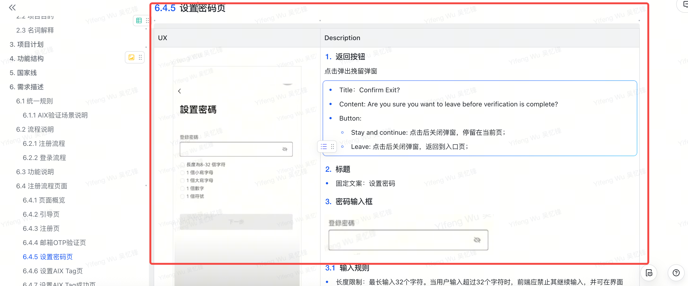
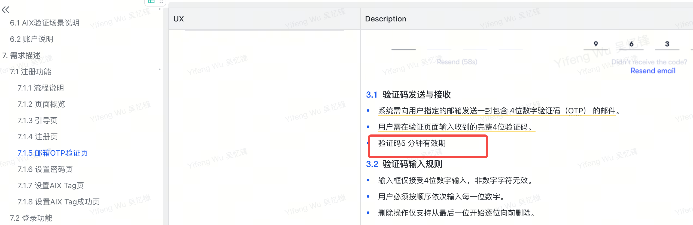
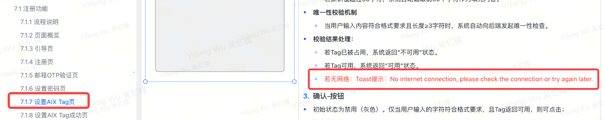
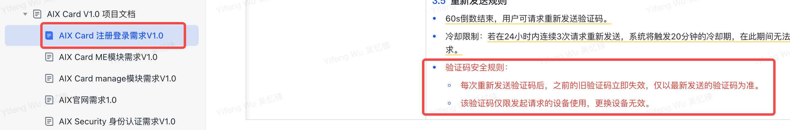

# Registration 注册

## 1. 功能概述

新用户通过邮箱注册 AIX Card 账户，完成 OTP 验证、密码设置和 X-Tag 创建后进入APP首页。

## 2. 用户流程


### 流程步骤（AI-readable）

| 步骤 | 角色 | 动作 | 条件/分支 | 下一步 |
|------|------|------|-----------|--------|
| 1 | 用户 | 打开APP，进入 Navigation Page | - | 2 |
| 2 | 用户 | 点击 "Create account" | - | 3 |
| 3 | 用户 | 输入邮箱 + 邀请码（可选）+ 勾选协议 | - | 4 |
| 4 | 前端 | 校验邮箱格式、协议勾选状态 | 不通过→显示错误提示 | 5 |
| 5 | 后端 | 校验邮箱唯一性、邀请码有效性 | 邮箱已注册→提示 / 邀请码无效→提示 | 6 |
| 6 | 后端 | 发送邮箱OTP | - | 7 |
| 7 | 用户 | 输入OTP验证码 | 见 [security/otp-verification](../security/otp-verification.md) | 8 |
| 8 | 用户 | 设置密码 | 见 [security/password-policy](../security/password-policy.md) | 9 |
| 9 | 用户 | 确认密码（Re-enter） | 两次不一致→提示 | 10 |
| 10 | 后端 | 创建账户 | 失败→弹窗提示 | 11 |
| 11 | 用户 | 设置 X-Tag | 校验格式+唯一性 | 12 |
| 12 | 系统 | 注册完成，进入APP首页 | - | - |

## 3. 页面清单

---

### 3.1 Navigation Page（引导页）



| 元素 | 类型 | 规则 |
|------|------|------|
| 推广引导区 | Banner | 一期写死，后续OBOSS配置 |
| Create account 按钮 | Button | 点击→跳转 Registration Page |
| I already have an account 按钮 | Button | 点击→跳转 Login Page |

---

### 3.2 Registration Page（注册页）



#### 页面元素

| 元素 | 类型 | 规则 | 必填 |
|------|------|------|------|
| Email 输入框 | TextInput | 最长103字符；实时格式校验 | ✅ |
| Referral code 输入框 | TextInput | 3-30字符，英文(区分大小写)+数字 | ❌ |
| 协议复选框 | Checkbox | 默认不勾选 | ✅ |
| Next 按钮 | Button | 邮箱有效 + 协议勾选 → 可点击 | - |
| 登录跳转链接 | Link | 跳转到 Login Page | - |

#### 交互逻辑

**Email 输入框：**
- 最长限制：103个字符，超出不可输入
- 实时格式校验：
  - 缺少@符号、域名不完整 → 提示：`Email format is invalid`
  - 输入框为空 → 提示：`Email should not be empty`

**Referral code 输入框：**
- 长度：3-30个字符
- 类型：英文（区分大小写）+ 数字
- 格式错误提示：`Please enter 3–30 letters or digits.`

**协议说明：**
- 内容来源：Terms of Service 与 Privacy Policy 从中台管理系统读取
- 展示方式：点击超链接文本，页面内展示完整协议内容
- 快照保存：注册成功后，当前协议版本内容生成不可更改快照，与账户绑定存储
- 协议获取失败 → Toast：`Something went wrong. Please try again later`

**Next 按钮触发条件：**
1. 邮箱格式有效（非空 + 通过校验 + 无错误提示）
2. 所有必选协议已勾选

**Next 按钮异常处理：**

| 异常场景 | 提示文案 |
|----------|----------|
| 邀请码不存在 | `Referral code does not exist` |
| 邮箱已被注册 | `This email has been used` |

**频控规则：**

| 维度 | 限制 | 锁定时间 | 提示 |
|------|------|----------|------|
| 同一设备指纹 | 5次/10分钟 | 10分钟 | `The system is busy, please try again later` |
| 同一IP | 100次/10分钟 | 10分钟 | `The system is busy, please try again later` |
| 接口总限流 | 研发定义 | - | `The system is busy, please try again later` |

---

### 3.3 邮箱OTP验证页

> 👉 见 [security/otp-verification.md](../security/otp-verification.md)

---

### 3.4 Set Password Page（设置密码页）


#### 页面元素

| 元素 | 类型 | 规则 |
|------|------|------|
| 返回按钮 | Button | 点击弹出挽留弹窗 |
| 标题 | Text | 固定文案："设置密码" |
| 密码输入框 | PasswordInput | 见下方规则 |
| Next 按钮 | Button | 所有校验通过→可点击 |

#### 返回按钮-挽留弹窗

| 字段 | 内容 |
|------|------|
| Title | `Confirm Exit?` |
| Content | `Are you sure you want to leave before verification is complete?` |
| 按钮1 | `Stay and continue` → 关闭弹窗，留在当前页 |
| 按钮2 | `Leave` → 关闭弹窗，返回入口页 |

#### 密码输入规则

> 👉 完整密码策略见 [security/password-policy.md](../security/password-policy.md)

- 长度：8-32字符
- 字符集：小写字母 + 大写字母 + 数字 + 特殊符号
- 显示控制：默认密文，眼睛图标切换明文/密文
- **校验时机**：输入框失焦后校验

#### 密码校验提示

| 校验项 | 提示文案 |
|--------|----------|
| 长度不足8位或超过32位 | `Password must be between 8-32 characters` |
| 不含小写字母 | `Password must include a lowercase letter` |
| 不含大写字母 | `Password must include an uppercase letter` |
| 不含数字 | `Password must include a number` |
| 不含符号 | `Password must include a supported symbol` |

#### Next 按钮
- 所有校验通过（错误提示消失）→ 可点击
- 点击 → 进入 Re-enter Password Page

---

### 3.5 Re-enter Password Page（确认密码页）



#### 页面元素

与 Set Password Page 结构相同，区别：

- **校验时机**：实时动态校验（非失焦触发）
- **Next 按钮逻辑**：

| 场景 | 处理 |
|------|------|
| 两次密码不一致 | 提示：`Passwords do not match. Please try again.` |
| 创建失败（后端错误） | 弹出错误提示弹窗 |
| 创建成功 | 自动登录，跳转 Set Tag Page |

---

### 3.6 Set Tag Page（设置 X-Tag 页）



#### 页面元素

| 元素 | 类型 | 规则 |
|------|------|------|
| 主标题 | Text | `Create your X-Tag` |
| 副标题 | Text | `Create a unique ID so others can easily send you funds. This can't be changed later.` |
| Tag 输入框 | TextInput | @前缀 + 自定义部分 |
| 关闭按钮 | Button | 右上角，点击进入APP首页 |
| 确认按钮 | Button | 格式+可用性校验通过→可点击 |

#### X-Tag 格式规则

| 规则项 | 说明 |
|--------|------|
| 结构 | 固定前缀 `@` + 用户自定义部分 |
| 字符集 | 大小写字母(a-z)、数字(0-9)、下划线(_)、点号(.) |
| 长度 | 3-30字符（不含@前缀） |
| 格式约束 | 不能以 `_` 或 `.` 结尾；不允许连续 `__` 或 `..` |
| 大小写 | 区分大小写 |
| 保留字 | admin、support、api、null（不区分大小写） |

#### 格式错误提示
```
Requirements:
- Between 3-30 characters
- Use letters, numbers, underscores (_), or periods (.)
- No double underscores or periods
- Can't end with _ or .
- Reserved words (admin, support, api, null) aren't allowed
```

#### 唯一性校验

| 结果 | 处理 |
|------|------|
| Tag 已被占用 | 显示"不可用"状态 |
| Tag 可用 | 显示"可用"状态，确认按钮激活 |
| 无网络 | Toast：`Please check your internet connection and try again.` |

#### 确认按钮-二次确认弹窗

| 字段 | 内容 |
|------|------|
| Title | `Confirm your X-Tag` |
| Subtitle | `Once confirmed, it cannot be changed. Please make sure it's exactly what you want.` |
| Confirm 按钮 | 提交创建请求 |
| Cancel 按钮 | 关闭弹窗，留在当前页 |

#### 创建结果处理

| 场景 | 处理 |
|------|------|
| Tag 已存在（并发冲突） | 提示：`This tag is already taken. Try another one.` |
| 创建成功 | 跳转APP首页 |
| 创建失败 | 提示：`Something went wrong. Please try again later.` |

---

## 4. 待定事项

| 事项 | 状态 |
|------|------|
| 手机国际区号调整 | 待定 |
| 设备采集 | MVP不做 |
| 邀请码自动生成code | 待定 |
| 登录时手机号/邮箱不存在的提示 | 待定 |

## 5. 版本记录

| 日期 | 变更内容 | 变更人 |
|------|----------|--------|
| 2025-10-21 | 初稿 | 吴忆锋 |
| 2025-10-28 | 更正错误描述 | 吴忆锋 |
| 2025-10-29 | 登录密码调整：6位数字→英文+数字+符号，8-32位 | 吴忆锋 |
| 2025-10-29 | 目录调整（无功能调整） | 吴忆锋 |
| 2025-10-29 | 补充5分钟有效期描述 | 吴忆锋 |
| 2025-10-31 | 注册页支持大小写字母；Set Tag页补充无网络描述 | 吴忆锋 |
| 2025-11-11 | 忘记密码后需自动关闭BIO | 吴忆锋 |
