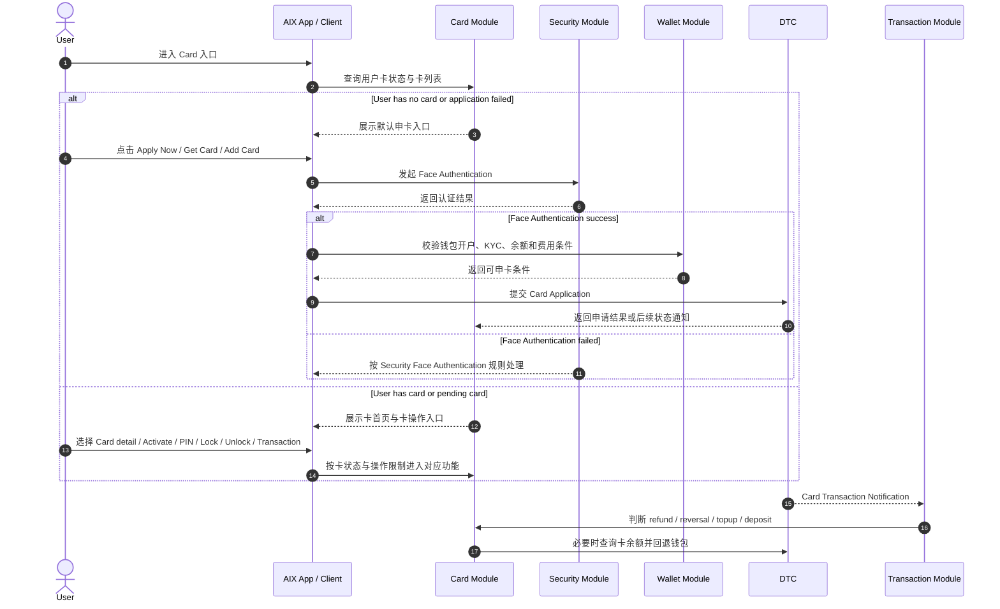
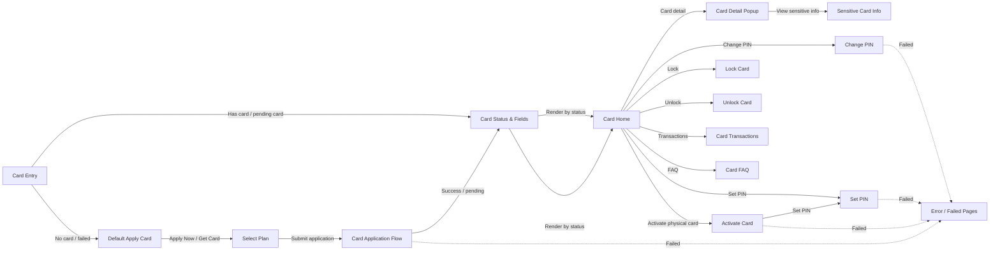

# Card 卡模块

## 1. 模块定位

Card 模块沉淀 AIX Card 的申请、卡首页、实体卡激活、PIN、敏感卡信息、锁卡 / 解锁、卡状态、卡字段和卡交易资金回退规则。

本模块依赖 Account、Wallet、Security、Transaction 和 DTC 能力。Card 模块不得重复定义 Security 已完成的认证规则，敏感操作统一引用 `security/face-authentication.md`、`security/otp-verification.md`、`security/biometric-verification.md` 等事实源。

## 2. 功能清单

| 功能 | 文件 | 状态 | 说明 | 来源 |
|---|---|---|---|---|
| Card Application | [application.md](./application.md) | active | 新用户申请虚拟卡 / 实体卡，包含申卡资格、卡类型、费用、币种、地区、自动扣款 | AIX Card V1.0【Application】 / 2.1 / 5.1 |
| Card Status & Fields | [card-status-and-fields.md](./card-status-and-fields.md) | active | 卡状态、卡类型、品牌、费用类型、自动扣款字段、接口路径和操作限制缺口已收口 | AIX Card V1.0【Application】 / 3-4；AIX Card manage模块需求V1.0 / 6.1-6.4 |
| Card Home | [card-home.md](./card-home.md) | active | 已申卡用户查看卡片、卡面、卡类型、操作入口、Recent Transactions、物流信息、FAQ | AIX Card V1.0【Application】 / 5.2；AIX APP V1.0【Home】 / 6.1 |
| Card Activation | [activation.md](./activation.md) | active | 实体卡激活流程，包含卡号后四位校验、Face Authentication、激活接口与 Set PIN 入口 | AIX Card manage模块需求V1.0 / 7.2 |
| PIN | [pin.md](./pin.md) | 未开始 | Set PIN / Change PIN / Reset PIN，PIN 为 4 位数字 | AIX Card manage模块需求V1.0 / 7.3；名词解释 PIN |
| Sensitive Info | [sensitive-info.md](./sensitive-info.md) | 未开始 | 查看完整卡号、CVC、有效期等敏感卡信息 | AIX Card V1.0【Application】 / 2.2；AIX Card manage模块需求V1.0 / 7.1 |
| Card Management | [card-management.md](./card-management.md) | 未开始 | Lock Card / Unlock Card / Cancel 等卡管操作 | AIX Card manage模块需求V1.0 / 7.4 / 7.5 / 6.4 |
| Card Transaction Flow | [card-transaction-flow.md](./card-transaction-flow.md) | 未开始 | 卡交易通知、退款 / reversal / topup / deposit 触发的卡余额回退钱包流程 | AIX Card交易【transaction】 / 7 |

## 3. 适用范围

| 维度 | 规则 | 来源 | 备注 |
|---|---|---|---|
| 国家线 | VN / PH / AU | AIX Card V1.0【Application】 / 2.1；AIX Card manage模块需求V1.0 / 5 | 一期国家线 |
| 申卡地区 | Philippines / Vietnam / Australia | AIX Card V1.0【Application】 / 2.1 | 后续可配置 |
| 支持币种 | USDT / USDC / WUSD / FDUSD | AIX Card V1.0【Application】 / 2.1 | 后续可配置 |
| 卡类型 | Virtual Card / Physical Card | AIX Card V1.0【Application】 / 5.1 | 实体卡需单独激活 |
| 品牌 | VISA / MASTER | AIX Card V1.0【Application】 / 4.1 | AIX Card 对应 Brand |
| 费用类型 | application fee / delivery fee | AIX Card V1.0【Application】 / 4.4 | 申请费 / 邮寄费 |
| 自动扣款 | OFF / ON | AIX Card V1.0【Application】 / 4.5 | 申卡时可上送，Home 可展示 Auto Debit 标签 |

## 4. 前置条件

| 条件 | 说明 | 来源 |
|---|---|---|
| 钱包已开通 | 用户必须完成 DTC 渠道开户和 KYC 验证通过 | AIX Card V1.0【Application】 / 2.1 |
| 刷脸 Token 有效 | Card Application 需完成刷脸 Token 验证 | AIX Card V1.0【Application】 / 2.1 / 2.2 |
| 申卡数量未达上限 | 用户申卡数量限制为 5 张，统计待激活、已激活、审核中、已冻结之和 | AIX Card V1.0【Application】 / 5.1.4 |
| 同一时间仅一张在途 | 一个用户可申请多张卡，但仅可一张在途 | AIX Card V1.0【Application】 / 2.1 |
| 费用处理完成 | 有减免费时直接开卡；无减免费时需余额足够覆盖制卡费 | AIX Card V1.0【Application】 / 2.1 |
| 卡状态允许操作 | 激活、PIN、Lock、Unlock、敏感信息、交易能力均受卡状态限制 | AIX Card manage模块需求V1.0 / 6.4 |

## 5. 业务流程

### 5.1 模块主链路

```text
Wallet Opened + KYC Passed → Face Authentication → Card Application → Card Status & Fields → Card Home → Card Manage / Card Transaction
```

### 5.2 业务流程与系统交互时序图



### 5.3 业务逻辑矩阵

| 阶段 | 触发条件 | 系统动作 | 成功结果 | 失败 / 拦截结果 |
|---|---|---|---|---|
| 入口判断 | 用户进入 Card | 查询申卡数量、在途卡、卡状态 | 展示申卡入口或卡首页 | 达上限则不展示或拦截申卡 |
| 申卡前置 | 用户发起申卡 | 校验钱包开户、KYC、刷脸 Token、币种、地区、费用 | 进入卡申请 | 条件不足则按对应模块规则拦截 |
| 卡申请 | 用户提交卡申请 | 调 DTC Card Application | 生成卡申请 / 卡状态 | 失败按申请流程处理 |
| 状态归一 | 进入 Card Home / Manage 前 | 统一卡状态、字段和操作限制 | 后续页面引用统一状态 | 状态冲突进入 gaps |
| 卡首页 | 用户已有卡或在途卡 | 按申请时间降序展示已激活、已冻结、待激活、审核中的卡 | 可进入卡操作 | 状态不支持时隐藏或禁用操作 |
| 卡管理 | 用户触发激活、PIN、Lock、Unlock、敏感信息 | 按卡状态与 Security 认证规则处理 | 完成对应卡操作 | 失败按功能文件处理 |
| 卡交易回退 | DTC 通知卡交易 | refund / reversal / topup / deposit 时查询卡余额 | balance > 0 时回退钱包 | 回退失败需告警并人工介入 |

## 6. 页面关系总览

本节只表达 Card 模块页面地图，不展开单功能业务校验。



## 7. 字段与接口依赖

| 字段 / 接口 / 能力 | 用途 | 来源 | 备注 |
|---|---|---|---|
| `Card Application` | 申请虚拟卡或实体卡 | AIX Card V1.0【Application】 / 2.2 / 6.1 | `[POST] /openapi/v1/card/request-card` |
| `Get Wallet Account Balance` | 查询全量钱包余额 | AIX Card V1.0【Application】 / 2.2 / 6.5 | 申卡钱包余额校验可用 |
| `Get Balance` | 查询单币种余额 | AIX Card V1.0【Application】 / 2.2 | 用于费用与币种余额判断 |
| `Get OTC Rate` | 查询汇率 | AIX Card V1.0【Application】 / 2.2 / 6.7 | 开卡扣费使用实时汇率 |
| `Inquiry Card Basic Info with Reference No` | 网络或响应异常时通过业务 ID 查询卡信息 | AIX Card V1.0【Application】 / 2.2 / 6.3 | 使用 referenceNo |
| `Get Card Basic Info` | 查看脱敏卡片详情、卡余额、追踪号码等 | AIX Card V1.0【Application】 / 2.2 | 卡首页 / 卡详情依赖 |
| `Get Card Sensitive Info` | 获取完整 PAN、CVC、有效期 | AIX Card V1.0【Application】 / 2.2 / 6.4 | 需完成刷脸 Token 验证 |
| `Card Status Change Notification` | 卡状态变更通知 | AIX Card V1.0【Application】 / 2.2 / 6.8 | DTC 通知 |
| `Card Delivery Notification` | 卡邮寄通知 | AIX Card V1.0【Application】 / 2.2 / 6.9 | 实体卡配送相关 |
| `Card Transaction Notification` | 卡交易通知 | AIX Card交易【transaction】 / 8.1 | 触发交易回退判断 |
| `Card Balance History Inquiry` | 查询卡余额 / 余额历史 | AIX Card交易【transaction】 / 8.1 | 回退钱包前查询余额 |
| `Transfer Balance to Wallet` | 将卡余额转回钱包 | AIX Card交易【transaction】 / 8.1 | 退款 / reversal 等场景使用 |

## 8. 异常与失败处理

| 场景 | 触发条件 | 系统动作 | 最终状态 | 来源 |
|---|---|---|---|---|
| 申卡达到上限 | 待激活、已激活、审核中、已冻结之和 >= 5 | 不展示入口或提交时提示 `Have reached limit of application AIX card` | 阻止申卡 | AIX Card V1.0【Application】 / 5.1.4 |
| 存在审核中卡 | 总数 < 5 且有审核中的卡 | 申卡入口置灰不可点击 | 暂不可再次申请 | AIX Card V1.0【Application】 / 5.1.4 |
| 刷脸认证失败 | 申卡或敏感卡操作需要 Face Authentication 但失败 | 按 Security Face Authentication 规则处理 | 阻止继续 | Security / Face Authentication |
| 卡状态不允许操作 | 当前卡状态不支持对应操作 | 隐藏、禁用或阻止操作 | 留在当前卡流程 | AIX Card manage模块需求V1.0 / 6.4 |
| 卡余额回退失败 | Transfer Balance to Wallet 失败 | 发送异常告警至监控群，人工介入处理 | 待人工跟进 | AIX Card交易【transaction】 / 7.3 |
| 回退金额大于卡余额 | 回退失败原因为交易金额大于卡余额 | 指定产品侧跟进处理 | 待人工跟进 | AIX Card交易【transaction】 / 7.3 |

## 9. 风控 / 合规边界

| 边界 | 规则 | 影响 | 来源 |
|---|---|---|---|
| KYC 前置 | 仅完成钱包开通、DTC 开户和 KYC 验证通过的用户可申卡 | 防止未实名用户开卡 | AIX Card V1.0【Application】 / 2.1 |
| Face Authentication 前置 | Card Application、查看敏感信息、激活卡、设置 PIN、重置 PIN 等使用 Face Authentication | 复用 Security 高强度认证 | AIX Security 身份认证需求V1.0 / 7.2；AIX Card V1.0【Application】 / 2.2 |
| 申卡数量限制 | 用户最多申请 5 张卡 | 控制卡片数量 | AIX Card V1.0【Application】 / 2.1 / 5.1.4 |
| 单在途限制 | 同一用户仅可一张在途卡 | 防止多张卡同时处理 | AIX Card V1.0【Application】 / 2.1 |
| 制卡费 | 未减免时需引导用户充值同币种钱包且余额足够覆盖制卡费 | 影响申卡成功条件 | AIX Card V1.0【Application】 / 2.1 |
| 状态限制 | 卡状态决定是否可查看、激活、PIN、Lock、Unlock、注销、交易 | 防止非法卡操作 | AIX Card manage模块需求V1.0 / 6.4 |
| 退款回退 | Refund 金额退回卡余额后可触发回退钱包；FX 费用和 Transaction Fee 不退 | 影响资金归集与对账 | AIX Card交易【transaction】 / 7 |

## 10. 来源引用

- (Ref: 历史prd/AIX Card V1.0【Application】.pdf / 2.1 申卡说明 / V1.0)
- (Ref: 历史prd/AIX Card V1.0【Application】.pdf / 2.2 接口范围 / V1.0)
- (Ref: 历史prd/AIX Card V1.0【Application】.pdf / 3 Card状态处理 / V1.0)
- (Ref: 历史prd/AIX Card V1.0【Application】.pdf / 4 Card数据字典 / V1.0)
- (Ref: 历史prd/AIX Card V1.0【Application】.pdf / 5.1 申请开卡 / V1.0)
- (Ref: 历史prd/AIX Card V1.0【Application】.pdf / 5.2 卡片首页 / V1.0)
- (Ref: 历史prd/AIX Card manage模块需求V1.0.docx / 6.4 卡片状态与操作限制对照表 / V1.0)
- (Ref: 历史prd/AIX Card manage模块需求V1.0.docx / 7.1 查看卡信息 / V1.0)
- (Ref: 历史prd/AIX Card manage模块需求V1.0.docx / 7.2 卡激活 / V1.0)
- (Ref: 历史prd/AIX Card manage模块需求V1.0.docx / 7.3 Set PIN / Change PIN / V1.0)
- (Ref: 历史prd/AIX Card manage模块需求V1.0.docx / 7.4 Lock Card / V1.0)
- (Ref: 历史prd/AIX Card manage模块需求V1.0.docx / 7.5 Unlock Card / V1.0)
- (Ref: 历史prd/AIX Card交易【transaction】.pdf / 7 需求描述 / V1.0)
- (Ref: 历史prd/AIX APP V1.0【Home】.pdf / Card 首页相关说明 / V1.0)
- (Ref: 历史prd/AIX APP V1.0【Transaction & History】.pdf / 卡交易列表与详情 / V1.0)
- (Ref: knowledge-base/security/face-authentication.md)
- (Ref: knowledge-base/security/global-rules.md)
