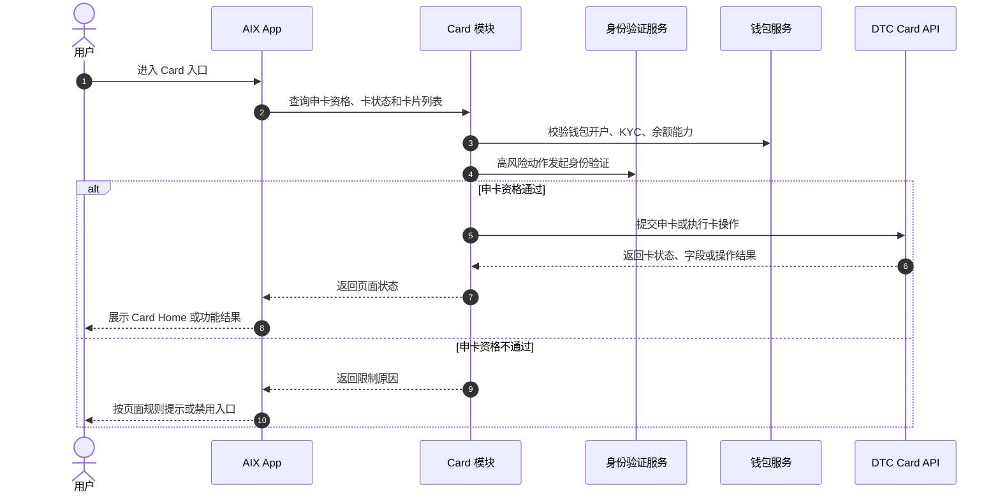
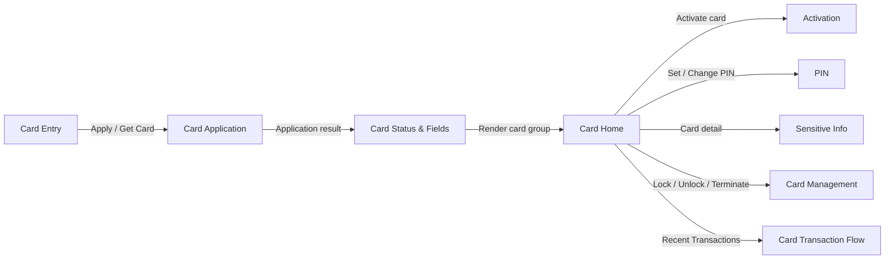

# Card 卡模块索引

## 1. 文档信息

| 项目 | 内容 |
|---|---|
| 功能名称 | Card 卡模块索引 |
| 所属模块 | Card |
| Owner | 吴忆锋 |
| 版本 | 1.3 |
| 状态 | Review |
| 更新时间 | 2026-05-04 |
| 来源文档 | AIX Card Application、AIX Card Manage、AIX Card Transaction、AIX APP Home、AIX APP Transaction & History、Standard PRD Template v1.3 |

---

## 2. 需求背景、目标与范围

### 2.1 需求背景

Card 模块需要统一沉淀 AIX Card 的申请、首页、实体卡激活、PIN、敏感信息查看、卡管理、状态字段和卡交易关联流程，作为 PM、UI、研发、QA 和 AI Agent 的事实入口。

### 2.2 用户问题 / 业务问题

Card 规则分散在 Application、Manage、Home、Transaction、DTC API 等资料中，容易出现状态口径、接口路径、字段枚举、页面边界和异常处理不一致的问题。

### 2.3 需求目标

建立符合标准 PRD 模板 v1.3 的 Card 模块索引，明确功能文件职责、来源等级、依赖关系、待确认事项和模块级验收口径。

### 2.4 涉及功能清单

| 功能点 | 本期范围 | 优先级 | 状态 | 说明 |
|---|---|---|---|---|
| Card Application | In Scope | P0 | Confirmed | 申卡流程、费用、币种、账单、邮寄、DTC 申卡接口 |
| Card Status & Fields | In Scope | P0 | Confirmed | 状态、字段、接口路径、操作限制统一事实源 |
| Card Home | In Scope | P1 | Open | 卡首页展示、操作入口、物流、Recent Transactions；Home 来源本次未完整提供 |
| Card Activation | In Scope | P0 | Open | 实体卡激活，后四位校验、激活接口、Set PIN 联动 |
| PIN | In Scope | P0 | Open | Set PIN、Change PIN、Reset PIN、PIN 公钥与 OTP |
| Sensitive Info | In Scope | P0 | Confirmed | 卡敏感信息认证后查看、复制、失败提示 |
| Card Management | In Scope | P0 | Open | Lock、Unlock、Terminate Card 能力边界 |
| Card Transaction Flow | In Scope | P1 | Open | 卡交易通知、余额归集、交易展示边界 |

---

## 3. 业务流程与规则

### 3.1 业务主流程说明

用户完成钱包开户与 KYC 后，可进入 Card Application 申请卡。申请成功或审核中后，卡状态统一进入 Card Status & Fields 管理，再由 Card Home 展示对应卡片和操作入口。后续激活、PIN、敏感信息、卡管理和交易展示均引用统一状态与字段事实源。

### 3.2 业务时序图

### 3.3 流程步骤与业务规则

| 步骤 | 场景 / 规则 | 触发条件 | 责任方 | 系统处理 | 成功结果 | 失败 / 分支结果 | 来源 |
|---|---|---|---|---|---|---|---|
| 1 | 申卡资格校验 | 用户点击 Apply / Get Card | App / Card | 校验 KYC、钱包、卡数量、审核中卡 | 进入 Application | 拦截或禁用入口 | Application / 2.1 / 5.1.4 |
| 2 | 状态归一 | 卡申请或卡操作返回状态 | Card | 引用状态事实源归类 | Home 展示正确状态组 | 未知状态进入待确认 | Status & Fields |
| 3 | 卡首页展示 | 用户进入 Card Home | App / Card | 查询卡基本信息、状态、入口 | 展示卡片和可用操作 | 无卡或失败展示默认申卡卡片 | Home / Application |
| 4 | 高风险操作 | 查看敏感信息、解锁、申卡等 | App / Security | 发起 Face Authentication / OTP | 允许继续操作 | 失败按 Security 规则处理 | Manage / Security |
| 5 | 外部 DTC 能力 | 申卡、激活、PIN、冻结、交易等 | Card | 调用 DTC API | 返回业务结果 | 展示错误或进入 Gap | DTC Card Issuing API |

### 3.4 状态规则

| 状态 | 含义 | 触发条件 | 用户可见表现 | 系统处理 | 可迁移到 | 是否终态 | 来源 |
|---|---|---|---|---|---|---|---|
| Pending / Processing | 审核中 | 申卡提交后待处理 | Under review | 禁止重复申请 | Active / Pending activation / Cancelled | 否 | Application / Manage |
| Pending activation / Inactive | 待激活实体卡 | 实体卡审核通过但未激活 | 显示物流与 Activate card | 仅允许激活 | Active | 否 | Application / Home |
| Active / ACTIVE | 已激活 | 虚拟卡生效或实体卡激活 | 展示卡面和可用操作 | 允许敏感信息、PIN、Lock、交易、注销 | Suspended / Cancelled | 否 | Manage / 6.4 |
| Suspended / SUSPENDED | 已冻结 | Freeze Card 成功 | 展示已冻结 | 允许 Unlock 和注销 | Active | 否 | Manage / 6.4 |
| BLOCKED | 阻断状态 | 外部或风控状态 | 仅允许查看卡信息 | 禁止敏感信息和交易 | 待确认 | 否 | Manage / 6.4 |
| CANCELLED | 取消 / 终止 | 申请失败或注销后可能状态 | 不允许操作 | 终止 | 不适用 | 是 | Manage / 6.4 |

### 3.5 业务级异常与失败处理

| 异常场景 | 触发条件 | 错误来源 | 错误码 / 原因 | 用户表现 | 系统处理 | 是否可重试 | 最终状态 |
|---|---|---|---|---|---|---|---|
| 状态无法归一 | DTC 或后端返回未知状态 | Backend / External | 未知状态 | 不展示高风险操作 | 进入待确认事项 | 否 | 待确认 |
| 接口路径冲突 | 历史 GET 与 DTC POST 路径不一致 | 文档冲突 | 路径冲突 | 不直接暴露给用户 | 优先采用 DTC POST 路径 | 否 | 待确认 |
| 自动扣款枚举冲突 | 产品 `2/ON` 与 DTC `1/ON` 不一致 | 文档冲突 | 枚举冲突 | 不直接暴露给用户 | 标记 P0 待确认 | 否 | 待确认 |
| 外部 DTC 失败 | 申卡或卡操作接口失败 | External | DTC error | 展示失败页或 Toast | 保留原状态并记录错误 | 视场景 | 原状态 |

---

## 4. 页面与交互说明

### 4.1 页面关系总览图

### 4.2 Card Module Index Page

| 区块 | 内容 |
|---|---|
| 页面类型 | 模块索引 / 知识库入口 |
| 页面目标 | 帮助 PM、UI、Dev、QA 快速定位 Card 功能文件和事实源 |
| 入口 / 触发 | 阅读 `knowledge-base/card/_index.md` |
| 展示内容 | 功能清单、来源等级、状态边界、依赖关系、待确认事项、验收标准 |
| 用户动作 | 进入对应功能文件阅读或维护 |
| 系统处理 / 责任方 | PM 维护索引；各功能 Owner 维护具体 PRD |
| 元素 / 状态 / 提示规则 | 不适用 |
| 成功流转 | 进入具体功能 PRD |
| 失败 / 异常流转 | 文件缺失或来源过期时进入待确认事项 |
| 备注 / 边界 | 本文件不替代具体功能 PRD |

---

## 5. 字段、接口与数据

| 类型 | 名称 | 所属系统 | 来源 | 用途 | 规则 / 输入输出 | 异常处理 |
|---|---|---|---|---|---|---|
| 文件 | `application.md` | Card | 本目录 | 申卡 PRD | 申卡流程与 DTC request-card | 版本过期时更新索引 |
| 文件 | `card-status-and-fields.md` | Card | 本目录 | 状态和字段事实源 | 其他文件必须引用 | 冲突时以本文件为准并记录 Gap |
| 文件 | `card-home.md` | Card | 本目录 | 首页展示 | 引用状态事实源 | Home 来源未验证时标记 |
| 文件 | `activation.md` | Card | 本目录 | 实体卡激活 | 引用状态和 PIN | 顺序不明进入待确认 |
| 文件 | `pin.md` | Card | 本目录 | PIN 设置 / 重置 | 引用 DTC PIN 接口 | 字段不明进入待确认 |
| 文件 | `sensitive-info.md` | Card | 本目录 | 敏感信息查看 | 引用 Security 与 DTC Sensitive Info | 失败不展示敏感信息 |
| 文件 | `card-management.md` | Card | 本目录 | Lock / Unlock / Terminate | 引用 Manage 6.4 和 DTC API | Terminate 流程缺失进入待确认 |
| 文件 | `card-transaction-flow.md` | Card / Transaction | 本目录 | 卡交易与归集 | 引用 DTC Notify 与 Wallet | 对账字段缺失进入 ALL-GAP |

---

## 6. 通知规则（如适用）

| 触发事件 | 通知渠道 | 通知对象 | 文案 / 模板 | 跳转目标 | 失败 / 补发规则 |
|---|---|---|---|---|---|
| 申卡状态变更 | Push / In-app | 持卡用户 | 由 Notification 模块维护 | Card Home / Application Details | 本索引不定义 |
| 卡交易成功 / 退款成功 | Push / In-app | 持卡用户 | 由 Notification 模块维护 | Card Transaction Details | 本索引不定义 |
| 资金归集失败告警 | Monitor | 内部运营 / 技术 | 由告警模块维护 | 内部处理台 | 待确认 |

---

## 7. 权限 / 合规 / 风控（如适用）

| 类型 | 规则 | 影响 | 来源 |
|---|---|---|---|
| 用户权限 | 用户需完成钱包开户、DTC 渠道开户和 KYC | 未完成不可申卡 | Application / 2.1 |
| 身份验证 | 申卡、敏感信息、解锁等高风险动作引用 Security | 防止越权和敏感信息泄露 | Manage / Security |
| 状态限制 | 所有卡操作受 Manage 6.4 操作矩阵限制 | 防止非法操作 | Manage / 6.4 |
| 隐私 | Card Home 不展示完整 PAN / CVC / EXP | 防止卡敏感信息泄露 | Manage / 7.1 |

---

## 8. 待确认事项

| 问题 | 影响范围 | 当前处理 | 是否阻塞验收 | 建议确认人 |
|---|---|---|---|---|
| `autoDebitEnabled` 产品枚举 `2/ON` 与 DTC API `1/ON` 如何映射 | Application / Activation / Home | 阻塞 | 是 | PM / BE / DTC |
| 用户选择稳定币与 DTC `currency` / `cardFeeDetails.currency` 的映射 | Application / Transaction | 阻塞 | 是 | PM / BE / Finance |
| 激活后 Set PIN 的顺序和强制性 | Activation / PIN | 阻塞 | 是 | PM / Security / BE |
| Terminate Card 的 AIX 页面流程 | Management | 阻塞 | 是 | PM / Design / BE |
| Home / Transaction 历史来源是否为最新版本 | Home / Transaction Flow | 不阻塞 / Deferred | 否 | PM |

---

## 9. 验收标准 / 测试场景

### 9.1 验收标准

| 验收场景 | 验收标准 |
|---|---|
| 正常流程 | 用户可从索引进入所有 Card 功能 PRD，功能职责清晰 |
| 异常流程 | 状态、接口、枚举、来源冲突均进入待确认事项，不写成事实 |
| 页面展示 | 页面关系图只包含 Page 节点和用户动作，不展开接口细节 |
| 系统交互 | 各功能文件统一引用 Status & Fields 作为状态和操作事实源 |
| 通知 | 索引只说明通知归属，不维护模板 |
| 数据 / 埋点 | 不适用 |

### 9.2 测试场景矩阵

| 场景 | 前置条件 | 用户操作 | 预期页面表现 | 预期系统结果 | 是否必测 |
|---|---|---|---|---|---|
| 查看索引 | 仓库可访问 | 打开 `_index.md` | 展示标准 PRD 章节 | 可定位所有功能文件 | 是 |
| 来源冲突 | 存在接口或枚举冲突 | 查看待确认事项 | 明确阻塞项 | 不把冲突写成事实 | 是 |
| 功能跳转 | 功能文件存在 | 点击相对链接 | 打开对应 PRD | 链接可用 | 是 |

---

## 10. 来源引用

- (Ref: 历史prd/AIX Card V1.0【Application】.pdf / 2.1 / 2.2 / 5.1 / 5.2 / V1.0)
- (Ref: 历史prd/AIX Card manage模块需求V1.0.docx / 6.4 / 7.1-7.5 / 8.1 / V1.0)
- (Ref: 历史prd/AIX Card交易【transaction】.pdf / 7 / 8.1 / 9 / V1.0)
- (Ref: 历史prd/AIX APP V1.0【Home】.pdf / 6.1 / V1.0，未随本次附件完整提供)
- (Ref: 历史prd/AIX APP V1.0【Transaction & History】.pdf / 5.1-5.3 / V1.1，未随本次附件完整提供)
- (Ref: prd-template/standard-prd-template.md / v1.3)
