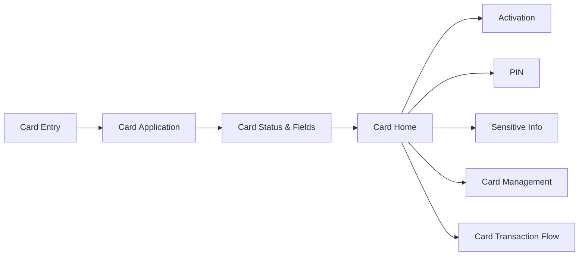

# Card 卡模块

## 1. 模块定位

Card 模块沉淀 AIX Card 的申请、卡首页、实体卡激活、PIN、卡信息安全查看、卡管理、卡状态、卡字段和卡交易关联流程。

本模块依赖 Account、Wallet、Security、Transaction 和 DTC 能力。Card 模块不得重复定义 Security 已完成的认证规则，敏感操作统一引用 Security 事实源。

## 2. 功能清单

| 功能 | 文件 | 状态 | 说明 | 来源 |
|---|---|---|---|---|
| Card Application | [application.md](./application.md) | active | 申卡流程、资格、卡类型、费用、币种、地区、自动扣款 | AIX Card V1.0【Application】 / 2.1 / 5.1 |
| Card Status & Fields | [card-status-and-fields.md](./card-status-and-fields.md) | active | 卡状态、字段、接口路径和操作限制缺口 | AIX Card V1.0【Application】 / 3-4；AIX Card manage模块需求V1.0 / 6.1-6.4 |
| Card Home | [card-home.md](./card-home.md) | active | 卡首页、卡片展示、操作入口、Recent Transactions、物流信息、FAQ | AIX Card V1.0【Application】 / 5.2；AIX APP V1.0【Home】 / 6.1 |
| Card Activation | [activation.md](./activation.md) | active | 实体卡激活、后四位校验、认证、激活接口、Set PIN 入口 | AIX Card manage模块需求V1.0 / 7.2 |
| PIN | [pin.md](./pin.md) | active | Set PIN / Change PIN / Reset PIN、PIN 公钥、OTP For Reset PIN、Reset Card PIN | AIX Card manage模块需求V1.0 / 7.3 |
| Sensitive Info | [sensitive-info.md](./sensitive-info.md) | active | 卡信息安全查看流程、认证边界、展示规则、接口依赖与失败处理 | AIX Card manage模块需求V1.0 / 7.1 |
| Card Management | [card-management.md](./card-management.md) | active | 卡管理操作、状态边界、接口依赖与失败处理 | AIX Card manage模块需求V1.0 / 7.4 / 7.5 / 6.4 |
| Card Transaction Flow | [card-transaction-flow.md](./card-transaction-flow.md) | active | DTC 卡交易通知、目标类型判断、余额查询、归集处理、交易展示边界 | AIX Card交易【transaction】 / 7；Transaction & History / 5.1-5.3 |

## 3. 适用范围

| 维度 | 规则 | 来源 | 备注 |
|---|---|---|---|
| 国家线 | VN / PH / AU | AIX Card V1.0【Application】 / 2.1；AIX Card交易【transaction】 / 5 | 一期国家线 |
| 申卡地区 | Philippines / Vietnam / Australia | AIX Card V1.0【Application】 / 2.1 | 后续可配置 |
| 支持币种 | USDT / USDC / WUSD / FDUSD | AIX Card V1.0【Application】 / 2.1 | 后续可配置 |
| 卡类型 | Virtual Card / Physical Card | AIX Card V1.0【Application】 / 5.1 | 实体卡需单独激活 |
| 品牌 | VISA / MASTER | AIX Card V1.0【Application】 / 4.1 | AIX Card 对应 Brand |
| 费用类型 | application fee / delivery fee | AIX Card V1.0【Application】 / 4.4 | 申请费 / 邮寄费 |
| 自动扣款 | OFF / ON | AIX Card V1.0【Application】 / 4.5 | 申卡时可上送，Home 可展示 Auto Debit 标签 |

## 4. 前置条件

| 条件 | 说明 | 来源 |
|---|---|---|
| 钱包已开通 | 用户必须完成 DTC 渠道开户和 KYC 验证通过 | AIX Card V1.0【Application】 / 2.1 |
| 刷脸 Token 有效 | Card Application 需完成刷脸 Token 验证 | AIX Card V1.0【Application】 / 2.1 / 2.2 |
| 申卡数量未达上限 | 用户申卡数量限制为 5 张，统计待激活、已激活、审核中、已冻结之和 | AIX Card V1.0【Application】 / 5.1.4 |
| 单在途限制 | 一个用户可申请多张卡，但仅可一张在途 | AIX Card V1.0【Application】 / 2.1 |
| 费用处理完成 | 有减免费时直接开卡；无减免费时需余额足够覆盖制卡费 | AIX Card V1.0【Application】 / 2.1 |
| 卡状态允许操作 | 卡相关操作均受卡状态限制 | AIX Card manage模块需求V1.0 / 6.4 |
| 交易通知可接收 | DTC 可通过 Card Transaction Notification 通知 AIX | AIX Card交易【transaction】 / 7.3 |

## 5. 业务流程

```text
Wallet Opened + KYC Passed → Face Authentication → Card Application → Card Status & Fields → Card Home → Card Manage / Card Transaction Flow
```

## 6. 页面关系总览



## 7. 来源引用

- (Ref: 历史prd/AIX Card V1.0【Application】.pdf / 2.1 / 2.2 / 5.1 / 5.2 / V1.0)
- (Ref: 历史prd/AIX Card manage模块需求V1.0.docx / 6.4 / 7.1-7.5 / 8.1 / V1.0)
- (Ref: 历史prd/AIX Card交易【transaction】.pdf / 7 / 8.1 / 9 / V1.0)
- (Ref: 历史prd/AIX APP V1.0【Home】.pdf / 6.1 / V1.0)
- (Ref: 历史prd/AIX APP V1.0【Transaction & History】.pdf / 5.1-5.3 / V1.1)
