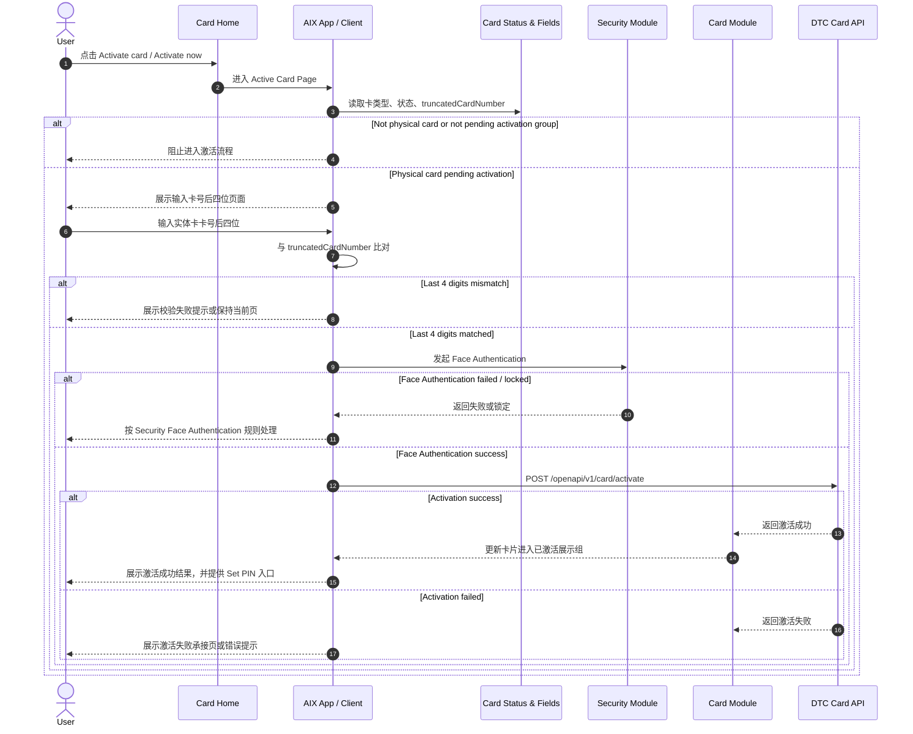
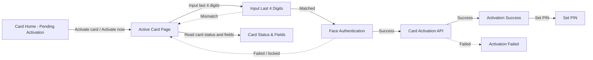

# Card Activation 实体卡激活

## 1. 功能定位

Card Activation 用于用户收到 Physical Card 后，在 AIX App 内完成实体卡激活。

本文件只沉淀实体卡激活入口、卡号后四位校验、Face Authentication、Card Activation 接口调用、激活结果和后续 Set PIN 入口。PIN 设置规则见 `pin.md`，锁卡 / 解锁见 `card-management.md`，卡状态归一见 `card-status-and-fields.md`。

## 2. 适用范围

| 维度 | 规则 | 来源 | 备注 |
|---|---|---|---|
| 卡类型 | Physical Card | Manage / 7.2；Home / 6.1 | Virtual Card 不走实体卡激活 |
| 激活入口 | 待激活实体卡片的 `Activate card` / `Activate now` | Home / 6.1；Application / 5.2 | Card Home 只提供入口 |
| 状态来源 | 待激活展示组 | card-status-and-fields.md | 包含 `Pending activation` / `Inactive` 展示组 |
| 认证方式 | Face Authentication | Security / 7.2；Manage / 7.2 | 不在本文重复定义活体规则 |
| 卡号校验 | 用户输入实体卡卡号后四位，与 `truncatedCardNumber` 比对 | Manage / 7.2；Card Status & Fields | 用于确认用户持有实体卡 |
| 后续入口 | 激活成功后可进入 Set PIN | Manage / 7.2 | PIN 具体规则见 `pin.md` |

## 3. 前置条件

| 条件 | 说明 | 来源 |
|---|---|---|
| 用户已有待激活实体卡 | Card Home 已展示待激活实体卡片 | Home / 6.1；Card Status & Fields |
| 用户收到实体卡 | 页面文案提示收到卡后激活 | Home / 6.1；Application / 5.2 |
| 可读取卡基本信息 | 需要 `truncatedCardNumber` 用于后四位比对 | Card Status & Fields / 7.2 |
| 需完成 Face Authentication | 激活卡属于 Security 场景矩阵中的 Face Authentication 场景 | Security / 7.2 |
| Card Activation 接口可用 | 调用 `POST /openapi/v1/card/activate` | Manage / 8.1 |

## 4. 业务流程

### 4.1 主链路

```text
Card Home → Activate Card → Input Last 4 Digits → Face Authentication → Card Activation API → Activation Success / Failed → Set PIN Entry
```

### 4.2 业务流程与系统交互时序图



### 4.3 业务逻辑矩阵

| 阶段 | 触发条件 | 系统动作 | 成功结果 | 失败 / 拦截结果 |
|---|---|---|---|---|
| 入口 | 用户点击待激活实体卡的激活入口 | 进入 Active Card Page | 展示激活页面 | 非实体卡或状态不符时阻止 |
| 卡号校验 | 用户输入卡号后四位 | 与 `truncatedCardNumber` 比对 | 进入 Face Authentication | 不一致则停留当前页或提示失败 |
| 活体认证 | 卡号后四位校验通过 | 调用 Security Face Authentication | 进入激活接口调用 | 失败 / 锁定按 Security 处理 |
| 激活提交 | Face Authentication 通过 | 调用 Card Activation 接口 | 激活成功，进入已激活展示组 | 激活失败，展示失败承接 |
| 后续引导 | 激活成功 | 提供 Set PIN 入口 | 用户可继续设置 PIN | PIN 规则由 `pin.md` 承接 |

## 5. 页面关系总览



## 6. 页面卡片与交互规则

### 6.1 激活入口

| 入口 | 展示条件 | 点击结果 | 来源 |
|---|---|---|---|
| `Activate card` | 待激活实体卡片 | 跳转卡激活页面 | Application / 5.2；Home / 6.1 |
| `Activate now` | 用户收到实体卡后提示区域 | 跳转卡激活页面 | Home / 6.1 |

### 6.2 Active Card Page

| 元素 / 能力 | 规则 | 来源 |
|---|---|---|
| 页面目的 | 引导用户激活实体卡 | Manage / 7.2 |
| 卡号后四位输入 | 用户输入实体卡卡号后四位 | Manage / 7.2 |
| 校验依据 | 与 `truncatedCardNumber` 比对 | Manage / 7.2；Card Status & Fields |
| Face Authentication | 校验通过后进行刷脸认证 | Manage / 7.2；Security / 7.2 |
| Activation API | 刷脸通过后调用 `POST /openapi/v1/card/activate` | Manage / 8.1 |

### 6.3 激活成功

| 元素 / 能力 | 规则 | 来源 |
|---|---|---|
| 状态变化 | 激活成功后归入已激活展示组 | Card Status & Fields |
| Card Home | 返回后展示已激活卡首页 | Home / 6.1 |
| Set PIN | 激活成功后可进入 Set PIN | Manage / 7.2 |

### 6.4 激活失败

| 场景 | 规则 | 来源 |
|---|---|---|
| 卡号后四位不一致 | 阻止继续激活 | Manage / 7.2 |
| Face Authentication 失败 | 按 Security Face Authentication 规则承接 | Security / Face Authentication |
| Card Activation 接口失败 | 展示激活失败承接页或错误提示 | Manage / 7.2 / 8.1 |

## 7. 字段与接口依赖

| 字段 / 接口 / 能力 | 用途 | 来源 | 备注 |
|---|---|---|---|
| `cardType` | 判断是否 Physical Card | Card Status & Fields | Virtual Card 不走实体卡激活 |
| `cardStatus` | 判断是否待激活展示组 | Card Status & Fields | 不在本文重复定义状态 |
| `truncatedCardNumber` | 与用户输入卡号后四位比对 | Manage / 7.2；Card Status & Fields | 已确认字段用途 |
| `Face Authentication` | 激活前高强度认证 | Security / 7.2；Manage / 7.2 | 具体规则见 Security |
| `Card Activation` | 实体卡激活接口 | Manage / 8.1 | `POST /openapi/v1/card/activate` |
| `Set PIN` | 激活成功后的后续入口 | Manage / 7.2 / 7.3 | 具体规则见 `pin.md` |

## 8. 异常与失败处理

| 场景 | 触发条件 | 用户提示 / 系统动作 | 最终状态 | 来源 |
|---|---|---|---|---|
| 非实体卡进入激活 | cardType 不是 Physical Card | 阻止进入激活流程 | 留在原流程 | Card Status & Fields |
| 状态不属于待激活 | cardStatus 不属于待激活展示组 | 阻止进入激活流程 | 留在原流程 | Card Status & Fields |
| 卡号后四位不匹配 | 用户输入与 `truncatedCardNumber` 不一致 | 阻止继续提交 | 留在 Active Card Page | Manage / 7.2 |
| Face Authentication 失败 | 活体认证失败或锁定 | 按 Security 失败规则处理 | 阻止激活 | Security / Face Authentication |
| Card Activation 失败 | DTC 激活接口失败 | 展示失败承接页或错误提示 | 未激活 | Manage / 7.2 / 8.1 |
| 激活后状态不一致 | 接口成功但卡状态未进入已激活展示组 | 记录缺口，后续需状态通知或查询确认 | 待确认 | Card Status & Fields |

## 9. 风控 / 合规边界

| 边界 | 规则 | 影响 | 来源 |
|---|---|---|---|
| 实体卡限定 | 只有 Physical Card 执行激活 | 防止虚拟卡误入激活流程 | Manage / 7.2；Card Status & Fields |
| 持卡校验 | 输入卡号后四位并与系统字段比对 | 确认用户实际持有实体卡 | Manage / 7.2 |
| 高强度认证 | 激活前需 Face Authentication | 防止非本人激活卡片 | Security / 7.2；Manage / 7.2 |
| 状态引用 | 激活成功后的状态展示引用 `card-status-and-fields.md` | 防止状态重复定义 | IMPLEMENTATION_PLAN.md / v2.4 |
| PIN 边界 | 激活后可进入 Set PIN，但 PIN 规则不在本文展开 | 防止规则混写 | Manage / 7.2 / 7.3 |

## 10. 来源引用

- (Ref: 历史prd/AIX Card manage模块需求V1.0.docx / 7.2 卡激活 / V1.0)
- (Ref: 历史prd/AIX Card manage模块需求V1.0.docx / 8.1 外部接口清单 / V1.0)
- (Ref: 历史prd/AIX APP V1.0【Home】.pdf / 6.1 APP主页 / V1.0)
- (Ref: 历史prd/AIX Card V1.0【Application】.pdf / 5.2 卡片首页 / V1.0)
- (Ref: knowledge-base/card/card-status-and-fields.md)
- (Ref: knowledge-base/card/card-home.md)
- (Ref: knowledge-base/security/face-authentication.md)
