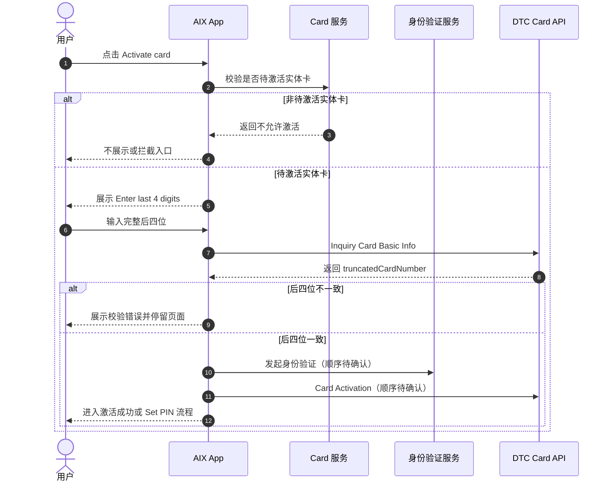
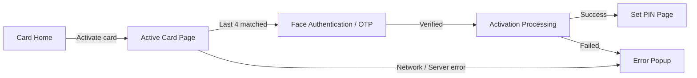

# Card Activation 实体卡激活

## 1. 文档信息

| 项目 | 内容 |
|---|---|
| 功能名称 | Card Activation 实体卡激活 |
| 所属模块 | Card |
| Owner | 吴忆锋 |
| 版本 | 1.3 |
| 状态 | Review |
| 更新时间 | 2026-05-04 |
| 来源文档 | AIX Card Manage、DTC Card Issuing API、Standard PRD Template v1.3 |

---

## 2. 需求背景、目标与范围

### 2.1 需求背景

Physical Card 审核通过并寄送后，用户需在 AIX App 内完成实体卡激活，才能进入后续卡使用、PIN 设置和交易能力。

### 2.2 用户问题 / 业务问题

如果激活校验、身份验证、自动扣款入参、PIN 联动和异常弹窗不明确，用户可能无法激活实体卡，或系统出现激活状态与 PIN 状态不一致的问题。

### 2.3 需求目标

定义实体卡激活页面、后四位校验、DTC 激活接口、异常处理和 PIN 流程边界，确保激活只发生在待激活实体卡上。

### 2.4 涉及功能清单

| 功能点 | 本期范围 | 优先级 | 状态 | 说明 |
|---|---|---|---|---|
| 待激活入口 | In Scope | P0 | Confirmed | 仅待激活实体卡可进入 |
| Active Card Page | In Scope | P0 | Confirmed | 输入实体卡后四位 |
| 后四位校验 | In Scope | P0 | Confirmed | 输入满 4 位后调用 Inquiry Card Basic Info 比对 `truncatedCardNumber` |
| Face Authentication | In Scope | P0 | Open | 是否在后四位后立即执行待确认 |
| Card Activation API | In Scope | P0 | Open | 调用 activate，含 autoDebit 入参；枚举关系待确认 |
| Set PIN 联动 | In Scope | P0 | Open | 激活后是否强制 Set PIN 待确认 |

---

## 3. 业务流程与规则

### 3.1 业务主流程说明

用户从 Card Home 点击待激活实体卡的 Activate card 入口，进入 Active Card Page 输入实体卡卡号后四位。输入满 4 位后，系统调用 Inquiry Card Basic Info 并用返回的 `truncatedCardNumber` 进行比对。比对成功后进入后续身份验证、Card Activation API 和 Set PIN 流程；具体顺序仍为待确认项。

### 3.2 业务时序图

### 3.3 流程步骤与业务规则

| 步骤 | 场景 / 规则 | 触发条件 | 责任方 | 系统处理 | 成功结果 | 失败 / 分支结果 | 来源 |
|---|---|---|---|---|---|---|---|
| 1 | 激活入口判断 | Card Home 展示待激活实体卡 | App / Card | 引用状态矩阵判断 | 展示 Activate card | 非待激活不展示 | Manage / 6.4 / Home |
| 2 | 输入后四位 | 用户进入 Active Card Page | App | 展示输入页 | 等待 4 位输入 | 返回时展示挽留弹窗 | Manage / 7.2 |
| 3 | 查询 Basic Info | 用户输入满 4 位 | App / DTC | 调用 Inquiry Card Basic Info | 返回 `truncatedCardNumber` | 网络或服务异常弹窗 | Manage / 7.2 / DTC |
| 4 | 校验后四位 | 接口返回 | App | 比对用户输入和返回字段 | 进入下一流程 | 显示 `The last 4 digits entered are invalid` | Manage / 7.2 |
| 5 | 身份验证 | 后四位一致 | App / Security | Face Authentication 或 OTP，顺序待确认 | 允许激活 | 按 Security 失败处理 | Manage / 7.2 |
| 6 | 卡激活 | 认证通过 | Card / DTC | 调用 Card Activation，含 autoDebit | 激活成功 | 激活失败保留原状态 | Manage / 8.1 |
| 7 | PIN 联动 | 激活成功 | App / PIN | 是否进入 Set PIN 待确认 | 进入 PIN 或 Card Home | 待确认 | Manage / 7.2 / 7.3 |

### 3.4 状态规则

| 状态 | 含义 | 触发条件 | 用户可见表现 | 系统处理 | 可迁移到 | 是否终态 | 来源 |
|---|---|---|---|---|---|---|---|
| 待激活 / Pending activation | 实体卡未激活 | 申请成功且实体卡未激活 | 展示 Activate card | 允许激活 | ACTIVE | 否 | Manage / 6.4 |
| ACTIVE | 已激活 | Card Activation 成功 | 展示 Card Home 已激活卡 | 允许 PIN / Lock / Sensitive Info / Transaction | SUSPENDED / CANCELLED | 否 | Manage / 6.4 |
| 激活失败 | 激活接口失败 | DTC 返回失败 | 展示错误提示或失败承接 | 保持待激活 | 待激活 | 否 | Manage / 7.2 |

### 3.5 业务级异常与失败处理

| 异常场景 | 触发条件 | 错误来源 | 错误码 / 原因 | 用户表现 | 系统处理 | 是否可重试 | 最终状态 |
|---|---|---|---|---|---|---|---|
| 非待激活卡进入 | 状态不允许激活 | Backend | 状态限制 | 不展示或拦截入口 | 不调用接口 | 否 | 原状态 |
| 后四位不一致 | 输入与 `truncatedCardNumber` 不一致 | App / DTC | 校验失败 | `The last 4 digits entered are invalid` | 停留当前页 | 是 | 待激活 |
| Inquiry 网络异常 | 查询 Basic Info 无网络 | Network | Network Error | Network Error Popup | 关闭后回当前页并清空输入 | 是 | 待激活 |
| Inquiry 服务异常 | 查询 Basic Info 失败 | Backend / External | Server Error | Server Error Popup | 关闭后回当前页并清空输入 | 是 | 待激活 |
| 认证失败 | Face Auth / OTP 失败 | Security | 认证失败 | 按 Security 规则提示 | 不激活 | 是 / 视规则 | 待激活 |
| 激活接口失败 | Card Activation 失败 | DTC | DTC error | 展示失败提示 | 保持原状态 | 是 | 待激活 |

---

## 4. 页面与交互说明

### 4.1 页面关系总览图

### 4.2 Active Card Page

| 区块 | 内容 |
|---|---|
| 页面类型 | 主页面 / 表单页面 |
| 页面目标 | 通过实体卡后四位校验用户持有实体卡 |
| 入口 / 触发 | Card Home 点击 Activate card |
| 展示内容 | 标题 `Enter last 4 digits`；说明 `Enter the last 4-digit of your physical AIX Card number`；4 位输入框 |
| 用户动作 | 输入后四位、点击返回 |
| 系统处理 / 责任方 | 输入满 4 位后调用 Inquiry Card Basic Info，读取 `truncatedCardNumber` 比对 |
| 元素 / 状态 / 提示规则 | 校验失败提示 `The last 4 digits entered are invalid`；提交中显示 `Loading...` 且禁止重复输入 / 返回 |
| 成功流转 | 进入身份验证 / 激活 / PIN 后续流程，顺序待确认 |
| 失败 / 异常流转 | Network Error Popup / Server Error Popup，关闭后回本页并清空输入 |
| 备注 / 边界 | 不应只用本地缓存 `truncatedCardNumber` 比对 |

---

## 5. 字段、接口与数据

| 类型 | 名称 | 所属系统 | 来源 | 用途 | 规则 / 输入输出 | 异常处理 |
|---|---|---|---|---|---|---|
| 接口 | Inquiry Card Basic Info | DTC | DTC Card Issuing / Manage | 校验后四位 | 输入满 4 位后查询，读取 `truncatedCardNumber` | 失败展示全局 Popup |
| 字段 | truncatedCardNumber | DTC | Manage / 7.2 | 后四位比对 | 返回值必须与用户输入一致 | 不一致展示错误 |
| 接口 | Card Activation | DTC | Manage / 8.1 | 激活实体卡 | `POST /openapi/v1/card/activate` | 失败保持待激活 |
| 字段 | autoDebit | AIX / DTC | Manage / 7.2 | 激活同时开启自动扣款 | `ON` 时激活同时开启自动扣款；与 Application autoDebitEnabled 关系待确认 | 待确认 |
| 接口 | Sent OTP For Card Activation | DTC | DTC Card Issuing | 激活 OTP | AIX 是否使用待确认 | 不默认实现 |

---

## 6. 通知规则（如适用）

| 触发事件 | 通知渠道 | 通知对象 | 文案 / 模板 | 跳转目标 | 失败 / 补发规则 |
|---|---|---|---|---|---|
| 实体卡激活成功 | 不适用 / 待确认 | 持卡用户 | 当前事实文件未定义通知模板 | Card Home / Set PIN | 待确认 |
| 实体卡激活失败 | 不适用 | 持卡用户 | 页面提示承接 | Active Card Page | 不适用 |

---

## 7. 权限 / 合规 / 风控（如适用）

| 类型 | 规则 | 影响 | 来源 |
|---|---|---|---|
| 状态权限 | 仅待激活实体卡可进入激活 | 防止重复激活或非法激活 | Manage / 6.4 |
| 持卡校验 | 必须通过实体卡后四位校验 | 防止非持卡人激活 | Manage / 7.2 |
| 身份验证 | 激活流程是否需要 Face Authentication / OTP 待确认 | 防止账号被盗用后激活卡 | Manage / 7.2 / DTC |
| 自动扣款 | autoDebit 可在激活时开启自动扣款 | 影响消费扣款路径 | Manage / 7.2 |

---

## 8. 待确认事项

| 问题 | 影响范围 | 当前处理 | 是否阻塞验收 | 建议确认人 |
|---|---|---|---|---|
| 实体卡激活完整顺序是 Last4 -> Face Auth -> Activation -> Set PIN，还是 Last4 -> Set PIN -> Activation | Activation / PIN / Security | 阻塞 | 是 | PM / BE / Security |
| 激活成功后 Set PIN 是否强制，用户是否可跳过 | Activation / PIN / Home | 阻塞 | 是 | PM / Design / BE |
| Card Activation 入参 `autoDebit` 与 Application `autoDebitEnabled` 的关系 | Activation / Application / Home | 阻塞 | 是 | PM / BE / DTC |
| AIX 是否使用 DTC `Sent OTP For Card Activation` | Activation / Security / DTC | 不阻塞 / Deferred | 否 | PM / BE / DTC |
| 激活成功后卡状态刷新机制 | Activation / Status / Home | 不阻塞 / Deferred | 否 | BE / QA |

---

## 9. 验收标准 / 测试场景

### 9.1 验收标准

| 验收场景 | 验收标准 |
|---|---|
| 正常流程 | 待激活实体卡可进入 Active Card Page，输入正确后四位可进入下一流程 |
| 异常流程 | 后四位不一致、网络异常、服务异常均有明确页面反馈 |
| 页面展示 | 页面标题、说明、返回挽留弹窗、Loading 状态符合规则 |
| 系统交互 | 输入满 4 位后调用 Inquiry Card Basic Info，不只用本地缓存比对 |
| 通知 | 激活通知未定义，标记不适用 / 待确认 |
| 数据 / 埋点 | 激活成功后卡状态需刷新，具体机制待确认 |

### 9.2 测试场景矩阵

| 场景 | 前置条件 | 用户操作 | 预期页面表现 | 预期系统结果 | 是否必测 |
|---|---|---|---|---|---|
| 正确后四位 | 待激活实体卡 | 输入正确 4 位 | 进入下一流程 | Inquiry 返回匹配 | 是 |
| 错误后四位 | 待激活实体卡 | 输入错误 4 位 | 显示错误文案 | 不激活 | 是 |
| 非待激活卡 | ACTIVE 卡 | 尝试进入激活 | 不展示入口或拦截 | 不调用接口 | 是 |
| 网络异常 | 查询 Basic Info 超时 | 输入 4 位 | Network Error Popup | 清空输入 | 是 |
| 服务异常 | 查询或激活失败 | 输入 / 提交 | Server Error Popup | 保持待激活 | 是 |

---

## 10. 来源引用

- (Ref: 历史prd/AIX Card manage模块需求V1.0.docx / 6.4 / 6.5 / 7.2 / 8.1 / V1.0)
- (Ref: DTC Card Issuing API Document_20260310 (1).pdf / Card Activation / Sent OTP For Card Activation)
- (Ref: knowledge-base/card/card-status-and-fields.md)
- (Ref: knowledge-base/card/pin.md)
- (Ref: knowledge-base/security/face-authentication.md)
- (Ref: prd-template/standard-prd-template.md / v1.3)
