# Card Application 申卡流程

> Source alignment note: 本文件已按 `archive/legacy-prd/card/application/README.md` 进行 Evidence→KB 补齐，并同步核对 Home、KYC、Security 支撑证据。补齐重点包括多币种制卡费支付、Fee waiver、余额校验、Face Auth token、Billing/Mailing 字段限制、实体卡打印名、MGM 减免费状态和结果页规则。

## 1. 文档信息

| 项目 | 内容 |
|---|---|
| 功能名称 | Card Application 申卡流程 |
| 所属模块 | Card |
| Owner | 吴忆锋 |
| 版本 | 1.3 |
| 状态 | Review |
| 更新时间 | 2026-05-04 |
| 来源文档 | AIX Card Application、DTC Card Issuing API、Standard PRD Template v1.3 |

---

## 2. 需求背景、目标与范围

### 2.1 需求背景

AIX 用户需要在 App 内申请 Virtual Card 或 Physical Card，并完成选卡、选币种、账单信息、邮寄地址、费用支付、身份验证和申卡提交。

### 2.2 用户问题 / 业务问题

申卡链路涉及 KYC、钱包余额、费用试算、DTC 申卡接口、MGM 减免费、Face Authentication 和多状态结果。如果字段、币种、自动扣款枚举和错误码未统一，容易造成申卡失败、扣费异常、状态展示错误或重复申请。

### 2.3 需求目标

确保用户在满足资格时可完成申卡，不满足时得到明确提示；系统可正确调用 DTC Card Application，记录申请结果，并为 Card Home、Activation、PIN 等流程提供状态依据。

### 2.4 涉及功能清单

| 功能点 | 本期范围 | 优先级 | 状态 | 说明 |
|---|---|---|---|---|
| 申卡入口限制 | In Scope | P0 | Confirmed | 卡数量、审核中卡、钱包余额限制 |
| Select Plan | In Scope | P0 | Confirmed | Virtual / Physical Card 选择 |
| Pick Card Face | In Scope | P1 | Confirmed | Coral Orange / Obsidian Black / Clear blue sky |
| Select Crypto | In Scope | P0 | Open | 页面支持 USDT / USDC / WUSD / FDUSD；与 DTC currency 映射待确认 |
| Billing information | In Scope | P0 | Confirmed | 姓名、邮箱、手机号 |
| Mailing address | In Scope | P0 | Open | Physical Card 必填；DTC 字段长度冲突待确认 |
| Payment Checkout | In Scope | P0 | Confirmed | 费用试算、余额校验、Slide to pay |
| DTC Card Application | In Scope | P0 | Open | request-card 字段映射仍有枚举与币种待确认 |
| Application Result | In Scope | P0 | Confirmed | Approved / Under review / Unsuccessful |

---

## 3. 业务流程与规则

### 3.1 业务主流程说明

用户从 Card 入口进入申卡流程。系统先校验申卡资格，再让用户选择卡类型、卡面和币种，填写账单信息。Physical Card 还需填写邮寄地址。若应付金额为 0，用户直接进行刷脸校验并提交申卡；若应付金额大于 0，系统进行汇率试算和钱包余额校验，用户 Slide to pay 后完成刷脸并提交申卡。DTC 返回申卡结果后，系统展示成功、审核中或失败页，并同步 MGM 减免费状态。

### 3.2 业务时序图

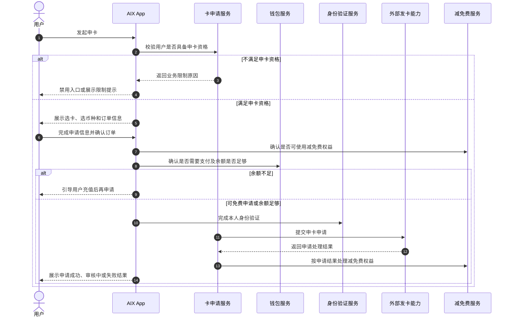

### 3.3 流程步骤与业务规则

| 步骤 | 场景 / 规则 | 触发条件 | 责任方 | 系统处理 | 成功结果 | 失败 / 分支结果 | 来源 |
|---|---|---|---|---|---|---|---|
| 1 | 申卡入口校验 | 用户进入可申卡入口 | App / Card | 统计已激活、已冻结、待激活、审核中卡数量 | 可进入 Select Plan | 达 5 张隐藏入口；有审核中卡入口置灰 | Application / 5.1.4 |
| 2 | 选择卡类型 | 用户进入 Select Plan | App | 展示 Virtual / Physical Card | 进入 Pick your card | 不适用 | Application / 5.1.4 |
| 3 | 选择卡面 | 用户选择卡类型 | App | 展示卡面颜色与示例图 | 进入 Select Crypto | 不适用 | Application / 5.1.4 |
| 4 | 选择币种 | 用户进入 Select Crypto | App | 展示 USDT / USDC / WUSD / FDUSD | 进入 Order | DTC currency 映射待确认 | Application / 2.1 / 5.1.4 |
| 5 | 填写账单 | 用户进入 Order | App | 收集 Billing information | 可保存并返回订单页 | 必填或格式错误不可保存 | Application / 5.1.4 |
| 6 | 填写邮寄 | Physical Card | App | 收集 Mailing address | 可保存并返回订单页 | 必填或格式错误不可保存 | Application / 5.1.4 |
| 7 | 费用处理 | 用户确认订单 | App / Wallet / MGM | 计算 Subtotal、Discount、Total、Card fee | 可免费申请或支付 | 余额不足引导充值 | Application / 5.1.4 / 6.5-6.7 |
| 8 | 身份验证 | 免费申请或 Slide to pay | App / Security | 校验 Face Authentication Token | 可提交申卡 | Token 无效跳转刷脸 | Application / 2.1 / 5.1.4 |
| 9 | 提交申卡 | Token 有效 | Card / DTC | 调用 request-card | 展示 Approved / Under review | 展示 Application unsuccessful | Application / 6.1 |
| 10 | 减免费处理 | DTC 返回申请结果 | Card / MGM | 按状态冻结 / 核销 / 解冻 | MGM 状态同步 | 响应失败不通知 MGM | Application / 5.1.4 |

### 3.4 状态规则

| 状态 | 含义 | 触发条件 | 用户可见表现 | 系统处理 | 可迁移到 | 是否终态 | 来源 |
|---|---|---|---|---|---|---|---|
| Approved | 申请审核通过 | DTC 返回 success 且状态 Active / Pending activation | `Congratulations! Your application has been approved` | 进入 Card Home | Active / Pending activation | 否 | Application / 5.1.4 |
| Under review | 审核中 | DTC 返回 success 且状态 Processing / Pending | `Your application is under review` | 返回 Home | Active / Pending activation / Cancelled | 否 | Application / 5.1.4 |
| Unsuccessful | 申请失败 | DTC 返回 success=false | `Application unsuccessful` | 可 Resubmit Now | 重新申卡 | 是 / 可重试 | Application / 5.1.4 |
| Terminated / Cancelled | 审核失败或终止 | 申请失败后状态 | 不在 Application 结果页展开 | MGM 解冻 | 不适用 | 是 | Application / 6.11 |

### 3.5 业务级异常与失败处理

| 异常场景 | 触发条件 | 错误来源 | 错误码 / 原因 | 用户表现 | 系统处理 | 是否可重试 | 最终状态 |
|---|---|---|---|---|---|---|---|
| 申卡数量达上限 | 已激活、已冻结、待激活、审核中之和 >= 5 | Backend | 数量限制 | 不显示入口或提示 `Have reached limit of application AIX card` | 阻止申卡 | 否 | 原状态 |
| 存在审核中卡 | 总数 < 5 且有审核中卡 | Backend | 在途限制 | 入口置灰 | 阻止重复申请 | 否 | 原状态 |
| 钱包余额为 0 | 所有币种余额为 0 | Wallet | 余额限制 | 显示 `Top up & Get started` | 跳转 Deposit | 是 | 未申卡 |
| 同币种余额不足 | Checkout 时当前币种余额不足 | Wallet | 余额不足 | `Insufficient balance, please deposit` | 引导充值 | 是 | 未支付 |
| Billing 姓名不一致 | 与 KYC Full name 不一致 | App | 校验失败 | `Please fill in your name correctly.` | 不保存 | 是 | 留在页面 |
| 文本格式错误 | 字段校验失败 | App | 格式错误 | `Text format error. ` | 阻止保存 | 是 | 留在页面 |
| Face Token 无效 | 未刷脸或 Token 失效 | Security | Token invalid | 展示安全提示并跳转刷脸 | 进入 Security | 是 | 待验证 |
| DTC 申卡失败 | request-card 返回失败 | DTC | DTC error | Application unsuccessful | 保留失败信息 | 是 | 失败页 |

---

## 4. 页面与交互说明

### 4.1 页面关系总览图

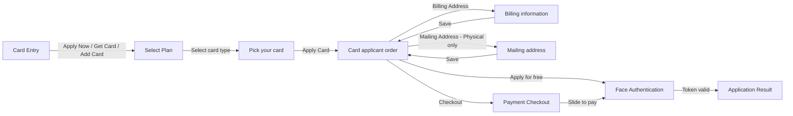

### 4.2 Billing Information Page

| 区块 | 内容 |
|---|---|
| 页面类型 | 表单页面 |
| 页面目标 | 收集账单姓名、邮箱和手机号 |
| 入口 / 触发 | Order 页面点击 Billing Address |
| 展示内容 | First name、Last name、Email、CountryNo、Mobile |
| 用户动作 | 填写姓名和手机号，点击 Save |
| 系统处理 / 责任方 | App 校验格式并与 KYC Full name 比对 |
| 元素 / 状态 / 提示规则 | 页面标题为 `Billing information`；First / Last name 仅英文字符和空格，25 字节；Mobile 12 字节；错误提示 `Text format error. ` |
| 成功流转 | 保存并返回 Order |
| 失败 / 异常流转 | 姓名不一致提示 `Please fill in your name correctly.` |
| 备注 / 边界 | DTC countryCode 长度 3 与页面 CountryNo 长度 4 待确认 |

### 4.3 Mailing Address Page

| 区块 | 内容 |
|---|---|
| 页面类型 | 表单页面 |
| 页面目标 | 收集实体卡邮寄地址 |
| 入口 / 触发 | Physical Card 的 Order 页面点击 Mailing Address |
| 展示内容 | Print Name on Card、Country / Region、Address Line1-3、Province、City、District、Postcode、Recipient name、Recipient mobile |
| 用户动作 | 填写邮寄地址并 Save |
| 系统处理 / 责任方 | App 校验必填和格式 |
| 元素 / 状态 / 提示规则 | Address Line1 必填，Address Line2/3 可选；DTC 字段长度差异待确认 |
| 成功流转 | 保存并返回 Order |
| 失败 / 异常流转 | 必填缺失或格式错误不可保存 |
| 备注 / 边界 | 仅 Physical Card 适用 |

---

## 5. 字段、接口与数据

| 类型 | 名称 | 所属系统 | 来源 | 用途 | 规则 / 输入输出 | 异常处理 |
|---|---|---|---|---|---|---|
| 接口 | Card Application | DTC | DTC Card Issuing | 提交申卡 | `[POST] /openapi/v1/card/request-card` | 失败展示 Application unsuccessful |
| 字段 | referenceNo | AIX / DTC | DTC API | 申请业务号 | AIX 生成，异常查询使用 | 生成规则待确认 |
| 字段 | productCode | DTC | DTC API | 卡产品 | 来自配置 | 枚举待确认 |
| 字段 | cardMaterial | DTC | DTC API | 卡材质 / 类型 | Virtual / Physical 映射待确认 | 待确认 |
| 字段 | currency | DTC | DTC API | DTC 卡币种 | ISO 4217 National Currency Code | 与稳定币选择关系待确认 |
| 字段 | firstName / lastName | AIX / DTC | Application / DTC API | 持卡人姓名 | 英文字符和空格，25 字节，需与 KYC 匹配 | 不一致不保存 |
| 字段 | mobile.countryCode | DTC | DTC API | 国家码 | DTC 长度 3；页面 CountryNo 长度 4 待确认 | 待确认 |
| 字段 | mobile.number | DTC | DTC API | 手机号 | 12 字节 | 格式错误不可保存 |
| 字段 | deliveryAddress.* | DTC | DTC API | 实体卡邮寄地址 | country/state/city/district/address/postal/fullName/phoneNumber | 字段长度冲突待确认 |
| 字段 | autoDebitEnabled | AIX / DTC | Application / DTC API | 自动扣款 | 产品 `2/ON` 与 DTC `1/ON` 冲突 | P0 待确认 |

---

## 6. 通知规则（如适用）

| 触发事件 | 通知渠道 | 通知对象 | 文案 / 模板 | 跳转目标 | 失败 / 补发规则 |
|---|---|---|---|---|---|
| 申卡审核中 | Push / In-app | 申请用户 | Notification 模块维护 | Card Home / Application Details | 本文不定义 |
| 申卡审核通过 | Push / In-app | 申请用户 | Notification 模块维护 | Card Home | 本文不定义 |
| 申卡审核失败 | Push / In-app | 申请用户 | Notification 模块维护 | Application unsuccessful / Select Plan | 本文不定义 |
| MGM 减免费状态同步 | 内部事件 | MGM | 非用户通知 | MGM 系统 | 响应失败不通知 MGM |

---

## 7. 权限 / 合规 / 风控（如适用）

| 类型 | 规则 | 影响 | 来源 |
|---|---|---|---|
| 用户权限 | 仅完成钱包开通、DTC 渠道开户和 KYC 验证的用户可申卡 | 防止未实名开卡 | Application / 2.1 |
| 身份验证 | 免费申请和付费申请提交前均需 Face Authentication Token | 防止非本人申卡 | Application / 2.1 / 5.1.4 |
| 数量限制 | 用户最多 5 张卡，统计待激活、已激活、审核中、已冻结 | 控制卡片数量 | Application / 5.1.4 |
| 在途限制 | 同一用户仅可一张审核中卡 | 防止并发申请 | Application / 2.1 |
| 费用风控 | 非免费申卡需同币种余额足够，DTC 申请成功时实时扣费 | 防止扣费失败 | Application / 5.1.4 |
| 姓名一致性 | Billing 姓名需与 KYC Full name 一致 | 防止非本人申卡 | Application / 5.1.4 |

---

## 8. 待确认事项

| 问题 | 影响范围 | 当前处理 | 是否阻塞验收 | 建议确认人 |
|---|---|---|---|---|
| `autoDebitEnabled` 产品 `2/ON` 与 DTC `1/ON` 如何映射，默认值是 ON 还是 OFF | 申卡 / 激活 / 首页标签 | 阻塞 | 是 | PM / BE / DTC |
| 页面稳定币 USDT / USDC / WUSD / FDUSD 与 DTC `currency`、`cardFeeDetails.currency` 如何映射 | 费用 / 申卡 / 对账 | 阻塞 | 是 | PM / BE / Finance |
| DTC `mobile.countryCode` 长度 3 与页面 CountryNo 长度 4 如何处理 | Billing | 不阻塞 / Deferred | 否 | PM / BE |
| Mailing address 页面字段长度与 DTC deliveryAddress 长度冲突 | Mailing | 不阻塞 / Deferred | 否 | PM / BE / QA |
| `productCode`、`cardMaterial`、`cardFeeDetails.type` 枚举映射 | DTC 申卡 | 阻塞 | 是 | BE / DTC |

---

## 9. 验收标准 / 测试场景

### 9.1 验收标准

| 验收场景 | 验收标准 |
|---|---|
| 正常流程 | 用户满足资格时可完成选卡、填写信息、支付或免费申请、刷脸、提交申卡 |
| 异常流程 | 达上限、审核中卡、余额不足、姓名不一致、DTC 失败均有明确处理 |
| 页面展示 | Billing 标题为 `Billing information`；卡色为 Coral Orange / Obsidian Black / Clear blue sky |
| 系统交互 | request-card 字段映射覆盖关键 DTC 字段，冲突项进入待确认 |
| 通知 | 申卡状态通知由 Notification 模块维护，本文不写模板 |
| 数据 / 埋点 | Apply Order 关键字段可记录，费用和状态可追踪 |

### 9.2 测试场景矩阵

| 场景 | 前置条件 | 用户操作 | 预期页面表现 | 预期系统结果 | 是否必测 |
|---|---|---|---|---|---|
| 首次申请虚拟卡 | KYC 完成，无审核中卡 | Apply Now -> Virtual Card | 可进入 Select Crypto | 记录卡类型 | 是 |
| 达到 5 张卡 | 已激活/冻结/待激活/审核中合计 5 | 进入 Card 入口 | 不显示申卡入口 | 不允许 request-card | 是 |
| 有审核中卡 | 总数 <5 且有 Pending | 点击申卡入口 | 入口置灰 | 不允许重复申请 | 是 |
| Billing 姓名错误 | KYC name 不匹配 | Save Billing | 提示姓名错误 | 不保存 | 是 |
| 余额不足 | Total >0，当前币种不足 | Checkout | 提示充值 | 不提交申卡 | 是 |
| Face Token 失效 | 未刷脸或 Token 过期 | Apply / Slide to pay | 跳转刷脸 | 不调用 request-card | 是 |
| DTC 申卡失败 | request-card 返回失败 | 提交申卡 | Application unsuccessful | 记录失败 | 是 |

---

## Source alignment additions

### A. 申卡资格与入口

| 规则 | 结论 | 来源 |
|---|---|---|
| 申卡资格 | 仅完成钱包开通、DTC 渠道开户、KYC 验证通过、刷脸 Token 有效、申卡 5 张以内的用户才能申请卡 | Card Application / 2.1 |
| 一人在途限制 | 一个用户可申请多张卡，5 张可配置，但仅可一张在途；DTC 可配置是否限制 | Card Application / 2.1 |
| 支持卡类型 | Virtual Card、Physical Card | Card Application / 6.1 |
| 支持币种 | USDT、USDC、WUSD、FDUSD；后续可配置 | Card Application / 2.1 / Select Crypto |
| 支持地区 | Phase 1：Philippines、Vietnam、Australia；后续可配置 | Card Application / 2.1 |
| 入口展示 | 统计待激活、已激活、审核中、已冻结之和；≥5 不显示，<5 且有审核中置灰，<5 且无审核中高亮 | Card Application / Home |

### B. 选卡、余额和制卡费

| 规则 | 结论 |
|---|---|
| 首次用户 | 无申请记录定义为首次，进入 `Select plan`；非首次进入 `Pick your card` |
| Fee waiver 弹窗 | 当前用户有可减免制卡费时，进入选择卡类型页显示弹窗；点击 `Got it` 关闭 |
| 钱包余额不能为 0 校验 | 如配置开启，调用 `[GET] /openapi/v1/wallet/balances`，任一加密币账户余额 > 0 才可继续 |
| 余额为 0 | 显示 `Top up & Get started`，点击跳转 Deposit |
| 选择币种默认值 | 默认 USDT，用户选择后卡面显示对应币种 |
| 制卡费 | 当前虚拟卡 5 USD、实体卡 10 USD，后台可配置；若 X=0 只显示 `Apply Card` |
| 订单页费用 | `Payable card fee = Card fee - Fee waiver`，按 USD 计价 |
| 加密币应付金额 | `Card Application Fee = Payable card fee × Exchange rate` |

### C. Checkout 支付规则

| 规则 | 结论 |
|---|---|
| 多币种支付 | 申卡付费已放开多币种支付；用户可切换支付币种，系统实时重算应付金额 |
| 汇率接口 | 用户切换币种时调用 `/openapi/v1/otc/get-otc-rate` 获取实时汇率 |
| 汇率失败提示 | `The exchange rate has not been updated in real time. Please try again.`，并切回之前选中币种 |
| 支付币种列表 | 调用 `/openapi/v1/wallet/balances` 获取全量币种余额，并筛选支持付款的稳定币 |
| 币种排序 | 优先展示当前申卡所选币种，其他币种按余额从高到低排序 |
| 余额不足 | 显示 `top up [Crypto] >`，点击跳转 Select a deposit method；`Slide to pay` 置灰或禁止滑动 |
| 扣费方式 | 扣制卡费不用单独调接口；上送费用字段，DTC 在申请响应成功时实时扣；审核失败会退款 |

### D. Billing / Mailing 字段规则

| 页面 | 规则 |
|---|---|
| Billing information | First name / Last name 字符串长度 25 字节 |
| Billing name 校验 | 点击 Save 时，用 Last+First 或 First+Last 与 KYC Full name 比对；不校验大小写 |
| Billing 缓存 | 前端设备缓存最近一次 Save 数据；Email 进入页面时实时读取；删除应用后缓存丢失 |
| Mailing address | 仅 Physical Card 展示且必填 |
| Print Name on Card | 自动反显 KYC fullname；≤25 字节显示完整；>25 字节按 1–25 位截断 |
| Address selection | 地址未选择完成点击返回，提示 `Address selection isnot completed.`；可 Stay 或 Leave |
| Mailing 缓存 | 前端设备缓存最近一次 Save 数据；Print Name on Card 进入页面时实时读取 |

### E. Face Auth、提交申卡和结果页

| 规则 | 结论 |
|---|---|
| 免费申请 | Total 为 0 时显示 `Apply for free`，点击后先校验刷脸 token |
| 付费申请 | Total 不为 0 时显示 `Checkout`，支付后校验刷脸 token |
| Face token 无效提示 | `To ensure the security and rights of your application card, please complete the facial recognition verification as per the instructions.`，点击 `Verify Now` 跳转身份认证刷脸页 |
| 提交申卡 | token 有效后请求 `/openapi/v1/card/request-card` |
| 成功页 | response success=true 且返回 `Pending activation` 或 `Active`，展示开卡成功，`View my card` 返回 Card |
| 审核中页 | response success=true 且返回 `Processing`，展示开卡审核中，`Back to Home` 返回 AIX Home |
| 失败页 | response success=false，展示 `Application unsuccessful`，返回 Home |
| MGM 减免费 | 响应失败不通知；审核中冻结；审核通过核销；审核失败 Terminated / Cancelled 解冻 |

## 10. 来源引用

- (Ref: archive/historical-prd/card/AIX Card V1.0【Application】.docx / 1.2 / 2.1 / 2.2 / 4.1 / 4.4 / 4.5 / 5.1 / 5.1.4 / 6.1 / 6.3 / 6.5 / V1.0)
- (Ref: external-docs/dtc/external-docs/dtc/DTC Card Issuing API Document_20260310 (1).docx (1).docx / Card Application / Request Signature / V1.0)
- (Ref: knowledge-base/card/manage/_index.md)
- (Ref: knowledge-base/security/face-authentication.md)
- (Ref: prd-template/standard-prd-template.md / v1.3)

## Page Visuals 页面图索引

> 本节绑定 converted-prd 中与本文件页面规则相关的页面截图 / 页面组图片，方便查看规则时同步查看页面长什么样。图片仍引用 `archive/legacy-prd` 原始资产，避免重复复制。

### 申卡入口

_Source: archive/legacy-prd/card/application/README.md:186_

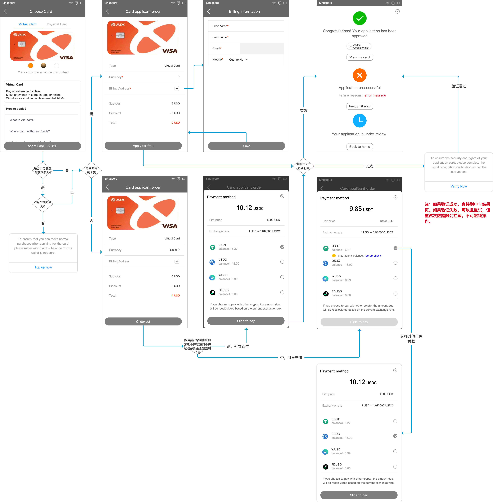

_Source: archive/legacy-prd/card/application/README.md:190_

_Source: archive/legacy-prd/card/application/README.md:192_

_Source: archive/legacy-prd/card/application/README.md:216_

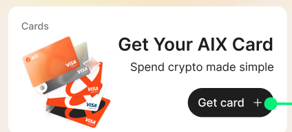

_Source: archive/legacy-prd/card/application/README.md:217_

_Source: archive/legacy-prd/card/application/README.md:218_

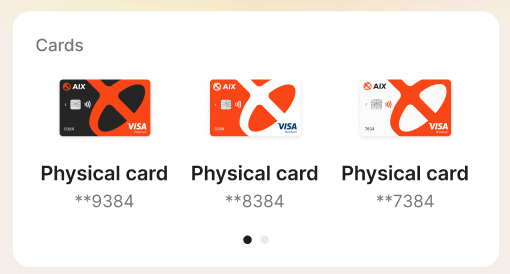

_Source: archive/legacy-prd/card/application/README.md:220_

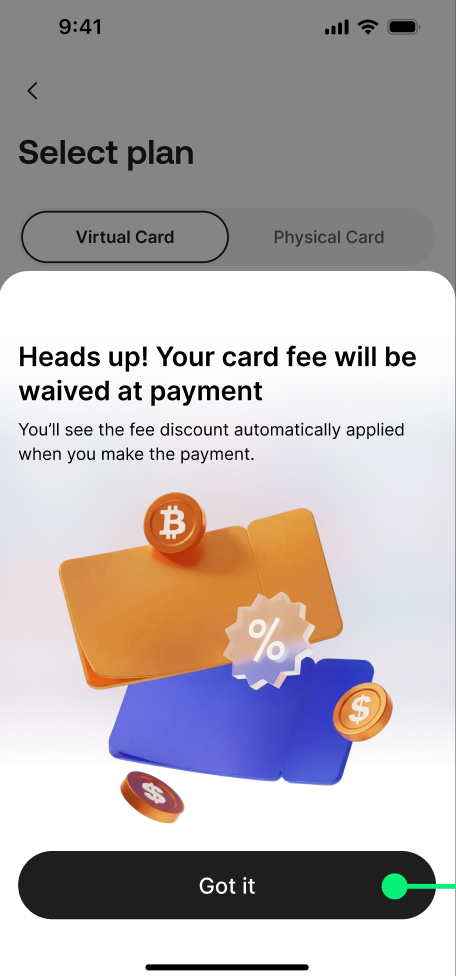

_Source: archive/legacy-prd/card/application/README.md:247_

_Source: archive/legacy-prd/card/application/README.md:248_

_Source: archive/legacy-prd/card/application/README.md:249_

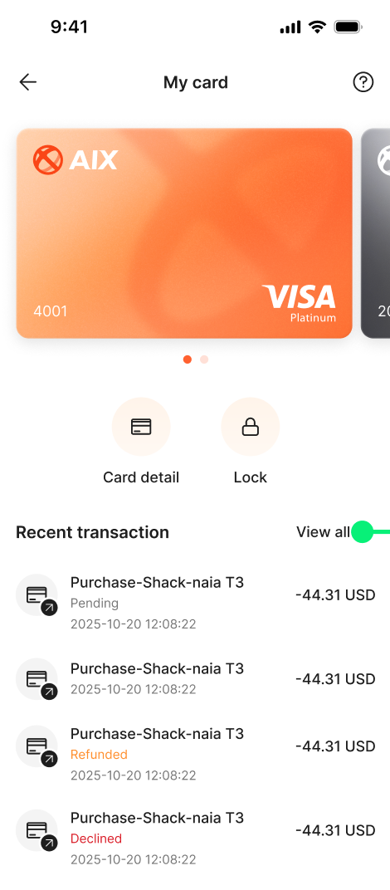

_Source: archive/legacy-prd/card/application/README.md:835_

_Source: archive/legacy-prd/card/application/README.md:836_

### 6. AIX前端功能需求

_Source: archive/legacy-prd/card/application/README.md:251_

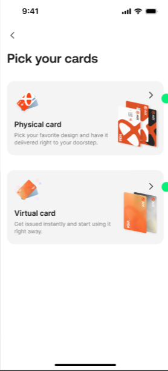

_Source: archive/legacy-prd/card/application/README.md:252_

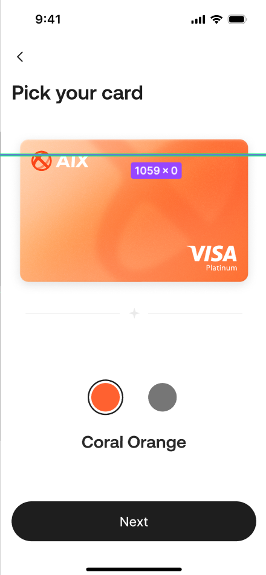

_Source: archive/legacy-prd/card/application/README.md:318_

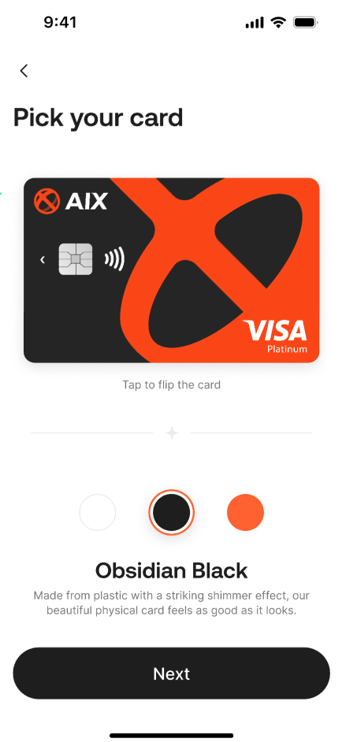

_Source: archive/legacy-prd/card/application/README.md:319_

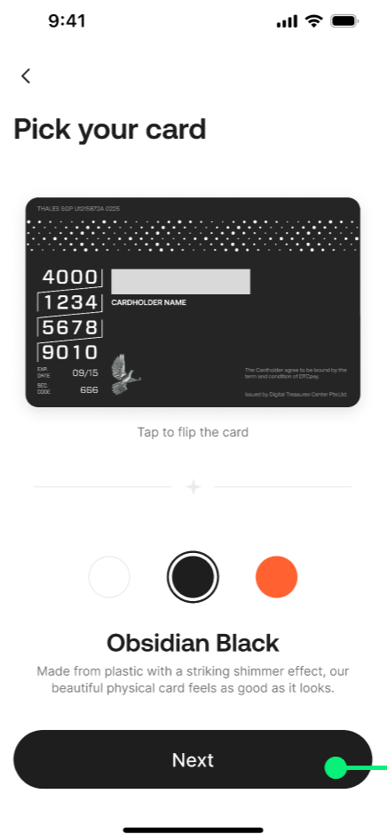

_Source: archive/legacy-prd/card/application/README.md:320_

_Source: archive/legacy-prd/card/application/README.md:381_

_Source: archive/legacy-prd/card/application/README.md:382_

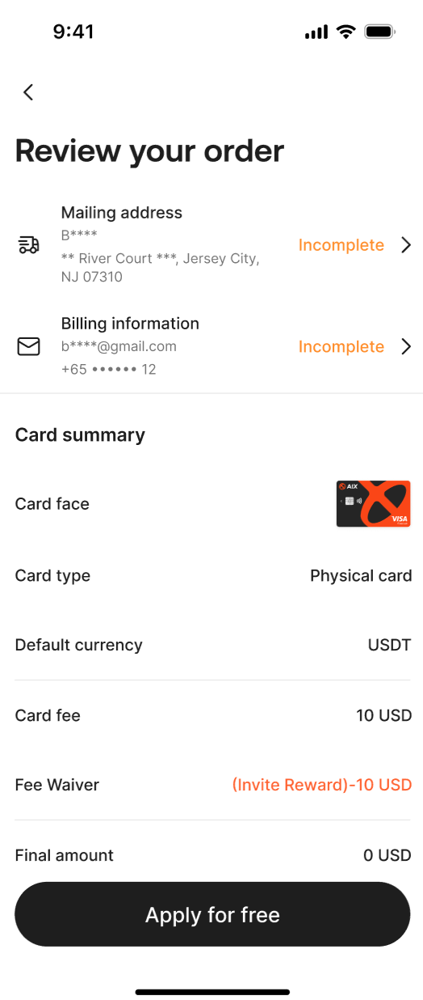

_Source: archive/legacy-prd/card/application/README.md:383_

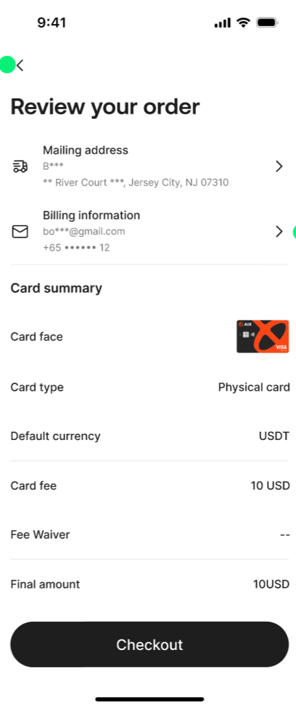

_Source: archive/legacy-prd/card/application/README.md:384_

_Source: archive/legacy-prd/card/application/README.md:431_

_Source: archive/legacy-prd/card/application/README.md:432_

_Source: archive/legacy-prd/card/application/README.md:454_

### Select Crypto

_Source: archive/legacy-prd/card/application/README.md:348_

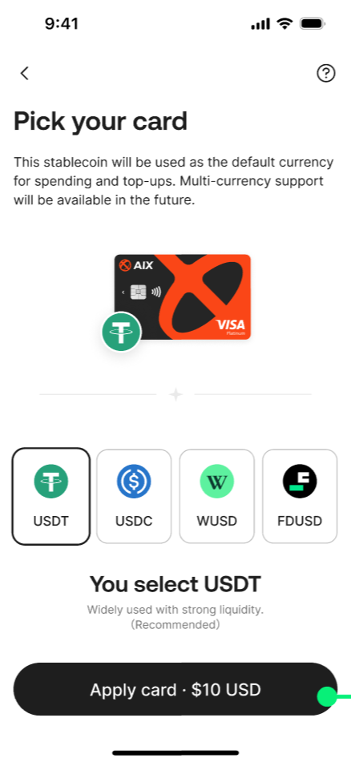

_Source: archive/legacy-prd/card/application/README.md:349_

_Source: archive/legacy-prd/card/application/README.md:350_

### 当前卡片展示

_Source: archive/legacy-prd/card/application/README.md:647_

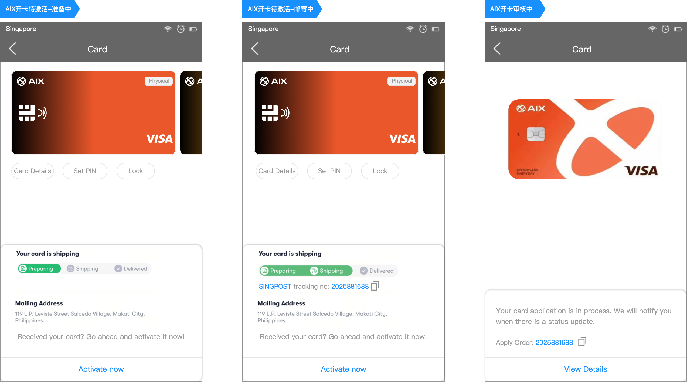

_Source: archive/legacy-prd/card/application/README.md:649_

_Source: archive/legacy-prd/card/application/README.md:807_

_Source: archive/legacy-prd/card/application/README.md:922_

_Source: archive/legacy-prd/card/application/README.md:923_

### Activate Card

_Source: archive/legacy-prd/card/application/README.md:809_

_Source: archive/legacy-prd/card/application/README.md:811_

_Source: archive/legacy-prd/card/application/README.md:813_

_Source: archive/legacy-prd/card/application/README.md:815_

## Additional Page Visuals 补充页面图

> 本节补充第二轮页面覆盖审计中识别出的页面截图，仍引用 converted-prd 原始资产。

### 6. AIX前端功能需求

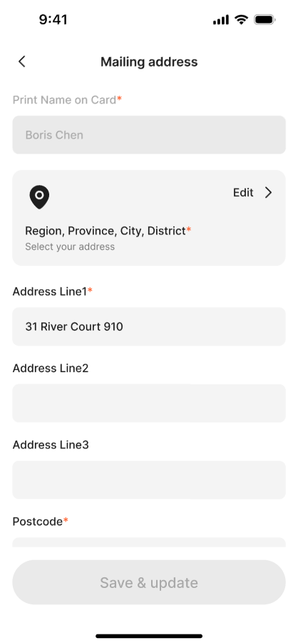

_Source: archive/legacy-prd/card/application/README.md:465_

### 6. AIX前端功能需求

_Source: archive/legacy-prd/card/application/README.md:466_

### 6. AIX前端功能需求

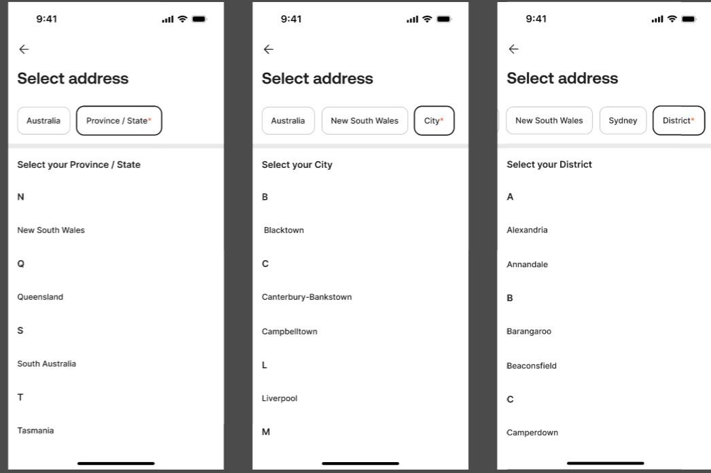

_Source: archive/legacy-prd/card/application/README.md:468_

### 6. AIX前端功能需求

_Source: archive/legacy-prd/card/application/README.md:469_

### 6. AIX前端功能需求

_Source: archive/legacy-prd/card/application/README.md:471_

### 6. AIX前端功能需求

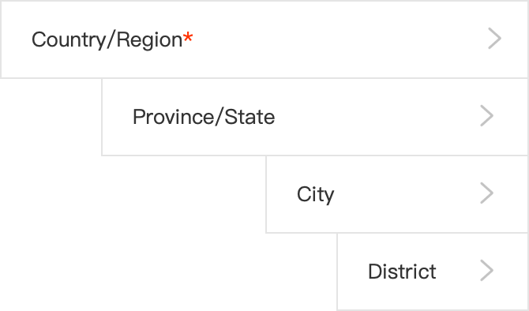

_Source: archive/legacy-prd/card/application/README.md:508_

### 6. AIX前端功能需求

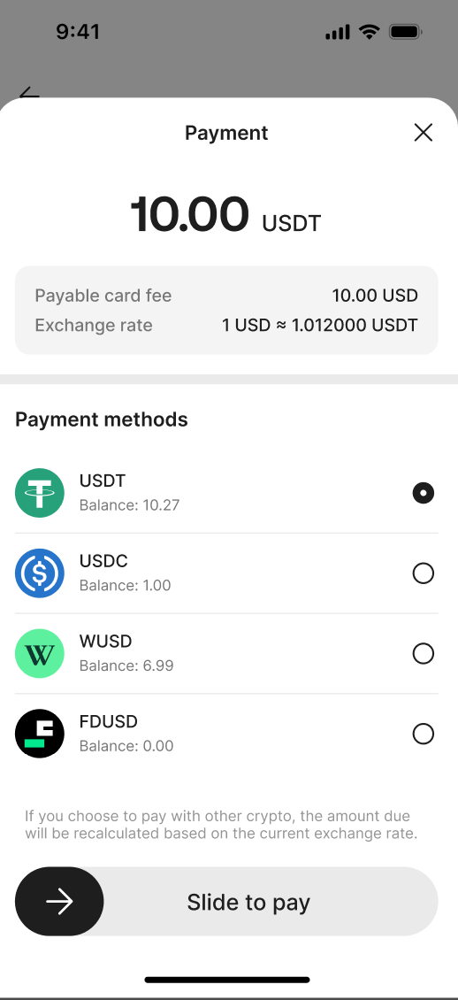

_Source: archive/legacy-prd/card/application/README.md:543_

### 6. AIX前端功能需求

_Source: archive/legacy-prd/card/application/README.md:544_

### 6. AIX前端功能需求

_Source: archive/legacy-prd/card/application/README.md:545_

### 6. AIX前端功能需求

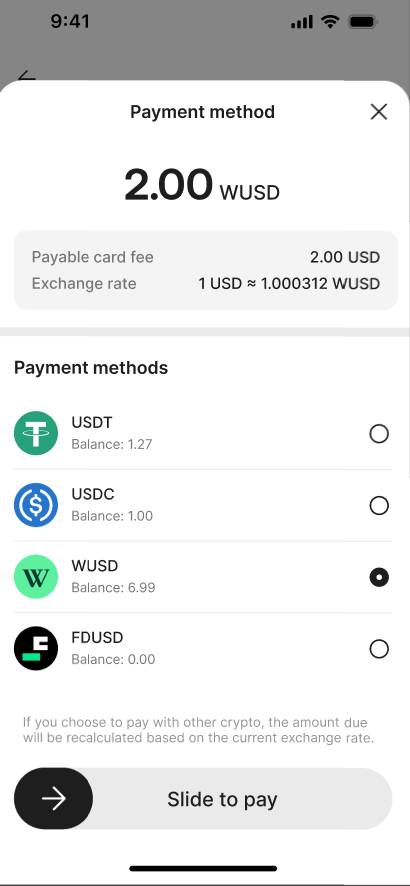

_Source: archive/legacy-prd/card/application/README.md:546_

### 申卡入口

_Source: archive/legacy-prd/card/application/README.md:837_

### 申卡入口

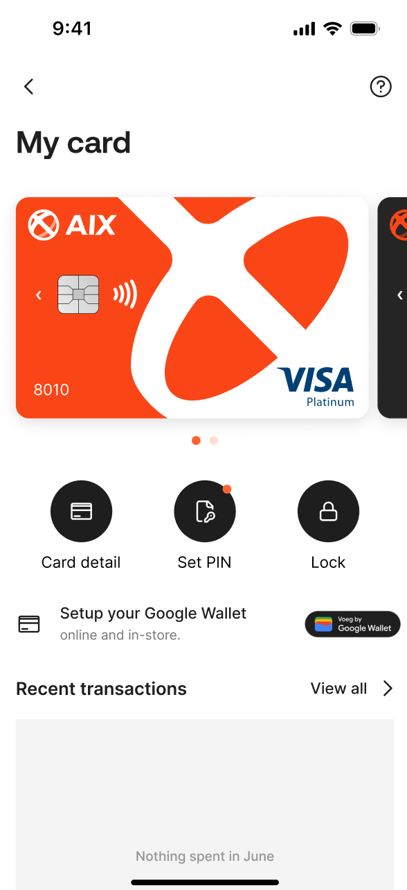

_Source: archive/legacy-prd/card/application/README.md:839_

### 申卡入口

_Source: archive/legacy-prd/card/application/README.md:840_
