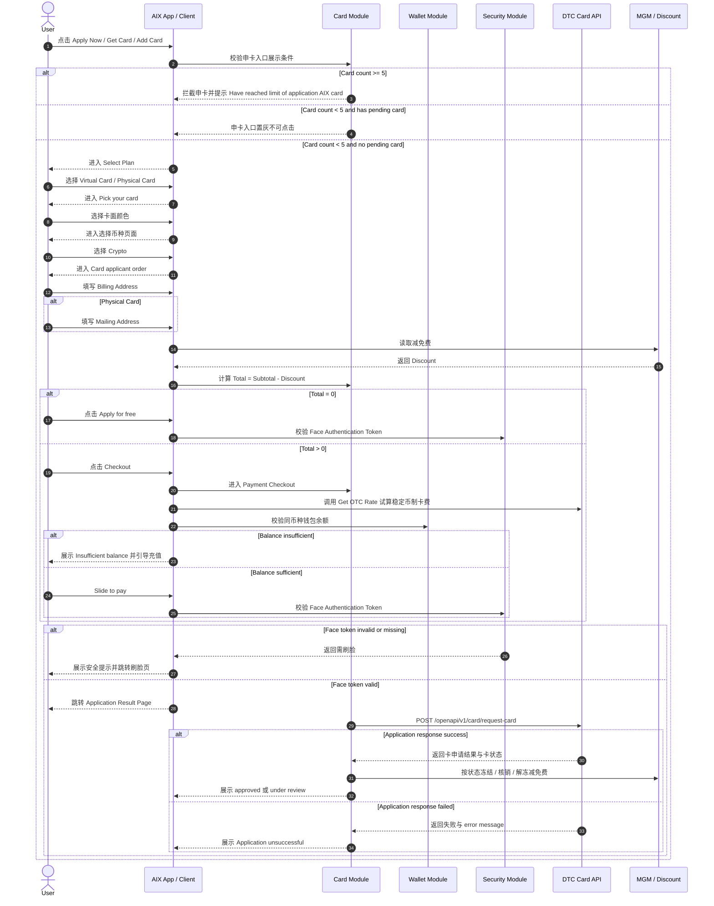
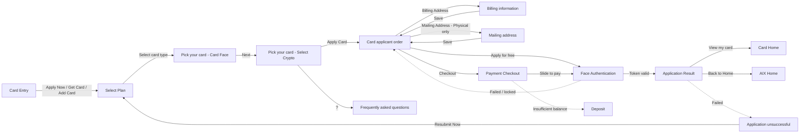

# Card Application 申卡流程

## 0. 文档信息

| 项 | 内容 |
|---|---|
| 文档类型 | Card Application 标准 PRD / 知识库事实文件 |
| 当前版本 | 1.1 |
| 文档状态 | active |
| 目标读者 | Product、Design、FE、BE、QA、Risk、Compliance |
| 本次修订 | 收拢评审意见：修正 Billing 页面标题、姓名与手机号规则、卡面颜色命名、Mailing 字段 DTC 限制、DTC Card Application 请求字段、autoDebit 与 currency 待确认事项、错误码与验收标准 |
| 维护原则 | 本文只处理申卡流程；状态、字段和操作限制统一引用 `card-status-and-fields.md` |

## 1. 功能定位

Card Application 用于 AIX 用户申请 Virtual Card 或 Physical Card。

本文件只沉淀申卡入口、选卡、选币种、订单确认、账单信息、邮寄地址、支付收银台、申卡结果、接口依赖和申卡风控边界。Card Home、Activation、PIN、Sensitive Info、Card Management 和 Card Transaction 不在本文展开。

## 2. 适用范围

| 维度 | 规则 | 来源 | 备注 |
|---|---|---|---|
| 国家线 | VN / PH / AU | AIX Card V1.0【Application】 / 2.1 | 一期支持 |
| 申卡地区 | Philippines / Vietnam / Australia | AIX Card V1.0【Application】 / 2.1 | 后续需配置化 |
| 支持币种 | USDT / USDC / WUSD / FDUSD | AIX Card V1.0【Application】 / 2.1 / 5.1.4 | 后续需配置化 |
| 卡类型 | Virtual Card / Physical Card | AIX Card V1.0【Application】 / 2.2 / 5.1.4 | Physical Card 需单独激活 |
| 费用类型 | application fee / delivery fee | AIX Card V1.0【Application】 / 4.4 | 申请费 / 邮寄费 |
| 自动扣款 | OFF / ON | AIX Card V1.0【Application】 / 4.5；DTC Card Issuing / Card Application | 产品口径写 `0/OFF`、`2/ON`；DTC API 写 `0/OFF`、`1/ON` 且默认 `0`，映射关系需后端确认，不得直接混用 |
| 卡品牌 | VISA / MASTER | AIX Card V1.0【Application】 / 4.1 | AIX Card 对应 Brand |

## 3. 前置条件

| 条件 | 规则 | 来源 | 未满足结果 |
|---|---|---|---|
| 钱包开户与 KYC | 仅完成钱包开通、DTC 渠道开户和 KYC 验证通过的用户才可申请卡 | AIX Card V1.0【Application】 / 2.1 | 不允许进入完整申卡 |
| Face Authentication | 申卡需完成刷脸 Token 验证 | AIX Card V1.0【Application】 / 2.1 / 2.2 | Token 失效时跳转 Security 刷脸页 |
| 申卡数量 | 已激活、已冻结、待激活、审核中之和最多 5 张 | AIX Card V1.0【Application】 / 5.1.4 | 达上限时阻止申卡 |
| 在途限制 | 一个用户可申请多张卡，但仅可一张在途 | AIX Card V1.0【Application】 / 2.1 | 有审核中卡时入口置灰 |
| 费用支付 | 无减免费时需同币种钱包余额足够覆盖制卡费 | AIX Card V1.0【Application】 / 2.1 / 5.1.4 | 余额不足引导充值 |
| 支持币种 | 申卡时选择 USDT / USDC / WUSD / FDUSD | AIX Card V1.0【Application】 / 2.1 / 5.1.4 | 不支持币种不可申请 |
| 支持地区 | 申卡地区一期支持 Philippines / Vietnam / Australia | AIX Card V1.0【Application】 / 2.1 | 其他地区不在一期范围 |

## 4. 业务流程

### 4.1 主链路

```text
Card Entry → Select Plan → Pick Card Face → Select Crypto → Card Applicant Order → Billing / Mailing Info → Payment / Free Application → Face Authentication → Submit Card Application → Application Result
```

### 4.2 业务流程与系统交互时序图



### 4.3 业务逻辑矩阵

| 阶段 | 触发条件 | 系统动作 | 成功结果 | 失败 / 拦截结果 |
|---|---|---|---|---|
| 申卡入口 | 用户进入可申卡入口 | 统计已激活、已冻结、待激活、审核中卡数量 | 可进入 Select Plan | 达 5 张不展示入口；有审核中卡则入口置灰 |
| 选择卡类型 | 用户进入 Select Plan | 区分首次 / 非首次，展示 Virtual / Physical Card | 进入 Pick your card | 无 |
| 选择卡面 | 用户选择卡类型后 | 展示可配置卡色与卡面 | 进入选择币种 | 无 |
| 选择币种 | 用户进入 Pick your card | 展示 USDT / USDC / WUSD / FDUSD 与 Apply Card 按钮 | 进入 Card applicant order | 无 |
| 填写订单信息 | 用户进入 Card applicant order | 收集 Billing Address；Physical Card 需 Mailing Address | 订单可提交 | 必填缺失不可提交 |
| 免费申请 | Total = 0 | 点击 Apply for free 后校验刷脸 Token | Token 有效则提交申卡 | Token 无效跳转刷脸 |
| 付费申请 | Total > 0 | 试算 Card Fee，校验同币种余额 | 余额足够可 Slide to pay | 余额不足引导充值 |
| 提交申卡 | Token 有效且订单信息完整 | 调用 DTC Card Application | 展示成功或审核中 | 展示失败页与 DTC error message |
| 减免费处理 | 申卡接口响应返回 | 按响应状态通知 MGM 冻结 / 核销 / 解冻 | 减免费状态同步 | 响应失败不通知减免费 |

## 5. 页面关系总览

本节只表达 Card Application 页面节点和跳转关系，不展开 Card Home、Activation、PIN 等后续功能。



## 6. 页面卡片与交互规则

### 6.1 申卡入口

| 场景 | 展示 / 交互规则 | 来源 |
|---|---|---|
| 已激活、已冻结、待激活、审核中之和 >= 5 | 不显示申卡入口 | 5.1.4 |
| 总数 < 5 且有审核中的卡 | 申卡入口置灰不可点击 | 5.1.4 |
| 总数 < 5 且无审核中的卡 | 申卡入口高亮可点击 | 5.1.4 |
| 点击时已达到上限 | 拦截提交并提示 `Have reached limit of application AIX card` | 5.1.4 |
| Banner 入口 | 点击 `Apply Now` 跳转 `Select plan` | 5.1.4 |
| AIX 主页首次申请入口 | 点击 `Get Card` 跳转 `Select plan` | 5.1.4 |
| 首页常驻申请入口 | 点击 `⊕` 跳转 `Select plan` | 5.1.4 |

### 6.2 Select Plan

| 用户类型 | 页面规则 | 来源 |
|---|---|---|
| 首次申请 | 支持 Virtual Card / Physical Card Tab 切换；展示对应介绍页和 FAQ | 5.1.4 |
| 非首次申请 | 优先展示虚拟卡，再展示实体卡；点击 `>` 跳转 Pick your card | 5.1.4 |
| Virtual Card FAQ | 展示最新 5 条；按关键场景 `Apply Card`、类型 `Virtual Card`、最近时间筛选 | 5.1.4 |
| Physical Card FAQ | 展示最新 3 条；按关键场景 `Apply Card`、类型 `Physical Card`、最近时间筛选 | 5.1.4 |
| FAQ 展示 | 默认只显示问题，折叠答案；点击任意问题只显示当前答案 | 5.1.4 |
| 钱包余额不能为 0 校验开启 | 调用 `[GET] /openapi/v1/wallet/balances`；任一余额 > 0 显示 `Get started`，否则显示 `Top up & Get started` | 5.1.4 / 6.5 |

### 6.3 Pick your card - Card Face

| 卡类型 | 可选卡色 | 交互规则 | 来源 |
|---|---|---|---|
| Virtual Card | Coral Orange / Obsidian Black / Clear blue sky | 用户选择颜色后切换对应卡面示例图 | 5.1.4 |
| Physical Card | Coral Orange / Obsidian Black / Clear blue sky | 用户选择颜色后切换对应卡面示例图；点击实体卡卡面可切换正反面 | 5.1.4 |
| 下一步 | `Next` | 跳转选择币种页面 | 5.1.4 |

### 6.4 Pick your card - Select Crypto

| 元素 | 规则 | 来源 |
|---|---|---|
| Crypto | 必选，默认 USDT；支持 USDT / USDC / WUSD / FDUSD | 5.1.4 |
| FAQ | 点击 `?` 进入 Frequently asked questions；按 `Apply Card` + `Select Crypto` 筛选 | 5.1.4 |
| Apply Card Button | X 为后台配置制卡费；X=0 显示 `Apply Card`，否则显示 `Apply Card · X USD` | 5.1.4 |
| 当前费用 | Virtual Card 当前 5 USD；Physical Card 当前 10 USD | 5.1.4 |
| 点击申请 | 跳转 `Card applicant order` | 5.1.4 |

### 6.5 Card applicant order

| 区域 | 规则 | 来源 |
|---|---|---|
| Billing Address | 必填；点击进入 Billing information；填写后反显脱敏邮箱和手机号 | 5.1.4 |
| Mailing Address | 仅 Physical Card 展示且必填；点击进入 Mailing address；填写后反显脱敏姓名和地址 | 5.1.4 |
| Card face | 根据用户选择展示对应卡面示例图 | 5.1.4 |
| Card type | 展示 Virtual Card / Physical Card | 5.1.4 |
| Currency | 展示 USDT / USDC / WUSD / FDUSD | 5.1.4 |
| Subtotal | 按 USD 计价，Physical Card 10 USD，Virtual Card 5 USD，可配置 | 5.1.4 |
| Discount | 默认为 0，按 USD 计价；从 MGM 读取减免费后显示 | 5.1.4 |
| Total | `Total = Subtotal - Discount`，按 USD 计价 | 5.1.4 |
| Apply for free | Total 为 0 时显示 | 5.1.4 |
| Checkout | Total 不为 0 时显示 | 5.1.4 |

### 6.6 Billing information

| 字段 | 规则 | 来源 |
|---|---|---|
| 页面标题 | `Billing information` | 5.1.4 |
| 缓存 | 若用户提交过账单地址，进入页面自动反显最近一次缓存数据，支持修改；删除应用缓存丢失 | 5.1.4 |
| First name | 必填；25 字节；仅允许英文字母与空格；不允许数字和特殊字符；失败提示 `Text format error. ` | 5.1.4 |
| Last name | 必填；25 字节；仅允许英文字母与空格；不允许数字和特殊字符；失败提示 `Text format error. ` | 5.1.4 |
| Email | 必填；自动反显注册 AIX 填写的邮箱，不可修改 | 5.1.4 |
| Mobile | 必填；手机号纯数字，产品页至少 4 位、最长 12 字节；CountryNo 至少 1 位、最长 4 字节；上送 DTC 时需映射到 `mobile.countryCode` 与 `mobile.number` | 5.1.4；DTC Card Issuing / Card Application |
| Save | 用 `First name + Last name` 与 `Last name + First name` 两种组合与 KYC Full name 比对，大小写不敏感；任一匹配即通过 | 5.1.4 |
| 姓名不一致 | 提示 `Please fill in your name correctly.` | 5.1.4 |
| 姓名一致 | 保存账单信息并返回 `Card applicant order` | 5.1.4 |

### 6.7 Mailing address

| 字段 | 规则 | 来源 |
|---|---|---|
| 页面标题 | `Mailing address` | 5.1.4 |
| 缓存 | 若用户提交过邮寄地址，进入页面自动反显最近一次缓存数据，支持修改；删除应用缓存丢失 | 5.1.4 |
| Print Name on Card | 必填；自动反显注册 AIX 填写的 fullname，不可修改 | 5.1.4 |
| Country / Region | 四级联动；DTC 支持国家或地区；Philippines / Vietnam / Australia | 5.1.4 |
| Address Line1 | 必填；字符串；40 字节；同地址正则；失败提示 `Text format error. ` | 5.1.4 |
| Address Line2 | 字符串；40 字节；同地址正则；失败提示 `Text format error. ` | 5.1.4 |
| Address Line3 | 字符串；40 字节；同地址正则；失败提示 `Text format error. ` | 5.1.4 |
| Province / State | 四级联动 | 5.1.4 |
| City | 四级联动 | 5.1.4 |
| District | 四级联动 | 5.1.4 |
| Postcode | 必填；产品页按地址规则校验；上送 DTC `deliveryAddress.postal` 最大 10 字节，超过时不得提交或需明确截断策略 | 5.1.4；DTC Card Issuing / Card Application |
| Recipient name | 默认读取 Billing information 的 `Last name + First name`，支持修改；上送 DTC `deliveryAddress.fullName` 最大 60 字节 | 5.1.4；DTC Card Issuing / Card Application |
| Recipient mobile | 默认读取 Billing information 的 Mobile，支持修改；纯数字；上送 DTC `deliveryAddress.phoneNumber` 最大 16 字节 | 5.1.4；DTC Card Issuing / Card Application |
| Save | 保存邮寄地址并返回 `Card applicant order` | 5.1.4 |

地址类字段正则：`^[#.0-9a-zA-Z\s,\/\-_:+?')(@#!&]+$`。DTC 邮寄地址字段限制为：`country` 3、`state` 20、`city` 20、`district` 40、`address1-3` 各 40、`postal` 10、`fullName` 60、`phoneNumber` 16；页面允许值不得超过接口可接受范围，若存在差异需由前后端明确拦截或映射策略。

### 6.8 Payment Checkout

| 场景 | 规则 | 来源 |
|---|---|---|
| 费用试算 | 调用 `/openapi/v1/otc/get-otc-rate` 获取实时汇率，将 Total 试算为当前选择币种需支付金额 | 5.1.4 / 6.7 |
| Card Fee | `Card fee = Total * Rate` | 5.1.4 |
| 同币种余额足够 | 展示 Payment 弹窗，按钮 `Slide to pay` | 5.1.4 |
| 同币种余额不足 | 展示 `Insufficient balance, please deposit`，按钮 `Top up X` | 5.1.4 |
| 全量币种页 | 当前所选币种可用时可勾选；非当前币种提示 `Not Supported` 且不可勾选 | 5.1.4 |
| 扣费方式 | 扣制卡费不用单独调接口，仅上送费用字段；申请响应成功时 DTC 实时扣费 | 5.1.4 |
| 审核失败退款 | 如果审核失败，DTC 会发起退款 | 5.1.4 |
| 申请记录 | 申卡响应成功需存 Apply Order、Create time、Type、Status、Subtotal、Discount、Total、Rate、Card fee 等关键字段 | 5.1.4 |

### 6.9 Face Authentication Trigger

| 场景 | 规则 | 来源 |
|---|---|---|
| Apply for free | 点击后调用身份认证模块校验刷脸 token 是否有效 | 5.1.4 |
| Slide to pay | 点击后调用身份认证模块校验刷脸 token 是否有效 | 5.1.4 |
| Token 失效 / 未操作刷脸 | 提示 `To ensure the security and rights of your application card, please complete the facial recognition verification as per the instructions.` | 5.1.4 |
| Verify Now | 点击后跳转身份认证模块刷脸页 | 5.1.4 / security/face-authentication |
| Token 有效 | 前端跳转申卡结果页，后台校验申卡信息并调用 `/openapi/v1/card/request-card` | 5.1.4 |
| 刷脸失败且超限 | 当天无法提交申卡 | 5.1.4 |

### 6.10 Application Result

| 结果 | 触发条件 | 展示 / 动作 | 来源 |
|---|---|---|---|
| Approved | `success = true` 且返回卡状态 `Pending activation` 或 `Active` | 展示 `Congratulations! Your application has been approved` | 5.1.4 |
| Add to Google Wallet | 当前申请设备是 Android 时显示；点击跳转绑卡页面 | 绑卡方案待定 | 5.1.4 |
| View my card | 点击返回 Card 首页 | 5.1.4 |
| Under review | `success = true` 且返回状态 `Processing` | 展示 `Your application is under review`；点击 `Back to Home` 返回 AIX 首页 | 5.1.4 |
| Unsuccessful | `success = false` | 展示 `Application unsuccessful`，读取 DTC error message 展示，例如 `Parameters is invalid` | 5.1.4 |
| Resubmit Now | 失败页点击后进入 `Select Plan` | 5.1.4 |

### 6.11 MGM 减免费处理

| 申卡响应 / 卡状态 | MGM 动作 | 来源 |
|---|---|---|
| 响应失败 | 不做减免费通知 | 5.1.4 |
| 响应成功且审核中，卡状态 `Pending` | 通知 MGM 进行减免费冻结 | 5.1.4 |
| 响应成功且审核通过，卡状态 `Active` 或 `Pending activation` | 通知 MGM 进行减免费核销 | 5.1.4 |
| 响应成功且审核失败，卡状态 `Terminated` 或 `Cancelled` | 通知 MGM 进行减免费解冻 | 5.1.4 |

## 7. 字段与接口依赖

| 接口 / 字段 / 能力 | 用途 | 来源 | 备注 |
|---|---|---|---|
| `Card Application` | 提交实体卡或虚拟卡申请 | 2.2 / 6.1；DTC Card Issuing / Card Application | `[POST] /openapi/v1/card/request-card` |
| `Get Wallet Account Balance` | 查询全量钱包余额，用于钱包余额不能为 0 校验 | 2.2 / 6.5 | `[GET] /openapi/v1/wallet/balances` |
| `Get Balance` | 查询单币种钱包余额 | 2.2 | `[GET] /openapi/v1/wallet/balance/{currency}` |
| `Get OTC Rate` | 查询实时汇率并试算 Card Fee | 2.2 / 6.7 | `[POST] /openapi/v1/otc/get-otc-rate` |
| `Inquiry Card Basic Info with Reference No` | 网络或响应异常时通过 referenceNo 查询卡信息 | 2.2 / 6.3 | `[GET] /openapi/v1/card/inquiry-card-info/{referenceNo}` |
| `successRedirectUrl / failureRedirectUrl` | Face Authentication 回跳 | Security API Reference | 不在 Card 中重复定义 |
| `face token` | 申卡前刷脸校验 | 2.1 / 5.1.4 / Security | 由 Security 模块管理 |
| `Subtotal` | 制卡费总价，USD | 5.1.4 | 可配置 |
| `Discount` | MGM 减免费，USD | 5.1.4 | 默认 0 |
| `Total` | 应付金额，`Subtotal - Discount` | 5.1.4 | USD |
| `Rate` | 实时汇率 | 5.1.4 / 6.7 | 用于稳定币金额试算 |
| `Card fee` | 稳定币付款金额，`Total * Rate` | 5.1.4 | 当前选择币种 |
| `referenceNo` | 异常查询卡信息业务 ID；DTC Card Application 请求字段 | 2.2 / 6.3；DTC Card Issuing / Card Application | 需由 AIX 生成并保证可追踪 |
| `productCode` | DTC 卡产品编码 | DTC Card Issuing / Card Application | 必填，来源待产品 / 渠道配置 |
| `cardMaterial` | 卡材质 / 卡类型 | DTC Card Issuing / Card Application | 必填，需映射 Virtual / Physical Card |
| `currency` | DTC National Currency Code | DTC Card Issuing / Card Application | 与用户选择的 USDT / USDC / WUSD / FDUSD 不可默认等同，映射待确认 |
| `firstName` / `lastName` / `preferredPrintedName` | 持卡人姓名与印卡名 | DTC Card Issuing / Card Application | 来自 Billing / Mailing 页面 |
| `email` | 用户邮箱 | DTC Card Issuing / Card Application | 注册邮箱反显，不可修改 |
| `mobile.countryCode` / `mobile.number` | 手机区号与手机号 | DTC Card Issuing / Card Application | 区号长度与产品页规则存在差异，需映射确认 |
| `deliveryAddress.*` | 邮寄地址字段 | DTC Card Issuing / Card Application | Physical Card 必填，长度按 DTC 限制 |
| `cardFeeDetails.type` / `amount` / `currency` | DTC 费用字段 | DTC Card Issuing / Card Application | 与 AIX `Total`、稳定币支付金额的关系需确认 |
| `autoDebitEnabled` | 自动扣款开关 | DTC Card Issuing / Card Application | DTC 枚举 `0/OFF`、`1/ON`；产品枚举冲突见待确认 |

## 8. 异常与失败处理

| 场景 | 触发条件 | 用户提示 / 系统动作 | 最终状态 | 来源 |
|---|---|---|---|---|
| 申卡数量达上限 | 已激活、已冻结、待激活、审核中之和 >= 5 | 不显示申卡入口；点击时提示 `Have reached limit of application AIX card` | 阻止申卡 | 5.1.4 |
| 存在审核中卡 | 总数 < 5 且有审核中的卡 | 申卡入口置灰不可点击 | 暂不可再次申请 | 5.1.4 |
| 钱包余额为 0 | 开启钱包不能为 0 校验且所有币种余额均为 0 | 显示 `Top up & Get started`，跳转 Deposit | 引导充值 | 5.1.4 |
| 同币种余额不足 | Checkout 时当前选择币种余额不足 | 提示 `Insufficient balance, please deposit`，按钮 `Top up X` | 引导充值 | 5.1.4 |
| Billing 姓名与 KYC 不一致 | Save 时 `First name + Last name` 与 KYC Full name 不一致 | `Please fill in your name correctly.` | 不保存账单信息 | 5.1.4 |
| 文本格式错误 | 字段正则校验失败 | `Text format error. ` | 阻止保存 | 5.1.4 |
| Face token 无效 | 未操作刷脸或刷脸 token 失效 | 展示安全提示，点击 Verify Now 跳转刷脸 | 进入 Security 刷脸 | 5.1.4 |
| 刷脸失败且超限 | Face Authentication 重试失败并超限 | 当天无法提交申卡 | 阻止申卡 | 5.1.4 |
| DTC 申卡失败 | Card Application 返回 `success = false` | 展示 `Application unsuccessful` 与 DTC error message | 可 Resubmit Now | 5.1.4 |
| 申卡响应异常 | 网络或响应异常 | 可通过 referenceNo 查询卡基本信息 | 待查询确认 | 2.2 / 6.3 |
| 未知 DTC 错误码 | DTC 返回当前错误码之外的其他错误 | 直接报警通知，以便产品和渠道确定后续错误处理 | 待人工确认 | 6.1.6 |

### 8.1 DTC Card Application 错误码处理

| 错误码 | 含义 | 建议页面处理 | 来源 |
|---|---|---|---|
| `00006` | Access denied | 展示 Application unsuccessful，记录渠道鉴权异常 | DTC Card Issuing / Card Application |
| `31002` | Card processor error | 展示 Application unsuccessful，允许 Resubmit Now；同时告警 | DTC Card Issuing / Card Application |
| `31006` | Parameters is invalid | 展示 DTC error message，允许 Resubmit Now | DTC Card Issuing / Card Application |
| `31007` | have a pending card application | 返回申卡入口置灰 / 审核中状态 | DTC Card Issuing / Card Application |
| `31024` | Failed to for virtual card | 展示 Application unsuccessful，允许 Resubmit Now | DTC Card Issuing / Card Application |
| `31025` | Failed to apply for physical card | 展示 Application unsuccessful，允许 Resubmit Now | DTC Card Issuing / Card Application |
| `31028` | have reached limit of application physical card | 提示达到申请上限，阻止继续申请实体卡 | DTC Card Issuing / Card Application |
| `31047` | Virtual card holding limit | 提示达到虚拟卡持有限制，阻止继续申请虚拟卡 | DTC Card Issuing / Card Application |
| `31055` | Insufficient wallet balance. Card application fee cannot be deducted | 引导充值或返回 Checkout | DTC Card Issuing / Card Application |

## 9. 风控 / 合规边界

| 边界 | 规则 | 影响 | 来源 |
|---|---|---|---|
| KYC 前置 | 仅完成钱包开通、DTC 渠道开户和 KYC 验证通过的用户可申卡 | 防止未实名开卡 | 2.1 |
| Face Authentication 前置 | 申卡需完成刷脸 Token 验证 | 复用 Security 高强度认证 | 2.1 / 2.2 / 5.1.4 |
| 数量限制 | 用户最多 5 张卡，统计待激活、已激活、审核中、已冻结 | 控制卡片数量 | 5.1.4 |
| 在途限制 | 同一用户仅可一张在途 | 防止并发申请 | 2.1 |
| 制卡费 | 免制卡费直接开卡；非免费需同币种余额足够并由 DTC 在申请成功时实时扣费 | 影响资金扣减与对账 | 2.1 / 5.1.4 |
| 费用退款 | 审核失败后 DTC 发起退款 | 影响资金回退 | 5.1.4 |
| 减免费状态 | 成功 / 审核中 / 审核失败分别触发 MGM 核销 / 冻结 / 解冻 | 影响 MGM 权益核销 | 5.1.4 |
| 高风险与制裁地区过滤 | 修订记录写明申卡地区要过滤高风险及制裁地区 | 影响地区选择范围 | 1.2 修订记录 |
| 名称一致性 | Billing `First name + Last name` 必须与 KYC Full name 一致 | 防止非本人申卡 | 1.2 修订记录 / 5.1.4 |

## 10. 待确认事项

| 编号 | 问题 | 影响 | 优先级 |
|---|---|---|---|
| CARD-APP-Q001 | 产品 `autoDebitEnabled=2/ON` 与 DTC `autoDebitEnabled=1/ON` 如何映射？ | 自动扣款上送、Home 标签展示 | P0 |
| CARD-APP-Q002 | 用户选择稳定币 USDT / USDC / WUSD / FDUSD 与 DTC `currency`、`cardFeeDetails.currency` 的关系 | 申卡请求、扣费与对账 | P0 |
| CARD-APP-Q003 | DTC `productCode`、`cardMaterial`、`cardFeeDetails.type` 的配置来源 | 渠道接入 | P0 |
| CARD-APP-Q004 | CountryNo 产品长度 4 与 DTC `mobile.countryCode` 长度 3 的映射 | 手机号上送 | P1 |
| CARD-APP-Q005 | 页面字段长度若大于 DTC 限制时，是前端拦截、后端拦截还是截断 | 邮寄地址、手机号 | P1 |
| CARD-APP-Q006 | Free / Paid 申卡结果页和 DTC 扣费、MGM 减免费状态是否存在异步补偿 | 资金与权益 | P1 |

## 11. 验收标准 / 测试场景

| 场景 | 验收标准 |
|---|---|
| 申卡入口 | 已激活 + 已冻结 + 待激活 + 审核中 >= 5 时不显示入口；有审核中卡时入口置灰；无审核中且未达上限时可点击 |
| 选卡与卡面 | Virtual / Physical 可选；卡色使用 Coral Orange、Obsidian Black、Clear blue sky；Physical 卡面可切换正反面 |
| Billing 信息 | 页面标题为 `Billing information`；First name / Last name 只允许英文字母和空格；KYC 比对支持 First+Last 与 Last+First 两种组合 |
| Mailing 信息 | 仅 Physical Card 必填；字段长度不得超过 DTC 限制；保存后返回订单页反显脱敏信息 |
| 余额与扣费 | Total=0 显示 Apply for free；Total>0 进入 Checkout；同币种余额不足时提示充值；余额足够时可 Slide to pay |
| Face Token | Token 无效时展示安全提示并跳转刷脸；刷脸超限后当天不可提交申卡 |
| DTC 提交 | 成功时根据返回状态展示 Approved / Under review；失败时展示 Application unsuccessful 和 DTC error message |
| 错误码 | 31007、31028、31047、31055 等关键错误码必须有明确页面承接 |
| Gap 阻塞 | autoDebit 和 currency 映射未确认前，不得把产品枚举直接透传给 DTC |

## 12. 来源引用

- (Ref: 历史prd/AIX Card V1.0【Application】.pdf / 1.2 修订记录 / V1.0)
- (Ref: 历史prd/AIX Card V1.0【Application】.pdf / 2.1 申卡说明 / V1.0)
- (Ref: 历史prd/AIX Card V1.0【Application】.pdf / 2.2 接口范围 / V1.0)
- (Ref: 历史prd/AIX Card V1.0【Application】.pdf / 4.1 brand品牌 / V1.0)
- (Ref: 历史prd/AIX Card V1.0【Application】.pdf / 4.4 feeType卡费用类型 / V1.0)
- (Ref: 历史prd/AIX Card V1.0【Application】.pdf / 4.5 autoDebitEnabled自动扣款 / V1.0)
- (Ref: 历史prd/AIX Card V1.0【Application】.pdf / 5.1 申请开卡 / V1.0)
- (Ref: 历史prd/AIX Card V1.0【Application】.pdf / 5.1.4 功能需求 / V1.0)
- (Ref: 历史prd/AIX Card V1.0【Application】.pdf / 6.1 申请开卡Card Application / V1.0)
- (Ref: 历史prd/AIX Card V1.0【Application】.pdf / 6.3 业务ID获取卡基本信息 / V1.0)
- (Ref: 历史prd/AIX Card V1.0【Application】.pdf / 6.5 获取全量币种钱包余额 / V1.0)
- (Ref: knowledge-base/card/_index.md)
- (Ref: knowledge-base/security/face-authentication.md)
- (Ref: knowledge-base/security/api-reference.md)
- (Ref: knowledge-base/changelog/knowledge-gaps.md / Card Application / 2026-05-01)
