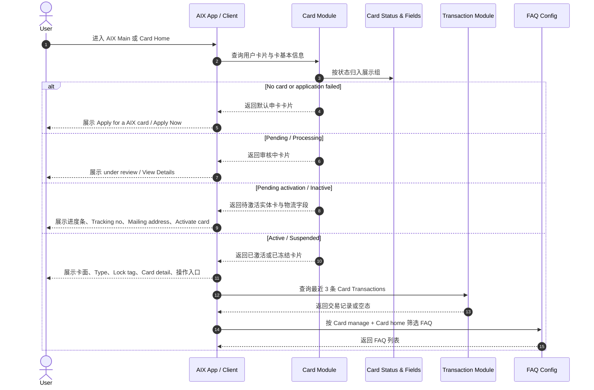
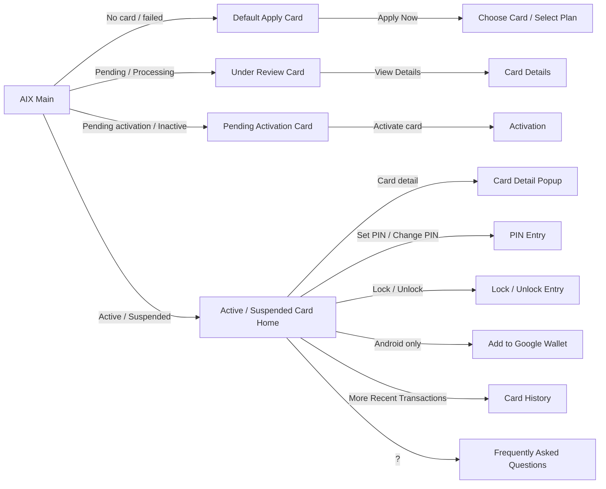

# Card Home 卡首页

## 1. 功能定位

Card Home 用于已申卡用户查看卡片展示、卡片详情入口、卡片操作入口、Recent Transactions、实体卡物流信息和 FAQ 入口。

本文件只沉淀 Card Home 页面层规则。申卡全流程见 `application.md`，卡状态和字段字典见 `card-status-and-fields.md`，激活、PIN、锁卡 / 解锁、查看敏感信息和交易回退不在本文展开。

## 2. 适用范围

| 维度 | 规则 | 来源 | 备注 |
|---|---|---|---|
| 用户范围 | 有开卡成功或在途记录的用户 | Application / 5.2；Home / 6.1 | 展示已激活、已冻结、待激活、审核中的卡片 |
| 无卡用户 | 未申请或申请失败 | Application / 5.2；Home / 6.1 | 展示默认申卡卡片 |
| 卡排序 | 已激活、已冻结、待激活、审核中的卡片按申请时间降序展示 | Application / 5.2；Home / 6.1 | 适用于多卡展示 |
| 卡类型 | Virtual Card / Physical Card | Application / 5.2 | 展示 Type Tag |
| 状态来源 | 引用 `card-status-and-fields.md` | Card Status & Fields | 本文不重新定义状态 |
| Android 设备 | 显示 Add to Google Wallet | Application / 5.2 | 绑卡方案待定 |

## 3. 前置条件

| 条件 | 说明 | 来源 |
|---|---|---|
| 用户已登录 AIX App | Home 卡片区前置条件 | Home / 6.1 |
| 用户已开通钱包 | Card Home 相关卡片区前置条件 | Home / 6.1 |
| 卡状态已归一 | Card Home 渲染前需先按 `card-status-and-fields.md` 归入展示组 | Card Status & Fields |
| 卡基本信息可查询 | 展示卡片、卡号后四位、余额、物流信息需依赖 Card Basic Info / Delivery Notification | Application / 6.2 / 6.3；Home / 6.1 |

## 4. 业务流程

### 4.1 主链路

```text
AIX Main / Card Entry → Query Card List & Status → Render Card Group → Card Home → Operation Entry / Recent Transactions / FAQ
```

### 4.2 业务流程与系统交互时序图



### 4.3 业务逻辑矩阵

| 阶段 | 触发条件 | 页面 / 系统动作 | 成功结果 | 失败 / 缺口 |
|---|---|---|---|---|
| 入口 | 用户进入 AIX Main 或 Card Home | 查询卡片记录和状态 | 进入对应展示组 | 状态无法归一时进入 gaps |
| 默认申卡卡片 | 未申请或申请失败 | 展示 Apply Now | 跳转 Choose Card / Select Plan | 申请失败通知接口缺失 |
| 审核中卡片 | 状态归入审核中 | 展示 Under review 与 View Details | 可查看申卡详情 | View Details 目标页细节未展开 |
| 待激活卡片 | 状态归入待激活 | 展示物流进度、Tracking no、Mailing address、Activate card | 可进入激活入口 | DTC 不支持直接查看卡邮寄地址，按状态和物流单映射 |
| 已激活 / 已冻结卡片 | 状态归入已激活或已冻结 | 展示卡面、卡信息、操作按钮、Recent Transactions、FAQ | 可进入卡操作入口 | 操作限制表不可读，引用 Status & Fields 缺口 |

## 5. 页面关系总览



## 6. 页面卡片与交互规则

### 6.1 AIX Main 卡片区通用规则

| 场景 | 展示 / 交互规则 | 来源 |
|---|---|---|
| 有开卡成功或在途记录 | 展示所有已激活、已冻结、待激活、审核中的卡片 | Home / 6.1；Application / 5.2 |
| 无开卡成功或在途记录 | 展示默认申卡卡片 | Home / 6.1；Application / 5.2 |
| 多张卡 | 按申请时间降序排列展示卡片 | Home / 6.1；Application / 5.2 |
| 滑动卡片 | 切换不同卡面、操作按钮、交易记录 | Application / 5.2 |
| 申卡入口 `⊕` | 按申卡数量与审核中卡限制展示、置灰或高亮 | Home / 6.1；Application / 5.1.4 |

### 6.2 默认申卡卡片

| 元素 | 文案 / 规则 | 来源 |
|---|---|---|
| Text | `Apply for a AlX card` | Home / 6.1 |
| Describe | `Start your spending brand new journey today!` | Home / 6.1 |
| Slider | `Just 2 steps needed` | Home / 6.1 |
| Apply Now | 点击跳转选择卡页面 `Choose Card` / `Select Plan` | Home / 6.1；Application / 5.1.4 |
| 申请失败 | 未申请或申请失败展示默认申卡卡片；失败通知或弹窗缺接口后续迭代 | Home / 6.1 |

### 6.3 审核中卡片

| 元素 | 文案 / 规则 | 来源 |
|---|---|---|
| 展示条件 | 开卡状态为 `Pending`；`Processing` 归入审核中展示组 | Home / 6.1；Application / 5.2；Card Status & Fields |
| Describe | `Your card application is in process. We will notify you when there is a status update.` | Home / 6.1 |
| Detail Title | `Your card application is under review` | Application / 5.2 |
| Detail Content | `We will notify you when there is a status update.` | Application / 5.2 |
| View Details | 点击进入 Card Details / 申卡详情页面 | Home / 6.1 |
| Card Order Number | 申请单号，点击 `❐` 可复制 | Application / 5.2 |

### 6.4 待激活实体卡片

| 元素 | 文案 / 规则 | 来源 |
|---|---|---|
| 展示条件 | 实体卡开卡成功但未激活；状态归入待激活展示组 | Home / 6.1；Application / 5.2；Card Status & Fields |
| 卡面 | 根据用户申请选择的卡面展示 AIX Card 示例图，可配置 | Application / 5.2 |
| Type | `Virtual Card` / `Physical Card` Tag | Application / 5.2 |
| Progress bar | `Preparing` / `Shipping` / `Delivered` | Home / 6.1；Application / 5.2 |
| Tracking no | 仅有值时展示；可复制 | Home / 6.1；Application / 5.2 |
| Carrier | 有 Tracking no 时展示；菲律宾为 `TOGO`，其他国家默认为 `SINGPOST` | Home / 6.1；Application / 5.2 |
| Mailing address | 拼接 `addressLine1, addressLine2, addressLine3, district, city, stateProvince, countryRegion` | Home / 6.1；Application / 5.2 |
| Text | `Received your card? Go ahead and activate it now!` | Home / 6.1；Application / 5.2 |
| Activate card | 点击跳转卡激活页面 | Application / 5.2 |

物流进度映射统一引用 `card-status-and-fields.md`：

| 条件 | 进度 | 来源 |
|---|---|---|
| `Pending activation` 且 Tracking no 为空 | Preparing | Card Status & Fields |
| `Pending activation` 且 Tracking no 不为空 | Shipping | Card Status & Fields |
| `Active` | Delivered | Card Status & Fields |

### 6.5 已激活 / 已冻结卡首页

| 元素 | 规则 | 来源 |
|---|---|---|
| 展示条件 | 状态归入已激活或已冻结展示组 | Application / 5.2；Card Status & Fields |
| 顶部标题 | `Card` | Application / 5.2 |
| 返回 | 点击 `←` 返回上一级页面 | Application / 5.2 |
| FAQ | 点击 `?` 跳转 Frequently asked questions | Application / 5.2 |
| 卡面 | 根据用户申请选择的卡面展示 AIX Card 示例图，可配置 | Application / 5.2 |
| Type | `Virtual Card` / `Physical Card` Tag | Application / 5.2 |
| Lock Tag | 仅卡被锁定时显示 | Application / 5.2 |
| Auto Debit Tag | 申卡时上送开启后显示 | Home / 6.1；Application / 4.5 |
| Holder name | 展示持卡人姓名 | Home / 6.1 |
| Brand | 展示 Visa | Home / 6.1 |
| Truncated cardNo | 截断卡号，仅显示后 4 位，默认脱敏 | Home / 6.1 |
| `>` | 查看卡详情 | Home / 6.1 |

### 6.6 功能操作区

#### 虚拟卡

| 操作 | 展示条件 | 点击结果 | 来源 |
|---|---|---|---|
| Card detail | 虚拟卡展示 | 查看卡详情 | Application / 5.2 |
| Lock | 卡状态为 Active | 跳转 Lock Card 页面 | Application / 5.2 |
| Unlock | 卡状态为 Frozen / Suspended | 跳转 Unlock Card 页面 | Application / 5.2；Card Status & Fields |
| Add to Google Wallet | 当前设备为 Android | 跳转绑卡页面 | Application / 5.2 |

#### 实体卡

| 操作 | 展示条件 | 点击结果 | 来源 |
|---|---|---|---|
| Card detail | 实体卡展示 | 查看卡详情 | Application / 5.2 |
| Set PIN | 实体卡已激活且未设置 PIN | 跳转设置 PIN 页面；未设置时访问当前卡页面小红点显示 | Application / 5.2 |
| Change PIN | 实体卡已激活且已设置 PIN | 跳转重置 PIN 页面；已设置时小红点消失 | Application / 5.2 |
| Lock | 卡状态为 Active | 跳转 Lock Card 页面 | Application / 5.2 |
| Unlock | 卡状态为 Frozen / Suspended | 跳转 Unlock Card 页面 | Application / 5.2；Card Status & Fields |
| Add to Google Wallet | 当前设备为 Android | 跳转绑卡页面；绑卡方案待定 | Application / 5.2 |

### 6.7 Recent Transactions

| 元素 | 规则 | 来源 |
|---|---|---|
| Title | `Recent Transactions` | Application / 5.2 |
| More | 点击 `···` 跳转交易记录页面 `Card History` | Application / 5.2 |
| 数据接口 | 进入页面时调用 `/openapi/v1/card/inquiry-card-transaction` 获取最新交易记录 | Application / 5.2 |
| 空态 | 没有交易数据时用占位符表示 | Application / 5.2 |
| 排序 | 有交易数据时按交易时间降序排列 | Application / 5.2 |
| 展示数量 | 最近 3 条卡交易记录 | Application / 5.2 |
| Merchant name | 商户名称 | Application / 5.2 |
| Crypto & Amount | 交易金额和币种 | Application / 5.2 |
| Created Date | 交易时间 | Application / 5.2 |
| Indicator | Debit / Credit；Credit 对应 `+` 与 `↙`，Debit 对应 `-` 与 `↗` | Application / 5.2 |

交易状态只作为首页展示，不作为交易状态机事实源：

| 首页展示状态 | 页面含义 | 来源 |
|---|---|---|
| Pending | 处理中 | Application / 5.2 |
| Success | 交易成功 | Application / 5.2 |
| Refunded | 已退款 | Application / 5.2 |
| Declined | 交易拒绝 | Application / 5.2 |
| Cancelled | 交易取消 | Application / 5.2 |

### 6.8 FAQ 入口

| 规则 | 来源 |
|---|---|
| 点击顶部 `?` 跳转 Frequently asked questions | Application / 5.2 |
| FAQ 暂未做 OBoss 可视化编辑 Dashboard，先预设到数据库 | Application / 5.2 |
| FAQ 字段包含问题 ID、标题、描述、关联场景、类型、创建时间 | Application / 5.2 |
| 根据关键场景 `Card manage`、类型 `Card home` 筛选 | Application / 5.2 |
| 按创建时间降序排列，滑动加载更多，不翻页 | Application / 5.2 |
| 默认只显示问题并折叠答案；点击任意问题只显示当前答案 | Application / 5.2 |

## 7. 字段与接口依赖

| 字段 / 接口 / 能力 | 用途 | 来源 | 备注 |
|---|---|---|---|
| `Get Card Basic Info` | 获取脱敏卡片详情、卡余额、Tracking no 等 | Application / 6.2；Card Status & Fields | 路径冲突待确认 |
| `Card Delivery Notification` | 返回 Tracking no | Home / 6.1；Application / 2.2 | 实体卡物流展示依赖 |
| `Card Transaction Inquiry` | 查询 Recent Transactions | Application / 5.2 | `/openapi/v1/card/inquiry-card-transaction` |
| `cardStatus` | 决定展示组 | Card Status & Fields | 不在本文重新定义 |
| `cardType` | 展示 Virtual / Physical | Application / 5.2 |
| `cardFace` | 展示用户选择的卡面 | Application / 5.2 |
| `autoDebitEnabled` | 展示 Auto Debit Tag | Application / 4.5；Home / 6.1 |
| `trackingNo` | 展示与复制物流单号 | Home / 6.1；Application / 5.2 |
| `cardOrderNumber` | 展示与复制申请单号 | Application / 5.2 |
| `addressLine1-3 / district / city / stateProvince / countryRegion` | 拼接 Mailing address | Home / 6.1；Application / 5.2 |

## 8. 异常与失败处理

| 场景 | 触发条件 | 页面 / 系统动作 | 最终状态 | 来源 |
|---|---|---|---|---|
| 无卡或申请失败 | 无开卡成功或在途记录 | 展示默认申卡卡片 | 可重新申卡 | Home / 6.1；Application / 5.2 |
| 申请失败通知未完成 | 申请失败需消息通知或弹窗 | 当前缺接口，后续迭代 | 记录缺口 | Home / 6.1 |
| Tracking no 为空 | 待激活实体卡无 Tracking no | 不展示 Carrier / Tracking no，物流进度 Preparing | 待物流通知 | Home / 6.1 |
| Tracking no 有值 | DTC Delivery Notification 返回物流单号 | 展示 Carrier / Tracking no，可复制 | Shipping | Home / 6.1 |
| 无交易数据 | Recent Transactions 无数据 | 展示占位符 | 空态 | Application / 5.2 |
| Google Wallet 方案待定 | Android 显示 Add to Google Wallet | 点击跳转绑卡页面，具体方案待定 | 待确认 | Application / 5.2 |
| 操作限制不完整 | 状态操作矩阵不可读 | 本文只展示入口，具体限制引用后续功能与 gaps | 待确认 | Card Status & Fields |

## 9. 风控 / 合规边界

| 边界 | 规则 | 影响 | 来源 |
|---|---|---|---|
| 状态来源单一 | Card Home 必须引用 `card-status-and-fields.md` | 防止首页重复解释状态 | IMPLEMENTATION_PLAN.md / v2.3 |
| 敏感信息不直接展示 | Card Home 只展示截断卡号，完整 PAN / CVC / EXP 走敏感信息流程 | 防止卡敏感信息泄露 | Home / 6.1；Card Status & Fields |
| 锁卡 / 解锁不在本文执行 | Home 只提供入口，具体规则由 Card Management 承接 | 防止功能边界混乱 | Application / 5.2 |
| PIN 不在本文执行 | Home 只展示 Set / Change PIN 入口，具体规则由 PIN 文件承接 | 防止规则重复 | Application / 5.2 |
| Recent Transactions 非状态机 | 首页交易状态仅用于列表展示，统一交易状态机需由 Transaction 阶段收口 | 防止交易状态被首页覆盖 | Application / 5.2；IMPLEMENTATION_PLAN.md |
| Google Wallet 待定 | Add to Google Wallet 方案未确认 | 不作为最终绑卡能力事实 | Application / 5.2；knowledge-gaps.md |

## 10. 来源引用

- (Ref: 历史prd/AIX Card V1.0【Application】.pdf / 5.2 卡片首页（已申卡） / V1.0)
- (Ref: 历史prd/AIX Card V1.0【Application】.pdf / 6.2 卡ID获取卡基本信息 / V1.0)
- (Ref: 历史prd/AIX APP V1.0【Home】.pdf / 6.1 APP主页 / V1.0)
- (Ref: 历史prd/AIX APP V1.0【Home】.pdf / 7.1 获取全量币种钱包余额 / V1.0)
- (Ref: knowledge-base/card/_index.md)
- (Ref: knowledge-base/card/application.md)
- (Ref: knowledge-base/card/card-status-and-fields.md)
- (Ref: knowledge-base/changelog/knowledge-gaps.md / Card Status & Fields / 2026-05-01)
