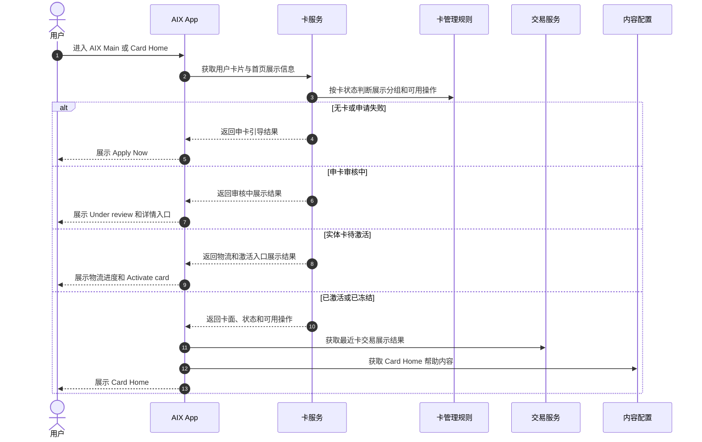
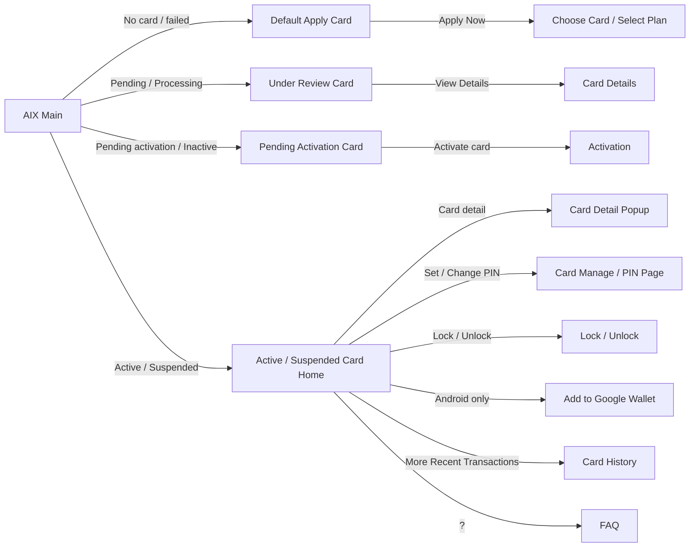

# Card Home 卡首页

> Source alignment note: 本文件已按 converted-prd 做双向覆盖校验，并发现 Home PRD 与 Card Application PRD 对部分首页卡片点击跳转存在冲突。本文件状态暂标 `conflict`；在产品确认前，不得把冲突项写成唯一事实。

## 1. 文档信息

| 项目 | 内容 |
|---|---|
| 功能名称 | Card Home 卡首页 |
| 所属模块 | Card |
| Owner | 吴忆锋 |
| 版本 | 1.3 |
| 状态 | Review |
| 更新时间 | 2026-05-04 |
| 来源文档 | AIX Card Application、AIX APP Home、AIX APP Transaction & History、AIX Card Manage、Standard PRD Template v1.3 |

---

## 2. 需求背景、目标与范围

### 2.1 需求背景

Card Home 是已申卡用户查看卡片、卡状态、卡操作入口、Recent Transactions、实体卡物流和 FAQ 的主页面，也是 Activation、Card Manage / PIN、Card Manage / Sensitive Info、Card Manage、Card Transaction Detail 的入口承接页。

### 2.2 用户问题 / 业务问题

Card Home 聚合多类卡状态和多种操作。如果状态归一、操作权限、敏感信息边界、交易展示和物流字段不统一，用户会看到错误入口或错误卡片状态。

### 2.3 需求目标

明确 Card Home 的展示组、入口规则、页面跳转、字段依赖、异常处理、操作权限约束和待确认事项。所有状态和操作限制均引用 `manage/_index.md`。

### 2.4 涉及功能清单

| 功能点 | 本期范围 | 优先级 | 状态 | 说明 |
|---|---|---|---|---|
| 默认申卡卡片 | In Scope | P0 | Open | 无卡或申请失败时展示；文案 `AlX` 拼写待确认 |
| 审核中卡片 | In Scope | P0 | Confirmed | Pending / Processing 展示 Under review |
| 待激活实体卡 | In Scope | P0 | Confirmed | 展示物流、Tracking、Activate card |
| 已激活 / 已冻结卡 | In Scope | P0 | Confirmed | 展示卡面、操作入口、Recent Transactions、FAQ |
| 操作入口 | In Scope | P0 | Confirmed | 受 Manage 6.4 操作矩阵约束 |
| Recent Transactions | In Scope | P1 | Open | 首页展示最近 3 条；查询细节待确认 |
| FAQ | In Scope | P2 | Open | Home 来源本次未验证 |
| Google Wallet | Deferred | P1 | Open | 方案待定 |

---

## 3. 业务流程与规则

### 3.1 业务主流程说明

用户进入 AIX Main 或 Card Home 后，系统查询用户卡片列表、卡状态、卡基本信息和相关展示字段。若无卡或申请失败，展示默认申卡卡片；若审核中，展示 Under review；若待激活实体卡，展示物流和激活入口；若 Active / Suspended，展示卡片详情入口、操作入口、Recent Transactions 和 FAQ。

来源边界：`AIX APP V1.0【Home】.pdf` 与 `AIX APP V1.0【Transaction & History】.pdf` 未随本次附件完整提供，相关 Home 专属规则保留为历史来源引用；若与 Application / Manage / DTC API 冲突，以已验证事实和 `manage/_index.md` 为准。

### 3.2 业务时序图

### 3.3 流程步骤与业务规则

| 步骤 | 场景 / 规则 | 触发条件 | 责任方 | 系统处理 | 成功结果 | 失败 / 分支结果 | 来源 |
|---|---|---|---|---|---|---|---|
| 1 | 查询卡列表 | 进入 Home | App / Card | 查询卡片记录和状态 | 进入展示组 | 状态无法归一进入待确认 | Application / Home |
| 2 | 无卡展示 | 无开卡成功或在途记录 | App | 展示默认申卡卡片 | 可进入申卡 | 申卡入口受 Application 限制 | Home / Application |
| 3 | 审核中展示 | Pending / Processing | App | 展示 Under review | 可 View Details | 详情目标页待确认 | Application / Home |
| 4 | 待激活展示 | Pending activation / Inactive | App | 展示物流、地址、Activate card | 可进入激活 | Tracking 缺失展示 Preparing | Home / Application |
| 5 | 已激活 / 冻结展示 | Active / Suspended | App | 展示卡面和操作入口 | 可进行允许操作 | 操作受 Manage 6.4 约束 | Manage / 6.4 |
| 6 | 最近交易 | Active / Suspended 卡进入首页 | App / Txn | 查询最近交易 | 展示最近 3 条 | 无数据展示空态 | Application / Transaction |
| 7 | FAQ | 用户点击 ? 或首页展示 FAQ | App / FAQ | 查询 FAQ 配置 | 展示问题列表 | FAQ 配置缺失待确认 | Application / Home |

### 3.4 状态规则

| 状态 | 含义 | 触发条件 | 用户可见表现 | 系统处理 | 可迁移到 | 是否终态 | 来源 |
|---|---|---|---|---|---|---|---|
| 无卡 / 申请失败 | 未申请或申请失败 | 无有效卡或失败记录 | 默认申卡卡片 | 引导申卡 | Pending / Active | 否 | Home / Application |
| Pending / Processing | 审核中 | 申卡处理中 | Under review | 禁止重复申请 | Active / Pending activation / Cancelled | 否 | Application |
| Pending activation / Inactive | 待激活实体卡 | 实体卡未激活 | 物流进度 + Activate card | 允许激活 | Active | 否 | Application / Home |
| Active / ACTIVE | 已激活 | 卡可用 | 卡面、Card detail、PIN、Lock、交易 | 允许操作矩阵中操作 | Suspended / Cancelled | 否 | Manage / 6.4 |
| Suspended / SUSPENDED | 已冻结 | Freeze 成功 | 展示冻结状态、Unlock | 交易不可用 | Active / Cancelled | 否 | Manage / 6.4 |
| BLOCKED | 阻断 | 风控或外部状态 | 仅部分卡信息 | 禁止敏感信息和交易 | 待确认 | 否 | Manage / 6.4 |

### 3.5 业务级异常与失败处理

| 异常场景 | 触发条件 | 错误来源 | 错误码 / 原因 | 用户表现 | 系统处理 | 是否可重试 | 最终状态 |
|---|---|---|---|---|---|---|---|
| 状态无法归一 | 返回未知 cardStatus | Backend | 未知状态 | 不展示高风险入口 | 记录待确认 | 否 | 待确认 |
| Tracking no 为空 | 待激活实体卡无物流单号 | DTC / Logistics | 无 Tracking | 不展示 Carrier / Tracking no，进度 Preparing | 等待物流通知 | 是 | 待激活 |
| 交易无数据 | Recent Transactions 无数据 | Transaction | 空数据 | 展示占位符 | 不影响 Home | 是 | 当前状态 |
| 交易查询失败 | 交易接口失败 | Transaction | 接口失败 | 处理方式待确认 | 不影响卡主信息 | 是 | 当前状态 |
| Google Wallet 方案待定 | Android 显示入口 | Product gap | 方案未定 | 入口或跳转待确认 | 不作为最终能力 | 否 | 待确认 |
| 操作不允许 | 状态矩阵不允许 | Backend | 状态限制 | 隐藏、禁用或拦截 | 不调用操作接口 | 否 | 原状态 |

---

## 4. 页面与交互说明

### 4.1 页面关系总览图

### 4.2 Default Apply Card

| 区块 | 内容 |
|---|---|
| 页面类型 | 状态卡片 |
| 页面目标 | 引导无卡或申请失败用户申卡 |
| 入口 / 触发 | 用户无开卡成功或在途记录 |
| 展示内容 | `Apply for a AlX card`、`Start your spending brand new journey today!`、`Just 2 steps needed` |
| 用户动作 | 点击 Apply Now |
| 系统处理 / 责任方 | 跳转 Choose Card / Select Plan |
| 元素 / 状态 / 提示规则 | `AlX` 疑似 AIX 品牌拼写，待确认 |
| 成功流转 | Application Select Plan |
| 失败 / 异常流转 | 申卡入口限制由 Application 承接 |
| 备注 / 边界 | 申请失败通知接口缺失，后续迭代 |

### 4.3 Pending / Under Review Card

| 区块 | 内容 |
|---|---|
| 页面类型 | 状态卡片 |
| 页面目标 | 告知用户申卡审核中 |
| 入口 / 触发 | cardStatus 为 Pending / Processing |
| 展示内容 | `Your card application is in process. We will notify you when there is a status update.` |
| 用户动作 | 点击 View Details |
| 系统处理 / 责任方 | 跳转 Card Details / 申卡详情页 |
| 元素 / 状态 / 提示规则 | 展示 Card Order Number，可复制 |
| 成功流转 | Application Details |
| 失败 / 异常流转 | View Details 目标页细节待确认 |
| 备注 / 边界 | 审核中卡会限制再次申卡 |

### 4.4 Pending Activation Physical Card

| 区块 | 内容 |
|---|---|
| 页面类型 | 状态卡片 |
| 页面目标 | 展示实体卡物流并引导激活 |
| 入口 / 触发 | 实体卡开卡成功但未激活 |
| 展示内容 | 卡面、Type、Progress bar、Tracking no、Carrier、Mailing address、Activate card |
| 用户动作 | 点击 Activate card，复制 Tracking no |
| 系统处理 / 责任方 | 跳转 Activation；物流进度按 Tracking no 映射 |
| 元素 / 状态 / 提示规则 | Tracking no 为空时 Preparing；有值时 Shipping；Active 时 Delivered |
| 成功流转 | Activation Page |
| 失败 / 异常流转 | Tracking 缺失时不展示 Carrier / Tracking no |
| 备注 / 边界 | DTC 不支持直接查看卡邮寄地址时按状态和物流单映射 |

### 4.5 Active / Suspended Card Home

| 区块 | 内容 |
|---|---|
| 页面类型 | 主页面 |
| 页面目标 | 展示已激活 / 已冻结卡的卡面、字段、操作和交易 |
| 入口 / 触发 | cardStatus 为 Active / Suspended |
| 展示内容 | 顶部标题 Card、FAQ、卡面、Type、Lock Tag、Auto Debit Tag、Holder name、Brand、截断卡号、操作入口、Recent Transactions |
| 用户动作 | Card detail、Set / Change PIN、Lock / Unlock、Add to Google Wallet、More transactions、FAQ |
| 系统处理 / 责任方 | 按 Manage 6.4 操作矩阵展示入口 |
| 元素 / 状态 / 提示规则 | Card Home 不展示完整 PAN / CVC / EXP；Card Manage / Sensitive Info 由认证后 popup 承接 |
| 成功流转 | 对应功能页 |
| 失败 / 异常流转 | 不允许操作隐藏 / 禁用 / 拦截，具体方式待确认 |
| 备注 / 边界 | Google Wallet 方案待定 |

### 4.6 Recent Transactions

| 区块 | 内容 |
|---|---|
| 页面类型 | 列表区块 |
| 页面目标 | 展示最近卡交易 |
| 入口 / 触发 | Active / Suspended Card Home 展示 |
| 展示内容 | 最近 3 条 Merchant name、Crypto & Amount、Status、Created Date、Indicator |
| 用户动作 | 点击 More 进入 Card History |
| 系统处理 / 责任方 | 调用 `/openapi/v1/card/inquiry-card-transaction` |
| 元素 / 状态 / 提示规则 | 无数据时展示占位符；有数据按交易时间降序 |
| 成功流转 | Card History |
| 失败 / 异常流转 | 查询失败处理待确认 |
| 备注 / 边界 | Home 只展示，不作为交易状态机事实源；交易展示边界见 `card/transaction-detail.md`；交易资金回退见 `card/transaction.md` |

---

## 5. 字段、接口与数据

| 类型 | 名称 | 所属系统 | 来源 | 用途 | 规则 / 输入输出 | 异常处理 |
|---|---|---|---|---|---|---|
| 字段 | cardStatus | Card | `card/manage/status-and-operations.md` | 决定展示组 | 引用状态事实源 | 未知状态进入待确认 |
| 字段 | cardType | Card / DTC | Application | 展示 Virtual / Physical | Type Tag | 查询失败不展示 |
| 字段 | cardFace | AIX | Application | 展示用户选择卡面 | 可配置 | 缺失时默认图待确认 |
| 字段 | autoDebitEnabled | AIX / DTC | Application | 展示 Auto Debit Tag | 枚举冲突待确认 | 不写死 |
| 字段 | trackingNo | DTC / Logistics | Application / Home | 展示物流单号 | 有值展示并可复制 | 空则 Preparing |
| 字段 | cardOrderNumber | AIX / DTC | Application | 展示申请单号 | 可复制 | 缺失待确认 |
| 接口 | Card Transaction Inquiry | DTC | Application / Transaction | 查询 Recent Transactions | `/openapi/v1/card/inquiry-card-transaction` | 查询失败处理待确认 |
| 接口 | FAQ Config | AIX | Application / Home | 查询 FAQ | 按场景和类型筛选 | 缺失不影响主卡展示 |

---

## 6. 通知规则（如适用）

| 触发事件 | 通知渠道 | 通知对象 | 文案 / 模板 | 跳转目标 | 失败 / 补发规则 |
|---|---|---|---|---|---|
| 申请状态更新 | Push / In-app | 申卡用户 | Notification 模块维护 | Card Home / Application Details | 本文不定义 |
| 物流更新 | Push / In-app / DTC 通知 | 实体卡用户 | Notification 模块维护 | Card Home | 待确认 |
| 卡交易成功 / 退款成功 | Push / In-app | 持卡用户 | Notification 模块维护 | Card Transaction Details | 本文不定义 |

---

## 7. 权限 / 合规 / 风控（如适用）

| 类型 | 规则 | 影响 | 来源 |
|---|---|---|---|
| 状态权限 | 所有操作入口受 Manage 6.4 矩阵约束 | 防止错误操作 | Manage / 6.4 |
| 隐私 | Home 只展示截断卡号，不展示完整 PAN / CVC / EXP | 防止敏感信息泄露 | Manage / 7.1 |
| 敏感信息 | Card detail 需走 Card Manage / Sensitive Info 认证流程 | 防止未认证查看敏感信息 | Manage / 7.1 |
| 交易状态 | Home 的交易状态仅用于展示，不作为状态机事实源 | 防止交易状态被 Home 覆盖 | Card Transaction Detail |
| Google Wallet | 方案待定，不作为最终绑卡能力事实 | 防止提前承诺能力 | Application / gaps |

---

## 8. 待确认事项

| 问题 | 影响范围 | 当前处理 | 是否阻塞验收 | 建议确认人 |
|---|---|---|---|---|
| 默认申卡文案 `Apply for a AlX card` 是否为 AIX 拼写错误 | 文案 / UI | 不阻塞 | 否 | PM / Design |
| 不允许操作在首页应隐藏、禁用还是点击拦截 | FE / Design / QA | 不阻塞 | 否 | PM / Design |
| Recent Transactions 首页查询是 page size=3 还是后端返回后前端截取 | FE / BE / QA | 不阻塞 | 否 | BE / QA |
| Recent Transactions 查询失败时隐藏模块、展示空态还是 Toast | FE / QA | 不阻塞 | 否 | PM / QA |
| Google Wallet 绑卡方案是否已确定 | Home / DTC / Wallet | 不阻塞 / Deferred | 否 | PM / BE |
| Home、Transaction & History 历史来源是否为最新版本 | PM / QA | 不阻塞 / Deferred | 否 | PM |

---

## 9. 验收标准 / 测试场景

### 9.1 验收标准

| 验收场景 | 验收标准 |
|---|---|
| 正常流程 | 不同卡状态进入 Home 后展示对应卡片和操作入口 |
| 异常流程 | Tracking 缺失、无交易、状态未知、操作不允许均有处理 |
| 页面展示 | Home 不展示完整敏感信息，Recent Transactions 展示最近 3 条 |
| 系统交互 | 状态和操作均引用 `card/manage/status-and-operations.md`，不重复定义状态 |
| 通知 | Home 只定义通知入口边界，模板由 Notification 维护 |
| 数据 / 埋点 | cardStatus、trackingNo、cardOrderNumber、Recent Transactions 可追踪 |

### 9.2 测试场景矩阵

| 场景 | 前置条件 | 用户操作 | 预期页面表现 | 预期系统结果 | 是否必测 |
|---|---|---|---|---|---|
| 无卡用户 | 无有效卡 | 进入 Home | 展示默认申卡卡片 | 可跳 Select Plan | 是 |
| 审核中卡 | Pending / Processing | 进入 Home | 展示 Under review | 可 View Details | 是 |
| 待激活实体卡 | Pending activation | 进入 Home | 展示物流与 Activate card | 可进入 Activation | 是 |
| ACTIVE 卡 | ACTIVE | 进入 Home | 展示 Card detail、PIN、Lock、交易 | 操作入口按矩阵展示 | 是 |
| SUSPENDED 卡 | SUSPENDED | 进入 Home | 展示 Unlock，不允许交易 | 操作入口按矩阵展示 | 是 |
| 无交易 | Active 卡无交易 | 查看 Recent Transactions | 展示空态 | 不影响其他模块 | 是 |
| Tracking no 空 | 待激活卡无 Tracking | 查看物流 | 进度 Preparing，不展示 Carrier | 不报错 | 是 |

---

## Source alignment additions

### A. 首页卡片展示与已确认规则

| 项目 | 结论 | 来源 |
|---|---|---|
| 展示卡片范围 | 对于有开卡成功或在途的用户，页面展示所有已激活、已冻结、待激活、审核中的卡片 | Application / 6.2；Home / 6.1 |
| 无卡 / 申请失败 | 展示默认申卡卡片或申卡入口 | Application / 6.2；Home / 6.1 |
| 多张卡排序 | 按申请时间降序展示所有卡片 | Application / 6.2；Home / 6.1 |
| 卡数 < 5 | 最右侧显示申卡入口 `+` | Application / 6.2；Home / 6.1 |
| 卡数 = 5 | 屏蔽申卡入口 `+` | Application / 6.2；Home / 6.1 |
| 审核中 / 待激活卡 | 卡片区域需要局部静默刷新以获取最新状态 | Home / 6.1 |

### B. Card Home 页面规则

| 场景 | 规则 |
|---|---|
| Active / Suspended 卡 | 显示 Card detail、Lock / Unlock、Recent Transactions、FAQ 等入口 |
| Google Wallet | 是否开启入口可配置；开启时，卡状态为 Active 且当前申请设备为 Android 才显示 `Add to Google Wallet`；点击后先统一跳转 FAQ 页面 |
| 实体卡 PIN | 仅实体卡有；Active 且未设置 PIN 显示 `Set PIN`，Active 且已设置 PIN 显示 `Change PIN` |
| Pending activation 实体卡 | DTC 当前不支持查看卡邮寄地址，按卡状态和物流单映射 Preparing / Shipping / Delivered |
| Card Order Number | 申请单号可复制，复制后提示 `The information has been copied.` |

### C. Conflict register

| 冲突点 | Home PRD | Card Application PRD | 当前处理 |
|---|---|---|---|
| Processing / 审核中点击 | 跳转当前卡片（审核中）页面 `My Card` | 跳转当前卡片首页 `Card（审核中）` | CONFLICT，待产品确认 |
| Pending activation / 待激活点击 | 跳转当前卡片（待激活）页面 `My Card` | 跳转激活卡页面 `Activate Card` | CONFLICT，待产品确认 |
| Active 未设置 PIN 点击 | 跳转当前卡片首页 `My Card` | 跳转设置 PIN 页面 `Set PIN` | CONFLICT，待产品确认 |
| Frozen / 已冻结点击 | 跳转当前卡片首页 `Card` | 跳转触发解冻卡的身份认证页面 | CONFLICT，待产品确认 |

### D. Runtime usage rule for conflicts

在冲突确认前，AI 或知识库使用者回答相关跳转问题时，必须说明来源冲突，不得只引用其中一份 PRD 作为最终规则。

## 10. 来源引用

- (Ref: archive/historical-prd/card/AIX Card V1.0【Application】.docx / 5.2 / 6.2 / V1.0)
- (Ref: archive/historical-prd/app/AIX APP V1.0【Home】.docx / 6.1 / V1.0，未随本次附件完整提供)
- (Ref: archive/historical-prd/app/AIX APP V1.0【Transaction & History】 (1).docx / 卡交易列表与详情，未随本次附件完整提供)
- (Ref: archive/historical-prd/card/AIX Card 【manage】模块需求V1.0 .docx / 6.4 / 7.1 / V1.0)
- (Ref: knowledge-base/card/manage/_index.md)
- (Ref: knowledge-base/card/transaction-detail.md)
- (Ref: prd-template/standard-prd-template.md / v1.3)
