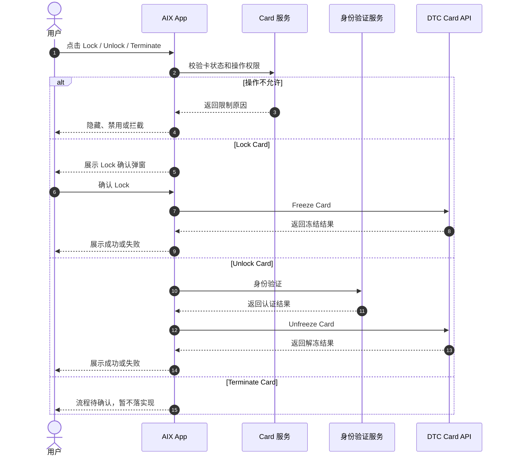
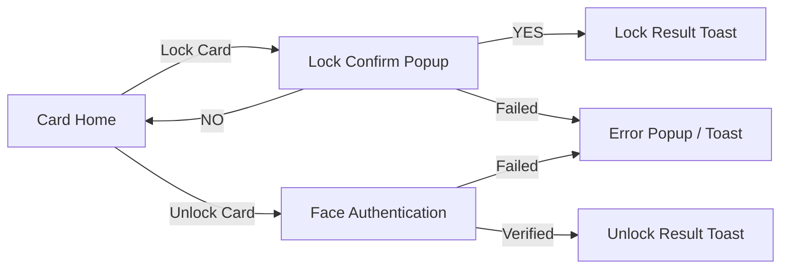

# Card Management 卡管理

## 1. 文档信息

| 项目 | 内容 |
|---|---|
| 功能名称 | Card Management 卡管理 |
| 所属模块 | Card |
| Owner | 吴忆锋 |
| 版本 | 1.3 |
| 状态 | Review |
| 更新时间 | 2026-05-04 |
| 来源文档 | AIX Card Manage、DTC Card Issuing API、Standard PRD Template v1.3 |

---

## 2. 需求背景、目标与范围

### 2.1 需求背景

用户需要对已激活或已冻结的卡进行 Lock、Unlock 或注销等管理操作。卡管理操作直接影响交易能力和卡安全，必须受卡状态限制和身份验证控制。

### 2.2 用户问题 / 业务问题

如果 Lock / Unlock 状态限制、确认流程、身份验证、DTC 接口和注销卡能力边界不明确，可能出现错误冻结、错误解冻、状态显示不一致或注销能力无法落地。

### 2.3 需求目标

定义 Lock Card、Unlock Card 和 Terminate Card 能力边界，明确允许状态、页面流程、接口依赖、异常处理、待确认事项和验收标准。

### 2.4 涉及功能清单

| 功能点 | 本期范围 | 优先级 | 状态 | 说明 |
|---|---|---|---|---|
| Lock Card | In Scope | P0 | Confirmed | ACTIVE 卡允许 Lock |
| Unlock Card | In Scope | P0 | Confirmed | SUSPENDED 卡允许 Unlock |
| Terminate Card / 注销卡 | In Scope | P0 | Open | Manage 6.4 允许 ACTIVE / SUSPENDED 注销，AIX 页面流程缺失 |
| 状态限制 | In Scope | P0 | Confirmed | 引用 Manage 6.4 操作矩阵 |
| Face Authentication | In Scope | P0 | Confirmed | Unlock 前需身份验证 |
| Virtual / Physical 文案 | Deferred | P1 | Open | 成功文案写 physical card，是否适用于虚拟卡待确认 |

---

## 3. 业务流程与规则

### 3.1 业务主流程说明

用户从 Card Home 点击 Lock 或 Unlock。系统按卡状态判断是否允许操作。Lock 适用于 ACTIVE 卡，用户确认后调用 Freeze Card；Unlock 适用于 SUSPENDED 卡，用户通过身份验证后调用 Unfreeze Card。注销卡在 Manage 6.4 中显示 ACTIVE / SUSPENDED 可用，且 DTC API 存在 Terminate Card，但 AIX 页面流程未提供，因此只记录能力边界和待确认项。

### 3.2 业务时序图

### 3.3 流程步骤与业务规则

| 步骤 | 场景 / 规则 | 触发条件 | 责任方 | 系统处理 | 成功结果 | 失败 / 分支结果 | 来源 |
|---|---|---|---|---|---|---|---|
| 1 | 判断操作权限 | 用户点击管理操作 | App / Card | 引用 Manage 6.4 | 允许进入对应流程 | 不允许则隐藏 / 禁用 / 拦截 | Manage / 6.4 |
| 2 | Lock 确认 | ACTIVE 卡点击 Lock | App | 展示确认弹窗 | 用户确认后调用 Freeze | 用户取消则关闭弹窗 | Manage / 7.4 |
| 3 | Freeze Card | 用户确认 Lock | App / DTC | 调用 Freeze Card | 卡进入 SUSPENDED | 失败保持 ACTIVE | Manage / 8.1 |
| 4 | Unlock 认证 | SUSPENDED 卡点击 Unlock | App / Security | 发起身份验证 | 认证通过调用 Unfreeze | 认证失败按 Security 规则 | Manage / 7.5 |
| 5 | Unfreeze Card | Unlock 认证通过 | App / DTC | 调用 Unfreeze Card | 卡恢复 Active | 失败保持 SUSPENDED | Manage / 8.1 |
| 6 | Terminate Card | ACTIVE / SUSPENDED 理论可注销 | App / DTC | DTC 有 Terminate Card 能力 | 暂不落页面流程 | 进入待确认 | Manage / 6.4 / DTC |

### 3.4 状态规则

| 状态 | 含义 | 触发条件 | 用户可见表现 | 系统处理 | 可迁移到 | 是否终态 | 来源 |
|---|---|---|---|---|---|---|---|
| ACTIVE | 可用卡 | 卡已激活 | 可 Lock、可注销、可交易 | 允许 Freeze Card | SUSPENDED / CANCELLED | 否 | Manage / 6.4 |
| SUSPENDED | 已冻结卡 | Freeze 成功 | 可 Unlock、可注销，不可交易 | 允许 Unfreeze Card | Active / CANCELLED | 否 | Manage / 6.4 |
| CANCELLED | 已取消 | 注销或取消 | 不可操作 | 终态 | 不适用 | 是 | Manage / 6.4 |
| BLOCKED | 阻断 | 风控或外部阻断 | 不允许 Lock / Unlock / 注销 | 仅可查看卡信息 | 待确认 | 否 | Manage / 6.4 |
| Activate | 疑似 Active | Unfreeze 成功原文 | 不作为独立枚举 | 需归一确认 | Active | 否 | Manage / 7.5 |

### 3.5 业务级异常与失败处理

| 异常场景 | 触发条件 | 错误来源 | 错误码 / 原因 | 用户表现 | 系统处理 | 是否可重试 | 最终状态 |
|---|---|---|---|---|---|---|---|
| 状态不允许 | 非允许状态点击操作 | Backend | 状态限制 | 隐藏 / 禁用 / 拦截 | 不调用接口 | 否 | 原状态 |
| Lock 用户取消 | Lock 弹窗点击 NO | User | 取消 | 关闭弹窗 | 不调用接口 | 是 | ACTIVE |
| Freeze 失败 | Freeze Card 失败 | DTC / Network | 接口失败 | Freeze failed 或全局异常 | 保持 ACTIVE | 是 | ACTIVE |
| Unlock 认证失败 | Face Authentication 失败 | Security | 认证失败 | 按 Security 规则 | 不调用 Unfreeze | 是 / 视规则 | SUSPENDED |
| Unfreeze 失败 | Unfreeze Card 失败 | DTC / Network | 接口失败 | Unfreeze failed 或全局异常 | 保持 SUSPENDED | 是 | SUSPENDED |
| 注销流程缺失 | 用户需要注销卡 | 产品缺口 | 流程未定义 | 暂不展示或不实现 | 进入待确认 | 否 | 原状态 |

---

## 4. 页面与交互说明

### 4.1 页面关系总览图

### 4.2 Lock / Unlock / Terminate 页面说明

| 区块 | 内容 |
|---|---|
| 页面类型 | Popup / 身份验证 / 待确认流程 |
| 页面目标 | 锁卡、解锁或注销卡 |
| 入口 / 触发 | Card Home 点击 Lock / Unlock / Terminate |
| 展示内容 | Lock 确认弹窗；Unlock 身份验证；Terminate 流程待确认 |
| 用户动作 | YES / NO、完成 Face Authentication |
| 系统处理 / 责任方 | Lock 调用 Freeze；Unlock 认证后调用 Unfreeze；Terminate 暂不落实现 |
| 元素 / 状态 / 提示规则 | Lock 成功 Toast：`Your physical card has been locked.`；Unlock 成功 Toast：`Your physical card has been unlocked.`；Virtual 文案待确认 |
| 成功流转 | 返回 Card Home 并刷新状态 |
| 失败 / 异常流转 | Freeze / Unfreeze failed 或全局异常 |
| 备注 / 边界 | 原文 `Activate` 不作为独立状态实现 |

---

## 5. 字段、接口与数据

| 类型 | 名称 | 所属系统 | 来源 | 用途 | 规则 / 输入输出 | 异常处理 |
|---|---|---|---|---|---|---|
| 字段 | cardStatus | AIX / DTC | Status & Fields | 判断操作权限 | ACTIVE 可 Lock / 注销；SUSPENDED 可 Unlock / 注销 | 状态不允许则不调用接口 |
| 接口 | Freeze Card | DTC | Manage / DTC | 锁卡 / 冻结 | `POST /openapi/v1/card/freeze` | 失败保持 ACTIVE |
| 接口 | Unfreeze Card | DTC | Manage / DTC | 解锁 / 解冻 | `POST /openapi/v1/card/unfreeze` | 失败保持 SUSPENDED |
| 接口 | Terminate Card | DTC | DTC Card Issuing API | 注销卡 | AIX 页面流程待确认 | 不直接实现 |
| 数据 | 操作限制矩阵 | Card | Manage / 6.4 | 控制入口展示 | 引用 Status & Fields | 不允许则隐藏 / 禁用 / 拦截 |

---

## 6. 通知规则（如适用）

当前事实文件未定义 Lock / Unlock / Terminate 的用户通知。

| 触发事件 | 通知渠道 | 通知对象 | 文案 / 模板 | 跳转目标 | 失败 / 补发规则 |
|---|---|---|---|---|---|
| Lock 成功 | 不适用 | 持卡用户 | 页面 Toast，不是通知 | Card Home | 不适用 |
| Unlock 成功 | 不适用 | 持卡用户 | 页面 Toast，不是通知 | Card Home | 不适用 |
| Terminate 成功 | 待确认 | 持卡用户 | 待确认 | 待确认 | 待确认 |

---

## 7. 权限 / 合规 / 风控（如适用）

| 类型 | 规则 | 影响 | 来源 |
|---|---|---|---|
| 状态权限 | ACTIVE 可 Lock；SUSPENDED 可 Unlock；ACTIVE / SUSPENDED 可注销 | 防止错误状态操作 | Manage / 6.4 |
| 身份验证 | Unlock 需身份验证 | 防止非本人解冻卡 | Manage / 7.5 |
| 风控 | BLOCKED 不允许 Lock / Unlock / 注销 | 防止风控卡被恢复使用 | Manage / 6.4 |
| 交易安全 | SUSPENDED 不允许交易 | 防止冻结卡继续消费 | Manage / 6.4 |

---

## 8. 待确认事项

| 问题 | 影响范围 | 当前处理 | 是否阻塞验收 | 建议确认人 |
|---|---|---|---|---|
| 注销卡 / Terminate Card 的 AIX 入口、确认弹窗、认证方式、请求字段、成功失败文案、注销后状态 | Management / DTC | 阻塞 | 是 | PM / Design / BE |
| Lock / Unlock 是否支持 Virtual Card；若支持，文案为何写 physical card | Home / Management | 不阻塞 / Deferred | 否 | PM / Design |
| Unlock 成功后原文 `Activate` 是否应归一为 `Active` | Status / Home / Management | 不阻塞 | 否 | PM / BE |
| 状态不允许操作时统一隐藏、禁用还是点击拦截 | FE / QA / Design | 不阻塞 | 否 | PM / Design |
| Lock / Unlock 网络异常和后端异常是否统一使用全局 Popup | FE / QA | 不阻塞 | 否 | PM / QA |

---

## 9. 验收标准 / 测试场景

### 9.1 验收标准

| 验收场景 | 验收标准 |
|---|---|
| 正常流程 | ACTIVE 可 Lock，SUSPENDED 可 Unlock |
| 异常流程 | 状态不允许、接口失败、认证失败均保持原状态 |
| 页面展示 | Lock 有确认弹窗；Unlock 有身份验证和 Loading |
| 系统交互 | Freeze / Unfreeze 接口成功后状态刷新 |
| 通知 | Lock / Unlock 仅页面 Toast，不定义通知 |
| 数据 / 埋点 | 操作前后 cardStatus 可追踪 |

### 9.2 测试场景矩阵

| 场景 | 前置条件 | 用户操作 | 预期页面表现 | 预期系统结果 | 是否必测 |
|---|---|---|---|---|---|
| ACTIVE Lock | ACTIVE 卡 | 点击 Lock 并 YES | Toast locked | Freeze 成功，状态 SUSPENDED | 是 |
| Lock 取消 | ACTIVE 卡 | 点击 Lock 并 NO | 弹窗关闭 | 不调用 Freeze | 是 |
| SUSPENDED Unlock | SUSPENDED 卡 | 点击 Unlock 并认证通过 | Toast unlocked | Unfreeze 成功，状态 Active | 是 |
| Unlock 认证失败 | SUSPENDED 卡 | 认证失败 | 按 Security 提示 | 不调用 Unfreeze | 是 |
| PENDING 操作 | PENDING 卡 | 尝试 Lock / Unlock | 不展示或禁用 | 不调用接口 | 是 |
| Terminate 入口 | ACTIVE / SUSPENDED | 查看注销卡 | 流程待确认，不落实现 | 不调用 Terminate | 是 |

---

## 10. 来源引用

- (Ref: 历史prd/AIX Card manage模块需求V1.0.docx / 6.4 / 6.5 / 7.4 / 7.5 / 8.1 / V1.0)
- (Ref: DTC Card Issuing API Document_20260310 (1).pdf / Freeze Card / Unfreeze Card / Terminate Card)
- (Ref: knowledge-base/card/card-status-and-fields.md)
- (Ref: knowledge-base/security/face-authentication.md)
- (Ref: prd-template/standard-prd-template.md / v1.3)
