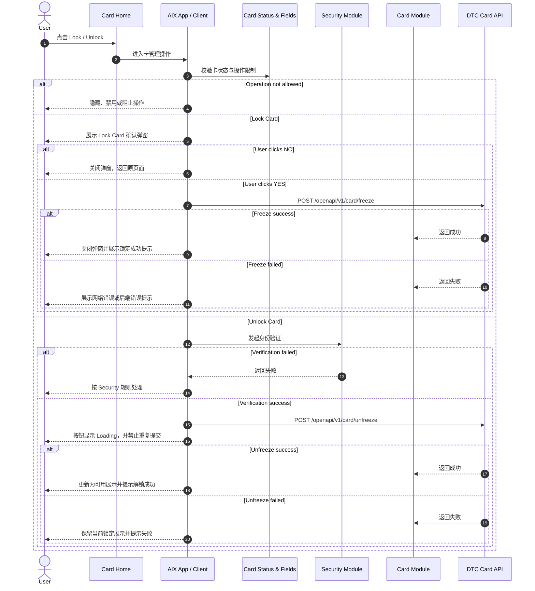
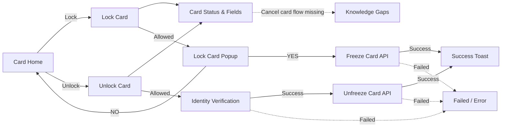

# Card Management 卡管理

## 0. 文档信息

| 项 | 内容 |
|---|---|
| 文档类型 | Card Management 标准 PRD / 知识库事实文件 |
| 当前版本 | 1.1 |
| 文档状态 | active |
| 目标读者 | Product、Design、FE、BE、QA、Risk、Compliance |
| 本次修订 | 收拢评审意见：补齐 Manage 6.4 Lock / Unlock / 注销卡状态限制、将注销卡改为“能力存在但产品流程缺失”、标记 DTC `Terminate Card`、明确虚拟卡支持与文案待确认、增加验收标准 |
| 维护原则 | 本文只处理卡管理操作；状态和操作限制引用 `card-status-and-fields.md`，交易流程不在本文展开 |

## 1. 功能定位

Card Management 用于沉淀 Card Home 中卡管理操作的业务规则，当前已确认范围包括 Lock Card、Unlock Card，以及操作限制表中出现但缺少独立流程的注销卡能力。

本文只写卡管理操作流程、状态边界、接口依赖与失败处理。卡状态引用 `card-status-and-fields.md`，交易关联流程不在本文展开。

## 2. 适用范围

| 维度 | 规则 | 来源 | 备注 |
|---|---|---|---|
| Lock Card | Card Home 点击 Lock Card 后二次确认并调用 Freeze Card | Manage / 7.4；Manage / 8.1 | 已有明确页面逻辑 |
| Unlock Card | 通过身份验证后自动提交 Unfreeze Card | Manage / 7.5；Manage / 8.1 | 已有明确页面逻辑 |
| 注销卡 | Manage 6.4 明确 ACTIVE / SUSPENDED 允许注销卡；DTC API 目录存在 `Terminate Card` | Manage / 6.4；DTC Card Issuing API | 能力存在但 AIX 页面流程、认证方式、确认弹窗和文案缺失，记录为产品流程缺口 |
| 状态来源 | 引用 `card-status-and-fields.md` | Card Status & Fields | 不重新定义卡状态 |
| 认证来源 | Unlock 提到指纹、面部识别或设备密码 | Manage / 7.5 | 认证机制引用 Security 模块 |

## 3. 前置条件

| 条件 | 说明 | 来源 |
|---|---|---|
| 用户已持有卡 | 从 Card Home 的卡片操作区进入 | Card Home / 6.6 |
| 卡状态允许对应操作 | Lock / Unlock / 注销卡受 Manage 6.4 操作矩阵限制：`ACTIVE` 可 Lock 与注销卡；`SUSPENDED` 可 Unlock 与注销卡 | Manage / 6.4；Card Status & Fields |
| Lock 需二次确认 | ACTIVE 卡用户点击 Lock Card 后弹出确认弹窗 | Manage / 6.4 / 7.4 |
| Unlock 需身份验证 | 用户通过身份验证后系统自动提交解锁请求 | Manage / 7.5 |
| Freeze / Unfreeze 接口可用 | 调用 DTC 卡冻结 / 解冻接口 | Manage / 8.1 |

## 4. 业务流程

### 4.1 主链路

```text
Card Home → Card Management Entry → Status Check → Lock / Unlock Flow → DTC Freeze / Unfreeze → Result Handling
```

### 4.2 业务流程与系统交互时序图



### 4.3 业务逻辑矩阵

| 阶段 | 触发条件 | 系统动作 | 成功结果 | 失败 / 拦截结果 |
|---|---|---|---|---|
| 入口判断 | 用户点击 Lock / Unlock | 校验卡状态与操作限制 | 进入对应流程 | 状态不允许则隐藏、禁用或阻止 |
| Lock 二次确认 | 用户点击 Lock Card | 展示 Lock Card Popup | 用户确认或取消 | 取消则不执行接口 |
| Lock 提交 | 用户点击 YES | 调用 Freeze Card | 关闭弹窗并提示锁定成功 | 网络异常或后端错误提示 |
| Unlock 验证 | 用户点击 Unlock | 发起身份验证 | 通过后进入提交 | 失败按 Security 处理 |
| Unlock 提交 | 身份验证通过 | 调用 Unfreeze Card；按钮 Loading，禁止重复提交 | 更新为可用展示并提示解锁成功 | 保留当前锁定展示，允许重试 |
| 注销卡 | `ACTIVE` / `SUSPENDED` 状态下操作限制表允许注销卡 | DTC 存在 Terminate Card 能力，但 AIX 独立页面流程未提供 | 能力边界已记录 | 不补页面流程、认证、文案；进入待确认 |

## 5. 页面关系总览



## 6. 页面卡片与交互规则

### 6.0 Card Management 操作状态限制

| 状态 / 展示组 | Lock Card | Unlock Card | 注销卡 | 处理规则 | 来源 |
|---|---|---|---|---|---|
| ACTIVE / Active | 是 | 否 | 是 | 允许 Lock；注销流程待补；Unlock 不展示 | Manage / 6.4 |
| SUSPENDED / Suspended | 否 | 是 | 是 | 允许 Unlock；注销流程待补；Lock 不展示 | Manage / 6.4 |
| 待激活 | 否 | 否 | 否 | 不展示卡管理操作 | Manage / 6.4 |
| CANCELLED / Cancelled | 否 | 否 | 否 | 不展示卡管理操作 | Manage / 6.4 |
| BLOCKED | 否 | 否 | 否 | 仅可查看脱敏信息，不允许卡管理操作 | Manage / 6.4 |
| PENDING / Pending / Processing | 否 | 否 | 否 | 不展示卡管理操作 | Manage / 6.4 |

### 6.1 Lock Card Popup

| 元素 / 行为 | 规则 | 来源 |
|---|---|---|
| 触发条件 | 用户在 Card Home Page 点击 Lock Card | Manage / 7.4 |
| 目的 | 二次确认锁定操作，防止误触 | Manage / 7.4 |
| 标题 | `Do you want to lock card **** 9282?` | Manage / 7.4 |
| 文案 | `Once locked, this card cannot be used to make payments. You can unlock the card anytime in the app later.` | Manage / 7.4 |
| NO | 关闭弹窗，返回原页面，不执行任何操作 | Manage / 7.4 |
| YES | 触发锁定流程，调用 Freeze Card 接口 | Manage / 7.4 |
| 成功提示 | `Your physical card has been locked.` | Manage / 7.4 |
| 卡类型文案待确认 | Card Home 同时给 Virtual / Physical 提供 Lock 入口，但 Manage 成功文案写 physical card | Application / 5.2；Manage / 7.4 |

### 6.2 Lock Card 失败处理

| 场景 | 规则 | 来源 |
|---|---|---|
| 超时 / 无网络 | 提示 `No internet connection, please check the connection or try again later.` | Manage / 7.4 |
| 其他后端错误 | Toast 提示后端返回错误文案；提示：`Freeze failed` | Manage / 7.4 |

### 6.3 Unlock Card

| 元素 / 行为 | 规则 | 来源 |
|---|---|---|
| 触发条件 | 用户点击 Unlock Card | Manage / 7.5；Card Home / 6.6 |
| 身份验证 | 用户通过指纹、面部识别或设备密码后提交 | Manage / 7.5 |
| 提交机制 | 自动发起卡片解锁请求 | Manage / 7.5 |
| 接口 | 调用 Unfreeze Card 接口 | Manage / 7.5 / 8.1 |
| 提交中 | 按钮显示 `Loading...`，禁止重复提交 | Manage / 7.5 |
| 成功提示 | `Your physical card has been unlocked.` | Manage / 7.5 |
| 卡类型文案待确认 | Card Home 同时给 Virtual / Physical 提供 Unlock 入口，但 Manage 成功文案写 physical card | Application / 5.2；Manage / 7.5 |
| 成功状态 | 原文写状态更新为 `Activate`，当前按缺口处理，不直接改写为 `Active` | Manage / 7.5；Card Status & Fields |

### 6.4 Unlock Card 失败处理

| 场景 | 规则 | 来源 |
|---|---|---|
| 网络异常或请求失败 | 弹出 `Sorry, we cannot unlock your card at this time. Please try again later.` | Manage / 7.5 |
| 失败后状态 | 保留当前 Locked 状态，允许用户重试 | Manage / 7.5 |
| 其他后端错误 | Toast 提示后端返回错误文案；提示：`Unfreeze failed` | Manage / 7.5 |

### 6.5 注销卡

| 项 | 当前处理 | 来源 |
|---|---|---|
| 是否出现 | 操作限制表中出现“注销卡”列 | Manage / 6.4 |
| 是否有独立流程 | 原文未提供独立流程章节 | Manage / 6.4 |
| 当前处理 | 能力已存在但产品流程缺失：不补确认弹窗、认证、成功失败文案等未确认细节；接口能力记录为 DTC `Terminate Card` 待接入 | Knowledge Gaps；DTC Card Issuing API |

## 7. 字段与接口依赖

| 字段 / 接口 / 能力 | 用途 | 来源 | 备注 |
|---|---|---|---|
| `cardStatus` | 判断 Lock / Unlock / 注销卡是否可用 | Manage / 6.4；Card Status & Fields | `ACTIVE` 可 Lock / 注销卡；`SUSPENDED` 可 Unlock / 注销卡 |
| `Freeze Card` | 临时锁定卡片，防止交易 | Manage / 8.1 | `POST /openapi/v1/card/freeze` |
| `Unfreeze Card` | 解除卡片冻结状态，恢复使用 | Manage / 8.1 | `POST /openapi/v1/card/unfreeze` |
| `Terminate Card` | 注销卡 | DTC Card Issuing API；Manage / 6.4 | AIX 页面流程待确认，不得直接落实现 |
| `Terminate Card` | 注销卡接口能力 | DTC Card Issuing API | AIX 页面流程和接入字段待确认，不能直接上线 |
| `Identity Verification` | Unlock 前身份验证 | Manage / 7.5；Security | 具体规则引用 Security |
| `Card Home Operation Entry` | Lock / Unlock 入口 | Application / 5.2；Home / 6.1 | Home 只提供入口 |

## 8. 异常与失败处理

| 场景 | 触发条件 | 用户提示 / 系统动作 | 最终状态 | 来源 |
|---|---|---|---|---|
| 状态不允许操作 | 卡状态不支持 Lock / Unlock / 注销卡 | 隐藏、禁用或阻止 | 留在原页面 | Manage / 6.4；Card Status & Fields |
| Lock 用户取消 | 用户点击 NO | 关闭弹窗，不执行接口 | 原状态不变 | Manage / 7.4 |
| Lock 网络异常 | Freeze 请求超时或无网络 | 展示网络异常提示 | 原状态待确认 | Manage / 7.4 |
| Lock 后端失败 | Freeze 后端返回错误 | Toast 后端错误文案或 `Freeze failed` | 原状态待确认 | Manage / 7.4 |
| Unlock 认证失败 | 身份验证失败 | 按 Security 规则处理 | 保留当前状态 | Manage / 7.5；Security |
| Unlock 请求失败 | Unfreeze 网络异常或请求失败 | 弹出失败提示，允许重试 | 保留 Locked 状态 | Manage / 7.5 |
| Unlock 后端失败 | Unfreeze 后端返回错误 | Toast 后端错误文案或 `Unfreeze failed` | 保留当前状态 | Manage / 7.5 |
| 注销卡缺流程 | Manage 6.4 允许 ACTIVE / SUSPENDED 注销卡，DTC 存在 Terminate Card 能力，但 AIX 无独立流程章节 | 不展示或不接入正文流程，进入产品流程缺口 | 待确认 | Manage / 6.4；DTC Card Issuing API |

## 9. 风控 / 合规边界

| 边界 | 规则 | 影响 | 来源 |
|---|---|---|---|
| 二次确认 | Lock Card 需二次确认 | 防止误触锁卡 | Manage / 7.4 |
| 交易限制 | 卡锁定后不能用于支付 | 降低被盗刷风险 | Manage / 7.4 |
| 身份验证 | Unlock 前需身份验证 | 防止非本人解锁 | Manage / 7.5 |
| 重复提交控制 | Unlock 提交中按钮 Loading 并禁止重复提交 | 防止重复请求 | Manage / 7.5 |
| 状态来源单一 | 状态判断引用 `card-status-and-fields.md` | 防止状态重复定义 | IMPLEMENTATION_PLAN.md / v2.7 |
| 交易边界 | 本文不处理交易关联流程 | 防止资金流程混入卡管理 | IMPLEMENTATION_PLAN.md / v2.7 |

## 10. 待确认事项

| 编号 | 问题 | 影响 | 优先级 |
|---|---|---|---|
| CARD-MGMT-Q001 | 注销卡的页面入口、确认弹窗、认证方式、成功 / 失败文案和状态回写 | 注销卡上线 | P0 |
| CARD-MGMT-Q002 | DTC `Terminate Card` 请求字段、错误码、是否需要 MFA / 认证 | DTC 接入 | P0 |
| CARD-MGMT-Q003 | Lock / Unlock 是否支持 Virtual Card？若支持，成功文案为什么写 physical card？ | Home、Management、文案 | P1 |
| CARD-MGMT-Q004 | Unlock 成功后 Manage 原文状态 `Activate` 是否等同 `Active` | 状态归一 | P1 |
| CARD-MGMT-Q005 | Freeze / Unfreeze 网络异常、Server Error 是否统一复用 Manage 6.5 全局 Popup | 异常体验 | P1 |

## 11. 验收标准 / 测试场景

| 场景 | 验收标准 |
|---|---|
| 状态限制 | ACTIVE 可 Lock 和注销，不可 Unlock；SUSPENDED 可 Unlock 和注销，不可 Lock；其他状态不展示卡管理操作 |
| Lock 二次确认 | 点击 Lock 展示确认弹窗；NO 关闭且不调接口；YES 调用 Freeze Card |
| Lock 成功 / 失败 | 成功关闭弹窗并展示 locked 提示；网络 / 后端失败按规则提示且不错误改状态 |
| Unlock 认证 | 点击 Unlock 后先进行身份验证；失败按 Security 规则处理 |
| Unlock 提交 | 验证通过后自动调用 Unfreeze Card，按钮 Loading 且禁止重复提交 |
| Unlock 成功 / 失败 | 成功展示 unlocked 提示并恢复可用展示；失败保留锁定展示，允许重试 |
| 注销卡 | 在流程未确认前，不得仅凭 DTC Terminate Card 接口上线；必须先补齐产品流程 |
| 状态回写 | `Activate` 不得作为新状态直接实现，需按待确认处理 |

## 12. 来源引用

- (Ref: 历史prd/AIX Card manage模块需求V1.0.docx / 6.4 卡片状态与操作限制对照表 / V1.0)
- (Ref: 历史prd/AIX Card manage模块需求V1.0.docx / 7.4 Lock Card / V1.0)
- (Ref: 历史prd/AIX Card manage模块需求V1.0.docx / 7.5 Unlock Card / V1.0)
- (Ref: 历史prd/AIX Card manage模块需求V1.0.docx / 8.1 外部接口清单 / V1.0)
- (Ref: 历史prd/AIX Card V1.0【Application】.pdf / 5.2 卡片首页 / V1.0)
- (Ref: 历史prd/AIX APP V1.0【Home】.pdf / 6.1 APP主页 / V1.0)
- (Ref: knowledge-base/card/card-status-and-fields.md)
- (Ref: knowledge-base/card/card-home.md)
- (Ref: knowledge-base/security/biometric-verification.md)
- (Ref: knowledge-base/security/face-authentication.md)
