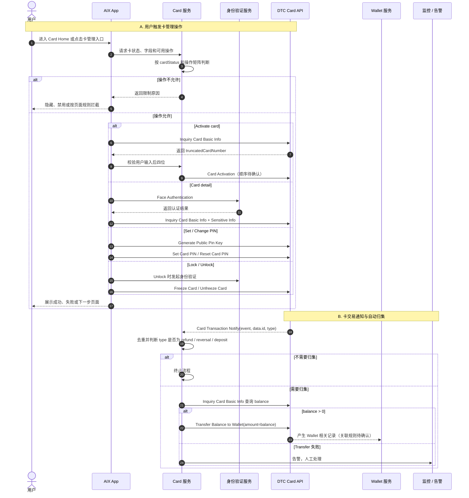
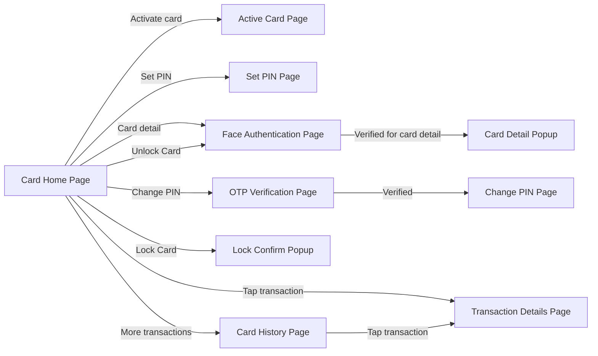

# Card Management 卡管理

## 1. 文档信息

| 项目 | 内容 |
|---|---|
| 功能名称 | Card Management 卡管理 |
| 所属模块 | Card |
| Owner | 吴忆锋 |
| 版本 | 2.1 |
| 状态 | Review |
| 更新时间 | 2026-05-05 |
| 来源文档 | AIX Card Manage、AIX Card Application、AIX Card Transaction、Transaction & History、DTC Card Issuing API、DTC Wallet OpenAPI、Standard PRD Template v1.3 |

---

## 2. 需求背景、目标与范围

### 2.1 需求背景

Card 模块在用户完成申卡、实体卡寄送和卡片激活后，需要支持卡片管理、敏感信息查看、PIN 设置与修改、锁卡 / 解锁、卡状态展示、卡交易通知和卡余额归集等能力。

这些能力原本被拆分在多个历史 PRD 和知识库文件中。为了保持运行态知识库简洁，Card 目录只保留 `application.md`、`card-home.md` 和 `card-management.md` 三个业务事实文件；激活、PIN、敏感信息、状态矩阵、卡交易通知和自动归集统一沉淀在本文。

### 2.2 用户问题 / 业务问题

如果 Card 管理能力没有统一事实源，容易出现以下问题：

1. 卡状态、操作入口和操作限制不一致。
2. 实体卡激活、PIN 设置、敏感信息查看、Lock / Unlock 等流程被分散维护。
3. DTC 接口路径、字段、状态和 AIX 展示口径冲突。
4. 卡交易通知、自动归集、Wallet 对账和交易展示边界不清。
5. 后续 AI 或 PM 写需求时误把旧文件、旧状态或未确认项当成当前事实。

### 2.3 需求目标

本文目标是为 Card Management 提供一个符合标准 PRD 模板的运行态事实源，明确：

1. 卡状态清单与操作限制矩阵。
2. 实体卡激活流程和后四位校验规则。
3. PIN 设置、Change PIN、Reset PIN 的入口、接口和安全要求。
4. Card detail 与敏感信息查看规则。
5. Lock / Unlock / Terminate 的状态限制和接口边界。
6. Card Transaction Notify、自动归集和 Card 交易展示边界。
7. 与 Transaction、Wallet、Security、Notification、KYC 的模块边界。

### 2.4 涉及功能清单

| 功能点 | 本期范围 | 优先级 | 状态 | 说明 |
|---|---|---|---|---|
| 卡状态清单 | In Scope | P0 | Confirmed | 统一 Application / Home / Manage 中出现的卡状态 |
| 操作限制矩阵 | In Scope | P0 | Confirmed | 引用 Manage 6.4 状态与操作限制 |
| 实体卡激活 | In Scope | P0 | Open | 后四位校验已确认；激活、认证、Set PIN 顺序待确认 |
| PIN 设置 / 修改 / 重置 | In Scope | P0 | Open | Set / Reset 接口和 `encryptedPin` 已确认；公钥和失败规则待确认 |
| 敏感信息查看 | In Scope | P0 | Confirmed | ACTIVE 卡认证后查看 PAN / EXP / CVV / CVC |
| Lock Card | In Scope | P0 | Confirmed | ACTIVE 卡允许 Lock，调用 Freeze Card |
| Unlock Card | In Scope | P0 | Confirmed | SUSPENDED 卡允许 Unlock，需身份验证后调用 Unfreeze Card |
| Terminate Card | In Scope | P0 | Open | DTC 有能力；AIX 页面流程待确认，当前不直接落实现 |
| Card Transaction Notify | In Scope | P0 | Open | DTC 通知、去重、目标类型判断和原始报文落库待确认 |
| Transfer Balance to Wallet | In Scope | P0 | Open | refund / reversal / deposit 且 balance > 0 时归集；对账字段待确认 |
| Card Home Recent Transactions | In Scope | P1 | Confirmed | 首页展示最近 3 条，具体页面在 `card-home.md` |
| Card History / Details | In Scope | P1 | Open | 交易历史和详情主事实在 Transaction 模块 |

---

## 3. 业务流程与规则

### 3.1 业务主流程说明

Card Management 以卡状态为前置判断。用户进入 Card Home 后，系统根据 `cardStatus` 和相关业务字段决定展示哪些管理入口：Activate card、Card detail、Set PIN、Change PIN、Lock Card、Unlock Card、Terminate Card 或交易入口。

当用户触发管理操作时，AIX 先按状态矩阵校验是否允许操作；允许后进入对应流程，并在需要时调用 Security 认证能力和 DTC Card API。涉及卡交易通知时，DTC 向 AIX 推送交易事件，AIX 判断是否需要自动归集卡余额到 Wallet，并把交易展示、状态模型和对账交由 Transaction 模块承接。

### 3.2 业务时序图

### 3.3 流程步骤与业务规则

| 步骤 | 场景 / 规则 | 触发条件 | 责任方 | 系统处理 | 成功结果 | 失败 / 分支结果 | 来源 |
|---|---|---|---|---|---|---|---|
| 1 | 查询卡状态和操作权限 | 用户进入 Card Home 或触发卡操作 | App / Card | 获取 `cardStatus`，按操作矩阵归一 | 返回可展示入口 | 未知状态进入待确认 | Application / Manage |
| 2 | 实体卡激活入口 | 待激活实体卡点击 Activate card | App / Card / DTC | 输入后四位后调用 Inquiry Card Basic Info，读取 `truncatedCardNumber` 比对 | 比对通过后进入激活 / 认证 / PIN 流程 | 比对失败展示错误，接口失败展示异常 | Manage 7.2 / DTC |
| 3 | Card detail / 敏感信息查看 | ACTIVE 卡点击 Card detail | App / Security / DTC | 先 Face Authentication，再查询 Basic Info 和 Sensitive Info | 展示完整卡信息 Popup | 认证失败或查询失败不展示敏感信息 | Manage 7.1 / DTC |
| 4 | Set PIN | ACTIVE 实体卡且未设置 PIN | App / DTC | Generate Public Pin Key 后提交 `encryptedPin` | PIN 设置成功 | 失败保持未设置 | Manage 7.3 / DTC |
| 5 | Change PIN / Reset PIN | ACTIVE 实体卡且已设置 PIN | App / Security / DTC | 先 OTP For Reset PIN，再 Generate Public Pin Key，最后 Reset Card PIN | PIN 修改成功 | OTP 或接口失败保持原状态 | Manage 7.3 / DTC |
| 6 | Lock Card | ACTIVE 卡点击 Lock | App / Card / DTC | 展示确认弹窗，用户确认后调用 Freeze Card | 卡进入 SUSPENDED | 取消则不调用；失败保持 ACTIVE | Manage 7.4 / DTC |
| 7 | Unlock Card | SUSPENDED 卡点击 Unlock | App / Security / DTC | Face Authentication 通过后调用 Unfreeze Card | 卡恢复 Active | 认证失败或接口失败保持 SUSPENDED | Manage 7.5 / DTC |
| 8 | Terminate Card | ACTIVE / SUSPENDED 理论可注销 | App / DTC | DTC 存在 Terminate Card 能力 | 暂不落页面实现 | AIX 页面流程待确认 | Manage 6.4 / DTC |
| 9 | Card Transaction Notify | DTC 推送卡交易通知 | DTC / Card | 按 `event + data.id` 去重，判断 type | 命中目标类型后进入余额查询 | 非目标类型终止 | DTC / 用户确认 |
| 10 | 自动归集 | 通知类型为 refund / reversal / deposit 且 balance > 0 | Card / DTC / Wallet | 查询 balance 后调用 Transfer Balance to Wallet，amount=balance | 归集成功 | 失败不自动重试，告警人工处理 | Card Transaction / DTC Wallet |
| 11 | 交易展示 | 用户查看 Recent Transactions / History / Details | App / Card / Transaction | Card Home 展示最近 3 条；历史和详情由 Transaction 模块承接 | 展示交易记录 | 无数据或查询失败按 Transaction 规则 | Transaction & History |

### 3.4 状态规则

| 状态 | 含义 | 触发条件 | 用户可见表现 | 系统处理 | 可迁移到 | 是否终态 | 来源 |
|---|---|---|---|---|---|---|---|
| `Pending` / `Processing` | 申卡审核中 | 申卡提交后待处理 | Under review | 禁止重复申请，不允许卡管理操作 | Active / Pending activation / Cancelled | 否 | Application |
| `Pending activation` / `Inactive` | 实体卡待激活 | 实体卡审核通过但未激活 | 展示物流与 Activate card | 仅允许激活 | Active | 否 | Application / Home / Manage |
| `Active` / `ACTIVE` | 已激活 / 可用 | 虚拟卡生效或实体卡激活 | 展示卡面和可用操作 | 允许敏感信息、PIN、Lock、交易、注销 | Suspended / Cancelled | 否 | Manage 6.4 |
| `Suspended` / `SUSPENDED` | 已冻结 | Freeze Card 成功 | 展示已冻结 | 允许 Unlock 和注销，不允许交易 | Active / Cancelled | 否 | Manage 6.4 |
| `BLOCKED` | 阻断状态 | 外部或风控状态 | 仅允许查看卡信息 | 禁止敏感信息和交易 | 待确认 | 否 | Manage 6.4 |
| `CANCELLED` | 取消 / 终止 | 申请失败或卡取消 | 不允许操作 | 终态 | 不适用 | 是 | Manage 6.4 |
| `Terminated` | 终止 | Application 中审核失败 / 终止 | 不明确 | 与 Cancelled / BLOCKED 关系待确认 | 不适用 | 待确认 | Application |
| `Activate` | 疑似 Active 拼写 | Unlock 成功原文写法 | 不作为独立状态 | 待确认是否拼写问题 | Active | 否 | Manage 7.5 |

#### Manage 6.4 状态与操作限制矩阵

| 卡状态 | 查看卡信息 | 查看敏感信息 | 卡激活 | Set PIN | Change PIN | Lock Card | Unlock Card | 注销卡 | 交易功能 |
|---|---|---|---|---|---|---|---|---|---|
| 待激活 | 否 | 否 | 是 | 否 | 否 | 否 | 否 | 否 | 否 |
| `ACTIVE` | 是 | 是 | 否 | 是，仅限首次 | 是 | 是 | 否 | 是 | 是 |
| `SUSPENDED` | 否 | 否 | 否 | 否 | 否 | 否 | 是 | 是 | 否 |
| `CANCELLED` | 否 | 否 | 否 | 否 | 否 | 否 | 否 | 否 | 否 |
| `BLOCKED` | 是 | 否 | 否 | 否 | 否 | 否 | 否 | 否 | 否 |
| `PENDING` | 否 | 否 | 否 | 否 | 否 | 否 | 否 | 否 | 否 |

### 3.5 业务级异常与失败处理

| 异常场景 | 触发条件 | 错误来源 | 错误码 / 原因 | 用户表现 | 系统处理 | 是否可重试 | 最终状态 |
|---|---|---|---|---|---|---|---|
| 未知卡状态 | DTC / 后端返回未收录状态 | External / Backend | 状态缺失 | 不展示高风险操作 | 记录待确认，不默认放行 | 否 | 待确认 |
| 状态不允许操作 | 状态矩阵不允许当前动作 | Backend / Card | 权限限制 | 隐藏、禁用或拦截操作 | 不调用 DTC 接口 | 否 | 原状态 |
| 后四位校验失败 | 用户输入与 `truncatedCardNumber` 不一致 | App / DTC | 校验失败 | `The last 4 digits entered are invalid` | 停留 Active Card Page | 是 | 待激活 |
| Basic Info 查询失败 | 查询卡基础信息失败 | DTC / Network | 接口失败 | `Failed to get card info. Please try again later` 或全局错误 | 不展示依赖字段 | 是 | 原状态 |
| Sensitive Info 查询失败 | 查询 PAN / EXP / CVV 失败 | DTC / Network | 接口失败 | 不展示敏感信息 | 不渲染敏感字段 | 是 | 原状态 |
| Face Authentication 失败 | 查看敏感信息或 Unlock 前认证失败 | Security | 认证失败 | 按 Security 规则提示 | 不继续后续操作 | 视规则 | 原状态 |
| Public Pin Key 获取失败 | 进入 PIN 提交流程失败 | DTC / Network | 接口失败 | 展示失败提示 | 不允许提交 PIN | 是 | 原状态 |
| Set / Reset PIN 失败 | DTC 返回失败 | DTC | 接口失败 | 展示失败承接 | 保持原 PIN 状态 | 是 | 原状态 |
| Freeze Card 失败 | Lock 调用失败 | DTC / Network | 接口失败 | Freeze failed 或全局异常 | 保持 ACTIVE | 是 | ACTIVE |
| Unfreeze Card 失败 | Unlock 调用失败 | DTC / Network | 接口失败 | Unfreeze failed 或全局异常 | 保持 SUSPENDED | 是 | SUSPENDED |
| 重复交易通知 | DTC 重复推送相同事件 | DTC | event + data.id 相同 | 用户不可见 | 不重复归集 | 否 | 已忽略 |
| 非目标交易类型 | type 非 refund / reversal / deposit | DTC | type 不匹配 | 用户不可见 | 终止，不归集 | 否 | 不归集 |
| Transfer Balance to Wallet 失败 | 自动归集失败 | DTC / Wallet | 接口失败 | 用户可能不可见资金 | 告警，不自动重试，人工处理 | 人工 | 待人工处理 |
| Wallet 未到账 | DTC transfer 成功但 Wallet 记录不可见 | Wallet / DTC | 对账缺失 | 用户可能反馈 | 当前自动发现和关联规则待确认 | 待确认 | 待人工处理 |

---

## 4. 页面与交互说明

### 4.1 页面关系总览图

### 4.2 Active Card Page

| 区块 | 内容 |
|---|---|
| 页面类型 | 主页面 / 表单页面 |
| 页面目标 | 通过实体卡后四位校验用户持有实体卡 |
| 入口 / 触发 | Card Home 点击待激活实体卡的 Activate card |
| 展示内容 | 标题 `Enter last 4 digits`；说明 `Enter the last 4-digit of your physical AIX Card number`；4 位输入框 |
| 用户动作 | 输入实体卡后四位、返回 |
| 系统处理 / 责任方 | 输入满 4 位后调用 Inquiry Card Basic Info，读取 `truncatedCardNumber` 比对 |
| 元素 / 状态 / 提示规则 | 4 位输入完成后触发校验；校验失败提示 `The last 4 digits entered are invalid`；Loading 中禁止重复提交 |
| 成功流转 | 进入身份验证 / Card Activation / Set PIN 后续流程，顺序待确认 |
| 失败 / 异常流转 | Network Error / Server Error，关闭后回本页并清空输入 |
| 备注 / 边界 | 不应只使用本地缓存 `truncatedCardNumber` 比对 |

### 4.3 Card Detail Popup

| 区块 | 内容 |
|---|---|
| 页面类型 | Popup |
| 页面目标 | 展示认证后的完整卡片信息 |
| 入口 / 触发 | Card Home 点击 Card detail 且 Face Authentication 通过 |
| 展示内容 | Card type、Default currency、Name on card、Card number、EXP、CVV / CVC |
| 用户动作 | 查看字段、复制字段、关闭 Popup |
| 系统处理 / 责任方 | AIX 调用 Basic Info 和 Sensitive Info，渲染基础字段和敏感字段 |
| 元素 / 状态 / 提示规则 | Name on card / Card number / EXP / CVV 可复制；复制成功 Toast：`The information has been copied.` |
| 成功流转 | 用户查看或复制信息，关闭后返回 Card Home |
| 失败 / 异常流转 | 查询失败 Toast：`Failed to get card info. Please try again later`；不展示敏感信息 |
| 备注 / 边界 | Home 不展示完整 PAN / CVC / EXP；关闭 Popup 后不得继续展示敏感信息 |

### 4.4 Set / Change PIN Page

| 区块 | 内容 |
|---|---|
| 页面类型 | 主页面 / 表单页面 |
| 页面目标 | 设置或修改实体卡 PIN |
| 入口 / 触发 | ACTIVE 实体卡点击 Set PIN 或 Change PIN |
| 展示内容 | PIN 输入框、提交按钮、必要安全提示；Change PIN 前需 OTP |
| 用户动作 | 输入 4 位 PIN 并提交 |
| 系统处理 / 责任方 | 获取 Public Pin Key，加密后调用 Set Card PIN 或 Reset Card PIN |
| 元素 / 状态 / 提示规则 | 仅 4 位数字可提交；提交中禁止重复提交 |
| 成功流转 | 返回 Card Home，PIN 状态更新 |
| 失败 / 异常流转 | 公钥、OTP、Set / Reset 失败时停留当前流程 |
| 备注 / 边界 | 当前事实未说明是否需要旧 PIN，不得补写 |

### 4.5 Lock Confirm Popup / Unlock Authentication

| 区块 | 内容 |
|---|---|
| 页面类型 | Popup / 身份验证页面 |
| 页面目标 | 锁卡或解锁卡 |
| 入口 / 触发 | Card Home 点击 Lock Card 或 Unlock Card |
| 展示内容 | Lock 确认弹窗；Unlock 身份验证流程 |
| 用户动作 | Lock 点击 YES / NO；Unlock 完成 Face Authentication |
| 系统处理 / 责任方 | Lock 调用 Freeze Card；Unlock 认证后调用 Unfreeze Card |
| 元素 / 状态 / 提示规则 | Lock 成功 Toast：`Your physical card has been locked.`；Unlock 成功 Toast：`Your physical card has been unlocked.` |
| 成功流转 | 返回 Card Home 并刷新状态 |
| 失败 / 异常流转 | Freeze / Unfreeze failed 或全局异常 |
| 备注 / 边界 | 成功文案写 physical card，是否适用于 virtual card 待确认 |

### 4.6 Card Transaction Entry

| 区块 | 内容 |
|---|---|
| 页面类型 | 列表区块 / 列表页面 / 详情页面 |
| 页面目标 | 展示卡交易入口和最近交易 |
| 入口 / 触发 | 用户进入 Card Home、点击 More 或点击单条交易 |
| 展示内容 | Card Home 最近 3 条交易；Card History；Transaction Details |
| 用户动作 | 查看 More、筛选、点击交易详情、复制 Transaction ID |
| 系统处理 / 责任方 | Card Home 查询最近卡交易；历史和详情由 Transaction 模块承接 |
| 元素 / 状态 / 提示规则 | 无数据展示 `No transaction data`；按交易时间降序 |
| 成功流转 | Card History 或 Transaction Details |
| 失败 / 异常流转 | 查询失败页文案待确认 |
| 备注 / 边界 | Card Home 不维护交易状态机；状态映射见 Transaction 模块和 ALL-GAP |

---

## 5. 字段、接口与数据

| 类型 | 名称 | 所属系统 | 来源 | 用途 | 规则 / 输入输出 | 异常处理 |
|---|---|---|---|---|---|---|
| 字段 | `cardStatus` | AIX / DTC | Application / Manage | 判断展示组和操作权限 | 必须引用状态表和操作矩阵 | 未知状态进入待确认 |
| 字段 | `cardHolderName` | DTC | Manage 7.1 | Name on card | Virtual / Physical 均展示 | 查询失败不展示 |
| 字段 | `truncatedCardNumber` | DTC | Manage 7.2 | 激活时校验后四位 | 来自 Inquiry Card Basic Info | 不一致提示错误 |
| 字段 | `autoDebitEnabled` | AIX / DTC | Application / DTC | 自动扣款 | 产品 `2/ON` 与 DTC `1/ON` 冲突，待确认 | 不写成已确认映射 |
| 字段 | `encryptedPin` | DTC | DTC PIN API | 提交加密 PIN | Set / Reset PIN 均使用该字段 | 字段错误会导致接口失败 |
| 字段 | `event` | DTC | Card Transaction Notify | 通知事件类型 | 与 `data.id` 可作为去重候选 | 缺失待确认 |
| 字段 | `data.id` | DTC | Card Transaction Notify | DTC Transaction ID | 与 Wallet ID 关联规则待确认 | 不写死为 Wallet ID |
| 字段 | `type` | DTC | Card Transaction Notify | 判断是否归集 | refund / reversal / deposit 触发候选 | 非目标类型终止 |
| 字段 | `balance` | DTC | Inquiry Card Basic Info | 归集金额依据 | Transfer amount = 查询得到的 balance | 查询失败待确认 |
| 接口 | Inquiry Card Basic Info | DTC | DTC Card API | 卡基础信息、余额、物流、后四位 | 优先 `[POST] /openapi/v1/card/inquiry-card-info` | 查询失败按页面规则处理 |
| 接口 | Inquiry Card Sensitive Info | DTC | DTC Card API | 查询 PAN / EXP / CVC | 优先 `[POST] /openapi/v1/card/inquiry-card-sensitive-info` | 查询失败不展示敏感信息 |
| 接口 | Card Activation | DTC | DTC Card API | 实体卡激活 | `POST /openapi/v1/card/activate`；入参与 autoDebit 关系待确认 | 失败保持待激活 |
| 接口 | Generate Public Pin Key | DTC | DTC PIN API | 获取 PIN 加密公钥 | Set / Reset 前调用 | 失败不可提交 PIN |
| 接口 | Set Card PIN | DTC | DTC PIN API | 首次设置 PIN | 提交 `encryptedPin` | 失败保持未设置 |
| 接口 | OTP For Reset PIN | DTC / Security | DTC PIN API / Security | Change PIN 前认证 | 按 Security OTP 规则 | 失败不继续 |
| 接口 | Reset Card PIN | DTC | DTC PIN API | 修改 / 重置 PIN | 前端显示 Change PIN | 失败保持原 PIN |
| 接口 | Freeze Card | DTC | DTC Card API | Lock Card | `POST /openapi/v1/card/freeze` | 失败保持 ACTIVE |
| 接口 | Unfreeze Card | DTC | DTC Card API | Unlock Card | `POST /openapi/v1/card/unfreeze` | 失败保持 SUSPENDED |
| 接口 | Terminate Card | DTC | DTC Card API | 注销卡 | AIX 页面流程待确认 | 不直接落实现 |
| 接口 | Card Transaction Notify | DTC | DTC Card API | 卡交易通知 | `event + data.id` 可作为去重候选 | 原始报文落库待确认 |
| 接口 | Transfer Balance to Wallet | DTC | DTC Wallet API | 卡余额归集到 Wallet | amount = 查询得到的 balance | 失败告警，不自动重试 |
| Header | `D-REQUEST-ID` | DTC | DTC API 2.4 | 请求唯一标识 | 是否承担幂等语义待确认 | 进入 ALL-GAP |
| Header | `D-SUB-ACCOUNT-ID` | DTC | DTC API 2.4 | DTC 子账户上下文 | 与 WalletAccount.clientId 不得写死等价 | 缺失则接口失败 |

---

## 6. 通知规则（如适用）

| 触发事件 | 通知渠道 | 通知对象 | 文案 / 模板 | 跳转目标 | 失败 / 补发规则 |
|---|---|---|---|---|---|
| Lock 成功 | 不适用 | 持卡用户 | 页面 Toast，不是通知 | Card Home | 不适用 |
| Unlock 成功 | 不适用 | 持卡用户 | 页面 Toast，不是通知 | Card Home | 不适用 |
| PIN 设置 / 重置成功 | 不适用 | 持卡用户 | 当前事实未定义通知 | Card Home | 不适用 |
| 敏感信息查看 | 不适用 | 持卡用户 | 不触发通知 | Card Detail Popup | 不适用 |
| 卡交易成功 | Push / In-app | 持卡用户 | Notification 模块维护 | Card Transaction Details | 本文不定义 |
| 卡退款成功 | Push / In-app | 持卡用户 | Notification 模块维护 | Card Transaction Details | 本文不定义 |
| 自动归集失败 | Monitor / 内部告警 | 内部运营 / 技术 | 告警模板待确认 | 内部处理台 | 不自动重试，人工处理 |
| Terminate 成功 | 待确认 | 持卡用户 | 待确认 | 待确认 | 待确认 |

---

## 7. 权限 / 合规 / 风控（如适用）

| 类型 | 规则 | 影响 | 来源 |
|---|---|---|---|
| 用户权限 | 操作能力受 Manage 6.4 状态矩阵控制 | 防止非法操作 | Manage 6.4 |
| 隐私 | Card Home 只展示脱敏信息，敏感信息需认证 | 防止 PAN / CVC / EXP 泄露 | Manage 7.1 |
| 身份验证 | 查看敏感信息、Unlock、Change PIN 等流程可能需要 Face Authentication 或 OTP | 防止非本人操作 | Manage / Security |
| PIN 安全 | PIN 必须加密后提交，不得在前端持久化明文 | 防止 PIN 泄露 | DTC API / Security |
| 风控 | BLOCKED 状态只允许查看卡信息，不允许交易或敏感信息 | 防止风险卡继续使用 | Manage 6.4 |
| 资金风控 | 仅 refund / reversal / deposit 触发自动归集 | 防止非目标交易误归集 | 用户确认 / Card Transaction |
| 金额来源 | 归集金额只取查询得到的 card balance | 防止按通知金额错误归集 | Card Transaction |
| 失败可观测 | 归集失败必须告警并人工介入 | 防止资金悬挂 | 用户确认 / ALL-GAP |
| 合规边界 | KYC 和钱包开户前置由 KYC / Account / Wallet 承接 | 防止未实名开卡或错误准入 | Application / KYC |

---

## 8. 待确认事项

| 问题 | 影响范围 | 当前处理 | 是否阻塞验收 | 建议确认人 |
|---|---|---|---|---|
| 实体卡激活完整顺序是 Last4 → Face Auth → Activation → Set PIN，还是 Last4 → Set PIN → Activation | Activation / PIN / Security | 阻塞 | 是 | PM / BE / Security |
| 激活成功后 Set PIN 是否强制，用户是否可跳过 | Activation / PIN / Home | 阻塞 | 是 | PM / Design / BE |
| `autoDebitEnabled` 产品 `2/ON` 与 DTC `1/ON` 如何映射 | Application / Activation / Home | 阻塞 | 是 | PM / BE / DTC |
| Public Pin Key 响应字段、加密算法、`encryptedPin` 结构 | PIN / Security / DTC | 阻塞 | 是 | BE / DTC / Security |
| PIN 失败提示文案、尝试次数、锁定规则 | PIN / Security | 不阻塞 / Deferred | 否 | PM / Security |
| Basic Info / Sensitive Info 旧 GET 路径是否废弃 | Home / Sensitive Info | 阻塞 | 是 | BE / DTC |
| `BLOCKED` 状态仅可查看卡信息时具体可见字段 | Status / Sensitive Info | 不阻塞 / Deferred | 否 | PM / BE |
| Terminate Card 的 AIX 入口、确认弹窗、认证方式、请求字段、成功失败文案、注销后状态 | Management / DTC | 阻塞 | 是 | PM / Design / BE |
| `Activate` 是否为 `Active` 拼写问题 | Management / Home | 不阻塞 | 否 | PM / BE |
| Card Transaction Notify 原始报文落库、去重、重放规则 | Transaction / Audit | 阻塞 | 是 | BE / Audit |
| 自动归集失败告警监控群、告警字段、责任分派和人工补偿入口 | Ops / Finance / BE | 阻塞 | 是 | PM / Ops / BE |
| Card `data.id`、`D-REQUEST-ID`、Wallet `transactionId`、Wallet `relatedId` 的最终关联规则 | Reconciliation | 阻塞 | 是 | BE / Finance |
| Card Home / Card History / Details 的交易状态映射是否统一由交易模块收口 | FE / QA / Transaction | 不阻塞 | 否 | PM / BE |

---

## 9. 验收标准 / 测试场景

### 9.1 验收标准

| 验收场景 | 验收标准 |
|---|---|
| 正常流程 | ACTIVE 卡可查看敏感信息、设置 / 修改 PIN、Lock；SUSPENDED 卡可 Unlock；待激活实体卡可进入激活流程 |
| 异常流程 | 非允许状态、认证失败、接口失败、重复通知、非目标交易类型、Transfer 失败均有明确处理，不错误更新状态或资金 |
| 页面展示 | Card Home 入口、Active Card Page、Card Detail Popup、Set / Change PIN、Lock / Unlock、Recent Transactions 入口按状态展示 |
| 系统交互 | Card Basic Info、Sensitive Info、Activation、PIN、Freeze / Unfreeze、Card Transaction Notify、Transfer Balance to Wallet 的边界明确 |
| 通知 | 用户通知由 Notification 模块维护；Lock / Unlock / PIN / Sensitive Info 不单独定义通知；自动归集失败走内部告警 |
| 数据 / 埋点 | `cardStatus`、`truncatedCardNumber`、`encryptedPin`、`event`、`data.id`、`D-REQUEST-ID`、Wallet 关联字段进入可追踪或待确认范围 |

### 9.2 测试场景矩阵

| 场景 | 前置条件 | 用户操作 | 预期页面表现 | 预期系统结果 | 是否必测 |
|---|---|---|---|---|---|
| 待激活实体卡激活 | 实体卡待激活 | 点击 Activate card，输入正确后四位 | 进入下一流程 | Inquiry 返回匹配；后续激活流程执行 | 是 |
| 后四位错误 | 实体卡待激活 | 输入错误后四位 | 显示 `The last 4 digits entered are invalid` | 不调用或不继续激活 | 是 |
| ACTIVE 查看敏感信息 | ACTIVE 卡且认证通过 | 点击 Card detail | 展示完整卡信息 Popup | Basic + Sensitive 查询成功 | 是 |
| 认证失败 | ACTIVE 卡 | Face Auth 失败 | 按 Security 规则提示 | 不查询或不展示敏感信息 | 是 |
| 首次 Set PIN | ACTIVE 且未设置 PIN | 点击 Set PIN，提交 4 位 PIN | 设置成功，小红点消失 | Set Card PIN 成功 | 是 |
| Change PIN | ACTIVE 且已设置 PIN | 点击 Change PIN，通过 OTP，提交新 PIN | 修改成功 | Reset Card PIN 成功 | 是 |
| ACTIVE Lock | ACTIVE 卡 | 点击 Lock 并确认 | 展示 locked Toast | Freeze 成功，状态 SUSPENDED | 是 |
| SUSPENDED Unlock | SUSPENDED 卡 | 点击 Unlock 并认证通过 | 展示 unlocked Toast | Unfreeze 成功，状态 Active | 是 |
| PENDING 卡操作 | PENDING 卡 | 尝试卡管理操作 | 不展示、禁用或拦截入口 | 不调用操作接口 | 是 |
| 目标类型自动归集 | 收到 refund / reversal / deposit，balance > 0 | 无用户操作 | 用户不可见 | 调用 Transfer Balance to Wallet，amount=balance | 是 |
| 非目标类型通知 | 收到非目标 type | 无用户操作 | 用户不可见 | 不归集 | 是 |
| Transfer 失败 | 目标类型且 balance > 0 | 无用户操作 | 用户可能不可见资金 | 告警，不自动重试 | 是 |
| Home 交易展示 | 存在卡交易 | 进入 Card Home | 展示最近 3 条 | 查询交易列表 | 是 |
| History 无数据 | 无交易数据 | 进入 Card History | 展示 `No transaction data` | 不报错 | 是 |

---

## 10. 来源引用

- (Ref: 历史prd/AIX Card 【manage】模块需求V1.0 .docx / 6.4 / 7.1 / 7.2 / 7.3 / 7.4 / 7.5 / 8.1 / V1.0)
- (Ref: 历史prd/AIX Card V1.0【Application】.docx / 2.1 / 2.2 / 3-4 / 5.1 / 5.2 / V1.0)
- (Ref: 历史prd/AIX Card交易【transaction】.docx / 7 / 8.1 / V1.0)
- (Ref: 历史prd/AIX APP V1.0【Transaction & History】 (1).docx / 5.2 / 5.3 / V1.1)
- (Ref: DTC Card Issuing API Document_20260310 / Card Basic Info / Card Sensitive Info / Freeze / Unfreeze / Terminate / PIN APIs / Card Transaction Notify)
- (Ref: DTC Wallet OpenAPI Documentation / Transfer Balance to Wallet / Wallet 关联字段：来源未完整核验)
- (Ref: knowledge-base/card/application.md)
- (Ref: knowledge-base/card/card-home.md)
- (Ref: knowledge-base/transaction/reconciliation.md)
- (Ref: knowledge-base/changelog/knowledge-gaps.md)
- (Ref: prd-template/standard-prd-template.md / v1.3)
