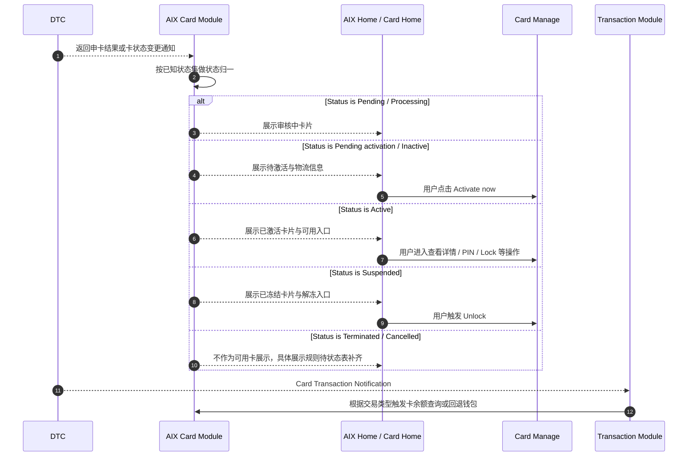
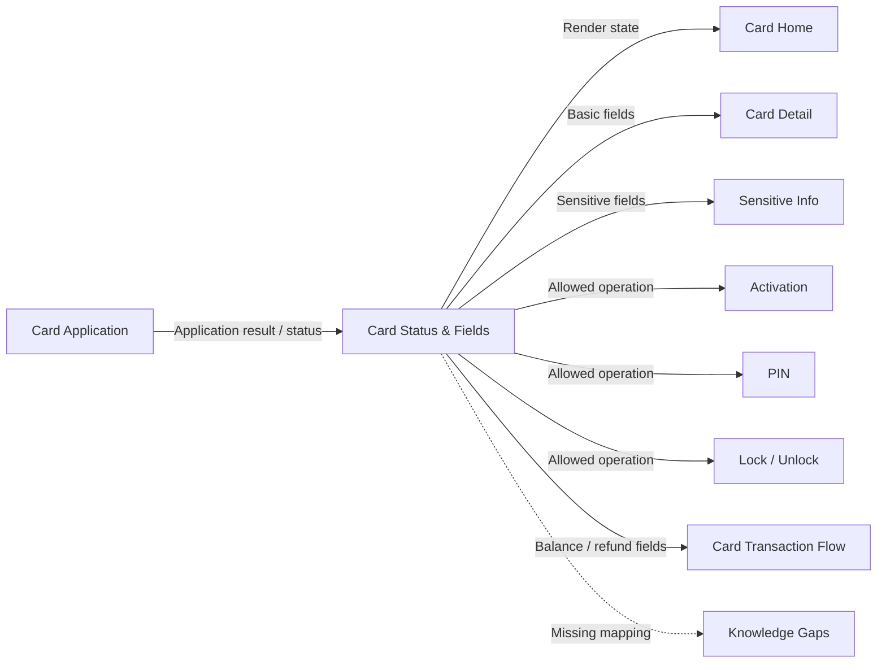

# Card Status & Fields 卡状态与字段

## 0. 文档信息

| 项 | 内容 |
|---|---|
| 文档类型 | Card 状态、字段、接口与操作限制统一事实源 |
| 当前版本 | 1.1 |
| 文档状态 | active |
| 目标读者 | Product、Design、FE、BE、QA、Risk、Compliance |
| 本次修订 | 收拢评审意见：补齐 Manage 6.4 操作限制表、纳入 BLOCKED、修正 `cardHolderName` 展示、标注 autoDebit 枚举冲突、明确 DTC OpenAPI 通用 Header 和接口主路径 |
| 维护原则 | 其他 Card 功能文件必须引用本文件的状态、字段和操作限制；不得在功能文件内重复解释状态机 |

## 1. 功能定位

Card Status & Fields 用于统一 Card Application、Card Home、Card Manage、Card Transaction Flow 会共同引用的卡状态、卡字段、接口路径和操作限制。

本文件沉淀当前可确认的状态、字段、接口路径和操作限制。Manage 6.4 的卡片状态与操作限制对照表已作为本文件的核心事实源纳入；仍无法确认的状态映射、接口冲突和资金字段缺口统一记录为待确认项，不写成已确认事实。

## 2. 适用范围

| 维度 | 规则 | 来源 | 备注 |
|---|---|---|---|
| 国家线 | VN / PH / AU | Manage / 5 国家线；Application / 2.1 | 一期国家线 |
| 卡类型 | Virtual Card / Physical Card | Application / 5.1.4；Manage / 7.1 | 实体卡需单独激活 |
| 卡品牌 | VISA / MASTER | Application / 4.1 | AIX Card 对应 Brand |
| 费用类型 | application fee / delivery fee | Application / 4.4 | 申卡费 / 邮寄费 |
| 自动扣款 | 产品口径 OFF / ON；DTC Card Application 口径 `0 / OFF`、`1 / ON` | Application / 4.5；DTC Card Issuing / Card Application | Application 事实文件曾出现 `2 / ON`，与 DTC API 冲突，见待确认事项 CARD-STATUS-Q001 |
| 敏感认证 | Face Authentication | Security / 7.2；Manage / 7.1-7.3 | 不在本文重复定义认证规则 |

## 3. 前置条件

| 条件 | 说明 | 来源 |
|---|---|---|
| Card Application 已完成 | 申卡后才产生卡状态、卡字段和后续管理入口 | Application / 5.1.4 |
| Card 状态需先归一 | Home、Manage、Transaction 不应各自解释卡状态 | IMPLEMENTATION_PLAN.md / v2.2 |
| 操作限制表已纳入 | Manage 6.4 卡片状态与操作限制对照表已结构化沉淀，作为各功能入口判断依据 | Manage / 6.4 |
| 资金字段不得脑补 | 申卡支付链路缺少完整流水字段闭环 | knowledge-gaps.md / KG-CARD-APP-009 |

## 4. 业务流程

### 4.1 主链路

```text
DTC Card Application / Notification → AIX Card Status Normalization → Card Home Render → Card Manage Operation → Card Transaction / Balance Handling
```

### 4.2 业务流程与系统交互时序图



### 4.3 业务逻辑矩阵

| 阶段 | 触发条件 | 系统动作 | 成功结果 | 缺口 / 风险 |
|---|---|---|---|---|
| 状态接收 | 申卡响应或状态通知 | 接收 DTC 状态 | 进入状态归一 | DTC 原始状态表不可读 |
| 状态归一 | 进入 Card Home / Manage 前 | 将已知状态映射到产品展示组 | 页面可按组渲染 | Pending / Processing、Inactive / Pending activation 存在口径差异 |
| 字段读取 | Card Home / Manage 展示 | 调用 Basic / Sensitive / Delivery 等接口读取字段 | 页面展示对应卡信息 | 部分接口字段表缺失 |
| 操作限制 | 用户触发激活、PIN、Lock、Unlock、注销卡、交易等 | 按 Manage 6.4 状态操作矩阵判断是否允许操作 | 放行、隐藏、禁用或阻止 | 注销卡缺少 AIX 独立页面流程，DTC 存在 Terminate Card 能力，见 CARD-STATUS-Q004 |
| 资金追踪 | 申卡扣费、退款、卡余额回退 | 使用已知字段记录费用与查询依据 | 可记录部分链路 | 申卡扣费流水、退款流水、discount id 缺失 |

## 5. 页面关系总览

本文件不定义独立页面，只作为 Card 模块状态与字段事实源。



## 6. 状态与操作规则

### 6.0 Manage 6.4 操作限制矩阵

| 状态 / 展示组 | 查看卡信息 | 查看敏感信息 | 卡激活 | Set PIN | Change PIN | Lock Card | Unlock Card | 注销卡 | 交易功能 | 处理口径 |
|---|---|---|---|---|---|---|---|---|---|---|
| 待激活 | 否 | 否 | 是 | 否 | 否 | 否 | 否 | 否 | 否 | 仅实体卡待激活流程可用 |
| `ACTIVE` / `Active` | 是 | 是 | 否 | 是，仅限首次 | 是 | 是 | 否 | 是 | 是 | 已激活可用卡 |
| `SUSPENDED` / `Suspended` | 否 | 否 | 否 | 否 | 否 | 否 | 是 | 是 | 否 | 已冻结，仅可解冻或注销 |
| `CANCELLED` / `Cancelled` | 否 | 否 | 否 | 否 | 否 | 否 | 否 | 否 | 否 | 取消 / 失败终态 |
| `BLOCKED` | 是 | 否 | 否 | 否 | 否 | 否 | 否 | 否 | 否 | 可查看脱敏信息，不可敏感查看和操作 |
| `PENDING` / `Pending` / `Processing` | 否 | 否 | 否 | 否 | 否 | 否 | 否 | 否 | 否 | 审核中，不允许卡操作 |

> 说明：该表来自 Manage 6.4，是 Activation、PIN、Sensitive Info、Card Management、Card Home 操作入口的统一判断依据。页面层可在“不允许”时选择隐藏、置灰或拦截，但必须在对应功能文件中明确页面策略。

### 6.1 已确认状态来源清单

| 状态 | 出现来源 | 当前归类 | 已确认用途 | 备注 |
|---|---|---|---|---|
| `Pending` | Home / 6.1；Application / 6.11 | 审核中 | Home 展示审核中卡片；MGM 减免费冻结 | 与 `Processing` 关系待确认 |
| `Processing` | Application / 6.10 | 审核中 | Application Result 展示 Under review | 与 `Pending` 关系待确认 |
| `Pending activation` | Application / 6.10；Home / 6.1 | 待激活 | 审核通过但实体卡未激活；Home 展示物流与激活入口 | 与 `Inactive` 关系待确认 |
| `Inactive` | Home / 6.1 | 待激活 | Home 描述为开卡成功且未激活 | 与 `Pending activation` 关系待确认 |
| `Active` / `ACTIVE` | Application / 6.10；Home / 6.1；Application / 6.11；Manage / 6.4 | 已激活 | 展示已激活卡片；MGM 减免费核销；允许敏感查看、Set PIN、Change PIN、Lock、注销卡、交易 | Manage 解锁成功处写 `Activate`，疑似指 Active |
| `Suspended` | Home / 6.1 | 已冻结 | Home 展示已冻结卡片 | Lock/Unlock 细节见 Card Management |
| `Terminated` | Application / 6.11 | 审核失败 / 终止 | MGM 减免费解冻 | 是否在 Home 展示待确认 |
| `Cancelled` / `CANCELLED` | Application / 6.11；Manage / 6.4 | 审核失败 / 取消 | MGM 减免费解冻；所有卡操作不可用 | 是否在 Home 展示待确认 |
| `BLOCKED` | Manage / 6.4 | 已阻断 / 风控限制 | 仅允许查看卡信息；不允许敏感查看、激活、PIN、Lock、Unlock、注销、交易 | 与 DTC 原始状态、Terminated 的关系待确认 |
| `Activate` | Manage / 7.5 | 疑似 Active | Unfreeze 成功后文案写状态更新为 Activate | 原文疑似状态拼写不统一 |

### 6.2 产品展示分组

| 展示组 | 包含状态 | 页面表现 | 来源 |
|---|---|---|---|
| 未申请 / 申请失败 | 未申请、申请失败 | Home 展示默认申卡卡片 | Home / 6.1 |
| 审核中 | `Pending` / `Processing` | Home 展示审核中卡片；Application Result 展示 Under review | Home / 6.1；Application / 6.10 |
| 待激活 | `Pending activation` / `Inactive` | Home 展示物流进度与 Activate now | Home / 6.1；Application / 6.10 |
| 已激活 | `Active` | Home 展示卡片、Auto Debit、卡详情入口 | Home / 6.1 |
| 已冻结 | `Suspended` | Home 展示冻结卡片；可进入解冻流程 | Home / 6.1；Manage / 7.5 |
| 终止 / 取消 | `Terminated` / `Cancelled` | Application 用于 MGM 解冻；Home 展示规则待确认 | Application / 6.11 |

### 6.3 物流状态映射

| 条件 | 展示进度 | 来源 | 备注 |
|---|---|---|---|
| `Pending activation` 且 `Tracking no` 为空 | `Preparing` | Home / 6.1 | 实体卡待激活 |
| `Pending activation` 且 `Tracking no` 不为空 | `Shipping` | Home / 6.1 | 展示 Tracking no |
| `Active` | `Delivered` | Home / 6.1 | 原文备注实际激活后显示完整卡已激活页面 |

### 6.4 操作限制归纳

#### 6.4.1 Manage 6.4 状态与操作限制矩阵

| 卡状态 | 查看卡信息 | 查看敏感信息 | 卡激活 | Set PIN | Change PIN | Lock Card | Unlock Card | 注销卡 | 交易功能 |
|---|---|---|---|---|---|---|---|---|---|
| 待激活 | 否 | 否 | 是 | 否 | 否 | 否 | 否 | 否 | 否 |
| `ACTIVE` | 是 | 是 | 否 | 是，仅限首次 | 是 | 是 | 否 | 是 | 是 |
| `SUSPENDED` | 否 | 否 | 否 | 否 | 否 | 否 | 是 | 是 | 否 |
| `CANCELLED` | 否 | 否 | 否 | 否 | 否 | 否 | 否 | 否 | 否 |
| `BLOCKED` | 是 | 否 | 否 | 否 | 否 | 否 | 否 | 否 | 否 |
| `PENDING` | 否 | 否 | 否 | 否 | 否 | 否 | 否 | 否 | 否 |

#### 6.4.2 操作能力说明

| 操作 | 已知允许条件 | 系统动作 | 来源 | 备注 |
|---|---|---|---|---|
| Apply Card | 已激活、已冻结、待激活、审核中之和 < 5，且无审核中卡 | 进入 Select Plan | Application / 5.1.4；Home / 6.1 | 达上限或有审核中卡时限制 |
| Activate Card | 实体卡待激活 | 进入 Active Card Page | Home / 6.1；Manage / 7.2 | 具体接口见 Activation 文件 |
| View Card Basic Info | `ACTIVE` / `BLOCKED` | 查询脱敏卡片信息 | Manage / 6.4；Application / 2.2；Manage / 7.1 | Card Home 脱敏展示规则与 Card Detail 查询规则需分层处理 |
| View Sensitive Info | `ACTIVE` 且完成 Face Authentication | 查询 PAN / CVC / expiryDate | Manage / 6.4；Application / 2.2；Manage / 7.1 | Security 规则不在本文重复定义 |
| Set PIN | `ACTIVE` 且首次设置 | 设置 4 位 PIN | Manage / 6.4；Manage / 7.2 / 7.3 | 待激活与 SUSPENDED 不允许 Set PIN |
| Change PIN | `ACTIVE` 且已设置 PIN | 重置 4 位 PIN | Manage / 6.4；Manage / 7.3 | 使用 Reset PIN 接口承接 |
| Lock Card | `ACTIVE` | 调用 Freeze Card | Manage / 6.4；Manage / 7.4 | 成功后 Toast 提示 locked |
| Unlock Card | `SUSPENDED` | 调用 Unfreeze Card | Manage / 6.4；Manage / 7.5 | 成功后状态写为 `Activate`，按疑似 `Active` 处理并记录待确认 |
| Terminate Card / 注销卡 | `ACTIVE` / `SUSPENDED` | DTC 存在 Terminate Card 能力 | Manage / 6.4；DTC Card Issuing API | AIX 页面流程、认证、文案、失败处理未提供，见 CARD-STATUS-Q004 |
| Card Transaction Flow | `ACTIVE` | DTC 交易通知与交易查询 | Manage / 6.4；Card Transaction / 7 | 资金回退见单独文件 |

## 7. 字段与接口依赖

### 7.0 DTC OpenAPI 通用请求要求

| Header / 能力 | 规则 | 来源 | 备注 |
|---|---|---|---|
| `Authorization` | DTC OpenAPI 鉴权 Header | DTC Card Issuing / 2.4 | 具体签名由 integrations/dtc 承接 |
| `D-REQUEST-ID` | 请求唯一标识 Header | DTC Card Issuing / 2.4 | 是否承担幂等语义待确认 |
| `D-TIMESTAMP` | 请求时间戳 Header | DTC Card Issuing / 2.4 | 与签名相关 |
| `D-SIGNATURE` | 请求签名 Header | DTC Card Issuing / 2.4 | 与 DTC 签名规则一致 |
| `D-SUB-ACCOUNT-ID` | 子账户标识 Header | DTC Card Issuing / 2.4 | 适用于 DTC 子账户场景 |
| `Content-Type` | 请求内容类型 | DTC Card Issuing / 2.4 | 通常为 JSON |
| `DTC-MFA-Data` | 可选 MFA 数据 | DTC Card Issuing / 2.4 | 是否用于 Card 场景按接口确认 |

### 7.1 数据字典字段

| 字段 / 枚举 | 值 | 含义 | 来源 |
|---|---|---|---|
| `brand` | `1 / VISA` | Visa | Application / 4.1 |
| `brand` | `2 / MASTER` | MasterCard | Application / 4.1 |
| `feeType` | `1 / application fee` | 申请费 | Application / 4.4 |
| `feeType` | `2 / delivery fee` | 邮寄费 | Application / 4.4 |
| `autoDebitEnabled` | `0 / OFF` | 关闭自动扣款 | Application / 4.5 |
| `autoDebitEnabled` | `2 / ON` | 开启自动扣款（产品字典口径） | Application / 4.5 |
| `autoDebitEnabled` | `1 / ON` | 开启自动扣款（DTC Card Application API 口径） | DTC Card Issuing / Card Application | 与产品字典 `2 / ON` 存在枚举冲突，需后端映射确认 |

### 7.2 Card Basic Info 字段

| 字段 | 用途 | 来源 | 备注 |
|---|---|---|---|
| `currency` | 展示 Default currency | Manage / 7.1 | 读取 Get Card Basic Info |
| `cardHolderName` | 展示 Name on card | Manage / 7.1 | Physical Card / Virtual Card 均展示，读取 Get Card Basic Info.cardHolderName |
| `truncatedCardNumber` | 激活时校验卡号后四位 | Manage / 7.2 | 与用户输入后四位比对 |
| `Tracking no` | 展示物流单号 | Home / 6.1；Application / 2.2 | DTC Card Delivery Notification 返回 |
| `Delivery company` | 展示物流公司 | Home / 6.1 | 菲律宾 TOGO，其他国家 SINGPOST |
| `card type` | 展示 Virtual / Physical Card | Home / 6.1；Manage / 7.1 | 申卡时存储 |
| `Auto Debit` | 展示 Auto Debit 标签 | Home / 1.2 / 6.1 | 申卡时上送开启才展示 |

### 7.3 Card Sensitive Info 字段

| 字段 | 用途 | 来源 | 备注 |
|---|---|---|---|
| `cardNumber` | 展示完整卡号 / PAN | Manage / 7.1；Application / 2.2 | 需 Face Authentication |
| `expiryDate` | 展示 EXP | Manage / 7.1；Application / 2.2 | 需 Face Authentication |
| `cvc` | 展示 CVV / CVC | Manage / 7.1；Application / 2.2 | 需 Face Authentication |

### 7.4 申卡与资金字段

| 字段 | 用途 | 来源 | 当前状态 |
|---|---|---|---|
| `Apply Order` | 申卡记录 | Application / 5.1.4 | 已知需存储，字段结构缺失 |
| `Create time` | 申卡创建时间 | Application / 5.1.4 | 已知需存储 |
| `Type` | 卡类型 | Application / 5.1.4 | 已知需存储 |
| `Status` | 申卡 / 卡状态 | Application / 5.1.4 | 已知需存储，统一映射缺失 |
| `Subtotal` | USD 制卡费 | Application / 5.1.4 | 已知需存储 |
| `Discount` | MGM 减免费 | Application / 5.1.4 | 已知需存储，discount id 缺失 |
| `Total` | USD 应付金额 | Application / 5.1.4 | `Subtotal - Discount` |
| `Rate` | 实时汇率 | Application / 5.1.4 | OTC Rate |
| `Card fee` | 稳定币付款金额 | Application / 5.1.4 | `Total * Rate` |
| `referenceNo` | 异常时查询卡信息 | Application / 2.2 / 6.3 | 字段来源未展开 |

### 7.5 Mailing Address 字段

| 字段 | 用途 | 来源 |
|---|---|---|
| `addressLine1` | 拼接 Mailing address | Home / 6.1；Application / 5.1.4 |
| `addressLine2` | 拼接 Mailing address | Home / 6.1；Application / 5.1.4 |
| `addressLine3` | 拼接 Mailing address | Home / 6.1；Application / 5.1.4 |
| `district` | 拼接 Mailing address | Home / 6.1；Application / 5.1.4 |
| `city` | 拼接 Mailing address | Home / 6.1；Application / 5.1.4 |
| `stateProvince` | 拼接 Mailing address | Home / 6.1；Application / 5.1.4 |
| `countryRegion` | 拼接 Mailing address | Home / 6.1；Application / 5.1.4 |

### 7.6 接口路径统一

| 接口 | 路径 | 来源 | 备注 |
|---|---|---|---|
| Card Application | `[POST] /openapi/v1/card/request-card` | Application / 2.2 / 6.1 | 按正式 6.1 路径统一 |
| Get Wallet Account Balance | `[GET] /openapi/v1/wallet/balances` | Application / 2.2；Home / 3.3 | 查询全量钱包余额 |
| Get Balance | `[GET] /openapi/v1/wallet/balance/{currency}` | Application / 2.2 | 查询单币种余额 |
| Get OTC Rate | `[POST] /openapi/v1/otc/get-otc-rate` | Application / 2.2 / 6.7 | 查询汇率 |
| Inquiry Card Basic Info with Reference No | `[GET] /openapi/v1/card/inquiry-card-info/{referenceNo}` | Application / 2.2 / 6.3 | 异常时查询卡信息 |
| Get Card Basic Info | `[POST] /openapi/v1/card/inquiry-card-info` | Application / 2.2；DTC Card Issuing / 3.2.15 | 当前有效主路径；旧 `GET /openapi/v1/card/basic-info` 仅作为历史冲突记录，未确认不可实现 |
| Get Card Sensitive Info | `[POST] /openapi/v1/card/inquiry-card-sensitive-info` | Application / 2.2；Manage / 8.1 | 当前有效主路径；旧 `GET /openapi/v1/card/sensitive-info` 仅作为历史冲突记录，未确认不可实现 |
| Card Activation | `POST /openapi/v1/card/activate` | Manage / 8.1 | 实体卡激活 |
| Generate Public Pin Key | `POST /openapi/v1/card/pin/public-key` | Manage / 8.1 | PIN RSA 公钥 |
| Set Card PIN | `POST /openapi/v1/card/pin/set` | Manage / 8.1 | 首次 PIN 设置 |
| OTP For Reset PIN | `POST /openapi/v1/card/otp/reset-pin` | Manage / 8.1 | 重置 PIN OTP |
| Reset Card PIN | `POST /openapi/v1/card/pin/reset` | Manage / 8.1 | 重置 PIN |
| Freeze Card | `POST /openapi/v1/card/freeze` | Manage / 8.1 | 锁卡 |
| Unfreeze Card | `POST /openapi/v1/card/unfreeze` | Manage / 8.1 | 解锁 |

## 8. 异常与失败处理

| 场景 | 触发条件 | 系统动作 | 最终状态 | 来源 |
|---|---|---|---|---|
| 状态表缺失 | 状态映射表不可读 | 只保留已出现在正文的状态 | 状态缺口记录到 gaps | Application / 3；Manage / 6 |
| 操作限制冲突 | 各功能文件若与 Manage 6.4 操作矩阵冲突 | 以本文 6.0 操作限制矩阵为准 | 记录冲突并修正文档引用 | Manage / 6.4 |
| Basic Info 路径冲突 | Application 与 Manage 路径不一致 | 正文并列保留，不强行统一 | 待确认 | Application / 2.2；Manage / 8.1 |
| Sensitive Info 路径冲突 | Application 与 Manage 路径不一致 | 正文并列保留，不强行统一 | 待确认 | Application / 2.2；Manage / 8.1 |
| 资金字段不闭环 | 申卡支付与退款缺少流水字段 | 只列已知字段，不补 wallet debit id / refund id | 待确认 | Application / 5.1.4；knowledge-gaps.md |
| 状态拼写不一致 | `Activate` / `Active`、`Inactive` / `Pending activation` | 按原文保留并标注差异 | 待确认 | Home / 6.1；Manage / 7.5 |

## 9. 风控 / 合规边界

| 边界 | 规则 | 影响 | 来源 |
|---|---|---|---|
| 状态归一优先 | Card Home / Manage / Transaction 必须引用统一状态事实源 | 防止不同页面各自解释卡状态 | IMPLEMENTATION_PLAN.md / v2.2 |
| 状态不可脑补 | 不可读状态表不得补写为已确认状态 | 防止研发误用 | writing-standard.md；knowledge-gaps.md |
| 敏感字段认证 | 完整 PAN / CVC / EXP 需 Face Authentication | 防止敏感卡信息泄露 | Application / 2.2；Manage / 7.1；Security / 7.2 |
| 操作限制未闭环 | 状态与操作限制表未结构化前，后续功能只能引用已确认规则 | 防止非法卡操作 | Manage / 6.4 |
| 资金链路缺口 | 申卡扣费、退款、MGM 减免费仍缺少关联字段 | 影响对账与追踪 | knowledge-gaps.md / KG-CARD-APP-009 |
| 物流展示依赖通知 | Tracking no 来自 Card Delivery Notification | 影响实体卡物流展示 | Home / 6.1；Application / 2.2 |

## 10. 待确认事项

| 编号 | 问题 | 影响 | 优先级 |
|---|---|---|---|
| CARD-STATUS-Q001 | 产品字典 `autoDebitEnabled=2/ON` 与 DTC API `autoDebitEnabled=1/ON` 如何映射？ | Application、Activation、Home 展示 | P0 |
| CARD-STATUS-Q002 | `Pending activation`、`Inactive`、Manage 6.4 “待激活”的后端原始状态映射关系 | Home、Activation | P0 |
| CARD-STATUS-Q003 | `BLOCKED` 与 `Terminated`、`Cancelled`、DTC 原始状态的关系 | Home、Management、Transaction | P0 |
| CARD-STATUS-Q004 | Manage 7.5 `Activate` 是否为 `Active` 拼写 / 文案问题 | Unlock、状态回写 | P1 |
| CARD-STATUS-Q005 | 旧 GET Basic / Sensitive Info 路径是否废弃 | Home、Sensitive Info | P1 |

## 11. 验收标准 / 测试场景

| 场景 | 验收标准 |
|---|---|
| 状态归一 | `Pending` / `Processing` 归入审核中；`Pending activation` / `Inactive` 归入待激活；`Active` / `ACTIVE` 归入已激活；`Suspended` / `SUSPENDED` 归入已冻结 |
| 操作限制 | 待激活仅允许激活；ACTIVE 允许敏感查看、Set PIN、Change PIN、Lock、注销、交易；SUSPENDED 仅允许 Unlock 和注销；BLOCKED 仅允许脱敏查看；PENDING / CANCELLED 不允许卡操作 |
| 字段展示 | `cardHolderName` 在虚拟卡和实体卡 Card Detail 中均可展示 |
| 接口路径 | Basic Info 和 Sensitive Info 使用 POST 主路径，旧 GET 路径不得作为默认实现 |
| 枚举差异 | autoDebit 枚举冲突必须在接口层显式映射或阻塞上线 |
| 通用 Header | DTC Card API 调用必须携带签名所需通用 Header |

## 12. 来源引用

- (Ref: 历史prd/AIX Card V1.0【Application】.pdf / 2.2 接口范围 / V1.0)
- (Ref: 历史prd/AIX Card V1.0【Application】.pdf / 3 Card状态处理 / V1.0)
- (Ref: 历史prd/AIX Card V1.0【Application】.pdf / 4 Card数据字典 / V1.0)
- (Ref: 历史prd/AIX Card V1.0【Application】.pdf / 5.1.4 功能需求 / V1.0)
- (Ref: 历史prd/AIX APP V1.0【Home】.pdf / 3.3 接口范围 / V1.0)
- (Ref: 历史prd/AIX APP V1.0【Home】.pdf / 3.5 卡状态映射 / V1.0)
- (Ref: 历史prd/AIX APP V1.0【Home】.pdf / 6.1 APP主页 / V1.0)
- (Ref: 历史prd/AIX Card manage模块需求V1.0.docx / 6.1-6.4 全局规则 / V1.0)
- (Ref: 历史prd/AIX Card manage模块需求V1.0.docx / 7.1 查看卡信息 / V1.0)
- (Ref: 历史prd/AIX Card manage模块需求V1.0.docx / 7.2 卡激活 / V1.0)
- (Ref: 历史prd/AIX Card manage模块需求V1.0.docx / 7.3 Set PIN / Change PIN / V1.0)
- (Ref: 历史prd/AIX Card manage模块需求V1.0.docx / 7.4 Lock Card / V1.0)
- (Ref: 历史prd/AIX Card manage模块需求V1.0.docx / 7.5 Unlock Card / V1.0)
- (Ref: 历史prd/AIX Card manage模块需求V1.0.docx / 8.1 外部接口清单 / V1.0)
- (Ref: knowledge-base/card/application.md)
- (Ref: knowledge-base/changelog/knowledge-gaps.md / Card Application / 2026-05-01)
