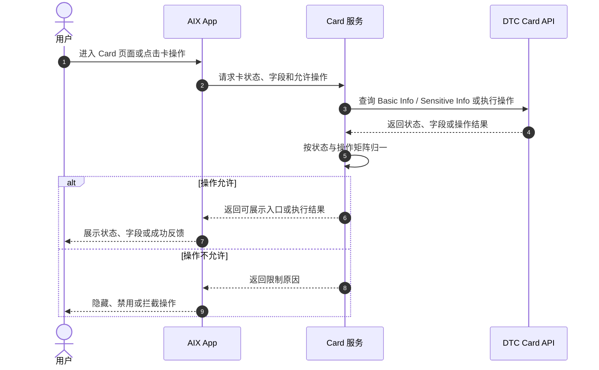
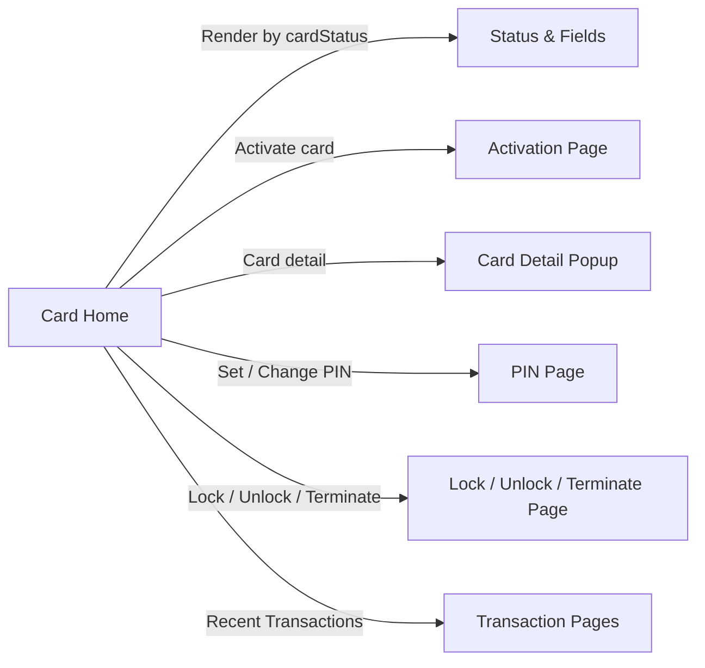

# Card Status & Fields 卡状态与字段

## 1. 文档信息

| 项目 | 内容 |
|---|---|
| 功能名称 | Card Status & Fields 卡状态与字段 |
| 所属模块 | Card |
| Owner | 吴忆锋 |
| 版本 | 1.3 |
| 状态 | Review |
| 更新时间 | 2026-05-04 |
| 来源文档 | AIX Card Application、AIX Card Manage、DTC Card Issuing API、Standard PRD Template v1.3 |

---

## 2. 需求背景、目标与范围

### 2.1 需求背景

Card 相关功能依赖统一的卡状态、字段、接口路径和操作限制。本文作为 Card 模块状态与字段事实源，供 Application、Home、Activation、PIN、Sensitive Info、Management、Transaction Flow 引用。

### 2.2 用户问题 / 业务问题

历史资料中存在状态命名不统一、接口路径冲突、操作限制表被误标为不可读、`autoDebitEnabled` 枚举不一致、敏感字段展示口径不一致等问题。

### 2.3 需求目标

明确状态清单、Manage 6.4 操作矩阵、DTC 接口路径、核心字段和待确认差异，避免各功能文件重复或错误定义状态机。

### 2.4 涉及功能清单

| 功能点 | 本期范围 | 优先级 | 状态 | 说明 |
|---|---|---|---|---|
| 状态清单 | In Scope | P0 | Confirmed | 归纳 Application / Manage / Home 中出现的状态 |
| 操作矩阵 | In Scope | P0 | Confirmed | 转写 Manage 6.4 状态与操作限制 |
| 字段事实源 | In Scope | P0 | Confirmed | Basic Info / Sensitive Info / Application 关键字段 |
| DTC 接口路径 | In Scope | P0 | Open | POST 路径优先，历史 GET 路径待确认 |
| autoDebit / currency 差异 | In Scope | P0 | Open | 标记为待确认，不写成事实 |

---

## 3. 业务流程与规则

### 3.1 业务主流程说明

当用户进入 Card 页面或触发卡操作时，系统先获取卡状态和卡基础字段，再根据本文操作矩阵判断是否展示入口、禁用入口或允许执行。涉及 DTC 接口时，优先采用 DTC Card Issuing API 的 POST 路径。

### 3.2 业务时序图

### 3.3 流程步骤与业务规则

| 步骤 | 场景 / 规则 | 触发条件 | 责任方 | 系统处理 | 成功结果 | 失败 / 分支结果 | 来源 |
|---|---|---|---|---|---|---|---|
| 1 | 查询卡状态 | 进入 Card Home 或操作页 | App / Card | 获取并归一 cardStatus | 返回展示组 | 未知状态进入待确认 | Application / Manage |
| 2 | 查询卡字段 | 页面需要展示卡信息 | Card / DTC | 调用 Basic Info / Sensitive Info | 返回字段 | 接口失败按页面规则处理 | DTC API |
| 3 | 判断操作权限 | 点击 Card detail / PIN / Lock / Unlock 等 | Card | 按 Manage 6.4 矩阵判断 | 放行操作 | 隐藏、禁用或拦截 | Manage / 6.4 |
| 4 | 执行 DTC 操作 | 操作允许 | Card / DTC | 调用对应 DTC API | 返回成功状态 | 保持原状态并提示失败 | DTC API |

### 3.4 状态规则

| 状态 | 含义 | 触发条件 | 用户可见表现 | 系统处理 | 可迁移到 | 是否终态 | 来源 |
|---|---|---|---|---|---|---|---|
| Pending / Processing | 审核中 | 申卡提交后待处理 | Under review | 禁止重复申请 | Active / Pending activation / Cancelled | 否 | Application |
| Pending activation / Inactive | 待激活实体卡 | 实体卡审核通过但未激活 | 显示物流与 Activate card | 仅允许激活 | Active | 否 | Application / Home |
| Active / ACTIVE | 已激活 | 虚拟卡生效或实体卡激活 | 展示卡面和可用操作 | 允许敏感信息、PIN、Lock、交易、注销 | Suspended / Cancelled | 否 | Manage / 6.4 |
| Suspended / SUSPENDED | 已冻结 | Freeze Card 成功 | 展示已冻结 | 允许 Unlock 和注销 | Active | 否 | Manage / 6.4 |
| BLOCKED | 阻断状态 | 外部或风控状态 | 仅允许查看卡信息 | 禁止敏感信息和交易 | 待确认 | 否 | Manage / 6.4 |
| CANCELLED | 取消 / 终止 | 申请失败或卡取消 | 不允许操作 | 终止 | 不适用 | 是 | Manage / 6.4 |
| Terminated | 终止 | Application 中审核失败 / 终止 | 不明确 | 与 Cancelled / BLOCKED 关系待确认 | 不适用 | 待确认 | Application |
| Activate | 疑似 Active | Unlock 成功原文写法 | 不作为独立状态 | 待确认是否拼写问题 | Active | 否 | Manage / 7.5 |

#### Manage 6.4 状态与操作限制矩阵

| 卡状态 | 查看卡信息 | 查看敏感信息 | 卡激活 | Set PIN | Change PIN | Lock Card | Unlock Card | 注销卡 | 交易功能 |
|---|---|---|---|---|---|---|---|---|---|
| 待激活 | 否 | 否 | 是 | 否 | 否 | 否 | 否 | 否 | 否 |
| ACTIVE | 是 | 是 | 否 | 是，仅限首次 | 是 | 是 | 否 | 是 | 是 |
| SUSPENDED | 否 | 否 | 否 | 否 | 否 | 否 | 是 | 是 | 否 |
| CANCELLED | 否 | 否 | 否 | 否 | 否 | 否 | 否 | 否 | 否 |
| BLOCKED | 是 | 否 | 否 | 否 | 否 | 否 | 否 | 否 | 否 |
| PENDING | 否 | 否 | 否 | 否 | 否 | 否 | 否 | 否 | 否 |

### 3.5 业务级异常与失败处理

| 异常场景 | 触发条件 | 错误来源 | 错误码 / 原因 | 用户表现 | 系统处理 | 是否可重试 | 最终状态 |
|---|---|---|---|---|---|---|---|
| 未知卡状态 | DTC / 后端返回未收录状态 | External / Backend | 状态缺失 | 不展示高风险操作 | 记录待确认 | 否 | 待确认 |
| 操作不允许 | 状态矩阵不允许操作 | Backend | 权限限制 | 隐藏 / 禁用 / 拦截 | 保持原状态 | 否 | 原状态 |
| Basic Info 路径冲突 | 文档同时存在 POST / GET | 文档冲突 | 路径冲突 | 不暴露 | 优先 POST，GET 待确认 | 否 | 待确认 |
| Sensitive Info 路径冲突 | 文档同时存在 POST / GET | 文档冲突 | 路径冲突 | 不暴露 | 优先 POST，GET 待确认 | 否 | 待确认 |
| autoDebit 枚举冲突 | 产品 `2/ON` 与 DTC `1/ON` | 文档冲突 | 枚举冲突 | 不暴露 | 标记 P0 待确认 | 否 | 待确认 |

---

## 4. 页面与交互说明

### 4.1 页面关系总览图

### 4.2 Status & Fields 事实源页面

| 区块 | 内容 |
|---|---|
| 页面类型 | 事实源 / 字典页 |
| 页面目标 | 为 Card 各功能提供统一状态、字段、接口路径和操作矩阵 |
| 入口 / 触发 | 功能 PRD 引用本文 |
| 展示内容 | 状态规则、操作矩阵、字段、接口、待确认事项 |
| 用户动作 | PM / Dev / QA 查询规则 |
| 系统处理 / 责任方 | PM 维护规则；BE 按规则实现；QA 按规则验收 |
| 元素 / 状态 / 提示规则 | 不适用 |
| 成功流转 | 各功能引用一致事实 |
| 失败 / 异常流转 | 冲突项进入待确认，不写成事实 |
| 备注 / 边界 | 本文不展开页面视觉与交互细节 |

---

## 5. 字段、接口与数据

| 类型 | 名称 | 所属系统 | 来源 | 用途 | 规则 / 输入输出 | 异常处理 |
|---|---|---|---|---|---|---|
| 接口 | Get Card Basic Info | DTC | DTC Card Issuing / Application | 查询脱敏卡信息、余额、物流等 | 优先 `[POST] /openapi/v1/card/inquiry-card-info`；旧 GET 路径待确认 | 查询失败按页面规则处理 |
| 接口 | Get Card Sensitive Info | DTC | DTC Card Issuing / Application | 查询 PAN / EXP / CVC | 优先 `[POST] /openapi/v1/card/inquiry-card-sensitive-info`；旧 GET 路径待确认 | 查询失败不展示敏感信息 |
| Header | D-REQUEST-ID | DTC | DTC API 2.4 | 请求唯一标识 | 是否承担幂等语义待确认 | 进入待确认 |
| Header | D-TIMESTAMP / D-SIGNATURE / D-SUB-ACCOUNT-ID | DTC | DTC API 2.4 | DTC 请求签名与子账户 | 按 DTC API 要求上送 | 缺失则接口失败 |
| 字段 | cardStatus | Card / DTC | Application / Manage | 决定展示组和操作权限 | 引用状态表和操作矩阵 | 未知状态进入待确认 |
| 字段 | cardHolderName | DTC | Manage / 7.1 | Name on card | Virtual / Physical 均展示 | 查询失败不展示 |
| 字段 | truncatedCardNumber | DTC | Manage / 7.2 | 激活时校验后四位 | 来自 Inquiry Card Basic Info | 不一致提示错误 |
| 字段 | autoDebitEnabled | AIX / DTC | Application / DTC | 自动扣款 | 产品 `2/ON` 与 DTC `1/ON` 冲突 | P0 待确认 |

---

## 6. 通知规则（如适用）

不适用。本文为状态、字段和接口事实源，不直接定义用户通知。

| 触发事件 | 通知渠道 | 通知对象 | 文案 / 模板 | 跳转目标 | 失败 / 补发规则 |
|---|---|---|---|---|---|
| 不适用 | 不适用 | 不适用 | 不适用 | 不适用 | 不适用 |

---

## 7. 权限 / 合规 / 风控（如适用）

| 类型 | 规则 | 影响 | 来源 |
|---|---|---|---|
| 权限 | 操作能力受 Manage 6.4 状态矩阵控制 | 防止非法操作 | Manage / 6.4 |
| 隐私 | Card Home 只展示脱敏信息，敏感信息需认证 | 防止 PAN / CVC / EXP 泄露 | Manage / 7.1 |
| 风控 | BLOCKED 状态只允许查看卡信息，不允许交易或敏感信息 | 防止风险卡继续使用 | Manage / 6.4 |
| 合规 | KYC 和钱包开户前置由 Application / Account / Wallet 承接 | 防止未实名开卡 | Application / 2.1 |

---

## 8. 待确认事项

| 问题 | 影响范围 | 当前处理 | 是否阻塞验收 | 建议确认人 |
|---|---|---|---|---|
| `autoDebitEnabled` 产品 `2/ON` 与 DTC `1/ON` 如何映射 | Application / Activation / Home | 阻塞 | 是 | PM / BE / DTC |
| `currency` 是否区分用户选择稳定币、DTC ISO 4217 卡币种、费用币种 | Application / Transaction | 阻塞 | 是 | PM / BE / Finance |
| Basic Info / Sensitive Info 旧 GET 路径是否废弃 | Home / Sensitive Info | 阻塞 | 是 | BE / DTC |
| Terminate Card 的 AIX 页面流程和状态落点 | Management | 阻塞 | 是 | PM / Design / BE |
| `Activate` 是否为 `Active` 拼写问题 | Management / Home | 不阻塞 | 否 | PM / BE |

---

## 9. 验收标准 / 测试场景

### 9.1 验收标准

| 验收场景 | 验收标准 |
|---|---|
| 正常流程 | 状态、字段、接口路径和操作矩阵可被其他 Card 文件引用 |
| 异常流程 | 未知状态、路径冲突、枚举冲突均进入待确认事项 |
| 页面展示 | 本文不定义 UI 细节，只定义页面可引用的状态和字段 |
| 系统交互 | Basic Info / Sensitive Info 优先采用 DTC POST 路径 |
| 通知 | 不适用 |
| 数据 / 埋点 | cardStatus、cardHolderName、truncatedCardNumber 等规则明确 |

### 9.2 测试场景矩阵

| 场景 | 前置条件 | 用户操作 | 预期页面表现 | 预期系统结果 | 是否必测 |
|---|---|---|---|---|---|
| ACTIVE 卡查看敏感信息 | 卡状态 ACTIVE，认证通过 | 点击 Card detail | 展示完整敏感信息 | 调用 Sensitive Info 成功 | 是 |
| BLOCKED 卡查看敏感信息 | 卡状态 BLOCKED | 点击 Card detail | 不允许展示敏感信息 | 不调用 Sensitive 或拦截 | 是 |
| SUSPENDED 卡 Unlock | 卡状态 SUSPENDED | 点击 Unlock | 进入 Unlock 流程 | 操作允许 | 是 |
| ACTIVE 卡 Lock | 卡状态 ACTIVE | 点击 Lock | 进入 Lock 流程 | 操作允许 | 是 |
| PENDING 卡操作 | 卡状态 PENDING | 点击任意卡操作 | 不展示或不可点击 | 不调用操作接口 | 是 |
| Basic Info 路径 | 需要查询卡信息 | 触发查询 | 不暴露路径 | 使用 POST inquiry-card-info | 是 |

---

## 10. 来源引用

- (Ref: 历史prd/AIX Card V1.0【Application】.pdf / 2.1 / 2.2 / 3-4 / 5.1 / 5.2 / V1.0)
- (Ref: 历史prd/AIX Card manage模块需求V1.0.docx / 6.4 / 7.1-7.5 / 8.1 / V1.0)
- (Ref: DTC Card Issuing API Document_20260310 (1).pdf / 2.4 / 3.2.15 / Card Sensitive Info / V1.0)
- (Ref: prd-template/standard-prd-template.md / v1.3)
