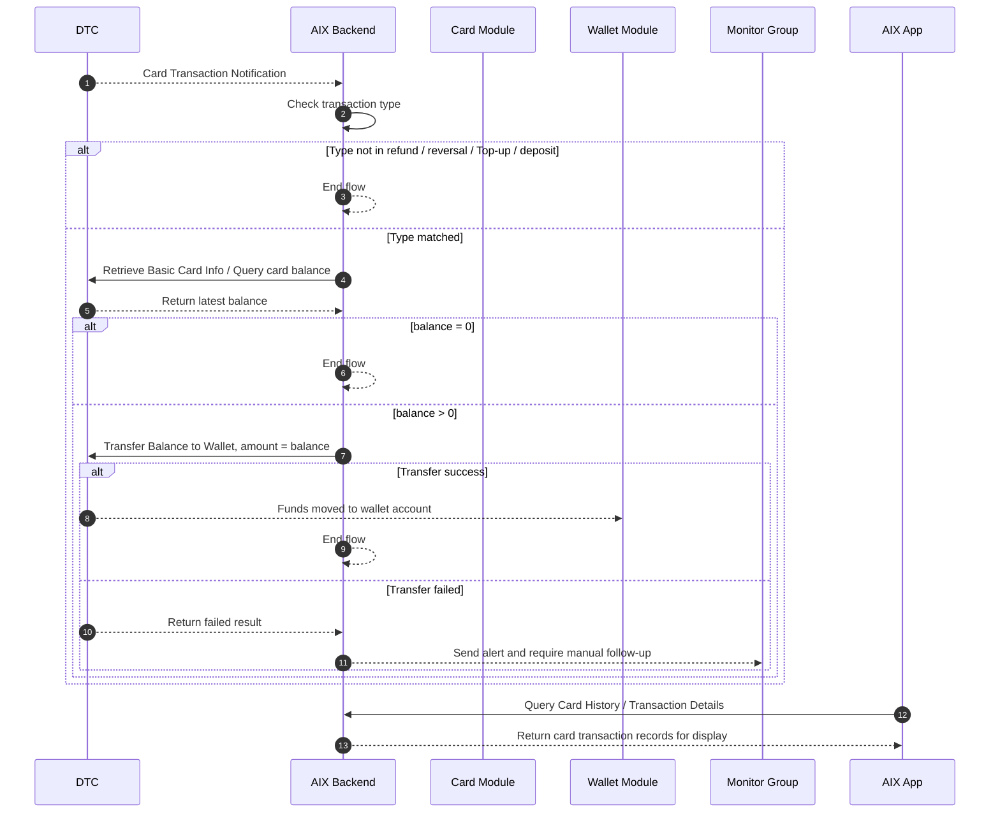
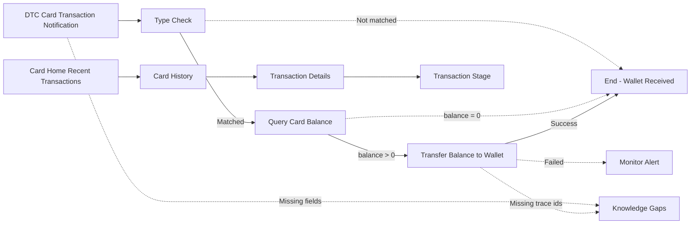

# Card Transaction Flow 卡交易关联流程

## 1. 功能定位

Card Transaction Flow 用于沉淀 DTC 卡交易通知触发后的卡余额归集流程，以及卡交易在 Card Home、Card History、Transaction Details 中的展示边界。

本文件只写卡交易关联流程、状态边界、接口依赖、资金回退触发和失败处理。全量交易统一状态机后续由 Transaction 阶段收口；Wallet 模块的充值、提现、转账、兑换流程不在本文展开。

## 2. 适用范围

| 维度 | 规则 | 来源 | 备注 |
|---|---|---|---|
| 国家线 | VN / PH / AU | AIX Card交易【transaction】 / 5 | 一期国家线 |
| 触发来源 | DTC Card Transaction Notification | AIX Card交易【transaction】 / 7.3 | 异步通知 |
| 触发类型 | refund / reversal / Top-up / deposit | AIX Card交易【transaction】 / 7.3 | 非匹配类型终止 |
| 金额依据 | 查询卡当前 balance | AIX Card交易【transaction】 / 7.3 | amount = balance |
| 归集目标 | 用户钱包账户 | AIX Card交易【transaction】 / 7.1 / 7.3 | 具体钱包入账字段未明确 |
| 展示入口 | Card Home Recent Transactions、Card History、Transaction Details | Application / 5.2；Transaction & History / 5.2 / 5.3 | 展示与资金归集分离 |

## 3. 前置条件

| 条件 | 说明 | 来源 |
|---|---|---|
| 用户已持有 AIX Card | 卡交易发生在用户卡上 | Transaction & History / 5.2 |
| DTC 可发送交易通知 | DTC 通过 Card Transaction Notification 通知 AIX | AIX Card交易【transaction】 / 7.3 |
| AIX 可查询卡余额 | 匹配类型后需主动查询当前卡 balance | AIX Card交易【transaction】 / 7.3 |
| AIX 可发起归集 | balance > 0 时调用 transfer to wallet | AIX Card交易【transaction】 / 7.3 / 8.1 |
| 失败可告警 | 归集失败需发送异常告警至监控群 | AIX Card交易【transaction】 / 7.3 |

## 4. 业务流程

### 4.1 主链路

```text
DTC Card Transaction Notification → Type Check → Query Card Balance → Transfer Balance to Wallet → Result Check → End / Alert
```

### 4.2 业务流程与系统交互时序图



### 4.3 业务逻辑矩阵

| 阶段 | 触发条件 | 系统动作 | 成功结果 | 失败 / 拦截结果 |
|---|---|---|---|---|
| 通知接收 | DTC 发生卡交易并通知 AIX | 接收 Card Transaction Notification | 进入类型判断 | 通知字段缺失时记录缺口 |
| 类型判断 | 收到交易通知 | 校验 type 是否为 refund / reversal / Top-up / deposit | 匹配则查余额 | 不匹配则终止 |
| 查询余额 | 类型匹配 | 查询当前卡 balance | 返回最新 balance | 查询失败处理未明确，记录缺口 |
| 金额判断 | 已拿到 balance | 判断 balance 是否大于 0 | 大于 0 进入归集 | 等于 0 则终止 |
| 归集钱包 | balance > 0 | 调用 Transfer Balance to Wallet，amount = balance | 资金进入用户钱包 | 失败则告警并人工介入 |
| 结果校验 | 归集接口返回 | 校验返回结果 | 成功结束 | 失败按原因分派处理 |
| 前端展示 | 用户查询交易 | Card Home / Card History / Details 展示卡交易记录 | 用户可查看记录 | 展示状态机后续由 Transaction 阶段统一 |

## 5. 页面关系总览



## 6. 资金处理规则

### 6.1 Refund 规则

| 规则 | 来源 | 备注 |
|---|---|---|
| 退款金额退回到卡余额 | AIX Card交易【transaction】 / 7 | 无论退款交易币种是否与原卡消费币种一致 |
| 系统按交易发生时汇率折算 | AIX Card交易【transaction】 / 7 | USD 金额转换为 USDT 等值金额后退回 |
| 仅退还净商品金额 | AIX Card交易【transaction】 / 7 | 不包含 FX 费用和 Transaction Fee |
| 退款过程不收额外手续费 | AIX Card交易【transaction】 / 7 | 原文明确 |

### 6.2 自动归集规则

| 条件 | 系统动作 | 来源 | 结果 |
|---|---|---|---|
| type 不属于 refund / reversal / Top-up / deposit | 终止流程 | AIX Card交易【transaction】 / 7.3 | 不归集 |
| type 匹配且 balance = 0 | 终止流程 | AIX Card交易【transaction】 / 7.3 | 不归集 |
| type 匹配且 balance > 0 | 调用 Transfer Balance to Wallet，amount = balance | AIX Card交易【transaction】 / 7.3 | 归集到钱包 |
| 归集失败 | 告警至监控群，人工介入 | AIX Card交易【transaction】 / 7.3 | 待处理 |

### 6.3 可追溯性当前状态

| 追踪点 | 当前是否明确 | 来源 | 处理 |
|---|---|---|---|
| Card Transaction Notification 原始交易 ID | 未明确 | AIX Card交易【transaction】 / 7.3 / 9 | 记录缺口 |
| 卡余额字段 `balance` | 明确 | AIX Card交易【transaction】 / 7.3 | 作为归集金额依据 |
| Transfer amount | 明确 | AIX Card交易【transaction】 / 7.3 | amount = balance |
| Transfer Balance to Wallet 返回字段 | 未明确 | AIX Card交易【transaction】 / 8.1 / 9 | 记录缺口 |
| 钱包入账流水 ID | 未明确 | AIX Card交易【transaction】 / 9 | 记录缺口 |
| 幂等字段 / 重试字段 | 未明确 | AIX Card交易【transaction】 / 9 | 记录缺口 |

## 7. 交易展示规则

### 7.1 Card Home Recent Transactions

| 规则 | 来源 |
|---|---|
| Card Home 展示最近 3 条卡交易记录 | Application / 5.2 |
| 进入页面调用 `/openapi/v1/card/inquiry-card-transaction` | Application / 5.2 |
| 无交易数据时展示占位符 | Application / 5.2 |
| 有交易数据时按交易时间降序排列 | Application / 5.2 |
| 展示 Merchant name、Crypto & Amount、Status、Created Date、Indicator | Application / 5.2 |

### 7.2 Card History

| 规则 | 来源 |
|---|---|
| Card History 可查看最近 1 年内卡交易数据 | Transaction & History / 5.2 |
| 单次最多查询 6 个月 | Transaction & History / 5.2 |
| 默认按当前月份查询，默认显示最新 10 条 | Transaction & History / 5.2 |
| 每页 10 条，滑动加载更多 | Transaction & History / 5.2 |
| 支持按 Type、Crypto、Date 组合筛选 | Transaction & History / 5.2 |
| 需过滤 TOP_UP 和 REVERSAL_TO_ACCOUNT 类型 | Transaction & History / 5.2 |
| 点击单条记录进入 Transaction Details | Transaction & History / 5.2 |

### 7.3 Transaction Details

| 规则 | 来源 |
|---|---|
| 入口包括 Card Home 交易区域和 Card History 记录 | Transaction & History / 5.3 |
| 进入页面调用 Card Transaction Detail Inquiry | Transaction & History / 5.3 |
| 上送 Transaction ID 获取最新交易记录 | Transaction & History / 5.3 |
| DTC 异步通知结果需同步更新并展示 | Transaction & History / 5.3 |
| Transaction ID 支持复制 | Transaction & History / 5.3 |

## 8. 字段与接口依赖

| 字段 / 接口 / 能力 | 用途 | 来源 | 备注 |
|---|---|---|---|
| `Card Transaction Notification` | DTC 通知卡交易发生 | AIX Card交易【transaction】 / 7.3 / 8.1 | 接口地址未在 PDF 抽取中完整呈现 |
| `type` | 判断是否进入归集流程 | AIX Card交易【transaction】 / 7.3 | 枚举字段取值需 DTC 确认 |
| `Retrieve Basic Card Info` | 查询卡当前 balance | AIX Card交易【transaction】 / 7.3 | 原文名称；实际接口路径待确认 |
| `balance` | 卡当前余额 | AIX Card交易【transaction】 / 7.3 | 归集金额依据 |
| `Transfer Balance to Wallet` | 将卡余额转回钱包 | AIX Card交易【transaction】 / 8.1 | `openapi/v1/card/transfer-to-wallet` |
| `Card Balance History Inquiry` | 查询卡余额历史 | AIX Card交易【transaction】 / 8.1 | `openapi/v1/card/inquiry-card-balance-history` |
| `Transaction History of Card` | 查询卡交易列表 | Transaction & History / 2.1 | `[POST] /openapi/v1/card/inquiry-card-transaction` |
| `Card Transaction Detail Inquiry` | 查询卡交易详情 | Transaction & History / 2.1 / 5.3 | 原文路径含空格，需确认最终格式 |

## 9. 异常与失败处理

| 场景 | 触发条件 | 系统动作 | 最终状态 | 来源 |
|---|---|---|---|---|
| 非目标交易类型 | type 不属于 refund / reversal / Top-up / deposit | 终止流程 | 不归集 | AIX Card交易【transaction】 / 7.3 |
| balance = 0 | 查询卡余额为 0 | 终止流程 | 不归集 | AIX Card交易【transaction】 / 7.3 |
| 查询余额失败 | 卡余额查询接口失败 | 原文未明确 | 待确认 | AIX Card交易【transaction】 / 9 |
| 归集失败 | Transfer Balance to Wallet 失败 | 告警至监控群，人工介入 | 待人工处理 | AIX Card交易【transaction】 / 7.3 |
| 系统原因失败 | 归集失败原因为系统原因 | 开发跟进处理 | 待处理 | AIX Card交易【transaction】 / 7.3 |
| 金额大于卡余额 | 归集失败原因为交易金额大于卡余额 | 产品侧跟进处理 | 待处理 | AIX Card交易【transaction】 / 7.3 |
| 展示查询无数据 | Card History 无交易数据 | 展示 `No transaction data` | 空态 | Transaction & History / 5.2 |
| 详情查询失败 | Card Transaction Detail Inquiry 失败 | 原文未明确失败页 | 待确认 | Transaction & History / 5.3 |

## 10. 风控 / 合规边界

| 边界 | 规则 | 影响 | 来源 |
|---|---|---|---|
| KYC 前置 | 用户卡和钱包能力前置于账户开户与 KYC | Card / Application；Wallet / KYC | 不在本文重复定义 |
| 资金归集触发 | 仅目标交易类型触发自动归集 | 防止非目标交易误归集 | AIX Card交易【transaction】 / 7.3 |
| 金额来源 | 归集金额只取查询得到的 card balance | 防止按通知金额错误归集 | AIX Card交易【transaction】 / 7.3 |
| 费用边界 | Refund 不退 FX 费用和 Transaction Fee | 影响用户到账解释和客服口径 | AIX Card交易【transaction】 / 7 |
| 失败可观测 | 归集失败必须告警并人工介入 | 防止资金悬挂 | AIX Card交易【transaction】 / 7.3 |
| 可追溯性缺口 | 通知 ID、归集流水、钱包入账流水、幂等字段未明确 | 影响对账和故障追踪 | AIX Card交易【transaction】 / 9 |

## 11. 来源引用

- (Ref: 历史prd/AIX Card交易【transaction】.pdf / 7 需求描述 / V1.0)
- (Ref: 历史prd/AIX Card交易【transaction】.pdf / 8.1 外部接口依赖 / V1.0)
- (Ref: 历史prd/AIX Card交易【transaction】.pdf / 9 待确认事项 / V1.0)
- (Ref: 历史prd/AIX APP V1.0【Transaction & History】.pdf / 2.1 接口范围 / V1.1)
- (Ref: 历史prd/AIX APP V1.0【Transaction & History】.pdf / 5.1 全量交易记录 / V1.1)
- (Ref: 历史prd/AIX APP V1.0【Transaction & History】.pdf / 5.2 卡交易列表 / V1.1)
- (Ref: 历史prd/AIX APP V1.0【Transaction & History】.pdf / 5.3 卡交易详情 / V1.1)
- (Ref: 历史prd/AIX Card V1.0【Application】.pdf / 5.2 卡片首页 / V1.0)
- (Ref: knowledge-base/card/card-status-and-fields.md)
- (Ref: knowledge-base/card/card-home.md)
