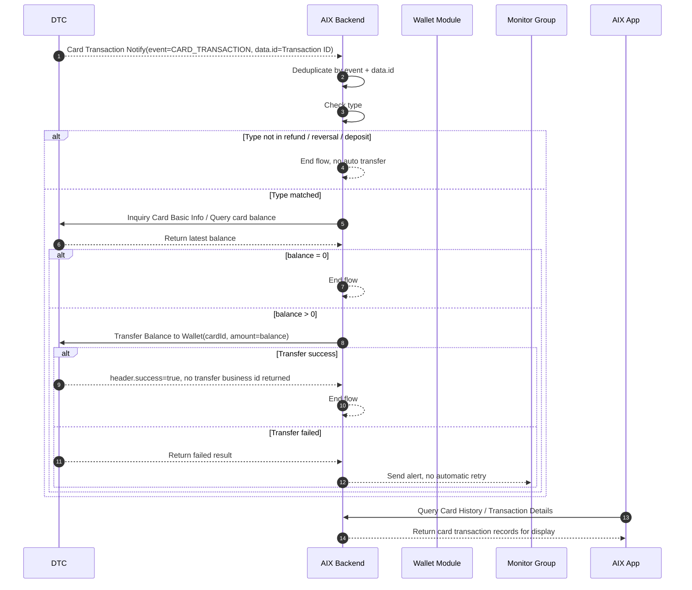

# Card Transaction Flow 卡交易关联流程

## 1. 功能定位

Card Transaction Flow 用于沉淀 DTC 卡交易通知触发后的卡余额归集流程，以及卡交易在 Card Home、Card History、Transaction Details 中的展示边界。

本文件只写卡交易关联流程、状态边界、接口依赖、资金回退触发和失败处理。全量交易统一状态机后续由 Transaction 阶段收口；Wallet 模块的充值、提现、转账、兑换流程不在本文展开。

## 2. 适用范围

| 维度 | 规则 | 来源 | 备注 |
|---|---|---|---|
| 国家线 | VN / PH / AU | AIX Card交易【transaction】 / 5 | 一期国家线 |
| 触发来源 | DTC `Card Transaction Notify` / `Card Transaction Notification` | AIX Card交易【transaction】 / 7.3；DTC Card Issuing / 3.4.4 | DTC 全量通知 AIX |
| 通知去重 | 重复推送时 `Transaction ID` 不变；无独立 notification id；AIX 可按 `event + data.id` 去重 | 用户确认 2026-05-01；DTC Card Issuing / 3.4.4 | 后端落库与去重实现仍需确认 |
| 归集触发类型 | 仅 `refund` / `reversal` / `deposit` 触发查卡余额和自动归集 | 用户确认 2026-05-01；AIX Card交易【transaction】 / 7.3 | `Top-up` 已移除；其他交易类型不触发 |
| DTC 对应枚举 | `REFUND = 18`、`REVERSAL = 19`、`DEPOSIT = 22` | DTC Card Issuing / Appendix B；用户确认 2026-05-01 | AIX 只关注归集触发类型，不需要全量映射 DTC 枚举 |
| 金额依据 | 查询卡当前 `balance` | AIX Card交易【transaction】 / 7.3；DTC Card Issuing / 3.2.15 | amount = balance |
| 归集目标 | 用户 Wallet 账户 | AIX Card交易【transaction】 / 7.1 / 7.3 | 钱包入账流水和关联字段仍待确认 |
| 展示入口 | Card Home Recent Transactions、Card History、Transaction Details | Application / 5.2；Transaction & History / 5.2 / 5.3 | 展示与资金归集分离 |

## 3. 前置条件

| 条件 | 说明 | 来源 |
|---|---|---|
| 用户已持有 AIX Card | 卡交易发生在用户卡上 | Transaction & History / 5.2 |
| DTC 可发送交易通知 | DTC 通过 `Card Transaction Notify` 通知 AIX | DTC Card Issuing / 3.4.4 |
| AIX 可查询卡余额 | 目标类型命中后需主动查询当前卡 `balance` | AIX Card交易【transaction】 / 7.3；DTC Card Issuing / 3.2.15 |
| AIX 可发起归集 | `balance > 0` 时调用 `Transfer Balance to Wallet` | AIX Card交易【transaction】 / 7.3；DTC Card Issuing / 3.3.3 |
| 失败可告警 | 归集失败不自动重试，发送异常告警至监控群 | 用户确认 2026-05-01；AIX Card交易【transaction】 / 7.3 |

## 4. 业务流程

### 4.1 主链路

```text
DTC Card Transaction Notify
→ Deduplicate by event + data.id
→ Type Check: refund / reversal / deposit
→ Query Card Balance
→ Transfer Balance to Wallet if balance > 0
→ End / Alert
```

### 4.2 业务流程与系统交互时序图



### 4.3 业务逻辑矩阵

| 阶段 | 触发条件 | 系统动作 | 成功结果 | 失败 / 拦截结果 |
|---|---|---|---|---|
| 通知接收 | DTC 发生卡交易并通知 AIX | 接收 `Card Transaction Notify` | 进入去重与类型判断 | 原始报文是否完整落库仍待后端确认 |
| 通知去重 | 收到 Webhook | 按 `event + data.id` 判断同一交易通知 | 重复通知不重复处理 | 后端具体实现待确认 |
| 类型判断 | 收到非重复通知 | 仅校验是否为 `refund` / `reversal` / `deposit` | 命中则查余额 | 未命中则终止，不归集 |
| 查询余额 | 类型匹配 | 查询当前卡 `balance` | 返回最新 balance | 查询失败处理未明确，记录缺口 |
| 金额判断 | 已拿到 balance | 判断 balance 是否大于 0 | 大于 0 进入归集 | 等于 0 则终止 |
| 归集钱包 | balance > 0 | 调用 `Transfer Balance to Wallet`，`amount = balance` | 成功时结束 | 失败不自动重试，告警监控群 |
| 前端展示 | 用户查询交易 | Card Home / Card History / Details 展示卡交易记录 | 用户可查看记录 | 展示状态机后续由 Transaction 阶段统一 |

## 5. 资金处理规则

### 5.1 Refund 规则

| 规则 | 来源 | 备注 |
|---|---|---|
| 退款金额退回到卡余额 | AIX Card交易【transaction】 / 7 | 无论退款交易币种是否与原卡消费币种一致 |
| 系统按交易发生时汇率折算 | AIX Card交易【transaction】 / 7 | USD 金额转换为 USDT 等值金额后退回 |
| 仅退还净商品金额 | AIX Card交易【transaction】 / 7 | 不包含 FX 费用和 Transaction Fee |
| 退款过程不收额外手续费 | AIX Card交易【transaction】 / 7 | 原文明确 |

### 5.2 自动归集规则

| 条件 | 系统动作 | 来源 | 结果 |
|---|---|---|---|
| type 不属于 refund / reversal / deposit | 终止流程 | 用户确认 2026-05-01 | 不归集 |
| type 匹配且 balance = 0 | 终止流程 | AIX Card交易【transaction】 / 7.3 | 不归集 |
| type 匹配且 balance > 0 | 调用 `Transfer Balance to Wallet`，amount = balance | AIX Card交易【transaction】 / 7.3 | 归集到 Wallet |
| 归集失败 | 不自动重试，告警至监控群 | 用户确认 2026-05-01；AIX Card交易【transaction】 / 7.3 | 待人工处理 |

### 5.3 用户可见资金口径

| 场景 | 规则 | 来源 |
|---|---|---|
| 正常情况 | 用户收到退款 / 卡交易成功通知后，预期资金已归集至 Wallet | 用户确认 2026-05-01 |
| 极端异常 | 可能出现卡已收到钱但转 Wallet 失败，此时用户无法看到资金 | 用户确认 2026-05-01 |
| 前端展示 | AIX 对外只展示 Wallet 资金，不展示卡资金 | 用户确认 2026-05-01 |
| 异常发现 | DTC transfer 成功但 Wallet 未到账，目前无法系统自动发现，主要依赖用户反馈 | 用户确认 2026-05-01 |

## 6. 字段与接口依赖

| 字段 / 接口 / 能力 | 用途 | 来源 | 当前状态 |
|---|---|---|---|
| `Card Transaction Notify` | DTC 通知卡交易发生 | DTC Card Issuing / 3.4.4 | 已明确 |
| `event` | Webhook 事件类型，如 `CARD_TRANSACTION` | DTC Card Issuing / 3.4.4 | 已明确 |
| `data.id` | DTC `Transaction ID` | DTC Card Issuing / 3.4.4 | 已明确；重复推送不变 |
| `originalId` | Original Transaction ID | DTC Card Issuing / 3.4.4 | 已明确，选填 |
| `type` | 判断是否进入归集流程 | DTC Card Issuing / Appendix B；用户确认 2026-05-01 | 仅 refund / reversal / deposit 触发 |
| `indicator` | 交易方向 | DTC Card Issuing / 3.4.4；Notification PRD | 展示 / 通知相关；是否参与归集判断待后端确认 |
| `Inquiry Card Basic Info` | 查询卡当前 balance | DTC Card Issuing / 3.2.15 | `[POST] /openapi/v1/card/inquiry-card-info` |
| `balance` | 卡当前余额 | DTC Card Issuing / 3.2.15；AIX Card交易【transaction】 / 7.3 | 归集金额依据 |
| `Transfer Balance to Wallet` | 将卡余额转回 Wallet | DTC Card Issuing / 3.3.3 | `[POST] /openapi/v1/card/transfer-to-wallet` |
| `cardId` | Transfer 请求字段 | DTC Card Issuing / 3.3.3 | 必填 |
| `amount` | Transfer 请求字段 | DTC Card Issuing / 3.3.3 | 必填，取 balance |
| `D-REQUEST-ID` | DTC API 请求唯一标识 Header | DTC Card Issuing / 2.4 | 是否具备幂等语义未明确，不写成幂等事实 |
| `Card Balance History Inquiry` | 查询卡余额历史 | DTC Card Issuing / 3.3.7 | `[POST] /openapi/v1/card/inquiry-card-balance-history`；relatedId 关联规则待确认 |
| `Transaction History of Card` | 查询卡交易列表 | DTC Card Issuing / 3.3.4 | `[POST] /openapi/v1/card/inquiry-card-transaction` |
| `Card Transaction Detail Inquiry` | 查询卡交易详情 | DTC Card Issuing / 3.3.5 | `[POST] /openapi/v1/card/inquiry-card-transaction-detail` |
| `Wallet Search Balance History` | 查询钱包交易历史 | DTC Wallet OpenAPI / 4.2.4 | `relatedId` 在卡余额转 Wallet 场景下取值待确认 |

## 7. 可追溯性当前状态

| 追踪点 | 当前是否明确 | 来源 | 处理 |
|---|---|---|---|
| DTC 通知唯一键 | 部分明确 | 用户确认 2026-05-01；DTC Card Issuing / 3.4.4 | 可按 `event + data.id` 去重；后端实现待确认 |
| DTC 卡交易 ID | 明确 | DTC Card Issuing / 3.4.4 | `data.id` |
| DTC 原始交易 ID | 明确 | DTC Card Issuing / 3.4.4 | `originalId`，选填 |
| AIX 内部交易处理 ID | 未明确 | 后端待确认 | 记录缺口 |
| AIX 归集请求 ID | 未明确 | 后端待确认 | 记录缺口 |
| DTC 请求 ID | 字段明确，语义未完全明确 | DTC Card Issuing / 2.4 | `D-REQUEST-ID`；幂等语义未确认 |
| Transfer Balance to Wallet 返回业务流水 | 明确无返回 | DTC Card Issuing / 3.3.3；用户确认 2026-05-01 | 不再作为 DTC 返回字段等待 |
| 钱包入账流水 ID | 未明确 | Wallet / 账务待确认 | 记录缺口 |
| Wallet relatedId | 未明确 | DTC Wallet OpenAPI / 4.2.4 | 卡余额转 Wallet 场景下关联规则待确认 |
| 自动重试策略 | 明确无自动重试 | 用户确认 2026-05-01 | 失败告警监控群 |

## 8. 交易展示与通知规则

### 8.1 Card Home Recent Transactions

| 规则 | 来源 |
|---|---|
| Card Home 展示最近 3 条卡交易记录 | Application / 5.2 |
| 进入页面调用 `/openapi/v1/card/inquiry-card-transaction` | Application / 5.2；DTC Card Issuing / 3.3.4 |
| 无交易数据时展示占位符 | Application / 5.2 |
| 有交易数据时按交易时间降序排列 | Application / 5.2 |
| 展示 Merchant name、Crypto & Amount、Status、Created Date、Indicator | Application / 5.2 |

### 8.2 Card History

| 规则 | 来源 |
|---|---|
| Card History 可查看最近 1 年内卡交易数据 | Transaction & History / 5.2 |
| 单次最多查询 6 个月 | Transaction & History / 5.2 |
| 默认按当前月份查询，默认显示最新 10 条 | Transaction & History / 5.2 |
| 每页 10 条，滑动加载更多 | Transaction & History / 5.2 |
| 支持按 Type、Crypto、Date 组合筛选 | Transaction & History / 5.2 |
| 需过滤 TOP_UP 和 REVERSAL_TO_ACCOUNT 类型 | Transaction & History / 5.2 |
| 点击单条记录进入 Transaction Details | Transaction & History / 5.2 |

### 8.3 Transaction Details

| 规则 | 来源 |
|---|---|
| 入口包括 Card Home 交易区域和 Card History 记录 | Transaction & History / 5.3 |
| 进入页面调用 Card Transaction Detail Inquiry | Transaction & History / 5.3；DTC Card Issuing / 3.3.5 |
| 上送 Transaction ID 获取最新交易记录 | Transaction & History / 5.3；DTC Card Issuing / 3.3.5 |
| DTC 异步通知结果需同步更新并展示 | Transaction & History / 5.3 |
| Transaction ID 支持复制 | Transaction & History / 5.3 |

### 8.4 用户通知

| 通知 | 触发源 | 条件 | 结果 |
|---|---|---|---|
| 卡交易成功 | Card Transaction Notify | indicator=debit，status=101 AUTHORIZED | 跳转卡交易详情页 |
| 卡退款成功 | Card Transaction Notify | indicator=credit，refund / reversed 场景 | 跳转卡交易详情页 |

## 9. 异常与失败处理

| 场景 | 触发条件 | 系统动作 | 最终状态 | 来源 |
|---|---|---|---|---|
| 非目标交易类型 | type 不属于 refund / reversal / deposit | 终止流程 | 不归集 | 用户确认 2026-05-01 |
| balance = 0 | 查询卡余额为 0 | 终止流程 | 不归集 | AIX Card交易【transaction】 / 7.3 |
| 查询余额失败 | 卡余额查询接口失败 | 待后端确认 | 待确认 | knowledge-gaps |
| 归集失败 | Transfer Balance to Wallet 失败 | 不自动重试；告警至监控群 | 待人工处理 | 用户确认 2026-05-01；AIX Card交易【transaction】 / 7.3 |
| 系统原因失败 | 归集失败原因为系统原因 | 开发跟进处理 | 待处理 | AIX Card交易【transaction】 / 7.3 |
| 金额大于卡余额 | 归集失败原因为交易金额大于卡余额 | 产品侧跟进处理 | 待处理 | AIX Card交易【transaction】 / 7.3 |
| DTC transfer 成功但 Wallet 未到账 | 极端异常 | 当前无法系统自动发现，主要依赖用户反馈 | 待人工处理 | 用户确认 2026-05-01 |
| 展示查询无数据 | Card History 无交易数据 | 展示 `No transaction data` | 空态 | Transaction & History / 5.2 |
| 详情查询失败 | Card Transaction Detail Inquiry 失败 | 原文未明确失败页 | 待确认 | Transaction & History / 5.3 |

## 10. 风控 / 合规边界

| 边界 | 规则 | 影响 | 来源 |
|---|---|---|---|
| KYC 前置 | 用户卡和钱包能力前置于账户开户与 KYC | Card / Application；Wallet / KYC | 不在本文重复定义 |
| 资金归集触发 | 仅 refund / reversal / deposit 触发自动归集 | 防止非目标交易误归集 | 用户确认 2026-05-01 |
| 金额来源 | 归集金额只取查询得到的 card balance | 防止按通知金额错误归集 | AIX Card交易【transaction】 / 7.3 |
| 费用边界 | Refund 不退 FX 费用和 Transaction Fee | 影响用户到账解释和客服口径 | AIX Card交易【transaction】 / 7 |
| 失败可观测 | 归集失败必须告警并人工介入 | 防止资金悬挂 | 用户确认 2026-05-01 |
| 用户展示边界 | AIX 对外只展示 Wallet 资金，不展示卡资金 | 钱包未到账时用户不可见卡内资金 | 用户确认 2026-05-01 |
| 可追溯性缺口 | AIX 内部交易 ID、归集请求 ID、钱包入账流水、Wallet relatedId、对账字段仍未明确 | 影响对账和故障追踪 | knowledge-gaps |

## 11. 阶段状态

Card Transaction Flow 事实层已更新，但 Card 阶段仍为 `BLOCK`。

阻塞原因已从“DTC 字段与接口不明确”收敛为：AIX 内部处理 ID、归集请求 ID、D-REQUEST-ID 保存关系、Wallet 入账流水、Wallet relatedId、查询余额失败处理、人工补偿入口和最终对账字段组合未闭环。

## 12. 来源引用

- (Ref: 历史prd/AIX Card交易【transaction】.pdf / 7 需求描述 / V1.0)
- (Ref: 历史prd/AIX Card交易【transaction】.pdf / 8.1 外部接口依赖 / V1.0)
- (Ref: DTC Card Issuing API Document_20260310 (1).pdf / 2.4 Request Signature)
- (Ref: DTC Card Issuing API Document_20260310 (1).pdf / 3.2.15 Inquiry Card Basic Info)
- (Ref: DTC Card Issuing API Document_20260310 (1).pdf / 3.3.3 transfer to wallet)
- (Ref: DTC Card Issuing API Document_20260310 (1).pdf / 3.3.4 Transaction History Of Card)
- (Ref: DTC Card Issuing API Document_20260310 (1).pdf / 3.3.5 Detail Of Card Transaction)
- (Ref: DTC Card Issuing API Document_20260310 (1).pdf / 3.3.7 Inquiry Card Balance History)
- (Ref: DTC Card Issuing API Document_20260310 (1).pdf / 3.4.4 Card Transaction Notify)
- (Ref: DTC Card Issuing API Document_20260310 (1).pdf / Appendix A / Appendix B)
- (Ref: DTC Wallet OpenAPI Documentation / 4.2.4 Search Balance History)
- (Ref: [2025-11-25] AIX+Notification（push及站内信）.docx / 卡相关通知)
- (Ref: 卡交易&钱包交易状态梳理)
- (Ref: 用户确认结论 / 2026-05-01)
- (Ref: knowledge-base/card/transaction-flow-traceability-checklist.md / v1.4)
