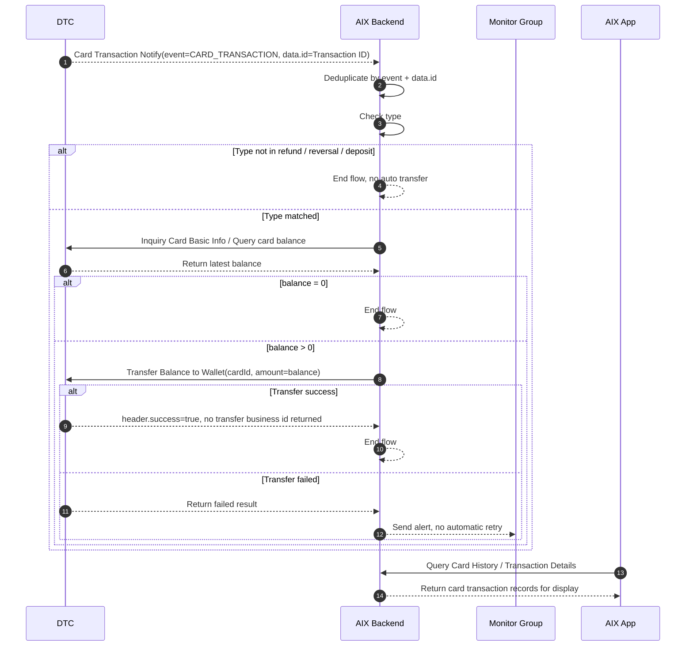

# Card Transaction Flow 卡交易关联流程

## 0. 文档信息

| 项 | 内容 |
|---|---|
| 文档类型 | Card Transaction Flow 标准 PRD / 知识库事实文件 |
| 当前版本 | 1.4 |
| 文档状态 | active |
| 目标读者 | Product、BE、FE、QA、Risk、Finance、Operation |
| 本次修订 | 收拢评审意见：标记非本次附件来源边界、明确 DTC API 与用户确认规则的事实层级、补充标准待确认事项和验收标准 |
| 维护原则 | 本文只处理卡交易通知后的余额归集和 Card 页面交易展示边界；全量交易状态机、钱包交易、对账字段由交易 / 钱包模块承接 |

## 1. 功能定位

Card Transaction Flow 用于沉淀 DTC 卡交易通知触发后的卡余额归集流程，以及卡交易在 Card Home、Card History、Transaction Details 中的展示边界。

本文件只写卡交易关联流程、状态边界、接口依赖、资金回退触发和失败处理。全量交易统一状态机由 Transaction 阶段承接；资金追踪 / ID 链路 / 对账边界由 `transaction/reconciliation.md` 承接；未确认项统一引用 `knowledge-base/changelog/knowledge-gaps.md` 的 ALL-GAP 编号。

Wallet 模块的充值、提现、转账、兑换流程不在本文展开。

来源等级：

| 来源类型 | 内容 | 本次处理 |
|---|---|---|
| 本次可验证事实 | DTC Card Issuing API 中的 Request Signature、Inquiry Card Basic Info、Transfer Balance to Wallet、Transaction History Of Card、Card Transaction Detail Inquiry、Card Transaction Notify 等 | 可作为接口事实 |
| 本次未提供附件 | AIX Card交易、Transaction & History、DTC Wallet OpenAPI、Notification、用户确认结论 | 保留原引用，但在本次修订中不新增未经验证事实 |
| 内部承接文件 | `transaction/reconciliation.md`、`knowledge-gaps.md` | 用于 Gap 和对账承接，不替代接口事实 |

> 来源边界：本文中交易、钱包、通知和用户确认结论的多数来源未随 2026-05-04 本次评审附件提供；DTC Card Issuing API 中可核验的内容主要包括 Request Signature、Inquiry Card Basic Info、Transfer Balance to Wallet、Transaction History Of Card、Detail Of Card Transaction、Inquiry Card Balance History、Card Transaction Notify 和 Appendix 枚举。资金归集触发规则、失败不重试、告警等属于 AIX 业务规则 / 用户确认结论，不是 DTC API 自动保证能力。

## 2. 适用范围

| 维度 | 规则 | 来源 | 备注 |
|---|---|---|---|
| 国家线 | VN / PH / AU | AIX Card交易【transaction】 / 5 | 一期国家线 |
| 触发来源 | DTC `Card Transaction Notify` / `Card Transaction Notification` | AIX Card交易【transaction】 / 7.3；DTC Card Issuing / 3.4.4 | DTC 通知能力可由本次 DTC API 验证；是否全量通知来自历史 PRD，非本次附件验证 |
| 通知去重 | 重复推送时 `Transaction ID` 不变；无独立 notification id；AIX 可按 `event + data.id` 去重 | 用户确认 2026-05-01；DTC Card Issuing / 3.4.4 | 后端落库与去重实现见 ALL-GAP-022、ALL-GAP-023 |
| 归集触发类型 | 仅 `refund` / `reversal` / `deposit` 触发查卡余额和自动归集 | 用户确认 2026-05-01；AIX Card交易【transaction】 / 7.3 | 该规则为 AIX 产品 / 用户确认结论，不是 DTC API 自动保证 |
| DTC 对应枚举 | `REFUND = 18`、`REVERSAL = 19`、`DEPOSIT = 22` | DTC Card Issuing / Appendix B；用户确认 2026-05-01 | AIX 只关注归集触发类型，不需要全量映射 DTC 枚举 |
| 金额依据 | 查询卡当前 `balance` | AIX Card交易【transaction】 / 7.3；DTC Card Issuing / 3.2.15 | amount = balance |
| 归集目标 | 用户 Wallet 账户 | AIX Card交易【transaction】 / 7.1 / 7.3 | Wallet 交易 id 与归集请求的关联见 ALL-GAP-017、ALL-GAP-018 |
| 展示入口 | Card Home Recent Transactions、Card History、Transaction Details | Application / 5.2；Transaction & History / 5.2 / 5.3 | 展示与资金归集分离 |

## 3. 前置条件

| 条件 | 说明 | 来源 |
|---|---|---|
| 用户已持有 AIX Card | 卡交易发生在用户卡上 | Transaction & History / 5.2 |
| DTC 可发送交易通知 | DTC 通过 `Card Transaction Notify` 通知 AIX | DTC Card Issuing / 3.4.4 |
| AIX 可查询卡余额 | 目标类型命中后需主动查询当前卡 `balance` | AIX Card交易【transaction】 / 7.3；DTC Card Issuing / 3.2.15 |
| AIX 可发起归集 | `balance > 0` 时调用 `Transfer Balance to Wallet` | AIX Card交易【transaction】 / 7.3；DTC Card Issuing / 3.3.3 |
| 失败可告警 | 归集失败不自动重试，发送异常告警至监控群 | 用户确认 2026-05-01；AIX Card交易【transaction】 / 7.3 |

## 4. 业务流程

### 4.1 主链路

```text
DTC Card Transaction Notify
→ Deduplicate by event + data.id
→ Type Check: refund / reversal / deposit
→ Query Card Balance
→ Transfer Balance to Wallet if balance > 0
→ End / Alert
```

### 4.2 业务流程与系统交互时序图



### 4.3 业务逻辑矩阵

| 阶段 | 触发条件 | 系统动作 | 成功结果 | 失败 / 拦截结果 |
|---|---|---|---|---|
| 通知接收 | DTC 发生卡交易并通知 AIX | 接收 `Card Transaction Notify` | 进入去重与类型判断 | 原始报文落库见 ALL-GAP-022、ALL-GAP-036 |
| 通知去重 | 收到 Webhook | 可按 `event + data.id` 判断同一交易通知 | 重复通知不重复处理 | 后端具体实现见 ALL-GAP-023 |
| 类型判断 | 收到非重复通知 | 仅校验是否为 `refund` / `reversal` / `deposit` | 命中则查余额 | 未命中则终止，不归集；附加判断见 ALL-GAP-024 |
| 查询余额 | 类型匹配 | 查询当前卡 `balance` | 返回最新 balance | 查询失败处理见 ALL-GAP-025 |
| 金额判断 | 已拿到 balance | 判断 balance 是否大于 0 | 大于 0 进入归集 | 等于 0 则终止 |
| 归集钱包 | balance > 0 | 调用 `Transfer Balance to Wallet`，`amount = balance` | 成功时结束 | 失败不自动重试、告警监控群为用户确认结论；人工补偿入口见 ALL-GAP-026 |
| 前端展示 | 用户查询交易 | Card Home / Card History / Details 展示卡交易记录 | 用户可查看记录 | 展示状态映射见 ALL-GAP-053 |

## 5. 资金处理规则

### 5.1 Refund 规则

| 规则 | 来源 | 备注 |
|---|---|---|
| 退款金额退回到卡余额 | AIX Card交易【transaction】 / 7 | 无论退款交易币种是否与原卡消费币种一致 |
| 系统按交易发生时汇率折算 | AIX Card交易【transaction】 / 7 | USD 金额转换为 USDT 等值金额后退回 |
| 仅退还净商品金额 | AIX Card交易【transaction】 / 7 | 不包含 FX 费用和 Transaction Fee |
| 退款过程不收额外手续费 | AIX Card交易【transaction】 / 7 | 原文明确 |

### 5.2 自动归集规则

| 条件 | 系统动作 | 来源 | 结果 |
|---|---|---|---|
| type 不属于 refund / reversal / deposit | 终止流程 | 用户确认 2026-05-01 | 不归集 |
| type 匹配且 balance = 0 | 终止流程 | AIX Card交易【transaction】 / 7.3 | 不归集 |
| type 匹配且 balance > 0 | 调用 `Transfer Balance to Wallet`，amount = balance | AIX Card交易【transaction】 / 7.3 | 归集到 Wallet |
| 归集失败 | 不自动重试，告警至监控群 | 用户确认 2026-05-01；AIX Card交易【transaction】 / 7.3 | 人工补偿入口见 ALL-GAP-026 |

### 5.3 用户可见资金口径

| 场景 | 规则 | 来源 |
|---|---|---|
| 正常情况 | 用户收到退款 / 卡交易成功通知后，预期资金已归集至 Wallet | 用户确认 2026-05-01 |
| 极端异常 | 可能出现卡已收到钱但转 Wallet 失败，此时用户无法看到资金 | 用户确认 2026-05-01 |
| 前端展示 | AIX 对外只展示 Wallet 资金，不展示卡资金 | 用户确认 2026-05-01 |
| 异常发现 | DTC transfer 成功但 Wallet 未到账，目前无法系统自动发现，主要依赖用户反馈 | 用户确认 2026-05-01；后续对账 / 告警见 ALL-GAP-027 |

## 6. 字段与接口依赖

| 字段 / 接口 / 能力 | 用途 | 来源 | 当前状态 |
|---|---|---|---|
| `Card Transaction Notify` | DTC 通知卡交易发生 | DTC Card Issuing / 3.4.4 | 已明确 |
| `event` | Webhook 事件类型，如 `CARD_TRANSACTION` | DTC Card Issuing / 3.4.4 | 已明确 |
| `data.id` | DTC `Transaction ID` | DTC Card Issuing / 3.4.4 | 已明确；重复推送不变 |
| `originalId` | Original Transaction ID | DTC Card Issuing / 3.4.4 | 已明确，选填 |
| `type` | 判断是否进入归集流程 | DTC Card Issuing / Appendix B；用户确认 2026-05-01 | 仅 refund / reversal / deposit 触发 |
| `indicator` | 交易方向 | DTC Card Issuing / 3.4.4；Notification PRD | 展示 / 通知相关；是否参与归集判断见 ALL-GAP-024 |
| `Inquiry Card Basic Info` | 查询卡当前 balance | DTC Card Issuing / 3.2.15 | `[POST] /openapi/v1/card/inquiry-card-info` |
| `balance` | 卡当前余额 | DTC Card Issuing / 3.2.15；AIX Card交易【transaction】 / 7.3 | 归集金额依据 |
| `Transfer Balance to Wallet` | 将卡余额转回 Wallet | DTC Card Issuing / 3.3.3 | `[POST] /openapi/v1/card/transfer-to-wallet` |
| `cardId` | Transfer 请求字段 | DTC Card Issuing / 3.3.3 | 必填 |
| `amount` | Transfer 请求字段 | DTC Card Issuing / 3.3.3 | 必填，取 balance |
| `D-REQUEST-ID` | DTC API 请求唯一标识 Header | DTC Card Issuing / 2.4 | 是否具备幂等语义见 ALL-GAP-021 |
| `Card Balance History Inquiry` | 查询卡余额历史 | DTC Card Issuing / 3.3.7 | `[POST] /openapi/v1/card/inquiry-card-balance-history`；relatedId 关联规则见 ALL-GAP-014、ALL-GAP-018 |
| `Transaction History of Card` | 查询卡交易列表 | DTC Card Issuing / 3.3.4 | `[POST] /openapi/v1/card/inquiry-card-transaction` |
| `Card Transaction Detail Inquiry` | 查询卡交易详情 | DTC Card Issuing / 3.3.5 | `[POST] /openapi/v1/card/inquiry-card-transaction-detail` |
| Wallet 交易 `id` | Wallet 交易记录 / 详情中的交易 ID | DTC Wallet OpenAPI；用户确认 2026-05-01 | Long，交易 id |
| Wallet 交易详情 `transactionId` | 查询单笔 Wallet 交易详情 | DTC Wallet OpenAPI；用户确认 2026-05-01 | Unique transaction ID from DTC；与 Card `data.id` / `D-REQUEST-ID` 的关联见 ALL-GAP-018 |
| Wallet 交易 `state` | Wallet 交易状态 | DTC Wallet OpenAPI；用户确认 2026-05-01 | `PENDING` / `PROCESSING` / `AUTHORIZED` / `COMPLETED` / `REJECTED` / `CLOSED` |
| `Wallet Search Balance History.relatedId` | Wallet 交易历史关联 ID | DTC Wallet OpenAPI / 4.2.4 | 卡余额转 Wallet 场景下取值见 ALL-GAP-014 |

## 7. 可追溯性当前状态

| 追踪点 | 当前是否明确 | 来源 | 处理 |
|---|---|---|---|
| DTC 通知唯一键 | 部分明确 | 用户确认 2026-05-01；DTC Card Issuing / 3.4.4 | 可按 `event + data.id` 去重；后端实现见 ALL-GAP-023 |
| DTC 卡交易 ID | 明确 | DTC Card Issuing / 3.4.4 | `data.id` |
| DTC 原始交易 ID | 明确 | DTC Card Issuing / 3.4.4 | `originalId`，选填 |
| AIX 内部交易处理 ID | 未明确 | 后端待确认 | ALL-GAP-019 |
| AIX 归集请求 ID | 未明确 | 后端待确认 | ALL-GAP-020 |
| DTC 请求 ID | 字段明确，语义未完全明确 | DTC Card Issuing / 2.4 | `D-REQUEST-ID`；幂等和关联语义见 ALL-GAP-021 |
| Transfer Balance to Wallet 返回业务流水 | 明确无返回 | DTC Card Issuing / 3.3.3；用户确认 2026-05-01 | 不再作为 DTC 返回字段等待 |
| Wallet 交易 ID | 明确 | DTC Wallet OpenAPI；用户确认 2026-05-01 | Wallet 交易记录 / 详情出参 `id` |
| Wallet 交易状态 | 明确 | DTC Wallet OpenAPI；用户确认 2026-05-01 | `state` 枚举已明确 |
| Wallet 交易关联规则 | 未明确 | 用户确认 2026-05-01 | Wallet `transactionId` 未说明与 Card `data.id` / `D-REQUEST-ID` 的关联；见 ALL-GAP-018 |
| Wallet relatedId | 未明确 | DTC Wallet OpenAPI / 4.2.4 | 卡余额转 Wallet 场景下关联规则见 ALL-GAP-014 |
| 自动重试策略 | 明确无自动重试 | 用户确认 2026-05-01 | 失败告警监控群 |
| 最终对账字段组合 | 未明确 | 账务 / 运营待确认 | ALL-GAP-029 |

## 8. 交易展示与通知规则

### 8.1 Card Home Recent Transactions

| 规则 | 来源 |
|---|---|
| Card Home 展示最近 3 条卡交易记录 | Application / 5.2 |
| 进入页面调用 `/openapi/v1/card/inquiry-card-transaction` | Application / 5.2；DTC Card Issuing / 3.3.4 |
| 无交易数据时展示占位符 | Application / 5.2 |
| 有交易数据时按交易时间降序排列 | Application / 5.2 |
| 展示 Merchant name、Crypto & Amount、Status、Created Date、Indicator | Application / 5.2 |

### 8.2 Card History

| 规则 | 来源 |
|---|---|
| Card History 可查看最近 1 年内卡交易数据 | Transaction & History / 5.2 |
| 单次最多查询 6 个月 | Transaction & History / 5.2 |
| 默认按当前月份查询，默认显示最新 10 条 | Transaction & History / 5.2 |
| 每页 10 条，滑动加载更多 | Transaction & History / 5.2 |
| 支持按 Type、Crypto、Date 组合筛选 | Transaction & History / 5.2 |
| 需过滤 TOP_UP 和 REVERSAL_TO_ACCOUNT 类型 | Transaction & History / 5.2 |
| 点击单条记录进入 Transaction Details | Transaction & History / 5.2 |

### 8.3 Transaction Details

| 规则 | 来源 |
|---|---|
| 入口包括 Card Home 交易区域和 Card History 记录 | Transaction & History / 5.3 |
| 进入页面调用 Card Transaction Detail Inquiry | Transaction & History / 5.3；DTC Card Issuing / 3.3.5 |
| 上送 Transaction ID 获取最新交易记录 | Transaction & History / 5.3；DTC Card Issuing / 3.3.5 |
| DTC 异步通知结果需同步更新并展示 | Transaction & History / 5.3 |
| Transaction ID 支持复制 | Transaction & History / 5.3 |

Card Detail 前端展示字段完整列表见 ALL-GAP-049；Card DTC 状态到 AIX 前端展示状态映射见 ALL-GAP-053。

### 8.4 用户通知

| 通知 | 触发源 | 条件 | 结果 |
|---|---|---|---|
| 卡交易成功 | Card Transaction Notify | indicator=debit，status=101 AUTHORIZED | 跳转卡交易详情页 |
| 卡退款成功 | Card Transaction Notify | indicator=credit，refund / reversed 场景 | 跳转卡交易详情页 |

## 9. 异常与失败处理

| 场景 | 触发条件 | 系统动作 | 最终状态 | 来源 / ALL-GAP |
|---|---|---|---|---|
| 非目标交易类型 | type 不属于 refund / reversal / deposit | 终止流程 | 不归集 | 用户确认 2026-05-01 |
| balance = 0 | 查询卡余额为 0 | 终止流程 | 不归集 | AIX Card交易【transaction】 / 7.3 |
| 查询余额失败 | 卡余额查询接口失败 | 未确认 | 待确认 | ALL-GAP-025 |
| 归集失败 | Transfer Balance to Wallet 失败 | 不自动重试；告警至监控群 | 待人工处理 | 用户确认 2026-05-01；人工补偿见 ALL-GAP-026 |
| 系统原因失败 | 归集失败原因为系统原因 | 开发跟进处理 | 待处理 | AIX Card交易【transaction】 / 7.3 |
| 金额大于卡余额 | 归集失败原因为交易金额大于卡余额 | 产品侧跟进处理 | 待处理 | AIX Card交易【transaction】 / 7.3 |
| 其他失败类型与责任分派 | 非已列明类型 | 未确认 | 待确认 | ALL-GAP-039 |
| DTC transfer 成功但 Wallet 未到账 | 极端异常 | 当前无法系统自动发现，主要依赖用户反馈 | 待人工处理 | 用户确认 2026-05-01；系统对账 / 告警见 ALL-GAP-027 |
| 展示查询无数据 | Card History 无交易数据 | 展示 `No transaction data` | 空态 | Transaction & History / 5.2 |
| 详情查询失败 | Card Transaction Detail Inquiry 失败 | 原文未明确失败页 | 待确认 | ALL-GAP-038 |

## 10. 风控 / 合规边界

| 边界 | 规则 | 影响 | 来源 / ALL-GAP |
|---|---|---|---|
| KYC 前置 | 用户卡和钱包能力前置于账户开户与 KYC | 不在本文重复定义 | Card / Application；Wallet / KYC |
| 资金归集触发 | 仅 refund / reversal / deposit 触发自动归集 | 防止非目标交易误归集 | 用户确认 2026-05-01 |
| 金额来源 | 归集金额只取查询得到的 card balance | 防止按通知金额错误归集 | AIX Card交易【transaction】 / 7.3 |
| 费用边界 | Refund 不退 FX 费用和 Transaction Fee | 影响用户到账解释和客服口径 | AIX Card交易【transaction】 / 7 |
| 失败可观测 | 归集失败必须告警并人工介入 | 防止资金悬挂 | 用户确认 2026-05-01；ALL-GAP-026、ALL-GAP-039 |
| 用户展示边界 | AIX 对外只展示 Wallet 资金，不展示卡资金 | 钱包未到账时用户不可见卡内资金 | 用户确认 2026-05-01 |
| 可追溯性缺口 | AIX 内部交易 ID、归集请求 ID、D-REQUEST-ID、Wallet 交易关联规则、Wallet relatedId、对账字段仍未明确 | 影响对账和故障追踪 | ALL-GAP-017 ~ ALL-GAP-029、ALL-GAP-036 |

## 11. 来源等级

| 规则 / 内容 | 来源等级 | 处理口径 |
|---|---|---|
| DTC Card Transaction Notify、Transaction ID、type、balance、Transfer Balance to Wallet、卡交易查询接口 | 本次可按 DTC Card Issuing API 核验 | 可作为接口事实 |
| 仅 refund / reversal / deposit 触发归集 | 用户确认 / AIX 业务规则 | 可作为当前产品规则，但需保留确认来源 |
| 失败不自动重试、告警监控群 | 用户确认 / AIX 业务规则 | 可作为当前产品规则，非 DTC 自动行为 |
| Wallet 交易 ID、Wallet state、relatedId、对账字段 | Wallet / 交易资料，非本次附件 | 保留 ALL-GAP，不写成已闭环事实 |
| Card Home / History / Details 页面展示 | Application、Transaction & History，部分非本次附件 | 仅作页面展示规则，不能覆盖交易状态机 |

## 12. ALL-GAP 引用

本文件不维护独立 checklist。Card Transaction Flow 相关未确认项统一引用：

| 编号 | 主题 |
|---|---|
| ALL-GAP-014 | Wallet `relatedId` 在 Card / GTR / WC 场景取值 |
| ALL-GAP-017 | Card Transaction 与 Wallet Transaction 是否一一对应 |
| ALL-GAP-018 | Card / Wallet 关联字段 |
| ALL-GAP-019 | AIX 内部交易处理 ID |
| ALL-GAP-020 | AIX 归集请求 ID |
| ALL-GAP-021 | `D-REQUEST-ID` 是否承担幂等 / 去重 |
| ALL-GAP-022 | Webhook 原始报文是否完整落库 |
| ALL-GAP-023 | 重复通知实际去重规则 |
| ALL-GAP-024 | 自动归集触发附加判断 |
| ALL-GAP-025 | 查询 Card balance 失败处理 |
| ALL-GAP-026 | Transfer Balance to Wallet 失败补偿入口 |
| ALL-GAP-027 | DTC transfer 成功但 Wallet 未到账发现机制 |
| ALL-GAP-028 | Card balance 转 Wallet 入账币种口径 |
| ALL-GAP-029 | 财务 / 运营最终对账字段组合 |
| ALL-GAP-036 | Webhook 原始报文落库规则 |
| ALL-GAP-038 | 通用错误页文案与错误码映射 |
| ALL-GAP-039 | 告警规则、监控群、责任分派 |
| ALL-GAP-049 | Card Detail 前端展示字段完整列表 |
| ALL-GAP-053 | Card DTC 状态与 AIX 前端展示状态映射 |

## 13. 待确认事项

| 编号 | 问题 | 影响 | 优先级 |
|---|---|---|---|
| CARD-TXN-Q001 | Wallet `transactionId`、`relatedId` 与 Card `data.id`、`D-REQUEST-ID` 的最终关联规则 | 对账、故障追踪 | P0 |
| CARD-TXN-Q002 | `D-REQUEST-ID` 是否承担幂等语义，是否可作为归集请求幂等键 | 去重、重复归集 | P0 |
| CARD-TXN-Q003 | 查询 card balance 失败后的重试、告警、人工处理策略 | 资金归集 | P0 |
| CARD-TXN-Q004 | Transfer Balance to Wallet 成功但 Wallet 未到账的自动发现机制 | 对账、用户资金可见性 | P0 |
| CARD-TXN-Q005 | Card DTC 状态到 AIX 前端交易状态的完整映射 | Home / History / Detail 展示 | P1 |
| CARD-TXN-Q006 | 非本次附件的 Transaction & History / Wallet / Notification 来源是否为最新版本 | 展示与通知 | P1 |

## 14. 验收标准 / 测试场景

| 场景 | 验收标准 |
|---|---|
| 通知去重 | 同一 `event + data.id` 重复推送时只处理一次，不重复归集 |
| 非目标类型 | type 不属于 refund / reversal / deposit 时终止流程，不查询余额、不归集 |
| balance = 0 | 命中目标类型但查询余额为 0 时终止流程，不归集 |
| balance > 0 | 命中目标类型且余额大于 0 时调用 Transfer Balance to Wallet，amount 取查询到的 balance |
| 归集失败 | 不自动重试，触发告警并进入人工处理 / 补偿流程 |
| 前端展示 | Card Home 最多展示最近 3 条；Card History / Detail 查询失败、空态、分页按交易模块规则处理 |
| 来源边界 | DTC API 事实与 AIX 业务规则分别标注，不把用户确认规则写成 DTC 自动保证 |
| Gap 管理 | 对账字段、Wallet 关联字段、告警责任分派未确认前必须保留 ALL-GAP 引用 |

## 15. 阶段状态

Card Transaction Flow 当前阶段为 `PARTIAL PASS`。

含义：

- DTC 通知触发、目标类型、查询余额、归集接口、失败不重试、告警、用户资金展示边界等基础事实已确认。
- 资金追踪 / ID 链路 / 对账缺口已统一进入 ALL-GAP，并由 `transaction/reconciliation.md` 承接。
- 不再用本文维护独立 deferred checklist。
- 未确认项不得写成事实。

## 16. 来源引用

- (Ref: 历史prd/AIX Card交易【transaction】.pdf / 7 需求描述 / V1.0)
- (Ref: 历史prd/AIX Card交易【transaction】.pdf / 8.1 外部接口依赖 / V1.0)
- (Ref: DTC Card Issuing API Document_20260310 (1).pdf / 2.4 Request Signature)
- (Ref: DTC Card Issuing API Document_20260310 (1).pdf / 3.2.15 Inquiry Card Basic Info)
- (Ref: DTC Card Issuing API Document_20260310 (1).pdf / 3.3.3 transfer to wallet)
- (Ref: DTC Card Issuing API Document_20260310 (1).pdf / 3.3.4 Transaction History Of Card)
- (Ref: DTC Card Issuing API Document_20260310 (1).pdf / 3.3.5 Detail Of Card Transaction)
- (Ref: DTC Card Issuing API Document_20260310 (1).pdf / 3.3.7 Inquiry Card Balance History)
- (Ref: DTC Card Issuing API Document_20260310 (1).pdf / 3.4.4 Card Transaction Notify)
- (Ref: DTC Card Issuing API Document_20260310 (1).pdf / Appendix A / Appendix B)
- (Ref: DTC Wallet OpenAPI Documentation / 钱包交易记录 / 钱包交易详情 / state 枚举)
- (Ref: [2025-11-25] AIX+Notification（push及站内信）.docx / 卡相关通知)
- (Ref: 卡交易&钱包交易状态梳理)
- (Ref: 用户确认结论 / 2026-05-01)
- (Ref: 用户确认结论 / 2026-05-02 / ALL-GAP 唯一总表与无损迁移规则)
- (Ref: knowledge-base/card/transaction-flow-traceability-checklist.md / v1.6)
- (Ref: knowledge-base/transaction/reconciliation.md / v1.0)
- (Ref: knowledge-base/changelog/knowledge-gaps.md / ALL-GAP 总表)
