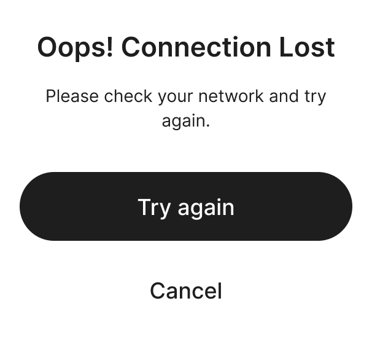
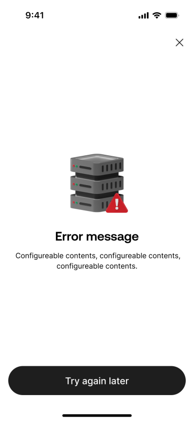
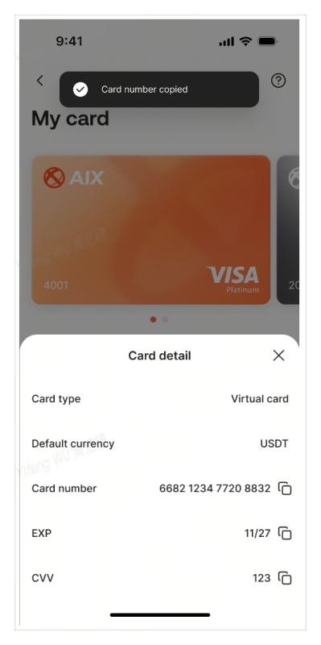
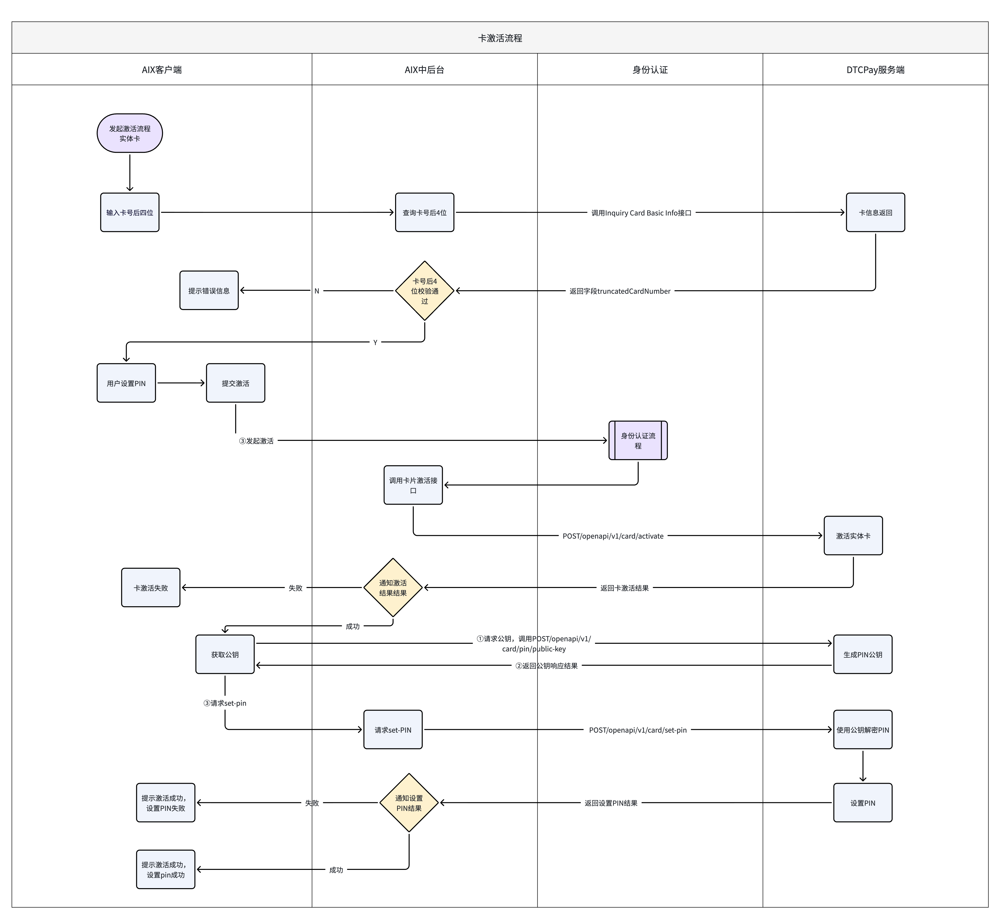
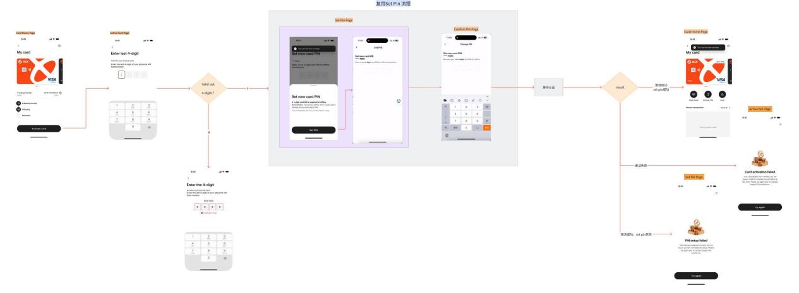
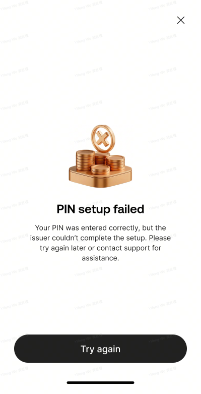
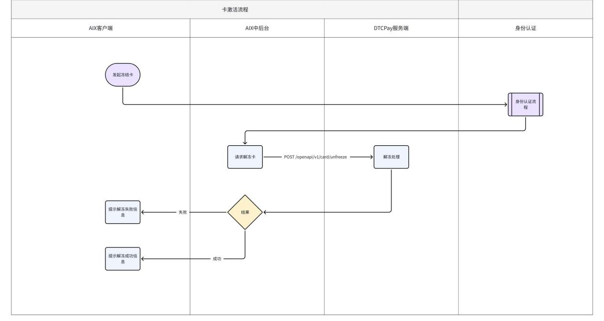
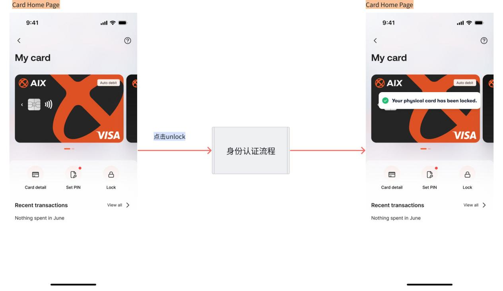

# Card Manage 模块索引

> Source alignment note: 本子模块已按 archive/legacy-prd/card/manage/README.md 与 Security 证据做双向覆盖校验，补齐激活、PIN、敏感信息、状态操作和接口路径缺口。

## 1. 模块定位

`card/manage/` 承接原始 PRD `AIX Card 【manage】模块需求V1.0 .docx` 中的卡管理能力。

Card Manage 只维护卡管理相关事实，不承接申卡、Card Home、Card Transaction 或全局 Transaction & History。

## 2. 当前文件

| 文件 | 状态 | 定位 | 主要来源 |
|---|---|---|---|
| `card/manage/_index.md` | active | Card Manage 索引 | Manage 模块整体 |
| `card/manage/status-and-operations.md` | active | 卡状态、操作限制矩阵、Lock / Unlock / Terminate 边界 | Manage 6.4 / 7.4 / 7.5 |
| `card/manage/activation.md` | active | 实体卡激活、后四位校验、激活后续流转 | Manage 7.2 / DTC Activation |
| `card/manage/sensitive-info.md` | active | Card detail、敏感信息查看、PAN / EXP / CVV / CVC | Manage 7.1 / DTC Sensitive Info |
| `card/manage/pin.md` | active | Set PIN、Change PIN、Reset PIN、OTP 与 PIN 公钥 | Manage 7.3 / DTC PIN APIs |

## 3. 与 Card 其他文件的边界

| 文件 | 关系 | 边界 |
|---|---|---|
| `card/application.md` | 申卡和卡计划 | Manage 不维护申卡流程 |
| `card/card-home.md` | Card 模块首页 | Manage 只维护从 Card Home 进入的管理动作 |
| `card/transaction.md` | Card 交易 | Manage 不维护 Card Transaction Notify 或交易归集 |
| `transaction/*` | 全局交易历史、详情、状态、对账 | Manage 不维护统一交易模块 |

## 4. 查询入口规则

| 查询主题 | 优先读取 |
|---|---|
| 卡状态 / 操作权限 / Lock / Unlock / Terminate 边界 | `card/manage/status-and-operations.md` |
| 实体卡激活 / 后四位校验 | `card/manage/activation.md` |
| PAN / EXP / CVV / CVC / Card detail | `card/manage/sensitive-info.md` |
| Set PIN / Change PIN / Reset PIN / PIN OTP | `card/manage/pin.md` |
| Card 交易通知 / Card 交易展示 | `card/transaction.md` |

## 5. 不写入事实的内容

1. 不把 Card Transaction 写进 Manage。
2. 不把全局 Transaction & History 写进 Manage。
3. 不把 Terminate Card 写成独立 PRD 文件；只作为操作矩阵和待确认边界维护。
4. 不把旧 Card Manage 合并文件 当作运行态入口。

## Source alignment additions

| 文件 | 状态 | 本轮补齐重点 |
|---|---|---|
| activation.md | ALIGNED | 激活后四位校验、激活成功 toast、Active fail / Set fail、autoDebit 删除线边界、接口路径 |
| pin.md | ALIGNED | 6 位 PIN、Set/Change/Confirm 页面、PIN 引导弹窗、身份认证后 set/reset、31031 特殊错误、PIN 简单规则、公钥接口 |
| sensitive-info.md | ALIGNED | Basic/Sensitive Info 字段、复制 toast、接口失败 toast、PAN/expiryDate/cvc 来源 |
| status-and-operations.md | ALIGNED | Freeze/Unfreeze、操作矩阵、网络/服务端错误、锁卡/解锁文案和接口路径 |

## Cross-evidence notes

- Card Manage 的敏感操作依赖 Security 身份认证能力；具体认证方式、锁定、挑战有效期等以 archive/legacy-prd/security/identity-verification/README.md 为准。
- autoDebit 激活入参在 Card Manage 待确认事项中为删除线/已处理项，不作为 confirmed runtime fact 继续扩展。
- 源 PRD 明确“获取公钥调整为激活成功后才获取”；PIN KB 已补齐该规则。

## 6. 来源引用

- (Ref: archive/historical-prd/card/AIX Card 【manage】模块需求V1.0 .docx)
- (Ref: external-docs/dtc/DTC Card Issuing API Document_20260310 (1).docx)
- (Ref: knowledge-base/card/manage/status-and-operations.md)
- (Ref: knowledge-base/card/manage/activation.md)
- (Ref: knowledge-base/card/manage/sensitive-info.md)
- (Ref: knowledge-base/card/manage/pin.md)
- (Ref: knowledge-base/changelog/knowledge-gaps.md)

## Page Visuals 页面图索引

> 本节绑定 converted-prd 中与本文件页面规则相关的页面截图 / 页面组图片，方便查看规则时同步查看页面长什么样。图片仍引用 `archive/legacy-prd` 原始资产，避免重复复制。

### 1. 需求变更日志

_Source: archive/legacy-prd/card/manage/README.md:58_

### 6. 全局规则

_Source: archive/legacy-prd/card/manage/README.md:354_

_Source: archive/legacy-prd/card/manage/README.md:406_

_Source: archive/legacy-prd/card/manage/README.md:448_

_Source: archive/legacy-prd/card/manage/README.md:485_

### Card home

_Source: archive/legacy-prd/card/manage/README.md:545_

_Source: archive/legacy-prd/card/manage/README.md:551_

### 7. 需求描述

_Source: archive/legacy-prd/card/manage/README.md:566_

_Source: archive/legacy-prd/card/manage/README.md:586_

_Source: archive/legacy-prd/card/manage/README.md:645_

_Source: archive/legacy-prd/card/manage/README.md:651_

_Source: archive/legacy-prd/card/manage/README.md:666_

_Source: archive/legacy-prd/card/manage/README.md:1168_

_Source: archive/legacy-prd/card/manage/README.md:1214_

_Source: archive/legacy-prd/card/manage/README.md:1218_

_Source: archive/legacy-prd/card/manage/README.md:1279_

_Source: archive/legacy-prd/card/manage/README.md:1283_

### Card Home

_Source: archive/legacy-prd/card/manage/README.md:761_

_Source: archive/legacy-prd/card/manage/README.md:804_

_Source: archive/legacy-prd/card/manage/README.md:835_

_Source: archive/legacy-prd/card/manage/README.md:1233_
