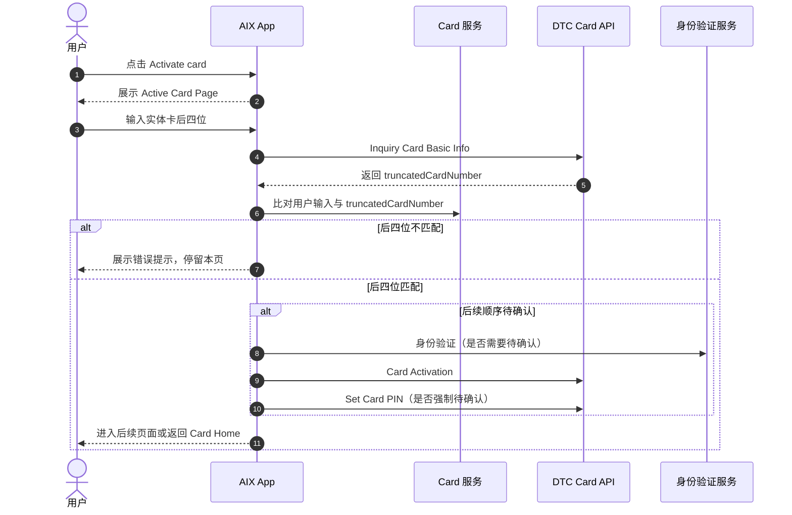
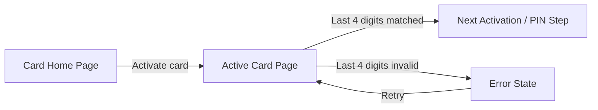

# Physical Card Activation 实体卡激活

## 1. 文档信息

| 项目 | 内容 |
|---|---|
| 功能名称 | Physical Card Activation 实体卡激活 |
| 所属模块 | Card / Manage |
| Owner | 吴忆锋 |
| 版本 | 1.0 |
| 状态 | Review |
| 更新时间 | 2026-05-05 |
| 来源文档 | AIX Card Manage、DTC Card Issuing API、Standard PRD Template v1.3 |

---

## 2. 需求背景、目标与范围

### 2.1 需求背景

实体卡寄送完成后，用户需要在 AIX App 内完成实体卡激活。激活前需校验用户持有实体卡，原文使用实体卡后四位作为校验信息。

### 2.2 用户问题 / 业务问题

如果后四位校验、激活接口、Set PIN 联动和异常处理不清晰，可能导致非本人激活、激活状态不同步或用户无法完成实体卡启用。

### 2.3 需求目标

定义实体卡激活入口、后四位校验、调用 DTC Basic Info 与 Card Activation 的边界，以及后续身份验证 / Set PIN 的待确认事项。

### 2.4 涉及功能清单

| 功能点 | 本期范围 | 优先级 | 状态 | 说明 |
|---|---|---|---|---|
| Activate card 入口 | In Scope | P0 | Confirmed | 待激活实体卡展示入口 |
| 后四位输入与校验 | In Scope | P0 | Confirmed | 输入满 4 位后查询 Basic Info 比对 `truncatedCardNumber` |
| Card Activation API | In Scope | P0 | Open | 激活接口存在，完整顺序待确认 |
| Set PIN 联动 | In Scope | P0 | Open | 激活后是否强制 Set PIN 待确认 |
| OTP for activation | Deferred | P1 | Open | DTC 存在能力，AIX 是否使用待确认 |

---

## 3. 业务流程与规则

### 3.1 业务主流程说明

用户从 Card Home 点击待激活实体卡的 `Activate card`，进入 Active Card Page 输入实体卡后四位。输入满 4 位后，系统调用 Inquiry Card Basic Info，使用返回的 `truncatedCardNumber` 与用户输入比对。比对成功后进入激活、身份验证和 Set PIN 后续流程，具体顺序待确认。

### 3.2 业务时序图

### 3.3 流程步骤与业务规则

| 步骤 | 场景 / 规则 | 触发条件 | 责任方 | 系统处理 | 成功结果 | 失败 / 分支结果 | 来源 |
|---|---|---|---|---|---|---|---|
| 1 | 展示激活入口 | 实体卡待激活 | App / Card | Card Home 展示 Activate card | 用户可进入激活 | 非待激活不展示 | Manage / Home |
| 2 | 输入后四位 | 用户进入 Active Card Page | 用户 / App | 用户输入 4 位数字 | 满 4 位后触发校验 | 不满 4 位不继续 | Manage 7.2 |
| 3 | 查询 Basic Info | 输入满 4 位 | App / DTC | 调用 Inquiry Card Basic Info | 返回 `truncatedCardNumber` | 查询失败展示异常 | DTC |
| 4 | 后四位比对 | Basic Info 返回 | App / Card | 比对输入与 `truncatedCardNumber` | 进入后续流程 | 不一致提示错误 | Manage 7.2 |
| 5 | Card Activation | 后四位匹配 | App / DTC | 调用 Card Activation | 实体卡激活 | 失败保持待激活 | DTC |
| 6 | Set PIN 联动 | 激活成功或激活前后 | App / DTC | 是否强制 Set PIN 待确认 | PIN 设置成功 | 可跳过与否待确认 | Manage / DTC |

### 3.4 状态规则

| 状态 | 含义 | 触发条件 | 用户可见表现 | 系统处理 | 可迁移到 | 是否终态 | 来源 |
|---|---|---|---|---|---|---|---|
| Pending activation / Inactive | 实体卡待激活 | 实体卡审核通过但未激活 | 展示 Activate card | 允许进入激活 | Active | 否 | Application / Home |
| Active / ACTIVE | 已激活 | 激活成功 | 展示卡面和可用操作 | 启用后续管理操作 | Suspended / Cancelled | 否 | Manage |
| 激活失败 | 激活接口失败 | DTC 返回失败 | 停留或回到待激活状态 | 不更新为 Active | 待激活 | 否 | DTC |

### 3.5 业务级异常与失败处理

| 异常场景 | 触发条件 | 错误来源 | 错误码 / 原因 | 用户表现 | 系统处理 | 是否可重试 | 最终状态 |
|---|---|---|---|---|---|---|---|
| 后四位不一致 | 输入与 `truncatedCardNumber` 不匹配 | App / DTC | 校验失败 | `The last 4 digits entered are invalid` | 停留 Active Card Page | 是 | 待激活 |
| Basic Info 查询失败 | 查询卡基础信息失败 | DTC / Network | 接口失败 | Network Error / Server Error | 关闭后回本页并清空输入 | 是 | 待激活 |
| Activation 失败 | 激活接口失败 | DTC | 接口失败 | 激活失败提示待确认 | 保持待激活 | 是 | 待激活 |
| Set PIN 失败 | 激活后设置 PIN 失败 | DTC / Security | 接口或认证失败 | 按 PIN 规则提示 | PIN 状态不更新 | 是 | 待确认 |

---

## 4. 页面与交互说明

### 4.1 页面关系总览图

### 4.2 Active Card Page

| 区块 | 内容 |
|---|---|
| 页面类型 | 主页面 / 表单页面 |
| 页面目标 | 通过实体卡后四位校验用户持有实体卡 |
| 入口 / 触发 | Card Home 点击待激活实体卡的 Activate card |
| 展示内容 | 标题 `Enter last 4 digits`；说明 `Enter the last 4-digit of your physical AIX Card number`；4 位输入框 |
| 用户动作 | 输入实体卡后四位、返回 |
| 系统处理 / 责任方 | 输入满 4 位后调用 Inquiry Card Basic Info，读取 `truncatedCardNumber` 比对 |
| 元素 / 状态 / 提示规则 | 4 位输入完成后触发校验；校验失败提示 `The last 4 digits entered are invalid`；Loading 中禁止重复提交 |
| 成功流转 | 进入身份验证 / Card Activation / Set PIN 后续流程，顺序待确认 |
| 失败 / 异常流转 | Network Error / Server Error，关闭后回本页并清空输入 |
| 备注 / 边界 | 不应只使用本地缓存 `truncatedCardNumber` 比对 |

---

## 5. 字段、接口与数据

| 类型 | 名称 | 所属系统 | 来源 | 用途 | 规则 / 输入输出 | 异常处理 |
|---|---|---|---|---|---|---|
| 字段 | `truncatedCardNumber` | DTC | Inquiry Card Basic Info | 激活时校验后四位 | 与用户输入 4 位比对 | 不一致提示错误 |
| 字段 | `autoDebitEnabled` | AIX / DTC | Application / DTC | 自动扣款 | 产品 `2/ON` 与 DTC `1/ON` 冲突，待确认 | 不写成已确认映射 |
| 接口 | Inquiry Card Basic Info | DTC | DTC Card API | 查询实体卡后四位等基础信息 | 输入满 4 位后调用 | 查询失败展示异常 |
| 接口 | Card Activation | DTC | DTC Card API | 激活实体卡 | 入参与顺序待确认 | 失败保持待激活 |
| 接口 | Sent OTP For Card Activation | DTC | DTC Card API | 激活 OTP | AIX 是否使用待确认 | 不写成当前事实 |

---

## 6. 通知规则（如适用）

| 触发事件 | 通知渠道 | 通知对象 | 文案 / 模板 | 跳转目标 | 失败 / 补发规则 |
|---|---|---|---|---|---|
| 实体卡激活成功 | 不适用 | 持卡用户 | 当前事实未定义 Push / In-app 通知 | Card Home / PIN 后续页 | 不适用 |

---

## 7. 权限 / 合规 / 风控（如适用）

| 类型 | 规则 | 影响 | 来源 |
|---|---|---|---|
| 用户权限 | 仅待激活实体卡可进入激活流程 | 防止错误状态激活 | Manage / Home |
| 安全 | 后四位校验用于证明用户持有实体卡 | 防止非本人激活 | Manage 7.2 |
| 风控 | 不得只用本地缓存校验后四位 | 防止脏数据或旧数据误激活 | DTC Basic Info |

---

## 8. 待确认事项

| 问题 | 影响范围 | 当前处理 | 是否阻塞验收 | 建议确认人 |
|---|---|---|---|---|
| 实体卡激活完整顺序是 Last4 → Face Auth → Activation → Set PIN，还是 Last4 → Set PIN → Activation | Activation / PIN / Security | 阻塞 | 是 | PM / BE / Security |
| 激活成功后 Set PIN 是否强制，用户是否可跳过 | Activation / PIN / Home | 阻塞 | 是 | PM / Design / BE |
| `autoDebitEnabled` 产品 `2/ON` 与 DTC `1/ON` 如何映射 | Application / Activation / Home | 阻塞 | 是 | PM / BE / DTC |
| 是否使用 DTC Sent OTP For Card Activation | Activation / Security | 不阻塞 / Deferred | 否 | PM / BE / DTC |

---

## 9. 验收标准 / 测试场景

### 9.1 验收标准

| 验收场景 | 验收标准 |
|---|---|
| 正常流程 | 待激活实体卡输入正确后四位后进入后续激活流程 |
| 异常流程 | 后四位错误、Basic Info 失败、Activation 失败均不更新为 Active |
| 页面展示 | Active Card Page 展示标题、说明和 4 位输入框 |
| 系统交互 | 输入满 4 位后调用 Basic Info 并比对 `truncatedCardNumber` |
| 通知 | 当前不定义激活通知 |
| 数据 / 埋点 | 后四位校验结果和接口失败可追踪 |

### 9.2 测试场景矩阵

| 场景 | 前置条件 | 用户操作 | 预期页面表现 | 预期系统结果 | 是否必测 |
|---|---|---|---|---|---|
| 正确后四位 | 实体卡待激活 | 输入正确后四位 | 进入后续流程 | 校验通过 | 是 |
| 错误后四位 | 实体卡待激活 | 输入错误后四位 | 展示错误文案 | 不继续激活 | 是 |
| Basic Info 失败 | 网络或 DTC 异常 | 输入满 4 位 | 展示异常 | 不继续激活 | 是 |
| 非待激活状态 | ACTIVE / SUSPENDED 卡 | 尝试进入激活 | 不展示入口 | 不调用接口 | 是 |

---

## 10. 来源引用

- (Ref: 历史prd/AIX Card 【manage】模块需求V1.0 .docx / 7.2 / V1.0)
- (Ref: DTC Card Issuing API Document_20260310 / Inquiry Card Basic Info / Card Activation / Sent OTP For Card Activation)
- (Ref: knowledge-base/card/manage/status-and-operations.md)
- (Ref: prd-template/standard-prd-template.md / v1.3)
