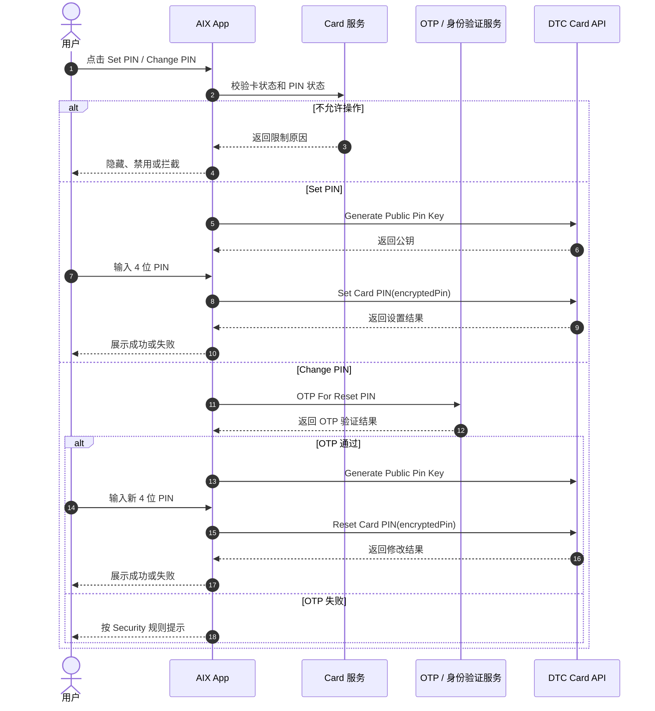

# Card PIN 卡 PIN 设置与修改

## 1. 文档信息

| 项目 | 内容 |
|---|---|
| 功能名称 | Card PIN 卡 PIN 设置与修改 |
| 所属模块 | Card / Manage |
| Owner | 吴忆锋 |
| 版本 | 1.0 |
| 状态 | Review |
| 更新时间 | 2026-05-05 |
| 来源文档 | AIX Card Manage、DTC Card Issuing API、Security OTP、Standard PRD Template v1.3 |

---

## 2. 需求背景、目标与范围

### 2.1 需求背景

实体卡激活或使用过程中，用户需要设置或修改卡 PIN。PIN 属于敏感安全信息，需要通过公钥加密、OTP 等安全能力保护。

### 2.2 用户问题 / 业务问题

如果 Set PIN、Change PIN、Reset PIN 的入口、状态、认证和字段不清晰，可能造成用户无法完成实体卡使用，或 PIN 明文、错误字段、错误接口导致安全和联调问题。

### 2.3 需求目标

定义 Set PIN、Change PIN / Reset PIN 的入口、业务流程、安全校验、字段、接口、异常处理和验收场景。

### 2.4 涉及功能清单

| 功能点 | 本期范围 | 优先级 | 状态 | 说明 |
|---|---|---|---|---|
| Set PIN | In Scope | P0 | Confirmed | ACTIVE 实体卡且未设置 PIN 时可设置 |
| Change PIN / Reset PIN | In Scope | P0 | Confirmed | ACTIVE 实体卡且已设置 PIN 时可修改 |
| Generate Public Pin Key | In Scope | P0 | Open | 响应字段和加密算法待确认 |
| OTP For Reset PIN | In Scope | P0 | Open | Change PIN 前需要 OTP，失败规则联动 Security |
| PIN 失败规则 | Deferred | P1 | Open | 尝试次数、锁定规则、错误文案待确认 |

---

## 3. 业务流程与规则

### 3.1 业务主流程说明

系统根据卡状态和 PIN 设置状态决定展示 `Set PIN` 或 `Change PIN`。首次设置 PIN 时，系统先获取 Public Pin Key，再提交加密后的 `encryptedPin`。修改 PIN 时，用户先完成 OTP For Reset PIN，再获取 Public Pin Key 并调用 Reset Card PIN。

### 3.2 业务时序图

### 3.3 流程步骤与业务规则

| 步骤 | 场景 / 规则 | 触发条件 | 责任方 | 系统处理 | 成功结果 | 失败 / 分支结果 | 来源 |
|---|---|---|---|---|---|---|---|
| 1 | 判断 PIN 入口 | 进入 Card Home | App / Card | 根据卡状态和 PIN 状态展示 Set / Change | 展示对应入口 | 非 ACTIVE 不展示 | Manage 7.3 |
| 2 | Set PIN | ACTIVE 且未设置 PIN | App / DTC | 获取公钥并提交 `encryptedPin` | PIN 设置成功 | 失败保持未设置 | DTC PIN |
| 3 | Change PIN | ACTIVE 且已设置 PIN | App / Security / DTC | 先 OTP，再公钥，再 Reset | PIN 修改成功 | OTP 或接口失败保持原 PIN | Manage 7.3 |
| 4 | 加密提交 | 用户提交 PIN | App / DTC | 使用 Public Pin Key 加密 | 提交 `encryptedPin` | 公钥失败则不可提交 | DTC PIN |

### 3.4 状态规则

| 状态 | 含义 | 触发条件 | 用户可见表现 | 系统处理 | 可迁移到 | 是否终态 | 来源 |
|---|---|---|---|---|---|---|---|
| 未设置 PIN | ACTIVE 实体卡首次使用 | 实体卡激活后或首次设置前 | 展示 Set PIN | 允许 Set Card PIN | 已设置 PIN | 否 | Manage 7.3 |
| 已设置 PIN | PIN 已存在 | Set PIN 成功 | 展示 Change PIN | 允许 Reset Card PIN | 已设置 PIN | 否 | Manage 7.3 |
| 非 ACTIVE | 不允许 PIN 操作 | 卡不处于 ACTIVE | 不展示或禁用入口 | 不调用 PIN 接口 | 原状态 | 否 | Manage 6.4 |

### 3.5 业务级异常与失败处理

| 异常场景 | 触发条件 | 错误来源 | 错误码 / 原因 | 用户表现 | 系统处理 | 是否可重试 | 最终状态 |
|---|---|---|---|---|---|---|---|
| 状态不允许 | 非 ACTIVE 点击 PIN | Card | 权限限制 | 不展示或拦截 | 不调用接口 | 否 | 原状态 |
| OTP 失败 | Change PIN 前 OTP 不通过 | Security | OTP 失败 | 按 Security 规则提示 | 不继续 Reset | 视规则 | 原 PIN |
| Public Pin Key 失败 | 获取公钥失败 | DTC / Network | 接口失败 | 失败提示待确认 | 不允许提交 PIN | 是 | 原状态 |
| Set Card PIN 失败 | 提交 Set 失败 | DTC | 接口失败 | 失败提示待确认 | 保持未设置 | 是 | 未设置 PIN |
| Reset Card PIN 失败 | 提交 Reset 失败 | DTC | 接口失败 | 失败提示待确认 | 保持原 PIN | 是 | 已设置 PIN |

---

## 4. 页面与交互说明

### 4.1 页面关系总览图

### 4.2 Set PIN Page

| 区块 | 内容 |
|---|---|
| 页面类型 | 主页面 / 表单页面 |
| 页面目标 | 首次设置实体卡 PIN |
| 入口 / 触发 | ACTIVE 实体卡且未设置 PIN 时点击 Set PIN |
| 展示内容 | 4 位 PIN 输入框、提交按钮、安全提示 |
| 用户动作 | 输入 4 位 PIN 并提交 |
| 系统处理 / 责任方 | 获取 Public Pin Key，加密后调用 Set Card PIN |
| 元素 / 状态 / 提示规则 | 仅 4 位数字可提交；提交中禁止重复提交 |
| 成功流转 | 返回 Card Home，PIN 状态更新 |
| 失败 / 异常流转 | 公钥或 Set 失败时停留当前流程 |
| 备注 / 边界 | 不得存储明文 PIN |

### 4.3 Change PIN Page

| 区块 | 内容 |
|---|---|
| 页面类型 | 主页面 / 表单页面 |
| 页面目标 | 修改或重置实体卡 PIN |
| 入口 / 触发 | ACTIVE 实体卡且已设置 PIN 时点击 Change PIN |
| 展示内容 | OTP 验证页、新 PIN 输入页 |
| 用户动作 | 完成 OTP，输入新 4 位 PIN 并提交 |
| 系统处理 / 责任方 | OTP 通过后获取 Public Pin Key，加密后调用 Reset Card PIN |
| 元素 / 状态 / 提示规则 | OTP 错误按 Security 规则处理；新 PIN 仅 4 位数字可提交 |
| 成功流转 | 返回 Card Home，PIN 更新成功 |
| 失败 / 异常流转 | OTP、公钥或 Reset 失败时停留对应流程 |
| 备注 / 边界 | 当前事实未说明是否需要旧 PIN，不得补写 |

---

## 5. 字段、接口与数据

| 类型 | 名称 | 所属系统 | 来源 | 用途 | 规则 / 输入输出 | 异常处理 |
|---|---|---|---|---|---|---|
| 字段 | `encryptedPin` | DTC | DTC PIN API | 提交加密 PIN | Set / Reset PIN 均使用该字段 | 字段错误会导致接口失败 |
| 接口 | Generate Public Pin Key | DTC | DTC PIN API | 获取 PIN 加密公钥 | Set / Reset 前调用 | 失败不可提交 PIN |
| 接口 | Set Card PIN | DTC | DTC PIN API | 首次设置 PIN | 提交 `encryptedPin` | 失败保持未设置 |
| 接口 | OTP For Reset PIN | DTC / Security | DTC PIN API / Security | Change PIN 前认证 | 按 Security OTP 规则 | 失败不继续 |
| 接口 | Reset Card PIN | DTC | DTC PIN API | 修改 / 重置 PIN | 前端显示 Change PIN | 失败保持原 PIN |

---

## 6. 通知规则（如适用）

不适用。当前事实未定义 PIN 设置或重置的用户 Push / In-app 通知。

| 触发事件 | 通知渠道 | 通知对象 | 文案 / 模板 | 跳转目标 | 失败 / 补发规则 |
|---|---|---|---|---|---|
| 不适用 | 不适用 | 不适用 | 不适用 | 不适用 | 不适用 |

---

## 7. 权限 / 合规 / 风控（如适用）

| 类型 | 规则 | 影响 | 来源 |
|---|---|---|---|
| 用户权限 | 仅 ACTIVE 实体卡允许 PIN 操作 | 防止错误状态操作 | Manage 6.4 |
| PIN 安全 | PIN 必须加密后提交，不得持久化明文 | 防止 PIN 泄露 | DTC PIN API |
| 身份验证 | Change PIN 前需 OTP | 防止非本人修改 PIN | Manage 7.3 / Security |

---

## 8. 待确认事项

| 问题 | 影响范围 | 当前处理 | 是否阻塞验收 | 建议确认人 |
|---|---|---|---|---|
| Public Pin Key 响应字段、加密算法、`encryptedPin` 结构 | PIN / Security / DTC | 阻塞 | 是 | BE / DTC / Security |
| PIN 失败提示文案、尝试次数、锁定规则 | PIN / Security | 不阻塞 / Deferred | 否 | PM / Security |
| Change PIN 是否需要旧 PIN | PIN | 不阻塞 / Deferred | 否 | PM / BE / DTC |
| Set PIN 与实体卡激活流程的先后关系 | Activation / PIN | 阻塞 | 是 | PM / BE |

---

## 9. 验收标准 / 测试场景

### 9.1 验收标准

| 验收场景 | 验收标准 |
|---|---|
| 正常流程 | ACTIVE 实体卡可设置或修改 PIN |
| 异常流程 | 非 ACTIVE、OTP 失败、公钥失败、Set / Reset 失败均不错误更新 PIN 状态 |
| 页面展示 | Set PIN、Change PIN、OTP 页面按状态展示 |
| 系统交互 | PIN 提交必须使用 `encryptedPin` |
| 通知 | PIN 设置 / 修改不定义通知 |
| 数据 / 埋点 | PIN 操作结果和失败原因可追踪 |

### 9.2 测试场景矩阵

| 场景 | 前置条件 | 用户操作 | 预期页面表现 | 预期系统结果 | 是否必测 |
|---|---|---|---|---|---|
| 首次 Set PIN | ACTIVE 且未设置 PIN | 输入 4 位 PIN 提交 | 设置成功 | Set Card PIN 成功 | 是 |
| Change PIN | ACTIVE 且已设置 PIN | OTP 通过后输入新 PIN | 修改成功 | Reset Card PIN 成功 | 是 |
| OTP 失败 | 已设置 PIN | OTP 失败 | 按 Security 规则提示 | 不调用 Reset | 是 |
| 公钥失败 | 进入 Set / Change | 获取公钥失败 | 失败提示 | 不提交 PIN | 是 |
| 非 ACTIVE 操作 | 非 ACTIVE 卡 | 尝试 PIN 操作 | 不展示或拦截 | 不调用 PIN 接口 | 是 |

---

## 10. 来源引用

- (Ref: 历史prd/AIX Card 【manage】模块需求V1.0 .docx / 7.3 / V1.0)
- (Ref: DTC Card Issuing API Document_20260310 / Generate Public Pin Key / Set Card PIN / Reset Card PIN / OTP For Reset PIN)
- (Ref: knowledge-base/security/otp-verification.md)
- (Ref: knowledge-base/card/manage/status-and-operations.md)
- (Ref: prd-template/standard-prd-template.md / v1.3)
