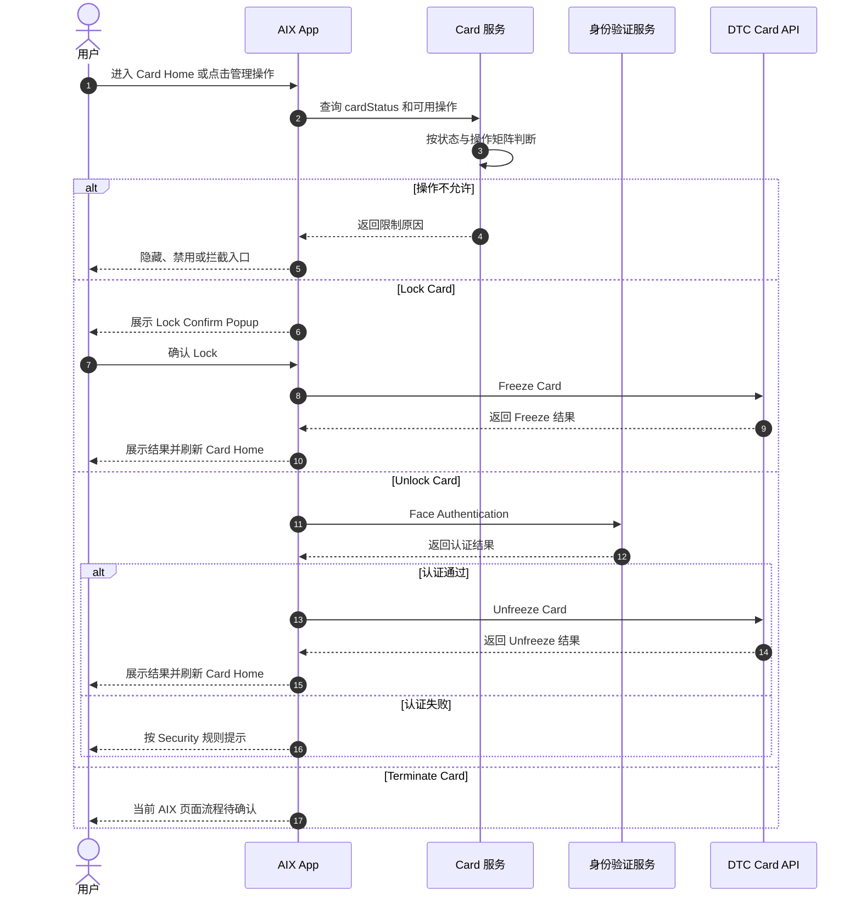
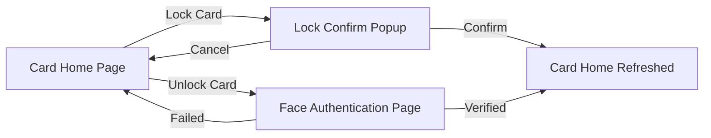

# Card Status & Operations 卡状态与操作

## 1. 文档信息

| 项目 | 内容 |
|---|---|
| 功能名称 | Card Status & Operations 卡状态与操作 |
| 所属模块 | Card / Manage |
| Owner | 吴忆锋 |
| 版本 | 1.0 |
| 状态 | Review |
| 更新时间 | 2026-05-05 |
| 来源文档 | AIX Card Manage、DTC Card Issuing API、Standard PRD Template v1.3 |

---

## 2. 需求背景、目标与范围

### 2.1 需求背景

Card Manage 下的多个操作依赖统一的卡状态和操作权限判断，包括查看卡信息、查看敏感信息、实体卡激活、PIN、Lock、Unlock、注销卡和交易能力。

### 2.2 用户问题 / 业务问题

如果各功能各自维护卡状态和操作限制，容易出现入口展示、接口调用、用户提示和风险边界不一致。

### 2.3 需求目标

本文统一维护 Card Manage 的状态清单、操作限制矩阵、Lock / Unlock / Terminate 的业务边界，并作为 Activation、Sensitive Info、PIN 和 Card Home 的公共规则源。

### 2.4 涉及功能清单

| 功能点 | 本期范围 | 优先级 | 状态 | 说明 |
|---|---|---|---|---|
| 卡状态清单 | In Scope | P0 | Confirmed | 统一 Manage / Application / Home 中出现的卡状态 |
| 操作限制矩阵 | In Scope | P0 | Confirmed | 引用 Manage 6.4 |
| Lock Card | In Scope | P0 | Confirmed | ACTIVE 卡允许 Lock，调用 Freeze Card |
| Unlock Card | In Scope | P0 | Confirmed | SUSPENDED 卡允许 Unlock，需身份验证 |
| Terminate Card | In Scope | P0 | Open | DTC 有能力；AIX 页面流程待确认，不单独建 PRD |

---

## 3. 业务流程与规则

### 3.1 业务主流程说明

用户进入 Card Home 或触发卡管理操作时，AIX 根据卡状态和操作矩阵决定是否展示入口、允许点击、发起身份验证或调用 DTC 操作接口。

### 3.2 业务时序图

### 3.3 流程步骤与业务规则

| 步骤 | 场景 / 规则 | 触发条件 | 责任方 | 系统处理 | 成功结果 | 失败 / 分支结果 | 来源 |
|---|---|---|---|---|---|---|---|
| 1 | 查询卡状态 | 用户进入 Card Home 或触发操作 | App / Card | 获取并归一 `cardStatus` | 返回展示组 | 未知状态进入待确认 | Manage / Application |
| 2 | 判断操作权限 | 用户点击 Card detail / PIN / Lock / Unlock / Activate | Card | 按 Manage 6.4 矩阵判断 | 放行操作 | 隐藏、禁用或拦截 | Manage 6.4 |
| 3 | Lock Card | ACTIVE 卡点击 Lock | App / DTC | 用户确认后调用 Freeze Card | 卡进入 SUSPENDED | 取消不调用；失败保持 ACTIVE | Manage 7.4 |
| 4 | Unlock Card | SUSPENDED 卡点击 Unlock | App / Security / DTC | 认证通过后调用 Unfreeze Card | 卡恢复 Active | 认证失败或接口失败保持 SUSPENDED | Manage 7.5 |
| 5 | Terminate Card | 符合矩阵的注销操作 | App / DTC | DTC 存在能力，但 AIX 页面流程待确认 | 待确认 | 不写成当前完整页面功能 | Manage 6.4 / DTC |

### 3.4 状态规则

| 状态 | 含义 | 触发条件 | 用户可见表现 | 系统处理 | 可迁移到 | 是否终态 | 来源 |
|---|---|---|---|---|---|---|---|
| Pending / Processing | 申卡审核中 | 申卡提交后待处理 | Under review | 禁止重复申请和卡管理操作 | Active / Pending activation / Cancelled | 否 | Application |
| Pending activation / Inactive | 实体卡待激活 | 实体卡审核通过但未激活 | 展示物流与 Activate card | 仅允许激活 | Active | 否 | Application / Home |
| Active / ACTIVE | 已激活 / 可用 | 虚拟卡生效或实体卡激活 | 展示卡面和可用操作 | 允许敏感信息、PIN、Lock、交易、注销 | Suspended / Cancelled | 否 | Manage 6.4 |
| Suspended / SUSPENDED | 已冻结 | Freeze Card 成功 | 展示已冻结 | 允许 Unlock 和注销，不允许交易 | Active / Cancelled | 否 | Manage 6.4 |
| BLOCKED | 阻断状态 | 外部或风控状态 | 仅允许查看卡信息 | 禁止敏感信息和交易 | 待确认 | 否 | Manage 6.4 |
| CANCELLED | 取消 / 终止 | 申请失败或卡取消 | 不允许操作 | 终态 | 不适用 | 是 | Manage 6.4 |
| Terminated | 终止 | Application 中审核失败 / 终止 | 不明确 | 与 Cancelled / BLOCKED 关系待确认 | 不适用 | 待确认 | Application |
| Activate | 疑似 Active 拼写 | Unlock 成功原文写法 | 不作为独立状态 | 待确认是否拼写问题 | Active | 否 | Manage 7.5 |

#### Manage 6.4 状态与操作限制矩阵

| 卡状态 | 查看卡信息 | 查看敏感信息 | 卡激活 | Set PIN | Change PIN | Lock Card | Unlock Card | 注销卡 | 交易功能 |
|---|---|---|---|---|---|---|---|---|---|
| 待激活 | 否 | 否 | 是 | 否 | 否 | 否 | 否 | 否 | 否 |
| ACTIVE | 是 | 是 | 否 | 是，仅限首次 | 是 | 是 | 否 | 是 | 是 |
| SUSPENDED | 否 | 否 | 否 | 否 | 否 | 否 | 是 | 是 | 否 |
| CANCELLED | 否 | 否 | 否 | 否 | 否 | 否 | 否 | 否 | 否 |
| BLOCKED | 是 | 否 | 否 | 否 | 否 | 否 | 否 | 否 | 否 |
| PENDING | 否 | 否 | 否 | 否 | 否 | 否 | 否 | 否 | 否 |

### 3.5 业务级异常与失败处理

| 异常场景 | 触发条件 | 错误来源 | 错误码 / 原因 | 用户表现 | 系统处理 | 是否可重试 | 最终状态 |
|---|---|---|---|---|---|---|---|
| 未知卡状态 | 返回未收录状态 | Backend / DTC | 状态缺失 | 不展示高风险操作 | 记录待确认，不默认放行 | 否 | 待确认 |
| 状态不允许操作 | 操作矩阵不允许 | Card | 权限限制 | 隐藏、禁用或拦截 | 不调用操作接口 | 否 | 原状态 |
| Freeze Card 失败 | Lock 调用失败 | DTC / Network | 接口失败 | Freeze failed 或全局异常 | 保持 ACTIVE | 是 | ACTIVE |
| Unfreeze Card 失败 | Unlock 调用失败 | DTC / Network | 接口失败 | Unfreeze failed 或全局异常 | 保持 SUSPENDED | 是 | SUSPENDED |
| 认证失败 | Unlock 前认证失败 | Security | 认证失败 | 按 Security 规则提示 | 不调用 Unfreeze | 视规则 | SUSPENDED |

---

## 4. 页面与交互说明

### 4.1 页面关系总览图

### 4.2 Lock Confirm Popup / Unlock Authentication

| 区块 | 内容 |
|---|---|
| 页面类型 | Popup / 身份验证页面 |
| 页面目标 | 锁卡或解锁卡 |
| 入口 / 触发 | Card Home 点击 Lock Card 或 Unlock Card |
| 展示内容 | Lock 确认弹窗；Unlock 身份验证流程 |
| 用户动作 | Lock 点击 YES / NO；Unlock 完成 Face Authentication |
| 系统处理 / 责任方 | Lock 调用 Freeze Card；Unlock 认证后调用 Unfreeze Card |
| 元素 / 状态 / 提示规则 | Lock 成功 Toast：`Your physical card has been locked.`；Unlock 成功 Toast：`Your physical card has been unlocked.` |
| 成功流转 | 返回 Card Home 并刷新状态 |
| 失败 / 异常流转 | Freeze / Unfreeze failed 或全局异常 |
| 备注 / 边界 | 成功文案写 physical card，是否适用于 virtual card 待确认 |

---

## 5. 字段、接口与数据

| 类型 | 名称 | 所属系统 | 来源 | 用途 | 规则 / 输入输出 | 异常处理 |
|---|---|---|---|---|---|---|
| 字段 | `cardStatus` | AIX / DTC | Application / Manage | 判断展示组和操作权限 | 引用状态表和操作矩阵 | 未知状态进入待确认 |
| 接口 | Freeze Card | DTC | DTC Card API | Lock Card | ACTIVE 卡确认后调用 | 失败保持 ACTIVE |
| 接口 | Unfreeze Card | DTC | DTC Card API | Unlock Card | SUSPENDED 卡认证后调用 | 失败保持 SUSPENDED |
| 接口 | Terminate Card | DTC | DTC Card API | 注销卡 | AIX 页面流程待确认 | 不直接落实现 |

---

## 6. 通知规则（如适用）

| 触发事件 | 通知渠道 | 通知对象 | 文案 / 模板 | 跳转目标 | 失败 / 补发规则 |
|---|---|---|---|---|---|
| Lock 成功 | 不适用 | 持卡用户 | 页面 Toast，不是通知 | Card Home | 不适用 |
| Unlock 成功 | 不适用 | 持卡用户 | 页面 Toast，不是通知 | Card Home | 不适用 |
| Terminate 成功 | 待确认 | 持卡用户 | 待确认 | 待确认 | 待确认 |

---

## 7. 权限 / 合规 / 风控（如适用）

| 类型 | 规则 | 影响 | 来源 |
|---|---|---|---|
| 用户权限 | 操作能力受 Manage 6.4 状态矩阵控制 | 防止非法操作 | Manage 6.4 |
| 身份验证 | Unlock 需要身份验证 | 防止非本人解锁卡 | Manage 7.5 / Security |
| 风控 | BLOCKED 状态只允许查看卡信息，不允许交易或敏感信息 | 防止风险卡继续使用 | Manage 6.4 |

---

## 8. 待确认事项

| 问题 | 影响范围 | 当前处理 | 是否阻塞验收 | 建议确认人 |
|---|---|---|---|---|
| Terminate Card 的 AIX 入口、确认弹窗、认证方式、请求字段、成功失败文案、注销后状态 | Manage / DTC | 阻塞 | 是 | PM / Design / BE |
| `Activate` 是否为 `Active` 拼写问题 | Management / Home | 不阻塞 | 否 | PM / BE |
| `BLOCKED` 状态仅可查看卡信息时具体可见字段 | Status / Sensitive Info | 不阻塞 / Deferred | 否 | PM / BE |
| 成功 Toast 中 physical card 文案是否适用于 virtual card | Lock / Unlock | 不阻塞 | 否 | PM / Design |

---

## 9. 验收标准 / 测试场景

### 9.1 验收标准

| 验收场景 | 验收标准 |
|---|---|
| 正常流程 | ACTIVE 卡可 Lock；SUSPENDED 卡可 Unlock；状态矩阵限制正确 |
| 异常流程 | 非允许状态、认证失败、接口失败均不错误更新状态 |
| 页面展示 | 操作入口按卡状态展示或隐藏 |
| 系统交互 | Freeze / Unfreeze 调用边界明确 |
| 通知 | Lock / Unlock 使用页面 Toast，不写成 Push / In-app 通知 |
| 数据 / 埋点 | `cardStatus` 作为操作判断核心字段 |

### 9.2 测试场景矩阵

| 场景 | 前置条件 | 用户操作 | 预期页面表现 | 预期系统结果 | 是否必测 |
|---|---|---|---|---|---|
| ACTIVE Lock | ACTIVE 卡 | 点击 Lock 并确认 | 展示 locked Toast | Freeze 成功，状态 SUSPENDED | 是 |
| Lock 取消 | ACTIVE 卡 | 点击 Lock 后取消 | 返回 Card Home | 不调用 Freeze | 是 |
| SUSPENDED Unlock | SUSPENDED 卡 | 点击 Unlock 并认证通过 | 展示 unlocked Toast | Unfreeze 成功，状态 Active | 是 |
| Unlock 认证失败 | SUSPENDED 卡 | Face Auth 失败 | 按 Security 规则提示 | 不调用 Unfreeze | 是 |
| PENDING 卡操作 | PENDING 卡 | 尝试卡管理操作 | 不展示或不可点击 | 不调用操作接口 | 是 |

---

## 10. 来源引用

- (Ref: 历史prd/AIX Card 【manage】模块需求V1.0 .docx / 6.4 / 7.4 / 7.5 / V1.0)
- (Ref: DTC Card Issuing API Document_20260310 / Freeze / Unfreeze / Terminate)
- (Ref: knowledge-base/changelog/knowledge-gaps.md)
- (Ref: prd-template/standard-prd-template.md / v1.3)
